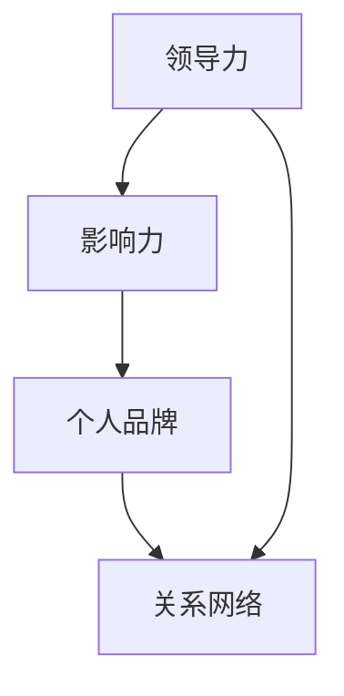

                 

### 引言：领导力与影响力的本质

在当今快速变化和高度竞争的商业环境中，领导力和影响力已成为个人和组织成功的关键因素。领导力与影响力密不可分，它们共同构成了一个强大而有效的个人能力框架。本文旨在探讨领导力与影响力的本质，它们之间的关系，以及如何通过扩大个人影响圈来提升这些能力。

首先，我们需要明确领导力和影响力的定义。领导力是一种引导和激励他人实现共同目标的能力，它涉及到战略思考、决策制定、团队建设以及个人成长等多个方面。领导力不仅仅是关于职位或权威，而是一种通过价值观、愿景和行动来影响他人和行为的能力。另一方面，影响力则是一种在没有任何正式职位或权威的情况下，通过说服、情感共鸣或榜样力量来引导他人决策和行动的能力。

领导力与影响力之间的关系可以理解为相互促进和互补的。领导力提供了一个框架和结构，而影响力则是在这个框架内发挥作用的力量。例如，一个领导者可能拥有明确的愿景和战略计划，但如果没有影响力，这些计划可能难以得到实施。同样，一个拥有强大影响力的人可能在某些情况下缺乏领导力，无法提供指导或做出决策。

为了更好地理解领导力与影响力，我们可以借助一个简单的 Mermaid 流程图来展示它们之间的关系：



在这个流程图中，领导力和影响力相互连接，共同构建了个人品牌和关系网络。个人品牌和关系网络是扩大个人影响圈的重要基础。个人品牌是指个人在公众心中的形象和认知，而关系网络则是个人与他人之间的互动和联系。

在接下来的章节中，我们将深入探讨领导力的理论、影响力的策略、实际应用以及它们在个人成长中的重要性。通过这些讨论，我们将了解如何通过扩大个人影响圈来提升领导力和影响力，最终实现个人和组织的成功。

### 领导力理论

领导力的发展历程是一个从经验到科学，再到实践的演变过程。早期关于领导力的研究主要集中在领导特质论和行为论上。领导特质论认为领导者具有特定的性格特质，如自信、决断力和远见，这些特质是领导力的关键因素。然而，行为论则强调领导者通过具体行为来影响他人，无论领导者本身是否具备特定的特质。随着研究的发展，现代领导力理论更加注重情境因素和领导风格。

#### 领导力的核心要素

领导力的核心要素包括以下几个方面：

1. **愿景与目标**：领导者必须能够清晰地描述组织的未来愿景和目标，并使团队成员对此产生共鸣。这有助于凝聚团队力量，共同向目标努力。

2. **沟通能力**：领导者需要具备出色的沟通能力，能够有效地传达信息、倾听他人意见以及处理冲突。

3. **决策能力**：领导者在面对复杂问题时能够快速做出明智的决策，并在决策过程中考虑团队成员的利益和意见。

4. **激励与鼓舞**：领导者需要能够激励和鼓舞团队成员，让他们在困难面前保持积极和乐观的态度。

5. **自我管理**：领导者需要具备自我管理的能力，包括时间管理、情绪控制和持续学习等，这些能力有助于提高领导者的工作效率和效果。

6. **道德与诚信**：领导者的道德和诚信是赢得团队成员信任和尊重的关键。一个具有高尚道德和诚信的领导者能够在团队中树立榜样，促进团队的健康发展。

#### 领导力的心理机制

领导力的心理机制涉及到领导者如何通过心理过程来影响他人。以下是几个关键的领导力心理机制：

1. **影响力源**：影响力源是指领导者影响他人的基础。它包括领导者的权威、专业知识、人格魅力和情感共鸣等。不同的领导力风格会利用不同的影响力源。

2. **认知过程**：领导者的认知过程包括对环境的感知、信息处理和决策制定。有效的领导者能够快速识别关键信息，并做出合理的决策。

3. **情感过程**：情感过程涉及领导者如何通过情感共鸣来影响团队成员。领导者需要能够理解和管理自己的情感，并在适当的时候表达情感，以增强团队的凝聚力和动力。

4. **行为过程**：领导者的行为过程是指他们在实际工作中的行为模式。通过适当的行为，领导者可以塑造团队的文化和氛围，影响团队成员的行为和态度。

#### 伪代码：领导力模型

以下是一个简化的伪代码，用于描述领导力模型的基本组成部分：

```plaintext
function LeadershipModel愿景, 目标, 沟通, 决策, 激励, 自我管理, 道德诚信 {
    // 定义愿景和目标
    define Vision and Goals
    
    // 提高沟通能力
    enhance Communication
    
    // 做出明智决策
    make Intelligent Decisions
    
    // 激励团队成员
    motivate Team Members
    
    // 实现自我管理
    achieve Self-Management
    
    // 维护道德诚信
    maintain Moral Integrity
    
    // 运用影响力源
    use Influence Sources
    
    // 调整领导风格以适应情境
    adjust Leadership Style based on Situation
    
    // 监测团队动态，及时调整领导策略
    monitor Team Dynamics and Adjust Leadership Strategies accordingly
}

// 示例：应用领导力模型
apply LeadershipModel(Vision, Goals, Communication, Decisions, Motivation, Self-Management, Moral Integrity)
```

通过上述伪代码，我们可以看到领导力模型的基本框架，包括愿景与目标、沟通能力、决策能力、激励与鼓舞、自我管理、道德与诚信以及影响力源的运用。这些要素共同构成了一个有效的领导力体系，帮助领导者实现个人和团队的目标。

### 影响力策略

影响力策略是提升个人领导力和扩大个人影响圈的关键。一个有影响力的人不仅能引导他人的行为和决策，还能在组织和社会中发挥重要作用。以下是几个关键的影响力策略：

#### 影响力模型

为了更好地理解影响力，我们可以参考罗伯特·西奥迪尼（Robert B. Cialdini）提出的六个影响力原则，这些原则被称为“说服六要素”（The Six Principles of Persuasion）：

1. **互惠原则**（Reciprocity）：人们倾向于回报他人给予的好处，这是一种天生的社交准则。通过先给予，我们可以建立起与他人之间的互惠关系，从而增加自己的影响力。

2. **承诺与一致性原则**（Commitment and Consistency）：人们倾向于保持一致，无论是行为还是信念。通过引导他人做出小承诺，并逐步增加承诺的规模，可以增强他们对最终目标的一致性。

3. **社会认同原则**（Social Proof）：人们倾向于模仿他人的行为，特别是在不确定的情况下。利用社会认同原则，我们可以通过展示他人如何行动来影响他人。

4. **喜好原则**（Liking）：人们更愿意回应那些他们喜欢的人。建立良好的人际关系和人际信任，可以增加我们的影响力。

5. **权威原则**（Authority）：人们倾向于服从权威。通过展示专业知识和经验，我们可以获得他人的尊重和信任，从而增加影响力。

6. **稀缺原则**（Scarcity）：人们倾向于追求那些稀缺或即将失去的事物。通过制造稀缺感，我们可以增强他人对某些事物或决策的渴望。

#### 个人品牌建设

个人品牌建设是扩大个人影响力的重要手段。一个强大的个人品牌可以让你在众多竞争者中脱颖而出，建立信誉和认可。以下是几个关键的个人品牌建设策略：

1. **明确定位**：确定你在行业或领域中的独特价值主张，使你的品牌具有明确的定位。

2. **内容营销**：通过撰写高质量的文章、博客或发表演讲，展示你的专业知识和见解，建立权威形象。

3. **社交媒体**：积极使用社交媒体平台，如LinkedIn、Twitter和Instagram，分享你的专业知识和生活经验，与受众建立联系。

4. **网络拓展**：参与行业活动、研讨会和会议，与同行和潜在客户建立联系。

5. **口碑营销**：通过提供卓越的服务和产品，赢得客户的信任和推荐，口碑是最好的广告。

#### 关系网络构建

一个强大的关系网络是扩大个人影响力的关键。以下是一些构建关系网络的有效策略：

1. **主动交流**：主动与行业内的人建立联系，无论是通过线上社交媒体还是线下会议。

2. **互惠互惠**：在建立关系时，要注重互惠原则，为他人提供帮助，建立长期的互惠关系。

3. **持续维护**：定期与网络中的联系人保持沟通，分享行业动态和专业知识，维护良好关系。

4. **加入社群**：加入行业协会、专业组织和在线社群，扩大你的专业网络。

5. **个人影响力培养**：通过参加公共演讲、出版书籍或发表文章，提升个人在行业内的知名度和影响力。

### 伪代码：影响力策略

以下是一个简化的伪代码，用于描述影响力策略的实施过程：

```plaintext
function InfluenceStrategy模型, 个人品牌, 关系网络 {
    // 应用影响力模型
    apply Influence Model
    
    // 构建个人品牌
    build Personal Brand {
        define Unique Value Proposition
        create Quality Content
        engage on Social Media
        participate in Industry Activities
    }
    
    // 构建关系网络
    build Relationship Network {
        initiate Networking
        provide Mutual Benefits
        maintain Regular Communication
        expand to New Communities
    }
    
    // 增强个人影响力
    enhance Personal Influence {
        deliver Exceptional Services
        publish Books or Articles
        speak at Public Events
    }
}

// 示例：实施影响力策略
apply InfluenceStrategy(Model, Personal Brand, Relationship Network)
```

通过上述策略和模型，我们可以有效地扩大个人影响力，建立强大的个人品牌，并在关系网络中发挥重要作用。这些策略不仅适用于个人，也可以为组织提供宝贵的领导力资源，帮助他们在竞争激烈的环境中脱颖而出。

### 实践与应用

在实际工作中，领导力和影响力不仅是理论概念，更是可以通过具体实践来提升和应用的工具。以下是领导力和影响力在实际工作中的一些应用场景，以及相应的技巧和策略。

#### 领导力在团队管理中的应用

1. **建立明确的愿景和目标**：一个清晰的愿景和目标有助于团队集中精力，统一行动。作为领导者，你需要定期与团队成员沟通，确保他们理解并认同这些目标。

   ```plaintext
   function SetVisionAndGoals {
       communicate with Team Members
       clarify Goals and Objectives
       align Individual Responsibilities with Overall Vision
   }
   ```

2. **提高团队沟通效率**：有效的沟通可以减少误解和冲突，提高团队协作效率。领导者需要培养良好的倾听习惯，并确保信息传达的准确性和及时性。

   ```plaintext
   function ImproveCommunication {
       practice Active Listening
       ensure Clear and Timely Communication
       address Conflicts and Misunderstandings
   }
   ```

3. **培养团队成员的决策能力**：领导者应该给予团队成员更多自主决策的机会，培养他们的决策能力和责任感。通过授权和反馈，可以帮助团队成员在决策过程中逐渐成长。

   ```plaintext
   function DevelopDecisionMaking {
       delegate Decision-Making Authority
       provide Constructive Feedback
       foster a Culture of Accountability
   }
   ```

#### 影响力在跨部门协作中的应用

1. **建立跨部门合作关系**：为了实现组织目标，跨部门协作是必不可少的。领导者需要主动与其他部门建立联系，搭建合作平台。

   ```plaintext
   function BuildCross-DepartmentalRelationships {
       identify Common Goals
       initiate Collaboration Initiatives
       facilitate Information Sharing
   }
   ```

2. **利用影响力协调资源**：在跨部门协作中，领导者需要运用个人影响力来协调不同部门的资源，确保项目的顺利进行。

   ```plaintext
   function CoordinateResources {
       leverage Personal Influence
       negotiate Resource Allocation
       mediate Conflicts
   }
   ```

3. **建立跨文化沟通机制**：不同部门之间的文化差异可能导致沟通障碍。领导者需要建立跨文化的沟通机制，促进不同文化背景的员工之间的理解和合作。

   ```plaintext
   function EstablishCulturalCommunication {
       promote Cultural Awareness
       facilitate Intercultural Communication
       mediate Cultural Conflicts
   }
   ```

#### 领导力与影响力在领导者的个人成长中的应用

1. **持续学习与自我提升**：领导者需要具备持续学习的能力，不断更新知识和技能，以适应不断变化的环境。

   ```plaintext
   function ContinuousLearning {
       participate in Training and Development Programs
       read Industry-Relevant Books and Articles
       seek Mentorship and Coaching
   }
   ```

2. **建立个人品牌**：通过建立个人品牌，领导者可以提升个人在组织和社会中的影响力，为个人成长和职业发展打下基础。

   ```plaintext
   function BuildPersonalBrand {
       define Unique Value Proposition
       publish Quality Content
       engage on Social Media
       network within and outside the Organization
   }
   ```

3. **培养领导力继承人**：为了确保组织的持续发展，领导者需要培养下一代领导者。通过传帮带、导师制度等方式，帮助新晋领导者快速成长。

   ```plaintext
   function DevelopFutureLeaders {
       establish Mentoring Programs
       provide Leadership Training
       delegate Leadership Responsibilities
   }
   ```

### 示例与解析

以下是一个具体的应用示例，假设一个项目经理需要带领一个跨部门的团队完成一个重要的项目：

```plaintext
// 设定项目愿景和目标
SetVisionAndGoals("实现产品上市，提高市场占有率")

// 提高团队沟通效率
ImproveCommunication()

// 培养团队成员的决策能力
DevelopDecisionMaking()

// 建立跨部门合作关系
BuildCross-DepartmentalRelationships()

// 利用影响力协调资源
CoordinateResources()

// 持续学习与自我提升
ContinuousLearning()

// 建立个人品牌
BuildPersonalBrand()

// 培养领导力继承人
DevelopFutureLeaders()
```

通过上述步骤，项目经理不仅能够有效地管理项目团队，还能在跨部门协作中发挥影响力，同时实现个人和团队的成长。

总之，领导力和影响力在实际工作中发挥着至关重要的作用。通过有效的领导力策略和影响力策略，领导者可以提升团队效率，实现组织目标，并在个人成长中取得显著进展。

### 案例研究

在本章节中，我们将通过两个具体的案例研究来深入探讨领导力与影响力在实际工作中的应用。首先是一个成功的案例，然后是一个失败的案例，通过这两个案例的分析，我们将总结出成功和失败的关键因素。

#### 成功案例：谷歌的CEO桑达尔·皮查伊

**背景**：桑达尔·皮查伊（Sundar Pichai）在谷歌（Google）的发展历程中扮演了至关重要的角色。他于2015年被任命为谷歌CEO，接替拉里·佩奇（Larry Page）和谢尔盖·布林（Sergey Brin）。在他的领导下，谷歌在技术创新和市场拓展方面取得了显著成就。

**分析**：
1. **愿景与目标**：皮查伊明确地表达了谷歌的愿景，即“整合全球信息，使人人皆可访问并从中受益”。这个愿景不仅激励了谷歌的员工，也赢得了广泛的公众认可。

2. **领导力策略**：皮查伊采用了“技术驱动，以人为本”的领导策略。他强调员工多样性和创新文化，鼓励团队跨部门合作，推动公司内部创新。

3. **影响力构建**：皮查伊通过积极利用社交媒体和公共演讲，展示他的专业知识和对谷歌未来发展的远见。他的个人品牌和领导风格增强了员工和公众对他的信任和认同。

**结论**：皮查伊的成功主要归因于他对愿景的清晰表达、卓越的领导力策略以及强大的影响力构建能力。这些因素共同帮助他在谷歌内部和外部建立了强大的领导力基础，推动了公司的发展。

#### 失败案例：社交媒体公司泰德（Ted）
**背景**：泰德是一家新兴的社交媒体公司，由年轻的创业者泰德·约翰逊（Ted Johnson）创立。然而，公司在短短几年内就遭遇了失败。

**分析**：
1. **缺乏明确愿景**：泰德·约翰逊在创业初期未能清晰地定义公司的愿景和目标。这导致公司在战略规划和资源配置上出现混乱，员工缺乏方向感。

2. **领导力不足**：泰德·约翰逊在领导团队方面表现出明显的不足。他缺乏有效的沟通能力和决策能力，导致团队内部矛盾不断，士气低落。

3. **影响力缺失**：泰德·约翰逊未能建立强大的个人品牌，也未能有效地构建和维护关系网络。这导致他在行业内的认可度较低，难以获得外部资源和支持。

**结论**：泰德公司的失败主要归因于缺乏明确的愿景、领导力不足以及影响力缺失。这些因素共同导致公司在竞争激烈的市场中无法立足，最终走向失败。

### 经验总结

通过上述案例研究，我们可以得出以下经验总结：
1. **愿景与目标的重要性**：明确的愿景和目标是企业成功的基础。领导者需要清晰地传达愿景，使团队成员统一行动。
2. **领导力策略**：卓越的领导力策略有助于提升团队绩效和员工满意度。领导者需要具备良好的沟通能力和决策能力。
3. **影响力构建**：建立强大的个人品牌和关系网络是扩大个人和公司影响力的关键。领导者需要通过公共演讲、社交媒体等渠道展示自己的专业知识和远见。

通过学习和借鉴这些成功和失败的经验，领导者可以不断提升自己的领导力和影响力，从而在复杂多变的环境中取得成功。

### 领导力与影响力的边界

领导力与影响力虽然强大，但它们也存在着一定的边界和限制。理解这些边界有助于领导者更好地运用这些能力，避免过度依赖或误用。

#### 领导力的限制

1. **情境因素**：领导力受情境的影响很大。在不同的环境和文化背景下，领导力策略可能需要调整。例如，在高压或危机情况下，强制性的领导风格可能不适用，而需要更多的合作和沟通。

2. **资源限制**：领导力需要资源的支持，包括时间、资金和人力等。如果资源不足，领导者可能无法有效实施其计划或策略。

3. **个人局限**：领导者的个人能力和性格也会影响领导效果。例如，一个缺乏耐心和同理心的领导者可能在激励团队时遇到困难。

4. **权力距离**：在权力距离较大的组织中，领导力可能受到上级权力的限制。领导者需要谨慎行事，避免过度干涉或滥用权力。

#### 影响力的挑战

1. **道德和伦理问题**：影响力如果不受到适当的道德和伦理约束，可能会导致操纵和滥用。例如，利用影响力推动不道德的行为或损害他人利益是不可接受的。

2. **信任问题**：影响力建立在信任的基础上。如果领导者或个人在行为上缺乏诚信，他们的影响力可能会受到质疑和削弱。

3. **组织结构**：在高度官僚化的组织中，影响力可能受到组织结构和流程的限制。即使个人具有强大的影响力，也难以突破既有的规章制度。

4. **文化差异**：不同文化背景下的影响力策略可能不同。在跨文化环境中，领导者需要了解并适应不同的文化价值观，以有效运用影响力。

### 跨越边界的策略

为了在领导力和影响力中取得最佳效果，以下是一些策略可以帮助领导者跨越这些边界：

1. **适应性领导**：领导者需要根据不同的情境和文化背景调整领导风格，灵活应对各种挑战。

2. **资源管理**：有效管理时间和资源，确保计划的实施不受到资源限制的制约。

3. **自我提升**：持续学习和发展个人技能，提升领导力和影响力。

4. **建立信任**：通过诚信和透明度建立信任，增强个人和团队的影响力。

5. **文化敏感性**：了解和尊重不同文化背景下的价值观和习惯，以更好地运用影响力。

通过理解和应用这些策略，领导者可以更好地应对领导力和影响力的边界挑战，实现个人和组织的成功。

### 总结与反思

领导力与影响力是个人和组织的核心竞争力，通过本文的探讨，我们深入了解了它们的基本概念、理论、策略和实际应用。以下是对全文内容的总结与反思：

首先，领导力与影响力密不可分。领导力是一种通过愿景、决策、沟通等手段引导和激励他人实现共同目标的能力，而影响力则是通过个人魅力、专业知识等影响他人决策和行为的力量。两者相互促进，共同构建了一个强大的个人能力框架。

其次，领导力的理论包括愿景与目标、沟通能力、决策能力、激励与鼓舞、自我管理以及道德与诚信等核心要素。这些要素共同构成了一个有效的领导力体系，帮助领导者实现个人和团队的目标。同时，通过领导力的心理机制，如影响力源、认知过程和情感过程，我们可以更好地理解领导力的运作。

影响力策略则包括影响力模型、个人品牌建设和关系网络构建等关键步骤。通过应用这些策略，个人可以在没有正式职位或权威的情况下，通过说服、情感共鸣或榜样力量来引导他人。

在实际应用中，领导力和影响力在团队管理、跨部门协作以及个人成长中发挥着重要作用。有效的领导力可以帮助团队实现目标，提高沟通效率和决策能力；而强大的影响力则可以协调资源、促进合作，并建立良好的个人品牌和关系网络。

通过两个具体的案例研究，我们看到了成功和失败的经验教训。成功的领导者如谷歌的CEO桑达尔·皮查伊，通过清晰的愿景、卓越的领导力和强大的影响力，推动了公司的发展。而失败的案例泰德公司则因为缺乏明确的愿景、领导力不足和影响力缺失而遭遇失败。

总结来说，领导力与影响力不仅是个人职业发展的关键，也是组织成功的重要保障。通过不断学习和实践，领导者可以提升自己的能力，扩大个人影响圈，实现个人和组织的共同成长。

### 未来发展趋势

随着全球化和数字化的发展，领导力和影响力在未来将面临新的挑战和机遇。首先，技术的进步将继续改变领导力的模式和策略。人工智能、大数据和物联网等新兴技术将使领导者能够更精准地了解团队成员的需求和动机，从而制定更有效的领导策略。例如，通过数据分析，领导者可以更科学地分配任务和资源，提高团队的整体绩效。

其次，领导力将更加注重多样性和包容性。未来的领导者需要具备跨文化沟通和合作的能力，以应对全球化背景下的复杂环境。多元化团队中的领导者需要尊重和鼓励不同背景和观点的员工，促进创新和协作。

此外，虚拟工作和远程管理的兴起也将对领导力提出新的要求。领导者需要学会如何在远程环境中建立信任、激发团队成员的积极性，并保持团队的凝聚力。

影响力方面，社交媒体和数字化平台将继续扩大个人品牌的影响范围。领导者需要更加重视内容营销和网络影响力，通过创造高质量的内容和建立强大的网络关系，增强个人和组织的品牌影响力。

### 个人的领导力与影响力发展策略

为了在未来的领导力和影响力发展中保持竞争力，以下是一些建议：

1. **持续学习**：领导者应持续学习新技术和行业动态，提升自己的专业素养和知识水平。

2. **培养跨文化沟通能力**：通过参加国际交流项目或学习外语，提升跨文化沟通和合作能力。

3. **建立个人品牌**：利用社交媒体平台，如LinkedIn和Twitter，分享专业知识和见解，建立强大的个人品牌。

4. **培养团队合作精神**：通过团队建设活动和协作项目，增强团队成员之间的信任和协作能力。

5. **注重道德和诚信**：始终遵守职业道德和诚信原则，树立良好的个人形象和信誉。

通过这些策略，领导者可以不断提升自己的领导力和影响力，为未来的职业发展奠定坚实的基础。

### 附录：相关资源与工具

为了帮助读者进一步了解和提升领导力和影响力，本文提供了以下相关资源与工具：

#### 领导力与影响力相关的书籍

1. 《领导力五大习惯》（The Five Dysfunctions of a Team）- 帕特里克·莱西奥尼（Patrick Lencioni）
2. 《影响力：说服的心理学》（Influence: The Psychology of Persuasion）- 罗伯特·西奥迪尼（Robert B. Cialdini）
3. 《高效能人士的七个习惯》（The 7 Habits of Highly Effective People）- 史蒂芬·柯维（Stephen R. Covey）

#### 个人品牌建设工具

1. **LinkedIn**：用于建立专业网络和分享个人见解。
2. **Medium**：一个可以发布长篇文章和博客的平台，有助于建立个人品牌。
3. **个人网站**：建立一个独立的个人网站，展示你的专业知识和成就。

#### 关系网络分析工具

1. **NodeXL**：一个免费的社交媒体分析工具，可以用于分析社交网络的结构和关系。
2. **Gephi**：一个开源的复杂网络分析软件，适用于关系网络的视觉化和分析。
3. **Harvard Business Review**：提供丰富的商业案例和研究报告，有助于了解行业最佳实践。

通过利用这些资源与工具，读者可以更好地提升自己的领导力和影响力，实现个人和职业目标。

