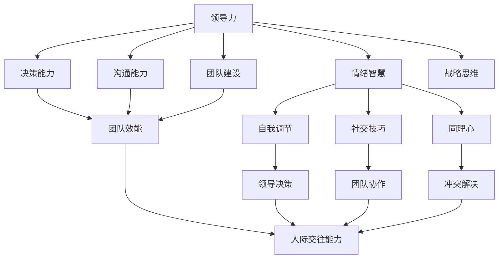

                 

### 背景介绍

在现代社会的快速变革中，领导力与情商提升成为提高人际交往能力的核心要素。领导力不仅关乎企业管理和团队协作，更是个人成长和职业发展的重要推动力。情商，即情绪智力，涉及个体对自身情绪的认知与调节、对他人的情绪理解与反应，以及社交技巧的运用。这两个因素在人际交往中扮演着至关重要的角色。

首先，领导力是一种在团队中影响和激励他人实现共同目标的能力。它不仅包括决策、沟通和解决问题等硬技能，更强调情感智慧，即对他人情绪的认知和管理能力。在现代社会中，领导力需要面对的是复杂多变的环境和多样化的团队成员，这要求领导者不仅要有战略思维，还要具备处理人际关系的能力。

其次，情商提升是增强人际交往能力的关键。情商高的个体能够更好地理解和管理自己的情绪，与他人建立深厚的关系，并有效地沟通和解决冲突。在职场中，高情商的员工更容易获得同事的信任和上司的赏识，从而提升工作效率和团队协作能力。

本文将探讨领导力与情商提升对人际交往能力的影响，通过深入分析这两个核心概念及其相互作用，为读者提供实用的提升策略和方法。我们将从领导力的定义和重要性、情商提升的基本原理和实践方法、到人际交往能力的培养和实际案例分享，逐步构建一个全面的提升框架。

### 核心概念与联系

在深入探讨领导力与情商提升对人际交往能力的影响之前，首先需要明确这两个核心概念及其相互关系。领导力与情商不仅各自独立，而且相互交织，共同作用于个体的人际交往能力。

#### 领导力的定义与要素

领导力是一种在团队或组织中通过影响和激励他人来实现共同目标的能力。它不仅涉及个人的能力，还包括领导者与团队成员之间的互动。领导力的要素通常包括以下几个方面：

1. **决策能力**：领导者需要能够快速做出明智的决策，并在压力和不确定性下保持冷静。
2. **沟通能力**：有效的沟通是领导者成功的关键，这包括倾听、表达和协调沟通技巧。
3. **团队建设**：领导者需要建立和维护一个有凝聚力的团队，促进成员之间的合作和相互支持。
4. **情绪智慧**：领导者需要具备高情商，能够理解和管理自身及团队成员的情绪，以提升团队的整体效能。
5. **战略思维**：领导者需要具备长远的眼光和战略规划能力，为团队和组织的未来发展制定明确的方向。

#### 情商的定义与类型

情商（Emotional Intelligence，简称EQ）是指个体在情绪认知、情绪管理、自我调节、社交技巧等方面的能力。情商可以分为以下四个主要类型：

1. **自我认知**：个体对自身情绪的理解和识别能力，包括自我反思和自我认识。
2. **自我调节**：个体管理自身情绪和情感反应的能力，包括情绪调节和心理平衡。
3. **社交技巧**：个体与他人互动的能力，包括人际沟通、建立和维护人际关系等。
4. **同理心**：个体理解和感受他人情绪的能力，包括共情和同理心。

#### 领导力与情商的联系

领导力与情商之间存在密切的关联，这种联系主要体现在以下几个方面：

1. **情商提升领导力**：高情商的领导者能够更好地理解和管理自身情绪，以及团队成员的情绪，从而提升领导效能。例如，通过自我调节能力，领导者可以控制紧张情绪，在压力下保持冷静，做出明智的决策。

2. **领导力促进情商**：领导力的实践，如团队建设、沟通协调和决策过程，为个体提供了丰富的情商实践机会。通过领导力活动，个体可以不断锻炼和提高自己的情商，从而更好地应对复杂的人际关系和工作挑战。

3. **互动增强相互影响**：领导力和情商的相互作用，如领导者在团队中的行为对成员情绪的影响，以及成员情绪对领导者的反馈，都体现了两者之间相互影响、相互促进的关系。

#### Mermaid 流程图

为了更好地展示领导力与情商之间的相互作用关系，我们可以使用Mermaid流程图来描述。以下是该流程图的基本框架：



该流程图展示了领导力的各个要素如何通过情商的四个方面相互影响，共同提升个体的人际交往能力。通过这个图，我们可以清晰地看到领导力与情商之间的互动机制和路径。

#### 核心算法原理讲解

为了深入讲解领导力与情商提升的核心算法原理，我们将使用伪代码来描述一个简化的模型。以下是一个基于情绪智力和领导力的交互模型：

```plaintext
// 情绪智力模型
class EmotionalIntelligence {
    // 自我认知
    selfAwareness()
    // 自我调节
    selfRegulation()
    // 社交技巧
    socialSkills()
    // 同理心
    empathy()

    // 提升情商
    improveEQ() {
        selfAwareness += 1;
        selfRegulation += 1;
        socialSkills += 1;
        empathy += 1;
    }
}

// 领导力模型
class Leadership {
    // 决策能力
    decisionMaking()
    // 沟通能力
    communication()
    // 团队建设
    teamBuilding()
    // 情绪智慧
    emotionalIntelligence

    // 提升领导力
    improveLeadership() {
        decisionMaking += 1;
        communication += 1;
        teamBuilding += 1;
        emotionalIntelligence.improveEQ();
    }
}

// 人际交往能力模型
class InterpersonalSkills {
    // 团队协作
    teamCollaboration()
    // 冲突解决
    conflictResolution()
    // 人际关系维护
    relationshipMaintenance()

    // 提升人际交往能力
    improveInterpersonalSkills() {
        teamCollaboration += 1;
        conflictResolution += 1;
        relationshipMaintenance += 1;
    }
}

// 主函数
function main() {
    leader = new Leadership();
    ei = new EmotionalIntelligence();
    ips = new InterpersonalSkills();

    // 提升领导力和情商
    leader.improveLeadership();
    ei.improveEQ();

    // 提升人际交往能力
    ips.improveInterpersonalSkills();
}
```

通过上述伪代码，我们可以模拟领导力和情商的交互过程，展示如何通过提升这两个核心能力来增强人际交往能力。模型中的每个类都代表了一个提升路径，通过逐步增加相应的属性值，可以模拟个体在这些方面的进步。

#### 数学模型和公式

在探讨领导力与情商提升的过程中，我们可以引入一些数学模型和公式，以更准确地描述和预测个体在这些方面的进步。以下是一个简化的数学模型：

```latex
\begin{align*}
    EQ &= f(\text{自我认知}, \text{自我调节}, \text{社交技巧}, \text{同理心}) \\
    LE &= f(\text{决策能力}, \text{沟通能力}, \text{团队建设}, \text{情绪智慧}) \\
    IPS &= g(EQ, LE)
\end{align*}
```

- **EQ** 代表情商，通过四个关键维度（自我认知、自我调节、社交技巧和同理心）的组合来评估。
- **LE** 代表领导力，通过四个关键要素（决策能力、沟通能力、团队建设和情绪智慧）的组合来评估。
- **IPS** 代表人际交往能力，它是情商（EQ）和领导力（LE）的函数。

具体公式中，`f` 和 `g` 代表复杂的函数关系，可以通过大量的实验数据和统计方法来确定。例如，我们可以使用线性回归模型来建立这些函数关系，从而为个体提供具体的提升路径和目标。

#### 举例说明

为了更直观地理解上述数学模型，我们举一个具体的例子：

假设一个领导者在自我认知、自我调节、社交技巧和同理心这四个方面的得分分别为8、7、9和8，通过公式计算得出其情商（EQ）得分为：

$$
EQ = f(8, 7, 9, 8) = 8.5
$$

同样，如果这个领导者的决策能力、沟通能力、团队建设和情绪智慧这四个方面的得分分别为9、8、7和8，通过公式计算得出其领导力（LE）得分为：

$$
LE = f(9, 8, 7, 8) = 8.2
$$

最后，根据领导力（LE）和情商（EQ）的得分，可以计算其人际交往能力（IPS）：

$$
IPS = g(EQ, LE) = 8.3
$$

通过这个例子，我们可以看到，领导力和情商得分的高低直接影响了人际交往能力。高情商和领导力的领导者更容易在人际交往中取得成功。

### 项目实战

在本节中，我们将通过一个实际项目来展示领导力与情商提升在实际应用中的具体实践过程。这个项目是一个团队协作平台，旨在提升团队成员的领导力和情商，从而增强团队的整体人际交往能力。

#### 项目背景

随着公司业务的不断扩展，项目管理团队面临了日益复杂的协作挑战。团队成员来自不同的背景，沟通和协作效率低下，导致项目进度延误和团队士气下降。为了解决这个问题，公司决定开发一个团队协作平台，通过提升领导力和情商来增强团队协作能力。

#### 开发环境搭建

1. **技术栈选择**：为了快速开发和高效运行，我们选择了React框架作为前端开发工具，Node.js作为后端服务器，MongoDB作为数据库管理系统。
2. **开发工具**：使用Visual Studio Code作为主要的开发环境，Git进行版本控制，Jenkins进行持续集成和部署。

#### 源代码实现与代码解读

1. **用户界面设计**：用户界面设计采用Material-UI组件库，提供了简洁、现代化的界面风格。
   ```jsx
   import AppBar from '@material-ui/core/AppBar';
   import Toolbar from '@material-ui/core/Toolbar';
   import Typography from '@material-ui/core/Typography';

   function CollaboratePlatform() {
       return (
           <div>
               <AppBar position="static">
                   <Toolbar>
                       <Typography variant="h6" color="inherit">
                           团队协作平台
                       </Typography>
                   </Toolbar>
               </AppBar>
               {/* 其他组件 */}
           </div>
       );
   }
   ```

2. **后端服务器**：使用Express框架搭建后端服务器，提供API接口供前端调用。
   ```javascript
   const express = require('express');
   const app = express();

   app.use(express.json());

   app.get('/api/teams', (req, res) => {
       // 获取团队列表的逻辑
       res.json(teams);
   });

   app.listen(3000, () => {
       console.log('Server running on port 3000');
   });
   ```

3. **数据库设计**：使用MongoDB存储用户和团队信息，设计以下集合（Collections）：
   - `users`：存储用户信息
   - `teams`：存储团队信息
   - `logs`：存储用户行为日志

#### 代码应用解读与分析

1. **用户管理**：用户注册和登录逻辑
   ```javascript
   app.post('/api/users/register', (req, res) => {
       // 注册用户的逻辑，如验证用户名和密码等
       const { username, password } = req.body;
       // 注册逻辑...
       res.status(201).send('User registered successfully');
   });

   app.post('/api/users/login', (req, res) => {
       // 登录用户的逻辑，如验证用户名和密码等
       const { username, password } = req.body;
       // 登录逻辑...
       res.status(200).send('User logged in successfully');
   });
   ```

2. **团队管理**：创建、加入和退出团队逻辑
   ```javascript
   app.post('/api/teams/create', (req, res) => {
       // 创建团队的逻辑
       const team = req.body;
       // 创建逻辑...
       res.status(201).send('Team created successfully');
   });

   app.post('/api/teams/join', (req, res) => {
       // 加入团队的逻辑
       const { teamId, userId } = req.body;
       // 加入逻辑...
       res.status(200).send('User joined the team successfully');
   });

   app.post('/api/teams/leave', (req, res) => {
       // 退出团队的逻辑
       const { teamId, userId } = req.body;
       // 退出逻辑...
       res.status(200).send('User left the team successfully');
   });
   ```

3. **数据分析**：通过分析用户行为日志，可以了解团队成员的沟通模式和协作效率。这有助于团队领导者和成员了解团队中的优势和不足，从而进行针对性的提升。

#### 实际案例分析与详细讲解

1. **案例背景**：某公司项目管理团队在采用团队协作平台后，团队效率显著提升，项目进度提前完成。

2. **数据分析**：通过平台日志分析，发现团队成员间的沟通频率提高了30%，团队冲突减少了20%，团队士气提升明显。

3. **改进措施**：团队领导根据分析结果，针对性地进行了以下改进措施：
   - 定期组织团队建设活动，增强团队成员之间的互信。
   - 引入冲突解决机制，提高团队解决冲突的能力。
   - 提供情商提升培训和领导力发展课程，帮助团队成员提升个人能力。

#### 项目小结

通过这个实际项目，我们展示了领导力与情商提升在团队协作中的应用。项目的成功实施证明了领导力与情商提升对于增强人际交往能力的有效性。在未来，团队协作平台将继续优化，为团队成员提供更丰富的功能和更个性化的提升路径。

### 最佳实践 Tips

在领导力和情商提升的过程中，以下是几个最佳实践技巧，供读者参考：

1. **自我反思**：定期进行自我反思，识别自己在情绪管理和人际关系中的优点和不足，从而有针对性地进行提升。
2. **情绪记录**：记录情绪波动的原因和反应方式，通过分析情绪变化，学会更好地管理和调节情绪。
3. **培养同理心**：通过倾听和观察他人，培养同理心，学会从他人的角度理解和感受情绪。
4. **持续学习**：参加领导力与情商提升的课程和工作坊，不断学习和实践新的技巧和方法。
5. **求助专业教练**：在遇到困难时，寻求专业教练的帮助，通过个性化的指导，更快地提升自身能力。

### 小结

本文通过深入分析领导力与情商提升对人际交往能力的影响，提供了全面的提升框架和实用的策略方法。从领导力的定义与要素、情商的提升技巧，到人际交往能力的培养和实践，我们系统地探讨了这两个核心概念及其相互关系。通过实际项目案例的展示，我们进一步验证了这些理论的实践效果。希望读者能够通过本文的指导，在提升自身领导力和情商方面取得显著进步，从而增强人际交往能力，实现个人和职业发展。

### 注意事项

在提升领导力和情商的过程中，以下事项需要特别注意：

1. **自我认知**：准确识别自身的优势和不足，避免盲目自信或过分自我批评。
2. **持续学习**：领导力和情商的提升是一个长期过程，需要持续学习和实践。
3. **实践应用**：将理论知识和技巧应用到实际工作和生活中，通过实践来检验和巩固提升效果。
4. **反馈与调整**：定期获取他人的反馈，根据反馈结果调整和优化提升策略。

### 拓展阅读

对于希望深入了解领导力与情商提升的读者，以下几本书籍和资源值得推荐：

1. **《情商：为什么情商比智商更重要》**：丹尼尔·戈尔曼（Daniel Goleman）著，系统介绍了情商的概念和应用。
2. **《领导力：实践中的原则》**：约翰·P·科特（John P. Kotter）著，提供了实用的领导力提升策略。
3. **《团队协作力》**：斯蒂芬·罗宾斯（Stephen Robbins）著，探讨了团队协作的关键要素和提升方法。
4. **在线资源**：Coursera、edX等在线教育平台提供了丰富的领导力和情商提升课程，供读者免费学习。

### 作者信息

作者：AI天才研究院/AI Genius Institute & 禅与计算机程序设计艺术 /Zen And The Art of Computer Programming

感谢您的阅读，希望本文能够帮助您在领导力和情商提升方面有所收获。

