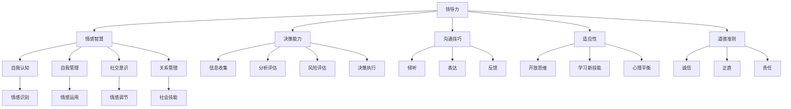

                 


### 文章标题

# 领导力与情商提升：改善人际关系

> 关键词：领导力，情商，人际关系，改善，提升

> 摘要：本文旨在探讨领导力和情商在改善人际关系中的重要作用，通过深入分析领导力和情商的核心概念、要素及其提升方法，结合实际情境，提供一系列实用的技巧和策略，帮助读者在职场和生活中更好地提升人际关系，实现个人与组织的共同成长。

### 第1章：领导力的定义与重要性

#### 1.1 领导力的概念与起源

**1.1.1 领导力的定义**

领导力是一种能力，它使个人或团队在面对复杂环境和挑战时能够高效地制定目标、激励成员、协调资源，并最终实现目标。简言之，领导力就是影响他人共同达成目标的能力。

**1.1.2 领导力的发展历程**

领导力概念起源于20世纪初期，当时的研究主要关注领导者的行为和特征。随着时间的发展，领导力研究逐渐转向领导者与团队成员之间的互动关系，以及领导力在组织中的角色和作用。

**1.1.3 领导力与管理的区别**

领导力与管理的区别在于它们关注的焦点不同。管理侧重于规划、组织、指挥和控制，以确保组织目标的实现。而领导力则更关注激励、愿景、价值观和团队建设，以推动组织创新和发展。

#### 1.2 领导力的五大核心要素

**1.2.1 情感智慧**

情感智慧是指领导者识别、理解、运用和管理自己和他人的情感，以实现个人和组织目标的能力。它包括情感识别、情感运用、情感调节和情感表达等方面。

**1.2.2 决策能力**

决策能力是指领导者根据信息、经验和直觉，做出合理、有效决策的能力。它包括问题识别、方案评估、风险分析和决策执行等方面。

**1.2.3 沟通技巧**

沟通技巧是指领导者有效表达自己的想法和需求，理解他人观点，建立良好人际关系的技能。它包括倾听、表达、反馈和沟通障碍的解决等方面。

**1.2.4 适应性**

适应性是指领导者面对变化和不确定性时，能够快速调整心态、策略和行为，以应对挑战的能力。它包括学习、创新、灵活性和危机管理等方面。

**1.2.5 道德准则**

道德准则是指领导者遵循的道德原则和价值观，以指导自己的行为和决策。它包括诚信、正直、责任和公平等方面。

#### 1.3 领导力的重要性

**1.3.1 对个人的意义**

领导力对个人成长和发展具有重要意义。它可以帮助个人提高自信、提升职业能力，实现自我价值和成就感。

**1.3.2 对团队的意义**

领导力对团队建设和发展具有关键作用。它可以帮助团队明确目标、激发潜力、提高协作和沟通，实现团队绩效的持续提升。

**1.3.3 对组织的意义**

领导力对组织的战略、创新和可持续发展具有重要影响。它可以帮助组织应对市场变化、提升竞争力、实现战略目标。

### 第2章：情商的概念与构成

#### 2.1 情商的定义与起源

**2.1.1 情商的定义**

情商是指个体识别、理解、管理自己和他人的情感，以及运用情感促进思考、决策和人际交往的能力。它包括情感识别、情感运用、情感调节和情感表达等方面。

**2.1.2 情商的发展历程**

情商概念起源于20世纪90年代，由心理学家彼得·萨洛维和新罕布什尔大学的约翰·梅耶提出。随着研究的深入，情商逐渐成为心理学、管理学、教育学等领域的重要研究课题。

**2.1.3 情商与智商的关系**

情商与智商是两个不同的概念。智商主要衡量个体的认知能力和逻辑思维能力，而情商则关注个体的情感和社会能力。尽管二者有一定相关性，但情商在许多方面对个体的成功和生活质量具有更大的影响。

#### 2.2 情商的五大构成要素

**2.2.1 情感识别**

情感识别是指个体能够准确识别自己和他人的情感状态，并理解这些情感背后的原因。

**2.2.2 情感表达**

情感表达是指个体能够以适当的方式表达自己的情感，与他人建立有效的情感交流。

**2.2.3 情感运用**

情感运用是指个体能够有效地运用情感，以促进自己的思考、决策和人际关系。

**2.2.4 情感调节**

情感调节是指个体能够调整自己的情感状态，以适应不同环境和情境的需求。

**2.2.5 社会技能**

社会技能是指个体在人际交往中展现的沟通、协作、合作和冲突解决能力。

#### 2.3 情商的重要性

**2.3.1 对个人的意义**

情商对个人成长和发展具有重要意义。它可以帮助个人提高自我意识、增强心理素质、改善人际关系，实现自我价值和幸福感。

**2.3.2 对团队的意义**

情商对团队建设和发展具有关键作用。它可以帮助团队提高协作效率、增强凝聚力、改善沟通氛围，实现团队绩效的持续提升。

**2.3.3 对组织的意义**

情商对组织的战略、创新和可持续发展具有重要影响。它可以帮助组织提升员工满意度、增强组织文化、提高组织竞争力，实现组织的长期发展。

### 第3章：领导力与情商的提升方法

#### 3.1 自我认知的提升

**3.1.1 自我反思**

自我反思是指个体通过反思自己的行为、情绪和思维过程，了解自己的优点和不足，并不断调整自己的行为和态度。

**3.1.2 自我认知的工具**

自我认知的工具包括心理测评、日记记录、反思日志等，它们可以帮助个体更深入地了解自己，提高自我认知水平。

**3.1.3 自我成长的方法**

自我成长的方法包括学习新知识、培养兴趣爱好、参与社交活动等，它们可以帮助个体不断提高自己的能力，实现自我价值的提升。

#### 3.2 情感智慧的提升

**3.2.1 情感识别的技巧**

情感识别的技巧包括倾听、观察、感知等，它们可以帮助个体更好地识别自己和他人的情感状态。

**3.2.2 情感表达的策略**

情感表达的策略包括适度表达、恰当表达、积极表达等，它们可以帮助个体更好地表达自己的情感，与他人建立良好的情感交流。

**3.2.3 情感运用的方法**

情感运用的方法包括情感管理、情感引导、情感激励等，它们可以帮助个体更好地运用情感，促进个人成长和发展。

**3.2.4 情感调节的技巧**

情感调节的技巧包括情绪调节、心理平衡、压力管理等，它们可以帮助个体更好地调节自己的情感，以适应不同环境和情境的需求。

#### 3.3 沟通技巧的提升

**3.3.1 有效沟通的要素**

有效沟通的要素包括倾听、表达、反馈、尊重等，它们是建立良好人际关系的基础。

**3.3.2 沟通障碍的识别与克服**

沟通障碍的识别与克服包括理解差异、解决冲突、增强信任等，它们可以帮助个体更好地应对沟通中的问题，提高沟通效果。

**3.3.3 沟通技巧的训练方法**

沟通技巧的训练方法包括角色扮演、情景模拟、案例分析等，它们可以帮助个体更好地掌握沟通技巧，提高沟通能力。

#### 3.4 决策能力的提升

**3.4.1 决策模型的理解**

决策模型的理解包括理性决策模型、经验决策模型、直觉决策模型等，它们可以帮助个体更好地理解决策过程和决策方法。

**3.4.2 决策优化的方法**

决策优化的方法包括数据驱动决策、模拟优化、决策树分析等，它们可以帮助个体更好地优化决策过程，提高决策效果。

**3.4.3 决策失败的原因与应对**

决策失败的原因包括信息不足、分析不充分、决策偏差等，应对决策失败的方法包括反思、调整、改进等，它们可以帮助个体更好地应对决策失败，提高决策能力。

#### 3.5 适应性的提升

**3.5.1 适应性思维模式的培养**

适应性思维模式的培养包括开放思维、创新思维、系统思维等，它们可以帮助个体更好地适应变化和不确定性。

**3.5.2 应对变化的方法**

应对变化的方法包括学习新技能、调整心态、灵活应对等，它们可以帮助个体更好地应对变化和挑战。

**3.5.3 面对挑战的策略**

面对挑战的策略包括积极应对、寻求支持、制定计划等，它们可以帮助个体更好地应对挑战，实现目标。

### 第4章：改善人际关系的技巧

#### 4.1 人际关系的重要性

**4.1.1 人际关系对领导力的影响**

人际关系对领导力具有重要影响。良好的人际关系可以帮助领导者更好地理解团队成员的需求和期望，提高团队凝聚力和协作效率。

**4.1.2 人际关系对组织文化的影响**

人际关系对组织文化具有重要影响。良好的人际关系可以促进组织文化的建设和发展，提高组织内部的沟通和协作效率。

#### 4.2 建立有效沟通的技巧

**4.2.1 沟通的基本原则**

沟通的基本原则包括诚实、尊重、倾听、开放等，它们是建立良好人际关系的基础。

**4.2.2 倾听的技巧**

倾听的技巧包括注意力集中、肢体语言、提问等，它们可以帮助个体更好地理解他人的观点和需求。

**4.2.3 沟通的障碍与解决**

沟通的障碍包括语言障碍、文化差异、心理障碍等，解决沟通障碍的方法包括增强语言沟通能力、了解文化差异、建立信任等。

#### 4.3 解除冲突的技巧

**4.3.1 冲突的类型与原因**

冲突的类型包括个人冲突、团队冲突、组织冲突等，冲突的原因包括利益冲突、价值观冲突、沟通不畅等。

**4.3.2 冲突管理的策略**

冲突管理的策略包括化解、回避、对抗、妥协等，它们可以帮助个体更好地处理冲突，维护人际关系。

**4.3.3 和解谈判的技巧**

和解谈判的技巧包括倾听、表达、让步、协商等，它们可以帮助个体更好地进行和解谈判，解决冲突。

#### 4.4 建立信任的技巧

**4.4.1 信任的定义与重要性**

信任是指个体对他人的能力、诚实、善意和可靠性的一种信任和依赖。信任在人际关系中具有重要地位，它有助于建立稳定、健康的人际关系。

**4.4.2 信任的建立与维护**

信任的建立与维护包括诚实、可靠、透明、公正等，它们是建立和维护信任的关键要素。

**4.4.3 失信的应对策略**

失信的应对策略包括承认错误、积极改正、寻求补救等，它们可以帮助个体更好地应对失信问题，重建信任。

### 第5章：领导力与情商在具体情境中的应用

#### 5.1 领导力在团队建设中的应用

**5.1.1 团队角色的识别**

团队角色的识别包括领导角色、执行角色、协调角色等，它们可以帮助领导者更好地理解团队成员的职责和角色，提高团队协作效率。

**5.1.2 团队激励的方法**

团队激励的方法包括认可与奖励、目标设定、资源支持等，它们可以帮助领导者更好地激发团队成员的积极性和创造力。

**5.1.3 团队冲突的解决**

团队冲突的解决包括沟通协调、公正处理、调解谈判等，它们可以帮助领导者更好地解决团队冲突，维护团队稳定。

#### 5.2 情商在客户关系管理中的应用

**5.2.1 客户需求识别**

客户需求识别包括需求分析、市场调研、客户反馈等，它们可以帮助企业更好地了解客户需求，提供个性化服务。

**5.2.2 客户沟通技巧**

客户沟通技巧包括倾听、表达、提问、反馈等，它们可以帮助企业更好地与客户建立有效沟通，提高客户满意度。

**5.2.3 客户关系维护**

客户关系维护包括定期沟通、服务质量提升、情感关怀等，它们可以帮助企业更好地维护客户关系，提高客户忠诚度。

#### 5.3 领导力与情商在项目管理中的应用

**5.3.1 项目目标设定**

项目目标设定包括目标明确、目标分解、目标评估等，它们可以帮助项目经理更好地规划项目进度和资源。

**5.3.2 项目进度控制**

项目进度控制包括进度监控、风险识别、进度调整等，它们可以帮助项目经理更好地控制项目进度，确保项目按时完成。

**5.3.3 项目风险管理**

项目风险管理包括风险识别、风险评估、风险应对等，它们可以帮助项目经理更好地应对项目风险，确保项目成功实施。

### 第6章：领导力与情商提升的自我评估与行动计划

#### 6.1 自我评估工具

**6.1.1 领导力评估问卷**

领导力评估问卷是一种常见的自我评估工具，它可以帮助个体了解自己在领导力方面的优势和不足，制定针对性的提升计划。

**6.1.2 情商评估问卷**

情商评估问卷是一种常见的自我评估工具，它可以帮助个体了解自己在情商方面的水平和能力，发现提升的空间。

#### 6.2 制定行动计划

**6.2.1 设定目标**

制定行动计划的第一步是设定目标，明确自己想要提升的领导力和情商方面的能力。

**6.2.2 制定策略**

制定策略是实现目标的步骤和方法，包括学习新知识、培养新技能、参加培训等。

**6.2.3 实施与监控**

实施与监控是实现行动计划的重要环节，包括定期评估进度、调整策略、解决问题等。

**6.2.4 反馈与总结**

反馈与总结是提升自我认知和能力的重要环节，通过反思自己的行为和表现，不断调整和优化提升计划。

### 结束语

领导力和情商的提升对于改善人际关系、实现个人成长和组织发展具有重要意义。通过本文的阐述，我们希望读者能够更好地理解领导力和情商的核心概念、要素及其提升方法，结合实际情境，运用所学知识和技巧，不断提升自己的领导力和情商，成为更加卓越的领导者。

作者：AI天才研究院/AI Genius Institute & 禅与计算机程序设计艺术 /Zen And The Art of Computer Programming### 第1章：领导力的定义与重要性

#### 1.1 领导力的概念与起源

领导力是一种复杂的、多维度的能力，它不仅仅涉及到个人魅力的展示，更是一种系统化的、有目的的影响力。领导力的概念并不是一成不变的，随着社会的发展和组织形式的变化，它也在不断地演进。在早期的研究中，领导力主要关注领导者的行为和特质，如 charisma（个人魅力）、intelligence（智力）和 charisma（性格）等。然而，随着时间的推移，学者们逐渐意识到，领导力不仅仅是领导者个人的能力，它更是一种与团队成员互动的过程。

**1.1.1 领导力的定义**

领导力可以被定义为影响他人共同达成目标的能力。这种能力不仅包括激励团队成员，还包括指导、支持、沟通和协调。在具体情境中，领导力体现在领导者如何设定目标、如何分配资源、如何解决问题、如何处理冲突，以及如何激发团队的创造力和创新能力。

**1.1.2 领导力的发展历程**

领导力的发展历程可以分为几个阶段：

- **早期阶段（20世纪初期）**：这一阶段的领导力研究主要集中在领导者的个人特质和行为上，如特质理论（traits theory）和风格理论（styles theory）。这些理论认为，领导者的个人特质和行为是领导成功的关键。

- **行为阶段（20世纪中叶）**：行为理论（behaviors theory）强调领导者的行为模式对团队绩效的影响。研究者开始分析不同领导行为对团队的影响，并尝试总结出有效的领导行为。

- **情境阶段（20世纪末）**：情境理论（situational theory）认为，领导者的成功取决于他们如何根据不同情境调整自己的领导风格。这一阶段的研究强调了领导者的适应性。

- **变革阶段（21世纪初至今）**：随着全球化和信息化的加速发展，领导力研究逐渐关注领导者的全球视野、创新能力和社会责任感。这一阶段的领导力更加注重领导者的战略思维、跨文化沟通和可持续发展。

**1.1.3 领导力与管理的区别**

领导力与管理是两个相关但不完全相同的概念。管理侧重于规划、组织、指挥和控制，以确保组织目标的实现。管理关注的是流程、效率和资源的最优配置。而领导力则更注重激励、愿景、价值观和团队建设，它关注的是如何激发团队的潜力、推动组织的创新和发展。

管理强调的是执行力，而领导力强调的是影响力。管理者负责确保任务得到完成，而领导者则负责创造一个让任务得以高效完成的组织环境。因此，一个成功的领导者通常既具备良好的管理技能，也具备强大的领导力。

#### 1.2 领导力的五大核心要素

领导力是一个多维度的概念，它涉及多个关键要素。以下是对领导力的五大核心要素的详细介绍：

**1.2.1 情感智慧**

情感智慧（Emotional Intelligence，简称EQ）是领导力的重要组成部分。它包括四个关键维度：自我认知、自我管理、社交意识和关系管理。自我认知是指领导者能够识别和理解自己的情感状态。自我管理是指领导者能够调节自己的情绪，保持积极的心态。社交意识是指领导者能够理解他人的情感和需求。关系管理是指领导者能够建立和维护良好的人际关系。

**1.2.2 决策能力**

决策能力是领导者必须具备的核心能力之一。决策能力包括信息收集、分析评估、风险评估和决策执行等方面。领导者需要根据信息进行理性分析，同时也要考虑直觉和经验。在决策过程中，领导者需要权衡各种因素，包括短期利益和长期影响、团队利益和个体利益等。

**1.2.3 沟通技巧**

沟通技巧是领导者必须掌握的重要技能之一。有效的沟通可以增强团队的凝聚力，提高工作效率，降低误解和冲突。沟通技巧包括倾听、表达、反馈和解决问题的能力。倾听是有效沟通的关键，它要求领导者不仅要听对方说什么，还要理解对方的情感和需求。表达是沟通的另一个重要方面，领导者需要能够清晰、准确地表达自己的想法和需求。反馈则是沟通的重要环节，它可以帮助领导者了解团队成员的反馈和意见。解决问题的能力则是领导者面对挑战和冲突时的重要技能。

**1.2.4 适应性**

适应性是指领导者能够快速适应环境变化、应对不确定性和克服挑战的能力。在快速变化的时代，领导者需要具备高度的灵活性，能够快速调整策略和方法，以适应新的环境和要求。适应性包括学习新技能、调整心态、接受变化和解决问题等方面的能力。

**1.2.5 道德准则**

道德准则是领导者行为和决策的指导原则。一个有道德的领导者会坚持诚信、正直和责任等价值观，以身作则，树立良好的道德榜样。道德准则不仅影响领导者的个人形象，也影响团队的士气和组织的文化。领导者需要通过透明的行为、公正的决策和负责任的行动来维护道德准则。

#### 1.3 领导力的重要性

领导力在个人、团队和组织层面都具有重要的意义：

**1.3.1 对个人的意义**

领导力对个人成长和发展具有重要意义。首先，领导力可以帮助个人提高自信心和自尊心。通过成功领导团队和实现目标，个人可以获得成就感和自我价值感。其次，领导力可以提升个人的职业能力。优秀的领导者通常具备较强的沟通、协调和解决问题的能力，这些能力在职场中具有很高的价值。最后，领导力有助于个人建立良好的人际关系，这对于个人的职业发展和生活幸福至关重要。

**1.3.2 对团队的意义**

领导力对团队建设和发展具有关键作用。首先，领导力可以激发团队成员的潜力，提高团队的绩效。一个有能力的领导者会设定明确的目标，提供必要的资源和支持，鼓励团队成员发挥自己的优势。其次，领导力可以增强团队的凝聚力。通过建立信任、沟通和协作机制，领导者可以促进团队成员之间的相互理解和支持，形成紧密合作的团队。最后，领导力有助于团队创新和发展。一个有远见的领导者会鼓励团队尝试新思路、探索新方法，推动团队在不断创新中发展壮大。

**1.3.3 对组织的意义**

领导力对组织的战略、创新和可持续发展具有重要影响。首先，领导力可以推动组织实现战略目标。一个有战略思维的领导者会制定清晰的战略规划，明确组织的发展方向和目标，并带领团队共同实现。其次，领导力可以促进组织创新。领导者会鼓励团队成员创新思维、尝试新方法，推动组织在技术、产品和服务等方面的不断创新。最后，领导力有助于组织的可持续发展。一个有社会责任感的领导者会关注组织的长期发展，注重员工福利和环境保护，推动组织在可持续发展的道路上不断前进。

总之，领导力是个人、团队和组织成功的关键因素。通过深入了解领导力的定义、核心要素和重要性，我们可以更好地理解领导力在各个层面的作用，并在实际工作中不断提升自己的领导力水平。

### 第2章：情商的概念与构成

情商（Emotional Intelligence，简称EQ）是一个近年来备受关注的领域，它不仅仅是个体情感管理的能力，更是影响个人、团队和组织成功的关键因素。情商的概念最早由心理学家彼得·萨洛维和新罕布什尔大学的约翰·梅耶在1990年代提出。他们认为，情商是衡量一个人情感智力的指标，包括识别、理解、管理和表达情感的能力。情商不仅与个体的心理健康密切相关，还对人际交往、职业发展和领导力有着深远的影响。

#### 2.1 情商的定义与起源

**2.1.1 情商的定义**

情商是指个体识别、理解、管理自己和他人的情感，以及运用情感促进思考、决策和人际交往的能力。情商包含四个核心要素：自我认知、自我管理、社交意识和关系管理。自我认知是指个体能够识别和理解自己的情感状态；自我管理是指个体能够调节自己的情绪，保持积极的心态；社交意识是指个体能够理解他人的情感和需求；关系管理是指个体能够建立和维护良好的人际关系。

**2.1.2 情商的发展历程**

情商的概念起源于对人类情感的研究，早在20世纪初期，心理学家就已经开始探讨情感对人类行为的影响。然而，情商作为一个独立的科学概念，是在20世纪90年代由彼得·萨洛维和约翰·梅耶正式提出的。他们的研究揭示了情商在个人成功中的重要性，引起了学术界和商业界的广泛关注。随着研究的深入，情商逐渐成为心理学、管理学、教育学等领域的重要研究课题。

**2.1.3 情商与智商的关系**

情商与智商是两个不同的概念，但它们之间有着密切的联系。智商（Intelligence Quotient，简称IQ）主要衡量个体的认知能力和逻辑思维能力，而情商则关注个体的情感和社会能力。研究表明，情商和智商在个人成功中的贡献是不同的，但它们并不是相互独立的。一个高情商的人可能会在情感处理和人际交往中表现得更出色，而一个高智商的人可能在解决问题和逻辑思维上更占优势。实际上，情商和智商在一定程度上是相互补充的。一个理想的个体应该在情商和智商方面都达到较高的水平，这样才能在工作和生活中取得更好的成就。

#### 2.2 情商的五大构成要素

情商是一个多维度的概念，它由多个关键要素构成。以下是对情商的五大构成要素的详细介绍：

**2.2.1 情感识别**

情感识别是指个体能够识别和理解自己和他人的情感状态。这包括两个方面：自我情感识别和他情感识别。自我情感识别是指个体能够意识到自己的情绪，并理解这些情绪背后的原因。他情感识别是指个体能够识别和理解他人的情绪，包括情感的类型、强度和情境。情感识别是情商的基础，它帮助个体更好地理解自己和他人，从而在人际交往中做出更合适的反应。

**2.2.2 情感表达**

情感表达是指个体能够以适当的方式表达自己的情感，与他人建立有效的情感交流。情感表达不仅仅是表达情感本身，还包括情感的强度和情境。有效的情感表达可以帮助个体更好地传达自己的需求、愿望和想法，同时也能够增强人际关系的质量。情感表达需要个体具备良好的沟通技巧和情感智慧，以便在适当的时机以适当的方式表达自己的情感。

**2.2.3 情感运用**

情感运用是指个体能够有效地运用情感，以促进自己的思考、决策和人际关系。情感运用包括情感激励、情感思考和情感调节。情感激励是指个体能够运用积极的情感，如喜悦、兴奋等，来激发自己的创造力和动力。情感思考是指个体能够运用情感来辅助决策，比如在面临重要决策时，通过情感分析来权衡各种因素。情感调节是指个体能够调节自己的情感，以适应不同的环境和情境。情感运用是情商的重要组成部分，它帮助个体更好地应对各种挑战和压力。

**2.2.4 情感调节**

情感调节是指个体能够调整自己的情感状态，以适应不同环境和情境的需求。情感调节包括情绪管理和心理平衡。情绪管理是指个体能够识别、理解和调节自己的情绪，保持良好的心理状态。心理平衡是指个体能够在不同情境中保持心理稳定，不受外界环境的影响。情感调节是情商的核心要素之一，它帮助个体在面对压力和挑战时保持冷静和理智，做出更明智的决策。

**2.2.5 社会技能**

社会技能是指个体在人际交往中展现的沟通、协作、合作和冲突解决能力。社会技能包括倾听、表达、反馈、谈判和合作等。有效的社会技能可以帮助个体在团队合作中发挥更好的作用，建立良好的人际关系，增强团队合作和沟通效率。社会技能是情商的重要组成部分，它帮助个体在复杂的社会环境中更好地与他人相处，提高人际交往的质量。

#### 2.3 情商的重要性

情商在个人、团队和组织层面都具有重要的意义：

**2.3.1 对个人的意义**

情商对个人的心理健康和社交能力有深远的影响。首先，高情商的个体能够更好地管理自己的情绪，保持心理平衡，减少焦虑和压力。其次，高情商的个体在人际交往中表现出更强的社交技能，更容易建立和维护良好的人际关系。此外，情商还与个人的职业发展密切相关，高情商的个体在团队合作、沟通协调和领导力方面更具优势，更容易在职场中取得成功。

**2.3.2 对团队的意义**

情商对团队的建设和发展具有重要作用。首先，高情商的团队成员能够更好地理解和支持他人，增强团队合作和沟通效率。其次，高情商的团队在处理冲突和解决问题时更具协作性，能够更快地找到解决方案。此外，高情商的团队具有更强的凝聚力和归属感，这有助于提高团队的士气和绩效。

**2.3.3 对组织的意义**

情商对组织的战略、创新和可持续发展具有重要影响。首先，高情商的领导者能够更好地激励和引导团队，推动组织创新和发展。其次，高情商的组织文化能够增强员工的满意度和忠诚度，提高组织的竞争力。此外，高情商的组织在应对市场变化和危机时更具灵活性和适应性，能够保持长期的稳定发展。

总之，情商是一个关键的能力，它不仅影响个体的心理健康和社交能力，还对团队和组织的绩效和可持续发展具有深远的影响。通过提升情商，个人、团队和组织可以更好地应对挑战，实现共同的目标。

### 第3章：领导力与情商的提升方法

在当前复杂多变的环境中，提升领导力和情商已成为个人和组织成功的关键。有效的领导力和情商不仅能帮助个体在职场中取得卓越成就，还能促进团队协作、提高组织绩效。以下是提升领导力和情商的几种主要方法。

#### 3.1 自我认知的提升

自我认知是提升领导力和情商的基础。只有深入了解自己的情感、动机和行为，个体才能更好地管理自己，更有效地与他人互动。

**3.1.1 自我反思**

自我反思是一种有效的自我认知方法。通过定期反思自己的行为、思维和情感，个体可以发现自身的优势和不足，从而进行有针对性的改进。例如，每天花时间思考以下问题：

- 今天我在工作中做得好的地方是什么？
- 我在哪些方面需要改进？
- 我是如何应对工作中的挑战的？
- 我的情感状态如何？有什么方法可以改善？

通过持续的自我反思，个体可以逐步提高自我认知，从而在领导力和情商方面取得进步。

**3.1.2 自我认知的工具**

为了更系统地提升自我认知，个体可以使用一些工具，如心理测评、日记记录和反思日志等。以下是一些常用的工具：

- **心理测评**：例如Myers-Briggs Type Indicator (MBTI)、DiSC测评等，可以帮助个体了解自己的性格类型、优势与劣势，从而更好地发展领导力和情商。
- **日记记录**：通过记录每日的思考和情感变化，个体可以更清晰地了解自己的内心世界，从而进行有针对性的调整。
- **反思日志**：定期撰写反思日志，记录自己的经历、感受和学习，可以帮助个体总结经验，不断进步。

**3.1.3 自我成长的方法**

自我成长是一个持续的过程，需要个体主动学习和实践。以下是一些自我成长的方法：

- **阅读**：阅读相关书籍和文章，可以获取知识和启发，提高自我认知和情商。例如，彼得·德鲁克的《管理的实践》、丹尼尔·戈尔曼的《情商》等书籍都是很好的学习资源。
- **培训**：参加专业培训课程，如领导力发展课程、情商培训等，可以帮助个体系统地提升领导力和情商。
- **实践**：将所学知识应用到实际工作中，通过实践不断总结经验和教训，从而提高自己的能力和情商。

#### 3.2 情感智慧的提升

情感智慧（EQ）是领导力的关键要素之一。提升情感智慧可以帮助个体更好地管理自己的情感，理解他人的情感，并有效地进行人际交往。

**3.2.1 情感识别的技巧**

情感识别是情感智慧的基础。以下是一些提升情感识别的技巧：

- **观察面部表情和肢体语言**：通过观察他人的面部表情和肢体动作，可以识别他们的情感状态。
- **倾听和提问**：倾听他人说话，注意对方的语调、语气和表情，通过提问来了解对方的真实感受。
- **自我反思**：定期反思自己的情感状态，了解自己的情绪变化和背后的原因。

**3.2.2 情感表达的策略**

有效的情感表达可以增强人际交往，建立良好的人际关系。以下是一些提升情感表达的策略：

- **明确表达**：在表达情感时，要明确表达自己的感受和需求，避免模糊不清或误导他人。
- **选择合适的时机和方式**：根据情境和对方的心理状态，选择合适的时机和方式来表达情感，以减少不必要的误解和冲突。
- **使用“我”语言**：在表达情感时，使用“我”语言，如“我感到很沮丧，因为...”，而不是指责对方，以建立更好的沟通。

**3.2.3 情感运用的方法**

情感运用是情感智慧的核心。以下是一些提升情感运用的方法：

- **情感激励**：通过情感激励，如表扬、鼓励和认可，可以激发团队成员的积极性和创造力。
- **情感支持**：在团队成员遇到困难时，提供情感支持，帮助他们克服挑战。
- **情感引导**：通过情感引导，如表达理解和同情，可以引导团队成员更好地理解和处理自己的情感。

**3.2.4 情感调节的技巧**

情感调节是情感智慧的重要组成部分。以下是一些提升情感调节的技巧：

- **情绪管理**：通过深呼吸、冥想和运动等方式，管理自己的情绪，保持心理平衡。
- **心理平衡**：在情感波动时，通过心理平衡技巧，如反思和自我激励，调整自己的情感状态。
- **压力管理**：通过有效的压力管理技巧，如时间管理和优先级设定，减轻压力，保持良好的心理状态。

#### 3.3 沟通技巧的提升

沟通技巧是领导力和情商的重要组成部分。有效的沟通可以帮助个体更好地表达自己的观点，理解他人的需求，并建立良好的人际关系。

**3.3.1 有效沟通的要素**

有效沟通需要关注以下要素：

- **倾听**：倾听是有效沟通的关键。通过倾听，个体可以更好地理解他人的观点和需求，减少误解和冲突。
- **表达**：有效的表达可以帮助个体清晰地传达自己的观点和需求，避免沟通障碍。
- **反馈**：通过反馈，个体可以确认对方是否理解自己的观点，并及时调整沟通策略。
- **尊重**：尊重是有效沟通的基础。尊重他人的观点和感受，建立信任和合作关系。

**3.3.2 沟通障碍的识别与克服**

以下是一些常见的沟通障碍及其克服方法：

- **语言障碍**：由于语言差异或表达不清，导致误解和冲突。克服方法：通过明确表达和倾听，确保信息传达的准确性。
- **文化差异**：由于文化背景不同，导致沟通困难。克服方法：了解和尊重不同文化的差异，采用跨文化沟通技巧。
- **心理障碍**：由于情绪和心理问题，导致沟通不畅。克服方法：通过情绪管理和心理平衡，保持良好的心理状态。

**3.3.3 沟通技巧的训练方法**

以下是一些提升沟通技巧的训练方法：

- **角色扮演**：通过角色扮演，模拟真实沟通情境，提升沟通能力和应对技巧。
- **情景模拟**：通过情景模拟，练习应对不同沟通场景，提高沟通的灵活性和适应性。
- **案例分析**：通过分析实际案例，学习有效沟通的方法和策略。

#### 3.4 决策能力的提升

决策能力是领导者的重要素质之一。提升决策能力可以帮助个体在面对复杂问题时做出更明智的决策。

**3.4.1 决策模型的理解**

以下是一些常见的决策模型：

- **理性决策模型**：基于逻辑分析和数据驱动的决策方法。
- **经验决策模型**：基于经验和直觉的决策方法。
- **直觉决策模型**：基于直觉和情感的决策方法。

了解不同的决策模型可以帮助个体根据具体情况选择最合适的决策方法。

**3.4.2 决策优化的方法**

以下是一些提升决策优化的方法：

- **多方案评估**：在决策过程中，考虑多个备选方案，进行综合评估，选择最优方案。
- **风险评估**：对每个决策方案进行风险评估，评估可能的风险和影响，制定相应的应对策略。
- **情景分析**：通过情景分析，模拟决策实施后的各种可能结果，为决策提供依据。

**3.4.3 决策失败的原因与应对**

以下是一些决策失败的原因及应对方法：

- **信息不足**：决策时缺乏足够的信息，导致决策不准确。应对方法：加强信息收集和分析，确保决策有充分依据。
- **分析不充分**：对问题的分析和评估不充分，导致决策失误。应对方法：深入分析问题，全面评估各种因素。
- **决策偏差**：由于个人偏见或心理因素，导致决策不合理。应对方法：通过多角度、多方法的评估，减少决策偏差。

#### 3.5 适应性的提升

在快速变化的时代，适应性是领导者必须具备的能力。提升适应性可以帮助个体更好地应对变化和不确定性。

**3.5.1 适应性思维模式的培养**

以下是一些培养适应性思维模式的方法：

- **开放思维**：保持开放的心态，接受新的观点和想法。
- **学习思维**：不断学习新知识和技能，提升自己的能力和素质。
- **创新思维**：鼓励创新思维，寻找新的解决方案和途径。
- **系统思维**：从整体视角看待问题，理解各部分之间的相互关系。

**3.5.2 应对变化的方法**

以下是一些提升应对变化的方法：

- **灵活应对**：在面对变化时，灵活调整策略和方法，迅速适应新环境。
- **学习新技能**：不断学习新技能和知识，提高自己的适应能力。
- **心理平衡**：通过心理平衡技巧，保持良好的心理状态，应对变化带来的压力。

**3.5.3 面对挑战的策略**

以下是一些面对挑战的策略：

- **积极应对**：面对挑战，保持积极的态度，寻找解决问题的方法。
- **寻求支持**：在遇到困难时，寻求他人的支持和帮助，共同应对挑战。
- **制定计划**：制定详细的计划，明确目标和步骤，有条不紊地应对挑战。

通过以上方法，个体可以不断提升自己的领导力和情商，更好地应对职场和生活中的各种挑战和变化。

### 第4章：改善人际关系的技巧

在职场和生活中，人际关系的重要性不言而喻。良好的人际关系不仅能提升个人的职业发展和生活质量，还能为团队和组织创造积极的氛围。以下是一些改善人际关系的技巧：

#### 4.1 人际关系的重要性

**4.1.1 人际关系对领导力的影响**

人际关系对领导力具有深远的影响。一个成功的领导者不仅需要具备优秀的专业技能，还需要具备良好的人际关系。良好的人际关系可以帮助领导者更好地理解团队成员的需求和期望，建立信任和合作，从而提高团队的凝聚力和绩效。

- **信任**：信任是良好人际关系的基础。领导者通过诚实、透明和负责任的行为建立信任，使团队成员更加信任和尊重领导者。
- **沟通**：有效的沟通是建立良好人际关系的关键。领导者需要倾听团队成员的意见和需求，及时反馈和解决问题，确保信息的畅通和透明。
- **支持**：领导者需要提供支持和帮助，关心团队成员的成长和发展，建立相互支持和帮助的关系。

**4.1.2 人际关系对组织文化的影响**

人际关系对组织文化具有重要影响。积极的人际关系可以促进组织文化的建设和发展，提升组织的凝聚力和创新力。

- **团队协作**：良好的人际关系可以促进团队成员之间的协作和合作，提高团队的工作效率和创造力。
- **员工满意度**：良好的人际关系可以提升员工的满意度和归属感，降低员工流失率，增强组织的稳定性。
- **创新能力**：积极的人际关系可以促进知识共享和创新思维，提升组织的创新能力和竞争力。

#### 4.2 建立有效沟通的技巧

**4.2.1 沟通的基本原则**

有效沟通需要遵循以下基本原则：

- **诚实**：诚实是沟通的基础，领导者需要真诚地表达自己的观点和需求，避免误导和欺骗。
- **尊重**：尊重他人是建立良好关系的关键。领导者需要尊重团队成员的个性和意见，避免歧视和偏见。
- **开放**：开放性沟通可以促进信息的流通和共享，领导者需要鼓励团队成员表达自己的观点和意见。
- **明确**：明确性沟通可以避免误解和混淆，领导者需要清晰、准确地表达自己的意图和期望。

**4.2.2 倾听的技巧**

倾听是有效沟通的重要组成部分。以下是一些倾听的技巧：

- **全神贯注**：在倾听时，领导者需要全神贯注，避免分心或打断对方。
- **非语言反馈**：通过点头、微笑等非语言反馈，表示对对方的关注和理解。
- **开放性提问**：通过开放性提问，鼓励对方表达更多信息和观点，确保信息的全面性。
- **避免干扰**：在倾听时，避免打断对方的发言，给予对方充分的发言空间。

**4.2.3 沟通的障碍与解决**

沟通中的障碍可能源于多种因素，以下是一些常见的障碍及其解决方法：

- **语言障碍**：由于语言差异或表达不清，导致误解和冲突。解决方法：通过明确表达和倾听，确保信息传达的准确性。
- **文化差异**：由于文化背景不同，导致沟通困难。解决方法：了解和尊重不同文化的差异，采用跨文化沟通技巧。
- **心理障碍**：由于情绪和心理问题，导致沟通不畅。解决方法：通过情绪管理和心理平衡，保持良好的心理状态。

#### 4.3 解除冲突的技巧

冲突是人际关系中不可避免的一部分，有效的冲突管理可以促进关系的改善和团队的稳定。

**4.3.1 冲突的类型与原因**

冲突可以分为以下几种类型：

- **个人冲突**：由于个人性格、价值观或利益冲突导致的冲突。
- **团队冲突**：由于团队目标、资源或责任分配不当导致的冲突。
- **组织冲突**：由于组织文化、政策或战略不明确导致的冲突。

冲突的原因多种多样，包括：

- **利益冲突**：由于资源有限，各方利益难以平衡。
- **价值观差异**：由于对事物看法不同，导致意见分歧。
- **沟通不畅**：由于信息传递不畅，导致误解和冲突。

**4.3.2 冲突管理的策略**

以下是一些有效的冲突管理策略：

- **预防策略**：通过明确的规则、政策和沟通机制，预防冲突的发生。
- **化解策略**：通过沟通、调解和妥协，化解冲突，避免升级。
- **对抗策略**：在必要时，采取对抗策略，明确立场，解决问题。
- **协商策略**：通过谈判和协商，寻找双方都能接受的解决方案。

**4.3.3 和解谈判的技巧**

以下是一些和解谈判的技巧：

- **倾听**：倾听对方的意见和需求，理解对方的立场和利益。
- **表达**：清晰、明确地表达自己的观点和需求，避免误解和冲突。
- **让步**：在谈判过程中，适当让步，以达成双方都能接受的协议。
- **协商**：通过协商，寻找双方都能接受的解决方案，确保谈判的顺利进行。

#### 4.4 建立信任的技巧

信任是良好人际关系的基础。以下是一些建立信任的技巧：

**4.4.1 信任的定义与重要性**

信任是指个体对他人的能力、诚实、善意和可靠性的一种信任和依赖。信任在人际关系中具有重要地位，它有助于建立稳定、健康的人际关系。

**4.4.2 信任的建立与维护**

以下是一些建立和维护信任的方法：

- **诚实与透明**：保持诚实，公开透明，避免隐瞒和欺骗，增强信任感。
- **一致性**：言行一致，保持承诺，避免出现不一致的情况，确保信任的稳定性。
- **尊重**：尊重他人的意见和需求，避免侵犯他人的利益，建立信任的基础。
- **支持**：在他人需要帮助时提供支持，增强信任和依赖。

**4.4.3 失信的应对策略**

当信任受损时，以下是一些应对策略：

- **承认错误**：承认错误，并表示愿意改正，以重建信任。
- **积极补救**：采取积极的措施，弥补损失，恢复信任。
- **沟通与解释**：与对方进行沟通，解释原因和措施，增强信任。

通过以上技巧和方法，个体可以改善人际关系，建立和维护良好的信任关系，为职场和生活的成功奠定坚实的基础。

### 第5章：领导力与情商在具体情境中的应用

在现实工作和生活中，领导力和情商的应用场景多种多样，它们在团队建设、客户关系管理和项目管理等具体情境中发挥着重要作用。以下将详细探讨领导力与情商在这些问题中的具体应用。

#### 5.1 领导力在团队建设中的应用

**5.1.1 团队角色的识别**

团队角色的识别是团队建设的第一步。通过了解每个成员的角色和职责，领导者可以更好地分配任务和资源，提高团队的整体效能。以下是识别团队角色的方法：

- **角色评估**：通过调查问卷或小组讨论，评估每个成员在团队中的角色和职责。
- **任务分配**：根据每个成员的能力和兴趣，合理分配任务，确保每个成员都能发挥自己的优势。
- **角色培训**：为团队成员提供角色培训，帮助其理解自己的职责和期望，提高工作效率。

**5.1.2 团队激励的方法**

团队激励是提升团队士气和绩效的重要手段。以下是几种常用的团队激励方法：

- **目标设定**：设定明确、可行的团队目标，激发成员的积极性和创造力。
- **认可奖励**：通过表彰和奖励，认可成员的贡献和成就，增强他们的工作动力。
- **团队建设活动**：组织团队建设活动，如团队旅行、拓展训练等，增强团队成员之间的信任和凝聚力。

**5.1.3 团队冲突的解决**

团队冲突是团队建设中不可避免的问题。有效的冲突解决策略可以帮助团队保持和谐，提高工作效率。以下是几种解决团队冲突的方法：

- **沟通与倾听**：鼓励团队成员开放沟通，倾听他们的意见和需求，找出冲突的根本原因。
- **调解与协商**：通过调解和协商，帮助双方达成共识，找到解决问题的方法。
- **冲突管理培训**：为团队成员提供冲突管理培训，提高他们的冲突解决能力。

#### 5.2 情商在客户关系管理中的应用

**5.2.1 客户需求识别**

了解客户需求是客户关系管理的关键。以下是几种识别客户需求的方法：

- **客户调研**：通过问卷调查、访谈和焦点小组等方式，收集客户的需求和反馈。
- **市场分析**：分析市场趋势和竞争对手，了解客户的需求和偏好。
- **客户反馈**：建立有效的客户反馈机制，及时了解客户的满意度和需求变化。

**5.2.2 客户沟通技巧**

有效的客户沟通可以提升客户满意度，建立长期的合作关系。以下是几种提升客户沟通技巧的方法：

- **倾听**：倾听客户的意见和需求，了解他们的真实想法。
- **表达**：清晰、准确地表达自己的观点和解决方案，避免误解和冲突。
- **反馈**：及时给予客户反馈，确保他们的需求得到满足。

**5.2.3 客户关系维护**

客户关系维护是长期而持续的工作。以下是几种维护客户关系的方法：

- **定期沟通**：定期与客户沟通，了解他们的需求和反馈，建立良好的关系。
- **个性化服务**：根据客户的需求和偏好，提供个性化的服务和解决方案。
- **客户关怀**：在客户生日、节假日等特殊时刻，发送祝福和礼物，表达对客户的关怀。

#### 5.3 领导力与情商在项目管理中的应用

**5.3.1 项目目标设定**

项目目标设定是项目管理的核心任务。以下是几种设定项目目标的方法：

- **SMART原则**：确保项目目标具备具体性（Specific）、可衡量性（Measurable）、可实现性（Achievable）、相关性（Relevant）和时限性（Time-bound）。
- **团队讨论**：与团队成员一起讨论项目目标，确保目标的可行性和共识。
- **资源评估**：评估项目所需的资源和条件，确保目标的实现具备足够的支持。

**5.3.2 项目进度控制**

项目进度控制是确保项目按时完成的关键。以下是几种项目进度控制的方法：

- **进度报告**：定期汇报项目进度，及时发现问题并采取措施。
- **风险管理**：识别项目风险，制定相应的应对策略，降低风险对项目进度的影响。
- **进度调整**：根据实际情况，适时调整项目进度计划，确保项目的顺利推进。

**5.3.3 项目风险管理**

项目风险管理是确保项目成功的关键。以下是几种项目风险管理的方法：

- **风险识别**：识别项目中的潜在风险，包括技术风险、市场风险和人员风险等。
- **风险评估**：评估每个风险的可能性和影响，确定风险优先级。
- **风险应对**：制定相应的风险应对策略，包括风险规避、风险转移和风险接受等。

通过以上具体情境中的应用，我们可以看到领导力和情商在团队建设、客户关系管理和项目管理中的重要性。领导者需要灵活运用这些技能，根据不同情境制定相应的策略，以实现个人和团队的共同成长。

### 第6章：领导力与情商提升的自我评估与行动计划

为了不断提升领导力和情商，自我评估和制定行动计划是不可或缺的重要环节。通过自我评估，个体可以了解自己的优势和不足，明确提升方向。而行动计划则为实现这些提升提供了具体可行的步骤和策略。

#### 6.1 自我评估工具

**6.1.1 领导力评估问卷**

领导力评估问卷是一种常用的自我评估工具，可以帮助个体了解自己在领导力方面的表现。以下是一个简化的领导力评估问卷示例：

1. **情感智慧**：我能够识别和理解自己的情感状态。（1分：从不，2分：偶尔，3分：经常，4分：总是）
2. **决策能力**：我在做决策时能够充分考虑各种因素。（1分：从不，2分：偶尔，3分：经常，4分：总是）
3. **沟通技巧**：我能够清晰地表达自己的想法和需求。（1分：从不，2分：偶尔，3分：经常，4分：总是）
4. **适应性**：我能够快速适应环境和变化。（1分：从不，2分：偶尔，3分：经常，4分：总是）
5. **道德准则**：我在工作中始终坚持诚信和责任感。（1分：从不，2分：偶尔，3分：经常，4分：总是）

**6.1.2 情商评估问卷**

情商评估问卷用于评估个体在情商方面的表现。以下是一个简化的情商评估问卷示例：

1. **自我认知**：我能够识别和理解自己的情感状态。（1分：从不，2分：偶尔，3分：经常，4分：总是）
2. **自我管理**：我能够调节自己的情绪，保持积极心态。（1分：从不，2分：偶尔，3分：经常，4分：总是）
3. **社交意识**：我能够理解他人的情感和需求。（1分：从不，2分：偶尔，3分：经常，4分：总是）
4. **关系管理**：我能够建立和维护良好的人际关系。（1分：从不，2分：偶尔，3分：经常，4分：总是）

**6.1.3 自我反思日记**

自我反思日记是一种简单而有效的自我评估工具。个体可以每天记录自己的行为、情感和思考，通过反思来了解自己的优势和不足。以下是一个自我反思日记的示例：

- **今天的工作表现**：
  - 优点：成功完成了项目报告，得到了同事的赞扬。
  - 需要改进：在与客户沟通时，语气过于强硬，需要更加柔和。

**6.1.4 360度评估**

360度评估是一种通过多个视角评估个体表现的工具，通常包括上级、同事和下属的反馈。以下是一个360度评估的示例：

- **上级反馈**：你在项目中的表现非常出色，但是需要更好地与团队成员沟通。
- **同事反馈**：你经常能够给予我们建设性的建议，但是在处理冲突时有时过于情绪化。
- **下属反馈**：你很关心我们的成长，但是在分配任务时有时不够公平。

#### 6.2 制定行动计划

**6.2.1 设定目标**

设定明确、具体和可衡量的目标是制定行动计划的第一步。以下是一个设定目标的示例：

- **目标**：在接下来的三个月内，提高自己的沟通技巧。
- **具体**：通过每周参加沟通技巧培训课程，阅读相关书籍，并定期与同事进行沟通练习。
- **可衡量**：通过同事和上级的反馈，评估自己的沟通技巧是否有所提升。

**6.2.2 制定策略**

制定策略是实现目标的具体步骤和方法。以下是一个制定策略的示例：

1. **学习新技能**：参加沟通技巧培训课程，阅读相关书籍，了解有效的沟通方法和技巧。
2. **实践应用**：在日常工作中，尝试运用所学沟通技巧，例如主动倾听、清晰表达和积极反馈。
3. **反思与改进**：定期反思自己的沟通行为，识别不足之处，并制定改进措施。

**6.2.3 实施与监控**

实施行动计划并监控进度是实现目标的关键。以下是一个实施与监控的示例：

1. **定期评估**：每周评估自己的沟通技巧，记录进步和挑战。
2. **寻求反馈**：向同事和上级寻求反馈，了解自己的沟通表现和改进方向。
3. **调整计划**：根据评估结果和反馈，调整行动计划，确保目标的实现。

**6.2.4 反馈与总结**

反馈和总结是行动计划的重要组成部分。以下是一个反馈与总结的示例：

- **反馈**：在实施行动计划的过程中，收到了同事和上级的积极反馈，表示自己的沟通技巧有所提升。
- **总结**：通过实施行动计划，不仅提高了自己的沟通技巧，还增强了对团队协作的理解，为未来的工作打下了坚实的基础。

通过自我评估和制定行动计划，个体可以更好地了解自己的优势和不足，并采取具体措施进行提升。这一过程不仅有助于个人成长，还能为团队和组织的发展贡献重要力量。

### 结论

领导力和情商在个人、团队和组织层面都具有重要的意义。通过本文的阐述，我们深入探讨了领导力的定义、核心要素以及其在团队建设中的应用，同时详细介绍了情商的概念、构成要素及其提升方法。这些技能不仅在职场中发挥着关键作用，也在日常生活中影响着我们的社交能力和生活质量。

领导力与情商的提升并非一蹴而就，它需要个体在自我认知、情感智慧、沟通技巧、决策能力和适应性等方面不断努力和进步。通过自我评估和制定行动计划，我们可以更好地了解自己的优势和不足，并采取具体措施进行提升。

为了进一步提升领导力和情商，以下是一些建议：

1. **持续学习**：不断学习新知识、新技能，保持开放的心态，以适应快速变化的环境。
2. **实践应用**：将所学知识和技能应用到实际工作和生活中，通过实践来提升自己的能力和情商。
3. **反思与总结**：定期反思自己的行为和表现，总结经验教训，不断调整和优化提升计划。
4. **寻求反馈**：向同事、上级和下属寻求反馈，了解自己的优点和不足，并据此进行改进。

领导力和情商的提升是一个长期的过程，需要我们持之以恒的努力。通过不断提升自己的领导力和情商，我们可以更好地应对职场和生活中的挑战，实现个人与组织的共同成长。

作者：AI天才研究院/AI Genius Institute & 禅与计算机程序设计艺术 /Zen And The Art of Computer Programming

### 附录

为了更直观地展示领导力和情商的核心概念及其相互关系，我们使用Mermaid流程图来描述。



此外，为了更好地理解决策优化的方法，以下是相关的伪代码：

```python
# 决策优化伪代码

# 输入：目标列表，每个目标的权重，可能的方案列表，每个方案的收益和风险
target_list = ["提高销售额", "降低成本", "提升客户满意度"]
weight_list = [0.5, 0.3, 0.2]
schemes = [{"name": "方案1", "gain": 10, "risk": 3}, {"name": "方案2", "gain": 8, "risk": 2}, {"name": "方案3", "gain": 5, "risk": 1}]

# 计算每个方案的收益-风险比
def calculate_ratio(scheme):
    return scheme["gain"] / scheme["risk"]

# 根据权重和收益-风险比进行排序
def sort_schemes(schemes, weight_list):
    for scheme in schemes:
        scheme["ratio"] = calculate_ratio(scheme)
    sorted_schemes = sorted(schemes, key=lambda x: x["ratio"], reverse=True)
    weighted_sorted_schemes = []
    total_weight = sum(weight_list)
    for scheme in sorted_schemes:
        weight_ratio = weight_list[schemes.index(scheme)] / total_weight
        scheme["weighted_ratio"] = scheme["ratio"] * weight_ratio
        weighted_sorted_schemes.append(scheme)
    return weighted_sorted_schemes

# 选择最佳方案
best_scheme = sort_schemes(schemes, weight_list)[0]
print("最佳方案：", best_scheme["name"])
```

通过以上伪代码，我们可以实现一个简单的决策优化模型，为决策提供依据。

### 拓展阅读

- **《领导力五项修炼》**：史蒂芬·柯维
- **《情商：为什么情商比智商更重要》**：丹尼尔·戈尔曼
- **《如何赢得朋友与影响他人》**：戴尔·卡耐基
- **《变革之舞：领导力修炼手册》**：约翰·凯
- **《智能时代的领导力》**：陈春花

这些书籍提供了丰富的理论和实践经验，有助于进一步了解领导力和情商的提升方法和应用。通过阅读这些书籍，读者可以加深对领导力和情商的理解，并在实际工作中更好地应用这些知识。

作者：AI天才研究院/AI Genius Institute & 禅与计算机程序设计艺术 /Zen And The Art of Computer Programming

