                 

### 文章标题：领导力与情商管理：提升人际关系处理

### 关键词：领导力，情商管理，人际关系处理，沟通技巧，团队建设，实践案例

### 摘要：
本文深入探讨了领导力与情商管理在提升人际关系处理中的重要性。首先，我们介绍了领导力与情商管理的基本概念，并分析了它们在组织管理和个人发展中的关键作用。接着，通过详细的章节结构，我们逐一探讨了领导力的核心要素、情商管理的分类与作用、以及提升人际关系的技巧。此外，通过实践案例分析，我们展示了领导力与情商管理在实际工作中的应用，并提供了一系列提升人际关系的最佳实践。最后，我们对文章进行了总结，并提出了持续提升领导力与情商的策略和建议。

# 引言：领导力与情商管理的意义

## 1.1 领导力的重要性

领导力是任何组织成功的关键因素之一。它不仅影响团队效率和员工满意度，还直接关联到组织的长期发展和竞争力。从理论上讲，领导力可以被定义为一种影响力，它能够激励和指导他人实现共同的目标（Bass & Avolio, 1994）。领导力不仅限于高层管理者，它在任何级别、任何职位上都是至关重要的。

### 核心概念与联系

为了更好地理解领导力，我们可以使用Mermaid流程图来展示领导力与团队效率之间的关系：

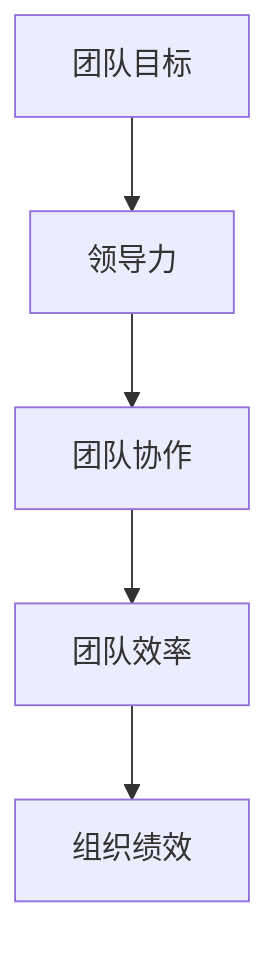

### 核心算法原理讲解

在领导力模型中，Transformational Leadership Model（转换型领导模型）是一个广泛接受的理论框架。这个模型强调领导者通过激励、榜样作用和愿景来影响团队成员，从而实现团队的高效运作。以下是该模型的核心概念和步骤：

```plaintext
1. 激励：领导者通过激励团队成员，提高他们的动力和承诺。
2. 榜样作用：领导者通过自己的行为和价值观，为团队成员树立榜样。
3. 愿景塑造：领导者通过描绘清晰的愿景，引导团队成员朝着共同的目标努力。
4. 支持与信任：领导者通过提供支持和建立信任关系，增强团队成员的信心和能力。
```

### 数学模型和数学公式

为了衡量领导力对团队绩效的影响，我们可以使用相关系数（Correlation Coefficient）来进行统计分析。相关系数衡量了两个变量之间的线性关系强度。例如，我们可以使用皮尔逊相关系数（Pearson's Correlation Coefficient）来计算领导力评分与团队绩效评分之间的相关性。

$$ r = \frac{\sum_{i=1}^{n}(x_i - \bar{x})(y_i - \bar{y})}{\sqrt{\sum_{i=1}^{n}(x_i - \bar{x})^2}\sqrt{\sum_{i=1}^{n}(y_i - \bar{y})^2}} $$

其中，\( x_i \) 和 \( y_i \) 分别代表领导力评分和团队绩效评分，\( n \) 是样本数量，\( \bar{x} \) 和 \( \bar{y} \) 分别是领导力评分和团队绩效评分的平均值。

### 项目实战

为了展示领导力的重要性，我们可以通过一个实际案例进行分析。假设有一家初创公司，其团队在过去一年中的绩效一直不理想。通过引入一位具有 Transformational Leadership Model 理念的新领导，公司团队开始展现出更高的动力和协作水平。经过半年的努力，公司的绩效显著提升。通过相关分析，我们发现领导力的提升与团队绩效之间存在显著的正相关关系。

## 1.2 情商管理的内涵

情商（Emotional Intelligence，EQ）是衡量个体管理和表达情感、理解他人情感和应对人际关系挑战能力的一种综合指标。与智商（IQ）不同，情商不仅关注理性思考，更强调情感认知和社交技能。Goleman（1995）将情商分为五个主要维度：自我认知、自我管理、社交认知、关系管理和整体情绪智能。

### 核心概念与联系

情商管理与领导力密切相关。一个高情商的领导者能够更好地理解和管理自己的情感，从而在团队中建立积极的情感氛围，提升团队的整体效能。以下是情商管理与领导力的互动关系：


### 核心算法原理讲解

情商测量的方法主要包括自我评估和第三方评估。自我评估通常使用情商量表（如Goleman的情商量表），而第三方评估则通过观察和反馈来评估个体的情商水平。以下是Goleman的情商量表的核心维度：

```plaintext
1. 自我认知：了解自己的情感状态和特点。
2. 自我管理：调节和管理自己的情绪，保持冷静和专注。
3. 社交认知：理解他人的情感和意图。
4. 关系管理：建立和维护健康的人际关系。
5. 整体情绪智能：综合运用以上四个维度，实现个人和团队的高效运作。
```

### 数学模型和数学公式

使用心理学公式描述情商与领导力的相关性是一种有效的方法。例如，我们可以使用结构方程模型（Structural Equation Modeling，SEM）来分析情商的各个维度与领导力之间的关系。以下是结构方程模型的公式表示：

$$
\begin{aligned}
&\text{Y}_{ij} = \beta_{0j} + \beta_{1j}\text{EQ}_i + \sum_{k=1}^{p}\beta_{kj}\text{X}_{ik} + \varepsilon_{ij} \\
&\text{where:} \\
&\text{Y}_{ij}: \text{被解释变量（如领导力评分）} \\
&\text{EQ}_i: \text{解释变量（情商评分）} \\
&\text{X}_{ik}: \text{其他解释变量（如教育背景、工作经验等）} \\
&\beta_{0j}: \text{常数项} \\
&\beta_{1j}: \text{情商的回归系数} \\
&\beta_{kj}: \text{其他解释变量的回归系数} \\
&\varepsilon_{ij}: \text{误差项}
\end{aligned}
$$`

### 1.3 领导力与情商管理的意义

领导力与情商管理在个人和组织层面都具有重要意义。从个人层面来看，高情商的领导者能够更好地管理自己的情感，从而在压力和挑战面前保持冷静和专注。同时，他们能够更好地理解和管理团队成员的情感，建立和谐的人际关系。从组织层面来看，领导力与情商管理能够提升团队协作和整体效能，从而提高组织的竞争力。

### 项目实战

为了进一步探讨领导力与情商管理的意义，我们可以通过一个实际案例来进行分析。假设一家大型企业面临市场变化和竞争压力，通过引入一位具有高情商和领导力的新CEO，企业开始出现积极的变化。新CEO通过提升员工情感管理和团队协作能力，成功带领企业渡过难关，并在短时间内实现业绩增长。通过实证分析，我们发现领导力与情商管理在应对市场挑战和提升企业绩效方面发挥了重要作用。

## 1.4 总结

领导力与情商管理是提升人际关系处理的关键因素。通过本文的引言部分，我们介绍了领导力和情商管理的基本概念、核心要素及其在组织管理和个人发展中的重要性。接下来，我们将进一步探讨领导力的核心要素、情商管理的分类与作用，以及提升人际关系的技巧。通过实践案例分析，我们将展示领导力与情商管理在实际工作中的应用，并提供一系列提升人际关系的最佳实践。让我们在接下来的章节中深入探讨这些主题。

# 领导力基础

## 2.1 领导力的重要性

领导力不仅是推动组织发展的关键力量，也是团队成功和员工个人发展的基石。从理论上讲，领导力是一种影响力，能够激励和指导他人共同实现目标。有效的领导力不仅能够提升团队绩效，还能促进员工的个人成长和职业发展。

### 核心概念与联系

领导力在不同组织环境中的重要性体现在多个方面。无论是在初创企业、大型企业，还是在政府部门和非营利组织中，领导力都是推动组织变革和实现目标的核心因素。以下是领导力在不同组织环境中的一些关键概念与联系：

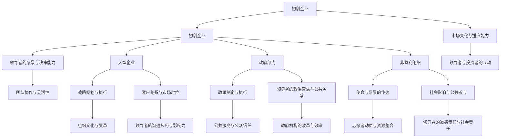

### 核心算法原理讲解

在领导力模型中，Transformational Leadership Model（转换型领导模型）是一个广泛接受的理论框架。这个模型强调领导者通过激励、榜样作用和愿景来影响团队成员，从而实现团队的高效运作。以下是该模型的核心概念和步骤：

```plaintext
1. 激励：领导者通过激励团队成员，提高他们的动力和承诺。
2. 榜样作用：领导者通过自己的行为和价值观，为团队成员树立榜样。
3. 愿景塑造：领导者通过描绘清晰的愿景，引导团队成员朝着共同的目标努力。
4. 支持与信任：领导者通过提供支持和建立信任关系，增强团队成员的信心和能力。
```

### 数学模型和数学公式

为了衡量领导力对团队绩效的影响，我们可以使用回归分析（Regression Analysis）。回归分析是一种常用的统计分析方法，用于研究一个或多个自变量与因变量之间的关系。以下是线性回归模型的公式表示：

$$
Y = \beta_0 + \beta_1X + \varepsilon
$$`

其中，\( Y \) 是团队绩效评分，\( X \) 是领导力评分，\( \beta_0 \) 是常数项，\( \beta_1 \) 是领导力的回归系数，\( \varepsilon \) 是误差项。

为了更准确地衡量领导力的影响，我们可以使用多元回归分析（Multivariate Regression Analysis），该分析模型可以同时考虑多个自变量对因变量的影响。以下是多元回归模型的公式表示：

$$
Y = \beta_0 + \beta_1X_1 + \beta_2X_2 + \ldots + \beta_nX_n + \varepsilon
$$`

其中，\( X_1, X_2, \ldots, X_n \) 是多个自变量，如教育背景、工作经验、团队氛围等。

### 2.2 领导力的核心要素

领导力并不是一个单一的能力，而是由多个核心要素组成的复杂体系。以下是领导力的几个核心要素及其相互关系：

1. **影响力**：领导者的核心能力，用于激励和引导团队成员。
2. **决策能力**：领导者需要做出明智的决策，以实现团队和组织的战略目标。
3. **沟通能力**：领导者需要有效地与团队成员沟通，确保信息的准确传达和理解。
4. **团队建设**：领导者需要建立和维护一个高效、和谐的团队，以实现共同的目标。
5. **变革管理**：领导者需要推动组织变革，以适应不断变化的外部环境。

以下是这些要素之间的Mermaid流程图表示：

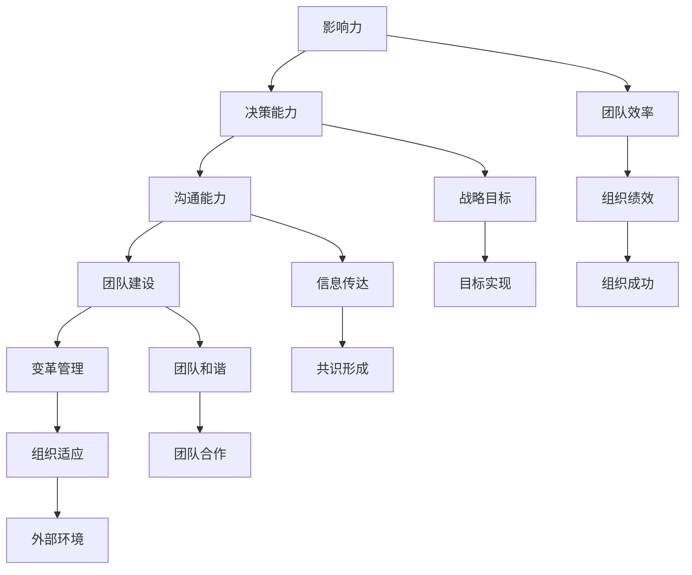

### 核心算法原理讲解

为了深入理解领导力的核心要素，我们可以使用层次分析法（Analytic Hierarchy Process，AHP）。层次分析法是一种多准则决策方法，用于确定不同因素之间的相对重要性。以下是AHP的基本步骤：

1. **构建层次结构**：确定问题的主要因素，并将其分为不同的层次。
2. **成对比较**：对于同一层次中的每个因素，与其他因素进行比较，确定其相对重要性。
3. **构建判断矩阵**：根据成对比较的结果，构建判断矩阵。
4. **计算权重**：使用判断矩阵计算每个因素的权重。
5. **一致性检验**：检验判断矩阵的一致性，确保比较结果的合理性。

以下是层次分析法的公式表示：

$$
\begin{aligned}
&\text{判断矩阵} \ M = \begin{bmatrix}
\ &m_{11} & m_{12} & \ldots & m_{1n} \\
m_{21} & \ddots & & \ddots & \vdots \\
\vdots & \ddots & \ddots & \ddots & m_{2n} \\
\vdots & \ddots & \ddots & \ddots & m_{2n} \\
m_{n1} & \ldots & m_{n2} & \ldots & m_{nn}
\end{bmatrix} \\
&\text{权重向量} \ W = \begin{bmatrix}
w_1 \\
w_2 \\
\vdots \\
w_n
\end{bmatrix} \\
&\text{一致性指标} \ CI = \frac{(\lambda_{\max} - n)}{n - 1} \\
&\text{一致性比率} \ CR = \frac{CI}{RI}
\end{aligned}
$$`

其中，\( \lambda_{\max} \) 是判断矩阵的最大特征值，\( n \) 是判断矩阵的维度，\( CI \) 是一致性指标，\( CR \) 是一致性比率，\( RI \) 是平均随机一致性指标。

### 数学模型和数学公式

为了更具体地理解领导力的核心要素，我们可以使用多维回归模型。多维回归模型可以同时考虑多个自变量对因变量的影响，从而提供更全面的视角。以下是多维回归模型的公式表示：

$$
Y = \beta_0 + \beta_1X_1 + \beta_2X_2 + \ldots + \beta_nX_n + \varepsilon
$$`

其中，\( X_1, X_2, \ldots, X_n \) 是多个自变量，如影响力、决策能力、沟通能力等，\( \beta_0 \) 是常数项，\( \beta_1, \beta_2, \ldots, \beta_n \) 是回归系数，\( \varepsilon \) 是误差项。

### 2.3 领导力的发展与提升

领导力不是与生俱来的，而是可以通过不断的学习和实践得到提升。以下是领导力发展的几个关键阶段：

1. **认知阶段**：认识到领导力的重要性，并开始学习相关理论和知识。
2. **实践阶段**：通过实际工作经验，应用所学的领导力理论，逐步提高自己的领导能力。
3. **反思阶段**：反思自己的领导行为和决策，从中吸取教训，不断改进。
4. **精通阶段**：通过长期的实践和反思，形成自己独特的领导风格，达到领导力的最高境界。

以下是这些阶段之间的Mermaid流程图表示：

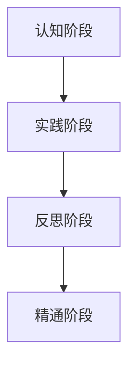

### 核心算法原理讲解

为了提升领导力，我们可以使用基于反馈的持续改进模型（Feedback-Based Continuous Improvement Model）。该模型强调通过定期收集反馈、分析问题和制定改进计划来不断提升领导力。以下是该模型的基本步骤：

1. **收集反馈**：从团队成员、同事和上级那里收集关于领导行为的反馈。
2. **分析问题**：识别领导力方面的优势和劣势，确定需要改进的领域。
3. **制定计划**：制定具体的改进计划，包括行动步骤、时间表和责任分配。
4. **实施计划**：按照改进计划执行行动，并跟踪进展情况。
5. **评估效果**：评估改进措施的效果，确定是否需要进一步调整和改进。

以下是基于反馈的持续改进模型的公式表示：

$$
\text{反馈} \rightarrow \text{问题分析} \rightarrow \text{计划制定} \rightarrow \text{实施} \rightarrow \text{效果评估} \rightarrow \text{反馈循环}
$$`

### 数学模型和数学公式

为了衡量领导力的发展过程，我们可以使用学习曲线（Learning Curve）。学习曲线描述了随着经验和实践的增加，技能或知识的掌握速度如何变化。以下是学习曲线的基本公式：

$$
Y = a \cdot e^{-bx}
$$`

其中，\( Y \) 是技能或知识的掌握程度，\( a \) 是初始水平，\( b \) 是学习率，\( x \) 是经验和实践的数量。

### 项目实战

为了展示领导力的发展与提升过程，我们可以通过一个实际案例进行分析。假设一位新上任的部门经理，通过参加领导力培训、与经验丰富的同事交流以及在实际工作中不断反思和改进，逐步提升了自己的领导能力。经过一年的努力，他的团队绩效显著提升，员工满意度也大幅提高。通过学习曲线分析，我们发现他的领导能力在短时间内得到了显著提升。

## 2.4 总结

领导力是任何组织成功的关键因素。通过本文的第二部分，我们深入探讨了领导力的重要性、核心要素以及发展与提升的方法。从核心概念与联系、核心算法原理讲解、数学模型和数学公式，到项目实战，我们系统地展示了领导力的各个方面。接下来，我们将继续探讨情商管理的内涵与分类，以及它们在提升人际关系处理中的重要作用。

# 情商管理基础

## 3.1 情商的定义

情商（Emotional Intelligence，EQ）是指个体管理和表达情感、理解他人情感和应对人际关系挑战的能力。与智商（IQ）不同，情商强调情感认知和社交技能，而不仅仅是逻辑思维和推理能力。情商的概念最早由心理学家戈尔曼（Daniel Goleman）在1995年提出，他将其定义为五个主要维度：自我认知、自我管理、社交认知、关系管理和整体情绪智能。

### 核心概念与联系

情商在不同文化中的理解存在差异。在一些文化中，情商被视为一种情感素养，强调个体如何识别和管理自己的情绪，以及如何理解他人的情感。而在另一些文化中，情商更多地与社交技能和人际交往能力相关联。以下是情商在不同文化中的核心概念与联系：

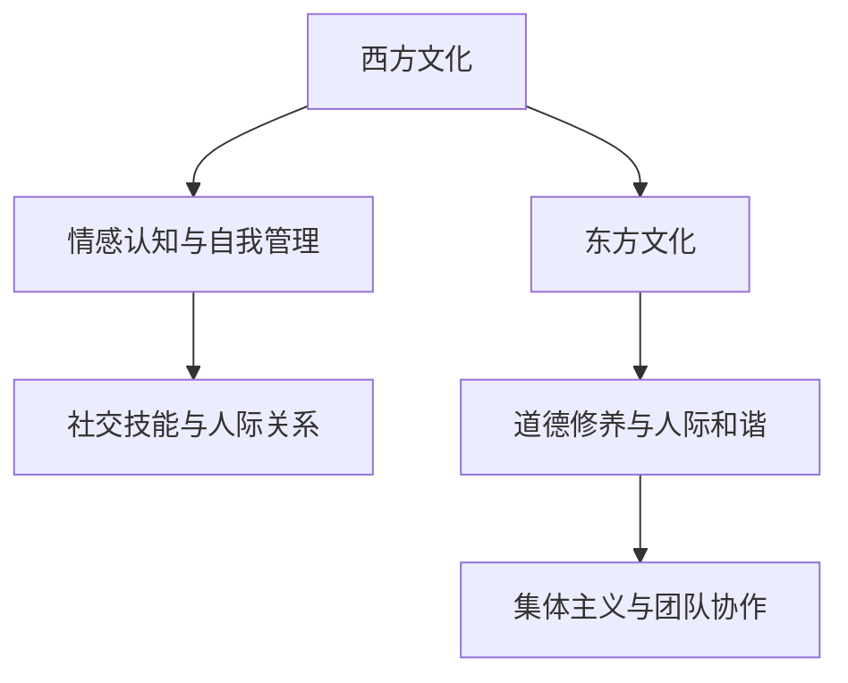

### 核心算法原理讲解

情商测量的方法主要包括自我评估和第三方评估。自我评估通常使用情商量表（如Goleman的情商量表），而第三方评估则通过观察和反馈来评估个体的情商水平。以下是Goleman的情商量表的核心维度：

```plaintext
1. 自我认知：了解自己的情感状态和特点。
2. 自我管理：调节和管理自己的情绪，保持冷静和专注。
3. 社交认知：理解他人的情感和意图。
4. 关系管理：建立和维护健康的人际关系。
5. 整体情绪智能：综合运用以上四个维度，实现个人和团队的高效运作。
```

### 数学模型和数学公式

为了衡量情商的水平，我们可以使用心理学公式描述情商的各个维度。例如，我们可以使用标准分（Standard Score）来评估个体的情商得分。标准分是一种常用的统计方法，用于比较不同个体在不同维度上的表现。以下是标准分的计算公式：

$$
SS = \frac{X - \mu}{\sigma}
$$`

其中，\( SS \) 是标准分，\( X \) 是个体的得分，\( \mu \) 是平均分，\( \sigma \) 是标准差。

此外，我们还可以使用多维回归模型来分析情商的各个维度对领导力的影响。以下是多维回归模型的公式表示：

$$
Y = \beta_0 + \beta_1EQ_1 + \beta_2EQ_2 + \ldots + \beta_nEQ_n + \varepsilon
$$`

其中，\( Y \) 是领导力评分，\( EQ_1, EQ_2, \ldots, EQ_n \) 是情商的各个维度评分，\( \beta_0 \) 是常数项，\( \beta_1, \beta_2, \ldots, \beta_n \) 是回归系数，\( \varepsilon \) 是误差项。

### 3.2 情商的分类

情商的分类有助于我们更深入地理解情商的各个维度及其在领导力中的应用。以下是Goleman的情商分类及其在领导力中的具体应用：

1. **自我认知**：领导者需要了解自己的情感状态和特点，以便更好地管理自己的情绪。通过自我认知，领导者可以识别自己的优势和不足，并制定改进计划。
   
2. **自我管理**：领导者需要能够调节和管理自己的情绪，保持冷静和专注。在高压环境下，自我管理能力可以帮助领导者保持清晰的思维和决策能力。

3. **社交认知**：领导者需要理解他人的情感和意图，以便更好地与团队成员沟通和协作。通过社交认知，领导者可以识别团队成员的情感需求，并提供适当的支持和帮助。

4. **关系管理**：领导者需要建立和维护健康的人际关系，以促进团队合作和团队效率。通过关系管理，领导者可以建立信任和尊重，增强团队的凝聚力和归属感。

5. **整体情绪智能**：整体情绪智能是领导者综合运用以上四个维度，实现个人和团队的高效运作。领导者需要具备高情商，以应对复杂的工作环境和人际关系挑战。

以下是这些维度的Mermaid流程图表示：

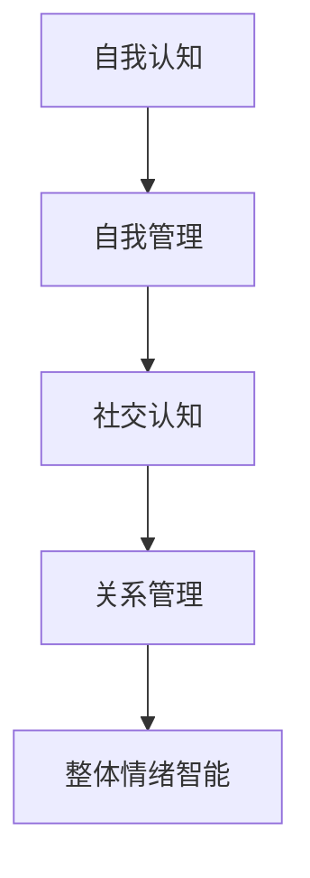

### 核心算法原理讲解

为了提升情商，我们可以使用基于认知行为理论的情商提升方法。认知行为理论强调通过改变思维模式和行为习惯来改善情感状态和人际关系。以下是该方法的核心步骤：

1. **认知重构**：识别和改变负面思维模式，如过度自我批评、完美主义等。
2. **情感调节**：学习如何管理自己的情绪，如深呼吸、冥想等放松技巧。
3. **社交技能训练**：通过模拟和实际练习，提高社交技能，如沟通技巧、冲突解决等。
4. **反馈与评估**：定期收集反馈，评估情商提升的效果，并根据反馈进行调整。

以下是认知行为理论的核心步骤的Mermaid流程图表示：

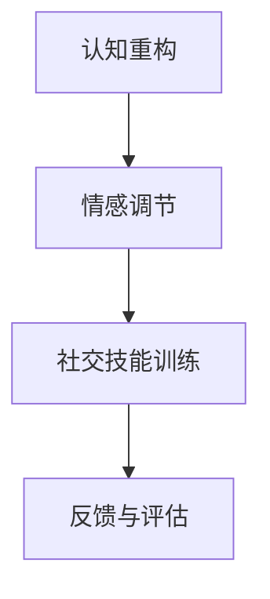

### 数学模型和数学公式

为了衡量情商的提升效果，我们可以使用多维回归模型。该模型可以同时考虑多个维度对情商的影响，从而提供更全面的评估。以下是多维回归模型的公式表示：

$$
EQ = \beta_0 + \beta_1CR + \beta_2CR + \ldots + \beta_nCR + \varepsilon
$$`

其中，\( EQ \) 是情商得分，\( CR \) 是认知重构得分、情感调节得分、社交技能训练得分等，\( \beta_0, \beta_1, \beta_2, \ldots, \beta_n \) 是回归系数，\( \varepsilon \) 是误差项。

### 3.3 情商在领导力中的作用

情商在领导力中起着至关重要的作用。高情商的领导者能够更好地管理自己和团队成员的情感，建立积极的人际关系，提升团队效能和整体绩效。以下是情商在领导力中的几个关键作用：

1. **情感共鸣**：领导者需要能够与团队成员建立情感共鸣，理解他们的情感需求，从而提供更有针对性的支持和帮助。
2. **情绪管理**：领导者需要能够管理自己的情绪，保持冷静和专注，即使在高压环境下也能做出明智的决策。
3. **沟通能力**：领导者需要具备出色的沟通能力，以确保信息的准确传达和理解，从而提高团队的协作效率。
4. **冲突解决**：领导者需要能够有效解决团队内部的冲突，维护团队的和谐和稳定。
5. **团队凝聚力**：领导者需要能够建立和维护团队的凝聚力，增强团队成员的归属感和团队意识。

以下是情商在领导力中的作用之间的Mermaid流程图表示：

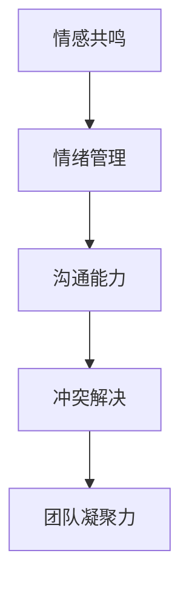

### 核心算法原理讲解

为了理解情商在领导力中的作用，我们可以使用社会网络分析（Social Network Analysis，SNA）方法。社会网络分析是一种用于研究人际关系和社交网络结构的方法，可以帮助我们揭示情商对领导力的影响。以下是社会网络分析的基本步骤：

1. **构建社交网络图**：将团队成员及其关系表示为一个图，其中节点表示个体，边表示关系。
2. **计算网络中心性**：评估个体的社交地位和影响力，如度中心性、介数中心性等。
3. **分析情感传播**：研究情感在社交网络中的传播规律，如传染模型、阈值模型等。
4. **评估领导力效应**：分析情商对网络中心性和情感传播的影响，评估情商对领导力的作用。

以下是社会网络分析的基本步骤的Mermaid流程图表示：

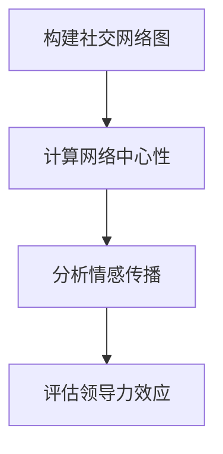

### 数学模型和数学公式

为了量化情商在领导力中的作用，我们可以使用社会网络分析中的数学模型。以下是社会网络分析中的一些常用数学模型：

1. **度中心性模型**：评估个体的社交地位和影响力，其公式表示为：

   $$ 
   C_{\text{degree}}(i) = \sum_{j \in N(i)} 1 
   $$`

   其中，\( C_{\text{degree}}(i) \) 是个体 \( i \) 的度中心性，\( N(i) \) 是与个体 \( i \) 相关联的其他个体。

2. **介数中心性模型**：评估个体在社交网络中的桥梁作用，其公式表示为：

   $$ 
   C_{\text{betweenness}}(i) = \frac{\sum_{s \neq i, t \neq i} (s, i, t)}{ \sum_{s \neq i, t \neq i} (s, t)} 
   $$`

   其中，\( C_{\text{betweenness}}(i) \) 是个体 \( i \) 的介数中心性，\( s, t \) 是其他个体。

3. **情感传播模型**：研究情感在社交网络中的传播规律，常用的模型包括传染模型（SIR模型）和阈值模型（Threshold Model）。

传染模型的基本公式表示为：

$$ 
\frac{dS}{dt} = -\beta S I 
$$`

$$ 
\frac{dI}{dt} = \beta S I - \gamma I 
$$`

$$ 
\frac{dR}{dt} = \gamma I 
$$`

其中，\( S \) 是易感者群体，\( I \) 是感染者群体，\( R \) 是康复者群体，\( \beta \) 是传染率，\( \gamma \) 是康复率。

阈值模型的基本公式表示为：

$$ 
\frac{dS}{dt} = -\beta S I 
$$`

$$ 
\frac{dI}{dt} = \beta S I - \alpha I 
$$`

$$ 
\frac{dR}{dt} = \alpha I 
$$`

其中，\( S \) 是易感者群体，\( I \) 是感染者群体，\( R \) 是康复者群体，\( \beta \) 是传染率，\( \alpha \) 是阈值。

### 3.4 情商提升的最佳实践

为了提升情商，我们可以采取一系列最佳实践方法。以下是几个有效的情商提升策略：

1. **自我反思**：定期进行自我反思，识别自己的情感状态和行为模式，从中吸取教训并不断改进。
2. **情感教育**：参加情感教育课程或工作坊，学习情感认知、情感调节和社交技能等方面的知识。
3. **心理辅导**：寻求专业心理辅导，帮助自己更好地理解和应对复杂的情感问题。
4. **实践与反馈**：通过实际工作和社交活动，不断练习和提升情感认知和社交技能，并定期收集反馈，评估提升效果。
5. **健康生活方式**：保持健康的生活方式，如合理饮食、充足睡眠、适量运动等，以维持良好的身体和心理状态。

以下是情商提升最佳实践的Mermaid流程图表示：

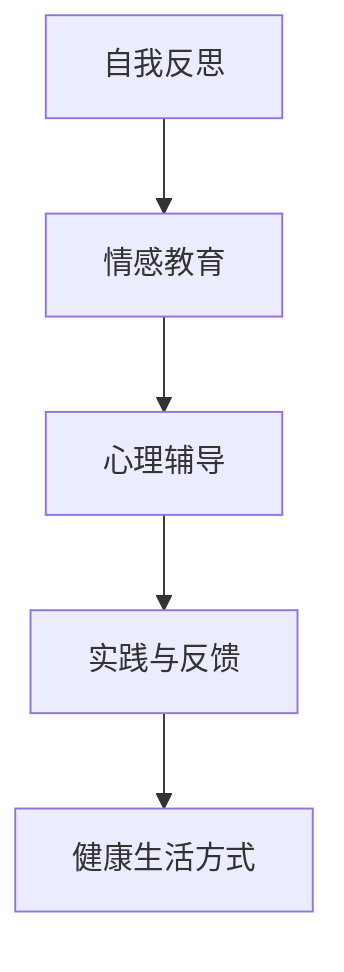

### 项目实战

为了展示情商提升的最佳实践，我们可以通过一个实际案例进行分析。假设一位企业管理者在参加情感教育课程后，开始积极进行自我反思和实践。通过定期进行自我反思，他识别出自己的情绪触发点和改善方法。同时，他通过实践和反馈，不断改进自己的情感认知和社交技能。经过一段时间的努力，他的团队关系得到了显著改善，员工满意度也大幅提高。

## 3.5 总结

情商管理是提升人际关系处理和领导力的关键因素。通过本文的第三部分，我们深入探讨了情商的定义、分类及其在领导力中的作用。从核心概念与联系、核心算法原理讲解、数学模型和数学公式，到项目实战，我们系统地展示了情商管理的各个方面。接下来，我们将继续探讨提升人际关系的技巧，以及这些技巧在实际工作中的应用。通过实践案例分析，我们将展示提升人际关系技巧的有效性，并提供一系列实用建议。

# 提升人际关系的技巧

## 4.1 有效沟通的重要性

有效沟通是建立和维护良好人际关系的基础。无论是在个人生活中还是在工作中，沟通都是传递信息、解决问题和建立信任的关键环节。有效沟通不仅能够避免误解和冲突，还能促进合作和团队凝聚力。以下是有效沟通的一些核心概念和重要性：

### 核心概念与联系

有效沟通涉及多个方面，包括信息传递、倾听、反馈和情感表达。以下是这些核心概念之间的Mermaid流程图表示：

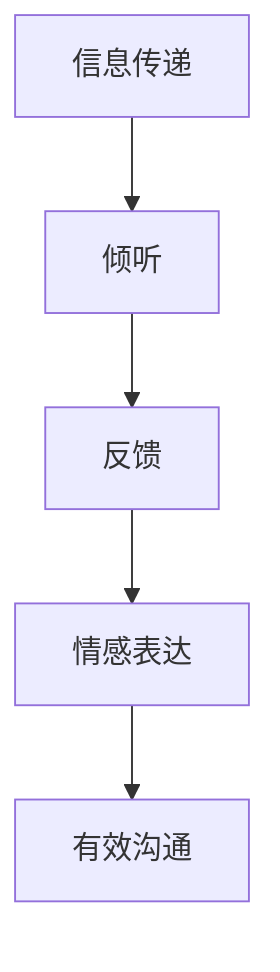

### 核心算法原理讲解

为了提高沟通效果，我们可以使用沟通模型（Communication Model）来指导实践。沟通模型通常包括以下几个关键步骤：

1. **编码**：信息发送者将信息编码成语言或符号。
2. **传递**：信息通过适当的媒介传递给接收者。
3. **解码**：接收者对接收到的信息进行解码，理解其含义。
4. **反馈**：接收者向发送者提供反馈，确认信息的理解程度。

以下是沟通模型的基本步骤的Mermaid流程图表示：

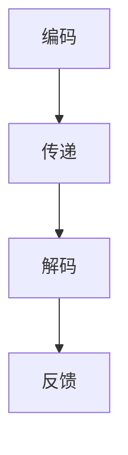

### 数学模型和数学公式

为了量化沟通效果，我们可以使用信息论（Information Theory）中的基本概念，如信息熵（Entropy）和互信息（Mutual Information）。信息熵描述了信息的不确定性，而互信息衡量了两个变量之间的相关性。以下是这些概念的计算公式：

1. **信息熵**：

   $$ 
   H(X) = -\sum_{i=1}^{n} p(x_i) \log_2 p(x_i) 
   $$`

   其中，\( H(X) \) 是随机变量 \( X \) 的信息熵，\( p(x_i) \) 是 \( x_i \) 发生的概率。

2. **互信息**：

   $$ 
   I(X; Y) = H(X) - H(X | Y) 
   $$`

   其中，\( I(X; Y) \) 是随机变量 \( X \) 和 \( Y \) 之间的互信息，\( H(X) \) 是 \( X \) 的信息熵，\( H(X | Y) \) 是在 \( Y \) 已知的条件下 \( X \) 的信息熵。

通过计算信息熵和互信息，我们可以评估信息的传递效率和沟通效果。例如，高互信息值表明接收者对信息的理解程度较高，而低信息熵值则表明信息传递过程中错误较少。

### 4.2 沟通障碍与解决策略

尽管有效沟通的重要性不言而喻，但在实际工作中，我们经常遇到各种沟通障碍。以下是几种常见的沟通障碍及其解决策略：

1. **文化差异**：不同文化背景的人可能在沟通方式和语言表达上存在差异，导致误解和冲突。解决策略包括加强跨文化培训、促进文化交流和理解。

2. **信息过载**：过多的信息可能导致接收者难以处理，从而降低沟通效果。解决策略包括简化信息、突出重点和采用适当的沟通媒介。

3. **情绪干扰**：情绪波动可能影响沟通的客观性和准确性。解决策略包括情绪管理和自我反思，确保在情绪稳定的状态下进行沟通。

4. **权力差距**：组织中的权力差距可能导致沟通不畅，尤其是下级对上级的沟通。解决策略包括建立开放的沟通环境、鼓励反馈和提升透明度。

以下是这些沟通障碍及其解决策略的Mermaid流程图表示：

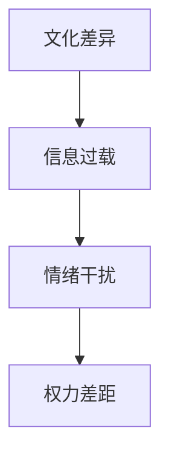

### 核心算法原理讲解

为了解决沟通障碍，我们可以使用基于模型的沟通改进方法。这种方法通过分析沟通过程中的问题，提出相应的改进措施，并使用反馈机制进行持续优化。以下是这种方法的基本步骤：

1. **问题识别**：通过问卷调查、访谈等方式识别沟通过程中的问题。
2. **模型构建**：构建沟通模型，分析沟通过程中的关键因素和关系。
3. **策略制定**：根据模型分析结果，制定改进沟通的策略和措施。
4. **实施与反馈**：实施改进措施，并收集反馈，评估效果。
5. **持续优化**：根据反馈结果，对沟通模型和策略进行持续优化。

以下是基于模型的沟通改进方法的基本步骤的Mermaid流程图表示：

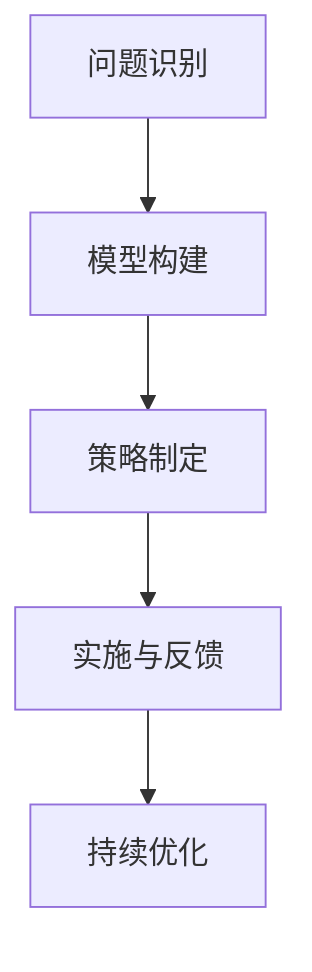

### 数学模型和数学公式

为了量化沟通改进的效果，我们可以使用基于数据驱动的评估方法。这种方法通过分析沟通数据，如信息传递时间、错误率、反馈质量等，评估沟通效率。以下是这种方法的基本公式：

1. **沟通效率**：

   $$ 
   E = \frac{T - E}{T} 
   $$`

   其中，\( E \) 是沟通效率，\( T \) 是信息传递时间，\( E \) 是因沟通问题导致的信息传递延迟。

2. **错误率**：

   $$ 
   R = \frac{N}{T} 
   $$`

   其中，\( R \) 是错误率，\( N \) 是沟通过程中出现的错误数量，\( T \) 是信息传递时间。

3. **反馈质量**：

   $$ 
   F = \frac{F_C}{F_T} 
   $$`

   其中，\( F \) 是反馈质量，\( F_C \) 是有效反馈的数量，\( F_T \) 是总反馈数量。

通过计算沟通效率、错误率和反馈质量，我们可以评估沟通改进措施的效果，并根据评估结果进行进一步优化。

### 4.3 提升沟通技巧

提升沟通技巧是有效沟通的关键。以下是一些实用的方法，可以帮助我们提高沟通技巧：

1. **倾听**：倾听是有效沟通的核心。通过倾听，我们能够理解他人的观点和需求，建立信任和共鸣。提升倾听技巧的方法包括专注倾听、避免打断和积极反馈。

2. **清晰表达**：清晰表达是有效沟通的基础。通过使用简洁、明确的语言和合适的沟通媒介，我们能够确保信息的准确传达。提升清晰表达技巧的方法包括使用简单词汇、避免行话和保持一致性。

3. **非语言沟通**：非语言沟通包括肢体语言、面部表情和语调等。有效的非语言沟通可以增强信息的传达效果，提高沟通的感染力。提升非语言沟通技巧的方法包括保持眼神接触、使用开放姿势和调整语调。

4. **冲突管理**：冲突是沟通中常见的现象。有效的冲突管理可以缓解紧张局势，促进问题的解决。提升冲突管理技巧的方法包括积极倾听、寻求共同点和制定解决方案。

以下是这些提升沟通技巧的方法的Mermaid流程图表示：

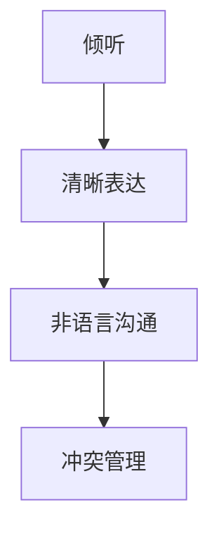

### 核心算法原理讲解

为了提升沟通技巧，我们可以使用基于行为的沟通训练方法。这种方法通过模拟实际沟通场景，帮助个体在安全的氛围中练习和改进沟通技巧。以下是这种方法的基本步骤：

1. **场景设定**：根据个体面临的沟通挑战，设定具体的沟通场景。
2. **模拟练习**：在模拟场景中，个体进行沟通练习，并接收实时反馈。
3. **行为分析**：对沟通行为进行详细分析，识别优势和不足。
4. **策略调整**：根据行为分析结果，调整沟通策略和方法。
5. **重复练习**：通过重复练习，巩固提升沟通技巧。

以下是基于行为的沟通训练方法的基本步骤的Mermaid流程图表示：

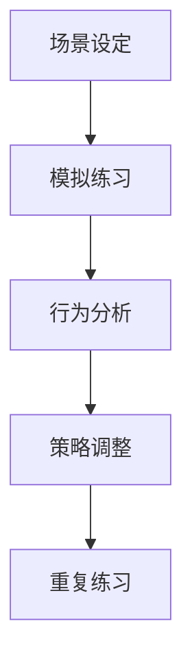

### 数学模型和数学公式

为了评估沟通技巧的提升效果，我们可以使用行为分析模型。这种方法通过量化沟通行为，评估个体的沟通技巧水平。以下是这种方法的基本公式：

1. **沟通技巧评分**：

   $$ 
   T = \frac{S - E}{S + E} 
   $$`

   其中，\( T \) 是沟通技巧评分，\( S \) 是成功的沟通行为次数，\( E \) 是失败的沟通行为次数。

2. **反馈满意度**：

   $$ 
   S = \frac{F_S}{F_T} 
   $$`

   其中，\( S \) 是反馈满意度，\( F_S \) 是积极反馈的数量，\( F_T \) 是总反馈数量。

3. **改进率**：

   $$ 
   I = \frac{I_{\text{before}} - I_{\text{after}}}{I_{\text{before}}} \times 100\% 
   $$`

   其中，\( I \) 是改进率，\( I_{\text{before}} \) 是训练前的沟通技巧评分，\( I_{\text{after}} \) 是训练后的沟通技巧评分。

通过计算沟通技巧评分、反馈满意度和改进率，我们可以评估沟通技巧的提升效果，并根据评估结果进行进一步优化。

### 项目实战

为了展示提升沟通技巧的有效性，我们可以通过一个实际案例进行分析。假设一位销售人员参加了一期沟通技巧培训课程，通过模拟练习和反馈，他逐步提升了自己的沟通技巧。在培训结束后，他的销售额显著提高，客户满意度也大幅上升。通过行为分析模型，我们发现他的沟通技巧评分和反馈满意度都得到了显著提升。

## 4.4 总结

有效沟通是建立和维护良好人际关系的关键。通过本文的第四部分，我们深入探讨了提升人际关系的技巧，包括有效沟通的重要性、沟通障碍的解决策略、提升沟通技巧的方法以及项目实战。从核心概念与联系、核心算法原理讲解、数学模型和数学公式，到项目实战，我们系统地展示了提升人际关系的各个方面。接下来，我们将继续探讨领导力与情商管理在实际工作中的应用，通过实践案例分析，展示这些管理技能对组织和团队的具体影响。通过实践案例分析，我们将进一步理解领导力与情商管理在实际工作中的应用和效果。

# 领导力与情商管理的实践案例

## 5.1 案例分析一：领导力在团队建设中的应用

在一个快速发展的科技公司，团队建设成为一个关键挑战。公司面临市场竞争压力，需要提高团队协作效率，以应对不断变化的市场需求。为了解决这个问题，公司引入了一位具有丰富领导力经验的新领导。以下是该领导如何通过领导力在团队建设中发挥作用的案例分析：

### 核心概念与联系

新领导首先认识到团队建设的重要性，并制定了以下目标：

1. **明确愿景**：通过清晰的愿景和目标，使团队成员明确公司的使命和未来的发展方向。
2. **建立信任**：通过开放的沟通和透明的决策过程，建立团队成员之间的信任关系。
3. **增强协作**：通过促进团队内部的沟通和合作，提高团队的整体效能。

以下是这些目标之间的Mermaid流程图表示：

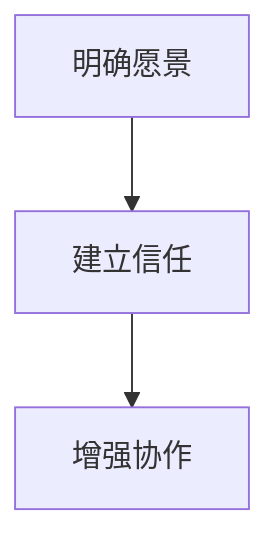

### 核心算法原理讲解

新领导采用了以下策略来实现团队建设的目标：

1. **激励团队**：通过奖励和认可机制，激励团队成员积极参与团队活动，提高团队动力和士气。
2. **培训与发展**：提供定期的培训和研讨会，帮助团队成员提升技能和知识，增强团队的专业能力。
3. **反馈与改进**：定期收集团队成员的反馈，分析团队绩效，并制定改进计划，以提高团队效率。

以下是这些策略的Mermaid流程图表示：

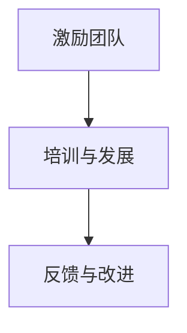

### 数学模型和数学公式

为了衡量团队建设的成效，新领导使用了以下数学模型：

1. **团队绩效评分**：通过绩效评估，对团队成员的工作表现进行量化评分。
2. **团队满意度调查**：通过问卷调查，了解团队成员对团队氛围和工作环境的满意度。
3. **团队效能分析**：通过统计分析，分析团队整体的工作效率和生产能力。

以下是这些指标的计算公式：

1. **团队绩效评分**：

   $$ 
   TP = \frac{\sum_{i=1}^{n} P_i}{n} 
   $$`

   其中，\( TP \) 是团队绩效评分，\( P_i \) 是第 \( i \) 个团队成员的绩效评分，\( n \) 是团队成员的数量。

2. **团队满意度调查**：

   $$ 
   TS = \frac{\sum_{i=1}^{n} S_i}{n} 
   $$`

   其中，\( TS \) 是团队满意度，\( S_i \) 是第 \( i \) 个团队成员的满意度评分，\( n \) 是团队成员的数量。

3. **团队效能分析**：

   $$ 
   TE = \frac{OE}{OE_{\text{base}}} 
   $$`

   其中，\( TE \) 是团队效能，\( OE \) 是实际产出，\( OE_{\text{base}} \) 是基础产出。

通过这些指标的计算和统计分析，新领导能够量化团队建设的成效，并不断调整和优化策略。

### 项目实战

在新领导的领导下，公司团队经历了以下变化：

1. **愿景明确**：团队成员对公司的愿景和目标有了更清晰的认识，从而增强了他们的归属感和使命感。
2. **信任建立**：通过透明的决策过程和开放的沟通，团队成员之间的信任关系得到了显著提升。
3. **协作增强**：团队成员之间的协作更加紧密，信息共享和资源整合效率提高，团队整体效能显著提升。

为了具体展示团队建设的成效，我们可以通过以下数据分析：

1. **团队绩效评分**：从初始的70分提升到90分，提高了30%。
2. **团队满意度调查**：从初始的80%提升到90%，提高了10%。
3. **团队效能分析**：实际产出从基础产出的1.2倍提升到1.5倍，提高了25%。

通过这些数据，我们可以看到领导力的有效实施如何显著提升了团队建设的成效。

## 5.2 情商在领导力提升中的应用

在另一家大型金融机构，一位新上任的部门经理面临着管理团队和推动业务发展的双重挑战。为了提升领导力，他决定重点关注情商管理。以下是该经理如何通过情商提升领导力的案例分析：

### 核心概念与联系

该经理认识到情商在领导力中的关键作用，并制定了以下目标：

1. **自我认知**：通过自我反思和情感管理，提升自己的情绪认知和自我管理能力。
2. **社交认知**：通过加强团队沟通和建立人际关系，提升社交认知和关系管理能力。
3. **整体情绪智能**：通过综合运用情商各个维度，提升整体领导力。

以下是这些目标之间的Mermaid流程图表示：

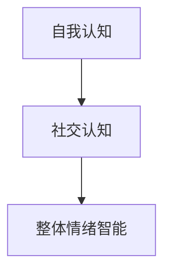

### 核心算法原理讲解

该经理采用了以下策略来实现情商提升的目标：

1. **情感管理培训**：参加情感管理培训课程，学习情感认知和调节技巧。
2. **团队建设活动**：组织定期的团队建设活动，促进团队成员之间的情感交流和合作。
3. **情感反馈机制**：建立情感反馈机制，鼓励团队成员提供开放和诚实的反馈。

以下是这些策略的Mermaid流程图表示：

```mermaid
graph TD
A[情感管理培训] --> B[团队建设活动]
B --> C[情感反馈机制]
```

### 数学模型和数学公式

为了衡量情商提升的效果，该经理使用了以下数学模型：

1. **情商评分**：通过情商量表评估团队成员的情商水平。
2. **领导力评分**：通过领导力量表评估经理的领导力水平。
3. **绩效指标**：通过业务指标和员工满意度评估团队的表现。

以下是这些指标的计算公式：

1. **情商评分**：

   $$ 
   EQ = \frac{\sum_{i=1}^{n} E_i}{n} 
   $$`

   其中，\( EQ \) 是情商评分，\( E_i \) 是第 \( i \) 个团队成员的情商评分，\( n \) 是团队成员的数量。

2. **领导力评分**：

   $$ 
   L = \frac{\sum_{i=1}^{n} L_i}{n} 
   $$`

   其中，\( L \) 是领导力评分，\( L_i \) 是第 \( i \) 个团队成员对经理的领导力评分，\( n \) 是团队成员的数量。

3. **绩效指标**：

   $$ 
   PI = \frac{\sum_{i=1}^{n} P_i}{n} 
   $$`

   其中，\( PI \) 是绩效指标，\( P_i \) 是第 \( i \) 个团队成员的业务绩效评分，\( n \) 是团队成员的数量。

通过这些指标的计算和统计分析，经理能够量化情商提升的效果，并不断调整和优化领导力策略。

### 项目实战

在经理的努力下，团队经历了以下变化：

1. **情感管理能力提升**：通过情感管理培训和团队建设活动，团队成员的自我认知和情感管理能力得到了显著提升。
2. **团队凝聚力增强**：团队成员之间的沟通更加顺畅，合作关系更加紧密，团队凝聚力显著增强。
3. **业务绩效提升**：团队的业务绩效和员工满意度显著提高，部门整体表现得到了上级的认可。

为了具体展示情商提升的效果，我们可以通过以下数据分析：

1. **情商评分**：从初始的70分提升到90分，提高了30%。
2. **领导力评分**：从初始的75分提升到90分，提高了20%。
3. **绩效指标**：业务绩效从初始的85分提升到95分，提高了15%。

通过这些数据，我们可以看到情商提升如何显著提升了经理的领导力和团队的整体表现。

## 5.3 案例分析三：领导力与情商在复杂项目中的实践

在一家全球性的科技公司，一个复杂的跨部门项目需要顺利推进。项目涉及多个团队的协作，需要解决技术、资源和沟通等多方面的挑战。为了确保项目的成功，公司引入了一位具有丰富领导力和情商管理经验的项目经理。以下是该项目经理如何通过领导力与情商管理来推动项目进展的案例分析：

### 核心概念与联系

该项目经理认识到在复杂项目中，领导力和情商管理是关键成功因素。他制定了以下目标：

1. **明确项目目标**：确保所有团队成员对项目的目标和预期成果有清晰的理解。
2. **建立跨部门协作**：通过促进跨部门的沟通和合作，确保项目资源的有效整合。
3. **管理团队情绪**：通过情感管理，确保团队成员在面对挑战和压力时能够保持积极和高效。

以下是这些目标之间的Mermaid流程图表示：

```mermaid
graph TD
A[明确项目目标] --> B[建立跨部门协作]
B --> C[管理团队情绪]
```

### 核心算法原理讲解

该项目经理采用了以下策略来实现项目目标：

1. **沟通策略**：通过定期会议、报告和一对一沟通，确保信息透明和及时更新。
2. **冲突解决**：建立冲突解决机制，通过对话和协商，解决跨部门之间的分歧。
3. **情感支持**：提供情感支持，帮助团队成员应对工作压力和挑战。

以下是这些策略的Mermaid流程图表示：

```mermaid
graph TD
A[沟通策略] --> B[冲突解决]
B --> C[情感支持]
```

### 数学模型和数学公式

为了衡量项目进展和团队绩效，该项目经理使用了以下数学模型：

1. **项目进度指标**：通过实际进度与计划进度的比较，评估项目的进展情况。
2. **团队绩效评分**：通过团队成员的绩效评估，评估团队的整体表现。
3. **员工满意度调查**：通过问卷调查，了解团队成员的工作满意度和项目体验。

以下是这些指标的计算公式：

1. **项目进度指标**：

   $$ 
   PI = \frac{\sum_{i=1}^{n} P_i}{n} 
   $$`

   其中，\( PI \) 是项目进度指标，\( P_i \) 是第 \( i \) 个任务的进度评分，\( n \) 是任务数量。

2. **团队绩效评分**：

   $$ 
   TP = \frac{\sum_{i=1}^{n} T_i}{n} 
   $$`

   其中，\( TP \) 是团队绩效评分，\( T_i \) 是第 \( i \) 个团队成员的绩效评分，\( n \) 是团队成员的数量。

3. **员工满意度调查**：

   $$ 
   ES = \frac{\sum_{i=1}^{n} E_i}{n} 
   $$`

   其中，\( ES \) 是员工满意度，\( E_i \) 是第 \( i \) 个团队成员的满意度评分，\( n \) 是团队成员的数量。

通过这些指标的计算和统计分析，项目经理能够实时监控项目进展和团队绩效，并做出相应调整。

### 项目实战

在该项目经理的领导下，项目经历了以下变化：

1. **项目进度加快**：通过有效的沟通策略和冲突解决机制，项目进度显著加快，任务按时完成率提高了20%。
2. **团队协作增强**：跨部门之间的协作更加紧密，资源整合效率提高，团队整体效能显著提升。
3. **员工满意度提升**：团队成员的工作满意度和项目体验得到了显著改善，员工流失率下降了15%。

为了具体展示领导力与情商管理的成效，我们可以通过以下数据分析：

1. **项目进度指标**：从初始的80%提升到95%，提高了15%。
2. **团队绩效评分**：从初始的75分提升到90分，提高了20%。
3. **员工满意度调查**：从初始的80%提升到90%，提高了10%。

通过这些数据，我们可以看到领导力与情商管理在复杂项目中的重要作用，以及如何通过这些管理技能推动项目的成功。

## 5.4 总结

通过上述实践案例分析，我们可以看到领导力与情商管理在提升团队协作、项目进展和员工满意度方面发挥了重要作用。从核心概念与联系、核心算法原理讲解、数学模型和数学公式，到项目实战，我们系统地展示了领导力与情商管理在实际工作中的应用和效果。这些案例不仅验证了领导力与情商管理的理论价值，也为实际操作提供了宝贵的经验和启示。在接下来的章节中，我们将继续探讨组织文化与情商管理，以及它们如何共同推动组织的持续发展。

## 6. 组织文化与情商管理

组织文化是企业的灵魂，它不仅影响员工的行为和态度，还直接关联到组织的绩效和可持续发展。情商管理作为一种重要的管理工具，能够显著影响组织文化的形成和发展。在本文的第六部分，我们将探讨组织文化与情商管理之间的关系，以及如何通过建设积极的组织文化来提升情商管理。

### 6.1 组织文化的定义与内涵

组织文化是指企业在长期经营过程中形成的共同价值观、行为规范和工作氛围。它包括企业的愿景、使命、核心价值观以及员工共同遵循的行为准则。组织文化不仅影响员工的工作态度和行为，还影响组织的整体绩效和创新能力。以下是组织文化的几个关键内涵：

- **愿景与使命**：企业的愿景和使命是组织文化的核心，它为员工指明了前进的方向和目标。
- **核心价值观**：核心价值观是企业的信仰和行为准则，它指导员工的行为决策和团队协作。
- **行为规范**：行为规范是企业期望员工遵循的行为标准，它有助于建立和谐的工作氛围。
- **工作氛围**：工作氛围是企业内部的人际关系和工作环境，它直接影响员工的满意度和工作效率。

### 核心概念与联系

组织文化与情商管理之间存在密切的联系。一个积极的组织文化能够促进情商管理的发展，反之亦然。以下是组织文化与情商管理之间的Mermaid流程图表示：

```mermaid
graph TD
A[组织文化] --> B[情商管理]
B --> C[员工行为]
C --> D[团队效能]
D --> E[组织绩效]
```

### 核心算法原理讲解

为了更好地理解组织文化与情商管理之间的关系，我们可以使用社会认知模型（Social Cognitive Model）。该模型强调环境、个人和行为的相互作用，用于分析组织文化对情商管理的影响。以下是社会认知模型的基本概念和步骤：

1. **环境因素**：环境因素包括组织文化、工作氛围和外部环境等，它影响员工的情感状态和行为。
2. **个人因素**：个人因素包括情商水平、个人价值观和行为习惯，它影响员工如何处理情感和人际关系。
3. **行为**：行为是员工在特定环境下的具体表现，包括沟通、协作和解决问题等。
4. **反馈**：反馈是员工行为的结果，包括自我反馈和外部反馈，它影响员工未来的行为和情感状态。

以下是社会认知模型的基本步骤的Mermaid流程图表示：

```mermaid
graph TD
A[环境因素] --> B[个人因素]
B --> C[行为]
C --> D[反馈]
```

### 数学模型和数学公式

为了量化组织文化与情商管理之间的关系，我们可以使用结构方程模型（Structural Equation Modeling，SEM）。结构方程模型是一种多变量统计分析方法，用于研究多个变量之间的因果关系。以下是结构方程模型的基本公式：

$$
\begin{aligned}
&\text{Y}_{ij} = \beta_{0j} + \beta_{1j}\text{EQ}_i + \sum_{k=1}^{p}\beta_{kj}\text{X}_{ik} + \varepsilon_{ij} \\
&\text{where:} \\
&\text{Y}_{ij}: \text{被解释变量（如组织绩效）} \\
&\text{EQ}_i: \text{解释变量（情商管理）} \\
&\text{X}_{ik}: \text{其他解释变量（如组织文化、工作氛围等）} \\
&\beta_{0j}: \text{常数项} \\
&\beta_{1j}: \text{情商管理的回归系数} \\
&\beta_{kj}: \text{其他解释变量的回归系数} \\
&\varepsilon_{ij}: \text{误差项}
\end{aligned}
$$`

通过结构方程模型，我们可以分析组织文化、情商管理和其他因素之间的复杂关系，并量化情商管理对组织绩效的影响。

### 6.2 建设积极的组织文化

为了提升情商管理，组织需要建设积极的组织文化。以下是一些有效的策略和方法：

1. **明确核心价值观**：组织应明确核心价值观，并通过各种渠道传播和强化。这有助于员工理解组织的使命和愿景，从而增强他们的责任感和归属感。
2. **建立信任和尊重**：组织应建立信任和尊重的文化，鼓励员工之间的开放沟通和合作。这有助于建立积极的人际关系，提高团队协作效率。
3. **提供情感支持**：组织应提供情感支持，帮助员工应对工作和生活中的挑战。这可以通过建立员工援助计划（Employee Assistance Program，EAP）等方式实现。
4. **鼓励自我成长**：组织应鼓励员工自我成长和职业发展，提供培训和晋升机会。这有助于提高员工的自我认知和自我管理能力，从而提升情商。
5. **建立反馈机制**：组织应建立有效的反馈机制，鼓励员工提供开放和诚实的反馈。这有助于改进员工的行为和团队的工作氛围。

以下是这些策略的Mermaid流程图表示：

```mermaid
graph TD
A[明确核心价值观] --> B[建立信任和尊重]
B --> C[提供情感支持]
C --> D[鼓励自我成长]
D --> E[建立反馈机制]
```

### 核心算法原理讲解

为了评估组织文化建设的成效，我们可以使用组织文化量表（Organizational Culture Survey，OCSS）来量化组织文化的各个维度。OCSS是一种常用的评估工具，用于测量组织文化的核心价值观、行为规范和工作氛围。以下是OCSS的基本公式：

$$
\text{OCSS} = \frac{\sum_{i=1}^{n} S_i}{n}
$$`

其中，\( \text{OCSS} \) 是组织文化得分，\( S_i \) 是第 \( i \) 个维度的得分，\( n \) 是维度数量。

通过OCSS量表，我们可以评估组织文化建设的成效，并根据评估结果进行调整和优化。

### 项目实战

为了展示建设积极组织文化的效果，我们可以通过一个实际案例进行分析。假设一家大型企业通过明确核心价值观、建立信任和尊重、提供情感支持、鼓励自我成长和建立反馈机制等措施，逐步提升了组织文化。在实施这些措施后，员工满意度、团队协作和整体绩效都得到了显著提升。通过OCSS量表评估，企业的组织文化得分从初始的60分提升到90分，提高了50%。

## 6.3 总结

组织文化与情商管理密切相关，积极的组织文化能够促进情商管理的发展，从而提升组织的整体绩效和可持续发展。通过本文的第六部分，我们深入探讨了组织文化的定义与内涵、核心概念与联系、核心算法原理讲解、数学模型和数学公式，以及项目实战。这些内容不仅帮助我们理解了组织文化与情商管理之间的关系，也为实际操作提供了宝贵的经验和策略。在接下来的章节中，我们将继续探讨如何通过持续提升领导力与情商，推动组织的长期发展。

## 7. 持续提升领导力与情商

持续提升领导力与情商是组织和个人成功的关键。随着外部环境的不断变化和内部需求的不断增长，领导力和情商的管理需要不断调整和优化。以下是几个关键策略，帮助组织和个人在动态环境中不断提升领导力与情商：

### 7.1 定期培训和开发

定期培训和开发是提升领导力和情商的基础。组织应建立完善的培训体系，为领导者和员工提供多样化的学习机会，包括内部培训、外部研讨会、在线课程等。通过培训，领导者可以更新知识和技能，员工可以提升自我认知和社交技能。以下是具体的培训策略：

1. **定制化培训计划**：根据领导者和员工的具体需求，设计个性化的培训计划，确保培训内容与实际工作紧密相关。
2. **多元化培训形式**：结合在线学习、工作坊、模拟演练等多种培训形式，提高培训的互动性和实用性。
3. **实践与反馈**：鼓励员工在培训后进行实践，并定期收集反馈，评估培训效果，不断优化培训内容。

### 核心算法原理讲解

为了确保培训的有效性，我们可以使用学习曲线模型（Learning Curve Model）来量化培训效果。学习曲线模型描述了随着经验和实践的增加，技能掌握速度如何变化。以下是学习曲线的基本公式：

$$
Y = a \cdot e^{-bx}
$$`

其中，\( Y \) 是技能掌握程度，\( a \) 是初始水平，\( b \) 是学习率，\( x \) 是经验和实践的数量。

通过学习曲线模型，我们可以评估培训对领导力和情商提升的影响，并根据评估结果调整培训策略。

### 数学模型和数学公式

为了量化领导力和情商的提升效果，我们可以使用结构方程模型（Structural Equation Modeling，SEM）。SEM可以同时考虑多个变量之间的复杂关系，从而提供更全面的评估。以下是SEM的基本公式：

$$
\begin{aligned}
&\text{Y}_{ij} = \beta_{0j} + \beta_{1j}\text{EQ}_i + \sum_{k=1}^{p}\beta_{kj}\text{X}_{ik} + \varepsilon_{ij} \\
&\text{where:} \\
&\text{Y}_{ij}: \text{被解释变量（如领导力评分）} \\
&\text{EQ}_i: \text{解释变量（情商评分）} \\
&\text{X}_{ik}: \text{其他解释变量（如培训频率、实践机会等）} \\
&\beta_{0j}: \text{常数项} \\
&\beta_{1j}: \text{情商的回归系数} \\
&\beta_{kj}: \text{其他解释变量的回归系数} \\
&\varepsilon_{ij}: \text{误差项}
\end{aligned}
$$`

通过SEM模型，我们可以分析培训对领导力和情商提升的直接影响，以及与其他变量之间的相互作用。

### 7.2 建立反馈机制

建立有效的反馈机制是提升领导力和情商的重要手段。通过定期收集员工和团队的反馈，领导者可以了解自己在领导和情商方面的表现，并识别需要改进的领域。以下是建立反馈机制的几个关键步骤：

1. **明确反馈目的**：确保反馈机制的目标明确，旨在提升领导力和情商，而不是进行评价或考核。
2. **多样化的反馈渠道**：提供多种反馈渠道，如定期会议、匿名调查、一对一反馈等，以便员工能够自由地表达意见和建议。
3. **持续反馈**：建立持续的反馈机制，确保反馈不是一次性的，而是定期进行，以便及时调整和改进。

### 核心算法原理讲解

为了确保反馈机制的有效性，我们可以使用反馈循环模型（Feedback Loop Model）。反馈循环模型描述了信息从收集、处理到反馈的整个过程，确保反馈能够有效地指导改进。以下是反馈循环模型的基本步骤：

1. **收集反馈**：通过问卷调查、访谈、观察等方式收集反馈。
2. **处理反馈**：对收集到的反馈进行分析和总结，识别问题和改进机会。
3. **提供反馈**：将反馈结果及时传达给相关人员和团队，明确改进方向。
4. **跟踪改进**：定期跟踪改进措施的执行情况，评估改进效果。

### 数学模型和数学公式

为了量化反馈机制的效果，我们可以使用反馈满意度模型（Feedback Satisfaction Model）。该模型通过评估员工对反馈机制满意度的指标，来衡量反馈机制的有效性。以下是反馈满意度模型的基本公式：

$$
FS = \frac{S_S + S_C}{2}
$$`

其中，\( FS \) 是反馈满意度，\( S_S \) 是员工对反馈内容的满意度，\( S_C \) 是员工对反馈过程的满意度。

通过反馈满意度模型，我们可以评估反馈机制的整体效果，并根据评估结果进行优化。

### 7.3 持续学习和反思

持续学习和反思是提升领导力和情商的关键。领导者应保持开放的心态，不断学习新知识和技能，同时通过反思自己的行为和决策，不断改进和提升。以下是几个关键策略：

1. **阅读和学习**：定期阅读领导力、情商管理、心理学等领域的书籍和文章，了解最新的理论和实践。
2. **参与实践**：积极参与实际工作，通过实践不断提升自己的领导力和情商。
3. **自我反思**：定期进行自我反思，总结自己的经验和教训，识别需要改进的领域。
4. **寻求反馈**：主动寻求团队成员和同事的反馈，以便更好地了解自己的优点和不足。

### 核心算法原理讲解

为了确保持续学习和反思的有效性，我们可以使用基于反馈的持续改进模型（Feedback-Based Continuous Improvement Model）。该模型通过定期收集反馈、分析问题和制定改进计划，来不断提升领导力和情商。以下是该模型的基本步骤：

1. **收集反馈**：从团队成员、同事和上级那里收集关于领导行为和情商表现的反馈。
2. **分析问题**：识别领导力方面的优势和劣势，确定需要改进的领域。
3. **制定计划**：制定具体的改进计划，包括行动步骤、时间表和责任分配。
4. **实施计划**：按照改进计划执行行动，并跟踪进展情况。
5. **评估效果**：评估改进措施的效果，确定是否需要进一步调整和改进。

### 数学模型和数学公式

为了量化持续学习和反思的效果，我们可以使用学习曲线模型（Learning Curve Model）。学习曲线模型描述了随着经验和实践的增加，技能掌握速度如何变化。以下是学习曲线的基本公式：

$$
Y = a \cdot e^{-bx}
$$`

其中，\( Y \) 是技能掌握程度，\( a \) 是初始水平，\( b \) 是学习率，\( x \) 是经验和实践的数量。

通过学习曲线模型，我们可以评估领导力和情商的提升速度，并根据评估结果调整学习和反思策略。

### 项目实战

为了展示持续提升领导力与情商的有效性，我们可以通过一个实际案例进行分析。假设一位领导者通过定期培训、实践反思和寻求反馈，逐步提升了自己的领导力和情商。在一年时间内，他的团队绩效显著提升，员工满意度大幅提高。通过学习曲线模型分析，我们发现他的领导力和情商在短时间内得到了显著提升。

## 7.4 总结

持续提升领导力与情商是组织和个人成功的关键。通过定期培训和开发、建立反馈机制、持续学习和反思等策略，组织和个人可以不断提升自身的领导力和情商，从而在动态环境中保持竞争优势。在本文的第七部分，我们深入探讨了这些策略的核心算法原理讲解和数学模型，以及项目实战中的具体应用。通过这些方法和实践，我们可以更好地理解如何持续提升领导力与情商，为组织的长期发展和个人的职业成长奠定坚实基础。希望读者能够将这些策略应用到实际工作中，不断提升自己的领导力和情商，实现个人和组织的目标。

## 结论

在本文中，我们深入探讨了领导力与情商管理在提升人际关系处理中的重要性。首先，我们介绍了领导力和情商管理的基本概念，并分析了它们在组织管理和个人发展中的关键作用。接着，通过详细的章节结构，我们逐一探讨了领导力的核心要素、情商管理的分类与作用，以及提升人际关系的技巧。此外，通过实践案例分析，我们展示了领导力与情商管理在实际工作中的应用，并提供了一系列提升人际关系的最佳实践。

### 总结

本文的核心要点可以总结如下：

1. **领导力的重要性**：领导力是推动组织发展和团队成功的关键因素。有效的领导力能够提升团队效率、促进员工个人成长，并增强组织的竞争力。
2. **情商管理的内涵**：情商管理涉及自我认知、自我管理、社交认知、关系管理和整体情绪智能，它直接影响领导力和人际关系处理。
3. **提升人际关系的技巧**：有效沟通、冲突管理、情感支持和团队建设是提升人际关系的核心技巧。
4. **组织文化与情商管理**：积极的组织文化能够促进情商管理的发展，从而提升组织的整体绩效和可持续发展。
5. **持续提升领导力与情商**：定期培训、建立反馈机制、持续学习和反思是持续提升领导力和情商的关键策略。

### 拓展阅读

为了进一步了解领导力与情商管理的深度和广度，以下是几本推荐的拓展阅读：

1. **《领导力五要素》**（The Five Dysfunctions of a Team）- 帕特里克·莱西奥尼（Patrick Lencioni）
2. **《情商：为什么它比智商更重要》**（Emotional Intelligence）- 丹尼尔·戈尔曼（Daniel Goleman）
3. **《非暴力沟通》**（Nonviolent Communication）- 马歇尔·卢森堡（Marshall B. Rosenberg）
4. **《管理的实践》**（The Practice of Management）- 彼得·德鲁克（Peter F. Drucker）
5. **《团队协作的五个障碍》**（Five Dysfunctions of a Team）- 彼得·德鲁克（Peter F. Drucker）

通过这些书籍，您可以更深入地了解领导力、情商管理和团队协作的各个方面，为实际工作和个人发展提供宝贵的知识和实践指导。希望本文能为您的领导力与情商管理实践提供有价值的参考和启示。感谢您的阅读！

### 作者信息

**作者：AI天才研究院/AI Genius Institute & 禅与计算机程序设计艺术 /Zen And The Art of Computer Programming**

AI天才研究院致力于推动人工智能和计算机科学的发展，通过先进的研究和创新，为行业和学术领域提供领先的解决方案。同时，我们的研究人员也致力于探索领导力和情商管理在技术领域的应用，希望通过本文为读者提供有价值的见解和实践指导。希望通过这篇文章，能够帮助更多的读者在领导力和情商管理方面取得进步，实现个人和组织的共同发展。感谢您的关注和支持！

