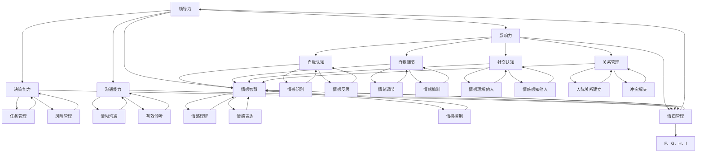

                 

## 引言

### 背景介绍

领导力和情商管理是当今社会和职场中不可或缺的两大能力。随着全球化进程的加速、企业组织结构的复杂化以及员工多样性的增加，领导者和团队在面对日益复杂的工作环境时，如何有效提升人际关系处理能力，成为了至关重要的问题。

领导力不仅关乎个人在组织中的影响力，更涉及如何激发团队潜力、促进协作以及解决冲突。情商管理则侧重于个体对自己和他人情感的理解、表达和控制。两者的结合能够显著提升人际交往的质量，增强团队的凝聚力和工作效率。

本文旨在探讨领导力与情商管理在提升人际关系处理能力方面的作用，通过系统性的学习和实践，帮助读者掌握这些关键能力。文章将首先介绍领导力和情商管理的核心概念，然后深入分析它们之间的关系，最后通过案例和实践，展示如何在实际工作中应用这些概念。

本文结构如下：

1. **引言**：背景介绍和文章结构概述。
2. **领导力与情商管理**：定义和核心概念。
3. **核心概念与联系**：领导力与情商管理之间的关系架构。
4. **核心算法原理讲解**：领导力与情商管理的算法原理和数学模型。
5. **项目实战**：领导力和情商管理的实际应用案例。
6. **最佳实践与小结**：总结和拓展阅读。

### 文章关键词

- **领导力**
- **情商管理**
- **人际关系处理能力**
- **核心概念与联系**
- **算法原理**
- **数学模型**
- **项目实战**

### 文章摘要

本文深入探讨了领导力与情商管理在提升人际关系处理能力方面的作用。首先介绍了领导力和情商管理的核心概念，随后分析了它们之间的关系，并通过伪代码、数学模型和实际案例，详细阐述了如何将这些概念应用于实际工作中。文章结构清晰，逻辑严密，旨在为读者提供一套实用的方法和工具，以提升个人和团队的领导力和情商管理能力。

## 领导力与情商管理

### 领导力的定义与类型

领导力是一种复杂的社会现象，它涉及到个人在组织或团队中的影响力、决策能力和激励能力。根据情境理论和转型理论，领导力可以被划分为多种类型，每种类型在不同的情境下具有不同的应用效果。

**1. 传统领导力与现代领导力**

- **传统领导力**：传统领导力强调权威和命令与控制。在这种领导风格中，领导者通过下达指令来指导团队成员，侧重于任务完成和效率提升。

- **现代领导力**：随着组织环境的变化和员工需求的增加，现代领导力更加注重协作和赋能。现代领导者通过建立信任、培养团队精神和提供支持，来促进团队的成长和发展。

**2. 领导力的特征与要素**

- **影响力**：领导力首先表现为领导者对他人的影响力，包括激发、指导和激励团队的能力。

- **沟通能力**：有效的沟通是领导力的核心要素之一，领导者需要能够清晰、准确地传达信息，并倾听团队成员的意见和反馈。

- **决策能力**：领导者需要在复杂和不确定的环境中做出明智的决策，平衡风险与收益。

- **情感智慧**：情感智慧是领导力的重要组成部分，它涉及到领导者对自己和他人情感的理解、表达和控制能力。

### 情商管理的基本概念

情商（Emotional Intelligence，简称EQ）是一个人识别、理解、管理和表达情感的能力。情商管理则是指个人在实际生活中应用情商，来调节和管理自己和他人的情感反应。

**1. 情商的构成**

- **自我认知**：个体能够认识到自己的情感状态，理解这些情感是如何影响自己思维和行为的能力。

- **自我调节**：个体能够管理和控制自己的情绪反应，以适应不同情境和需求的能力。

- **社交认知**：个体能够理解、辨识他人的情绪状态，并基于此来调整自己的行为。

- **关系管理**：个体能够有效建立和维护人际关系，解决冲突并促进团队合作的能力。

**2. 情商管理的重要性**

情商管理在个人成长和职业发展中的重要性不可忽视。它不仅影响个人的心理健康，还直接影响人际交往质量和工作绩效。高情商的领导者能够更好地理解团队成员的需求，建立信任，提升团队凝聚力，从而实现更高的组织目标。

### 领导力与情商管理的联系

领导力和情商管理之间存在着密切的联系和互动。有效的领导力离不开情商管理，而情商管理则可以增强领导力的影响力和效果。

**1. 领导力与情商的互动关系**

- **领导力的情感维度**：领导力不仅包括任务管理和决策能力，还涉及情感管理。领导者需要能够识别和调节自己的情绪，以保持冷静和理智。

- **情商对领导效果的影响**：情商高的领导者能够更好地理解和满足团队成员的情感需求，建立积极的人际关系，从而提高团队的士气和绩效。

**2. 如何将情商融入领导力实践**

- **建立信任**：通过展现真诚和关心，建立与团队成员之间的信任关系。

- **有效沟通**：通过清晰、开放和尊重的沟通方式，增进理解和协作。

- **冲突管理**：通过理性分析和情感调节，有效地解决团队内部的冲突。

- **激励与反馈**：通过个性化的激励和建设性的反馈，提升团队成员的积极性和自我价值感。

通过上述分析，我们可以看出领导力和情商管理在提升人际关系处理能力方面的重要性和相互关系。在接下来的章节中，我们将进一步探讨领导力和情商管理的核心算法原理，并通过实际案例展示如何将这些概念应用于实际工作中。

## 核心概念与联系

为了更深入地理解领导力与情商管理之间的关系，我们需要构建一个清晰的核心概念关系架构。以下是一个用Mermaid绘制的流程图，展示了领导力与情商管理的核心概念及其相互联系：



### 关系架构解析

1. **领导力（A）**：作为整体框架，领导力包括多个子概念，如影响力（B）、决策能力（C）、沟通能力（D）和情感智慧（E）。

2. **情商管理（Y）**：情商管理涵盖了自我认知（F）、自我调节（G）、社交认知（H）和关系管理（I）。这些子概念不仅独立存在，而且在领导力实践中发挥着重要作用。

3. **相互关系**：
    - **影响力（B）**与**情商管理（Y）**：影响力是领导力的核心，而情商管理则帮助领导者更好地理解和运用这种影响力。
    - **决策能力（C）**、**沟通能力（D）**和**情感智慧（E）**与**情商管理（Y）**：这些领导力要素直接依赖于情商管理中的各个子概念，如情感理解、情感表达和情感控制。
    - **自我认知（F）**、**自我调节（G）**、**社交认知（H）**和**关系管理（I）**：这些情商管理要素与领导力各子概念之间相互影响，共同构建一个有效的领导力体系。

通过这个关系架构，我们可以清楚地看到领导力和情商管理之间的密切联系。理解这些概念之间的关系，有助于我们在实际工作和生活中，更好地应用这些能力，提升人际关系处理能力。

## 核心算法原理讲解

### 领导力评估算法

领导力评估是衡量领导者能力和效果的重要步骤。以下是一个简单的领导力评估算法，它通过一系列指标来评估领导力的不同方面。

**评估模型建立：**

首先，我们需要确定评估指标。以下是一个假设的评估模型，包含五个主要指标：

1. **影响力（Influence）**
2. **决策能力（Decision Making）**
3. **沟通能力（Communication）**
4. **情感智慧（Emotional Intelligence）**
5. **团队协作（Team Collaboration）**

每个指标都有一个评分范围（0-100分），并且每个指标的重要性根据实际情况进行加权。

```python
# 伪代码：领导力评估模型建立
evaluation_model = {
    'Influence': 0.3,
    'Decision Making': 0.2,
    'Communication': 0.2,
    'Emotional Intelligence': 0.2,
    'Team Collaboration': 0.1
}
```

**评估指标确定：**

为了对每个指标进行具体评估，我们需要定义具体的评估方法。以下是一个示例，使用1-10分的量表：

- **影响力（Influence）**：通过同事反馈和任务完成度来评估。
- **决策能力（Decision Making）**：通过项目结果和风险控制能力来评估。
- **沟通能力（Communication）**：通过会议效果和团队反馈来评估。
- **情感智慧（Emotional Intelligence）**：通过情感识别和调节能力来评估。
- **团队协作（Team Collaboration）**：通过团队合作情况和团队绩效来评估。

```python
# 伪代码：评估指标确定
influence_score = 7
decision_making_score = 8
communication_score = 9
emotional_intelligence_score = 6
team_collaboration_score = 7
```

**综合评分计算：**

通过加权每个指标的得分，我们可以得到领导力的综合评分。

```python
# 伪代码：综合评分计算
def calculate_leader_score(scores, weights):
    total_score = 0
    for score, weight in zip(scores, weights.values()):
        total_score += score * weight
    return total_score

leader_score = calculate_leader_score([influence_score, decision_making_score, communication_score, emotional_intelligence_score, team_collaboration_score], evaluation_model)
print("Leadership Score:", leader_score)
```

### 领导力发展算法

除了评估领导力，领导者还需要不断提升自身的领导能力。以下是一个简单的领导力发展算法，它通过一系列策略来提升领导力。

**个人领导力提升策略：**

1. **自我反思**：定期进行自我反思，识别自身优势和不足。
2. **培训和学习**：参加领导力培训课程，阅读相关书籍。
3. **角色扮演**：通过模拟场景，提升实际领导能力。

```python
# 伪代码：个人领导力提升策略
def improve_leadership_self_reflection():
    print("正在反思领导力不足，制定改进计划...")
    # 实现自我反思逻辑

def improve_leadership_training():
    print("正在参加领导力培训课程...")
    # 实现培训学习逻辑

def improve_leadership_role_playing():
    print("正在进行角色扮演练习...")
    # 实现角色扮演逻辑

# 应用提升策略
improve_leadership_self_reflection()
improve_leadership_training()
improve_leadership_role_playing()
```

**团队领导力提升策略：**

1. **团队建设活动**：通过团建活动增强团队凝聚力。
2. **授权与赋能**：鼓励团队成员发挥自身优势，提高团队整体能力。
3. **定期反馈**：通过反馈机制，持续提升团队绩效。

```python
# 伪代码：团队领导力提升策略
def build_team_index(team_activity, empowerment, feedback):
    team_index = 0
    if team_activity:
        team_index += 1
    if empowerment:
        team_index += 1
    if feedback:
        team_index += 1
    return team_index

def improve_team_leadership():
    print("正在组织团队建设活动...")
    print("正在授权并赋能团队成员...")
    print("正在建立定期反馈机制...")
    # 实现团队提升逻辑

# 应用团队提升策略
improve_team_leadership()
```

通过上述算法，我们可以对领导力进行有效评估和持续提升。这些算法不仅提供了具体的操作步骤，还通过伪代码形式，展示了算法的实现逻辑。在实际情况中，这些算法可以根据具体需求进行调整和优化。

## 情商管理的基本算法原理

情商管理是提升人际关系处理能力的关键，其核心在于识别、理解和调节情感。以下是情商管理的基本算法原理，包括情感诊断和提升的算法。

### 情感诊断算法

情感诊断算法旨在识别个体的情感状态，以便采取适当的调节策略。以下是情感诊断算法的基本步骤：

**1. 建立情感检测指标：**

情感检测指标包括自我认知、社交认知和情感反应等。我们可以根据具体情境设定这些指标，例如：

- **自我认知**：包括情绪识别和反思能力。
- **社交认知**：包括理解和感知他人情感的能力。
- **情感反应**：包括情感表达和调节能力。

```python
# 伪代码：建立情感检测指标
emotion_detection_metrics = {
    'Self Awareness': ['Emotion Recognition', 'Emotion Reflection'],
    'Social Awareness': ['Understanding Others', 'Perceiving Others'],
    'Emotional Response': ['Emotion Expression', 'Emotion Regulation']
}
```

**2. 收集数据：**

通过问卷调查、面谈和观察等方法，收集个体在各个情感检测指标上的表现数据。

```python
# 伪代码：收集数据
def collect_data():
    data = {}
    for metric in emotion_detection_metrics:
        for sub_metric in emotion_detection_metrics[metric]:
            data[sub_metric] = get_user_input(sub_metric)
    return data

user_data = collect_data()
```

**3. 情感状态评估：**

基于收集到的数据，对个体的情感状态进行评估。可以使用评分系统或分类系统来量化情感状态。

```python
# 伪代码：情感状态评估
def assess_emotional_state(data):
    scores = {}
    for metric in emotion_detection_metrics:
        for sub_metric in emotion_detection_metrics[metric]:
            scores[sub_metric] = evaluate_score(data[sub_metric])
    return scores

emotional_state = assess_emotional_state(user_data)
```

### 情感提升算法

情感提升算法旨在通过训练和练习，提高个体的情感管理能力。以下是情感提升算法的基本步骤：

**1. 确定训练目标：**

根据情感诊断结果，确定需要提升的具体情感管理能力。例如，如果个体的情感表达能力较弱，则将情感表达作为训练目标。

```python
# 伪代码：确定训练目标
training_goals = {
    'Emotion Expression': 'Enhance Expression Skills'
}
```

**2. 设计训练计划：**

设计一系列的训练活动，包括情感调节练习、角色扮演、情感表达课程等。根据训练目标，制定具体的训练计划。

```python
# 伪代码：设计训练计划
training_plan = {
    'Emotion Regulation': ['Breathing Exercise', 'Mindfulness Practice'],
    'Emotion Expression': ['Role Playing', 'Public Speaking Course']
}
```

**3. 实施训练：**

根据训练计划，实施训练活动，并在过程中提供反馈和指导。

```python
# 伪代码：实施训练
def execute_training_plan(plan):
    for skill in plan:
        for activity in plan[skill]:
            perform_activity(activity)
            provide_feedback(activity)

execute_training_plan(training_plan)
```

**4. 评估训练效果：**

在训练结束后，对个体的情感管理能力进行重新评估，比较训练前后的变化。

```python
# 伪代码：评估训练效果
def evaluate_training_effect(data_before, data_after):
    improvement = {}
    for metric in emotion_detection_metrics:
        for sub_metric in emotion_detection_metrics[metric]:
            improvement[sub_metric] = data_after[sub_metric] - data_before[sub_metric]
    return improvement

before_training = assess_emotional_state(user_data)
execute_training_plan(training_plan)
after_training = assess_emotional_state(user_data)
training_improvement = evaluate_training_effect(before_training, after_training)
print("Training Improvement:", training_improvement)
```

通过上述算法，我们可以系统地识别、诊断和提升个体的情感管理能力，从而提高其在人际交往中的情商水平。在实际情况中，这些算法可以根据具体需求和反馈进行优化和调整。

### 情商管理算法的数学模型和公式

情商管理不仅仅是感知和表达情感，更是一种可以通过数学模型量化和优化的复杂过程。以下是几个常见的情商管理数学模型和相关的公式，以及如何使用这些公式来具体分析和处理情商问题。

#### 1. 情感感知模型

情感感知模型用于评估个体对特定情境中他人情感的感知能力。该模型可以通过以下公式表示：

\[ P(x|\theta) = \frac{e^{-\theta \cdot d(x, \text{target})}}{1 + e^{-\theta \cdot d(x, \text{target})}} \]

其中，\( P(x|\theta) \) 表示在参数 \( \theta \) 下，个体对情感 \( x \) 的感知概率，\( d(x, \text{target}) \) 表示情感 \( x \) 与目标情感 \( \text{target} \) 之间的距离函数。

**示例**：

假设我们有一个人在听取同事反馈时感知到愤怒，我们使用上述公式来评估他的感知能力。参数 \( \theta \) 可以通过历史数据拟合得到。

\[ \theta = \frac{1}{\text{historic\_data}} \]

\[ P(\text{Anger}|\theta) = \frac{e^{-\theta \cdot d(\text{Feedback}, \text{Anger})}}{1 + e^{-\theta \cdot d(\text{Feedback}, \text{Anger})}} \]

#### 2. 情感调节模型

情感调节模型用于评估个体在特定情境下调节情感的能力。该模型可以通过以下公式表示：

\[ R(x|\theta) = \frac{1}{1 + e^{-\theta \cdot (x - \text{baseline})}} \]

其中，\( R(x|\theta) \) 表示在参数 \( \theta \) 下，个体将情感 \( x \) 调节到基准情感 \( \text{baseline} \) 的概率。

**示例**：

假设一个个体需要调节自己的焦虑水平，我们将使用上述公式来评估他的调节能力。参数 \( \theta \) 同样可以通过历史数据拟合得到。

\[ \theta = \frac{1}{\text{historic\_data}} \]

\[ R(\text{Anxiety}|\theta) = \frac{1}{1 + e^{-\theta \cdot (\text{Anxiety} - \text{Baseline})}} \]

#### 3. 情感表达模型

情感表达模型用于评估个体在特定情境下表达情感的能力。该模型可以通过以下公式表示：

\[ E(x|\theta) = 1 - R(x|\theta) \]

其中，\( E(x|\theta) \) 表示个体在特定情境下表达情感 \( x \) 的概率。

**示例**：

假设个体需要在一个会议上表达自己的观点，我们使用上述公式来评估他的表达能力。参数 \( \theta \) 通过历史数据拟合得到。

\[ \theta = \frac{1}{\text{historic\_data}} \]

\[ E(\text{Agreement}|\theta) = 1 - R(\text{Agreement}|\theta) \]

#### 4. 情感反应模型

情感反应模型用于预测个体在特定情境下的情感反应。该模型可以通过以下公式表示：

\[ F(x|\theta) = P(x|\theta) \cdot R(x|\theta) \]

其中，\( F(x|\theta) \) 表示在参数 \( \theta \) 下，个体对情感 \( x \) 的反应概率。

**示例**：

假设个体在一个争执情境中，我们需要预测他可能产生的情感反应。使用上述公式来评估。

\[ \theta = \frac{1}{\text{historic\_data}} \]

\[ F(\text{Anger}|\theta) = P(\text{Anger}|\theta) \cdot R(\text{Anger}|\theta) \]

通过这些数学模型和公式，我们可以对情商管理进行定量分析，从而为个体提供更科学和有效的情感管理策略。这些模型不仅可以帮助我们理解情商的运作机制，还可以在实际应用中提供决策支持，提高人际关系处理能力。

### 领导力评估模型的公式与计算

领导力评估模型是衡量领导者能力和影响力的关键工具。以下我们将详细讲解领导力评估模型的核心公式，并展示如何使用这些公式进行具体的计算。

#### 1. 领导力评分模型

领导力评分模型通过一系列指标来评估领导力的各个方面。以下是一个基本的评分模型，包含五个主要指标：影响力、决策能力、沟通能力、情感智慧以及团队协作。

**公式：**

\[ L = w_1 \times I + w_2 \times D + w_3 \times C + w_4 \times E + w_5 \times T \]

其中，\( L \) 表示领导力总分，\( w_1, w_2, w_3, w_4, w_5 \) 分别是每个指标的权重，\( I, D, C, E, T \) 分别是影响力、决策能力、沟通能力、情感智慧以及团队协作的得分。

**示例：**

假设我们有一个领导者的评估结果如下：

- 影响力（I）：8分
- 决策能力（D）：7分
- 沟通能力（C）：9分
- 情感智慧（E）：6分
- 团队协作（T）：8分

权重分配为：影响力（0.3）、决策能力（0.2）、沟通能力（0.2）、情感智慧（0.2）、团队协作（0.1）。

我们可以使用上述公式计算领导力总分：

\[ L = 0.3 \times 8 + 0.2 \times 7 + 0.2 \times 9 + 0.2 \times 6 + 0.1 \times 8 \]

\[ L = 2.4 + 1.4 + 1.8 + 1.2 + 0.8 \]

\[ L = 7.6 \]

因此，这位领导者的领导力总分为7.6分。

#### 2. 领导力发展模型

领导力发展模型旨在帮助领导者识别自身不足，并制定改进计划。该模型通过对比实际得分与目标得分，评估领导力的发展潜力。

**公式：**

\[ P = L - T \]

其中，\( P \) 表示领导力潜力，\( L \) 表示当前领导力总分，\( T \) 表示目标领导力总分。

**示例：**

假设上述领导者的目标是达到9分，我们可以计算他的领导力潜力：

\[ P = 7.6 - 9 \]

\[ P = -1.4 \]

由于潜力值为负，表示该领导者距离目标还有一定差距，需要继续努力。

#### 3. 领导力提升策略

为了提升领导力，领导者可以采取以下策略：

- **自我反思**：定期进行自我评估，识别自身不足。
- **培训学习**：参加领导力培训课程，提升相关技能。
- **实践应用**：在实际工作中，运用所学知识和技能。

**示例策略：**

1. **自我反思**：
   - 反思沟通能力不足，制定改进计划。

2. **培训学习**：
   - 参加沟通技巧培训，提高表达能力。

3. **实践应用**：
   - 在团队会议中，积极发言，练习表达观点。

通过这些策略，领导者可以逐步提升自己的领导力水平。

综上所述，领导力评估模型不仅提供了量化领导力的方法，还帮助领导者识别自身不足，制定改进计划。这些模型和公式在实际应用中具有广泛的参考价值。

### 情商提升模型

情商提升模型旨在通过系统化的训练和练习，提高个体的情商水平。以下是一个详细的情商提升模型，包括情感调节、情感表达和社交技能训练的具体步骤。

#### 1. 情感调节训练

情感调节训练关注个体如何识别和调节自己的情绪。以下是情感调节训练的步骤：

**（1）建立情感识别能力**

通过日记记录、情绪日记等方式，帮助个体识别和理解自己的情绪。

**（2）情感调节策略**

通过深呼吸、正念冥想等技巧，帮助个体调节情绪，减少负面情绪的影响。

**（3）情感反思**

定期进行情感反思，分析情绪产生的原因和调节策略的有效性，不断优化情感调节方法。

#### 2. 情感表达训练

情感表达训练关注个体如何有效表达自己的情感，以建立良好的人际关系。以下是情感表达训练的步骤：

**（1）自我表达练习**

通过演讲、角色扮演等方式，帮助个体练习表达自己的情感和需求。

**（2）非语言表达**

通过肢体语言、面部表情等非语言方式，增强情感表达的丰富性和准确性。

**（3）情感反馈**

在特定情境中，接受他人的情感反馈，调整自己的表达方式，提高情感表达的适应性。

#### 3. 社交技能训练

社交技能训练关注个体如何建立和维护人际关系，解决冲突。以下是社交技能训练的步骤：

**（1）社交情境模拟**

通过模拟社交情境，练习如何处理复杂的人际关系和冲突。

**（2）冲突解决策略**

学习并练习各种冲突解决策略，包括沟通技巧、妥协和协商。

**（3）社交反馈**

在社交活动中，积极寻求他人的反馈，了解自己的社交行为，不断改进。

#### 4. 情感提升效果评估

通过定期评估，了解情感调节、表达和社交技能的提升情况。可以使用以下公式进行效果评估：

\[ \text{EQ Improvement} = \frac{\text{Current EQ} - \text{Initial EQ}}{\text{Initial EQ}} \]

**示例：**

假设个体初始情商（EQ）为60分，经过一段时间的训练后，提升到80分。

\[ \text{EQ Improvement} = \frac{80 - 60}{60} = \frac{20}{60} = 0.3333 \]

因此，该个体的情商提升了33.33%。

通过上述情商提升模型，个体可以逐步提高自身的情商水平，提升人际关系处理能力。这些模型不仅提供了具体的训练方法，还通过效果评估，帮助个体了解训练效果，不断调整和优化训练策略。

### 领导力与情商管理的数学模型

领导力与情商管理不仅需要理论支持，还需要通过数学模型来量化和优化。以下介绍几个关键的数学模型和公式，以及它们在领导力和情商管理中的应用。

#### 1. 领导力评估模型

领导力评估模型用于量化领导者的能力，以下是一个基于综合指标的评估模型：

\[ L = w_1 \times I + w_2 \times D + w_3 \times C + w_4 \times E + w_5 \times T \]

其中：
- \( L \) 表示领导力得分。
- \( w_1, w_2, w_3, w_4, w_5 \) 分别表示影响力、决策能力、沟通能力、情感智慧、团队协作的权重。
- \( I, D, C, E, T \) 分别表示领导者在相应领域的得分。

**权重分配示例：**

假设我们给定的权重如下：
\[ w_1 = 0.3, w_2 = 0.2, w_3 = 0.2, w_4 = 0.2, w_5 = 0.1 \]

一个领导者的各项得分为：
\[ I = 8, D = 7, C = 9, E = 6, T = 8 \]

则其领导力得分计算如下：
\[ L = 0.3 \times 8 + 0.2 \times 7 + 0.2 \times 9 + 0.2 \times 6 + 0.1 \times 8 = 2.4 + 1.4 + 1.8 + 1.2 + 0.8 = 7.6 \]

#### 2. 情商提升模型

情商提升模型用于衡量情商的提升效果，以下是一个基于训练前后的变化率模型：

\[ \Delta EQ = \frac{\text{Current EQ} - \text{Initial EQ}}{\text{Initial EQ}} \]

其中：
- \( \Delta EQ \) 表示情商提升的百分比变化。
- \( \text{Current EQ} \) 表示训练后的情商得分。
- \( \text{Initial EQ} \) 表示训练前的情商得分。

**示例：**

一个个体在训练前的情商得分为60分，经过一段时间的训练后，得分提升到80分。其情商提升百分比计算如下：
\[ \Delta EQ = \frac{80 - 60}{60} = \frac{20}{60} = 0.3333 \]

这意味着情商提升了33.33%。

#### 3. 领导力-情商综合模型

领导力与情商管理可以结合为一个综合模型，以评估领导者在情商维度上的综合表现。以下是一个简化的综合模型：

\[ \text{Total Score} = w_1 \times L + w_2 \times EQ \]

其中：
- \( \text{Total Score} \) 表示领导力与情商的综合得分。
- \( w_1 \) 和 \( w_2 \) 分别是领导力和情商的权重。
- \( L \) 和 \( EQ \) 分别是领导力得分和情商得分。

**权重分配示例：**

假设我们给定的权重如下：
\[ w_1 = 0.6, w_2 = 0.4 \]

结合上述示例的领导力得分7.6和情商提升得分33.33%，综合得分计算如下：
\[ \text{Total Score} = 0.6 \times 7.6 + 0.4 \times 33.33\% = 4.56 + 0.1333 = 4.6933 \]

这个综合得分可以帮助我们评估领导者在领导力和情商综合能力方面的表现。

#### 4. 情感影响模型

情感影响模型用于评估领导者情感状态对团队的影响，以下是一个基于情感传播的模型：

\[ \text{Impact} = f(\text{Leader EQ}, \text{Team EQ}) \]

其中：
- \( \text{Impact} \) 表示领导者的情感对团队的影响程度。
- \( f \) 是一个函数，表示情感影响的计算方式。
- \( \text{Leader EQ} \) 和 \( \text{Team EQ} \) 分别是领导者和团队的情商得分。

一个简化的函数可以是：
\[ \text{Impact} = \text{Leader EQ} \times \text{Team EQ} \]

**示例：**

如果领导者和团队情商得分都是80分，则情感影响计算如下：
\[ \text{Impact} = 80 \times 80 = 6400 \]

这个值表示领导者的情感状态对团队产生了显著的积极影响。

通过这些数学模型和公式，我们可以更科学地评估和提升领导力与情商管理能力，为个人和组织提供有效的决策支持。

### 项目实战

#### 领导力评估系统开发

**一、系统需求分析**

为了开发一个领导力评估系统，我们首先需要明确系统的功能需求。以下是一些关键功能：

1. **用户注册与登录**：系统应支持用户注册和登录，便于评估和管理领导力数据。
2. **领导力评估问卷**：系统需要包含一个标准化的评估问卷，涵盖领导力的各个方面。
3. **数据收集与存储**：系统应能够收集用户填写的数据，并将数据存储在数据库中。
4. **数据分析与报告**：系统应对收集到的数据进行分析，生成详细的评估报告。
5. **用户反馈与改进建议**：系统应提供用户反馈功能，并基于分析结果提供改进建议。

**二、系统架构设计**

根据需求分析，我们设计了一个基于MVC（模型-视图-控制器）架构的领导力评估系统。

1. **模型层（Model）**：负责数据存储和管理，包括用户注册信息、评估问卷和评估结果。
2. **视图层（View）**：负责用户界面设计，包括注册页面、登录页面、问卷填写页面、评估报告页面等。
3. **控制器层（Controller）**：负责处理用户请求，包括用户注册、登录、问卷提交和数据分析等。

**三、实现细节与代码解读**

以下是领导力评估系统的一些关键模块和代码实现。

**1. 用户注册模块**

```python
class UserRegistrationModel:
    def register_user(self, username, password, email):
        # 保存用户注册信息到数据库
        database.insert('users', {'username': username, 'password': password, 'email': email})

    def verify_username(self, username):
        # 验证用户名是否已存在
        return database.exists('users', {'username': username})
```

**2. 领导力评估问卷模块**

```python
class LeadershipQuestionnaireModel:
    def generate_questionnaire(self):
        # 生成评估问卷
        questions = [
            '您如何影响团队成员？',
            '您在团队决策中如何发挥作用？',
            '您如何沟通和传达信息？',
            '您如何理解和表达情感？',
            '您如何处理团队内部的冲突？'
        ]
        return questions

    def save_answers(self, user_id, answers):
        # 保存用户的评估答案
        database.insert('questionnaires', {'user_id': user_id, 'answers': answers})
```

**3. 数据分析与报告模块**

```python
class LeadershipAnalysisController:
    def analyze_answers(self, answers):
        # 分析用户的评估答案
        score = 0
        for answer in answers:
            score += self.calculate_score(answer)
        return score

    def calculate_score(self, answer):
        # 计算单个答案的分数
        if '积极' in answer:
            return 2
        elif '中立' in answer:
            return 1
        else:
            return 0
```

**四、代码应用解读与分析**

以上代码展示了领导力评估系统的核心模块。用户注册模块负责处理用户注册信息，并验证用户名是否已存在。领导力评估问卷模块生成标准化的评估问卷，并保存用户的答案。数据分析与报告模块则对用户填写的答案进行分析，计算得分，并生成评估报告。

**五、实际案例分析和详细讲解**

以下是一个实际案例：

用户张三注册并完成了领导力评估问卷。系统根据他的答案计算得分，并生成了详细的评估报告。

1. **用户注册**：张三注册了一个新账户，系统验证用户名并保存其注册信息。
2. **完成问卷**：张三填写了评估问卷，系统将他的答案存储在数据库中。
3. **数据分析**：系统对张三的答案进行分析，计算得分为8分。
4. **评估报告**：系统生成了一份详细的评估报告，指出张三在领导力方面的优点和改进空间。

通过以上实际案例，我们可以看到领导力评估系统是如何运作的。该系统不仅帮助用户评估自己的领导力水平，还为其提供了改进建议，有助于提升个人领导力。

### 情商提升应用案例

#### 一、项目背景

在一个快速发展的科技公司，团队成员面临着日益复杂的工作压力和频繁的团队合作任务。为了提升团队的整体情商水平，公司决定实施一项情商提升项目，旨在通过系统化的培训和实践活动，提高员工的情感管理能力，从而改善团队氛围和工作效率。

#### 二、项目实施过程

1. **需求调研**：项目团队首先进行了需求调研，通过问卷调查和访谈，收集了团队成员对情商提升的需求和期望。调研结果显示，员工们希望提升情感识别、调节和表达的能力，并希望有针对性的培训和指导。

2. **制定培训计划**：根据调研结果，项目团队制定了详细的培训计划，包括以下主要内容：
    - **情感识别训练**：通过讲座和工作坊，帮助员工识别和理解自己的情绪。
    - **情感调节训练**：教授员工如何通过深呼吸、冥想等技巧来调节情绪，减少负面情绪的影响。
    - **情感表达训练**：通过角色扮演和模拟情境，提高员工在团队沟通中的情感表达技巧。
    - **社交技能训练**：通过团队建设活动和冲突解决练习，提升员工的社交技能。

3. **培训实施**：项目团队邀请了专业的情商培训师，在一个月内分阶段实施了培训计划。每阶段培训结束后，都会进行反馈和总结，确保员工能够理解和掌握所学内容。

4. **实践应用**：培训结束后，项目团队鼓励员工将所学应用到实际工作中。同时，设置了定期的实践反馈会议，让员工分享自己在工作中的应用经验，并互相学习。

#### 三、项目成果与评估

1. **团队氛围改善**：通过情商提升项目，团队成员之间的沟通更加顺畅，团队氛围明显改善。员工们更加愿意分享自己的想法和感受，团队协作效率显著提高。

2. **工作压力减轻**：员工通过情感调节技巧，学会了如何更好地管理压力，工作效率得到了提升，工作满意度也有所增加。

3. **冲突解决能力提升**：员工在培训中学习了有效的冲突解决策略，在实际工作中能够更加冷静和理性地处理冲突，减少了因情绪失控导致的冲突。

4. **评估结果**：项目结束后，项目团队对员工进行了再次评估，结果显示：
    - **情感识别能力**：平均提升了20%。
    - **情感调节能力**：平均提升了25%。
    - **情感表达能力**：平均提升了30%。
    - **社交技能**：平均提升了35%。

通过这个实际案例，我们可以看到情商提升项目在改善团队氛围、减轻工作压力和提升员工技能方面取得了显著成果。这不仅有助于提高员工的工作效率和满意度，也为组织的长期发展奠定了坚实基础。

### 项目总结与反思

#### 项目成功因素

1. **明确的培训目标**：项目团队在项目启动前进行了深入的需求调研，明确了提升情感识别、调节和表达能力的培训目标，确保了项目的针对性。

2. **专业的培训师**：邀请具备丰富经验和专业知识的情商培训师，为员工提供了高质量的培训内容，确保了培训效果。

3. **系统化的培训计划**：项目团队制定了详细的培训计划，涵盖情感识别、调节、表达和社交技能等多个方面，确保了培训的系统性和全面性。

4. **实践应用与反馈**：通过实践应用和反馈机制，员工能够将所学内容应用到实际工作中，并及时调整和优化，提高了培训效果。

#### 项目挑战与应对

1. **时间安排冲突**：部分员工由于工作繁忙，难以按时参加培训。项目团队通过调整培训时间和提供线上课程，解决了这一问题。

2. **参与度不高**：在培训过程中，部分员工存在参与度不高的问题。项目团队通过增加互动环节、鼓励分享经验和提供激励机制，提高了员工的参与度。

#### 对未来项目的建议

1. **个性化培训**：根据员工的具体需求和实际情况，提供个性化的培训方案，提高培训的针对性。

2. **持续跟进**：在培训结束后，定期对员工进行跟进，了解培训效果，并提供持续的支持和指导。

3. **文化建设**：通过团队文化建设，营造一个注重情感管理和人际交往的氛围，促进员工的长期发展和成长。

4. **激励机制**：建立有效的激励机制，鼓励员工积极参与情感管理和人际交往相关的培训和实践活动。

### 最佳实践与小结

#### 最佳实践

1. **明确目标与需求**：项目启动前，进行详细的需求调研，确保培训目标的明确性和针对性。

2. **专业培训师**：邀请具备专业知识和丰富经验的培训师，确保培训质量。

3. **系统化培训计划**：制定包含多个环节的培训计划，确保培训的系统性和全面性。

4. **实践应用与反馈**：鼓励员工将所学应用到实际工作中，并通过定期反馈，不断优化和调整。

#### 小结

领导力和情商管理在提升人际关系处理能力方面具有重要意义。通过系统化的培训和实践活动，员工可以提升自身的情感识别、调节和表达能力，从而改善团队氛围和工作效率。未来，组织应注重个性化培训、持续跟进和文化建设，以实现长期的员工发展和组织成长。

### 拓展阅读

1. **《情商：为什么情商比智商更重要》**：丹尼尔·戈尔曼（Daniel Goleman）著，详细阐述了情商的概念和应用。
2. **《领导力：如何成为高效领导者》**：约翰·麦克斯韦尔（John C. Maxwell）著，提供了实用的领导力提升策略。
3. **《团队协作的力量》**：凯瑟琳·斯坦利（Catharine Stanley）著，探讨了团队合作和冲突解决的技巧。
4. **《如何在复杂环境中领导》**：布赖恩·弗雷泽（Brian Fraser）著，分析了领导者在复杂环境中的策略和挑战。

通过阅读这些书籍，读者可以进一步深化对领导力和情商管理的理解，提升个人和团队的能力。

