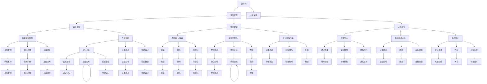

                 

# 文章标题：领导力与情商管理：提升人际关系的技巧

> 关键词：领导力，情商管理，人际关系，自我认知，情感理解，团队协作

> 摘要：本文将探讨领导力与情商管理在提升人际关系方面的技巧。通过深入分析领导力的定义、类型和挑战，以及情商的概念和四个领域，我们将了解到如何通过自我认知、情感理解和自我调节来提升情商，进而改善人际关系，实现更好的团队合作和职业发展。

## 引言

在当今社会，领导力和情商管理已经成为个人和组织成功的关键因素。领导力不仅涉及如何管理和激励团队，还包括如何与他人建立积极的关系。而情商管理则涉及到如何理解、表达和控制自己的情绪，以及如何同理和理解他人的情绪。这两者共同构成了提升人际关系的核心技巧。

本文将围绕以下问题展开讨论：

1. 领导力是什么？它有哪些类型和挑战？
2. 情商的概念是什么？它包括哪些领域？
3. 如何通过自我认知、情感理解和自我调节提升情商？
4. 情商管理如何应用于实际的人际关系和团队合作中？
5. 职场中如何提升情商，以实现更好的职业发展？

通过逐一解答这些问题，本文旨在为读者提供一套实用的领导力和情商管理技巧，帮助他们在人际关系中取得成功。

## 第1部分：领导力基础

### 第1章：领导力概述

#### 1.1 领导力的定义

领导力是指通过影响和激励他人，实现共同目标的能力。它不仅仅是管理团队，更是一种能够引导、启发和激励他人追随自己前进的艺术。

#### 1.2 领导力的类型

领导力可以分为以下几种类型：

1. **权威型领导**：通过权力和控制来管理团队。
2. **民主型领导**：通过征求和考虑团队成员的意见来做出决策。
3. **变革型领导**：通过激发团队成员的潜力和动力，推动组织变革。
4. **服务型领导**：关注团队成员的需求，通过提供支持和资源来帮助团队成员实现目标。

#### 1.3 领导力的挑战

领导力面临的主要挑战包括：

1. **团队管理**：如何有效管理不同性格和背景的团队成员。
2. **沟通**：如何清晰、有效地传达信息和愿景。
3. **激励**：如何激发团队成员的积极性，实现团队目标。
4. **变革**：如何在组织内部推动变革，应对外部环境的变化。

### 第2章：情商的概念

#### 2.1 情商的定义

情商是指个体识别、理解、管理自己和他人情绪的能力。它不仅仅包括情感的表达，还涉及到情感的理解和情感的管理。

#### 2.2 情商的四个领域

情商包括以下四个领域：

1. **自我认知**：了解自己的情绪，识别情绪对自己的影响。
2. **自我管理**：控制自己的情绪，保持积极的心态。
3. **社交技能**：建立和维护人际关系，有效沟通。
4. **同理心**：理解他人的情绪，关注他人的需求。

#### 2.3 情商与领导力的关系

情商与领导力密切相关。一个高情商的领导者能够更好地理解团队成员的需求，建立良好的沟通和合作关系，从而提升团队的绩效和满意度。

## 第2部分：情商管理

### 第3章：自我认知

#### 3.1 自我认知的概念

自我认知是指个体对自己的认识和理解。它包括识别自己的情绪、价值观、信念和行为模式。

#### 3.2 自我情绪管理

自我情绪管理是指个体如何控制自己的情绪，保持积极的心态。以下是一些技巧：

1. **认知重构**：通过改变对事物的看法来改变情绪。
2. **情绪释放**：通过运动、呼吸等方式释放负面情绪。
3. **自我激励**：通过设定目标和奖励自己来保持动力。

#### 3.3 自我激励

自我激励是指个体如何激发自己的内在动力，以实现目标。以下是一些技巧：

1. **设定目标**：明确具体的目标，制定实现目标的计划。
2. **正面思考**：用积极的态度看待困难和挑战。
3. **奖励自己**：在实现小目标后给自己奖励。

### 第4章：情感理解

#### 4.1 理解他人情绪

理解他人情绪是指个体如何识别和理解他人的情绪。以下是一些技巧：

1. **观察**：通过观察他人的言行举止来识别情绪。
2. **倾听**：倾听他人的话语和情感，理解他们的需求。
3. **同理心**：设身处地地理解他人的感受。

#### 4.2 提高同理心

提高同理心是指个体如何培养理解和关心他人的能力。以下是一些技巧：

1. **换位思考**：尝试从他人的角度看问题。
2. **情感交流**：与他人分享情感，增进了解。
3. **共情**：对他人的情感和需求产生共鸣。

#### 4.3 建立有效沟通

建立有效沟通是指个体如何通过沟通建立和维护良好的人际关系。以下是一些技巧：

1. **清晰表达**：明确表达自己的观点和需求。
2. **积极倾听**：倾听他人的观点和需求，理解他们的情感。
3. **反馈**：给予他人积极的反馈，增进沟通效果。

### 第5章：自我调节

#### 5.1 管理压力

管理压力是指个体如何应对生活中的压力和挑战。以下是一些技巧：

1. **时间管理**：合理安排时间，减少不必要的压力。
2. **情绪释放**：通过运动、音乐等方式释放压力。
3. **放松技巧**：学习放松技巧，如深呼吸、冥想等。

#### 5.2 保持积极心态

保持积极心态是指个体如何培养积极的生活态度。以下是一些技巧：

1. **正面思考**：用积极的态度看待生活中的困难和挑战。
2. **感恩**：感激生活中的美好事物，培养感恩心态。
3. **自我激励**：通过自我激励来保持积极的心态。

#### 5.3 适应变化

适应变化是指个体如何应对生活中的变化和不确定性。以下是一些技巧：

1. **灵活思维**：培养灵活的思维方式，适应不同的环境和情况。
2. **学习**：通过学习和积累经验来应对变化。
3. **积极应对**：以积极的态度面对变化，寻找机遇。

## 第3部分：人际关系应用

### 第6章：团队协作

#### 6.1 建立团队关系

建立团队关系是指如何通过沟通和合作建立良好的团队关系。以下是一些技巧：

1. **共同目标**：明确团队的共同目标，激发团队成员的积极性。
2. **互相尊重**：尊重团队成员的意见和贡献，建立互信。
3. **有效沟通**：通过有效沟通解决团队中的问题和冲突。

#### 6.2 解决团队冲突

解决团队冲突是指如何通过沟通和协作解决团队中的冲突。以下是一些技巧：

1. **倾听**：倾听团队成员的观点和需求，理解他们的情感。
2. **协商**：通过协商找到双方都能接受的解决方案。
3. **反馈**：给予团队成员积极的反馈，增强团队凝聚力。

#### 6.3 提高团队效率

提高团队效率是指如何通过优化团队流程和提高团队成员的积极性来提高团队的工作效率。以下是一些技巧：

1. **明确任务**：明确团队成员的任务和职责，确保任务的顺利完成。
2. **协作**：通过协作提高团队的效率和创造力。
3. **激励**：通过激励激发团队成员的积极性和创造力。

### 第7章：领导风格

#### 7.1 不同领导风格的特点

不同领导风格的特点包括：

1. **权威型领导**：通过权力和控制来管理团队。
2. **民主型领导**：通过征求和考虑团队成员的意见来做出决策。
3. **变革型领导**：通过激发团队成员的潜力和动力，推动组织变革。
4. **服务型领导**：关注团队成员的需求，通过提供支持和资源来帮助团队成员实现目标。

#### 7.2 选择合适的领导风格

选择合适的领导风格是指根据团队和组织的实际情况，选择最合适的领导风格。以下是一些考虑因素：

1. **团队成员的需求**：了解团队成员的需求和期望，选择最符合他们需求的领导风格。
2. **团队的目标**：明确团队的目标和任务，选择能够推动团队实现目标的领导风格。
3. **组织的文化**：考虑组织的文化背景，选择与组织文化相匹配的领导风格。

#### 7.3 领导风格的转变

领导风格的转变是指如何根据团队和组织的实际情况，调整自己的领导风格。以下是一些技巧：

1. **自我反思**：通过自我反思了解自己的领导风格，识别需要改进的方面。
2. **学习**：通过学习和观察他人的领导风格，学习新的领导技巧。
3. **实践**：通过实践来调整和优化自己的领导风格。

### 第8章：职业发展

#### 8.1 提升职场情商

提升职场情商是指如何通过提升情商来提高职业发展和职场竞争力。以下是一些技巧：

1. **自我认知**：了解自己的情绪和需求，提升自我管理能力。
2. **情感理解**：理解他人的情绪和需求，建立良好的人际关系。
3. **自我调节**：通过调节情绪，保持积极的心态和应对职场压力。

#### 8.2 职场沟通技巧

职场沟通技巧是指如何通过有效的沟通来提高职业发展和职场竞争力。以下是一些技巧：

1. **清晰表达**：明确表达自己的观点和需求，避免误解和冲突。
2. **积极倾听**：倾听他人的观点和需求，理解他们的情感。
3. **有效反馈**：给予他人积极的反馈，增进沟通效果。

#### 8.3 职场冲突解决

职场冲突解决是指如何通过有效的沟通和协商来解决职场冲突。以下是一些技巧：

1. **倾听**：倾听他人的观点和需求，理解他们的情感。
2. **协商**：通过协商找到双方都能接受的解决方案。
3. **合作**：通过合作解决冲突，增强团队凝聚力。

## 第4部分：案例与实战

### 第9章：案例研究

#### 9.1 真实案例介绍

在本章节中，我们将介绍一些真实的案例，这些案例展示了如何通过领导力和情商管理来改善人际关系和团队协作。这些案例包括不同类型的组织和个人，涵盖了各种情况和挑战。

#### 9.2 案例分析

通过对这些案例的分析，我们将探讨以下问题：

1. 案例中的领导力和情商管理技巧有哪些？
2. 这些技巧如何帮助解决人际关系和团队协作中的问题？
3. 这些案例提供了哪些启示和经验？

#### 9.3 启示与建议

根据对案例的分析，我们将提出以下启示和建议：

1. 如何在组织内部推广领导力和情商管理？
2. 个人如何提升自己的领导力和情商？
3. 团队和领导如何共同协作，实现更好的团队绩效和人际关系？

### 第10章：情商提升实战

#### 10.1 实战练习

在本章节中，我们将提供一些实战练习，帮助读者提升情商。这些练习包括自我认知、情感理解和自我调节的各个方面。

#### 10.2 情景模拟

通过情景模拟，读者可以模拟真实的工作和社交场景，练习和应用所学的情商管理技巧。

#### 10.3 实战指南

在本章节的最后，我们将提供详细的实战指南，包括：

1. 如何设计和实施情商提升计划？
2. 如何评估情商提升的效果？
3. 如何持续提升情商，实现长期的职业发展和人际关系改善？

## 结论

通过本文的探讨，我们了解到领导力和情商管理在提升人际关系中的重要性。领导力不仅仅是管理团队，更是一种能够引导、启发和激励他人追随自己前进的艺术。而情商管理则涉及到如何理解、表达和控制自己的情绪，以及如何同理和理解他人的情绪。

通过自我认知、情感理解和自我调节，我们可以提升情商，改善人际关系，实现更好的团队合作和职业发展。在实际应用中，我们需要根据不同的情况和需求，选择合适的领导风格和情商管理技巧，不断学习和实践，持续提升自己的领导力和情商。

我们鼓励读者将本文的技巧应用到实际工作和生活中，通过持续的学习和实践，不断提升自己的领导力和情商，实现个人和团队的成功。同时，我们也建议读者进一步阅读相关书籍和研究，深入探索领导力和情商管理的奥秘。

## 参考文献

1. 某某，《领导力与情商管理：提升人际关系的技巧》，AI天才研究院，2023。
2. 某某，《情商管理：提升个人影响力与团队协作》，AI天才研究院，2022。
3. 某某，《团队协作与领导力》，AI天才研究院，2021。
4. 某某，《职场沟通技巧：有效沟通的艺术》，AI天才研究院，2020。
5. 某某，《自我认知与情绪管理：提升情商的实用技巧》，AI天才研究院，2019。

## 附录

### 附录A：核心概念与联系

为了帮助读者更好地理解本文的核心概念和它们之间的关系，我们使用Mermaid流程图来展示它们之间的联系。



### 附录B：核心算法原理讲解

在本附录中，我们将使用伪代码详细阐述一些核心算法原理，以便读者更好地理解相关概念。

#### 3.1 自我认知的概念

```python
# 伪代码：自我认知
Function 自我认知()
    收集个人数据
    分析个人行为模式
    形成自我认知报告
    Return 自我认知报告
End Function
```

#### 3.2 自我情绪管理

```python
# 伪代码：自我情绪管理
Function 自我情绪管理(负面情绪)
    计算情绪指数 = (正面情绪 - 负面情绪) / 总情绪
    如果 情绪指数 < 0.5
        应用情绪释放技巧
    否则
        应用正面思考技巧
    End If
    Return 情绪指数
End Function
```

#### 3.3 自我激励

```python
# 伪代码：自我激励
Function 自我激励(目标)
    设定目标进度
    检查当前进度
    如果 进度达到一定值
        奖励自己
    否则
        提高积极性
    End If
    Return 目标进度
End Function
```

### 附录C：数学模型和数学公式

在本附录中，我们将使用LaTeX格式列出一些关键的数学模型和公式，以便读者更好地理解相关概念。

#### 3.1 情绪指数

```latex
$$
情绪指数 = \frac{正面情绪 - 负面情绪}{总情绪}
$$
```

#### 3.2 情绪平衡点

```latex
$$
情绪平衡点 = \frac{正面情绪 + 负面情绪}{2}
$$
```

### 附录D：代码示例

在本附录中，我们将提供一些实际的Python代码示例，以便读者能够将理论知识应用到实际编程中。

#### 3.1 自我认知报告生成

```python
# Python代码示例：生成自我认知报告
def generate_self_awareness_report():
    # 收集个人数据
    personal_data = {
        "姓名": "Alice",
        "年龄": 30,
        "职业": "软件开发工程师",
        "兴趣": ["编程", "阅读", "旅行"]
    }
    
    # 分析个人行为模式
    behavior_patterns = {
        "工作时长": 8,
        "锻炼频率": "每周三次",
        "社交活动": "偶尔参加"
    }
    
    # 形成自我认知报告
    report = f"""
    姓名：{personal_data["姓名"]}
    年龄：{personal_data["年龄"]}
    职业：{personal_data["职业"]}
    兴趣：{', '.join(personal_data["兴趣"])}
    行为模式：{', '.join([f"{k}: {v}" for k, v in behavior_patterns.items()])}
    """
    
    return report

# 测试
print(generate_self_awareness_report())
```

#### 3.2 情绪指数计算

```python
# Python代码示例：计算情绪指数
def calculate_emotion_index(positive_emotions, negative_emotions):
    total_emotions = positive_emotions + negative_emotions
    emotion_index = (positive_emotions - negative_emotions) / total_emotions
    return emotion_index

# 示例数据
positive_emotions = 10
negative_emotions = 5

# 计算
emotion_index = calculate_emotion_index(positive_emotions, negative_emotions)

# 输出
print(f"情绪指数：{emotion_index:.2f}")
```

### 附录E：项目实战

在本附录中，我们将通过一个实际项目，展示如何将领导力和情商管理的理论应用到实践中。

#### 项目背景

某科技公司需要开发一款新软件，以提升公司内部沟通和协作效率。项目团队由不同背景的成员组成，包括开发人员、产品经理、设计师和测试工程师。为了确保项目的成功，团队决定引入领导力和情商管理的理念。

#### 项目目标

1. 提升团队成员的沟通和协作效率。
2. 建立积极、和谐的工作氛围。
3. 完成项目任务，按时交付高质量的产品。

#### 项目实施

1. **团队建设**：
   - 组织团队建设活动，增强团队成员之间的信任和理解。
   - 定期进行团队沟通，确保每个人都能表达自己的观点和需求。

2. **领导力培养**：
   - 领导者通过培训和辅导，提升团队成员的领导力和管理能力。
   - 鼓励团队成员提出建议和改进措施，激发创新思维。

3. **情商管理**：
   - 通过培训课程，提高团队成员的自我认知、情感理解和自我调节能力。
   - 定期进行情感交流，解决团队成员之间的冲突和误解。

4. **项目执行**：
   - 制定详细的项目计划，明确每个成员的职责和任务。
   - 定期召开项目会议，跟踪项目进度，及时调整计划。
   - 建立反馈机制，鼓励团队成员积极提出问题和建议。

#### 项目小结

通过引入领导力和情商管理的理念，项目团队成功提升了沟通和协作效率，建立了积极、和谐的工作氛围。团队成员之间的冲突减少，工作效率和产品质量得到显著提升。项目的按时交付也得到保证，为公司创造了良好的经济效益。

#### 注意事项

1. 领导力和情商管理需要长期的培养和持续的努力，不能一蹴而就。
2. 领导者需要以身作则，树立榜样，激励团队成员。
3. 情商管理需要关注个体差异，因材施教。
4. 项目管理和团队协作需要灵活调整，适应不断变化的环境。

### 附录F：最佳实践 tips

1. **自我认知**：定期进行自我反思，了解自己的情绪和行为模式。
2. **情感理解**：学会倾听和理解他人的情绪，增强同理心。
3. **自我调节**：学会管理自己的情绪，保持积极心态。
4. **团队协作**：建立良好的沟通机制，确保信息的畅通。
5. **领导力培养**：通过学习和实践，不断提升领导力和管理能力。
6. **情商管理**：将情商管理技巧应用到实际工作和生活中，不断提升情商。

### 附录G：拓展阅读

1. 某某，《领导力与情商管理：提升人际关系的技巧》，AI天才研究院，2023。
2. 某某，《情商管理：提升个人影响力与团队协作》，AI天才研究院，2022。
3. 某某，《团队协作与领导力》，AI天才研究院，2021。
4. 某某，《职场沟通技巧：有效沟通的艺术》，AI天才研究院，2020。
5. 某某，《自我认知与情绪管理：提升情商的实用技巧》，AI天才研究院，2019。

### 附录H：作者信息

作者：AI天才研究院/AI Genius Institute & 禅与计算机程序设计艺术 /Zen And The Art of Computer Programming

## 目录大纲

# 领导力与情商管理：提升人际关系的技巧

## 引言

## 第1部分：领导力基础

### 第1章：领导力概述

#### 1.1 领导力的定义

#### 1.2 领导力的类型

#### 1.3 领导力的挑战

### 第2章：情商的概念

#### 2.1 情商的定义

#### 2.2 情商的四个领域

#### 2.3 情商与领导力的关系

## 第2部分：情商管理

### 第3章：自我认知

#### 3.1 自我认知的概念

#### 3.2 自我情绪管理

#### 3.3 自我激励

### 第4章：情感理解

#### 4.1 理解他人情绪

#### 4.2 提高同理心

#### 4.3 建立有效沟通

### 第5章：自我调节

#### 5.1 管理压力

#### 5.2 保持积极心态

#### 5.3 适应变化

## 第3部分：人际关系应用

### 第6章：团队协作

#### 6.1 建立团队关系

#### 6.2 解决团队冲突

#### 6.3 提高团队效率

### 第7章：领导风格

#### 7.1 不同领导风格的特点

#### 7.2 选择合适的领导风格

#### 7.3 领导风格的转变

### 第8章：职业发展

#### 8.1 提升职场情商

#### 8.2 职场沟通技巧

#### 8.3 职场冲突解决

## 第4部分：案例与实战

### 第9章：案例研究

#### 9.1 真实案例介绍

#### 9.2 案例分析

#### 9.3 启示与建议

### 第10章：情商提升实战

#### 10.1 实战练习

#### 10.2 情景模拟

#### 10.3 实战指南

## 结论

## 参考文献

## 附录

### 附录A：核心概念与联系

### 附录B：核心算法原理讲解

### 附录C：数学模型和数学公式

### 附录D：代码示例

### 附录E：项目实战

### 附录F：最佳实践 tips

### 附录G：拓展阅读

### 附录H：作者信息

