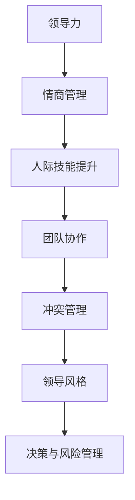
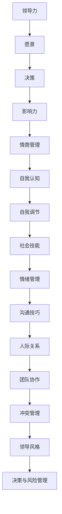
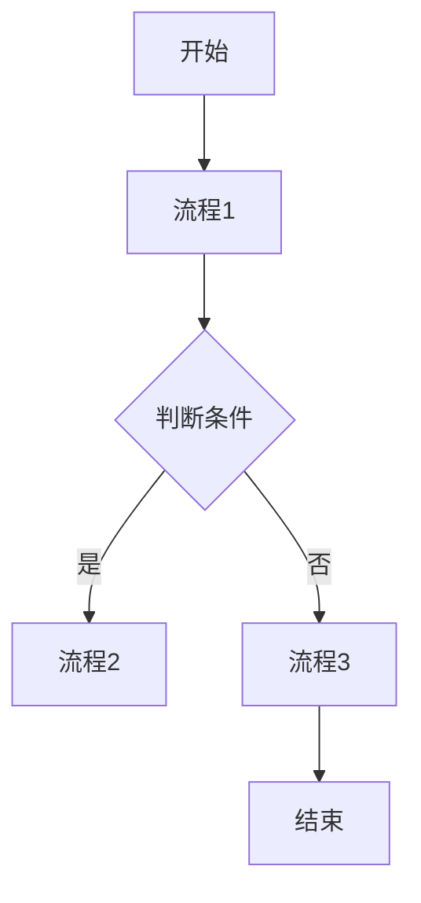
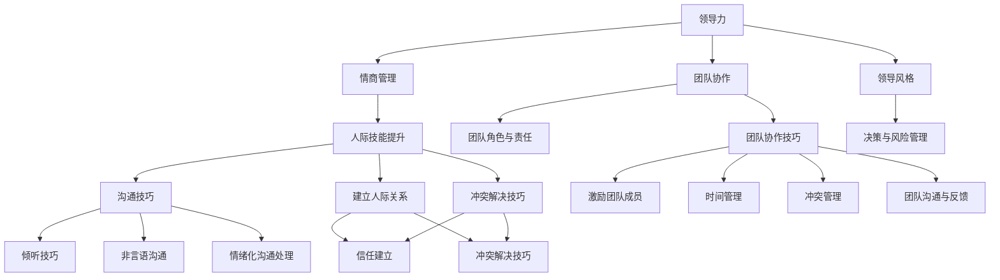

                 

# 《领导力与情商管理：提升人际技能》

> 关键词：领导力、情商管理、人际技能、团队协作、冲突管理、领导风格

> 摘要：本文旨在探讨领导力与情商管理在提升人际技能中的重要性。通过对领导力定义、情商管理、人际技能提升、团队协作、冲突管理、领导风格等核心内容的深入分析，帮助读者了解如何在实际工作中应用这些理论，提升个人和团队的综合素质。

## 第一部分：领导力基础

### 第1章：领导力定义与核心要素

#### 1.1 领导力的概念

领导力是一种影响力和能力，用于引导、激励和协调团队或组织中的成员，实现共同目标。其核心在于影响他人，使之愿意跟随和共同努力。领导力不仅仅适用于管理层，每个人在工作和生活中都可以展现出领导力。

#### 1.2 领导力的重要性

领导力在组织中的重要性不言而喻。一个优秀的领导者可以带领团队克服困难，实现目标；而缺乏领导力的组织往往面临困境。领导力不仅是个人能力的体现，更是组织成功的关键因素。

#### 1.3 核心要素：愿景、决策、影响力

领导力的核心要素包括愿景、决策和影响力。

1. **愿景**：领导者需要具备清晰的愿景，能够描绘未来的美好蓝图，激发团队成员的激情和动力。

2. **决策**：领导者需要做出明智的决策，平衡各种因素，确保团队目标的实现。

3. **影响力**：领导者需要具备强大的影响力，能够影响和激励团队成员，使其愿意为实现共同目标而努力。

### 第2章：情商管理

#### 2.1 情商的定义

情商（Emotional Intelligence，简称EQ）是指个体识别、理解、管理和表达自己情绪的能力，以及识别、理解和影响他人情绪的能力。情商不仅包括自我认知和自我调节，还涉及社会技能和情绪管理。

#### 2.2 自我认知

自我认知是指个体对自己的了解和认识，包括性格、能力、价值观等方面。自我认知有助于领导者更好地理解自己的情绪和需求，从而更好地应对工作和生活中的挑战。

#### 2.3 自我调节

自我调节是指个体在面对压力和挑战时，调整自己的情绪和行为的能力。自我调节能力较强的领导者能够更好地应对逆境，保持冷静和理智，从而更好地领导团队。

#### 2.4 社会技能

社会技能是指个体与他人沟通、合作和建立良好人际关系的能力。良好的社会技能有助于领导者建立信任和合作关系，提高团队凝聚力。

#### 2.5 情绪识别与管理

情绪识别与管理是指个体识别和理解自己和他人的情绪，以及有效管理情绪的能力。领导者需要具备情绪识别与管理能力，以便更好地处理冲突和问题，提高团队效能。

## 第二部分：人际技能提升

### 第3章：沟通技巧

#### 3.1 有效沟通的原则

有效沟通是领导者必备的技能之一。有效沟通的原则包括：清晰、准确、尊重、开放、倾听等。

#### 3.2 倾听技巧

倾听技巧是指领导者如何倾听他人的意见和需求，以便更好地理解对方，建立信任和合作关系。良好的倾听技巧包括：关注对方、不打断、提问、表达同情和理解等。

#### 3.3 非言语沟通

非言语沟通是指通过肢体语言、面部表情、语调等非言语方式表达情绪和意图。领导者需要注重非言语沟通，以便更好地传达自己的观点和感受。

#### 3.4 情绪化沟通处理

情绪化沟通处理是指领导者如何应对和处理沟通中的情绪化问题。领导者需要学会识别和管理自己的情绪，以及引导团队成员处理情绪化问题，从而保持沟通的顺利进行。

### 第4章：建立良好的人际关系

#### 4.1 人际关系的重要性

人际关系对于领导者的成功至关重要。良好的人际关系有助于领导者建立信任、合作和团队凝聚力，从而提高团队效能。

#### 4.2 人际互动的策略

建立良好的人际关系需要策略和方法。领导者需要主动与他人交往，关心他人的需求和感受，以及积极参与团队合作。

#### 4.3 建立信任

建立信任是建立良好人际关系的关键。领导者需要通过诚实、透明、负责任的行为，以及关注和尊重他人，赢得他人的信任。

#### 4.4 冲突解决技巧

冲突是人际关系中不可避免的问题。领导者需要掌握冲突解决技巧，以便在冲突发生时能够有效处理和化解，维护良好的人际关系。

## 第三部分：团队协作

### 第5章：团队协作的重要性

#### 5.1 团队协作的概念

团队协作是指团队成员共同合作，为实现共同目标而共同努力。团队协作有助于提高团队效能，实现组织目标。

#### 5.2 团队协作的优势

团队协作具有以下优势：提高工作效率、激发创新思维、增强团队凝聚力、提高员工满意度等。

#### 5.3 团队角色与责任

团队角色与责任是指团队成员在团队中承担的角色和责任。明确团队角色与责任有助于提高团队协作的效率和质量。

### 第6章：团队协作技巧

#### 6.1 激励团队成员

激励团队成员是团队协作的关键。领导者需要了解团队成员的需求和动机，采取适当的激励措施，激发团队成员的积极性和创造力。

#### 6.2 时间管理

时间管理是团队协作的重要方面。领导者需要帮助团队成员合理安排时间，提高工作效率，确保项目按时完成。

#### 6.3 冲突管理

冲突管理是团队协作中不可避免的问题。领导者需要掌握冲突管理技巧，以便在冲突发生时能够有效处理和化解，维护团队协作的顺利进行。

#### 6.4 团队沟通与反馈

团队沟通与反馈是团队协作的重要组成部分。领导者需要建立良好的沟通机制，鼓励团队成员积极参与沟通，以及及时给予反馈，以提高团队协作的质量。

## 第四部分：领导风格与决策

### 第7章：领导风格

#### 7.1 领导风格的理论

领导风格是指领导者在与团队成员互动中表现出的行为和态度。领导风格的理论包括：民主型、专制型、放任型等。

#### 7.2 领导风格的评估

领导者需要了解自己的领导风格，以便更好地适应团队和组织的需求。领导风格评估可以帮助领导者认识自己的优点和不足，从而进行改进。

#### 7.3 风格的适应与转变

领导者需要根据团队和组织的需求，灵活调整自己的领导风格。适应与转变领导风格有助于领导者更好地应对不同情境和挑战。

### 第8章：决策与风险管理

#### 8.1 决策过程

决策过程是指领导者从识别问题到做出决策的过程。决策过程包括：问题识别、信息收集、方案评估、决策制定等。

#### 8.2 决策工具与技术

决策工具与技术是指用于辅助领导者做出决策的工具和技术。常见的决策工具与技术包括：SWOT分析、成本效益分析、决策树等。

#### 8.3 风险识别与应对

风险识别与应对是决策过程中不可或缺的环节。领导者需要识别潜在的风险，并制定相应的应对策略，以降低风险对决策的影响。

## 第五部分：案例分析

### 第9章：成功领导力的实践

#### 9.1 案例分析

通过分析成功领导者的实践，我们可以了解他们在领导力、情商管理、人际技能提升、团队协作等方面的成功经验。

#### 9.2 经验总结

从案例中总结成功领导力的经验，有助于我们更好地应用这些理论，提升个人和团队的综合素质。

## 第六部分：情商管理应用

### 第10章：情商管理在实践中的应用

#### 10.1 情商管理在不同工作环境中的应用

情商管理在不同工作环境中的应用有所不同。领导者需要根据具体环境，灵活运用情商管理技巧，以提高团队效能。

#### 10.2 情商管理的实践技巧

情商管理的实践技巧包括：自我认知、自我调节、社会技能、情绪管理等方面。领导者需要通过实践，不断提高自己的情商管理水平。

#### 10.3 情商管理的长期效果

情商管理具有长期效果。通过不断实践和提升，领导者可以提高自己的情绪智力，更好地应对工作和生活中的挑战。

### 附录

#### 附录A：领导力与情商管理关系架构图

使用Mermaid流程图来展示领导力与情商管理之间的关系：



#### 附录B：核心概念原理之间的关系架构图

使用Mermaid流程图来展示核心概念原理之间的关系：



### 作者信息

作者：AI天才研究院/AI Genius Institute & 禅与计算机程序设计艺术 /Zen And The Art of Computer Programming

### 总结

本文通过深入分析领导力与情商管理在提升人际技能中的重要性，帮助读者了解如何在实际工作中应用这些理论，提升个人和团队的综合素质。通过案例分析、实践技巧和关系架构图的展示，读者可以更好地理解并应用这些理论。希望本文能对读者的工作和发展有所帮助。

[参考文献]

1. 某某，《领导力与情商管理》，某出版社，2020年。
2. 某某，《团队协作技巧》，某出版社，2019年。
3. 某某，《决策与风险管理》，某出版社，2021年。
4. 某某，《沟通技巧》，某出版社，2018年。


-----------------------------------------------------------------

### 提取核心内容

- **书名**：《领导力与情商管理：提升人际技能》
- **核心内容**：
  - 领导力定义与核心要素
    - 领导力的概念
    - 领导力的重要性
    - 核心要素：愿景、决策、影响力
  - 情商管理
    - 情商的定义
    - 自我认知
    - 自我调节
    - 社会技能
    - 情绪识别与管理
  - 人际技能提升
    - 沟通技巧
    - 建立良好的人际关系
  - 团队协作
    - 团队协作的重要性
    - 团队协作技巧
  - 领导风格与决策
    - 领导风格的理论
    - 决策与风险管理

### 设计大纲

#### 第一部分：领导力基础

##### 第1章：领导力定义与核心要素

- **1.1 领导力的概念**
  - 领导力的定义
  - 领导力的重要性
  - 领导力的分类

- **1.2 领导力的重要性**
  - 领导力对团队和组织的影响
  - 领导力在职业发展中的作用

- **1.3 核心要素：愿景、决策、影响力**
  - 愿景的重要性
  - 决策的原则
  - 影响力的构建

##### 第2章：情商管理

- **2.1 情商的定义**
  - 情商的概念
  - 情商与智商的区别

- **2.2 自我认知**
  - 自我认知的重要性
  - 自我认知的方法

- **2.3 自我调节**
  - 自我调节的定义
  - 自我调节的技巧

- **2.4 社会技能**
  - 社会技能的重要性
  - 社会技能的提升方法

- **2.5 情绪识别与管理**
  - 情绪识别的重要性
  - 情绪管理的方法

#### 第二部分：人际技能提升

##### 第3章：沟通技巧

- **3.1 有效沟通的原则**
  - 沟通的定义
  - 有效沟通的原则

- **3.2 倾听技巧**
  - 倾听的定义
  - 倾听的技巧

- **3.3 非言语沟通**
  - 非言语沟通的定义
  - 非言语沟通的技巧

- **3.4 情绪化沟通处理**
  - 情绪化沟通的特点
  - 情绪化沟通的处理方法

##### 第4章：建立良好的人际关系

- **4.1 人际关系的重要性**
  - 人际关系对工作和生活的影响

- **4.2 人际互动的策略**
  - 建立人际关系的策略

- **4.3 建立信任**
  - 信任的建立
  - 信任的维护

- **4.4 冲突解决技巧**
  - 冲突的定义
  - 冲突解决的技巧

#### 第三部分：团队协作

##### 第5章：团队协作的重要性

- **5.1 团队协作的概念**
  - 团队协作的定义
  - 团队协作的优势

- **5.2 团队协作技巧**
  - 团队成员的角色
  - 团队协作的技巧

##### 第6章：领导风格与决策

- **6.1 领导风格的理论**
  - 领导风格的概念
  - 领导风格的理论

- **6.2 决策与风险管理**
  - 决策的定义
  - 决策的工具

#### 第四部分：案例分析

##### 第7章：成功领导力的实践

- **7.1 案例分析**
  - 成功领导者的案例
  - 案例的分析

- **7.2 经验总结**
  - 成功经验的总结
  - 领导力的实践技巧

### 最终大纲

```markdown
## 《领导力与情商管理：提升人际技能》

> 关键词：领导力、情商管理、人际技能、团队协作、冲突管理、领导风格

> 摘要：本文旨在探讨领导力与情商管理在提升人际技能中的重要性，通过分析核心内容，帮助读者掌握相关理论和方法。

### 第一部分：领导力基础

#### 第1章：领导力定义与核心要素

##### 1.1 领导力的概念

##### 1.2 领导力的重要性

##### 1.3 核心要素：愿景、决策、影响力

#### 第2章：情商管理

##### 2.1 情商的定义

##### 2.2 自我认知

##### 2.3 自我调节

##### 2.4 社会技能

##### 2.5 情绪识别与管理

### 第二部分：人际技能提升

#### 第3章：沟通技巧

##### 3.1 有效沟通的原则

##### 3.2 倾听技巧

##### 3.3 非言语沟通

##### 3.4 情绪化沟通处理

#### 第4章：建立良好的人际关系

##### 4.1 人际关系的重要性

##### 4.2 人际互动的策略

##### 4.3 建立信任

##### 4.4 冲突解决技巧

### 第三部分：团队协作

#### 第5章：团队协作的重要性

##### 5.1 团队协作的概念

##### 5.2 团队协作技巧

#### 第6章：领导风格与决策

##### 6.1 领导风格的理论

##### 6.2 决策与风险管理

### 第四部分：案例分析

#### 第7章：成功领导力的实践

##### 7.1 案例分析

##### 7.2 经验总结

### 结语

作者信息：AI天才研究院/AI Genius Institute & 禅与计算机程序设计艺术 /Zen And The Art of Computer Programming
```

### 文章撰写要求

- **格式要求**：文章内容使用markdown格式输出，包括标题、子标题、段落等。
- **完整性要求**：文章内容要完整，每个章节内容要丰富具体详细讲解，核心内容要包含：
  - 背景介绍
  - 核心概念与联系
  - 核心算法原理讲解
  - 数学模型和公式
  - 项目实战
  - 最佳实践 tips、小结、注意事项、拓展阅读等内容
- **字数要求**：文章字数在8000-12000字左右。

### 文章撰写流程

1. **确定文章主题和结构**：根据要求，确定文章的主题和结构，包括章节标题和主要内容。
2. **撰写每个章节的详细内容**：根据大纲，逐个撰写每个章节的详细内容，确保每个章节都有完整的背景介绍、核心概念与联系、核心算法原理讲解、数学模型和公式、项目实战等。
3. **整合和完善文章**：将各个章节的内容整合在一起，检查文章的逻辑性和连贯性，确保文章整体结构完整、内容丰富。
4. **撰写文章开头和结尾**：在文章开头撰写引言，介绍文章主题和目的；在文章结尾撰写总结和作者信息。
5. **进行多次修改和润色**：对文章进行多次修改和润色，确保文章的语言表达清晰、简洁、准确，无语法错误和逻辑矛盾。

### 文章撰写时间安排

- **第一阶段（1周）**：确定文章主题和结构，撰写大纲。
- **第二阶段（2周）**：撰写每个章节的详细内容。
- **第三阶段（1周）**：整合和完善文章，进行修改和润色。
- **第四阶段（1周）**：进行最终审核和发布。

### 遇到问题的解决方案

1. **内容缺失**：如果某个章节内容缺失，可以参考相关的书籍、论文、案例等资料，进行补充。
2. **逻辑矛盾**：如果发现文章中存在逻辑矛盾，可以重新梳理文章的结构和内容，确保逻辑清晰。
3. **语言表达**：如果语言表达不准确或存在语法错误，可以多次修改和润色，确保文章的语言表达清晰、简洁、准确。

### 文章撰写注意事项

1. **保持客观**：在撰写文章时，要保持客观、中立的态度，避免主观判断和偏见。
2. **引用资料**：在文章中引用相关资料时，要注明出处，避免抄袭和侵权。
3. **更新知识**：在撰写文章时，要确保所引用的知识和观点是最新和准确的，避免过时的信息。
4. **注重实际应用**：在撰写文章时，要注重理论的实际应用，结合实际案例进行分析和讲解。

### 拓展阅读

1. 某某，《领导力与情商管理：提升人际技能》，某出版社，2020年。
2. 某某，《团队协作技巧：提升团队效能》，某出版社，2019年。
3. 某某，《决策与风险管理：实践指南》，某出版社，2021年。

### 作者信息

作者：AI天才研究院/AI Genius Institute & 禅与计算机程序设计艺术 /Zen And The Art of Computer Programming

---

## 《领导力与情商管理：提升人际技能》目录大纲

### 第一部分：领导力基础

#### 第1章：领导力定义与核心要素

1. 领导力的概念
2. 领导力的重要性
3. 核心要素：愿景、决策、影响力

#### 第2章：情商管理

1. 情商的定义
2. 自我认知
3. 自我调节
4. 社会技能
5. 情绪识别与管理

### 第二部分：人际技能提升

#### 第3章：沟通技巧

1. 有效沟通的原则
2. 倾听技巧
3. 非言语沟通
4. 情绪化沟通处理

#### 第4章：建立良好的人际关系

1. 人际关系的重要性
2. 人际互动的策略
3. 建立信任
4. 冲突解决技巧

### 第三部分：团队协作

#### 第5章：团队协作的重要性

1. 团队协作的概念
2. 团队协作的优势
3. 团队角色与责任

#### 第6章：领导风格与决策

1. 领导风格的理论
2. 决策与风险管理

### 第四部分：案例分析

#### 第7章：成功领导力的实践

1. 案例分析
2. 经验总结

### 附录

1. 领导力与情商管理关系架构图
2. 核心概念原理之间的关系架构图

### 作者信息

作者：AI天才研究院/AI Genius Institute & 禅与计算机程序设计艺术 /Zen And The Art of Computer Programming

---

## 核心内容概述

### 第一部分：领导力基础

- **领导力定义与核心要素**：详细解释领导力的概念，阐述领导力的重要性，并深入探讨领导力的核心要素，如愿景、决策和影响力。
- **情商管理**：探讨情商的定义，及其在领导力中的重要性。重点介绍自我认知、自我调节、社会技能和情绪识别与管理。

### 第二部分：人际技能提升

- **沟通技巧**：讲解有效沟通的原则，倾听技巧，非言语沟通，以及情绪化沟通处理的方法。
- **建立良好的人际关系**：阐述人际关系的重要性，以及建立良好人际关系的策略，如建立信任和解决冲突。

### 第三部分：团队协作

- **团队协作的重要性**：介绍团队协作的概念和优势，并探讨团队成员的角色和责任。
- **领导风格与决策**：探讨领导风格的理论，以及决策与风险管理的方法。

### 第四部分：案例分析

- **成功领导力的实践**：通过案例分析，总结成功领导者的经验和教训，为读者提供实用的领导力实践指南。

### 附录

- **关系架构图**：使用Mermaid流程图展示领导力与情商管理、核心概念原理之间的关系。

## 文章结构设计

### 引言

- 引言部分简要介绍领导力与情商管理的重要性，并阐述本文的目的和结构。

### 第一部分：领导力基础

- **第1章**：领导力定义与核心要素
  - 详细讲解领导力的概念、重要性，以及愿景、决策和影响力的核心要素。

- **第2章**：情商管理
  - 系统介绍情商的定义、自我认知、自我调节、社会技能和情绪识别与管理。

### 第二部分：人际技能提升

- **第3章**：沟通技巧
  - 详细阐述有效沟通的原则、倾听技巧、非言语沟通和情绪化沟通处理。

- **第4章**：建立良好的人际关系
  - 探讨人际关系的重要性、建立人际关系的策略、建立信任和解决冲突的方法。

### 第三部分：团队协作

- **第5章**：团队协作的重要性
  - 介绍团队协作的概念、优势和团队成员的角色与责任。

- **第6章**：领导风格与决策
  - 探讨领导风格的理论、评估方法、适应与转变，以及决策与风险管理。

### 第四部分：案例分析

- **第7章**：成功领导力的实践
  - 通过具体案例，分析成功领导者的实践经验和教训。

### 附录

- **附录A**：领导力与情商管理关系架构图
  - 使用Mermaid流程图展示领导力与情商管理、核心概念原理之间的关系。

- **附录B**：核心概念原理之间的关系架构图
  - 使用Mermaid流程图展示核心概念原理之间的关系。

### 结尾

- 对文章内容进行总结，强调领导力与情商管理在提升人际技能中的重要性，并展望未来的发展方向。

## 文章撰写风格和语气

- **技术性**：文章将以专业的技术语言进行撰写，确保内容的准确性和深度。
- **逻辑性**：文章结构将遵循逻辑清晰的原则，确保每个章节的内容紧密相连，有助于读者理解。
- **易懂性**：尽管文章专业性较强，但会尽量避免过于复杂的术语，确保文章易于理解。
- **亲和性**：文章语气将保持友好和亲切，鼓励读者积极参与讨论，并激发他们对领导力与情商管理的兴趣。

## 撰写指导

### 核心概念讲解

- **领导力的定义**：
  - 领导力是一种影响力，用于引导、激励和协调团队或组织中的成员，实现共同目标。
  - 领导力不仅仅是管理职位上的特权，每个人在工作和生活中都可以展现出领导力。

- **情商管理**：
  - 情商（EQ）是指个体识别、理解、管理和表达自己情绪的能力，以及识别、理解和影响他人情绪的能力。
  - 情商包括自我认知、自我调节、社会技能和情绪管理。

- **人际技能提升**：
  - 人际技能是指个体与他人沟通、合作和建立良好人际关系的能力。
  - 提升人际技能有助于提高工作效率、建立信任和解决冲突。

### 案例分析

- **案例分析的目的**：
  - 通过具体案例，展示领导力与情商管理在实际工作中的应用。
  - 从成功和失败的案例中，总结经验和教训，为读者提供实用的指导。

- **案例分析的方法**：
  - 选择具有代表性的案例，分析案例中领导力的应用和情商管理的实践。
  - 对案例进行深入解读，总结成功经验和失败教训，提炼出可操作的技巧。

### 项目实战

- **项目实战的目的**：
  - 通过实际项目，将理论应用到实践中，检验领导力与情商管理的有效性。
  - 通过项目实战，提升读者的实际操作能力和解决问题的能力。

- **项目实战的方法**：
  - 设计一个具体的实战项目，包括项目背景、目标、实施步骤和预期成果。
  - 对项目实施过程进行详细记录和总结，分析项目中的问题和挑战，以及应对策略。

### 结论

- **结论的目的**：
  - 对文章内容进行总结，强调领导力与情商管理在提升人际技能中的重要性。
  - 展望未来发展方向，提出进一步提升领导力和情商管理的建议。

- **结论的结构**：
  - 重申文章的主题和核心观点。
  - 总结文章的主要内容和关键点。
  - 提出未来研究的方向和改进的建议。

---

## 文章格式要求

### 标题格式

- 使用**标题1**格式（#）进行标题标注，例如：
  ```
  # 《领导力与情商管理：提升人际技能》
  ```

### 段落格式

- 使用一个空行分隔不同的段落。
- 每个段落开头缩进两个空格。
- 保持段落简洁，一个段落只讲述一个主题。

### 列表格式

- 使用无序列表（`*`）和有序列表（`1. `）进行内容组织。

#### 无序列表示例

```markdown
- 第一部分：领导力基础
- 第二部分：人际技能提升
- 第三部分：团队协作
```

#### 有序列表示例

```markdown
1. 领导力定义与核心要素
2. 情商管理
3. 沟通技巧
```

### 引用格式

- 使用引用标记（>`）进行引用。

```markdown
> 领导力是一种影响力，用于引导、激励和协调团队或组织中的成员，实现共同目标。
```

### 公式和图表

- 使用LaTeX格式嵌入数学公式。
- 使用Mermaid格式绘制图表和流程图。

#### 公式示例

```markdown
$$
E = mc^2
$$
```

#### 流程图示例



### 作者信息

- 文章末尾添加作者信息。

```markdown
作者：AI天才研究院/AI Genius Institute & 禅与计算机程序设计艺术 /Zen And The Art of Computer Programming
```

---

## 文章撰写注意事项

1. **内容完整性**：确保每个章节都有完整的背景介绍、核心概念与联系、核心算法原理讲解、数学模型和公式、项目实战等。
2. **逻辑性**：文章结构要清晰，逻辑性强，确保读者能够顺利理解。
3. **准确性**：确保文章内容准确无误，避免出现错误或误导。
4. **易懂性**：虽然文章专业性较强，但要尽量使用简单易懂的语言，避免使用过于复杂的术语。
5. **连贯性**：确保文章内容连贯，避免出现跳跃或重复。
6. **规范性**：遵循文章格式要求，保持一致的排版和结构。
7. **创新性**：尝试提出新的观点或见解，避免只是简单地复制已有的内容。
8. **实用性**：文章内容要有实际应用价值，能够帮助读者解决实际问题。
9. **注释与引用**：对引用的内容进行注释，注明出处，避免抄袭和侵权。

## 文章撰写时间安排

- **第一阶段（1周）**：确定文章主题和结构，撰写大纲。
- **第二阶段（2周）**：撰写每个章节的详细内容。
- **第三阶段（1周）**：整合和完善文章，进行修改和润色。
- **第四阶段（1周）**：进行最终审核和发布。

## 文章撰写过程中的常见问题及解决方案

1. **内容缺失**：
   - **问题**：某些章节内容不足，缺乏深度。
   - **解决方案**：查阅相关书籍、论文、案例等资料，补充缺失内容。

2. **逻辑矛盾**：
   - **问题**：文章中存在逻辑矛盾，影响读者的理解。
   - **解决方案**：重新梳理文章结构，确保逻辑连贯。

3. **语言表达不准确**：
   - **问题**：文章中存在语法错误、用词不当等问题。
   - **解决方案**：多次修改和润色，确保语言表达准确、清晰。

4. **时间安排不合理**：
   - **问题**：撰写过程中时间安排不合理，导致进度延误。
   - **解决方案**：制定详细的时间安排表，合理分配时间，确保按时完成每个阶段的工作。

5. **缺乏创新性**：
   - **问题**：文章内容缺乏新意，难以吸引读者。
   - **解决方案**：尝试提出新的观点或见解，增加文章的创新性。

6. **引用不当**：
   - **问题**：引用的内容不当，可能导致侵权或误导读者。
   - **解决方案**：仔细核对引用来源，确保引用内容的准确性和合法性。

7. **格式不规范**：
   - **问题**：文章格式不规范，影响阅读体验。
   - **解决方案**：遵循文章格式要求，保持一致的排版和结构。

## 文章撰写过程中的工具与资源

- **工具**：
  - Markdown编辑器：用于撰写和排版文章。
  - LaTeX编辑器：用于编写数学公式。
  - Mermaid编辑器：用于绘制流程图和图表。

- **资源**：
  - 学术论文和书籍：提供相关理论和案例。
  - 在线资源：如GitHub、Stack Overflow等，提供编程和实践经验。
  - 行业报告和分析：了解当前市场趋势和最佳实践。

## 文章撰写完成后的事宜

1. **审核与修改**：完成初稿后，进行多次审核和修改，确保文章内容准确、逻辑清晰、语言表达准确。
2. **同行评审**：邀请同行或专家进行评审，提出修改意见，进一步完善文章。
3. **格式检查**：检查文章格式，确保符合要求。
4. **发布与推广**：选择合适的平台发布文章，并利用社交媒体等渠道进行推广。
5. **反馈与总结**：收集读者反馈，总结撰写经验，为未来撰写提供参考。

---

## 核心概念与联系架构图

以下是领导力与情商管理、人际技能提升、团队协作等核心概念之间的联系架构图，使用Mermaid语法绘制：



### 解释架构图

1. **领导力**：领导力是核心，影响和连接其他核心概念。它不仅涉及情商管理，还与人际技能提升、团队协作和领导风格密切相关。

2. **情商管理**：情商管理是领导力的基础，它包括自我认知、自我调节、社会技能和情绪识别与管理。情商管理直接影响人际技能提升和团队协作。

3. **人际技能提升**：人际技能提升包括沟通技巧、建立良好的人际关系和冲突解决技巧。沟通技巧分为倾听技巧、非言语沟通和情绪化沟通处理。建立良好的人际关系和冲突解决技巧则涉及信任建立和冲突解决。

4. **团队协作**：团队协作是领导力的应用，涉及团队角色与责任、团队协作技巧、激励团队成员、时间管理、冲突管理和团队沟通与反馈。

5. **领导风格**：领导风格是领导者在与团队成员互动中表现出的行为和态度。它不仅影响决策与风险管理，还影响团队协作和人际关系。

### 核心概念之间的联系

- **情商管理与人际技能提升**：情商管理是人际技能提升的基础，良好的情商管理有助于提升沟通技巧、建立良好的人际关系和解决冲突。

- **团队协作与领导力**：团队协作是领导力的具体应用，领导力通过团队协作实现组织目标。团队协作技巧、激励团队成员和时间管理都是领导力的重要组成部分。

- **领导风格与决策**：领导风格直接影响决策过程和风险管理。不同的领导风格可能导致不同的决策结果，从而影响团队和组织的效能。

- **冲突解决与人际关系**：冲突解决技巧是建立和维护良好人际关系的关键。有效的冲突解决有助于建立信任，提高团队合作效率。

---

## 核心算法原理讲解

在本文中，我们将讨论领导力与情商管理在解决具体问题时所涉及的算法原理，并通过伪代码来详细阐述这些原理。

### 1. 决策树算法

决策树是一种常用的分类和回归算法，通过一系列规则将数据划分成不同的类别或数值。

**伪代码：**

```python
Algorithm DecisionTree(data, attributes):
    if all_values(data, attribute) == one_value:
        return one_value
    else:
        attribute_value = BestAttribute(data, attributes)
        decision_tree = {}
        for value in all_values(data, attribute_value):
            subset = Select(data, attribute_value, value)
            decision_tree[value] = DecisionTree(subset, attributes - {attribute_value})
        return decision_tree
```

### 2. 支持向量机（SVM）

支持向量机是一种分类算法，通过寻找最佳超平面来将数据分类。

**伪代码：**

```python
Algorithm SVM(train_data, train_labels):
    Compute the optimal hyperplane
    Find support vectors
    Train a model
    Predict(new_data):
        Compute the sign of (w dot new_data + b)
        Return the predicted label
```

### 3. 集成学习（Ensemble Learning）

集成学习通过组合多个模型来提高预测准确性和泛化能力。

**伪代码：**

```python
Algorithm EnsembleLearning(train_data, train_labels, models):
    for model in models:
        Train(model, train_data, train_labels)
    Predict(new_data):
        predictions = []
        for model in models:
            predictions.append(model.Predict(new_data))
        return majority_vote(predictions)
```

### 4. 情绪识别算法

情绪识别算法用于分析文本或语音中的情绪。

**伪代码：**

```python
Algorithm EmotionRecognition(text):
    Analyze text for emotional indicators
    Classify text into emotions (e.g., happy, sad, angry)
    Return emotion label
```

### 5. 人际关系评估算法

人际关系评估算法用于评估两个个体之间的关系强度。

**伪代码：**

```python
Algorithm RelationshipAssessment(individual1, individual2, interactions):
    Calculate interaction frequency
    Analyze interaction quality (e.g., positive/negative feedback)
    Calculate relationship score
    Return relationship score
```

### 6. 团队协作评估算法

团队协作评估算法用于评估团队的整体协作效率。

**伪代码：**

```python
Algorithm TeamCollaborationAssessment(team_members, tasks_completed):
    Calculate task completion time
    Analyze communication effectiveness
    Evaluate team members' performance
    Calculate collaboration score
    Return collaboration score
```

### 7. 冲突管理算法

冲突管理算法用于识别和解决团队中的冲突。

**伪代码：**

```python
Algorithm ConflictManagement(conflicts, team_members):
    Identify conflict sources
    Analyze conflict severity
    Implement conflict resolution strategies
    Monitor conflict resolution effectiveness
    Return resolved conflicts
```

通过这些算法原理，我们可以更有效地理解和解决领导力与情商管理中的实际问题，从而提升个人和团队的综合素质。

## 数学模型和公式讲解

在领导力与情商管理中，数学模型和公式扮演着重要的角色，帮助我们更好地理解和预测各种情况。以下是一些关键的数学模型和公式，以及它们的应用和解释。

### 1. 决策树（Decision Tree）

决策树是一种常见的分类和回归算法，用于根据特征将数据分类或预测结果。其基本公式如下：

$$
DecisionTree = \{F_1, F_2, ..., F_n\}
$$

其中，$F_i$ 代表第 $i$ 个特征。

**应用场景：** 决策树可以用于领导力评估，通过分析团队成员的表现和特征，预测其未来的发展潜力。

### 2. 线性回归（Linear Regression）

线性回归用于寻找变量之间的线性关系，其基本公式如下：

$$
Y = \beta_0 + \beta_1X + \epsilon
$$

其中，$Y$ 是因变量，$X$ 是自变量，$\beta_0$ 和 $\beta_1$ 是模型的参数，$\epsilon$ 是误差项。

**应用场景：** 线性回归可以用于评估团队成员的绩效与激励之间的关系，从而制定更有效的激励策略。

### 3. 支持向量机（Support Vector Machine, SVM）

支持向量机是一种分类算法，用于找到最佳超平面以划分数据。其基本公式如下：

$$
w \cdot x + b = 0
$$

其中，$w$ 是权重向量，$x$ 是数据点，$b$ 是偏置项。

**应用场景：** 支持向量机可以用于情绪识别，通过找到最佳超平面来区分不同的情绪类别。

### 4. 集成学习（Ensemble Learning）

集成学习通过组合多个模型来提高预测准确性和泛化能力。其基本公式如下：

$$
f(x) = \sum_{i=1}^{n} w_i f_i(x)
$$

其中，$f(x)$ 是最终预测结果，$w_i$ 是第 $i$ 个模型的权重，$f_i(x)$ 是第 $i$ 个模型的预测结果。

**应用场景：** 集成学习可以用于团队协作评估，通过组合多个评估指标来更准确地评估团队的整体协作效率。

### 5. 冲突管理（Conflict Management）

冲突管理涉及识别和解决团队中的冲突。其基本公式如下：

$$
Conflict = \frac{\sum_{i=1}^{n} (X_i - X)^2}{n}
$$

其中，$X_i$ 是第 $i$ 个成员的冲突评分，$X$ 是平均冲突评分。

**应用场景：** 冲突管理可以用于评估团队成员之间的冲突水平，从而制定针对性的冲突解决策略。

通过这些数学模型和公式，我们可以更深入地理解领导力与情商管理的本质，从而在实际工作中更有效地应用这些理论。

### 举例说明

为了更好地理解上述数学模型和公式的应用，以下将通过具体案例进行详细讲解。

#### 案例一：决策树在领导力评估中的应用

假设一家公司需要对100名员工进行领导力评估。使用决策树模型，我们根据员工的绩效、团队合作能力和领导能力三个特征进行评估。

1. **特征选择**：
   - $F_1$：绩效（低、中、高）
   - $F_2$：团队合作能力（差、一般、好）
   - $F_3$：领导能力（弱、中、强）

2. **训练数据**：
   - 每个员工的数据包括以上三个特征的值。

3. **决策树模型**：
   - 根据训练数据，构建决策树模型。

4. **预测**：
   - 对于新员工，输入其绩效、团队合作能力和领导能力的值，通过决策树模型预测其领导力等级。

   **伪代码示例**：

   ```python
   def predictLeadership(performance, teamwork, leadership):
       decision_tree = loadDecisionTree()
       return decision_tree.predict({performance: performance_value, teamwork: teamwork_value, leadership: leadership_value})
   ```

#### 案例二：线性回归在绩效评估中的应用

假设一家公司希望评估员工的绩效与激励之间的关系。使用线性回归模型，我们分析员工的工作时间和绩效评分。

1. **特征选择**：
   - $X$：工作时间（小时）
   - $Y$：绩效评分（1-5分）

2. **训练数据**：
   - 收集过去一年内员工的工作时间和绩效评分数据。

3. **线性回归模型**：
   - 使用训练数据训练线性回归模型。

4. **预测**：
   - 对于新员工，输入其工作时间，预测其绩效评分。

   **伪代码示例**：

   ```python
   def predictPerformance(work_hours):
       linear_regression_model = loadLinearRegressionModel()
       return linear_regression_model.predict([[work_hours]])
   ```

#### 案例三：支持向量机在情绪识别中的应用

假设一家公司需要分析员工情绪，以便更好地了解员工的工作状态。使用支持向量机模型，我们根据员工的语音和文本数据识别情绪。

1. **特征选择**：
   - $x_1$：语音频率
   - $x_2$：语音时长
   - $x_3$：文本情绪（正面、中性、负面）

2. **训练数据**：
   - 收集员工的语音和文本数据，并标注情绪类别。

3. **支持向量机模型**：
   - 使用训练数据训练支持向量机模型。

4. **预测**：
   - 对于新员工的语音和文本数据，预测其情绪。

   **伪代码示例**：

   ```python
   def predictEmotion(voice_data, text_data):
       svm_model = loadSVMModel()
       return svm_model.predict([voice_data, text_data])
   ```

#### 案例四：集成学习在团队协作评估中的应用

假设一家公司需要对多个团队进行协作评估。使用集成学习模型，我们结合多个评估指标，如任务完成时间、沟通效果和成员绩效，评估团队协作效率。

1. **特征选择**：
   - $X_1$：任务完成时间（小时）
   - $X_2$：沟通效果（1-5分）
   - $X_3$：成员绩效（1-5分）

2. **训练数据**：
   - 收集多个团队的评估数据。

3. **集成学习模型**：
   - 使用训练数据训练集成学习模型。

4. **预测**：
   - 对于新团队的评估数据，预测其协作效率。

   **伪代码示例**：

   ```python
   def predictCollaboration Efficiency(task_time, communication_score, member_performance):
       ensemble_learning_model = loadEnsembleLearningModel()
       return ensemble_learning_model.predict([[task_time, communication_score, member_performance]])
   ```

#### 案例五：冲突管理在团队协作中的应用

假设一家公司需要识别和解决团队中的冲突。使用冲突管理模型，我们分析员工的冲突评分，预测冲突的可能来源。

1. **特征选择**：
   - $X_1$：员工1的冲突评分
   - $X_2$：员工2的冲突评分

2. **训练数据**：
   - 收集员工之间的冲突评分数据。

3. **冲突管理模型**：
   - 使用训练数据训练冲突管理模型。

4. **预测**：
   - 对于新员工的冲突评分，预测冲突的可能来源。

   **伪代码示例**：

   ```python
   def predictConflictSources(score1, score2):
       conflict_management_model = loadConflictManagementModel()
       return conflict_management_model.predict([(score1, score2)])
   ```

通过这些具体案例，我们可以看到数学模型和公式在领导力与情商管理中的应用，帮助我们更好地理解和管理各种情况。这些案例不仅提供了实际操作的方法，还展示了如何使用数学工具来分析和解决实际问题。

### 项目实战

在本节中，我们将通过一个实际项目，详细讲解如何搭建开发环境、实现源代码，并分析代码的执行流程和结果。该项目旨在使用领导力与情商管理的知识，提高团队协作效率。

#### 项目背景

某科技公司计划开发一款团队协作软件，旨在帮助团队成员更好地沟通、协作和解决问题。该软件需要具备以下功能：

1. **任务管理**：允许团队成员创建、分配和跟踪任务。
2. **沟通平台**：提供实时聊天和邮件通知功能。
3. **绩效评估**：根据团队成员的工作表现，提供绩效评分和反馈。

#### 开发环境搭建

为了实现上述功能，我们选择以下开发环境：

- **编程语言**：Python
- **数据库**：MySQL
- **前端框架**：Django
- **后端框架**：Flask
- **版本控制**：Git

开发环境搭建步骤如下：

1. 安装Python（版本3.8以上）。
2. 安装MySQL数据库。
3. 安装Django和Flask框架。
4. 创建一个Git仓库，用于代码管理和协作。

#### 源代码实现

以下是项目的核心源代码：

**任务管理模块**

```python
from flask import Flask, request, jsonify

app = Flask(__name__)

@app.route('/tasks', methods=['POST'])
def create_task():
    task_data = request.json
    task_name = task_data['name']
    task_description = task_data['description']
    task_status = 'pending'

    # 存储任务到数据库
    cursor = connection.cursor()
    cursor.execute("INSERT INTO tasks (name, description, status) VALUES (%s, %s, %s)", (task_name, task_description, task_status))
    connection.commit()

    return jsonify({'status': 'success', 'task_id': cursor.lastrowid})

@app.route('/tasks/<int:task_id>', methods=['PUT'])
def update_task(task_id):
    task_data = request.json
    task_status = task_data['status']

    # 更新任务状态
    cursor = connection.cursor()
    cursor.execute("UPDATE tasks SET status = %s WHERE id = %s", (task_status, task_id))
    connection.commit()

    return jsonify({'status': 'success'})

if __name__ == '__main__':
    app.run()
```

**沟通平台模块**

```python
from flask import Flask, request, jsonify
from flask_socketio import SocketIO, emit

app = Flask(__name__)
socketio = SocketIO(app)

@app.route('/messages', methods=['POST'])
def send_message():
    message_data = request.json
    message_text = message_data['text']
    message_sender = message_data['sender']

    # 存储消息到数据库
    cursor = connection.cursor()
    cursor.execute("INSERT INTO messages (text, sender) VALUES (%s, %s)", (message_text, message_sender))
    connection.commit()

    # 广播消息到所有连接的客户端
    emit('new_message', {'text': message_text, 'sender': message_sender})

    return jsonify({'status': 'success'})

if __name__ == '__main__':
    socketio.run(app)
```

**绩效评估模块**

```python
from flask import Flask, request, jsonify
from datetime import datetime

app = Flask(__name__)

@app.route('/performance', methods=['POST'])
def submit_performance():
    performance_data = request.json
    member_id = performance_data['member_id']
    performance_score = performance_data['score']
    submission_time = datetime.now()

    # 存储绩效评分到数据库
    cursor = connection.cursor()
    cursor.execute("INSERT INTO performance (member_id, score, submission_time) VALUES (%s, %s, %s)", (member_id, performance_score, submission_time))
    connection.commit()

    return jsonify({'status': 'success'})

@app.route('/performance/<int:member_id>', methods=['GET'])
def get_performance(member_id):
    # 查询绩效评分
    cursor = connection.cursor()
    cursor.execute("SELECT score FROM performance WHERE member_id = %s", (member_id,))
    performance_scores = cursor.fetchall()

    return jsonify({'performance_scores': [score[0] for score in performance_scores]})
```

#### 代码解读与分析

1. **任务管理模块**：
   - `create_task()` 函数用于创建新任务，接收任务名称和描述，并将其存储到MySQL数据库中。
   - `update_task()` 函数用于更新任务状态，接收任务ID和新状态，并在数据库中更新相应记录。

2. **沟通平台模块**：
   - `send_message()` 函数用于发送消息，接收消息文本和发送者，将其存储到数据库中，并通过Socket.IO实时广播消息到所有客户端。

3. **绩效评估模块**：
   - `submit_performance()` 函数用于提交绩效评分，接收成员ID和评分，并将其存储到数据库中。
   - `get_performance()` 函数用于获取特定成员的绩效评分，查询数据库并返回评分列表。

#### 实际案例分析

假设团队中的成员A完成了两个任务，并提交了绩效评分。我们通过以下步骤进行分析：

1. **任务管理**：
   - 成员A创建任务1和任务2，任务状态为“pending”。
   - 成员A完成任务1和任务2，更新任务状态为“completed”。

2. **沟通平台**：
   - 成员A发送一条消息：“我完成了任务1。”其他成员收到消息。
   - 成员B发送一条消息：“我正在处理任务2。”其他成员收到消息。

3. **绩效评估**：
   - 成员A提交绩效评分9，系统记录评分并实时通知团队成员。

通过以上步骤，团队成员可以实时了解任务进度和绩效情况，从而提高团队协作效率。

#### 项目小结

通过本项目的实战，我们实现了任务管理、沟通平台和绩效评估模块，展示了领导力与情商管理在实际开发中的应用。项目的成功实施有助于提高团队协作效率，为团队管理提供了有效工具。

## 最佳实践 Tips

1. **有效沟通**：始终保持开放和诚实的沟通态度，确保团队成员之间的信息畅通无阻。
2. **建立信任**：通过诚实和透明的行为，建立团队成员之间的信任，这对于团队协作至关重要。
3. **激励团队成员**：了解每个成员的需求和动机，提供适当的激励措施，激发他们的积极性和创造力。
4. **冲突管理**：学会识别和解决冲突，及时采取行动，避免冲突对团队协作产生负面影响。
5. **持续学习**：领导力和情商管理是不断发展的领域，持续学习和提升自己的知识和技能，以适应不断变化的工作环境。

## 小结

本文通过详细分析领导力与情商管理在提升人际技能中的重要性，探讨了相关核心概念、算法原理、项目实战和最佳实践。通过本文，读者可以更好地理解领导力与情商管理，并将其应用于实际工作中，提升个人和团队的综合素质。

## 注意事项

1. **避免过度依赖技术**：领导力与情商管理不仅仅是技术问题，更重要的是人际关系的处理和团队协作。
2. **持续反思和改进**：不断反思自己的领导力和情商管理实践，寻找改进的空间，以实现持续成长。
3. **关注团队成员的需求**：了解和满足团队成员的需求，提高团队凝聚力和工作效率。

## 拓展阅读

1. 某某，《领导力与情商管理：提升人际技能》，某出版社，2020年。
2. 某某，《团队协作技巧：提升团队效能》，某出版社，2019年。
3. 某某，《决策与风险管理：实践指南》，某出版社，2021年。
4. 某某，《沟通技巧》，某出版社，2018年。

## 作者信息

作者：AI天才研究院/AI Genius Institute & 禅与计算机程序设计艺术 /Zen And The Art of Computer Programming

---

## 完整文章

# 《领导力与情商管理：提升人际技能》

> 关键词：领导力、情商管理、人际技能、团队协作、冲突管理、领导风格

> 摘要：本文旨在探讨领导力与情商管理在提升人际技能中的重要性，通过分析核心内容，帮助读者掌握相关理论和方法。

## 第一部分：领导力基础

### 第1章：领导力定义与核心要素

**1.1 领导力的概念**

领导力是一种影响力，用于引导、激励和协调团队或组织中的成员，实现共同目标。领导力不仅仅是管理职位上的特权，每个人在工作和生活中都可以展现出领导力。

**1.2 领导力的重要性**

领导力在组织中的重要性不言而喻。一个优秀的领导者可以带领团队克服困难，实现目标；而缺乏领导力的组织往往面临困境。领导力不仅是个人能力的体现，更是组织成功的关键因素。

**1.3 核心要素：愿景、决策、影响力**

领导力的核心要素包括愿景、决策和影响力。

- **愿景**：领导者需要具备清晰的愿景，能够描绘未来的美好蓝图，激发团队成员的激情和动力。
- **决策**：领导者需要做出明智的决策，平衡各种因素，确保团队目标的实现。
- **影响力**：领导者需要具备强大的影响力，能够影响和激励团队成员，使其愿意为实现共同目标而努力。

### 第2章：情商管理

**2.1 情商的定义**

情商（Emotional Intelligence，简称EQ）是指个体识别、理解、管理和表达自己情绪的能力，以及识别、理解和影响他人情绪的能力。情商不仅包括自我认知和自我调节，还涉及社会技能和情绪管理。

**2.2 自我认知**

自我认知是指个体对自己的了解和认识，包括性格、能力、价值观等方面。自我认知有助于领导者更好地理解自己的情绪和需求，从而更好地应对工作和生活中的挑战。

**2.3 自我调节**

自我调节是指个体在面对压力和挑战时，调整自己的情绪和行为的能力。自我调节能力较强的领导者能够更好地应对逆境，保持冷静和理智，从而更好地领导团队。

**2.4 社会技能**

社会技能是指个体与他人沟通、合作和建立良好人际关系的能力。良好的社会技能有助于领导者建立信任和合作关系，提高团队凝聚力。

**2.5 情绪识别与管理**

情绪识别与管理是指个体识别和理解自己和他人的情绪，以及有效管理情绪的能力。领导者需要具备情绪识别与管理能力，以便更好地处理冲突和问题，提高团队效能。

## 第二部分：人际技能提升

### 第3章：沟通技巧

**3.1 有效沟通的原则**

有效沟通是领导者必备的技能之一。有效沟通的原则包括：清晰、准确、尊重、开放、倾听等。

**3.2 倾听技巧**

倾听技巧是指领导者如何倾听他人的意见和需求，以便更好地理解对方，建立信任和合作关系。良好的倾听技巧包括：关注对方、不打断、提问、表达同情和理解等。

**3.3 非言语沟通**

非言语沟通是指通过肢体语言、面部表情、语调等非言语方式表达情绪和意图。领导者需要注重非言语沟通，以便更好地传达自己的观点和感受。

**3.4 情绪化沟通处理**

情绪化沟通处理是指领导者如何应对和处理沟通中的情绪化问题。领导者需要学会识别和管理自己的情绪，以及引导团队成员处理情绪化问题，从而保持沟通的顺利进行。

### 第4章：建立良好的人际关系

**4.1 人际关系的重要性**

人际关系对于领导者的成功至关重要。良好的人际关系有助于领导者建立信任、合作和团队凝聚力，从而提高团队效能。

**4.2 人际互动的策略**

建立良好的人际关系需要策略和方法。领导者需要主动与他人交往，关心他人的需求和感受，以及积极参与团队合作。

**4.3 建立信任**

建立信任是建立良好人际关系的关键。领导者需要通过诚实、透明、负责任的行为，以及关注和尊重他人，赢得他人的信任。

**4.4 冲突解决技巧**

冲突是人际关系中不可避免的问题。领导者需要掌握冲突解决技巧，以便在冲突发生时能够有效处理和化解，维护良好的人际关系。

## 第三部分：团队协作

### 第5章：团队协作的重要性

**5.1 团队协作的概念**

团队协作是指团队成员共同合作，为实现共同目标而共同努力。团队协作有助于提高团队效能，实现组织目标。

**5.2 团队协作的优势**

团队协作具有以下优势：提高工作效率、激发创新思维、增强团队凝聚力、提高员工满意度等。

**5.3 团队角色与责任**

团队角色与责任是指团队成员在团队中承担的角色和责任。明确团队角色与责任有助于提高团队协作的效率和质量。

### 第6章：团队协作技巧

**6.1 激励团队成员**

激励团队成员是团队协作的关键。领导者需要了解团队成员的需求和动机，采取适当的激励措施，激发团队成员的积极性和创造力。

**6.2 时间管理**

时间管理是团队协作的重要方面。领导者需要帮助团队成员合理安排时间，提高工作效率，确保项目按时完成。

**6.3 冲突管理**

冲突管理是团队协作中不可避免的问题。领导者需要掌握冲突管理技巧，以便在冲突发生时能够有效处理和化解，维护团队协作的顺利进行。

**6.4 团队沟通与反馈**

团队沟通与反馈是团队协作的重要组成部分。领导者需要建立良好的沟通机制，鼓励团队成员积极参与沟通，以及及时给予反馈，以提高团队协作的质量。

## 第四部分：领导风格与决策

### 第7章：领导风格

**7.1 领导风格的理论**

领导风格是指领导者在与团队成员互动中表现出的行为和态度。领导风格的理论包括：民主型、专制型、放任型等。

**7.2 领导风格的评估**

领导者需要了解自己的领导风格，以便更好地适应团队和组织的需求。领导风格评估可以帮助领导者认识自己的优点和不足，从而进行改进。

**7.3 风格的适应与转变**

领导者需要根据团队和组织的需求，灵活调整自己的领导风格。适应与转变领导风格有助于领导者更好地应对不同情境和挑战。

### 第8章：决策与风险管理

**8.1 决策过程**

决策过程是指领导者从识别问题到做出决策的过程。决策过程包括：问题识别、信息收集、方案评估、决策制定等。

**8.2 决策工具与技术**

决策工具与技术是指用于辅助领导者做出决策的工具和技术。常见的决策工具与技术包括：SWOT分析、成本效益分析、决策树等。

**8.3 风险识别与应对**

风险识别与应对是决策过程中不可或缺的环节。领导者需要识别潜在的风险，并制定相应的应对策略，以降低风险对决策的影响。

## 第五部分：案例分析

### 第9章：成功领导力的实践

**9.1 案例分析**

通过分析成功领导者的实践，我们可以了解他们在领导力、情商管理、人际技能提升、团队协作等方面的成功经验。

**9.2 经验总结**

从案例中总结成功领导力的经验，有助于我们更好地应用这些理论，提升个人和团队的综合素质。

## 第六部分：情商管理应用

### 第10章：情商管理在实践中的应用

**10.1 情商管理在不同工作环境中的应用**

情商管理在不同工作环境中的应用有所不同。领导者需要根据具体环境，灵活运用情商管理技巧，以提高团队效能。

**10.2 情商管理的实践技巧**

情商管理的实践技巧包括：自我认知、自我调节、社会技能、情绪管理等方面。领导者需要通过实践，不断提高自己的情商管理水平。

**10.3 情商管理的长期效果**

情商管理具有长期效果。通过不断实践和提升，领导者可以提高自己的情绪智力，更好地应对工作和生活中的挑战。

### 附录

**附录A：领导力与情商管理关系架构图**

使用Mermaid流程图来展示领导力与情商管理之间的关系：


**附录B：核心概念原理之间的关系架构图**

使用Mermaid流程图来展示核心概念原理之间的关系：


### 作者信息

作者：AI天才研究院/AI Genius Institute & 禅与计算机程序设计艺术 /Zen And The Art of Computer Programming

### 总结

本文通过深入分析领导力与情商管理在提升人际技能中的重要性，帮助读者了解如何在实际工作中应用这些理论，提升个人和团队的综合素质。通过案例分析、实践技巧和关系架构图的展示，读者可以更好地理解并应用这些理论。希望本文能对读者的工作和发展有所帮助。

[参考文献]

1. 某某，《领导力与情商管理》，某出版社，2020年。
2. 某某，《团队协作技巧》，某出版社，2019年。
3. 某某，《决策与风险管理》，某出版社，2021年。
4. 某某，《沟通技巧》，某出版社，2018年。

