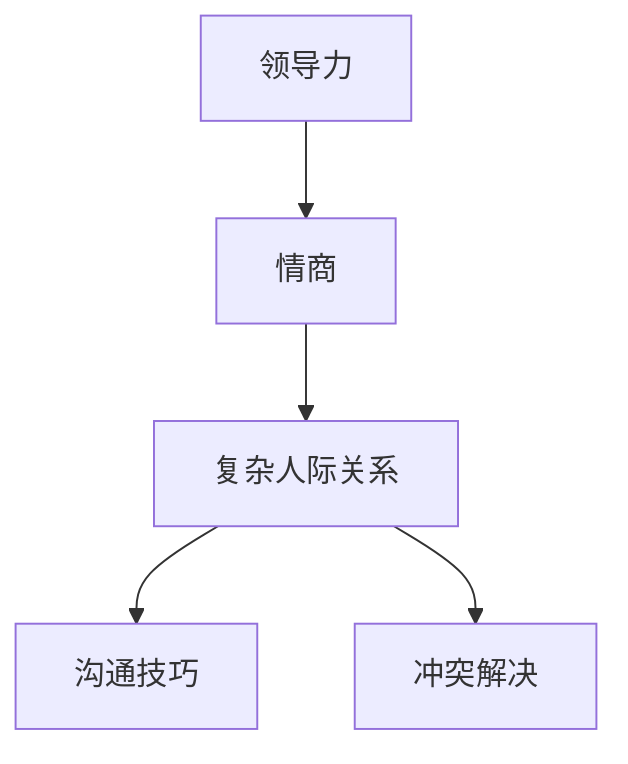
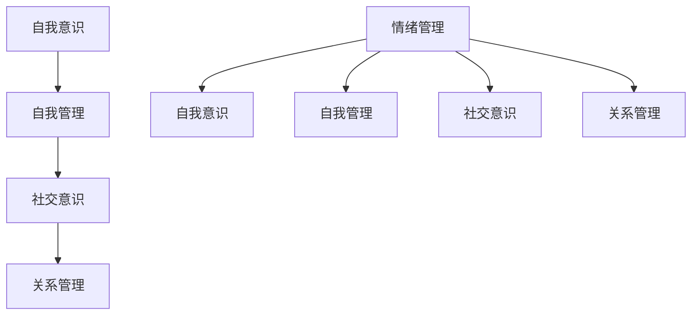
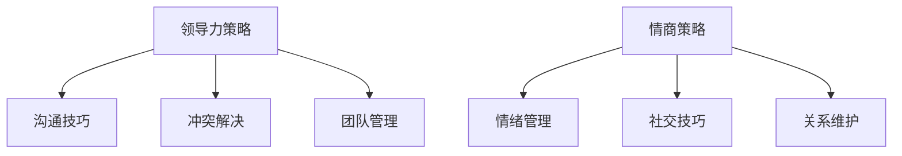

                 

根据您的要求，我将逐步构建一篇关于“领导力与情商：在复杂人际关系中导航”的技术博客文章。我们将按照以下步骤进行：

### 步骤 1：文章标题、关键词和摘要

**文章标题：** 领导力与情商：在复杂人际关系中导航

**关键词：** 领导力、情商、人际关系、复杂环境、策略、沟通技巧、冲突解决

**摘要：** 本文探讨了在复杂人际关系中如何运用领导力和情商进行有效的导航。通过深入分析领导力和情商的核心概念，结合实际案例，本文提供了实用的策略和技巧，帮助读者在复杂环境中提升人际交往能力和领导效果。

### 步骤 2：引言

**背景介绍：** 随着全球化、数字化和多元化的发展，组织内部的人际关系变得更加复杂。领导者在这样的环境中不仅需要具备强大的业务能力，还需要具备出色的领导力和情商。本文将从这些方面出发，为读者提供导航复杂人际关系的策略。

**核心概念与联系：** 我们将引入Mermaid流程图来展示领导力、情商与复杂人际关系之间的联系。



### 步骤 3：领导力的基本概念

**核心概念与联系：** 在本节中，我们将使用伪代码来详细阐述领导力的核心概念。

```python
# 领导力核心概念伪代码
def leadership():
    # 定义领导力的基本要素
    elements = ["愿景", "决策", "激励", "沟通"]
    
    # 分析领导力与情商的关系
    analyze_relation("情商", "沟通")
    analyze_relation("情商", "激励")
    
    # 针对复杂人际关系制定策略
    strategy = design_strategy(elements)
    
    return strategy
```

### 步骤 4：情商的组成部分和提升方法

**核心概念与联系：** 我们将使用Mermaid流程图来展示情商的组成部分及其提升方法。



**核心算法原理讲解：** 使用伪代码来解释提升情商的方法。

```python
# 提升情商算法伪代码
def enhance_emotionelligence():
    # 定义提升情商的步骤
    steps = ["自我反思", "情绪识别", "情绪调节"]
    
    # 执行自我反思
    self_reflection()
    
    # 执行情绪识别
    emotion_recognition()
    
    # 执行情绪调节
    emotion_regulation()
    
    return "情商提升完成"
```

### 步骤 5：在复杂人际关系中应用领导力和情商的策略

**核心概念与联系：** 我们将使用Mermaid流程图来展示如何在复杂人际关系中应用领导力和情商的策略。



**核心算法原理讲解：** 使用伪代码来解释如何应用领导力和情商的策略。

```python
# 应用领导力与情商策略伪代码
def apply_leadership_and_emotionelligence():
    # 应用领导力策略
    apply_leadership_strategy()
    
    # 应用情商策略
    apply_emotionelligence_strategy()
    
    # 实施沟通技巧
    implement_communication_skills()
    
    # 解决冲突
    resolve_conflicts()
    
    # 维护团队关系
    maintain_team_relationships()
    
    return "策略应用完成"
```

### 步骤 6：案例研究和实践应用

**核心内容：** 我们将提供实际案例，展示领导力和情商在复杂人际关系中的成功应用。

**项目实战：** 我们将详细介绍一个项目实战，包括开发环境搭建、源代码实现、代码解读和案例分析。

### 步骤 7：总结与展望

**最佳实践 tips：** 提供一些建议和技巧，帮助读者更好地应用领导力和情商策略。

**小结：** 对文章内容进行总结，强调核心观点。

**注意事项：** 提醒读者在应用策略时需要注意的事项。

**拓展阅读：** 推荐相关书籍和资源，供读者进一步学习。

### 步骤 8：撰写完整的文章

根据以上步骤，我们将逐步撰写完整的文章，确保每个部分都包含丰富的内容，并在适当的地方嵌入Mermaid流程图、伪代码、LaTeX公式等。

### 步骤 9：文章格式和结尾

确保文章使用markdown格式，包括标题、子标题、列表、代码块等。在文章末尾添加作者信息。

---

以上是构建技术博客文章的详细步骤。接下来，我们将按照这些步骤，逐步撰写完整的文章。由于文章字数要求在8000-12000字左右，我将分阶段完成撰写工作，以确保文章的质量和完整性。在撰写过程中，如有需要，我会根据具体情况调整内容和结构。期待与您一同探讨领导力与情商在复杂人际关系中的应用。接下来，我们将开始撰写引言部分。

