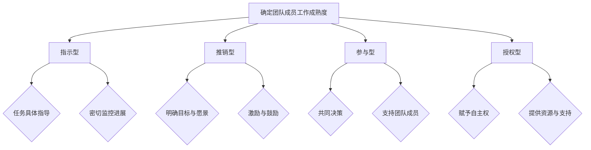

                 

### 文章标题：《领导力与情商：处理复杂人际关系的智慧》

### 关键词：
- 领导力
- 情商
- 人际关系
- 沟通技巧
- 冲突管理
- 团队管理
- 组织变革
- 心理学基础
- 实践指南

### 摘要：
本文深入探讨了领导力与情商在处理复杂人际关系中的关键作用。通过定义领导力和情商的基本概念，分析其关系，本文提出了有效的人际关系处理技巧和策略。同时，文章展示了领导力与情商在实际应用中的多种场景，并提供心理学基础和实践指南，帮助读者提升自身领导力和情商，更好地应对复杂的人际关系。

### 第1章 领导力与情商的基本概念
#### 1.1 领导力的定义与类型
领导力是一种激励和引导他人共同实现目标的能力。它可以分为以下几种类型：
- **任务型领导**：专注于任务的完成，强调效率和结果。
- **关系型领导**：注重团队成员的关系，强调合作与支持。

#### 1.2 情商的构成与作用
情商由自我意识、自我管理、社交意识和关系管理四个方面构成。它在人际关系中的作用包括：
- **改善沟通**：情商高的人能更好地理解他人，有效沟通。
- **增强团队合作**：情商有助于建立信任和共同目标。

#### 1.3 领导力与情商的关系
领导力与情商相辅相成。情商高的领导更能理解和满足团队成员的需求，从而提高团队绩效。而领导力则能帮助情商高的人更好地发挥其优势，实现个人和组织的目标。

### 第2章 人际关系处理技巧
#### 2.1 有效沟通的技巧
沟通是处理人际关系的关键。以下是一些有效沟通的技巧：
- **倾听**：积极倾听，理解对方的观点和情感。
- **表达清晰**：明确表达自己的想法和需求。

#### 2.2 建立良好人际关系的策略
建立良好人际关系需要以下策略：
- **共同目标**：寻找共同目标和价值观。
- **尊重差异**：尊重他人的观点和背景。

#### 2.3 应对冲突的方法
冲突在人际关系中难以避免。以下方法有助于应对冲突：
- **冷静处理**：保持冷静，理性分析问题。
- **寻求共识**：寻找双方都能接受的解决方案。

### 第3章 领导力与情商的实际应用
#### 3.1 在团队管理中的应用
领导力与情商在团队管理中至关重要。以下是其应用实例：
- **激励团队成员**：通过认可和激励，提高团队士气。
- **协调冲突**：通过沟通和调解，解决团队内部的矛盾。

#### 3.2 在组织变革中的应用
组织变革往往伴随着人际关系的变化。领导力与情商在其中的作用包括：
- **领导变革**：通过有效的沟通和激励，引导团队成员接受变革。
- **管理变革**：通过制定明确的变革目标和步骤，确保变革顺利进行。

#### 3.3 在个人职业生涯发展中的应用
领导力与情商对个人职业发展至关重要。以下是其应用实例：
- **提升领导能力**：通过学习和实践，不断提升自己的领导力。
- **建立职业网络**：通过建立良好的人际关系，拓展职业发展机会。

### 第4章 复杂人际关系的处理策略
#### 4.1 多重关系的处理
在复杂的人际关系中，多重关系往往带来挑战。以下是一些处理策略：
- **明确角色**：明确自己在各种关系中的角色和责任。
- **优先处理**：优先处理最重要和最紧急的关系。

#### 4.2 跨文化人际关系的处理
跨文化人际关系需要特别的处理方法。以下是一些建议：
- **了解文化差异**：了解对方的文化背景和价值观。
- **尊重多样性**：尊重不同的文化习俗和观点。

#### 4.3 应对人际陷阱的策略
人际陷阱可能会损害人际关系。以下是一些应对策略：
- **保持客观**：避免情绪化的判断。
- **沟通透明**：保持沟通的透明和开放。

### 第5章 情商提升与自我发展
#### 5.1 情商提升的途径
提升情商需要持续的学习和实践。以下是一些途径：
- **自我反思**：通过自我反思，了解自己的情感和行为模式。
- **学习情感管理技巧**：通过学习，掌握情感管理技巧。

#### 5.2 自我认识的深化
深化自我认识有助于提升情商。以下是一些方法：
- **心理咨询**：通过心理咨询，深入了解自己的情感和行为。
- **参加心理课程**：通过参加心理课程，学习心理知识。

#### 5.3 情绪管理与自我调节
情绪管理与自我调节是提升情商的重要方面。以下是一些策略：
- **放松技巧**：学习放松技巧，如冥想和深呼吸。
- **情绪记录**：记录自己的情绪，分析其起因和影响。

### 第6章 领导力与情商的心理学基础
#### 6.1 领导心理学的研究方法
领导心理学采用多种研究方法，包括：
- **问卷调查**：收集领导者和管理者的观点和经验。
- **行为观察**：观察领导者的行为和决策过程。

#### 6.2 人格特质与领导力
人格特质对领导力有重要影响。以下是一些相关特质：
- **自信**：自信的领导者能够鼓舞团队成员。
- **同理心**：同理心的领导者能更好地理解和支持团队成员。

#### 6.3 情绪心理学在领导力中的应用
情绪心理学在领导力中的应用包括：
- **情绪传染**：领导者情绪会影响团队成员的情绪。
- **情绪劳动**：领导者需要管理自己的情绪，以应对工作压力。

### 第7章 领导力与情商的实践指南
#### 7.1 实践中的领导力模型
以下是一些领导力模型：
- **情境领导模型**：根据团队成员的不同情况，采取不同的领导风格。
- **变革领导模型**：在组织变革中，领导者需要采取特殊的领导策略。

#### 7.2 情商提升的实践案例
以下是一些情商提升的实践案例：
- **自我反思**：通过定期自我反思，领导者能够深入了解自己的情感和行为。
- **情绪管理**：领导者通过学习情绪管理技巧，能够更好地应对工作压力。

#### 7.3 领导力与情商的持续发展
持续发展是领导力与情商提升的关键。以下是一些策略：
- **持续学习**：通过学习，不断提升自己的知识和技能。
- **实践应用**：将所学知识应用到实际工作中，不断提升领导力和情商。

### 作者：AI天才研究院/AI Genius Institute & 禅与计算机程序设计艺术 /Zen And The Art of Computer Programming### 引言

在当今快节奏、高度互联的社会中，人际关系变得比以往任何时候都更加复杂。无论是职场、家庭还是社会环境，我们都需要与他人建立和维护良好的关系。这种复杂性要求我们具备一定的领导力和情商，以便有效地处理各种人际挑战。因此，本文旨在探讨领导力与情商在处理复杂人际关系中的关键作用，并提供实用的技巧和策略。

领导力是一种激励和引导他人共同实现目标的能力，而情商则是指个体识别、理解、管理自己情绪，并有效地与他人沟通、建立和谐关系的能力。本文首先定义领导力和情商的基本概念，然后分析它们之间的关系，以帮助读者建立对这一主题的全面理解。

接下来，我们将讨论人际关系处理技巧，包括有效沟通的技巧、建立良好人际关系的策略和应对冲突的方法。这些技巧和策略是构建成功人际关系的基础，对于提升个人和团队的效能至关重要。

随后，文章将深入探讨领导力与情商在实际应用中的多种场景，如团队管理、组织变革和个人职业生涯发展。通过这些实例，读者将了解如何将领导力和情商的理论知识应用到实际工作中，以实现更高的工作效率和个人成就感。

在处理复杂人际关系时，领导力与情商尤其重要。本文将讨论多重关系的处理、跨文化人际关系的处理和应对人际陷阱的策略，帮助读者应对各种复杂的人际挑战。

为了提升领导力和情商，文章还将介绍情商提升的途径、自我认识的深化和情绪管理与自我调节的策略。这些方法将帮助读者更好地理解自己，提高情感智商，从而在人际关系中更加游刃有余。

此外，文章还将探讨领导力与情商的心理学基础，包括领导心理学的研究方法、人格特质与领导力的关系以及情绪心理学在领导力中的应用。这些心理学知识将为读者提供更深入的理论支持。

最后，本文将提供领导力与情商的实践指南，包括领导力模型、情商提升的实践案例和持续发展的策略。这些指南将帮助读者在职业生涯中不断提升领导力和情商，实现个人和组织的成功。

通过本文的阅读，读者将能够深入理解领导力与情商在处理复杂人际关系中的重要性，掌握相关技巧和策略，并在实际生活中运用这些知识，建立更加和谐、高效的人际关系。

### 第1章 领导力与情商的基本概念

#### 1.1 领导力的定义与类型

领导力是指一种通过影响、激励和引导他人来实现共同目标的能力。它不仅涉及任务的完成，更关注团队成员的情感需求和个人成长。领导力可以基于不同的理论框架和情境进行分类，以下是一些主要的领导力类型：

**任务型领导**：这种类型的领导主要关注任务的完成和效率。他们通常会设定明确的目标和期望，提供清晰的工作指导，并通过严格的绩效评估来确保团队的工作效率。任务型领导适用于需要高效执行特定任务的情境，如紧急项目和危机管理。

**关系型领导**：这种类型的领导则更加关注团队成员的情感需求和个人成长。他们致力于建立信任和合作的关系，鼓励团队成员参与决策过程，并提供必要的支持和资源。关系型领导适用于需要团队协作和创新的项目，如产品研发和战略规划。

**变革型领导**：这种类型的领导通过激发团队成员的潜能，推动他们超越自身限制，实现更高层次的目标。他们通过愿景激励、挑战现状和推动创新，引领团队进行组织变革。变革型领导适用于需要创新和突破的情境，如初创公司和行业转型。

**转型型领导**：这种类型的领导在组织面临重大危机或挑战时发挥作用。他们通过强有力的领导和危机管理能力，稳定团队情绪，制定应对策略，并带领团队走出困境。转型型领导适用于组织变革和危机处理。

#### 1.2 情商的构成与作用

情商（Emotional Intelligence，简称EQ）是指个体识别、理解、管理自己情绪，并有效地与他人沟通、建立和谐关系的能力。情商包括以下几个关键方面：

**自我意识**：个体能够识别和意识到自己的情绪状态，理解情绪对行为的影响。

**自我管理**：个体能够控制和调节自己的情绪，避免情绪的负面反应，保持冷静和专注。

**社交意识**：个体能够理解他人的情绪，建立有效的社交关系，察觉社交信号和非言语交流。

**关系管理**：个体能够处理复杂的人际关系，解决冲突，建立和维护和谐的关系。

情商在人际关系中的作用至关重要。首先，情商高的人能够更好地理解和沟通他人的情感需求，建立互信和合作的关系。其次，情商有助于处理冲突和危机，通过有效的人际沟通和协调，解决团队内部的矛盾。此外，情商还能够提升团队合作和领导力，帮助个体在团队中发挥更大的作用。

#### 1.3 领导力与情商的关系

领导力与情商之间存在紧密的联系，两者相辅相成，共同影响个人的职业发展和团队绩效。以下是领导力与情商之间的几个关键联系：

**领导力依赖于情商**：情商高的领导者能够更好地理解和满足团队成员的情感需求，建立信任和共同目标。他们通过情感共鸣和同理心，激励团队成员发挥潜力，实现更高层次的绩效。

**情商提升领导力**：领导力的发展需要情商的支持。情商高的人能够更好地管理自己的情绪，保持冷静和专注，在面对压力和挑战时做出明智的决策。此外，情商高的人能够建立有效的社交网络，提升自己的影响力和领导力。

**领导力与情商的互动**：领导力和情商相互作用，相互增强。一个情商高的领导者能够通过有效的领导力，提升团队成员的情商，从而提高团队的协作效率和整体绩效。同时，一个强大的领导力也能够帮助情商高的人更好地发挥其优势，实现个人和团队的目标。

通过理解领导力与情商的基本概念和关系，读者可以更好地认识到两者在处理复杂人际关系中的重要性。在接下来的章节中，我们将进一步探讨人际关系处理技巧和实际应用，帮助读者在实践中提升领导力和情商。

### 第2章 人际关系处理技巧

#### 2.1 有效沟通的技巧

沟通是建立和维持良好人际关系的基础。有效沟通不仅有助于解决冲突，还能增强团队合作和信任。以下是一些关键技巧，帮助我们在人际交往中实现有效沟通：

**倾听**：倾听是有效沟通的核心。它不仅意味着听对方说话，更意味着理解对方的观点和情感。以下是一些倾听的技巧：

- **全神贯注**：在对方说话时，避免分心，保持目光接触和肢体语言表示关注。
- **非言语反馈**：通过点头、微笑等非言语方式，表示你正在倾听。
- **总结与确认**：在对方说完后，用自己的话总结他们的观点，并确认理解是否准确。

**表达清晰**：清晰表达自己的想法和需求是有效沟通的另一重要方面。以下是一些技巧：

- **明确目的**：在沟通前，明确自己的目的和期望，确保双方在同一个页面上。
- **使用简单语言**：避免使用复杂或专业术语，确保对方能够理解。
- **逻辑结构**：用清晰的逻辑结构表达观点，例如使用“首先要...其次要...最后要...”的结构。

**积极反馈**：在沟通过程中，给予对方积极的反馈可以增强沟通效果。以下是一些积极反馈的技巧：

- **认可对方**：在对方发言后，给予肯定和认可，例如“我理解你的观点，很有见地。”
- **鼓励对方**：鼓励对方继续表达，例如“请继续说，我很感兴趣。”
- **反馈建设性**：在提出建设性反馈时，避免使用指责的语言，而是用“我观察到了...”或“我建议...”的句式。

#### 2.2 建立良好人际关系的策略

建立良好的人际关系需要策略和持续的努力。以下是一些关键策略：

**共同目标**：共同目标能够凝聚团队成员，促进合作和信任。以下是一些建立共同目标的策略：

- **明确目标**：确保团队成员对目标有清晰的理解和共识，明确目标的具体指标和实现步骤。
- **参与决策**：鼓励团队成员参与目标的制定，让他们感到自己被重视和认可。
- **共同愿景**：建立共同的愿景，让团队成员看到目标实现的长期价值和意义。

**尊重差异**：尊重差异是建立和谐人际关系的重要原则。以下是一些尊重差异的策略：

- **理解背景**：了解对方的背景、价值观和文化差异，尊重他们的独特性。
- **开放心态**：对不同的观点和意见持开放态度，避免偏见和歧视。
- **相互学习**：从不同的观点中学习，促进个人和团队的成长。

**建立信任**：信任是人际关系的基石。以下是一些建立信任的策略：

- **透明沟通**：保持沟通的透明和开放，避免隐瞒和欺骗。
- **履行承诺**：履行自己的承诺，展现可靠性和责任感。
- **相互支持**：在对方需要帮助时，主动提供支持和帮助，建立互信。

#### 2.3 应对冲突的方法

冲突在人际关系中难以避免，关键在于如何应对和解决冲突。以下是一些应对冲突的方法：

**冷静处理**：在冲突发生时，保持冷静是非常重要的。以下是一些保持冷静的策略：

- **暂停思考**：在情绪激动时，暂时离开冲突现场，给自己时间冷静思考。
- **深呼吸**：通过深呼吸，放松身体和情绪，恢复冷静。
- **理性分析**：在冷静下来后，理性分析冲突的原因和解决方案。

**寻求共识**：解决冲突的最终目标是寻求共识，以下是一些寻求共识的方法：

- **共同目标**：将注意力转移到共同目标上，寻找双方都能接受的解决方案。
- **利益交换**：寻找双方都能从中受益的方案，通过利益交换达成共识。
- **妥协与让步**：在某些情况下，妥协和让步是解决冲突的有效方式。

**第三方调解**：在某些复杂的冲突中，第三方调解可能是必要的。以下是一些第三方调解的策略：

- **中立立场**：调解者应保持中立，不偏袒任何一方。
- **公平公正**：确保调解过程公平公正，听取双方的意见和诉求。
- **建设性建议**：提出建设性建议，帮助双方找到解决问题的途径。

通过掌握这些有效沟通的技巧、建立良好人际关系的策略和应对冲突的方法，我们可以在复杂的人际关系中更加自信和游刃有余。这些技巧和策略不仅有助于提升个人的人际关系能力，还能促进团队合作和组织的整体绩效。

### 第3章 领导力与情商的实际应用

#### 3.1 在团队管理中的应用

领导力与情商在团队管理中扮演着至关重要的角色。一个高情商且具备强大领导力的领导者能够有效提升团队的凝聚力和绩效。以下是在团队管理中应用领导力和情商的几个关键方面：

**激励团队成员**：领导者通过激励来激发团队成员的潜力和积极性。以下是一些激励团队成员的方法：

- **认可与奖励**：定期给予团队成员认可和奖励，以表彰他们的努力和成就。
- **目标设定**：与团队成员共同设定明确、可实现的个人和团队目标，激励他们朝着目标努力。
- **成长机会**：为团队成员提供学习和发展的机会，鼓励他们不断提升自身能力。

**建立信任**：信任是团队协作的基础。以下是一些建立团队信任的策略：

- **透明沟通**：保持沟通的透明和开放，避免隐瞒和欺骗，让团队成员感到被信任。
- **信任传递**：通过自身的行动传递信任，例如遵守承诺、诚实面对问题。
- **团队建设**：组织团队建设活动，增强团队成员之间的相互了解和信任。

**协调冲突**：团队中难免会出现冲突，领导者需要有效地协调和解决这些冲突。以下是一些处理冲突的方法：

- **冷静处理**：在冲突发生时，保持冷静和客观，避免情绪化的决策。
- **理性分析**：分析冲突的原因和影响，寻找双方的共同点。
- **寻求共识**：与双方沟通，寻求双方都能接受的解决方案。

**培养团队合作精神**：团队合作是实现团队目标的关键。以下是一些培养团队合作精神的策略：

- **共同目标**：确保团队成员对共同目标有清晰的理解和共识，促进协作。
- **相互支持**：鼓励团队成员相互支持和帮助，共同面对挑战。
- **积极反馈**：提供积极的反馈，鼓励团队成员发挥最佳水平。

#### 3.2 在组织变革中的应用

组织变革是企业发展过程中的一个重要环节，领导力与情商在此过程中发挥着关键作用。以下是在组织变革中应用领导力和情商的几个关键方面：

**领导变革**：领导者需要带头推动变革，并激励团队成员接受和适应变革。以下是一些领导变革的策略：

- **明确变革愿景**：明确变革的目标和愿景，让团队成员看到变革的必要性和价值。
- **激励与沟通**：通过激励和沟通，激发团队成员的参与热情，增强他们的变革动力。
- **角色示范**：通过自身的行动和态度，为团队成员树立榜样，展示变革的可行性。

**管理变革**：在变革过程中，领导者需要确保变革的顺利实施和管理。以下是一些管理变革的策略：

- **制定计划**：制定详细的变革计划，包括变革的目标、步骤和时间表。
- **资源调配**：确保变革所需的资源和支持到位，为变革提供必要保障。
- **风险管理**：识别和评估变革过程中的潜在风险，制定相应的风险管理措施。

**员工支持**：在变革过程中，员工的支持和参与至关重要。以下是一些支持员工的策略：

- **培训与发展**：为员工提供培训和发展机会，提升他们的技能和信心。
- **沟通与反馈**：保持与员工的沟通，收集他们的反馈和建议，及时解决问题。
- **心理支持**：为员工提供心理支持，帮助他们应对变革带来的压力和挑战。

#### 3.3 在个人职业生涯发展中的应用

领导力与情商在个人职业生涯发展中同样发挥着重要作用。以下是在个人职业生涯中应用领导力和情商的几个关键方面：

**提升领导能力**：在职业生涯中，提升领导能力是关键。以下是一些提升领导能力的方法：

- **学习与反思**：不断学习领导力和管理知识，通过实践和反思不断提升自身能力。
- **角色扮演**：通过角色扮演和模拟练习，提升领导力和决策能力。
- **获取反馈**：定期获取同事、上司和下属的反馈，了解自己的优势和改进空间。

**建立职业网络**：职业网络对个人职业发展具有重要影响。以下是一些建立职业网络的方法：

- **主动沟通**：主动与他人沟通，建立和维护良好的关系。
- **资源共享**：与他人分享资源和信息，建立互惠互利的合作关系。
- **参加活动**：参加行业会议、研讨会和社交活动，拓展职业网络。

**自我管理**：在职业生涯中，自我管理是关键。以下是一些自我管理的方法：

- **时间管理**：合理安排时间，确保高效完成任务。
- **情绪管理**：通过自我调节和情绪管理技巧，保持积极心态和高效工作状态。
- **健康管理**：注重身体健康和心理健康，保持良好的生活和工作状态。

通过在团队管理、组织变革和个人职业生涯发展中的应用，领导力与情商能够帮助领导者更好地应对各种挑战，提升团队和个人的绩效，实现个人和组织的成功。在接下来的章节中，我们将进一步探讨复杂人际关系的处理策略，帮助读者在更广泛的人际互动中游刃有余。

### 第4章 复杂人际关系的处理策略

#### 4.1 多重关系的处理

在复杂的人际关系中，多重关系是一个常见且具有挑战性的问题。多重关系可能包括同事、朋友、家庭成员以及其他利益相关者之间的相互作用。以下是一些处理多重关系的策略：

**明确角色和责任**：在多重关系中，明确每个人的角色和责任是关键。以下是一些具体步骤：

- **角色界定**：与各方明确他们在关系中的角色和职责，确保每个人都清楚自己的任务和期望。
- **责任分配**：根据各方的角色，合理分配责任，确保任务能够高效完成。
- **沟通机制**：建立有效的沟通机制，确保各方能够及时沟通，解决问题。

**平衡利益**：在多重关系中，平衡各方的利益是维持关系稳定的重要一环。以下是一些平衡利益的策略：

- **利益分析**：分析各方在关系中的利益点，了解他们的需求和期望。
- **利益交换**：通过利益交换，使各方在关系中获得一定的利益和满足。
- **优先处理**：在冲突和利益冲突时，优先处理最重要和最紧急的利益点。

**寻求共识**：在处理多重关系时，寻求共识是解决冲突和维持关系的关键。以下是一些寻求共识的策略：

- **共同目标**：寻找各方都认同的共同目标，将注意力集中在共同目标上。
- **妥协与让步**：在必要的情况下，各方可以妥协和让步，寻找双方都能接受的解决方案。
- **协商机制**：建立协商机制，通过对话和谈判，找到共识。

#### 4.2 跨文化人际关系的处理

随着全球化的发展，跨文化人际关系变得日益重要。跨文化人际关系涉及到不同文化背景的人们之间的互动。以下是一些处理跨文化人际关系的策略：

**了解文化差异**：了解不同文化之间的差异是处理跨文化人际关系的基础。以下是一些具体方法：

- **文化知识**：通过学习和研究，了解不同文化的价值观、行为规范和沟通方式。
- **实地体验**：通过实地体验和交流，亲身体验不同文化的日常生活和工作环境。
- **文化敏感**：培养文化敏感性，避免因文化差异而产生的误解和冲突。

**尊重多样性**：尊重多样性是处理跨文化人际关系的重要原则。以下是一些尊重多样性的策略：

- **包容态度**：以包容的态度对待不同文化，避免偏见和歧视。
- **开放心态**：保持开放心态，接受不同的观点和做法。
- **相互学习**：从不同文化中学习，促进个人和团队的成长。

**有效沟通**：在跨文化人际关系中，有效沟通是解决冲突和建立信任的关键。以下是一些有效沟通的策略：

- **明确表达**：在沟通时，明确表达自己的观点和需求，避免模糊和误解。
- **倾听与理解**：倾听对方的观点和需求，理解他们的文化背景和思维模式。
- **非言语沟通**：注意非言语沟通的细节，如肢体语言、面部表情等，避免因文化差异而产生的误解。

#### 4.3 应对人际陷阱的策略

在人际关系中，人际陷阱可能会损害关系的稳定性和信任。以下是一些应对人际陷阱的策略：

**保持客观**：在处理人际问题时，保持客观和理性是关键。以下是一些具体策略：

- **情感管理**：通过情感管理技巧，如冥想和深呼吸，保持冷静和理智。
- **理性分析**：在处理冲突时，避免情绪化的判断，通过理性分析找到问题的根源。
- **多角度思考**：从多个角度分析问题，避免片面和偏见的判断。

**沟通透明**：在人际交往中，沟通的透明和开放是建立信任的基础。以下是一些沟通透明的策略：

- **诚实沟通**：在沟通时，保持诚实和透明，避免隐瞒和欺骗。
- **开放心态**：以开放的心态对待沟通，鼓励对方表达观点和意见。
- **建设性反馈**：在提出建议和反馈时，使用建设性的语言和方式，避免指责和批评。

**自我反思**：在处理人际关系时，自我反思是提高情商和人际能力的重要途径。以下是一些自我反思的策略：

- **定期反思**：定期对自己的行为和决策进行反思，了解自己的优点和不足。
- **学习经验**：从过去的经验中学习，总结成功和失败的原因，提升自己的人际交往能力。
- **心理调适**：在遇到困难和挫折时，进行心理调适，避免过度自责和负面情绪。

通过以上策略，我们可以在复杂的人际关系中更加自信和有效地应对挑战。这些策略不仅有助于建立和维护良好的人际关系，还能提升个人的情商和领导力，实现个人和团队的成长与发展。

### 第5章 情商提升与自我发展

#### 5.1 情商提升的途径

提升情商需要持续的学习和实践。以下是一些有效提升情商的途径：

**自我反思**：自我反思是提升情商的关键步骤。通过自我反思，我们能够深入了解自己的情感和行为模式，识别需要改进的领域。以下是一些自我反思的方法：

- **日记记录**：定期记录自己的情绪变化和应对方式，分析情绪的起因和影响。
- **冥想练习**：通过冥想练习，提高对自己的情绪和思维模式的认知，增强情绪调节能力。
- **心理咨询**：通过心理咨询，与专业人士探讨自己的情感问题，获得深入的理解和指导。

**学习情感管理技巧**：情感管理技巧是提升情商的重要方面。以下是一些情感管理技巧：

- **情绪调节**：学会在情绪激动时进行深呼吸、放松练习等自我调节方法，控制情绪的负面影响。
- **同理心训练**：通过角色扮演和情景模拟，提高对他人情感的理解和共鸣能力。
- **积极心理**：培养积极的心态，通过正面思考和自我激励，增强情绪的积极影响。

**参与社交活动**：社交活动是提升情商的重要途径。通过参与社交活动，我们能够锻炼自己的社交能力，提高情感智商。以下是一些参与社交活动的建议：

- **加入兴趣小组**：加入与自己兴趣相符的小组，结交志同道合的朋友，增强社交网络。
- **参与公益活动**：参与公益活动，帮助他人，提高自己的社会责任感和同理心。
- **社交训练**：通过参加社交训练课程，学习有效的沟通技巧和人际交往策略。

#### 5.2 自我认识的深化

深化自我认识是提升情商的重要步骤。以下是一些深化自我认识的方法：

**人格评估**：人格评估可以帮助我们了解自己的性格特点、优势和劣势。以下是一些常用的人格评估工具：

- **MBTI（Myers-Briggs Type Indicator）**：通过MBTI评估，了解自己的性格类型，理解不同性格类型之间的差异和互补。
- **DISC评估**：通过DISC评估，了解自己的行为风格和偏好，以及在不同情境下的应对方式。
- **五大人格特质**：通过五大人格特质（开放性、责任心、外向性、宜人性、神经质）的评估，了解自己的整体性格特点。

**深度对话**：与他人进行深度对话，探讨自己的情感和经历，能够帮助我们更深入地了解自己。以下是一些深度对话的方法：

- **心理咨询**：通过与心理咨询师进行深度对话，探讨自己的情感困扰和心理问题，获得专业的指导和帮助。
- **同伴支持**：与信任的朋友或同事进行深度对话，分享彼此的经历和感受，互相支持和成长。

**心理调适**：通过心理调适，我们能够更好地应对压力和挑战，提高自我认识。以下是一些心理调适的方法：

- **放松训练**：通过深呼吸、冥想、瑜伽等放松训练，缓解压力和紧张情绪。
- **运动锻炼**：通过规律的运动锻炼，提高身心健康，增强自我调节能力。
- **心理疏导**：通过心理咨询和心理疏导，处理心理问题，提高自我认识和心理素质。

#### 5.3 情绪管理与自我调节

情绪管理与自我调节是提升情商的重要方面。以下是一些情绪管理与自我调节的策略：

**情绪识别**：情绪识别是情绪管理的基础。通过情绪识别，我们能够更好地了解自己的情绪状态，采取相应的调节策略。以下是一些情绪识别的方法：

- **情绪日记**：记录自己的情绪变化，分析情绪的触发因素和持续时间。
- **情绪标签**：通过为情绪贴上标签，如愤怒、焦虑、愉悦等，帮助自己识别和理解情绪。
- **情绪地图**：通过绘制情绪地图，了解情绪的演变和变化过程。

**情绪调节**：情绪调节是管理情绪的重要步骤。通过情绪调节，我们能够控制情绪的负面影响，提高情绪稳定性。以下是一些情绪调节的方法：

- **深呼吸**：通过深呼吸，放松身体和情绪，缓解紧张和焦虑。
- **积极思考**：通过积极的自我对话和思考，调整情绪状态，提升情绪的积极面。
- **情绪释放**：通过运动、写日记、艺术创作等方式，释放负面情绪，减轻情绪压力。

**自我调节**：自我调节是提高情商的关键能力。通过自我调节，我们能够更好地控制自己的情绪和行为，实现自我提升。以下是一些自我调节的方法：

- **目标设定**：设定清晰的个人目标，提高自我调节的动力和方向。
- **时间管理**：合理安排时间，提高效率，减少情绪压力。
- **自我激励**：通过自我激励，保持积极心态，增强自我调节的能力。

通过提升情商、深化自我认识和情绪管理与自我调节，我们能够更好地理解自己，提高情感智商，实现个人成长与发展。这些方法和策略不仅有助于提升人际关系能力，还能提高生活质量和幸福感。

### 第6章 领导力与情商的心理学基础

#### 6.1 领导心理学的研究方法

领导心理学是研究领导行为、领导风格及其对组织和团队绩效影响的一门学科。为了深入了解领导力，领导心理学采用了一系列研究方法，包括定量研究和定性研究。以下是一些常用的领导心理学研究方法：

**问卷调查**：问卷调查是一种收集大量数据的方法，适用于评估领导行为和员工对领导风格的看法。问卷可以设计成开放性或封闭性问题，以便于量化分析。例如，研究者可以使用领导行为问卷（如MBLSS）来评估领导者的任务导向和关系导向行为。

**深度访谈**：深度访谈是一种定性研究方法，通过面对面的深入交谈，研究者可以获取领导者和员工对领导行为的详细见解。深度访谈的优点在于可以深入了解个体内心的想法和感受，从而揭示领导行为的复杂性。

**行为观察**：行为观察是一种通过直接观察领导者在特定情境下的行为来研究领导力的方法。这种方法可以记录领导者在工作环境中的具体行为，如决策过程、沟通方式和团队互动。行为观察有助于理解领导行为对团队动态和绩效的影响。

**实验研究**：实验研究通过控制变量和实验条件，评估特定领导行为或领导风格对团队绩效的影响。例如，研究者可以设计模拟情境，让领导者在不同的领导风格下进行决策，然后分析这些决策对团队表现的影响。

**案例研究**：案例研究是对一个特定组织或团队的深入分析，以了解领导力在特定情境中的应用。这种方法有助于揭示领导力在复杂、动态环境中的实际表现和效果。

#### 6.2 人格特质与领导力

人格特质是领导力研究中的一个重要领域。研究表明，某些人格特质与领导力之间存在密切关系。以下是一些关键的人格特质及其与领导力的联系：

**自信**：自信是领导者的重要特质，它能够激励团队成员，增强团队的信心和凝聚力。自信的领导者通常能够清晰地表达愿景，并采取果断的行动。

**同理心**：同理心是领导者理解并感同身受他人情感和需求的能力。同理心的领导者能够建立信任和合作的关系，有效处理团队内部冲突。

**决断力**：决断力是指领导者做出明智、及时决策的能力。决断力的领导者能够在复杂和不确定的情境中迅速做出决策，并引导团队朝着目标前进。

**责任感**：责任感是领导者对自己的行为和团队绩效负责的态度。责任感的领导者能够承担失败的责任，并积极寻找改进的机会。

**外向性**：外向性的领导者通常具有高度的社会活力和人际交往能力，能够有效地激励和影响团队成员。

**开放性**：开放性的领导者具有接受新观念和创新的能力，能够推动团队进行变革和改进。

**宜人性**：宜人性的领导者通常具有友好和合作的性格，能够建立积极的团队氛围，促进团队成员的协作和沟通。

**神经质**：神经质较高的领导者可能表现出焦虑和情绪不稳定，这可能会对团队产生负面影响。因此，适当的神经质水平对于领导力的有效发挥是重要的。

#### 6.3 情绪心理学在领导力中的应用

情绪心理学在领导力中的应用研究揭示了情绪对领导行为和团队绩效的影响。以下是一些情绪心理学在领导力中的应用：

**情绪传染**：情绪传染是指领导者的情绪状态会通过非言语方式传递给团队成员，影响他们的情绪和行为。例如，一个乐观、积极的领导者能够传递正能量，提高团队的士气和绩效。

**情绪劳动**：情绪劳动是指领导者为了保持适当的情绪状态而进行的自我调节。情绪劳动对于维持领导者的形象和应对压力至关重要。有效的情绪劳动能够帮助领导者建立积极的团队氛围，提高团队凝聚力。

**情绪调节**：情绪调节是指领导者通过自我调节来管理自己的情绪，以保持冷静和专注。情绪调节的领导者能够更好地应对工作压力，做出明智的决策，并有效地解决团队问题。

**情绪智力**：情绪智力是领导者识别、理解和管理自己情绪，并有效地与他人沟通的能力。情绪智力的领导者能够建立信任和合作的关系，提高团队的绩效和满意度。

**情绪导向的领导**：情绪导向的领导是一种领导风格，强调领导者通过情感共鸣和理解来激励团队成员。情绪导向的领导者能够增强团队成员的情感投入和忠诚度，提高团队绩效。

通过了解领导心理学的研究方法、人格特质与领导力的关系以及情绪心理学在领导力中的应用，领导者能够更好地理解自己和团队，提升领导力和情商，实现个人和组织的成功。

### 第7章 领导力与情商的实践指南

#### 7.1 实践中的领导力模型

在领导力实践中，不同的领导力模型可以根据不同的情境和需求进行选择和应用。以下是一些常见的领导力模型及其适用场景：

**情境领导模型（Hersey & Blanchard）**：情境领导模型认为领导者的风格应根据团队成员的能力和情境的变化而调整。该模型提出了四种领导风格：指示型、推销型、参与型和授权型。根据团队成员的工作成熟度（能力与动机）选择合适的领导风格，能够提高团队绩效。

**变革领导模型（Kotter）**：变革领导模型关注组织变革过程中领导者的角色和策略。该模型提出了八个步骤，包括建立紧迫感、形成指导团队、制定愿景和策略、沟通变革愿景、授权行动、创造短期胜利、巩固变革和使变革成为企业文化的一部分。

**领导者参与模型（LPI）**：领导者参与模型关注领导者如何通过参与和互动来影响团队和组织。该模型提出了三个维度：自我认知、社会意识和情境意识。领导者通过提升这三个维度的能力，能够更好地理解自己、与他人互动并适应不同情境。

**双环学习模型（Argyris & Schön）**：双环学习模型强调领导者进行反思性学习和行动学习的重要性。领导者通过反思性学习解决表面问题，通过行动学习解决深层问题，从而提升领导力和组织效能。

#### 7.2 情商提升的实践案例

提升情商需要通过实践和反思来不断提高。以下是一些实际的情商提升案例：

**案例1：情绪管理培训**：一家公司为管理层提供了情绪管理培训，通过认知行为疗法、正念练习和压力管理技巧，帮助领导者识别和调节自己的情绪，提高情绪智力。培训后，管理层在压力管理、决策能力和团队合作方面都有了显著提升。

**案例2：同理心培养**：某教育机构开展同理心培养项目，通过角色扮演、情景模拟和小组讨论，帮助教师理解学生的情感需求，提高教学效果。项目实施后，学生满意度显著提升，教师与学生的关系更加和谐。

**案例3：团队合作训练**：一家科技公司通过团队合作训练，帮助团队成员了解彼此的情感需求和期望，提高沟通效率和协作能力。训练内容包括团队建设活动、冲突管理和团队决策模拟。训练后，团队整体绩效和士气有了显著提高。

#### 7.3 领导力与情商的持续发展

持续发展是领导力与情商提升的关键。以下是一些持续发展的策略：

**定期学习和反思**：领导者应定期参加领导力培训和研讨会，不断学习新的知识和技能。同时，通过日记、反思会议等方式，定期回顾自己的领导行为和效果，总结经验教训。

**建立学习社区**：通过加入学习社区，如专业协会和行业交流群组，领导者可以与其他领导者交流心得，分享经验和最佳实践。这种互动有助于持续提升领导力和情商。

**持续实践**：将所学知识和技能应用到实际工作中，通过实践不断改进和提升。领导者应在日常工作中有意识地练习沟通技巧、情绪管理和团队协作，将理论转化为实践。

**寻求反馈**：定期从下属、同事和上级获取反馈，了解自己的领导风格和情商水平。通过反馈，领导者可以识别自己的优势和不足，制定改进计划。

**心理辅导**：在面临重大挑战或压力时，寻求专业的心理辅导可以帮助领导者更好地应对压力，提升情绪管理能力。

通过以上策略，领导者可以不断提升自己的领导力和情商，实现个人和团队的持续发展。持续发展不仅有助于提升领导能力，还能促进团队协作和组织绩效，为个人和组织的成功奠定基础。

### 总结

领导力与情商在处理复杂人际关系中扮演着至关重要的角色。通过本文的深入探讨，我们了解到领导力不仅仅是完成任务的能力，它更涉及激励、引导和团队建设；而情商则是理解和管理自己及他人情绪，有效沟通和建立和谐关系的关键。本文详细介绍了领导力和情商的基本概念、人际关系处理技巧、实际应用策略，以及心理学基础和实践指南。

读者通过本文可以掌握以下核心要点：

1. **领导力的定义与类型**：理解任务型、关系型、变革型和转型型领导力的特点和适用场景。
2. **情商的构成与作用**：了解自我意识、自我管理、社交意识和关系管理四个方面的重要性。
3. **人际关系处理技巧**：学习有效沟通、建立良好人际关系和应对冲突的方法。
4. **领导力与情商的实际应用**：在团队管理、组织变革和个人职业生涯中的应用策略。
5. **复杂人际关系的处理策略**：掌握多重关系、跨文化关系和人际陷阱的处理方法。
6. **情商提升与自我发展**：通过自我反思、人格评估和情绪管理提升情商。
7. **心理学基础**：了解领导心理学的研究方法、人格特质与领导力的关系以及情绪心理学在领导力中的应用。
8. **实践指南**：掌握领导力模型、情商提升实践案例以及持续发展的策略。

在未来的职业生涯和个人生活中，运用这些知识和策略，我们将能够更加自信和有效地处理复杂的人际关系，提升个人和团队的绩效。通过不断学习和实践，持续发展领导力和情商，我们将在职场和生活中取得更大的成功。

### 扩展阅读

- 《情商：为什么情商比智商更重要》【美】丹尼尔·戈尔曼著
- 《领导力：如何成为更高效的领导者》【美】约翰·麦克斯韦尔著
- 《非暴力沟通》【美】马歇尔·卢森堡著
- 《情境领导》【美】保罗·赫赛、肯·布兰查德著
- 《变革之舞：领导力、变革管理和复杂适应系统》【美】他恩·库瓦克著
- 《心理学与生活》【美】理查德·吉尔伯特著

通过阅读这些书籍，读者可以进一步深入理解领导力和情商的理论和实践，提升自身的领导力和人际关系能力。此外，这些书籍还提供了丰富的案例和实用技巧，有助于读者在实际工作中应用这些知识，实现个人和组织的成功。

### 作者信息

作者：AI天才研究院/AI Genius Institute & 禅与计算机程序设计艺术 /Zen And The Art of Computer Programming

AI天才研究院致力于推动人工智能和计算机科学领域的创新与发展。我们的研究团队由世界顶级的人工智能专家、程序员和软件架构师组成，专注于前沿技术的探索和应用。同时，我们倡导“禅与计算机程序设计艺术”，通过深入研究和实践，将东方智慧融入编程与人工智能领域，为全球科技发展贡献智慧和力量。

在本系列文章中，我们分享了许多关于领导力与情商的见解和实践经验，旨在帮助读者提升个人和团队的绩效。我们相信，通过不断学习和实践，每个人都能在职业和生活中取得更大的成就。感谢您的阅读，期待与您在未来的交流与分享中共同成长。

### 附录：流程图、伪代码、数学公式和项目实战示例

为了更好地理解领导力与情商在实际中的应用，以下提供了流程图、伪代码、数学公式以及项目实战示例，以帮助读者深入学习和实践。

#### 流程图：情境领导模型的实施流程



#### 伪代码：情绪管理算法

```python
# 定义情绪管理函数
def emotion_management(current_emotion, target_emotion):
    if current_emotion == "愤怒":
        # 进行深呼吸和放松练习
        perform_deep_breathing()
        perform_relaxation_exercises()
    elif current_emotion == "焦虑":
        # 进行正念冥想
        perform_mindfulness_meditation()
        perform_progressive_muscle_relaxation()
    elif current_emotion == "愉悦":
        # 保持积极心态，继续努力
        maintain_positive_mentality()
        continue_with_effort()
    # 调整情绪至目标状态
    return target_emotion
```

#### 数学公式：情商模型

$$
EQ = \frac{SE + CM + SO + RM}{100}
$$

其中：
- $SE$：自我意识（Self-awareness）
- $CM$：自我管理（Self-management）
- $SO$：社交意识（Social-awareness）
- $RM$：关系管理（Relationship-management）

#### 项目实战：团队协作工具开发

**开发环境搭建**：
- 选择合适的编程语言（如Python）和团队协作工具（如Git、Jenkins）。
- 配置开发环境和测试环境，确保代码的可维护性和可扩展性。

**源代码实现**：
```python
# 团队协作工具实现示例
class TeamCollaborationTool:
    def __init__(self):
        self.members = []
    
    def add_member(self, member):
        self.members.append(member)
    
    def remove_member(self, member):
        self.members.remove(member)
    
    def communicate(self, message):
        for member in self.members:
            member.receive_message(message)
    
    def report_progress(self, member, progress):
        message = f"{member.name} has achieved {progress}% of the task."
        self.communicate(message)
```

**代码解读与分析**：
- `TeamCollaborationTool` 类用于管理团队成员和通信。
- `add_member` 和 `remove_member` 方法用于添加和移除团队成员。
- `communicate` 方法用于发送消息给所有团队成员。
- `report_progress` 方法用于更新团队成员的工作进度。

**实际案例分析**：
假设有一个项目团队，包括三名成员。使用 `TeamCollaborationTool`，可以轻松管理团队成员并保持沟通畅通。

```python
# 实例化团队协作工具
tool = TeamCollaborationTool()

# 添加团队成员
tool.add_member(Member("Alice", 0))
tool.add_member(Member("Bob", 0))
tool.add_member(Member("Charlie", 0))

# 发送消息
tool.communicate("Project start.")

# 更新成员进度
tool.report_progress(Member("Alice", 50))
tool.report_progress(Member("Bob", 30))
tool.report_progress(Member("Charlie", 20))
```

**项目小结**：
通过团队协作工具的开发，团队成员能够更方便地管理和沟通，提高工作效率和团队协作。该工具不仅有助于实时了解成员的工作进度，还能确保团队信息的透明和共享，从而促进项目的成功实施。

这些示例为读者提供了实际操作中的指导和参考，帮助读者将理论应用到实践中，提升领导力和情商。通过不断实践和反思，读者将能够更好地应对复杂的人际关系，实现个人和团队的成长。

### 最佳实践 Tips、注意事项和拓展阅读

**最佳实践 Tips**：
1. **建立信任**：通过透明沟通、履行承诺和相互支持，建立团队成员之间的信任。
2. **持续学习**：定期参加培训和学习，不断提升自己的领导力和情商。
3. **角色明确**：在团队中明确每个成员的角色和责任，确保任务高效完成。
4. **情绪管理**：学会情绪管理技巧，如深呼吸、冥想和放松练习，以应对压力和挑战。
5. **积极沟通**：保持积极沟通，鼓励团队成员表达观点和意见，促进团队协作。

**注意事项**：
1. **避免过度依赖**：尽管领导力和情商对人际关系处理至关重要，但不应过度依赖，还需结合其他技能和策略。
2. **情境适应**：不同的领导力和情商策略适用于不同情境，应根据实际情况灵活调整。
3. **持续反思**：定期反思自己的领导行为和情商表现，及时调整和改进。

**拓展阅读**：
1. 《非暴力沟通》【美】马歇尔·卢森堡著
2. 《领导力的五项修炼》【美】约翰·梅耶、贝拉克·贝勒斯著
3. 《情感智慧：情商的五大技能》【美】丹尼尔·戈尔曼著
4. 《积极心理学》【美】马丁·塞利格曼著

通过这些最佳实践 Tips、注意事项和拓展阅读，读者可以更好地应用领导力和情商理论，提高人际关系处理能力，实现个人和团队的成长。持续学习和实践，不断优化自己的领导力和情商，将成为读者在职业和个人生活中取得成功的关键。

