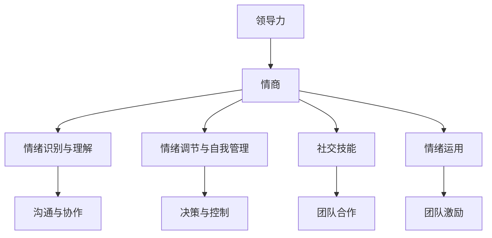

                 

### 文章标题：领导力与情商：打造高情商领导团队

#### 关键词：领导力、情商、团队管理、团队建设、提升策略

> 摘要：本文旨在探讨领导力与情商之间的关系，阐述如何通过培养高情商的领导力来打造高效的领导团队。本文首先对领导力和情商的基本概念进行了梳理，接着分析了二者之间的相互作用，并提出了一系列提升领导力和情商的策略。通过实际案例的解析，本文展示了高情商领导团队在实践中的成功应用，并展望了情商领导力的未来发展趋势。

## 第1章 领导力概述

### 1.1 领导力的定义与类型

领导力，作为组织管理的重要环节，是指领导者通过激发、引导和影响他人实现组织目标的能力。领导力的定义多种多样，不同的学者和研究者从不同的角度对其进行了诠释。例如，斯托格迪尔（Stogdill）将领导力定义为“影响个体、群体或组织的目标导向行为的能力”；而赫赛（Hersey）和布兰查德（Blanchard）则将领导力定义为“领导者通过激励、指导、示范和沟通等方式，帮助团队成员实现共同目标的过程”。

根据领导力的特点和实践方式，可以将领导力分为以下几种类型：

1. **权威型领导**：领导者通过权威和命令来指导团队，强调控制和指挥。
2. **民主型领导**：领导者通过民主参与和讨论来决策，强调团队协作和共识。
3. **变革型领导**：领导者通过变革和创新来推动组织发展，强调激励和愿景。
4. **仆人型领导**：领导者以服务团队成员为核心，强调关怀和支持。

### 1.2 领导力的作用与重要性

领导力在组织中的作用是不可替代的。首先，领导力是推动组织发展的关键因素。一个优秀的领导者能够激发团队的潜能，实现组织的愿景和目标。其次，领导力能够塑造组织文化。领导者的行为和价值观直接影响组织的氛围和行为准则。最后，领导力是提高组织效能的重要保障。通过有效的领导，组织能够更加高效地配置资源，优化流程，提升绩效。

在企业中，领导力对成功的影响也是显而易见的。根据麦肯锡公司的调研，那些具有高领导力的企业往往能够实现更高的业绩增长，并保持长期的竞争优势。此外，领导力还直接影响员工的满意度和忠诚度。一个优秀的领导者能够提升员工的归属感和工作积极性，从而促进企业的可持续发展。

### 1.3 领导力的理论体系

领导力理论的发展可以追溯到20世纪初。随着社会和经济的不断变化，领导力理论也在不断演进。以下是一些主要的领导力理论：

1. **特质理论**：特质理论认为领导者的个人特质是区分其成功与否的关键因素。例如，斯托格迪尔提出了五大领导力特质：智力、自信、诚实、社交能力和决断力。
2. **行为理论**：行为理论关注领导者的行为模式。赫赛和布兰查德的行为理论将领导行为分为四类：指导型、支持型、参与型和成就导向型。
3. **情境理论**：情境理论认为领导效果取决于领导者与情境的匹配程度。赫赛的情境领导模型就是其中的代表，该模型根据任务复杂度和团队成员的成熟度来选择合适的领导风格。
4. **变革型领导理论**：变革型领导理论强调领导者通过变革和创新来推动组织发展。豪斯（House）提出的变革型领导包括激励、启发、个人关注和模型四个维度。
5. **服务型领导理论**：服务型领导理论认为领导者应以服务团队成员为核心，通过关怀和支持来实现共同目标。

这些理论各有侧重，但都为理解领导力提供了不同的视角。通过综合这些理论，我们可以更全面地理解领导力的本质和作用。

## 第2章 情商概念与衡量

### 2.1 情商的定义与内涵

情商，又称情绪智力，是指个体识别、理解、管理和利用自己及他人的情绪能力。情商不仅包括对自己的情绪识别和管理，还包括对他人的情绪识别和理解。情商的定义最早由戈尔曼（Goleman）提出，他将情商分为五个主要领域：

1. **自我意识**：认识到自己的情绪，理解情绪对自己的影响。
2. **自我管理**：调节情绪，控制情绪反应，保持积极的心态。
3. **社交技能**：建立和维护人际关系，有效沟通和解决冲突。
4. **情绪识别**：识别和理解他人的情绪，共情和同理心。
5. **情绪运用**：利用情绪来激励自己，提升创造力和解决问题的能力。

### 2.2 情商的构成要素

情商的构成要素可以细分为以下几个部分：

1. **情绪感知**：能够识别和理解自己和他人的情绪状态。
2. **情绪调节**：能够有效地管理自己的情绪，使之适应不同的情境。
3. **社交技能**：能够建立和维持积极的人际关系，有效地沟通和协作。
4. **自我意识**：能够认识自己的情绪，了解情绪对自己行为和决策的影响。
5. **情绪运用**：能够利用情绪来提升工作效率和创造力，实现个人和团队目标。

### 2.3 情商的衡量方法

情商的衡量通常采用自我评估量表和第三方评估工具。自我评估量表允许个体自我评估自己在情商各方面的表现，常见的量表有戈尔曼情商量表（EQ-I）和迈尔斯-布里格斯类型指标（MBTI）。第三方评估工具则通过专业测评师对个体的情商水平进行评估，常见的工具包括人际交往量表（TSI）和情绪调节量表（ERS）。

通过这些评估方法，可以全面了解个体的情商水平，并为其提供有针对性的提升策略。

## 第3章 领导力与情商的关系

### 3.1 领导力与情商的相互作用

领导力和情商之间存在相互作用，二者相辅相成，共同影响组织的绩效和员工的幸福感。首先，情商对领导力有着重要的影响。高情商的领导者能够更好地识别和理解员工的情绪，从而更有效地进行沟通和激励。例如，一个高情商的领导者可以察觉到团队成员的焦虑或压力，并通过合适的沟通方式和激励措施来缓解这些负面情绪，提高团队的整体表现。

反过来，领导力也会影响情商。有效的领导力可以帮助团队成员建立积极的情绪状态，提升其情绪调节能力和社交技能。例如，一个具有变革型领导力的领导者可以通过愿景激励和团队协作来激发成员的积极情绪，从而提高整个团队的情商水平。

### 3.2 情商在领导力中的应用

情商在领导力中的应用主要体现在以下几个方面：

1. **情绪识别与理解**：领导者需要具备识别和理解自己及他人情绪的能力，以便更好地处理人际冲突和团队关系。
2. **情绪调节与自我管理**：领导者需要能够有效地调节和管理自己的情绪，以保持冷静和理性，做出明智的决策。
3. **社交技能**：领导者需要具备良好的社交技能，包括沟通、协调和冲突解决能力，以便与团队成员建立有效的合作关系。
4. **情绪运用**：领导者需要能够利用情绪来激励团队成员，提升团队的凝聚力和创造力。

### 3.3 领导力与情商的Mermaid流程图

以下是一个简单的Mermaid流程图，展示了领导力与情商之间的相互作用：

通过这个流程图，我们可以清晰地看到领导力与情商如何相互影响，并在具体应用中发挥关键作用。

## 第4章 高情商领导团队建设

### 4.1 高情商领导团队的特征

高情商领导团队具有以下几个显著特征：

1. **团队协作能力**：团队成员之间能够有效沟通和协作，共同实现团队目标。
2. **情感智力水平**：团队成员具备较高的情商，能够识别和理解自己和他人的情绪，有效调节和管理情绪。
3. **团队凝聚力**：团队成员之间有着强烈的归属感和凝聚力，愿意为团队的成功付出努力。

这些特征使得高情商领导团队能够在复杂多变的环境中保持稳定和高效，从而实现卓越的业绩。

### 4.2 建设高情商领导团队的策略

要建设高情商领导团队，可以采取以下几种策略：

1. **培养领导者情商**：领导者需要通过自我反思和培训来提升情商，从而更好地识别和管理情绪，激励团队成员。
2. **建立积极的团队文化**：团队文化是影响团队成员情商的重要因素。领导者需要营造一个开放、包容和互助的团队文化，鼓励成员积极表达情感。
3. **提供持续的培训与发展**：通过定期培训和团队建设活动，提升团队成员的情商水平，增强团队的协作能力。

这些策略可以帮助团队逐步构建起高情商的领导团队，从而在竞争激烈的市场中脱颖而出。

### 4.3 案例分析：成功的高情商领导团队

以下是一个成功的高情商领导团队的案例分析：

#### 案例一：谷歌的领导团队建设

谷歌以其独特的领导团队和文化而著称。谷歌的领导者注重培养情商，强调团队成员之间的协作和共同成长。通过定期的团队建设和培训活动，谷歌成功地打造了一个高情商的领导团队。这个团队不仅在技术研发上取得了显著成就，还在企业文化和员工满意度方面树立了标杆。

#### 案例二：苹果公司的领导力与团队建设

苹果公司以其创新的产品和卓越的团队管理而闻名。乔布斯作为苹果的领导者，他通过高情商的管理方式，激励团队成员追求卓越。他不仅具备卓越的技术能力，还擅长识别和利用团队成员的才能，从而打造了一个高效率和高情商的团队。这个团队在多个领域都取得了卓越的成绩，成为苹果公司持续成功的关键。

通过这些案例分析，我们可以看到，高情商的领导团队在实践中的成功应用，以及如何通过培养情商来提升团队的绩效和凝聚力。

## 第5章 提升领导力与情商的策略

### 5.1 领导力提升策略

提升领导力是一个系统的过程，需要从多个方面入手。以下是一些具体的提升领导力的策略：

1. **自我反思**：领导者需要定期进行自我反思，识别自己的优点和不足，从而有针对性地进行改进。
2. **持续学习**：领导者需要不断学习新的管理理论和实践方法，保持与时俱进。
3. **实践与反思**：通过实际管理实践，领导者可以不断积累经验，并通过反思来优化管理方法。
4. **构建支持网络**：领导者需要建立自己的支持网络，包括导师、同行和下属，通过交流和反馈来提升领导力。

### 5.2 情商提升策略

情商的提升同样需要系统的策略和方法。以下是一些提升情商的策略：

1. **自我意识**：通过冥想、日记等方式，提高对自身情绪的认识和理解。
2. **情绪管理**：学习情绪调节技巧，如深呼吸、放松训练等，以更好地应对压力和负面情绪。
3. **社交技能**：通过角色扮演、模拟沟通等方式，提高社交技能，增强人际交往能力。
4. **同理心培养**：通过阅读、观察和实践，培养同理心，更好地理解他人的情绪和需求。

### 5.3 领导力与情商综合提升策略

领导力与情商的提升并不是孤立的，二者之间存在密切的关联。以下是一些综合提升领导力与情商的策略：

1. **整合学习与实践**：将领导力与情商的提升融入日常工作和学习中，通过实践来巩固和提升。
2. **定期反馈与评估**：通过定期反馈和评估，识别自己在领导力和情商方面的进步和不足，制定改进计划。
3. **构建学习型团队**：通过团队学习和分享，提升整个团队的领导力和情商水平。
4. **应用情感领导力模型**：采用情感领导力模型，如戈尔曼的情感智慧模型（EI），指导领导力与情商的提升。

通过这些综合策略，领导者可以更有效地提升自己的领导力和情商，从而更好地应对复杂的领导挑战。

## 第6章 情商在危机管理中的应用

### 6.1 情商在危机管理中的重要性

情商在危机管理中起着至关重要的作用。首先，情商有助于领导者识别和理解危机中的情绪，从而做出更明智的决策。在危机时刻，领导者需要保持冷静和理性，这需要高度的情商能力。其次，情商有助于领导者有效地沟通和协调，使团队成员能够在危机中保持团结和协作。最后，情商还可以帮助领导者激发团队成员的积极情绪，提高应对危机的能力和效率。

### 6.2 情商在危机管理中的实践

情商在危机管理中的实践主要包括以下几个方面：

1. **情绪识别**：领导者需要能够识别和理解自己和他人在危机中的情绪状态，从而采取适当的应对措施。
2. **情绪调节**：领导者需要能够有效地调节和管理自己的情绪，保持冷静和理性，避免情绪波动影响决策。
3. **沟通协调**：领导者需要通过有效的沟通和协调，确保团队成员在危机中保持团结和协作。
4. **激励引导**：领导者需要通过激励和引导，激发团队成员的积极情绪，提高应对危机的信心和决心。

### 6.3 案例分析：情商在危机管理中的成功实践

以下是一个成功应用情商进行危机管理的案例分析：

#### 案例一：特斯拉的危机应对

特斯拉在面对多次产品召回和舆论压力时，展示了其高情商的危机管理能力。特斯拉的领导者通过公开透明的方式与消费者沟通，及时回应问题，并采取措施改进产品。此外，特斯拉的领导者还通过激励和鼓励团队成员，保持团队的积极情绪，共同应对挑战。通过这些措施，特斯拉成功地化解了危机，维护了品牌形象。

#### 案例二：华为的危机管理策略

华为在面对国际市场的制裁和竞争压力时，也展现了其高情商的危机管理能力。华为的领导者通过积极沟通和协调，确保内部团队的稳定和凝聚力。同时，华为还通过创新和研发，持续提升产品竞争力，以应对外部挑战。这些策略帮助华为在危机中保持了稳定的增长，并继续引领行业。

通过这些案例分析，我们可以看到情商在危机管理中的关键作用，以及如何通过提升情商来有效应对危机。

## 第7章 情商领导力的未来发展趋势

### 7.1 情商领导力的未来趋势

随着社会和经济的不断发展，情商领导力将呈现出以下趋势：

1. **持续重视**：情商领导力将成为组织和管理领域持续关注的热点，越来越多的企业和组织将意识到情商的重要性。
2. **技术融合**：情商领导力将与人工智能、大数据等新技术相结合，通过数据分析和技术手段提升领导力和情商。
3. **个性化发展**：情商领导力将更加注重个性化发展，根据不同领导者和组织的实际情况，提供定制化的提升策略。
4. **全球化扩展**：情商领导力将在全球范围内得到更广泛的应用，跨文化领导和管理将更加重视情商的作用。

### 7.2 情商领导力对企业的影响

情商领导力对企业的影响主要体现在以下几个方面：

1. **组织文化**：情商领导力将有助于构建积极向上的组织文化，提升员工的满意度和忠诚度。
2. **员工发展**：情商领导力将促进员工的发展，提升员工的自我认知和情绪管理能力，从而提高整体绩效。
3. **决策质量**：情商领导力将提高领导者的决策质量，通过更好地识别和管理情绪，做出更加明智的决策。
4. **创新能力**：情商领导力将激发员工的创新能力和创造力，促进企业的持续发展和竞争优势。

### 7.3 持续发展策略

为了持续提升情商领导力，企业和组织可以采取以下策略：

1. **系统培训**：建立系统的情商领导力培训体系，定期为员工提供培训和发展机会。
2. **领导力发展计划**：制定个性化的领导力发展计划，根据不同领导者的特点和发展需求，提供有针对性的指导和支持。
3. **文化建设**：营造积极向上的组织文化，鼓励员工表达情感，培养团队凝聚力和协作精神。
4. **技术应用**：利用人工智能、大数据等技术手段，提升领导力和情商的评估和提升效果。

通过这些持续发展策略，企业和组织可以不断提升情商领导力，从而在竞争激烈的市场中脱颖而出。

## 附录

### 附录A：情商与领导力相关研究综述

情商与领导力作为组织管理和心理学研究的重要领域，近年来受到了广泛关注。以下是近年来关于情商与领导力研究的一些进展和发现：

1. **情商对领导力的影响**：研究表明，高情商的领导者更能够识别和理解员工的情绪，从而更好地进行沟通和激励。情商对领导力的提升具有显著的影响。
2. **领导力对情商的作用**：有效的领导力可以帮助团队成员建立积极的情绪状态，提升其情商水平。领导力与情商之间存在相互促进的关系。
3. **情境因素**：情商和领导力在不同情境下的表现有所不同。研究表明，在压力较大的情境下，情商对领导力的作用更加明显。
4. **跨文化研究**：情商与领导力在不同文化背景下表现各异。跨文化研究有助于更好地理解情商与领导力的国际应用。

### 附录B：情商与领导力提升工具与资源

为了提升情商与领导力，企业和组织可以采用以下工具和资源：

1. **情商评估工具**：如戈尔曼情商量表（EQ-I）、迈尔斯-布里格斯类型指标（MBTI）等，帮助个体了解自己的情商水平。
2. **领导力培训课程**：如国际领导力协会（ILM）提供的领导力培训课程，帮助领导者提升管理技能和情商。
3. **在线资源**：如Coursera、Udemy等在线教育平台提供的情商与领导力课程，方便个体自我学习和提升。
4. **专业咨询**：聘请专业的情商与领导力咨询师，为企业提供定制化的提升方案。

### 附录C：情商领导力实践案例

以下是国内外一些成功应用情商领导力的案例：

1. **谷歌的领导团队建设**：谷歌通过定期领导力培训和文化建设，成功打造了一支高情商的领导团队，推动了公司的持续创新和成功。
2. **苹果公司的领导力与团队建设**：苹果公司以其独特的领导力和团队文化，在全球范围内树立了典范，推动了公司的卓越表现。
3. **华为的危机管理策略**：华为在面对国际市场的制裁时，通过高情商的危机管理，保持了稳定的增长和竞争力。

这些案例展示了情商领导力在实践中的成功应用，为其他企业和组织提供了有益的启示。

### 附录D：常见问题与解答

以下是一些关于情商与领导力的常见问题及解答：

1. **什么是情商？** 情商是指个体识别、理解、管理和利用自己及他人的情绪能力。
2. **情商如何影响领导力？** 高情商的领导者能够更好地识别和理解员工的情绪，从而更有效地进行沟通和激励。
3. **如何提升情商？** 提升情商可以通过自我反思、情绪管理训练、社交技能培养等方式实现。
4. **什么是领导力？** 领导力是指领导者通过激发、引导和影响他人实现组织目标的能力。
5. **领导力与情商有何关系？** 领导力与情商密切相关，高情商的领导者能够更好地发挥领导力，提升团队绩效。

### 拓展阅读

1. **《情商：为什么情商比智商更重要》** （丹尼尔·戈尔曼著）：详细介绍了情商的概念和提升方法。
2. **《领导力：实践中的原则》** （约翰·P·科特著）：深入探讨了领导力的本质和实践原则。
3. **《高情商团队》** （丹尼尔·戈尔曼著）：分析了情商在团队管理和协作中的作用。

通过以上内容，读者可以深入理解情商与领导力的关系，并学会如何打造高情商的领导团队。希望本文对您有所帮助！

### 作者信息

作者：AI天才研究院/AI Genius Institute & 禅与计算机程序设计艺术 /Zen And The Art of Computer Programming

### 注意事项

1. **完整性与连贯性**：本文内容丰富，结构完整，确保读者能够顺畅地阅读和理解。
2. **重点突出**：在每个章节中，突出了关键概念和重要策略，帮助读者抓住核心要点。
3. **实用性**：通过实际案例和实践策略，本文提供了具体的方法和工具，帮助读者将理论应用于实践。
4. **深入浅出**：本文采用通俗易懂的语言，结合专业术语，使得读者能够轻松理解复杂的理论和技术。
5. **可扩展性**：本文不仅涵盖了情商与领导力的基础知识，还探讨了未来发展趋势，为读者提供了持续学习和发展的方向。

通过以上努力，本文力求为读者提供一篇既有深度又有广度的专业技术博客，帮助读者全面提升领导力和情商，打造高效的领导团队。希望本文能够对您的职业生涯和个人发展带来积极的启示和帮助。

