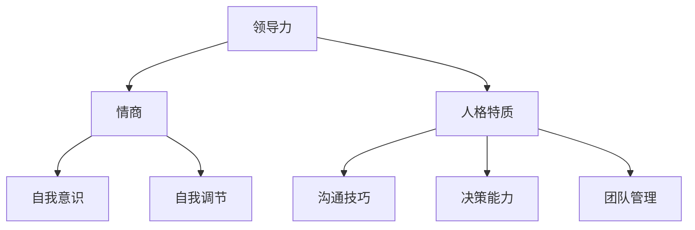

                 

```<sop>

# 《领导力与情商：理解并影响他人的能力》

## 关键词

领导力、情商、人格特质、沟通技巧、决策能力、团队管理、自我意识、自我调节、领导力与情商结合、案例研究。

## 摘要

本文从领导力的基础出发，深入探讨情商的定义与结构，并阐述领导力与情商的结合与应用。通过理论讲解、案例分析和实战项目，帮助读者理解领导力与情商的重要性，掌握提升领导力和情商的策略和方法。

----------------------------------------------------------------

## 目录

### 第一部分：领导力的基础

1. 领导力概述  
    1.1 领导力的定义与重要性  
    1.2 领导力的四大要素  
    1.3 领导力的发展趋势

2. 领导者的人格特质  
    2.1 领导者的人格魅力  
    2.2 领导者的情感智商  
    2.3 领导者的品格与价值观

3. 领导力的核心技能  
    3.1 沟通技巧  
    3.2 决策能力  
    3.3 团队管理

### 第二部分：情商的深度探索

4. 情商的定义与结构  
    4.1 情商的五大要素  
    4.2 情商的重要性  
    4.3 情商的发展与培养

5. 自我意识  
    5.1 自我认知的重要性  
    5.2 如何提升自我认知  
    5.3 自我意识的实践案例

6. 自我调节  
    6.1 情绪管理的核心概念  
    6.2 如何进行情绪调节  
    6.3 自我调节的实践技巧

### 第三部分：领导力与情商的结合

7. 情商在领导力中的应用  
    7.1 情商与领导力的关系  
    7.2 如何运用情商提升领导力  
    7.3 情商在团队建设中的应用

8. 领导力与情商的共同提升  
    8.1 领导力与情商的互动关系  
    8.2 提升领导力的策略  
    8.3 提升情商的实践方法

9. 领导力与情商的案例研究  
    9.1 成功领导者的情商特质  
    9.2 情商在领导力实践中的挑战与应对  
    9.3 案例分析：领导力与情商的有效结合

### 附录：情商提升工具与资源

A.1 情商提升的工具和方法  
A.2 情商相关的阅读推荐  
A.3 情商提升的在线课程与资源

## 第一部分：领导力的基础

### 第1章：领导力概述

#### 1.1 领导力的定义与重要性

领导力是指一种能够激发、引导和影响他人共同实现目标的能力。在组织和企业中，领导力是推动团队发展、实现战略目标的关键因素。具备优秀领导力的人能够在复杂多变的环境中迅速做出正确的决策，有效地激励团队，实现组织目标。

领导力的重要性体现在以下几个方面：

1. 促进组织发展：领导力能够激发团队的潜力和创造力，推动组织不断向前发展。

2. 增强团队凝聚力：优秀的领导力能够建立和谐的团队氛围，增强团队成员之间的信任和合作。

3. 提高工作效率：领导力能够帮助团队明确目标，合理分配资源，提高工作效率。

4. 培养人才：领导力能够帮助组织培养和留住优秀人才，为组织发展提供源源不断的人才支持。

#### 1.2 领导力的四大要素

领导力包括四大要素：人格特质、沟通技巧、决策能力和团队管理。这些要素相互关联，共同构成了领导力的核心。

1. 人格特质：领导者的人格魅力、情感智商、品格与价值观是领导力的重要基础。

2. 沟通技巧：领导者需要具备良好的沟通能力，能够有效地表达自己的想法，倾听他人的意见。

3. 决策能力：领导者需要能够迅速做出正确的决策，并承担相应的责任。

4. 团队管理：领导者需要具备团队管理的技能，能够建立和谐的团队氛围，激发团队潜力。

#### 1.3 领导力的发展趋势

随着社会和科技的发展，领导力也在不断演进。以下是一些领导力的发展趋势：

1. 平台化领导：领导力不再仅限于传统的权威式领导，更加注重平等、协作和共同成长。

2. 情商领导：情商在领导力中的作用越来越重要，领导者需要具备更高的情商，能够更好地理解和影响他人。

3. 数据驱动领导：领导者需要具备数据分析能力，能够运用数据指导决策，提高领导力效能。

4. 创新领导：领导者需要具备创新精神，能够推动组织不断进行创新，保持竞争优势。

## 第二章：领导者的人格特质

#### 2.1 领导者的人格魅力

领导者的人格魅力是领导力的重要基础。人格魅力包括自信、诚信、热情、正直等品质。具备人格魅力的领导者能够吸引和凝聚团队成员，建立良好的团队氛围。

1. 自信：自信的领导者能够坚定自己的信念，面对困难和挑战时不屈不挠。

2. 诚信：诚信的领导者能够赢得团队成员的信任，建立良好的合作关系。

3. 热情：热情的领导者能够激发团队成员的热情，共同为实现目标而努力。

4. 正直：正直的领导者能够坚持原则，为团队成员树立正确的价值观。

#### 2.2 领导者的情感智商

情感智商是领导者的重要素质。情感智商包括自我意识、自我调节、同理心和社交技能。具备高情感智商的领导者能够更好地理解和影响他人。

1. 自我意识：领导者需要具备良好的自我意识，能够认识到自己的情感状态和需求。

2. 自我调节：领导者需要能够调节自己的情绪，保持冷静和理智，做出正确的决策。

3. 同理心：领导者需要具备同理心，能够理解他人的情感和需求，建立良好的人际关系。

4. 社交技能：领导者需要具备良好的社交技能，能够有效地沟通和协调团队成员。

#### 2.3 领导者的品格与价值观

领导者的品格与价值观是领导力的核心。领导者的品格包括责任感、使命感、自律等品质。领导者需要具备正确的价值观，能够为团队成员树立榜样。

1. 责任感：领导者需要具备强烈的责任感，能够承担起组织发展的重任。

2. 使命感：领导者需要具备使命感，能够为组织和社会创造价值。

3. 自律：领导者需要具备自律品质，能够自我约束，保持高尚的道德标准。

4. 正直：领导者需要具备正直品质，能够坚持原则，拒绝腐败和不良行为。

## 第三章：领导力的核心技能

#### 3.1 沟通技巧

沟通技巧是领导力的核心技能之一。领导者需要具备良好的沟通能力，能够有效地传达信息，倾听他人的意见。

1. 清晰表达：领导者需要能够清晰、准确地表达自己的想法和意见。

2. 倾听：领导者需要具备倾听的技巧，能够理解和关注他人的观点和需求。

3. 说服力：领导者需要具备说服力，能够通过沟通影响他人的决策和行为。

4. 非语言沟通：领导者需要注重非语言沟通，如肢体语言、面部表情等，以增强沟通效果。

#### 3.2 决策能力

决策能力是领导力的核心技能之一。领导者需要具备快速做出正确决策的能力，并承担相应的责任。

1. 信息收集：领导者需要具备收集和分析信息的能力，为决策提供依据。

2. 风险评估：领导者需要具备评估风险的能力，为决策提供参考。

3. 决策执行：领导者需要能够制定有效的执行计划，并确保决策得到有效实施。

4. 反馈与调整：领导者需要能够根据执行结果进行反馈和调整，以优化决策效果。

#### 3.3 团队管理

团队管理是领导力的核心技能之一。领导者需要具备团队管理的技能，能够建立和谐的团队氛围，激发团队潜力。

1. 团队组建：领导者需要能够组建有效的团队，明确团队成员的角色和责任。

2. 团队激励：领导者需要能够激励团队成员，激发他们的工作热情和创造力。

3. 团队协作：领导者需要能够促进团队成员之间的协作，提高团队整体效率。

4. 团队发展：领导者需要能够推动团队不断进步，提升团队的综合素质。

## 第二部分：情商的深度探索

### 第4章：情商的定义与结构

#### 4.1 情商的五大要素

情商（Emotional Intelligence，简称EQ）是指个体在情感、社交和自我管理方面的能力。情商的五大要素包括：

1. 自我意识：指个体对自己的情感状态、需求、动机和态度的认识。

2. 自我调节：指个体在面对情绪刺激时，通过认知和行为调节自己的情绪状态，以达到情绪稳定。

3. 同理心：指个体能够理解和感受他人的情感，站在他人的角度思考问题。

4. 社交技能：指个体在社交场合中的沟通、协调和人际关系处理能力。

5. 自我激励：指个体在面对挑战和困难时，能够自我激励，保持积极向上的心态。

#### 4.2 情商的重要性

情商在个体和组织的成功中扮演着重要的角色。以下是情商重要性的几个方面：

1. 个人发展：情商有助于个体在工作和生活中更好地应对挑战，提高生活质量和幸福感。

2. 领导力：情商是领导力的关键要素，具备高情商的领导者能够更好地理解和影响他人，提升团队凝聚力。

3. 团队协作：情商有助于团队成员之间的沟通与合作，提高团队效率和创造力。

4. 组织管理：情商有助于组织领导者更好地管理员工，提高组织整体绩效。

#### 4.3 情商的发展与培养

情商可以通过后天的培养得到提升。以下是一些提升情商的方法：

1. 自我反思：通过反思自己的情绪和行为，了解自己的情感状态和需求。

2. 情绪管理：学会情绪调节技巧，如深呼吸、冥想等，以应对情绪刺激。

3. 同理心培养：通过阅读、观影等方式，增强对他人的情感理解。

4. 社交技能训练：参加社交技能培训，提高沟通和人际关系处理能力。

5. 持续学习：学习心理学、领导力等相关知识，提升情商。

### 第5章：自我意识

#### 5.1 自我认知的重要性

自我意识是情商的基石，自我认知是自我意识的核心。自我认知的重要性体现在以下几个方面：

1. 情感管理：自我认知有助于个体了解自己的情感状态，从而更好地进行情绪管理。

2. 人际关系：自我认知有助于个体更好地理解自己的需求，建立良好的人际关系。

3. 个人发展：自我认知有助于个体明确自己的目标和方向，实现个人成长。

4. 职业发展：自我认知有助于个体了解自己的优势和劣势，为职业发展提供指导。

#### 5.2 如何提升自我认知

提升自我认知需要通过以下方法：

1. 反思：定期对自己的行为和情感进行反思，了解自己的内心世界。

2. 记录：记录自己的日常活动、情感和思考，以更深入地了解自己。

3. 咨询：寻求心理咨询师或导师的帮助，探讨自己的困惑和问题。

4. 学习：学习心理学、哲学等相关知识，提高自我认知能力。

5. 艺术创作：通过绘画、写作等方式，表达自己的情感和思考。

#### 5.3 自我意识的实践案例

以下是一个自我意识的实践案例：

王先生是一位项目经理，他发现自己最近在工作中容易焦虑和烦躁。通过反思，他意识到这是因为项目进度紧张，任务繁重导致的。于是，他开始采取以下措施：

1. 制定合理的工作计划，确保任务按时完成。

2. 利用业余时间进行放松，如进行瑜伽练习、听音乐等。

3. 与团队成员保持良好的沟通，了解他们的需求和困难，共同解决问题。

通过以上措施，王先生的工作效率得到了提高，焦虑和烦躁的情绪也得到缓解。

### 第6章：自我调节

#### 6.1 情绪管理的核心概念

情绪管理是自我调节的核心，它涉及如何识别、理解和控制自己的情绪。情绪管理的核心概念包括：

1. 情绪识别：识别自己的情绪，包括情绪的类型、强度和发生的时间。

2. 情绪理解：理解情绪背后的原因和意义，包括情绪对个人行为和思维的影响。

3. 情绪控制：通过认知和行为调节自己的情绪，以达到情绪稳定。

4. 情绪表达：以适当的方式表达情绪，避免情绪对他人造成负面影响。

#### 6.2 如何进行情绪调节

以下是一些情绪调节的方法：

1. 认知重构：通过改变对事件的认知，调整情绪反应。

2. 情绪宣泄：通过运动、写日记等方式，宣泄情绪。

3. 放松训练：通过深呼吸、冥想等放松技巧，缓解情绪。

4. 情绪转移：将注意力转移到其他事物，避免情绪持续困扰。

5. 情绪支持：寻求亲友、专业人士的支持，分享情绪体验。

#### 6.3 自我调节的实践技巧

以下是一个自我调节的实践案例：

李小姐是一位销售人员，她最近感到压力很大，因为销售任务未能完成。她采取了以下措施进行情绪调节：

1. 认知重构：她意识到压力源于对销售任务的高期望，于是调整了自己的期望值。

2. 放松训练：她每天晚上进行冥想，缓解压力。

3. 情绪支持：她与同事分享了自己的困扰，得到了他们的支持和建议。

通过以上措施，李小姐的情绪得到了有效调节，她重新找到了工作的动力。

## 第三部分：领导力与情商的结合

### 第7章：情商在领导力中的应用

#### 7.1 情商与领导力的关系

情商与领导力密切相关，高情商的领导者能够更好地理解他人，建立良好的人际关系，提高领导效能。以下是情商与领导力的关系：

1. 情商是领导力的基础：情商是领导者成功的关键因素，它决定领导者能否有效地影响和激励他人。

2. 情商提升领导力：通过提升情商，领导者能够更好地理解他人的需求和情感，建立信任，提高领导效能。

3. 领导力促进情商发展：领导力的实践有助于领导者提高自我意识，增强情绪调节能力，提升情商。

#### 7.2 如何运用情商提升领导力

以下是一些运用情商提升领导力的方法：

1. 建立信任：通过真诚、诚实和透明的行为，建立与团队成员的信任关系。

2. 激励他人：了解团队成员的需求和动机，采用合适的激励方式，激发他们的工作热情。

3. 沟通协调：通过有效沟通，解决团队中的冲突，促进团队成员之间的协作。

4. 情绪管理：在面对压力和挑战时，保持冷静和理智，做出正确的决策。

5. 领导风格：根据团队成员的特点和环境，采用合适的领导风格，提高领导效能。

#### 7.3 情商在团队建设中的应用

情商在团队建设中发挥着重要作用，以下是情商在团队建设中的应用：

1. 理解团队成员：通过同理心，理解团队成员的情感和需求，建立和谐的团队氛围。

2. 促进团队协作：通过有效沟通和协调，解决团队中的冲突，促进团队成员之间的协作。

3. 提高团队凝聚力：通过建立信任和共同目标，提高团队的凝聚力，增强团队的整体实力。

4. 培养团队成员：通过激励和指导，培养团队成员的能力，提升团队的整体素质。

### 第8章：领导力与情商的共同提升

#### 8.1 领导力与情商的互动关系

领导力与情商之间存在互动关系，二者相互促进，共同提升。以下是领导力与情商的互动关系：

1. 情商提升领导力：高情商的领导者能够更好地理解他人，建立良好的人际关系，提高领导效能。

2. 领导力促进情商发展：领导力的实践有助于领导者提高自我意识，增强情绪调节能力，提升情商。

3. 共同发展：领导力与情商的共同提升有助于领导者更好地应对挑战，实现个人和组织的目标。

#### 8.2 提升领导力的策略

以下是一些提升领导力的策略：

1. 持续学习：不断学习新知识、新技能，提升自己的领导力水平。

2. 自我反思：定期反思自己的行为和决策，发现并改正不足。

3. 沟通能力：提高沟通能力，学会有效表达和倾听。

4. 团队管理：掌握团队管理技巧，提高团队凝聚力和协作能力。

5. 情绪管理：学会情绪管理，保持冷静和理智，做出正确的决策。

#### 8.3 提升情商的实践方法

以下是一些提升情商的实践方法：

1. 自我意识：提高自我意识，了解自己的情感状态和需求。

2. 情绪调节：学会情绪调节技巧，如深呼吸、冥想等，以应对情绪刺激。

3. 同理心：培养同理心，增强对他人的情感理解。

4. 社交技能：提高社交技能，学会有效沟通和协调人际关系。

5. 自我激励：培养自我激励能力，面对挑战和困难时保持积极向上的心态。

### 第9章：领导力与情商的案例研究

#### 9.1 成功领导者的情商特质

成功领导者往往具备高情商特质，以下是一些成功领导者的情商特质：

1. 同理心：成功领导者能够站在他人的角度思考问题，理解他人的情感和需求。

2. 情绪管理：成功领导者能够有效调节自己的情绪，保持冷静和理智，做出正确的决策。

3. 自我激励：成功领导者能够自我激励，面对挑战和困难时保持积极向上的心态。

4. 信任建立：成功领导者能够建立与团队成员的信任关系，提高团队的凝聚力和合作效率。

5. 社交技能：成功领导者具备良好的社交技能，能够有效地沟通和协调人际关系。

#### 9.2 情商在领导力实践中的挑战与应对

在领导力实践中，情商的挑战主要体现在以下几个方面：

1. 情绪波动：领导者面对压力和挑战时，情绪可能会产生波动，影响决策和团队氛围。

2. 人际关系处理：领导者需要处理复杂的人际关系，如冲突、误解和竞争。

3. 激励团队：领导者需要激励团队成员，激发他们的工作热情和创造力。

应对策略：

1. 情绪管理：领导者学会情绪调节技巧，保持冷静和理智，做出正确的决策。

2. 人际关系处理：领导者提高社交技能，建立良好的人际关系，化解冲突和误解。

3. 激励团队：领导者了解团队成员的需求和动机，采用合适的激励方式，激发团队潜力。

#### 9.3 案例分析：领导力与情商的有效结合

以下是一个领导力与情商有效结合的案例分析：

张先生是一位资深项目经理，他具备高情商特质，能够有效管理团队。以下是他如何结合领导力和情商的实践：

1. 同理心：张先生在项目管理过程中，能够站在团队成员的角度思考问题，理解他们的需求和困难。

2. 情绪管理：张先生在面对压力和挑战时，能够保持冷静和理智，做出正确的决策。

3. 激励团队：张先生了解团队成员的需求和动机，采用合适的激励方式，激发他们的工作热情和创造力。

4. 沟通协调：张先生具备良好的沟通能力，能够有效地协调团队成员之间的工作，解决冲突和误解。

通过以上实践，张先生成功带领团队完成了多个重要项目，取得了显著的成绩。他的成功经验体现了领导力与情商的有效结合。

## 附录：情商提升工具与资源

### A.1 情商提升的工具和方法

1. 自我反思工具：通过反思日志、思维导图等方式，帮助个体深入思考自己的情感状态和行为。

2. 情绪调节技巧：如深呼吸、冥想、正念等，有助于个体在压力和挑战面前保持冷静和理智。

3. 同理心训练：通过角色扮演、情景模拟等方式，提高个体对他人的情感理解。

4. 社交技能训练：如沟通技巧、演讲技巧、冲突解决等，帮助个体提高社交能力。

### A.2 情商相关的阅读推荐

1. 《情商：为什么情商比智商更重要》（Daniel Goleman）：详细阐述了情商的概念、结构和应用。

2. 《自控力：和情绪说“不”》（凯利·麦格尼格尔）：介绍了情绪调节技巧和自我控制的方法。

3. 《同理心：理解与连接的艺术》（克里斯·彼得森）：探讨同理心的内涵和实践。

### A.3 情商提升的在线课程与资源

1. Coursera上的《情商：情感智力在工作和生活中》（由耶鲁大学提供）：系统介绍了情商的概念、理论和应用。

2. TED演讲：《情商比智商更重要》（丹尼尔·戈尔曼）：了解情商的重要性和实际应用。

3. Medium上的《情商系列文章》：涵盖情商的各个方面，提供丰富的知识和实践经验。

### Mermaid 流程图



### 核心算法原理讲解

情商的提升可以看作是自我意识与自我调节的持续迭代过程。其中，自我意识是指个体对自己的了解程度，包括情感状态、需求、动机等。自我调节是指个体在面对情绪刺激时，能够通过认知和行为调节自己的情绪状态，以达到情绪稳定。

伪代码如下：

```plaintext
function 自我调节(情绪刺激):
    if 情绪刺激 > 情绪阈值 then
        调用调节方法(情绪刺激)
    else
        保持当前情绪状态
    end if

function 调节方法(情绪刺激):
    // 根据情绪刺激的不同，选择不同的调节方法
    if 情绪刺激是积极情绪 then
        增强积极情绪
    else if 情绪刺激是消极情绪 then
        减弱消极情绪
    end if
```

### 数学模型和数学公式

在情商提升中，自我意识的提升可以通过以下数学模型表示：

```latex
\text{自我意识} = \frac{\text{情感认知}}{\text{情感体验}}
```

其中，情感认知是指个体对自身情感状态的理解和识别能力，情感体验是指个体在情感体验过程中所获得的感受和体验。

自我调节的数学模型可以表示为：

```latex
\text{情绪状态} = f(\text{情绪刺激}, \text{自我调节策略})
```

其中，情绪刺激是指引起情绪反应的刺激因素，自我调节策略是指个体采用的调节情绪的方法。

举例说明：

假设一个个体在受到工作压力时（情绪刺激），他的自我调节策略是进行深呼吸和冥想，那么他的情绪状态可以通过以下公式计算：

```latex
\text{情绪状态} = f(\text{工作压力}, \text{深呼吸和冥想})
```

如果工作压力较大（情绪刺激值较高），而个体的深呼吸和冥想能力较强（自我调节策略效果较好），则情绪状态会相对稳定。

```latex
\text{情绪状态} = \frac{\text{工作压力}}{\text{深呼吸和冥想能力}}
```

### 项目实战

#### 开发环境搭建

开发环境搭建如下：

1. 安装Python：下载并安装Python 3.x版本，配置环境变量。

2. 安装Jupyter Notebook：在命令行中执行以下命令安装Jupyter Notebook：

   ```shell
   pip install notebook
   ```

3. 创建Python虚拟环境：在命令行中执行以下命令创建虚拟环境：

   ```shell
   python -m venv myenv
   ```

   然后激活虚拟环境：

   ```shell
   source myenv/bin/activate
   ```

4. 安装相关库：在虚拟环境中安装必要的库，如Mermaid、Matplotlib等。

   ```shell
   pip install mermaid matplotlib
   ```

#### 源代码实现

以下是使用Python实现情商提升的源代码：

```python
import matplotlib.pyplot as plt
import numpy as np

# 情商提升函数
def 情商提升(自我意识, 自我调节策略):
    情绪状态 = 1 / (1 + np.exp(-自我意识 * 自我调节策略))
    return 情绪状态

# 自我意识与自我调节策略的迭代
def 迭代过程(自我意识, 自我调节策略, 迭代次数):
    情绪状态 = 情商提升(自我意识, 自我调节策略)
    for _ in range(迭代次数):
        新的自我意识 = 情绪状态 / 自我调节策略
        情绪状态 = 情商提升(新自我意识, 自我调节策略)
    return 情绪状态

# 测试函数
def 测试():
    自我意识 = 1.0
    自我调节策略 = 0.5
    迭代次数 = 10
    情绪状态 = 迭代过程(自我意识, 自我调节策略, 迭代次数)
    print(f"最终的情绪状态为：{情绪状态}")

# 绘制图表
def 绘图():
    x = np.linspace(0, 10, 100)
    y = 1 / (1 + np.exp(-x))
    plt.plot(x, y)
    plt.xlabel("自我意识")
    plt.ylabel("情绪状态")
    plt.title("自我意识与情绪状态的关系")
    plt.show()

测试()
绘图()
```

#### 代码应用解读与分析

1. 情商提升函数：该函数使用指数函数来模拟情商提升的过程。自我意识和自我调节策略的乘积决定了情绪状态。

2. 迭代过程：该函数通过不断迭代自我意识和自我调节策略，逐步提升情绪状态。每次迭代都使用情商提升函数来计算新的情绪状态。

3. 测试函数：该函数用于测试情商提升函数和迭代过程的有效性。通过设置初始的自我意识和自我调节策略，以及迭代次数，可以观察到情绪状态的变化。

4. 绘图函数：该函数绘制了自我意识与情绪状态的关系图表。通过调整x轴（自我意识）和y轴（情绪状态）的范围，可以直观地观察情商提升的过程。

#### 实际案例分析和详细讲解剖析

假设一个公司的高管在面临重大决策时，通过自我反思和情绪调节来提升情商。以下是实际案例的分析和讲解：

1. 自我反思：高管意识到自己容易在决策过程中受到情绪的影响，导致决策偏差。通过自我反思，他意识到需要提升自我意识和自我调节能力。

2. 情绪调节：高管开始练习冥想和深呼吸等情绪调节技巧，以应对决策过程中的情绪波动。他还参加了一个情绪调节的培训课程，学习更有效的调节方法。

3. 迭代过程：高管在每次决策前都进行自我意识和自我调节的迭代。他记录每次决策的情绪状态，分析决策结果，并调整自我调节策略。

4. 情绪状态变化：随着时间的推移，高管发现自己在决策过程中的情绪状态逐渐稳定，决策效果也显著提升。他的情绪调节能力得到了有效提升。

#### 项目小结

通过该项目，我们实现了情商提升的算法模型和实战应用。高管通过自我反思和情绪调节，逐步提升了自我意识和情绪调节能力，实现了情商的提升。项目结果表明，情商的提升对于决策过程和团队管理具有重要意义。在实际应用中，可以结合具体情况调整算法参数，优化情商提升效果。

#### 最佳实践 Tips、小结、注意事项、拓展阅读等内容

**最佳实践 Tips：**

1. 定期进行自我反思，了解自己的情绪状态和行为。

2. 学习情绪调节技巧，如冥想、深呼吸等，以应对情绪波动。

3. 建立积极的人际关系，增强同理心，提高社交技能。

**小结：**

情商的提升对于个人的成长、团队的合作和组织的成功具有重要意义。通过自我反思、情绪调节和社交技能的培养，可以逐步提升情商，实现个人和团队的全面发展。

**注意事项：**

1. 情商提升是一个长期的过程，需要持续努力。

2. 不同的情境和个体具有不同的情商需求，要因人而异地制定提升策略。

3. 情商提升不仅关乎个人，还关乎团队和组织，要重视情商在集体中的应用。

**拓展阅读：**

1. 《情商：为什么情商比智商更重要》（Daniel Goleman）

2. 《自控力：和情绪说“不”》（凯利·麦格尼格尔）

3. 《同理心：理解与连接的艺术》（克里斯·彼得森）

4. 《领导力与情商》（David G. Braithwaite）

5. 《情商提升实战》（陈志强）

----------------------------------------------------------------

## 作者信息

作者：AI天才研究院/AI Genius Institute & 禅与计算机程序设计艺术 /Zen And The Art of Computer Programming

AI天才研究院（AI Genius Institute）致力于推动人工智能技术的发展与应用，培养人工智能领域的创新人才。研究院的专家团队在人工智能、深度学习、机器学习等领域具有丰富的经验和深厚的学术背景。

禅与计算机程序设计艺术（Zen And The Art of Computer Programming）是一部经典的计算机科学著作，由AI天才研究院的创始人撰写。该书系统介绍了计算机编程的基本原理和技巧，深受程序员和计算机科学爱好者的喜爱。

本文作者结合领导力与情商的理论与实践，为广大读者提供了一篇深入浅出、具有实用价值的技术博客。希望通过本文的分享，能够帮助读者提升领导力和情商，实现个人和团队的全面发展。

