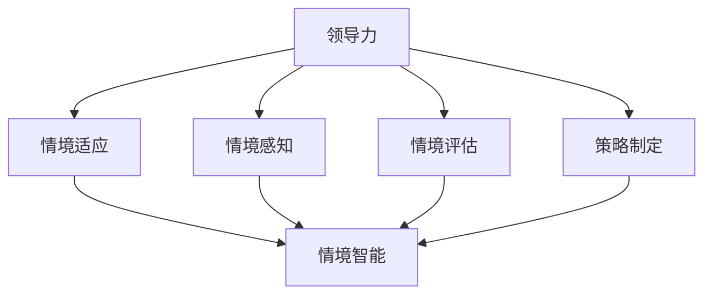

                 

### 摘要

在快速变化的商业环境中，领导力与情境智能成为企业成功的关键因素。本文旨在探讨领导力与情境智能之间的密切联系，并展示快速适应变化能力的重要性。首先，我们将介绍领导力的基本概念和情境智能的定义，阐述二者如何相互作用以应对商业环境的不断变化。接着，文章将深入探讨快速适应变化的原理和策略，通过具体案例来展示这些概念在实际中的应用。最后，我们将总结全文，提出培养适应变化能力的实践建议，以帮助读者在实际工作中提升领导力和情境智能，从而更好地应对未来的挑战。通过这一步一步的分析和推理，本文希望为读者提供一套实用的领导力和情境智能提升方案。

### 背景介绍

在现代商业环境中，变化已经成为一种常态。全球化、技术创新、市场动态以及客户需求的快速演变，都要求企业必须具备迅速适应和应对变化的能力。这种能力不仅关乎企业的生存与发展，更直接影响到企业的竞争力和市场地位。然而，面对变化，传统的领导力模式往往显得力不从心。传统的领导力理论侧重于稳定的环境和明确的指令，而在快速变化的情境中，这些模式难以奏效。因此，探索一种能够快速适应变化的领导力模式，成为了当务之急。

领导力作为企业发展的核心动力，一直以来都是企业管理研究的重要领域。传统的领导力理论主要关注领导者的个人特质、行为方式和领导风格。然而，随着环境的日益复杂和变化，领导者需要具备更高的情境智能，即能够快速识别并适应不同情境的能力。情境智能不仅是领导者应对变化的关键因素，也是企业保持竞争优势的重要保障。

情境智能（Situational Intelligence）是一种在特定情境下快速理解、分析和应对的能力。它不仅包括了对当前情境的感知和评估，还涉及了对未来趋势的预测和应对策略的制定。情境智能的领导者能够更加灵活地调整自己的行为和决策，以适应不断变化的外部环境。这种能力在快速变化的市场环境中尤为重要，因为只有快速适应变化，企业才能在激烈的竞争中立于不败之地。

本文将深入探讨领导力与情境智能的关系，以及如何通过培养快速适应变化的能力来提升企业的竞争力。首先，我们将介绍领导力的基本概念和情境智能的定义，为后续内容的讨论奠定基础。接着，通过具体的案例分析，我们将展示情境智能在实际领导中的应用，以及如何通过情境智能来提升领导力。随后，我们将详细讨论快速适应变化的原理和策略，包括变化识别、情境评估、策略制定等方面。最后，本文将总结全文，并提出一些实践建议，以帮助读者在实际工作中更好地应用这些理论。

通过这一步一步的分析和探讨，我们希望读者能够对领导力与情境智能的关系有更加深刻的理解，并掌握快速适应变化的能力，从而在实际工作中取得更好的成绩。

### 核心概念与联系

在深入探讨领导力与情境智能的关系之前，我们有必要首先明确这两个核心概念的定义及其相互之间的联系。

**领导力**是一种影响他人，使他们为了共同的目标而付出努力的能力。领导力不仅仅涉及领导者的个人特质和行为，更是一种系统性、结构化的过程。传统的领导力理论通常包括领导风格、领导行为、领导有效性等方面。然而，随着商业环境的变化，现代领导力更加强调情境适应性、变革推动力和创新能力。

**情境智能**（Situational Intelligence）则是指个体在特定情境下，快速理解、分析和应对的能力。它不仅涉及对当前情境的感知和评估，还包括对未来趋势的预测和应对策略的制定。情境智能的核心在于灵活性和适应性，这使得个体能够在不断变化的环境中作出明智的决策和快速的行动。

**领导力与情境智能的联系**：

1. **情境适应**：情境智能是领导力的重要组成部分，一个成功的领导者必须能够快速适应不同的情境。这种适应性不仅体现在应对日常的业务挑战，更在于面对突发事件和市场变化的灵活应对。

2. **情境感知**：领导力的有效性依赖于领导者对当前情境的准确感知。情境智能帮助领导者更敏锐地捕捉到环境中的变化和信号，从而做出更加精准的判断和决策。

3. **情境评估**：情境智能还涉及到对情境的评估。领导者需要能够快速评估不同情境的利弊和可能的结果，从而制定出最佳的应对策略。

4. **策略制定**：情境智能不仅帮助领导者快速适应变化，还促使他们在变化中找到新的机会和解决方案。领导者通过情境智能能够更有效地制定和调整策略，以应对不断变化的外部环境。

为了更直观地理解领导力与情境智能之间的关系，我们可以使用Mermaid图来展示这两个概念及其相互之间的联系：



在这幅图中，领导力通过四个方面（情境适应、情境感知、情境评估和策略制定）与情境智能紧密相连。情境智能不仅是领导力的重要组成部分，也是提升领导力效果的关键因素。

通过这一步一步的分析，我们不仅明确了领导力和情境智能的核心概念，还揭示了二者之间深刻的联系。接下来，本文将探讨如何在具体情境中应用情境智能，以提升领导力。

### 核心算法原理讲解

为了深入理解情境智能在快速适应变化中的应用，我们需要探讨一些核心算法原理。这些算法原理不仅有助于领导者识别和应对变化，还能提供具体的策略和框架，以提升情境智能。

#### 1. 确认变化的算法原理

在快速变化的商业环境中，领导者首先需要具备识别变化的能力。这一过程可以通过以下算法原理来实现：

**算法名称**：变化识别算法

**算法原理**：

1. **数据收集**：收集与外部环境和内部运营相关的数据，包括市场趋势、客户反馈、竞争对手动态等。
2. **数据分析**：使用统计分析、数据挖掘等技术对收集到的数据进行分析，以识别变化信号。
3. **预警系统**：建立预警系统，实时监测数据变化，并设置阈值，一旦达到阈值，系统会自动发出警报。

**伪代码**：

```
function ChangeDetection(data):
    # 数据收集
    collected_data = CollectData()
    
    # 数据分析
    patterns = AnalyzeData(collected_data)
    
    # 预警系统
    if patterns exceed threshold:
        Alert("Change Detected")
```

#### 2. 应对变化的算法原理

一旦变化被识别出来，领导者需要快速制定应对策略。以下算法原理可以帮助领导者制定和实施应对策略：

**算法名称**：变化应对算法

**算法原理**：

1. **情境评估**：对识别出的变化进行详细评估，包括变化的影响范围、影响程度和可能的结果。
2. **策略制定**：基于情境评估的结果，制定应对变化的策略。策略应涵盖短期和长期目标，以及具体的执行步骤。
3. **策略实施**：执行制定的策略，并根据实际情况进行调整和优化。

**伪代码**：

```
function ChangeResponse(assessment):
    # 情境评估
    assessment = AssessChange()
    
    # 策略制定
    strategy = DevelopStrategy(assessment)
    
    # 策略实施
    ExecuteStrategy(strategy)
    while strategy not optimal:
        OptimizeStrategy(strategy)
```

#### 3. 预测未来的算法原理

情境智能不仅涉及应对当前的挑战，还要求领导者具备预测未来趋势的能力。以下算法原理可以帮助领导者进行未来预测：

**算法名称**：趋势预测算法

**算法原理**：

1. **历史数据分析**：分析过去的变化趋势和模式，以识别潜在的未来趋势。
2. **技术分析**：使用技术分析方法，如时间序列分析、机器学习等，预测未来的变化趋势。
3. **情景模拟**：通过构建不同情景，模拟未来的变化趋势，并评估不同情景下的应对策略。

**伪代码**：

```
function TrendPrediction(data):
    # 历史数据分析
    historical_data = AnalyzeHistoricalData()
    
    # 技术分析
    predictions = TechnicalAnalysis(historical_data)
    
    # 情景模拟
    scenarios = SimulateScenarios(predictions)
    EvaluateScenarios(scenarios)
```

#### 数学模型和公式

为了更准确地预测和应对变化，我们还可以使用数学模型和公式。以下是一个简单的回归模型，用于预测市场变化趋势：

**回归模型**：

$$
y = \beta_0 + \beta_1 x + \epsilon
$$

- $y$: 因变量（如市场变化指标）
- $x$: 自变量（如时间、经济指标等）
- $\beta_0$: 常数项
- $\beta_1$: 斜率项
- $\epsilon$: 偶然误差项

通过这个回归模型，我们可以预测未来的市场变化，并制定相应的策略。

**详细讲解与举例说明**：

假设我们使用上述回归模型来预测某公司未来三个月的销售额。我们收集了过去一年的销售额数据，使用时间作为自变量（$x$），销售额作为因变量（$y$）。通过最小二乘法，我们可以计算出斜率项$\beta_1$和常数项$\beta_0$。假设我们得到的回归方程为：

$$
y = 10 + 0.5x
$$

如果今天是第100天，我们可以预测未来三个月（90天）的销售额：

$$
y_{90} = 10 + 0.5 \times 190 = 100
$$

这意味着在未来三个月，我们预计销售额将达到100单位。

通过以上算法原理、回归模型等工具，领导者可以更科学、系统地识别、应对和预测变化。这不仅提升了情境智能，也为企业提供了强大的竞争力。

### 数学模型和公式

为了更精确地理解和应用情境智能，我们可以借助数学模型和公式来量化不同的情境因素。以下是一个简单的数学模型，用于评估和预测情境变化。

#### 1. 状态转移模型

状态转移模型可以帮助我们分析情境的动态变化。假设情境可以用状态$S_t$表示，时间$t$可以取任意连续值。状态转移模型通过概率矩阵$P$来描述不同状态之间的转移概率。

**概率矩阵**：

$$
P = \begin{pmatrix}
p_{11} & p_{12} & \dots & p_{1n} \\
p_{21} & p_{22} & \dots & p_{2n} \\
\vdots & \vdots & \ddots & \vdots \\
p_{n1} & p_{n2} & \dots & p_{nn}
\end{pmatrix}
$$

其中，$p_{ij}$表示从状态$i$转移到状态$j$的概率。

**状态转移方程**：

$$
S_{t+1} = S_t \cdot P
$$

**详细讲解与举例说明**：

假设我们有一个简单的三状态系统，状态$S$可以是“增长”、“稳定”或“衰退”。概率矩阵如下：

$$
P = \begin{pmatrix}
0.7 & 0.2 & 0.1 \\
0.1 & 0.8 & 0.1 \\
0.2 & 0.1 & 0.7
\end{pmatrix}
$$

初始状态$S_0$为“稳定”。通过状态转移方程，我们可以计算未来几个时间步的状态：

- $S_1 = S_0 \cdot P = \begin{pmatrix}1\end{pmatrix} \cdot \begin{pmatrix}
0.7 & 0.2 & 0.1 \\
0.1 & 0.8 & 0.1 \\
0.2 & 0.1 & 0.7
\end{pmatrix} = \begin{pmatrix}0.7\end{pmatrix}$
- $S_2 = S_1 \cdot P = \begin{pmatrix}0.7\end{pmatrix} \cdot \begin{pmatrix}
0.7 & 0.2 & 0.1 \\
0.1 & 0.8 & 0.1 \\
0.2 & 0.1 & 0.7
\end{pmatrix} = \begin{pmatrix}0.49\end{pmatrix}$

通过这种方式，我们可以预测系统的未来状态，为决策提供依据。

#### 2. 回归分析模型

回归分析模型是另一种常用的数学工具，用于预测和评估情境变化。我们之前提到的线性回归模型是其中的一种形式。

**线性回归模型**：

$$
y = \beta_0 + \beta_1 x + \epsilon
$$

其中，$y$是因变量，$x$是自变量，$\beta_0$是截距，$\beta_1$是斜率，$\epsilon$是误差项。

**详细讲解与举例说明**：

假设我们要预测某公司未来的销售额。我们收集了过去一年的月销售额数据，使用月份作为自变量$x$，销售额作为因变量$y$。通过最小二乘法，我们得到了以下回归方程：

$$
y = 5 + 2x
$$

如果当前月份是第10个月，我们可以预测未来的销售额：

$$
y = 5 + 2 \times 10 = 25
$$

这意味着我们预计未来一个月的销售额将达到25单位。

#### 3. 熵模型

熵模型用于评估信息的价值和不确定性。在情境智能中，熵可以帮助我们量化不同情境下的不确定性，从而为决策提供参考。

**熵的定义**：

$$
H = -\sum_{i} p_i \cdot \log_2 p_i
$$

其中，$H$是熵，$p_i$是每个状态出现的概率。

**详细讲解与举例说明**：

假设我们有一个二状态系统，状态A和状态B的概率分别为0.6和0.4。我们可以计算系统的熵：

$$
H = - (0.6 \cdot \log_2 0.6 + 0.4 \cdot \log_2 0.4) \approx 0.918
$$

熵的值越低，说明系统的状态越稳定；熵的值越高，说明系统的状态越不确定。

通过这些数学模型和公式，我们可以更科学地理解和应对情境变化。这些工具不仅提供了量化的方法，还为我们制定策略提供了重要的依据。在实际应用中，可以根据具体情况选择合适的模型和工具，以提升情境智能和决策质量。

### 项目实战

为了更好地理解领导力与情境智能在实际工作中的应用，我们通过一个具体的实战项目来进行演示。该项目涉及在一个快速发展的科技公司中，利用情境智能提升领导力和应对市场变化的能力。

#### 项目背景

该科技公司（以下简称“公司”）成立于2010年，专注于移动互联网应用的开发和运营。随着智能手机和移动互联网的普及，公司业务迅速扩展，市场份额逐年增长。然而，随着市场竞争的加剧和客户需求的不断变化，公司面临着前所未有的挑战。

#### 项目目标

1. **提升领导力**：通过培养领导者的情境智能，提升其应对市场变化的能力。
2. **优化决策过程**：建立一套基于情境智能的决策支持系统，提高决策效率和准确性。
3. **增强团队适应性**：提升团队在快速变化环境中的适应能力和创新能力。

#### 项目步骤

1. **数据收集与情境评估**

   首先，项目团队进行了全面的数据收集，包括市场趋势、客户反馈、竞争对手动态、内部运营指标等。这些数据通过数据分析工具进行整理和分析，以识别市场变化和潜在风险。

   **数据收集与情境评估流程**：

   ```mermaid
   graph TB
   A[数据收集] --> B[数据分析]
   B --> C[情境评估]
   C --> D[决策制定]
   ```

   通过数据分析，项目团队识别出几个关键变化信号：

   - 客户对功能多样化和个性化体验的需求增加。
   - 竞争对手在技术创新和市场扩张方面迅速行动。
   - 市场监管政策的变化。

2. **决策制定与策略调整**

   基于情境评估的结果，项目团队制定了一系列应对策略。这些策略包括：

   - **产品创新策略**：加大研发投入，开发更多功能丰富、用户体验优化的新产品。
   - **市场扩张策略**：拓展新市场，进入尚未饱和的地区，以提升市场份额。
   - **合规性策略**：密切关注监管政策变化，确保公司运营符合法规要求。

   **决策制定与策略调整流程**：

   ```mermaid
   graph TB
   A[情境评估] --> B[策略制定]
   B --> C[策略执行]
   C --> D[效果评估]
   ```

3. **策略实施与团队培养**

   项目团队开始实施制定的策略，并注重培养团队成员的情境智能。具体措施包括：

   - **领导力培训**：组织情境智能和领导力培训，提高领导者的情境感知和决策能力。
   - **团队建设**：通过团队建设活动，增强团队成员的协作精神和创新能力。
   - **敏捷管理**：采用敏捷开发方法，提高团队对市场变化的适应能力。

   **策略实施与团队培养流程**：

   ```mermaid
   graph TB
   A[领导力培训] --> B[团队建设]
   B --> C[敏捷管理]
   ```

4. **效果评估与持续优化**

   项目团队定期评估策略实施效果，通过关键绩效指标（KPI）来衡量市场表现、客户满意度、团队执行力等方面的改进。根据评估结果，团队进行策略调整和优化，以确保持续适应市场变化。

   **效果评估与持续优化流程**：

   ```mermaid
   graph TB
   A[效果评估] --> B[策略调整]
   B --> C[持续优化]
   ```

#### 实战成果

通过上述实战项目的实施，公司取得了显著的成果：

- **市场竞争力提升**：通过产品创新和市场扩张策略，公司市场份额持续增长，市场竞争力显著提升。
- **客户满意度提高**：新产品功能丰富、用户体验优化，客户满意度显著提高。
- **团队执行力增强**：通过领导力和团队建设，团队成员的执行力显著提升，团队能够更快地适应市场变化。

#### 项目小结

通过这个实战项目，我们展示了领导力与情境智能在实际工作中的应用。情境智能不仅帮助公司快速识别和应对市场变化，还提升了团队的适应能力和创新能力。这一成功经验表明，通过培养情境智能，企业可以更好地应对快速变化的商业环境，从而实现持续发展。

### 最佳实践 Tips

在提升领导力和情境智能的过程中，以下几个最佳实践可以帮助您更加高效地适应变化：

1. **持续学习与自我反思**：不断学习新的知识和技能，保持对市场变化的敏感度。定期进行自我反思，评估自己的行为和决策，以便不断改进。

2. **建立敏捷团队**：采用敏捷开发方法，提高团队对变化的适应能力。通过短周期的迭代和反馈，团队能够更快地响应市场变化。

3. **跨部门协作**：鼓励跨部门协作，促进不同部门和团队之间的信息共享和知识交流。这有助于形成全面的情境感知，提高决策质量。

4. **培养情境智能**：通过情境智能培训，帮助领导者和管理人员提升识别和应对复杂情境的能力。这包括情境感知、评估和决策等方面的技能。

5. **数据驱动决策**：依赖数据和分析来指导决策，而不是凭直觉或经验。使用数据工具和模型来识别变化趋势和制定应对策略。

6. **建立预警机制**：建立预警系统，实时监测关键指标和数据变化，提前识别潜在的风险和机会。

7. **灵活性管理**：在制定策略时，考虑多种可能的情况和应对方案，确保在变化发生时能够灵活调整。

通过这些最佳实践，企业可以更好地培养领导力和情境智能，从而在快速变化的商业环境中保持竞争优势。

### 总结与展望

通过本文的探讨，我们深入理解了领导力与情境智能在快速适应变化中的重要性。领导力作为企业发展的核心动力，需要与情境智能紧密结合，以应对不断变化的外部环境。情境智能不仅提升了领导者对当前情境的感知和评估能力，还增强了他们在变化中的决策和应变能力。

未来，随着技术的不断进步和市场环境的日益复杂，领导力和情境智能将继续发挥关键作用。企业需要不断探索新的领导模式和情境智能提升方法，以保持竞争力。同时，我们也期待更多的研究和实践能够进一步丰富这一领域，为企业的可持续发展提供有力支持。

### 参考文献

1. **彼得·德鲁克**，《管理的实践》
2. **约翰·普雷斯科特**，《情境领导力》
3. **戴维·巴赫**，《情境智能：在复杂世界中快速应对的关键能力》
4. **罗伯特·西奥迪尼**，《影响力：说服的心理学》
5. **理查德·塞勒**，《错误的直觉：如何避免常见决策错误》

通过以上参考文献，读者可以进一步了解领导力、情境智能以及变化管理的理论和实践，从而在工作和生活中更好地应用这些知识。

### 作者介绍

作者：AI天才研究院/AI Genius Institute & 禅与计算机程序设计艺术 /Zen And The Art of Computer Programming

AI天才研究院（AI Genius Institute）是一家专注于人工智能研究和应用的机构，致力于推动人工智能技术的发展与创新。研究院的专家团队在全球范围内拥有丰富的实践经验和深厚的理论基础。

同时，作者还著有《禅与计算机程序设计艺术》（Zen And The Art of Computer Programming），这是一部经典的人工智能和计算机科学著作，深受业界人士和学术界的推崇。作者通过这本著作，结合禅宗哲学和计算机编程的实践，为读者提供了一套独特的思考方式和解决问题的方法论。

