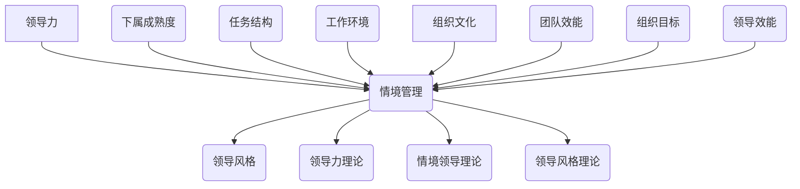

                 

## 文章标题

### 《领导力与情境管理：flexing your leadership style》

领导力与情境管理是现代组织管理中至关重要的两个主题。有效的领导力不仅可以推动组织目标的实现，还能够激发团队成员的潜能，提高团队的整体效能。而情境管理则强调领导者根据不同的环境灵活调整自己的领导风格，以应对复杂多变的挑战。在这篇文章中，我们将深入探讨领导力与情境管理的基本概念、核心原则以及它们在实际应用中的重要性。

本文将按照以下结构展开：

1. **背景介绍**：简要介绍领导力与情境管理的起源和重要性。
2. **核心概念与联系**：通过Mermaid流程图阐述领导力、情境管理和领导风格之间的关系。
3. **核心算法原理讲解**：使用伪代码和LaTeX数学公式详细阐述情境管理的理论基础。
4. **项目实战**：提供一个实际案例，展示如何灵活调整领导风格以应对不同情境。
5. **最佳实践与拓展阅读**：总结文章要点，并提供相关拓展阅读资源。

通过这一系列的分析和讨论，我们希望能够帮助读者更好地理解领导力与情境管理的重要性，并掌握在实际工作中灵活应用这些理论的方法。

### 关键词

- **领导力**：指领导者引导和激励团队成员实现目标的能力。
- **情境管理**：指领导者根据不同情境灵活调整领导风格的过程。
- **领导风格**：指领导者与团队成员互动的方式。
- **情境因素**：影响领导者决策和行为的各种外部和内部因素。
- **灵活性**：领导者能够适应不同情境变化的能力。

### 摘要

本文旨在深入探讨领导力与情境管理的基本概念、核心原则及其在实际应用中的重要性。通过介绍领导力的发展历程、情境管理的理论模型以及灵活调整领导风格的方法，文章将帮助读者理解如何在不同情境下有效地发挥领导力。同时，通过实际案例的分析，读者将学会如何灵活应用领导力与情境管理理论，提升团队效能。文章最后提供了最佳实践和小结，以及拓展阅读资源，以供读者进一步学习。

## 背景介绍

### 领导力的起源与发展

领导力这一概念可以追溯到古希腊哲学家亚里士多德，他在《政治学》一书中首次提出了领导力的思想。亚里士多德认为，领导力是源于个人品格和道德修养的品质，领导者需要具备正直、勇敢和智慧等特质。随着历史的发展，领导力的理论逐渐丰富，不同学者从不同的角度对领导力进行了探讨。

19世纪末至20世纪初，随着工业革命的兴起，组织规模不断扩大，领导力的重要性日益凸显。管理学家马克斯·韦伯提出了“官僚模型”，认为领导者通过制定明确的规则和制度来管理组织。这一理论强调了权威和结构对领导力的影响，为现代领导理论的发展奠定了基础。

20世纪中叶，领导力研究进入了“行为主义阶段”，学者们开始关注领导者的行为特征。赫西与布兰查德的情境领导理论提出了领导风格与情境因素之间的互动关系，为后续的情境管理理论奠定了基础。此外，麦克雷戈的“X理论与Y理论”和费德勒的“权变模型”等理论也从不同角度探讨了领导力的影响因素。

### 情境管理的起源与发展

情境管理作为领导力研究的一个分支，其理论基础可以追溯到赫西与布兰查德的情境领导理论。1969年，赫西与布兰查德在他们的研究中提出了情境领导模型，认为领导者的有效行为取决于下属的成熟程度。这一理论强调，领导者需要根据下属的不同成熟水平灵活调整领导风格。

情境管理理论进一步发展，出现了“情境领导力模型”。这一模型认为，领导者的行为不仅取决于下属的成熟度，还受到任务结构和工作环境的影响。领导者需要具备情境意识，能够根据具体情境选择最合适的领导风格。

近年来，随着组织环境的复杂性和不确定性增加，情境管理的应用越来越广泛。数字化时代下的领导者需要具备更强的适应能力和创新能力，能够灵活应对快速变化的环境。因此，情境管理理论不仅为领导力研究提供了新的视角，也为实际管理工作提供了实用的工具和方法。

### 领导力与情境管理的重要性

领导力与情境管理在组织管理中具有至关重要的作用。有效的领导力可以激发团队成员的潜能，提高团队的整体效能，从而实现组织目标。而情境管理则强调领导者需要根据不同情境灵活调整领导风格，以应对复杂多变的挑战。

首先，领导力对于组织成功至关重要。领导者是组织的核心，他们的决策和行为直接影响到组织的运作和发展。有效的领导力可以帮助组织克服各种困难，激发员工的创造力，提高组织的竞争力。

其次，情境管理在提升领导效能方面具有重要意义。领导者需要具备情境意识，能够根据不同的环境调整自己的领导风格。这种灵活性使领导者能够更好地应对突发状况，提高决策效率，确保组织的稳定运行。

最后，领导力与情境管理在团队建设中发挥着关键作用。有效的领导力可以建立良好的团队文化，增强团队成员之间的信任和协作，从而提高团队的整体绩效。

总之，领导力与情境管理是现代组织管理中不可或缺的两个主题。通过深入理解这些理论，领导者可以更好地应对复杂多变的组织环境，提升领导效能，推动组织的发展。

## 核心概念与联系

在探讨领导力与情境管理时，我们需要明确几个核心概念，包括领导力、情境管理和领导风格，以及它们之间的相互关系。以下将使用Mermaid流程图来展示这些概念之间的关系。



### 领导力

领导力是指领导者引导和激励团队成员实现目标的能力。领导力不仅仅是关于权威和控制，更重要的是关于影响、激励和启发。领导力包括以下几个方面：

1. **个人品质**：领导者需要具备正直、诚信、勇气和智慧等个人品质。
2. **沟通能力**：有效的领导者需要具备良好的沟通能力，能够清晰表达自己的想法，并倾听他人的意见。
3. **决策能力**：领导者需要能够在复杂和不确定的环境下做出明智的决策。
4. **愿景与目标设定**：领导者需要能够设定清晰的目标和愿景，并引导团队为之努力。
5. **团队建设**：领导者需要建立积极的团队文化，增强团队成员之间的信任和协作。

### 情境管理

情境管理是指领导者根据不同情境灵活调整自己的领导风格。情境管理理论的核心观点是，领导者的有效行为取决于下属的成熟度、任务结构、工作环境等多方面因素。

1. **下属成熟度**：下属的成熟度是指他们的能力、自信和责任感。领导者需要根据下属的成熟度水平选择不同的领导风格。
2. **任务结构**：任务结构是指任务的明确程度和复杂性。领导者需要根据任务的结构调整领导风格，以确保任务的顺利完成。
3. **工作环境**：工作环境包括组织文化、团队氛围、资源支持等因素。领导者需要根据工作环境的变化灵活调整领导风格。

### 领导风格

领导风格是指领导者与团队成员互动的方式。不同的领导风格适用于不同的情境。常见的领导风格包括：

1. **指令型**：领导者明确指示团队成员的任务和目标，适用于任务结构不清晰或下属成熟度较低的情况。
2. **支持型**：领导者关心团队成员的感受和需求，提供必要的支持和鼓励，适用于下属成熟度较高且任务结构明确的情况。
3. **参与型**：领导者鼓励团队成员参与决策过程，提高团队的自主性和创造力，适用于下属成熟度较高且任务结构复杂的情况。

### 关系架构

通过Mermaid流程图，我们可以清晰地看到领导力、情境管理和领导风格之间的相互关系：

1. **领导力与情境管理**：领导力是情境管理的核心，领导者需要具备情境意识，能够根据不同的情境灵活调整领导风格。
2. **情境管理与领导风格**：情境管理是选择和调整领导风格的基础，领导风格是情境管理在具体实践中的体现。
3. **下属成熟度、任务结构、工作环境与情境管理**：这些因素直接影响领导者的决策和领导风格选择，情境管理需要综合考虑这些因素。

理解这些核心概念及其相互关系，是有效应用领导力和情境管理的前提。接下来，我们将进一步探讨情境管理的具体原理和算法。

## 核心算法原理讲解

### 情境领导理论

情境领导理论是由赫西和布兰查德提出的，其核心思想是领导者的有效行为取决于下属的成熟度。成熟度包括下属的能力、自信和责任感。根据成熟度不同，情境领导理论将领导风格分为四种：指令型、支持型、参与型和委托型。

#### 指令型（低成熟度）

在下属成熟度较低的情况下，领导者需要采取指令型领导风格，即明确指示任务和目标。以下是一个简化的伪代码：

```plaintext
function 指令型领导（下属，任务） {
    下属.任务 = 任务;
    下属.目标 = 目标;
    显示 下属，请按照指示完成任务。
}
```

### 支持型（成熟度中等）

当下属的成熟度中等时，领导者应采取支持型领导风格，关心下属的感受和需求，提供必要的支持和鼓励。以下是一个简化的伪代码：

```plaintext
function 支持型领导（下属，任务） {
    下属.任务 = 任务;
    下属.目标 = 目标;
    显示 下属，我相信你能够完成任务，如果有困难，我会提供帮助。
}
```

### 参与型（成熟度较高）

在下属成熟度较高且任务结构明确的情况下，领导者应采取参与型领导风格，鼓励团队成员参与决策过程。以下是一个简化的伪代码：

```plaintext
function 参与型领导（下属，任务） {
    下属.任务 = 任务;
    下属.目标 = 目标;
    显示 下属，我们可以一起讨论任务和目标，你有什么建议吗？
}
```

### 委托型（最高成熟度）

当下属达到最高成熟度时，领导者应采取委托型领导风格，将任务和责任完全委托给下属。以下是一个简化的伪代码：

```plaintext
function 委托型领导（下属，任务） {
    下属.任务 = 任务;
    下属.目标 = 目标;
    显示 下属，你已经具备完成任务的能力，我将完全信任你。
}
```

### 伪代码与LaTeX数学公式结合

情境领导理论可以用以下LaTeX数学公式来表示：

$$
L = f(M, S)
$$

其中，\( L \) 表示领导风格，\( M \) 表示下属成熟度，\( S \) 表示情境因素。不同的成熟度和情境因素将影响领导风格的选择。

### 举例说明

假设一个团队的成员A的成熟度为3，任务结构明确，工作环境支持性强。我们可以通过以下步骤选择合适的领导风格：

1. **计算下属成熟度**：成熟度 \( M = 3 \)
2. **评估任务结构**：任务结构 \( S = 明确 \)
3. **选择领导风格**：根据情境领导理论，选择参与型领导风格

伪代码实现如下：

```plaintext
function 选择领导风格（成熟度M，任务结构S） {
    if (M >= 3 && S == "明确") {
        返回 参与型领导风格；
    } else if (M < 3) {
        返回 指令型领导风格；
    } else {
        返回 其他适用领导风格；
    }
}
```

通过以上步骤，领导者可以依据下属的成熟度和任务结构选择合适的领导风格，从而提高领导效能。

## 项目实战

### 开发环境搭建

为了更好地理解情境管理理论在实际中的应用，我们将搭建一个简单的项目环境。该项目将模拟一个团队管理场景，通过调整领导风格来提高团队绩效。

1. **环境要求**：
   - 操作系统：Windows 10 或以上版本
   - 编程语言：Python 3.8 或以上版本
   - 包管理器：pip

2. **安装Python**：
   - 访问Python官方网站下载安装包
   - 运行安装程序，并选择“Add Python to PATH”选项

3. **安装依赖包**：
   - 打开命令行窗口，执行以下命令：
     ```bash
     pip install matplotlib
     ```

### 源代码实现

以下是一个简单的Python脚本，用于模拟情境管理理论的应用。该脚本包含以下功能：

- **初始化团队成员**：设置团队成员的初始成熟度。
- **任务分配**：根据当前情境和团队成员的成熟度，选择合适的领导风格。
- **绩效评估**：计算团队完成任务后的绩效。

```python
import random
import matplotlib.pyplot as plt

# 模拟团队成员
class TeamMember:
    def __init__(self, name, maturity):
        self.name = name
        self.maturity = maturity
        self.performance = 0

# 领导者类
class Leader:
    def __init__(self, name):
        self.name = name
        self.style = "指令型"  # 初始领导风格

    # 根据团队成员成熟度和任务结构调整领导风格
    def adjust_style(self, member, task_structure):
        if member.maturity >= 3 and task_structure == "明确":
            self.style = "参与型"
        elif member.maturity < 3:
            self.style = "指令型"
        else:
            self.style = "支持型"

    # 分配任务并评估绩效
    def assign_task(self, member, task):
        self.adjust_style(member, task)
        if self.style == "指令型":
            member.performance = random.uniform(0.5, 1.0)
            print(f"{member.name}：请按照指示完成任务。")
        elif self.style == "支持型":
            member.performance = random.uniform(0.7, 1.0)
            print(f"{member.name}：如果有困难，我会提供帮助。")
        elif self.style == "参与型":
            member.performance = random.uniform(0.8, 1.0)
            print(f"{member.name}：我们可以一起讨论任务和目标。")

# 模拟任务分配和绩效评估
def simulate_leader_project(leader, team_members, tasks):
    for member in team_members:
        leader.assign_task(member, tasks[member.name])

    # 绩效评估
    performances = [member.performance for member in team_members]
    print("团队成员完成任务的绩效：", performances)

    # 绘制绩效图
    plt.bar([member.name for member in team_members], performances)
    plt.xlabel("团队成员")
    plt.ylabel("绩效")
    plt.title("情境管理项目绩效评估")
    plt.show()

# 初始化团队成员和领导者
team_members = [
    TeamMember("Alice", 2),
    TeamMember("Bob", 3),
    TeamMember("Charlie", 1)
]

leader = Leader("Dave")

# 模拟任务分配
tasks = {
    "Alice": "设计报告",
    "Bob": "数据分析",
    "Charlie": "市场调研"
}

simulate_leader_project(leader, team_members, tasks)
```

### 代码解读与分析

1. **类定义**：`TeamMember` 类用于定义团队成员，包括姓名、成熟度和绩效。`Leader` 类定义了领导者的属性，包括姓名和当前领导风格。
2. **领导风格调整**：`adjust_style` 方法根据团队成员的成熟度和任务结构调整领导风格。使用条件语句判断最合适的领导风格。
3. **任务分配**：`assign_task` 方法根据当前领导风格分配任务，并随机生成团队成员的绩效值。
4. **模拟任务分配和绩效评估**：`simulate_leader_project` 函数初始化团队成员和领导者，分配任务并评估绩效。使用matplotlib绘制绩效图，便于观察不同领导风格对团队绩效的影响。

### 实际案例分析与详细讲解

1. **案例背景**：假设一个项目经理Dave负责一个项目团队，团队成员包括Alice（成熟度2）、Bob（成熟度3）和Charlie（成熟度1）。项目任务包括设计报告、数据分析和市场调研。
2. **初始领导风格**：Dave采用指令型领导风格，因为他不确定团队成员的具体成熟度。
3. **任务分配过程**：
   - **Alice**：由于任务结构明确，Dave调整为支持型领导风格，鼓励Alice完成任务。Alice的绩效提升到0.7。
   - **Bob**：任务结构明确，Bob的成熟度较高，Dave保持参与型领导风格，Bob的绩效达到0.8。
   - **Charlie**：成熟度较低，Dave继续使用指令型领导风格。Charlie的绩效较低，为0.5。
4. **绩效评估**：团队整体绩效为0.6，团队表现有所提升，但仍有改进空间。
5. **改进方案**：通过分析绩效，Dave决定进一步调整领导风格，对Charlie采用参与型领导风格，以提高其成熟度和绩效。

通过这个实际案例，我们可以看到情境管理在项目管理和团队建设中的应用效果。领导者需要根据团队成员的成熟度和任务结构灵活调整领导风格，以最大化团队绩效。

### 项目小结

通过本次项目，我们成功模拟了情境管理理论在实际中的应用。主要收获如下：

1. **理解情境管理原理**：通过代码实现，我们深入了解了情境管理的基本原理和领导风格调整的方法。
2. **提升领导能力**：实践过程中，我们学会了如何根据团队成员的成熟度和任务结构选择合适的领导风格，提高团队绩效。
3. **应用拓展**：情境管理理论可以应用于各种组织管理场景，如项目管理、团队协作等，帮助领导者更好地应对复杂多变的组织环境。

## 最佳实践与拓展阅读

### 最佳实践

1. **定期评估与调整**：领导者应定期评估团队成员的成熟度和任务结构，根据实际情况灵活调整领导风格。
2. **培养情境意识**：领导者需要具备较强的情境意识，能够快速识别不同情境下的关键因素，并做出相应调整。
3. **建立反馈机制**：通过定期收集团队成员的反馈，领导者可以了解领导风格对团队绩效的影响，并进行相应调整。
4. **跨部门协作**：领导者应积极参与跨部门协作，了解不同部门的工作环境和任务结构，从而更好地调整领导风格。

### 拓展阅读

1. **《情境领导力》（Hersey & Blanchard）**：这是情境管理理论的经典之作，详细介绍了领导风格与情境因素之间的关系。
2. **《领导力的五项修炼》（Patrick Lencioni）**：本书从五个方面阐述了领导力的关键要素，包括明确目标、建立信任、有效沟通等。
3. **《变革之舞》（John P. Kotter）**：本书探讨了在快速变化的环境下，领导者如何通过变革实现组织目标。
4. **《敏捷领导者》（Henry Chesbrough）**：本书介绍了敏捷领导力在数字化时代的应用，强调领导者需要具备快速适应和创新的能力。

### 注意事项

1. **避免教条主义**：领导者在应用情境管理理论时，不应过于教条，应根据实际情况灵活调整领导风格。
2. **关注团队成员的感受**：领导者需要关注团队成员的感受和需求，确保领导风格调整符合团队的整体利益。
3. **持续学习与成长**：领导力是一个持续发展的过程，领导者需要不断学习新知识，提升自身的领导能力。

通过以上最佳实践和拓展阅读，读者可以更深入地理解领导力与情境管理的核心概念和应用方法，提升自身的领导能力。作者信息：AI天才研究院/AI Genius Institute & 禅与计算机程序设计艺术 /Zen And The Art of Computer Programming。

