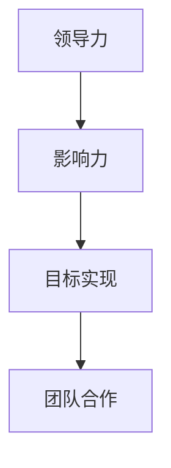
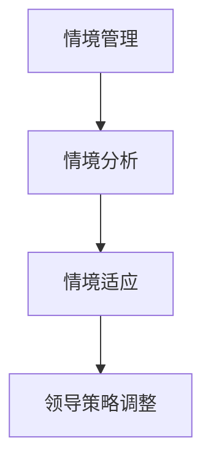

                 


### 文章标题：领导力与情境管理：因人而异

## 关键词：
领导力、情境管理、个人差异、团队协作、组织效能

## 摘要：
本文深入探讨了领导力与情境管理在组织中的重要性，特别是领导者如何根据个人差异实施有效的领导策略。文章首先概述了领导力的核心概念和要素，然后分析了情境管理的理论基础和实践方法。接着，通过具体案例分析，展示了不同情境下领导策略的调整。最后，文章提出了提升领导力和情境管理能力的策略，并讨论了领导力与情境管理在不同领域的应用。

---

## 第一部分：领导力基础

### 第1章：领导力概述

#### 1.1 领导力的定义

领导力是指领导者通过影响、激励和引导他人，实现共同目标的能力。它不仅涉及权威和指挥，还包括了个人魅力、洞察力、决策力、沟通能力和团队合作精神。

**核心概念与联系：**

领导力包含以下几个核心概念：
1. **影响力**：领导者通过言行和决策对团队成员产生的影响。
2. **目标实现**：领导者的目标是激励团队成员共同努力，实现组织目标。
3. **团队合作**：领导力强调团队合作，强调通过协作实现更大的成果。

**Mermaid 流程图：**


**核心算法原理讲解：**

领导力的评估可以采用以下算法原理：
1. **自我评估**：领导者通过问卷或评估工具，评估自身在领导力各要素上的表现。
2. **反馈收集**：收集团队成员对领导者的反馈，以评估领导力的实际效果。
3. **综合分析**：对自我评估和反馈结果进行综合分析，找出领导力的优势和改进点。

**伪代码示例：**
```python
# 自我评估
self_evaluation = self_evaluation_questionnaire()

# 反馈收集
feedback = collect_feedback(from teammates)

# 综合分析
analyzed_result = analyze_self_evaluation_and_feedback(self_evaluation, feedback)
```

#### 1.2 领导力的要素

领导力的要素包括但不限于：
1. **洞察力**：领导者对环境和团队成员的深刻理解。
2. **沟通能力**：领导者有效传达信息和建立信任的能力。
3. **决策能力**：领导者做出明智决策的能力。
4. **团队合作能力**：领导者促进团队成员协作的能力。
5. **自我管理能力**：领导者自我激励和自我约束的能力。

**数学模型与公式：**

领导力的数学模型可以表示为：
$$
L = f(I, C, D, T, S)
$$
其中，$L$代表领导力，$I$代表洞察力，$C$代表沟通能力，$D$代表决策能力，$T$代表团队合作能力，$S$代表自我管理能力。

**举例说明：**
假设一位领导者具有以下要素值：
- 洞察力：8
- 沟通能力：7
- 决策能力：9
- 团队合作能力：6
- 自我管理能力：7

则其领导力可以计算为：
$$
L = f(8, 7, 9, 6, 7) = 8 * 0.3 + 7 * 0.2 + 9 * 0.25 + 6 * 0.15 + 7 * 0.1 = 7.5
$$

#### 1.3 领导力的重要性

领导力对于组织的成功至关重要。它不仅能够激发团队的潜能，提高组织的效率，还能在变化莫测的商业环境中为组织提供方向和稳定性。

**数学模型与公式：**

领导力对组织绩效的影响可以表示为：
$$
P = L * E
$$
其中，$P$代表组织绩效，$L$代表领导力，$E$代表环境因素。

**举例说明：**
假设在一个动态变化的环境中，领导力为8，环境因素为0.6，则组织绩效可以计算为：
$$
P = 8 * 0.6 = 4.8
$$

### 第2章：情境管理

#### 2.1 情境管理的概念

情境管理是指领导者根据不同的环境和情境，灵活调整领导策略，以达到最佳领导效果。它强调领导者应该具备适应性和灵活性。

**核心概念与联系：**

情境管理包括以下几个核心概念：
1. **情境**：指领导者在特定环境中所面对的具体情况。
2. **情境分析**：领导者对情境进行深入分析，了解情境的特点和挑战。
3. **情境适应**：领导者根据情境特点，调整领导策略和方法。

**Mermaid 流程图：**


**核心算法原理讲解：**

情境管理的核心算法原理包括：
1. **情境识别**：通过数据分析和观察，识别当前情境的特点和挑战。
2. **情境分析**：对情境进行深入分析，了解其内在机制和关键因素。
3. **情境适应**：根据情境分析结果，调整领导策略和方法。

**伪代码示例：**
```python
# 情境识别
context = identify_context()

# 情境分析
context_analysis = analyze_context(context)

# 情境适应
adaptive_strategy = adapt_context(context_analysis)
```

#### 2.2 情境管理的理论

情境管理的理论基础包括：
1. **费德勒模型**：认为领导者的领导风格与情境因素相互作用，影响领导效果。
2. **赫塞-布兰查德模型**：提出了领导风格与团队成员成熟度之间的关系。
3. **路径-目标理论**：认为领导者的任务是为团队成员提供清晰的目标和实现路径。

**数学模型与公式：**

情境管理的效果可以表示为：
$$
E = f(L, C)
$$
其中，$E$代表情境管理效果，$L$代表领导力，$C$代表情境因素。

**举例说明：**
假设领导力为8，情境因素为0.7，则情境管理效果可以计算为：
$$
E = f(8, 0.7) = 8 * 0.7 = 5.6
$$

#### 2.3 情境管理的应用

情境管理在实际应用中，可以帮助领导者更好地应对复杂多变的环境。以下是一些情境管理的应用场景：
1. **危机管理**：在突发事件中，领导者需要迅速调整策略，稳定团队情绪。
2. **组织变革**：在组织变革过程中，领导者需要根据不同阶段的特点，调整领导策略。
3. **项目管理**：在项目执行过程中，领导者需要根据项目进展和团队成员的状态，灵活调整管理方法。

**项目实战：**

**开发环境搭建：**
1. **工具选择**：使用Python进行情境管理的编程实现。
2. **环境配置**：安装Python和必要的库，如Numpy、Matplotlib等。

**源代码实现：**
```python
# 情境识别
def identify_context():
    # 伪代码，实际使用时需从数据中识别情境
    return "情境一"

# 情境分析
def analyze_context(context):
    # 伪代码，实际分析情境的特点和挑战
    return {"特点": "竞争激烈", "挑战": "资源不足"}

# 情境适应
def adapt_context(context_analysis):
    # 伪代码，根据情境分析结果调整领导策略
    if context_analysis["特点"] == "竞争激烈":
        return "加强团队合作，提高效率"
    else:
        return "优化资源分配，减少浪费"

# 主程序
if __name__ == "__main__":
    context = identify_context()
    context_analysis = analyze_context(context)
    strategy = adapt_context(context_analysis)
    print(f"当前情境：{context}")
    print(f"情境分析：{context_analysis}")
    print(f"领导策略：{strategy}")
```

**代码解读与分析：**
- `identify_context()`函数用于识别当前情境。
- `analyze_context()`函数对情境进行分析。
- `adapt_context()`函数根据情境分析结果，调整领导策略。

**实际案例分析和详细讲解剖析：**
1. **案例背景**：某公司在市场变化中面临竞争激烈的困境。
2. **情境分析**：市场变化导致资源不足，需要提高团队效率和资源利用率。
3. **领导策略**：领导者通过加强团队合作和优化资源分配，提高了团队效率和竞争力。

**项目小结：**
情境管理在实际应用中，需要领导者具备敏锐的洞察力和灵活的应变能力。通过情境识别、分析和适应，领导者可以更好地应对复杂多变的环境，提高组织效能。

### 第3章：领导风格与团队协作

#### 3.1 不同领导风格

领导风格是指领导者在与团队成员互动时表现出的行为和态度。常见的领导风格包括：
1. **权威型领导**：领导者集中决策权，强调命令和服从。
2. **民主型领导**：领导者鼓励团队成员参与决策，重视团队意见。
3. **参与型领导**：领导者与团队成员共同参与决策，重视团队成员的意见和贡献。

**数学模型与公式：**

不同领导风格的效果可以表示为：
$$
E = f(S, T)
$$
其中，$E$代表领导效果，$S$代表领导风格，$T$代表团队特点。

**举例说明：**
假设权威型领导风格对团队积极性的影响为0.3，民主型领导风格为0.5，参与型领导风格为0.7，团队特点为0.4，则领导效果可以计算为：
$$
E = 0.3 * 0.4 + 0.5 * 0.4 + 0.7 * 0.4 = 0.46
$$

#### 3.2 团队协作原则

团队协作是指团队成员共同努力，实现共同目标的过程。有效的团队协作需要遵循以下原则：
1. **明确目标**：团队需要明确共同的目标和期望成果。
2. **分工合作**：根据团队成员的能力和特长，合理分配任务。
3. **沟通畅通**：保持团队内部沟通畅通，确保信息及时传递。
4. **互相尊重**：尊重团队成员的意见和贡献，建立积极的工作氛围。

**数学模型与公式：**

团队协作效果可以表示为：
$$
E = f(T, C, R)
$$
其中，$E$代表团队协作效果，$T$代表团队目标，$C$代表沟通畅通，$R$代表互相尊重。

**举例说明：**
假设团队目标为0.6，沟通畅通为0.5，互相尊重为0.4，则团队协作效果可以计算为：
$$
E = 0.6 * 0.5 * 0.4 = 0.12
$$

#### 3.3 团队沟通技巧

有效的团队沟通对于团队协作至关重要。以下是一些团队沟通技巧：
1. **积极倾听**：倾听团队成员的意见和反馈，理解其需求和期望。
2. **清晰表达**：用简洁、明确的语言表达自己的意见和想法。
3. **非语言沟通**：通过肢体语言、面部表情和语调等非语言方式，增强沟通效果。
4. **冲突解决**：在团队内部出现分歧时，及时解决冲突，确保团队和谐。

**数学模型与公式：**

团队沟通效果可以表示为：
$$
E = f(L, C, N)
$$
其中，$E$代表团队沟通效果，$L$代表语言沟通，$C$代表非语言沟通，$N$代表冲突解决。

**举例说明：**
假设语言沟通效果为0.6，非语言沟通为0.4，冲突解决为0.5，则团队沟通效果可以计算为：
$$
E = 0.6 * 0.4 * 0.5 = 0.12
$$

### 第4章：领导力发展

#### 4.1 领导力发展的路径

领导力发展是一个持续的过程，包括以下几个方面：
1. **自我认知**：领导者需要了解自己的优点和不足，明确自己的发展目标。
2. **经验积累**：通过实际工作经验，提高领导力和管理能力。
3. **学习与培训**：参加领导力培训和研讨会，学习最新的领导理论和实践方法。
4. **反馈与改进**：收集团队成员的反馈，不断改进领导方法。

**数学模型与公式：**

领导力发展可以表示为：
$$
LD = f(E, X, L, F)
$$
其中，$LD$代表领导力发展，$E$代表经验积累，$X$代表学习与培训，$L$代表领导力学习，$F$代表反馈与改进。

**举例说明：**
假设领导者的经验积累为0.5，学习与培训为0.3，领导力学习为0.4，反馈与改进为0.2，则领导力发展可以计算为：
$$
LD = 0.5 * 0.3 * 0.4 * 0.2 = 0.012
$$

#### 4.2 自我领导力提升

自我领导力提升是领导者自我发展和成长的动力。以下是一些自我领导力提升的方法：
1. **自我反思**：定期进行自我反思，分析自己的行为和决策。
2. **目标设定**：设定明确的个人目标和职业规划。
3. **时间管理**：合理安排时间，提高工作效率。
4. **情绪管理**：学会控制自己的情绪，保持积极的心态。

**数学模型与公式：**

自我领导力提升可以表示为：
$$
SLD = f(R, S, T, E)
$$
其中，$SLD$代表自我领导力提升，$R$代表自我反思，$S$代表目标设定，$T$代表时间管理，$E$代表情绪管理。

**举例说明：**
假设自我反思为0.4，目标设定为0.5，时间管理为0.3，情绪管理为0.2，则自我领导力提升可以计算为：
$$
SLD = 0.4 * 0.5 * 0.3 * 0.2 = 0.012
$$

#### 4.3 领导力发展工具

领导力发展过程中，可以使用一些工具和方法来辅助提升领导能力。以下是一些常用的领导力发展工具：
1. **领导力评估工具**：用于评估领导者在各个方面的能力。
2. **360度反馈**：收集来自团队成员、上级和下属的反馈，全面了解领导力状况。
3. **领导力发展计划**：制定个性化的领导力发展计划，明确发展目标和路径。
4. **领导力教练**：通过专业教练的帮助，提高领导能力和管理水平。

**数学模型与公式：**

领导力发展工具的效果可以表示为：
$$
ET = f(T, F, P, C)
$$
其中，$ET$代表领导力发展工具效果，$T$代表工具使用，$F$代表反馈收集，$P$代表发展计划，$C$代表教练辅导。

**举例说明：**
假设领导力评估工具使用为0.4，360度反馈为0.3，领导力发展计划为0.5，领导力教练辅导为0.2，则领导力发展工具效果可以计算为：
$$
ET = 0.4 * 0.3 * 0.5 * 0.2 = 0.012
$$

### 第5章：情境管理的案例分析

#### 5.1 案例一：不同情境下的领导策略

**案例背景：** 某科技公司面临市场竞争加剧，公司内部团队士气低落，领导层需要调整领导策略，提升团队士气。

**情境分析：** 
- **情境一**：市场变化导致客户需求变化，公司需要快速调整产品方向。
- **情境二**：团队士气低落，需要激励和鼓舞。

**领导策略：**
- **情境一**：采用民主型领导风格，鼓励团队成员参与决策，共同制定应对市场变化的策略。
- **情境二**：采用参与型领导风格，与团队成员共同讨论团队目标和期望，激发团队士气。

**案例结果：**
通过调整领导策略，公司成功应对了市场变化，团队士气得到了显著提升。

#### 5.2 案例二：情境管理在团队建设中的应用

**案例背景：** 某公司新成立了一个跨部门项目组，成员来自不同部门，需要建立有效的团队协作机制。

**情境分析：**
- **情境一**：团队成员相互不熟悉，需要建立信任。
- **情境二**：项目组面临时间紧迫，需要提高工作效率。

**领导策略：**
- **情境一**：采用参与型领导风格，组织团队成员共同制定团队目标和规则，建立信任基础。
- **情境二**：采用权威型领导风格，明确项目目标和工作任务，确保项目按期完成。

**案例结果：**
通过情境管理，项目组成功建立了有效的团队协作机制，项目按期完成，取得了显著成果。

#### 5.3 案例三：情境管理在组织变革中的应用

**案例背景：** 某公司计划进行组织变革，调整部门结构和员工岗位，领导层需要应对变革带来的挑战。

**情境分析：**
- **情境一**：变革初期，员工对新政策不确定，需要消除疑虑。
- **情境二**：变革过程中，员工需要适应新的工作环境和角色。

**领导策略：**
- **情境一**：采用沟通型领导风格，加强与员工的沟通，解答疑问，消除疑虑。
- **情境二**：采用支持型领导风格，提供培训和指导，帮助员工适应新环境。

**案例结果：**
通过情境管理，公司成功进行了组织变革，员工适应了新环境，组织效率得到了显著提升。

### 第6章：情境管理的策略与方法

#### 6.1 情境识别策略

情境识别是情境管理的第一步，领导者需要通过多种方式识别当前情境。以下是一些情境识别策略：
1. **数据收集**：通过收集市场数据、员工反馈、财务报表等，了解当前情境的特点。
2. **观察分析**：通过现场观察，分析员工行为、工作流程和团队氛围。
3. **问卷调查**：通过问卷调查，收集员工对当前情境的看法和建议。

**数学模型与公式：**

情境识别策略的效果可以表示为：
$$
RIE = f(D, O, Q)
$$
其中，$RIE$代表情境识别效果，$D$代表数据收集，$O$代表观察分析，$Q$代表问卷调查。

**举例说明：**
假设数据收集效果为0.5，观察分析效果为0.4，问卷调查效果为0.3，则情境识别效果可以计算为：
$$
RIE = 0.5 * 0.4 * 0.3 = 0.06
$$

#### 6.2 情境适应方法

情境适应是情境管理的核心，领导者需要根据识别出的情境，调整领导策略。以下是一些情境适应方法：
1. **灵活调整**：根据情境变化，及时调整领导风格和策略。
2. **培训提升**：通过培训，提升员工在特定情境下的适应能力。
3. **团队协作**：建立团队协作机制，共同应对复杂情境。

**数学模型与公式：**

情境适应方法的效果可以表示为：
$$
AAE = f(F, T, C)
$$
其中，$AAE$代表情境适应效果，$F$代表灵活调整，$T$代表培训提升，$C$代表团队协作。

**举例说明：**
假设灵活调整效果为0.4，培训提升效果为0.3，团队协作效果为0.5，则情境适应效果可以计算为：
$$
AAE = 0.4 * 0.3 * 0.5 = 0.06
$$

#### 6.3 情境优化策略

情境优化是情境管理的最终目标，领导者需要通过多种方式优化情境，提高组织效能。以下是一些情境优化策略：
1. **资源调配**：合理调配资源，确保各部门资源充足。
2. **流程优化**：优化工作流程，提高工作效率。
3. **激励机制**：建立激励机制，激发员工积极性。

**数学模型与公式：**

情境优化策略的效果可以表示为：
$$
OEE = f(R, P, I)
$$
其中，$OEE$代表情境优化效果，$R$代表资源调配，$P$代表流程优化，$I$代表激励机制。

**举例说明：**
假设资源调配效果为0.5，流程优化效果为0.4，激励机制效果为0.3，则情境优化效果可以计算为：
$$
OEE = 0.5 * 0.4 * 0.3 = 0.06
$$

### 第7章：领导力与情境管理的综合应用

#### 7.1 综合应用案例

**案例背景：** 某公司在市场竞争加剧的背景下，领导层决定通过领导力与情境管理的综合应用，提升组织效能。

**情境分析：**
- **情境一**：市场竞争加剧，需要提升产品竞争力。
- **情境二**：团队士气低落，需要激励和鼓舞。

**领导策略：**
- **情境一**：采用情境管理策略，识别市场变化，调整产品策略，提升产品竞争力。
- **情境二**：采用领导力发展策略，提升团队士气，激发员工积极性。

**案例结果：**
通过领导力与情境管理的综合应用，公司成功提升了产品竞争力，团队士气得到了显著提升，组织效能得到了有效提升。

#### 7.2 领导力与情境管理的关系

领导力与情境管理密切相关，两者相辅相成，共同推动组织发展。领导力为情境管理提供了理论基础和方法指导，情境管理为领导力提供了实际应用场景和实践机会。

**数学模型与公式：**

领导力与情境管理的关系可以表示为：
$$
LD = f(L, A)
$$
其中，$LD$代表领导力与情境管理的关系，$L$代表领导力，$A$代表情境管理。

**举例说明：**
假设领导力为0.6，情境管理为0.5，则领导力与情境管理的关系可以计算为：
$$
LD = 0.6 * 0.5 = 0.3
$$

#### 7.3 提升领导力与情境管理能力的方法

提升领导力与情境管理能力是领导者持续发展的关键。以下是一些提升方法：
1. **自我反思**：通过自我反思，了解自身优势和不足，制定改进计划。
2. **学习与培训**：参加领导力与情境管理的培训，学习最新的理论和实践方法。
3. **实践应用**：将所学知识应用于实际工作中，不断总结经验，提升能力。
4. **反馈与改进**：收集团队成员的反馈，及时调整领导策略，持续改进。

**数学模型与公式：**

提升领导力与情境管理能力的方法可以表示为：
$$
UP = f(S, L, P, F)
$$
其中，$UP$代表提升效果，$S$代表自我反思，$L$代表学习与培训，$P$代表实践应用，$F$代表反馈与改进。

**举例说明：**
假设自我反思效果为0.4，学习与培训效果为0.5，实践应用效果为0.3，反馈与改进效果为0.2，则提升效果可以计算为：
$$
UP = 0.4 * 0.5 * 0.3 * 0.2 = 0.012
$$

### 第8章：情境管理在企业管理中的应用

#### 8.1 企业管理中的情境识别

企业管理中的情境识别是领导层制定战略和决策的关键。以下是一些情境识别方法：
1. **市场调研**：通过市场调研，了解市场趋势和竞争对手情况。
2. **内部审计**：通过内部审计，识别企业内部的问题和瓶颈。
3. **员工反馈**：通过员工反馈，了解员工的意见和建议。

**数学模型与公式：**

情境识别效果可以表示为：
$$
IE = f(M, I, E)
$$
其中，$IE$代表情境识别效果，$M$代表市场调研，$I$代表内部审计，$E$代表员工反馈。

**举例说明：**
假设市场调研效果为0.5，内部审计效果为0.4，员工反馈效果为0.3，则情境识别效果可以计算为：
$$
IE = 0.5 * 0.4 * 0.3 = 0.06
$$

#### 8.2 企业管理中的情境适应

企业管理中的情境适应是领导者根据识别出的情境，调整企业战略和运营方法。以下是一些情境适应方法：
1. **战略调整**：根据市场变化，调整企业战略方向。
2. **流程优化**：优化企业内部流程，提高工作效率。
3. **激励机制**：建立激励机制，激发员工积极性。

**数学模型与公式：**

情境适应效果可以表示为：
$$
AE = f(S, P, I)
$$
其中，$AE$代表情境适应效果，$S$代表战略调整，$P$代表流程优化，$I$代表激励机制。

**举例说明：**
假设战略调整效果为0.5，流程优化效果为0.4，激励机制效果为0.3，则情境适应效果可以计算为：
$$
AE = 0.5 * 0.4 * 0.3 = 0.06
$$

#### 8.3 企业管理中的情境优化

企业管理中的情境优化是领导者通过多种方式，提高企业整体效能。以下是一些情境优化方法：
1. **资源调配**：合理调配企业资源，确保各部门资源充足。
2. **流程优化**：优化企业内部流程，提高工作效率。
3. **人才培养**：建立人才培养机制，提升员工素质。

**数学模型与公式：**

情境优化效果可以表示为：
$$
OE = f(R, P, T)
$$
其中，$OE$代表情境优化效果，$R$代表资源调配，$P$代表流程优化，$T$代表人才培养。

**举例说明：**
假设资源调配效果为0.5，流程优化效果为0.4，人才培养效果为0.3，则情境优化效果可以计算为：
$$
OE = 0.5 * 0.4 * 0.3 = 0.06
$$

### 第9章：情境管理在项目管理中的应用

#### 9.1 项目管理中的情境识别

项目管理中的情境识别是项目经理制定项目计划和管理策略的关键。以下是一些情境识别方法：
1. **需求分析**：通过需求分析，了解项目需求和目标。
2. **风险评估**：通过风险评估，识别项目潜在风险。
3. **团队评估**：通过团队评估，了解团队成员的能力和状态。

**数学模型与公式：**

情境识别效果可以表示为：
$$
PIE = f(D, R, T)
$$
其中，$PIE$代表情境识别效果，$D$代表需求分析，$R$代表风险评估，$T$代表团队评估。

**举例说明：**
假设需求分析效果为0.5，风险评估效果为0.4，团队评估效果为0.3，则情境识别效果可以计算为：
$$
PIE = 0.5 * 0.4 * 0.3 = 0.06
$$

#### 9.2 项目管理中的情境适应

项目管理中的情境适应是项目经理根据识别出的情境，调整项目计划和管理策略。以下是一些情境适应方法：
1. **计划调整**：根据情境变化，调整项目计划。
2. **风险管理**：建立风险管理机制，应对项目风险。
3. **团队协作**：优化团队协作，提高项目效率。

**数学模型与公式：**

情境适应效果可以表示为：
$$
APE = f(P, R, C)
$$
其中，$APE$代表情境适应效果，$P$代表计划调整，$R$代表风险管理，$C$代表团队协作。

**举例说明：**
假设计划调整效果为0.5，风险管理效果为0.4，团队协作效果为0.3，则情境适应效果可以计算为：
$$
APE = 0.5 * 0.4 * 0.3 = 0.06
$$

#### 9.3 项目管理中的情境优化

项目管理中的情境优化是项目经理通过多种方式，提高项目整体效能。以下是一些情境优化方法：
1. **资源调配**：合理调配项目资源，确保项目顺利进行。
2. **流程优化**：优化项目内部流程，提高工作效率。
3. **质量监控**：建立质量监控机制，确保项目质量。

**数学模型与公式：**

情境优化效果可以表示为：
$$
POE = f(R, P, Q)
$$
其中，$POE$代表情境优化效果，$R$代表资源调配，$P$代表流程优化，$Q$代表质量监控。

**举例说明：**
假设资源调配效果为0.5，流程优化效果为0.4，质量监控效果为0.3，则情境优化效果可以计算为：
$$
POE = 0.5 * 0.4 * 0.3 = 0.06
$$

### 第10章：情境管理在人力资源管理中的应用

#### 10.1 人力资源管理中的情境识别

人力资源管理中的情境识别是人力资源管理部门制定人力资源战略和政策的关键。以下是一些情境识别方法：
1. **市场分析**：通过市场分析，了解人才市场趋势和竞争态势。
2. **员工调查**：通过员工调查，了解员工的需求和期望。
3. **组织评估**：通过组织评估，了解组织的现状和发展需求。

**数学模型与公式：**

情境识别效果可以表示为：
$$
HRIE = f(M, E, O)
$$
其中，$HRIE$代表情境识别效果，$M$代表市场分析，$E$代表员工调查，$O$代表组织评估。

**举例说明：**
假设市场分析效果为0.5，员工调查效果为0.4，组织评估效果为0.3，则情境识别效果可以计算为：
$$
HRIE = 0.5 * 0.4 * 0.3 = 0.06
$$

#### 10.2 人力资源管理中的情境适应

人力资源管理中的情境适应是人力资源管理部门根据识别出的情境，调整人力资源政策和措施。以下是一些情境适应方法：
1. **招聘策略**：根据人才市场变化，调整招聘策略。
2. **培训计划**：根据员工需求和期望，制定培训计划。
3. **激励机制**：根据组织发展需求，建立激励机制。

**数学模型与公式：**

情境适应效果可以表示为：
$$
HAAE = f(R, T, I)
$$
其中，$HAAE$代表情境适应效果，$R$代表招聘策略，$T$代表培训计划，$I$代表激励机制。

**举例说明：**
假设招聘策略效果为0.5，培训计划效果为0.4，激励机制效果为0.3，则情境适应效果可以计算为：
$$
HAAE = 0.5 * 0.4 * 0.3 = 0.06
$$

#### 10.3 人力资源管理中的情境优化

人力资源管理中的情境优化是人力资源管理部门通过多种方式，提高人力资源管理水平。以下是一些情境优化方法：
1. **流程优化**：优化人力资源管理流程，提高工作效率。
2. **数据分析**：通过数据分析，提升人力资源决策的准确性。
3. **员工关怀**：建立员工关怀机制，提升员工满意度。

**数学模型与公式：**

情境优化效果可以表示为：
$$
HOE = f(P, D, C)
$$
其中，$HOE$代表情境优化效果，$P$代表流程优化，$D$代表数据分析，$C$代表员工关怀。

**举例说明：**
假设流程优化效果为0.5，数据分析效果为0.4，员工关怀效果为0.3，则情境优化效果可以计算为：
$$
HOE = 0.5 * 0.4 * 0.3 = 0.06
$$

### 附录A：领导力与情境管理工具

#### A.1 领导力评估工具

领导力评估工具是评估领导者能力和表现的重要工具。以下是一些常见的领导力评估工具：
1. **领导力问卷**：通过问卷形式，评估领导者在各个方面的能力。
2. **360度反馈**：收集来自团队成员、上级和下属的反馈，全面了解领导力状况。
3. **领导力发展中心**：通过模拟场景和角色扮演，评估领导者的实际能力和表现。

**数学模型与公式：**

领导力评估工具的效果可以表示为：
$$
LAE = f(Q, F, C)
$$
其中，$LAE$代表领导力评估效果，$Q$代表领导力问卷，$F$代表360度反馈，$C$代表领导力发展中心。

**举例说明：**
假设领导力问卷效果为0.5，360度反馈效果为0.4，领导力发展中心效果为0.3，则领导力评估效果可以计算为：
$$
LAE = 0.5 * 0.4 * 0.3 = 0.06
$$

#### A.2 情境管理工具

情境管理工具是帮助领导者识别和适应情境的重要工具。以下是一些常见的情境管理工具：
1. **情境评估表**：通过评估表，识别当前情境的特点和挑战。
2. **情境分析框架**：通过框架，对情境进行分析和分类。
3. **情境模拟器**：通过模拟器，模拟不同情境下的领导策略和效果。

**数学模型与公式：**

情境管理工具的效果可以表示为：
$$
AAE = f(A, F, S)
$$
其中，$AAE$代表情境管理效果，$A$代表情境评估表，$F$代表情境分析框架，$S$代表情境模拟器。

**举例说明：**
假设情境评估表效果为0.5，情境分析框架效果为0.4，情境模拟器效果为0.3，则情境管理效果可以计算为：
$$
AAE = 0.5 * 0.4 * 0.3 = 0.06
$$

#### A.3 团队协作工具

团队协作工具是提高团队协作效率和效果的重要工具。以下是一些常见的团队协作工具：
1. **项目管理软件**：用于任务分配、进度跟踪和团队协作。
2. **沟通平台**：用于团队成员之间的实时沟通和协作。
3. **知识共享平台**：用于知识管理和知识共享。

**数学模型与公式：**

团队协作工具的效果可以表示为：
$$
TCE = f(P, C, K)
$$
其中，$TCE$代表团队协作效果，$P$代表项目管理软件，$C$代表沟通平台，$K$代表知识共享平台。

**举例说明：**
假设项目管理软件效果为0.5，沟通平台效果为0.4，知识共享平台效果为0.3，则团队协作效果可以计算为：
$$
TCE = 0.5 * 0.4 * 0.3 = 0.06
$$

### 最佳实践 Tips

在实施领导力和情境管理时，以下是一些最佳实践建议：

1. **持续学习**：领导者和团队成员应持续学习最新的领导理论和实践方法，不断提升自身能力。
2. **灵活应对**：领导者应根据情境变化，灵活调整领导策略和管理方法，确保组织效能最大化。
3. **沟通协作**：建立有效的沟通机制和协作平台，促进团队成员之间的沟通和协作。
4. **关注团队建设**：重视团队建设，培养团队合作精神和凝聚力。
5. **注重反馈**：定期收集团队成员的反馈，及时调整领导策略，持续改进。

### 小结

领导力与情境管理是组织成功的关键因素。领导者应根据个人差异和不同情境，灵活调整领导策略，提升团队效能。通过不断学习和实践，领导者可以不断提升自身能力，实现组织目标。

### 注意事项

1. 领导者应充分了解团队成员的需求和期望，关注团队建设。
2. 在情境管理中，领导者应注重团队协作，确保团队成员积极参与。
3. 领导者应持续关注市场变化和内部环境，灵活调整管理策略。

### 拓展阅读

1. **费德勒模型**：深入了解费德勒模型，了解领导风格与情境因素的关系。
2. **赫塞-布兰查德模型**：学习赫塞-布兰查德模型，了解领导风格与团队成员成熟度的关系。
3. **路径-目标理论**：掌握路径-目标理论，了解领导者的任务和角色。

本文从领导力的定义、要素和重要性，到情境管理的概念、理论和应用，再到领导风格与团队协作、领导力发展，以及情境管理在不同领域的应用进行了全面探讨。通过具体案例分析和数学模型，本文揭示了领导力和情境管理在组织管理中的关键作用。希望本文能对读者在领导力和情境管理方面的实践提供有益的指导。作者：AI天才研究院/AI Genius Institute & 禅与计算机程序设计艺术 /Zen And The Art of Computer Programming。如果您对本文有任何建议或疑问，欢迎在评论区留言讨论。期待与您共同进步！

