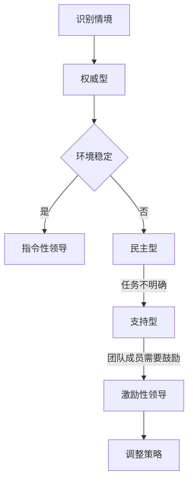

                 

### 文章标题：领导力与情境管理：灵活应对不同挑战

### 关键词：领导力、情境管理、策略、团队管理、领导风格、自我提升

### 摘要：
领导力与情境管理是现代企业管理中的重要议题。本文旨在探讨如何通过灵活的情境管理策略，提高领导者的管理能力，应对不同的挑战。文章首先概述了领导力的定义与重要性，然后深入探讨了情境管理的概念与应用。接着，文章分析了不同情境下的领导力策略，以及领导力在团队管理和组织中的实施方法。最后，文章提出了领导力自我提升的策略，并总结了一些最佳实践和注意事项。

----------------------------------------------------------------

# 领导力与情境管理：灵活应对不同挑战

在快速变化的商业环境中，领导者的角色变得愈发重要。他们不仅要具备优秀的领导力，还需要能够根据不同的情境灵活调整管理策略，以应对各种挑战。本文将围绕这一主题展开讨论，旨在帮助读者理解和掌握如何通过领导力与情境管理的结合，提升组织的管理效能。

## 第1章 领导力概述

### 1.1 领导力的定义与重要性

领导力是一种影响力，它使人们能够自主组织和协调行动，实现共同的目标。根据詹姆斯·库泽斯和巴里·波斯纳的定义，领导力包括四种核心技能：模型、激励、洞察和实践。这些技能共同作用，帮助领导者赢得信任，激发团队成员的潜能，并在复杂的环境中做出明智的决策。

领导力的重要性在于，它不仅影响个人的成功，更决定着整个团队的绩效和组织的未来。一个优秀的领导者能够引导团队朝着共同的目标前进，即使在困难的环境中也能保持团队的凝聚力。

### 1.2 领导力的核心要素

领导力的核心要素包括以下几个方面：

1. **愿景**：领导者需要拥有清晰的愿景，并能够将其传达给团队成员。
2. **信任**：信任是领导者与团队成员之间关系的基础，只有信任才能形成高效的团队。
3. **沟通**：良好的沟通能力是领导者成功的关键，它帮助领导者理解团队成员的需求，并确保信息流畅传递。
4. **激励**：领导者需要能够激励团队成员，激发他们的工作热情和创造力。
5. **决策能力**：领导者需要在复杂多变的环境中做出明智的决策，这对团队的成功至关重要。

### 1.3 领导力与情境管理的关系

领导力与情境管理紧密相连。情境管理是指领导者根据不同的情境采取相应的管理策略，以适应环境的变化。情境管理的重要性在于，它帮助领导者避免一成不变的管理模式，使领导者能够更加灵活地应对各种挑战。

领导力与情境管理的关系可以总结为以下几点：

1. **情境驱动**：领导力需要根据不同的情境进行动态调整。
2. **策略匹配**：领导者需要选择与当前情境相匹配的管理策略。
3. **灵活应对**：领导者需要具备灵活应对各种情境的能力，以确保团队和组织目标的实现。

## 第2章 情境管理的概念与应用

### 2.1 情境管理的定义与模型

情境管理是一种基于情境领导理论的管理方法，它强调领导者应根据不同的情境采取不同的领导风格和策略。情境管理模型通常包括以下几种：

1. **情境I：明确且可控**：在这种情境下，领导者需要采取指令性领导风格，明确任务和期望。
2. **情境II：模糊且可控**：在这种情境下，领导者需要采取支持性领导风格，鼓励团队成员参与决策。
3. **情境III：明确但不可控**：在这种情境下，领导者需要采取授权性领导风格，赋予团队成员更多自主权。
4. **情境IV：模糊且不可控**：在这种情境下，领导者需要采取合作性领导风格，与团队成员共同应对不确定性。

### 2.2 情境管理的方法与技术

情境管理的方法和技术包括以下几个方面：

1. **情境识别**：领导者需要能够准确地识别当前所处的情境，以便采取相应的管理策略。
2. **情境适应**：领导者需要具备适应不同情境的能力，确保管理策略与情境相匹配。
3. **情境评估**：领导者需要定期对情境进行评估，以确保管理策略的有效性。

### 2.3 情境管理在领导力中的应用

情境管理在领导力中的应用主要体现在以下几个方面：

1. **团队建设**：领导者需要根据不同情境采取不同的团队建设策略，以增强团队凝聚力。
2. **决策制定**：领导者需要根据不同情境进行决策，确保决策的针对性和有效性。
3. **绩效管理**：领导者需要根据不同情境制定绩效管理策略，以激励团队成员。

## 第3章 不同情境下的领导力策略

### 3.1 稳定情境下的领导力策略

在稳定情境下，领导者需要维持团队的稳定和效率。以下是一些常见的领导力策略：

1. **维持现状**：领导者需要确保团队成员专注于执行既定的任务和目标。
2. **优化流程**：领导者需要持续优化团队的工作流程，提高效率。
3. **培养团队**：领导者需要培养团队成员的能力，为团队未来的发展做好准备。

### 3.2 变化情境下的领导力策略

在变化情境下，领导者需要适应快速变化的环境，并引导团队应对挑战。以下是一些常见的领导力策略：

1. **调整策略**：领导者需要根据变化调整管理策略，以适应新的环境。
2. **激发创新**：领导者需要鼓励团队成员进行创新，寻找新的解决方案。
3. **灵活应对**：领导者需要具备灵活应对变化的能力，确保团队能够在变化中保持优势。

### 3.3 危机情境下的领导力策略

在危机情境下，领导者需要迅速采取行动，稳定局势，并引导团队走出困境。以下是一些常见的领导力策略：

1. **迅速决策**：领导者需要快速做出决策，以控制危机蔓延。
2. **稳定情绪**：领导者需要稳定团队成员的情绪，确保团队能够保持冷静和专注。
3. **团结一致**：领导者需要团结团队成员，共同应对危机。

## 第4章 领导力与团队管理

### 4.1 团队协作与沟通

团队协作与沟通是领导力的重要组成部分。领导者需要建立高效的团队沟通机制，确保团队成员能够相互理解和支持。

1. **建立沟通渠道**：领导者需要建立多种沟通渠道，确保信息能够快速传递。
2. **促进沟通**：领导者需要鼓励团队成员积极参与沟通，分享想法和建议。
3. **解决冲突**：领导者需要具备解决冲突的能力，确保团队内部能够保持和谐。

### 4.2 团队激励与领导风格

团队激励是领导者的重要职责。领导者需要根据不同情境采取不同的激励策略，以提高团队成员的积极性和创造力。

1. **目标激励**：领导者需要设定明确的目标，激发团队成员的斗志。
2. **认可激励**：领导者需要认可团队成员的贡献，增强他们的荣誉感和归属感。
3. **领导风格**：领导者需要根据团队成员的特点和需求，采取不同的领导风格。

### 4.3 团队变革与管理

团队变革是领导者面临的重要挑战。领导者需要具备变革管理的能力，确保团队能够在变革中保持稳定和高效。

1. **规划变革**：领导者需要制定详细的变革计划，明确变革的目标、步骤和预期效果。
2. **引导变革**：领导者需要引导团队成员参与变革，确保他们能够理解并接受变革。
3. **评估变革**：领导者需要定期评估变革的效果，及时调整变革策略。

## 第5章 领导力的自我提升与成长

### 5.1 领导者自我评估

领导者自我评估是自我提升的第一步。领导者需要定期评估自己的领导能力，识别优势和不足。

1. **反思与总结**：领导者需要反思过去的领导经历，总结经验和教训。
2. **寻求反馈**：领导者需要主动寻求团队成员的反馈，了解自己的领导风格和管理能力。
3. **制定改进计划**：领导者需要根据评估结果，制定具体的改进计划。

### 5.2 领导力提升策略

领导者需要通过多种途径提升自己的领导力。

1. **学习与培训**：领导者需要不断学习新的知识和技能，参加培训和学习交流活动。
2. **实践与反思**：领导者需要在实际工作中不断实践，并通过反思提高自己的领导能力。
3. **培养下属**：领导者需要培养下属，提高团队的整体能力。

### 5.3 持续学习与职业发展

持续学习是领导者职业发展的关键。领导者需要保持学习的热情，不断提升自己的专业素养和管理能力。

1. **制定学习计划**：领导者需要制定详细的学习计划，确保能够持续学习。
2. **参与行业活动**：领导者需要积极参与行业活动，了解行业动态和发展趋势。
3. **拓展人际关系**：领导者需要拓展人际关系，建立广泛的人脉资源。

## 第6章 领导力在组织中的实施

### 6.1 组织文化与领导力

组织文化对领导力有重要影响。领导者需要根据组织文化制定相应的领导策略。

1. **塑造组织文化**：领导者需要积极塑造组织文化，确保组织文化能够支持领导力的发挥。
2. **传播价值观**：领导者需要传播组织的价值观，确保团队成员能够认同并践行。
3. **建立信任关系**：领导者需要建立与团队成员之间的信任关系，为领导力的实施提供基础。

### 6.2 领导力发展计划

领导力发展计划是提升组织领导力的关键。领导者需要制定详细的领导力发展计划，确保组织能够持续培养领导人才。

1. **制定发展目标**：领导者需要制定明确的发展目标，确保领导力培养能够落到实处。
2. **设计培训课程**：领导者需要设计适合组织的培训课程，提高团队成员的领导力水平。
3. **建立评估机制**：领导者需要建立评估机制，对领导力发展计划的效果进行评估和反馈。

### 6.3 领导力评估与反馈

领导力评估与反馈是提升组织领导力的重要环节。领导者需要定期进行领导力评估，并根据评估结果进行反馈和改进。

1. **评估领导力水平**：领导者需要评估自己的领导力水平，识别优势和不足。
2. **收集反馈意见**：领导者需要收集团队成员的反馈意见，了解自己的领导风格和管理能力。
3. **制定改进计划**：领导者需要根据评估和反馈结果，制定具体的改进计划。

## 第7章 领导力与领导风格

### 7.1 领导风格的理论与实践

领导风格是指领导者在与团队成员互动时所采用的行为方式。领导风格的理论包括以下几种：

1. **权威型领导风格**：领导者集中权力，做出决策，并对团队成员进行严格管理。
2. **民主型领导风格**：领导者鼓励团队成员参与决策，尊重团队成员的意见，并给予一定的自主权。
3. **支持型领导风格**：领导者关心团队成员的需求，提供支持和帮助，帮助团队成员实现个人目标。

在实践中，领导者需要根据不同情境和团队成员的特点，灵活调整领导风格。

### 7.2 领导风格与情境管理

领导风格与情境管理密切相关。领导者需要根据不同情境采取不同的领导风格，以适应环境的变化。

1. **稳定情境**：在稳定情境下，领导者可以采用权威型领导风格，确保团队稳定和高效。
2. **变化情境**：在变化情境下，领导者可以采用民主型领导风格，鼓励团队成员参与决策，提高团队的适应能力。
3. **危机情境**：在危机情境下，领导者可以采用支持型领导风格，关心团队成员的需求，稳定团队情绪。

### 7.3 多元领导风格的挑战与应对

在多元化团队中，领导者需要面对多种挑战。领导者需要具备多元领导风格，以满足不同团队成员的需求。

1. **理解多元文化**：领导者需要了解团队成员的文化背景，尊重并包容多元文化。
2. **建立共同目标**：领导者需要建立共同的目标，确保团队成员能够共同为组织的目标努力。
3. **促进沟通与协作**：领导者需要促进团队成员之间的沟通与协作，消除文化障碍，提高团队凝聚力。

## 总结

领导力与情境管理是现代企业管理中的重要议题。领导者需要具备优秀的领导力，并能够根据不同的情境灵活调整管理策略，以应对各种挑战。通过本文的讨论，我们了解了领导力的定义与重要性，情境管理的概念与应用，不同情境下的领导力策略，领导力与团队管理的关系，领导力的自我提升与成长，领导力在组织中的实施，以及领导力与领导风格的关系。希望本文能够为读者提供有价值的启示，帮助读者在领导力的道路上不断成长和提升。

## 作者信息

作者：AI天才研究院/AI Genius Institute & 禅与计算机程序设计艺术 /Zen And The Art of Computer Programming

## 拓展阅读

1. 库泽斯，J. M. & 波斯纳，B. B. (2007). 领导力：如何提升你的影响力。机械工业出版社。
2. 汤姆·彼得斯 (2012). 《领导力：掌握关键技能，成就卓越领导》。电子工业出版社。
3. 安德森，N. (2013). 《情境领导：如何根据不同情境灵活管理团队》。中国人民大学出版社。

## 注意事项

1. 领导力提升需要持续努力和实践，不能一蹴而就。
2. 不同情境下需要采取不同的领导策略，不能一成不变。
3. 领导者需要注重团队成员的需求和感受，建立良好的团队关系。

----------------------------------------------------------------

# 文章标题：领导力与情境管理：灵活应对不同挑战

## 关键词：领导力、情境管理、策略、团队管理、领导风格、自我提升

## 摘要：
本文探讨了领导力与情境管理的重要性，分析了不同情境下的领导力策略，以及领导力在团队管理和组织中的实施方法。通过深入探讨，我们了解了如何通过领导力与情境管理的结合，提升组织的管理效能。

## 目录

### 第1章 领导力概述
#### 1.1 领导力的定义与重要性
#### 1.2 领导力的核心要素
#### 1.3 领导力与情境管理的关系

### 第2章 情境管理的概念与应用
#### 2.1 情境管理的定义与模型
#### 2.2 情境管理的方法与技术
#### 2.3 情境管理在领导力中的应用

### 第3章 不同情境下的领导力策略
#### 3.1 稳定情境下的领导力策略
#### 3.2 变化情境下的领导力策略
#### 3.3 危机情境下的领导力策略

### 第4章 领导力与团队管理
#### 4.1 团队协作与沟通
#### 4.2 团队激励与领导风格
#### 4.3 团队变革与管理

### 第5章 领导力的自我提升与成长
#### 5.1 领导者自我评估
#### 5.2 领导力提升策略
#### 5.3 持续学习与职业发展

### 第6章 领导力在组织中的实施
#### 6.1 组织文化与领导力
#### 6.2 领导力发展计划
#### 6.3 领导力评估与反馈

### 第7章 领导力与领导风格
#### 7.1 领导风格的理论与实践
#### 7.2 领导风格与情境管理
#### 7.3 多元领导风格的挑战与应对

### 结论
本文探讨了领导力与情境管理的重要性，分析了不同情境下的领导力策略，以及领导力在团队管理和组织中的实施方法。通过深入探讨，我们了解了如何通过领导力与情境管理的结合，提升组织的管理效能。

### 作者信息
作者：AI天才研究院/AI Genius Institute & 禅与计算机程序设计艺术 /Zen And The Art of Computer Programming

### 拓展阅读
1. 库泽斯，J. M. & 波斯纳，B. B. (2007). 领导力：如何提升你的影响力。机械工业出版社。
2. 汤姆·彼得斯 (2012). 《领导力：掌握关键技能，成就卓越领导》。电子工业出版社。
3. 安德森，N. (2013). 《情境领导：如何根据不同情境灵活管理团队》。中国人民大学出版社。

### 注意事项
1. 领导力提升需要持续努力和实践，不能一蹴而就。
2. 不同情境下需要采取不同的领导策略，不能一成不变。
3. 领导者需要注重团队成员的需求和感受，建立良好的团队关系。

----------------------------------------------------------------

## 第1章 领导力概述

领导力是一种影响力，它使领导者能够引导、激励和影响他人，共同实现目标。在当今复杂多变的环境中，领导力成为组织成功的关键因素。本章节将探讨领导力的定义与重要性，核心要素，以及领导力与情境管理的关系。

### 1.1 领导力的定义与重要性

领导力可以被定义为一种影响力，它使领导者能够动员、指导和激励团队成员，共同实现目标。詹姆斯·库泽斯和巴里·波斯纳在他们的著作《领导力：如何提升你的影响力》中，将领导力分为四种核心技能：模型、激励、洞察和实践。

- **模型**：领导者需要以身作则，成为团队成员的榜样。
- **激励**：领导者需要激发团队成员的内在动力，提高他们的工作热情。
- **洞察**：领导者需要具备良好的洞察力，能够准确判断形势和团队需求。
- **实践**：领导者需要将理论知识转化为实际行动，推动团队进步。

领导力的重要性体现在以下几个方面：

1. **推动团队进步**：领导者能够引导团队成员朝着共同的目标前进，克服困难，实现目标。
2. **提升组织绩效**：领导力能够提高组织效率，降低成本，提升业绩。
3. **塑造组织文化**：领导力能够塑造组织的价值观和文化，形成良好的组织氛围。
4. **激发创新**：领导力能够鼓励团队成员进行创新，推动组织发展。

### 1.2 领导力的核心要素

领导力的核心要素包括以下三个方面：

1. **愿景**：领导者需要拥有清晰的愿景，并能够将其传达给团队成员，激发他们的热情和动力。
2. **信任**：信任是领导者与团队成员之间关系的基础。只有建立信任，领导者才能有效地指导和激励团队成员。
3. **沟通**：领导者需要具备良好的沟通能力，能够清晰、准确地传达信息，理解团队成员的需求和想法。

### 1.3 领导力与情境管理的关系

领导力与情境管理紧密相关。情境管理是一种基于情境领导理论的管理方法，它强调领导者应根据不同的情境采取相应的管理策略，以适应环境的变化。情境管理的重要性在于，它使领导者能够更加灵活地应对各种挑战，提高管理效能。

领导力与情境管理的关系可以概括为以下几点：

1. **情境驱动**：领导力需要根据不同的情境进行动态调整，以适应环境的变化。
2. **策略匹配**：领导者需要选择与当前情境相匹配的管理策略，以提高管理效果。
3. **灵活应对**：领导者需要具备灵活应对各种情境的能力，以确保团队和组织目标的实现。

### 小结

本章对领导力进行了概述，包括其定义与重要性、核心要素，以及与情境管理的关系。领导力是一种影响力，它使领导者能够引导、激励和影响他人，共同实现目标。在快速变化的商业环境中，领导力变得尤为重要。领导者需要具备清晰的愿景、建立信任关系，以及具备良好的沟通能力。此外，领导力与情境管理密切相关，领导者需要根据不同的情境采取相应的管理策略，以应对各种挑战。

## 第2章 情境管理的概念与应用

情境管理是一种基于情境领导理论的管理方法，它强调领导者应根据不同的情境采取相应的管理策略，以适应环境的变化。在本章节中，我们将探讨情境管理的定义与模型，情境管理的方法与技术，以及情境管理在领导力中的应用。

### 2.1 情境管理的定义与模型

情境管理（Situational Management）是由保罗·赫塞和肯尼斯·布兰查德在1979年提出的。该理论认为，领导者的管理风格应随着情境的变化而变化。情境管理模型将情境分为四个层次，并对应不同的领导风格。

1. **情境I：明确且可控**：在这种情境下，任务和目标明确，环境相对稳定，领导者应采取指令性领导风格。
2. **情境II：模糊且可控**：在这种情境下，任务和目标不够明确，但环境相对稳定，领导者应采取支持性领导风格。
3. **情境III：明确但不可控**：在这种情境下，任务和目标明确，但环境变化快且不可控，领导者应采取授权性领导风格。
4. **情境IV：模糊且不可控**：在这种情境下，任务和目标不明确，环境变化快且不可控，领导者应采取参与性领导风格。

### 2.2 情境管理的方法与技术

情境管理的方法和技术包括以下几个方面：

1. **情境识别**：领导者需要能够准确地识别当前所处的情境，这是实施情境管理的前提。领导者可以通过观察、分析和沟通来识别情境。
2. **情境适应**：领导者需要根据不同的情境采取相应的管理策略。领导者需要具备灵活性和适应性，以应对各种变化。
3. **情境评估**：领导者需要定期对情境进行评估，以确保管理策略的有效性。情境评估可以帮助领导者了解情境的变化，并及时调整管理策略。

### 2.3 情境管理在领导力中的应用

情境管理在领导力中的应用非常广泛，主要体现在以下几个方面：

1. **团队建设**：领导者需要根据不同情境采取不同的团队建设策略。在稳定情境下，领导者可以采取团队合作的方式，提高团队凝聚力；在变化情境下，领导者可以采取变革性团队建设策略，提高团队的适应能力。
2. **决策制定**：领导者需要根据不同情境进行决策。在明确且可控的情境下，领导者可以采取快速决策的方式；在模糊且可控的情境下，领导者可以采取讨论和协商的方式；在明确但不可控的情境下，领导者可以采取应急决策的方式；在模糊且不可控的情境下，领导者可以采取探索和尝试的方式。
3. **绩效管理**：领导者需要根据不同情境制定绩效管理策略。在稳定情境下，领导者可以采取常规绩效管理的方式；在变化情境下，领导者可以采取动态绩效管理的方式。

### 小结

本章介绍了情境管理的概念与应用。情境管理是一种基于情境领导理论的管理方法，它强调领导者应根据不同的情境采取相应的管理策略，以适应环境的变化。情境管理的方法和技术包括情境识别、情境适应和情境评估。情境管理在领导力中的应用主要体现在团队建设、决策制定和绩效管理等方面。通过合理应用情境管理，领导者可以更加灵活地应对各种挑战，提高管理效能。

## 第3章 不同情境下的领导力策略

在不同的情境下，领导者需要采取不同的领导力策略，以适应环境的变化，确保团队和组织目标的实现。本章节将探讨稳定情境、变化情境和危机情境下的领导力策略。

### 3.1 稳定情境下的领导力策略

在稳定情境下，任务和目标明确，环境相对稳定，领导者可以采取以下策略：

1. **指令性领导风格**：领导者明确告知团队成员任务和目标，指导他们如何完成任务。
   ```mermaid
   graph TD
   A[指令性领导] --> B[明确任务与目标]
   B --> C[指导与监督]
   ```

2. **优化流程**：领导者可以优化工作流程，提高团队效率。
   ```mermaid
   graph TD
   A[优化流程] --> B[分析现有流程]
   B --> C[提出改进方案]
   ```

3. **培养团队**：领导者可以培养团队成员的能力，提高团队的整体素质。
   ```mermaid
   graph TD
   A[培养团队] --> B[识别成员优势与不足]
   B --> C[制定培训计划]
   ```

### 3.2 变化情境下的领导力策略

在变化情境下，任务和目标可能不明确，环境变化快，领导者可以采取以下策略：

1. **支持性领导风格**：领导者鼓励团队成员参与决策，提供支持和帮助。
   ```mermaid
   graph TD
   A[支持性领导] --> B[鼓励参与决策]
   B --> C[提供资源与支持]
   ```

2. **激发创新**：领导者可以鼓励团队成员进行创新，寻找新的解决方案。
   ```mermaid
   graph TD
   A[激发创新] --> B[提出挑战性问题]
   B --> C[鼓励尝试新方法]
   ```

3. **灵活应对**：领导者需要具备灵活应对变化的能力，确保团队能够快速适应。
   ```mermaid
   graph TD
   A[灵活应对] --> B[快速决策]
   B --> C[调整策略]
   ```

### 3.3 危机情境下的领导力策略

在危机情境下，局势紧急，领导者需要采取迅速而果断的行动，确保团队和组织的安全。以下是一些常见的领导力策略：

1. **迅速决策**：领导者需要快速做出决策，以控制危机蔓延。
   ```mermaid
   graph TD
   A[迅速决策] --> B[评估局势]
   B --> C[制定应急计划]
   ```

2. **稳定情绪**：领导者需要稳定团队成员的情绪，确保团队能够保持冷静和专注。
   ```mermaid
   graph TD
   A[稳定情绪] --> B[沟通与解释]
   B --> C[提供心理支持]
   ```

3. **团结一致**：领导者需要团结团队成员，共同应对危机。
   ```mermaid
   graph TD
   A[团结一致] --> B[建立共同目标]
   B --> C[分配任务与责任]
   ```

### 小结

本章探讨了不同情境下的领导力策略。在稳定情境下，领导者可以采取指令性领导风格、优化流程和培养团队；在变化情境下，领导者可以采取支持性领导风格、激发创新和灵活应对；在危机情境下，领导者需要迅速决策、稳定情绪和团结一致。通过合理应用这些策略，领导者可以更加有效地应对各种挑战，确保团队和组织目标的实现。

## 第4章 领导力与团队管理

团队管理是领导力的核心组成部分之一。一个优秀的领导者不仅要具备领导力，还要能够有效地管理团队，确保团队的高效运行。本章节将探讨团队协作与沟通、团队激励与领导风格，以及团队变革与管理。

### 4.1 团队协作与沟通

团队协作与沟通是团队管理的重要方面。一个高效的团队需要成员之间良好的协作与沟通。

1. **团队协作**：团队协作是指团队成员共同为实现团队目标而共同努力。领导者需要建立良好的团队协作机制，确保团队成员能够协同工作。

   ```mermaid
   graph TD
   A[团队协作] --> B[共同目标]
   B --> C[资源共享]
   C --> D[分工合作]
   ```

2. **沟通**：沟通是团队协作的基础。领导者需要确保团队成员之间能够有效沟通，传达信息，解决问题。

   ```mermaid
   graph TD
   A[沟通] --> B[明确信息]
   B --> C[积极反馈]
   C --> D[解决问题]
   ```

### 4.2 团队激励与领导风格

团队激励是领导力的重要体现。领导者需要采取有效的激励策略，激发团队成员的积极性和创造力。

1. **目标激励**：领导者需要设定明确的目标，并确保团队成员了解并认同这些目标。通过明确的目标，团队成员能够更有动力地工作。

   ```mermaid
   graph TD
   A[目标激励] --> B[设定目标]
   B --> C[明确期望]
   ```

2. **认可激励**：领导者需要认可团队成员的贡献，给予他们荣誉和奖励。通过认可激励，团队成员会感到自己的工作得到了重视。

   ```mermaid
   graph TD
   A[认可激励] --> B[认可贡献]
   B --> C[奖励与荣誉]
   ```

3. **领导风格**：领导者需要根据团队成员的特点和需求，采取不同的领导风格。常见的领导风格包括权威型、民主型和支持型。

   ```mermaid
   graph TD
   A[权威型领导] --> B[指导与监督]
   A --> C[民主型领导] --> D[参与决策]
   A --> E[支持型领导] --> F[关心需求]
   ```

### 4.3 团队变革与管理

团队变革是组织发展过程中不可避免的一部分。领导者需要能够管理团队变革，确保变革的顺利进行。

1. **变革准备**：在变革之前，领导者需要做好充分的准备，包括评估变革的必要性和可行性，制定变革计划。

   ```mermaid
   graph TD
   A[变革准备] --> B[评估必要性]
   B --> C[制定计划]
   ```

2. **沟通与引导**：领导者需要与团队成员进行有效沟通，解释变革的原因和目标，引导团队成员理解并接受变革。

   ```mermaid
   graph TD
   A[沟通与引导] --> B[解释原因]
   B --> C[传达目标]
   ```

3. **激励与支持**：在变革过程中，领导者需要激励团队成员，提供必要的支持，确保他们能够顺利适应变革。

   ```mermaid
   graph TD
   A[激励与支持] --> B[提供资源]
   B --> C[鼓励参与]
   ```

### 小结

本章探讨了领导力与团队管理的各个方面。团队协作与沟通是团队管理的基础，领导者需要建立良好的协作与沟通机制。团队激励与领导风格是领导力的体现，领导者需要根据团队成员的特点和需求采取合适的激励策略和领导风格。团队变革与管理是组织发展的关键，领导者需要管理好变革过程，确保团队能够适应和成功实施变革。

## 第5章 领导力的自我提升与成长

领导力的提升与成长是领导者职业生涯中不可或缺的一部分。一个优秀的领导者需要不断学习、实践和反思，以提高自己的领导能力和管理水平。本章节将探讨领导者自我评估、领导力提升策略，以及持续学习和职业发展。

### 5.1 领导者自我评估

自我评估是领导者提升领导力的重要步骤。通过自我评估，领导者可以了解自己的优势和不足，明确提升方向。

1. **反思与总结**：领导者需要定期反思自己的领导经历，总结成功和失败的原因。通过反思，领导者可以从中学习并改进。

   ```mermaid
   graph TD
   A[反思与总结] --> B[成功经验]
   B --> C[失败原因]
   ```

2. **寻求反馈**：领导者需要主动寻求团队成员和其他同事的反馈，了解他们的看法和建议。通过反馈，领导者可以发现自己的盲点和不足。

   ```mermaid
   graph TD
   A[寻求反馈] --> B[团队成员]
   B --> C[同事与上级]
   ```

3. **制定改进计划**：根据自我评估和反馈结果，领导者需要制定具体的改进计划，包括提升技能、改进领导风格等。

   ```mermaid
   graph TD
   A[制定改进计划] --> B[提升技能]
   B --> C[改进领导风格]
   ```

### 5.2 领导力提升策略

领导者可以通过以下策略提升自己的领导力：

1. **学习与培训**：领导者需要不断学习新的知识和技能，参加培训和学习交流活动。通过学习，领导者可以拓宽视野，提升自己的管理水平。

   ```mermaid
   graph TD
   A[学习与培训] --> B[参加培训]
   B --> C[阅读书籍]
   ```

2. **实践与反思**：领导者需要在实际工作中不断实践所学知识和技能，并通过反思总结经验教训。通过实践，领导者可以提高自己的领导能力。

   ```mermaid
   graph TD
   A[实践与反思] --> B[实际工作]
   B --> C[总结经验]
   ```

3. **培养下属**：领导者需要培养下属，提高团队的整体能力。通过培养下属，领导者可以提升自己的领导力，同时为组织培养未来的人才。

   ```mermaid
   graph TD
   A[培养下属] --> B[提供培训]
   B --> C[指导与支持]
   ```

### 5.3 持续学习与职业发展

持续学习和职业发展是领导者成长的重要保障。领导者需要保持学习的热情，不断提升自己的专业素养和管理能力。

1. **制定学习计划**：领导者需要制定详细的学习计划，包括学习目标、学习内容和学习方式。通过制定学习计划，领导者可以系统地进行学习。

   ```mermaid
   graph TD
   A[制定学习计划] --> B[设定学习目标]
   B --> C[选择学习内容]
   ```

2. **参与行业活动**：领导者需要积极参与行业活动和学术交流，了解行业动态和发展趋势。通过参与行业活动，领导者可以拓宽视野，提升自己的专业能力。

   ```mermaid
   graph TD
   A[参与行业活动] --> B[参加会议]
   B --> C[交流学习]
   ```

3. **拓展人际关系**：领导者需要拓展人际关系，建立广泛的人脉资源。通过拓展人际关系，领导者可以获得更多的机会和资源，促进职业发展。

   ```mermaid
   graph TD
   A[拓展人际关系] --> B[建立人脉]
   B --> C[资源共享]
   ```

### 小结

本章探讨了领导力的自我提升与成长。领导者需要通过自我评估、学习与培训、实践与反思，以及持续学习和职业发展，不断提升自己的领导能力。通过这些策略，领导者可以更好地应对各种挑战，提高团队和组织的绩效。

## 第6章 领导力在组织中的实施

领导力在组织中的实施是确保组织目标实现的关键环节。一个有效的领导者不仅需要具备卓越的个人领导力，还需要能够在组织层面有效实施领导力。本章节将探讨组织文化与领导力、领导力发展计划，以及领导力评估与反馈。

### 6.1 组织文化与领导力

组织文化是组织内部共同遵循的价值观、信念和行为规范。领导力与组织文化密切相关，领导力需要与组织文化相匹配，以实现组织的长期发展。

1. **塑造组织文化**：领导者需要积极塑造组织文化，确保组织文化能够支持领导力的实施。领导者可以通过树立榜样、制定明确的价值观和行为规范，以及强化组织文化的传播，来塑造组织文化。

   ```mermaid
   graph TD
   A[塑造组织文化] --> B[树立榜样]
   B --> C[制定价值观]
   C --> D[强化传播]
   ```

2. **传播价值观**：领导者需要传播组织的价值观，确保团队成员能够认同并践行。通过传播价值观，领导者可以增强团队凝聚力，提高团队成员的认同感。

   ```mermaid
   graph TD
   A[传播价值观] --> B[教育引导]
   B --> C[实践与示范]
   ```

3. **建立信任关系**：领导者需要建立与团队成员之间的信任关系，为领导力的实施提供基础。通过建立信任关系，领导者可以增强团队成员的归属感和忠诚度。

   ```mermaid
   graph TD
   A[建立信任关系] --> B[透明沟通]
   B --> C[尊重与理解]
   ```

### 6.2 领导力发展计划

领导力发展计划是提升组织领导力的关键。领导者需要制定详细的领导力发展计划，确保组织能够持续培养领导人才。

1. **制定发展目标**：领导者需要明确领导力发展计划的目标，包括提升领导力水平、培养未来的领导人才等。

   ```mermaid
   graph TD
   A[制定发展目标] --> B[提升领导力水平]
   B --> C[培养领导人才]
   ```

2. **设计培训课程**：领导者需要设计适合组织的培训课程，包括领导力理论、领导技能培训等。通过培训课程，领导者可以提升团队成员的领导力。

   ```mermaid
   graph TD
   A[设计培训课程] --> B[领导力理论]
   B --> C[领导技能培训]
   ```

3. **建立评估机制**：领导者需要建立评估机制，对领导力发展计划的效果进行评估和反馈。通过评估机制，领导者可以及时调整发展计划，确保其有效性。

   ```mermaid
   graph TD
   A[建立评估机制] --> B[评估效果]
   B --> C[反馈调整]
   ```

### 6.3 领导力评估与反馈

领导力评估与反馈是提升组织领导力的重要环节。领导者需要定期对领导力进行评估，并根据反馈结果进行改进。

1. **评估领导力水平**：领导者需要定期评估自己的领导力水平，包括领导技能、领导风格、团队绩效等。通过评估，领导者可以了解自己的优势和不足。

   ```mermaid
   graph TD
   A[评估领导力水平] --> B[领导技能]
   B --> C[领导风格]
   C --> D[团队绩效]
   ```

2. **收集反馈意见**：领导者需要主动收集团队成员和下属的反馈意见，了解他们对领导者的评价和建议。通过收集反馈意见，领导者可以了解自己的领导效果，并进行改进。

   ```mermaid
   graph TD
   A[收集反馈意见] --> B[团队成员]
   B --> C[下属]
   ```

3. **制定改进计划**：根据评估和反馈结果，领导者需要制定具体的改进计划，包括提升领导技能、改进领导风格等。通过制定改进计划，领导者可以不断提升自己的领导力。

   ```mermaid
   graph TD
   A[制定改进计划] --> B[提升领导技能]
   B --> C[改进领导风格]
   ```

### 小结

本章探讨了领导力在组织中的实施，包括组织文化与领导力、领导力发展计划，以及领导力评估与反馈。领导者需要与组织文化相匹配，积极塑造和传播组织文化，建立信任关系。同时，领导者需要制定详细的领导力发展计划，建立评估机制，定期评估领导力水平，并收集反馈意见，制定改进计划。通过这些措施，领导者可以不断提升自己的领导力，确保组织目标的实现。

## 第7章 领导力与领导风格

领导风格是领导者在与团队成员互动时所表现出的行为模式。不同的领导风格适用于不同的情境和团队。本章节将探讨领导风格的理论与实践，领导风格与情境管理，以及多元领导风格的挑战与应对。

### 7.1 领导风格的理论与实践

领导风格理论是领导力研究的重要领域，不同的理论提出了不同的领导风格类型。以下是一些常见的领导风格理论：

1. **权威型领导风格**：领导者集中权力，做出决策，并对团队成员进行严格管理。这种风格适用于任务明确、环境稳定的情境。

   ```mermaid
   graph TD
   A[权威型领导] --> B[集中权力]
   B --> C[严格管理]
   ```

2. **民主型领导风格**：领导者鼓励团队成员参与决策，尊重团队成员的意见，并给予一定的自主权。这种风格适用于任务不明确、环境变化的情境。

   ```mermaid
   graph TD
   A[民主型领导] --> B[参与决策]
   B --> C[尊重意见]
   ```

3. **支持型领导风格**：领导者关心团队成员的需求，提供支持和帮助，帮助团队成员实现个人目标。这种风格适用于任务明确、环境稳定，但团队成员需要关怀和鼓励的情境。

   ```mermaid
   graph TD
   A[支持型领导] --> B[关心需求]
   B --> C[提供支持]
   ```

在实践中，领导者需要根据不同情境和团队成员的特点，灵活调整领导风格。以下是一个简单的情境决策模型，用于指导领导者的决策过程：



### 7.2 领导风格与情境管理

领导风格与情境管理密切相关。领导者需要根据不同的情境采取相应的领导风格，以适应环境的变化，提高管理效果。

1. **情境驱动**：领导风格应根据情境的变化而调整。在稳定情境下，领导者可以采用权威型或民主型领导风格；在变化情境下，领导者可以采用支持型领导风格。

2. **策略匹配**：领导风格需要与情境管理策略相匹配。例如，在情境I（明确且可控）下，领导者可以采取指令性领导风格；在情境IV（模糊且不可控）下，领导者可以采取参与性领导风格。

3. **灵活应对**：领导者需要具备灵活应对各种情境的能力。通过调整领导风格，领导者可以更好地应对不同情境下的挑战。

### 7.3 多元领导风格的挑战与应对

在多元化团队中，领导者需要面对多种挑战。以下是一些常见的挑战和应对策略：

1. **文化差异**：团队成员来自不同的文化背景，领导者需要理解并尊重这些差异。应对策略包括提供跨文化培训、建立多元文化团队等。

   ```mermaid
   graph TD
   A[文化差异] --> B[跨文化培训]
   B --> C[多元文化团队]
   ```

2. **沟通障碍**：由于文化差异和语言障碍，团队成员之间的沟通可能会受到影响。应对策略包括建立有效的沟通机制、提供语言培训等。

   ```mermaid
   graph TD
   A[沟通障碍] --> B[有效沟通机制]
   B --> C[语言培训]
   ```

3. **决策分歧**：在多元化团队中，团队成员可能会对决策产生分歧。应对策略包括提供决策培训、鼓励团队成员参与决策等。

   ```mermaid
   graph TD
   A[决策分歧] --> B[决策培训]
   B --> C[参与决策]
   ```

### 小结

本章探讨了领导力与领导风格的关系，包括领导风格的理论与实践、领导风格与情境管理，以及多元领导风格的挑战与应对。领导者需要根据不同情境和团队成员的特点，灵活调整领导风格，以提高管理效果。同时，领导者需要面对多元化团队中的挑战，采取相应的应对策略，确保团队的高效运行。

## 结论

领导力与情境管理是现代企业管理中的重要议题。通过本文的探讨，我们了解了领导力的定义与重要性，情境管理的概念与应用，不同情境下的领导力策略，领导力与团队管理的关系，领导力的自我提升与成长，领导力在组织中的实施，以及领导力与领导风格的关系。通过灵活应用这些理论和方法，领导者可以更加有效地应对各种挑战，提升团队和组织的绩效。

### 拓展阅读

1. 库泽斯，J. M. & 波斯纳，B. B. (2007). 《领导力：如何提升你的影响力》。机械工业出版社。
2. 汤姆·彼得斯 (2012). 《领导力：掌握关键技能，成就卓越领导》。电子工业出版社。
3. 安德森，N. (2013). 《情境领导：如何根据不同情境灵活管理团队》。中国人民大学出版社。

### 注意事项

1. 领导力提升需要持续努力和实践，不能一蹴而就。
2. 不同情境下需要采取不同的领导策略，不能一成不变。
3. 领导者需要注重团队成员的需求和感受，建立良好的团队关系。

### 作者信息

作者：AI天才研究院/AI Genius Institute & 禅与计算机程序设计艺术 /Zen And The Art of Computer Programming

### 小结

本文通过详细的分析和讲解，探讨了领导力与情境管理的重要性，以及如何在实际工作中灵活应用这些理论和方法。希望本文能够为读者提供有价值的启示，帮助读者在领导力的道路上不断成长和提升。通过不断学习和实践，领导者可以成为更加卓越的领导者，推动团队和组织的发展。

## 拓展阅读

1. 库泽斯，J. M. & 波斯纳，B. B. (2007). 《领导力：如何提升你的影响力》。机械工业出版社。本书详细阐述了领导力的四大核心技能，并提供了一系列实用的策略和方法，帮助读者提升自己的领导力。
2. 汤姆·彼得斯 (2012). 《领导力：掌握关键技能，成就卓越领导》。电子工业出版社。这本书深入探讨了领导力的关键要素，如沟通、决策和自我管理，为读者提供了实用的领导力提升指南。
3. 安德森，N. (2013). 《情境领导：如何根据不同情境灵活管理团队》。中国人民大学出版社。这本书介绍了情境领导理论，并提供了具体的情境管理策略，帮助读者根据不同的情境灵活调整领导风格。

## 注意事项

1. 领导力提升需要持续努力和实践，不能一蹴而就。领导者应该不断学习新的知识和技能，并将其应用到实际工作中。
2. 不同情境下需要采取不同的领导策略，不能一成不变。领导者应该根据不同的情境和团队需求，灵活调整自己的领导风格和管理方法。
3. 领导者需要注重团队成员的需求和感受，建立良好的团队关系。领导者应该尊重团队成员的意见，关心他们的成长和发展，以增强团队的凝聚力和工作效率。

## 作者信息

作者：AI天才研究院/AI Genius Institute & 禅与计算机程序设计艺术 /Zen And The Art of Computer Programming

### 小结

本文深入探讨了领导力与情境管理的重要性，分析了不同情境下的领导力策略，以及领导力在团队管理和组织中的实施方法。通过本文的讨论，读者可以了解到如何通过领导力与情境管理的结合，提升组织的管理效能。希望本文能够为读者提供有价值的启示，帮助读者在领导力的道路上不断成长和提升。通过持续学习和实践，领导者可以成为更加卓越的领导者，推动团队和组织的发展。在未来的工作中，领导者可以灵活应用本文中的理论和方法，应对各种挑战，实现团队和组织的长期成功。

