                 

### 文章标题

# 领导力与情境管理：灵活应对多变环境

### 关键词

- 领导力
- 情境管理
- 变化应对
- 组织变革
- 团队建设

### 摘要

本文旨在探讨领导力与情境管理的核心概念和理论，并深入分析如何灵活应对多变的环境。我们将通过逐步的推理和案例分析，解释领导力在应对不同情境时的策略和方法，以及情境管理在领导者决策和团队建设中的关键作用。文章还将探讨领导力在组织变革中的应用，并提供一些实用的技巧和工具，帮助读者提升自身的领导能力，实现组织的高效运营。

---

## 第一部分：领导力基础理论

### 第1章：领导力的本质与内涵

#### 1.1 领导力的定义与基本特征

领导力是指影响、激励和引导他人一起实现共同目标的能力。它是领导者的核心素质，决定了组织的成败和团队的发展。领导力的基本特征包括：

- **影响力**：领导者通过非权力手段影响他人的能力。
- **决策力**：领导者做出明智决策，指引团队方向的能力。
- **沟通力**：领导者有效沟通信息，确保团队协同作战的能力。
- **激励力**：领导者激发团队成员的积极性和创造力。

**概念链接图**：

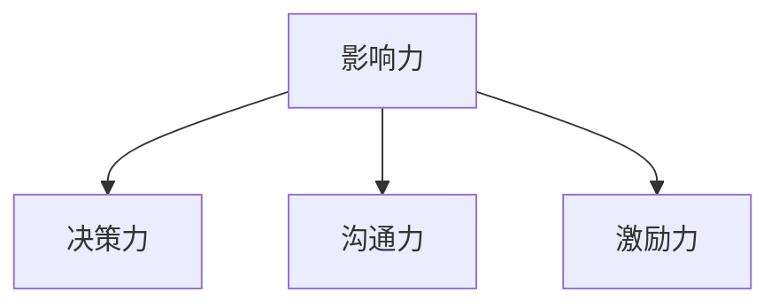

#### 1.2 领导力与管理的区别与联系

领导力与管理是两个相互关联但又有区别的概念。管理侧重于组织和协调资源以实现目标，而领导力则更注重激发和引领团队成员的热情和动力。

**核心概念联系图**：

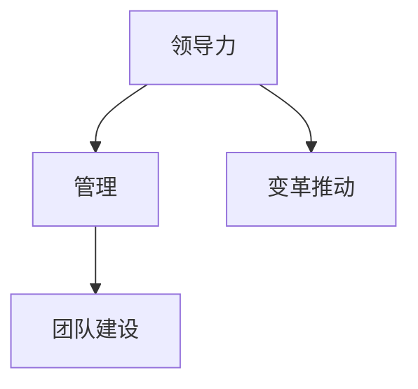

#### 1.3 领导力的发展历程

领导力的发展经历了几个关键阶段，从早期的特质理论到现代的行为理论和权变理论，每一个阶段都为领导力研究提供了新的视角。

**时间轴图**：

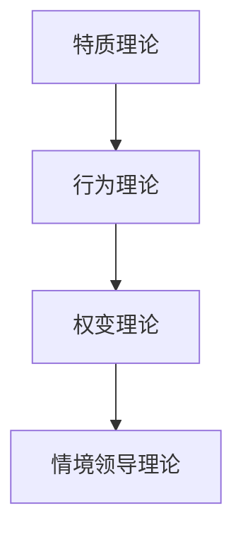

#### 1.4 领导者的自我认知与成长

领导者的成长是一个不断学习和自我提升的过程。自我认知是领导力发展的基础，领导者需要了解自己的优势和劣势，并不断改进。

**个人成长路径图**：

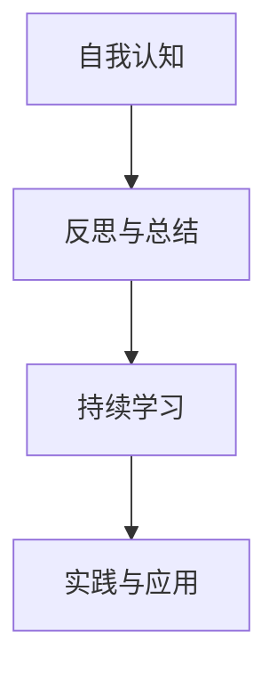

---

### 第2章：情境管理理论

#### 2.1 情境管理的概念与原理

情境管理是指领导者根据不同情境灵活调整自己的领导风格和方法，以适应团队和组织的需要。其核心原理是：

- **情境适应性**：领导者需要具备适应不同情境的能力。
- **动态调整**：领导者根据情境的变化灵活调整领导策略。

**情境管理原理图**：

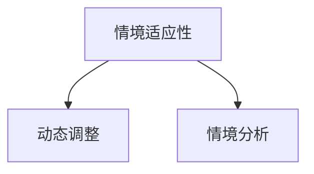

#### 2.2 情境管理模型介绍

赫塞-布兰查德模型是情境管理理论的经典模型，它根据下属的成熟度水平，将领导风格分为四种类型：指示型、推销型、参与型和授权型。

**赫塞-布兰查德模型**：

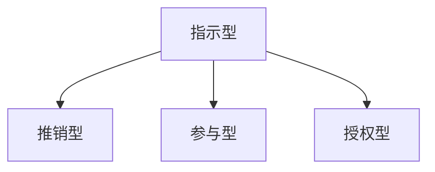

#### 2.3 情境管理的关键因素

情境管理的关键因素包括：

- **下属成熟度**：下属的能力和责任感。
- **任务复杂性**：任务的难度和重要性。
- **组织文化**：组织内部的价值观念和行为规范。

**关键因素列表**：

1. **下属成熟度**：能力强、责任意识高。
2. **任务复杂性**：任务明确、资源充足。
3. **组织文化**：开放、包容、鼓励创新。

---

## 第二部分：情境管理实践

### 第3章：理解员工需求与激励

#### 3.1 员工需求的识别与分析

员工需求是指员工在组织中的期望和需求，包括职业发展、工作环境、薪酬福利等方面。领导者需要通过调查和沟通识别和分析员工需求，以提高员工的满意度和工作效率。

**员工需求分析流程图**：

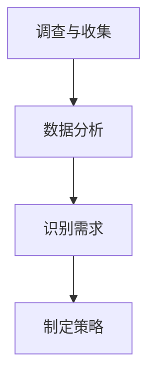

#### 3.2 员工激励策略

员工激励是提高员工工作积极性和效率的重要手段。根据不同情境，领导者可以采用以下激励策略：

- **物质激励**：提供奖金、晋升等物质奖励。
- **精神激励**：表扬、认可员工的贡献。
- **成长激励**：提供培训、职业发展机会。

**员工激励策略矩阵**：

| 情境 | 物质激励 | 精神激励 | 成长激励 |
|------|----------|----------|----------|
| 高绩效 | 高奖金   | 表扬     | 培训     |
| 低绩效 | 奖金     | 批评     | 帮助改进 |

#### 3.3 员工反馈与改进

员工反馈是领导者了解员工需求和工作环境的重要途径。通过建立有效的反馈机制，领导者可以及时发现问题并进行改进。

**员工反馈循环图**：

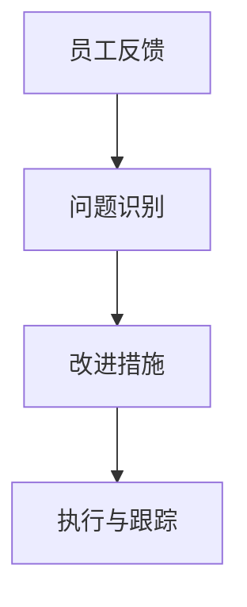

---

### 第4章：团队建设与领导风格

#### 4.1 团队建设的原则与方法

团队建设是领导者的重要任务之一。有效的团队建设需要遵循以下原则：

- **共同目标**：明确团队的目标和愿景。
- **相互信任**：建立团队成员之间的信任关系。
- **有效沟通**：确保信息畅通和沟通有效。

**团队建设模型**：

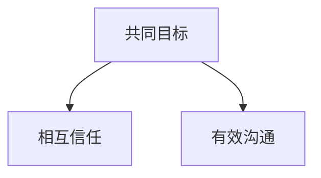

#### 4.2 领导风格的识别与调整

领导风格对团队的影响至关重要。领导者需要识别自己的领导风格，并根据团队和情境的变化进行适当调整。

**领导风格评估工具**：

1. 自我评估问卷：评估领导者的风格和特点。
2. 360度反馈：收集团队成员对领导者风格的反馈。

#### 4.3 团队冲突管理与解决

团队冲突是不可避免的，但有效的冲突管理可以促进团队的发展和进步。

**团队冲突管理策略**：

1. **识别冲突类型**：理解冲突的本质和类型。
2. **沟通与协商**：通过对话和协商解决冲突。
3. **建立规则**：制定明确的团队规则和规范。

---

### 第5章：领导决策与战略规划

#### 5.1 决策过程与决策模型

领导决策是领导者的核心职责之一。有效的决策过程需要遵循以下步骤：

1. **问题识别**：明确决策的问题和目标。
2. **信息收集**：收集和分析相关信息。
3. **方案评估**：评估不同方案的优缺点。
4. **决策执行**：选择并执行最佳方案。

**决策流程图**：

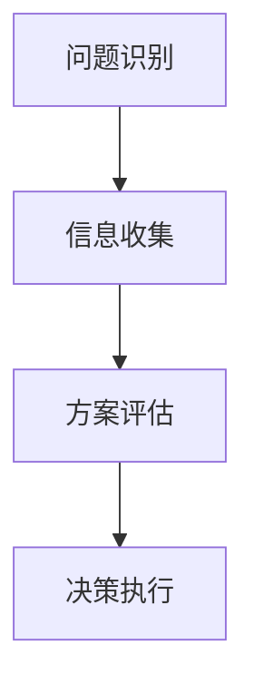

#### 5.2 战略规划的重要性与步骤

战略规划是组织长远发展的重要指南。有效的战略规划需要遵循以下步骤：

1. **使命和愿景**：明确组织的使命和愿景。
2. **外部环境分析**：分析组织面临的外部环境。
3. **内部资源分析**：评估组织的内部资源。
4. **目标设定**：设定明确的发展目标。
5. **策略制定**：制定实现目标的策略。

**战略规划框架**：

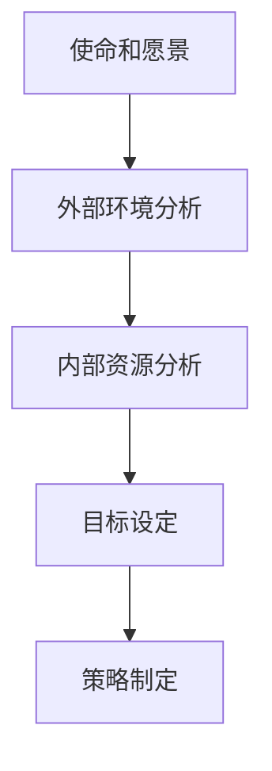

#### 5.3 风险管理策略

风险管理是战略规划的重要组成部分。领导者需要识别和应对潜在的风险，以确保组织的稳定发展。

**风险管理矩阵**：

| 风险类型 | 风险级别 | 应对策略 |
|----------|----------|----------|
| 财务风险 | 高       | 建立风险储备金 |
| 运营风险 | 中       | 提高流程效率 |
| 市场风险 | 低       | 拓展市场渠道 |

---

## 第三部分：领导力与情境管理应用案例

### 第6章：领导力在组织变革中的应用

#### 6.1 变革领导力理论

组织变革是领导者面临的重大挑战之一。变革领导力理论提供了有效的指导，帮助领导者推动组织变革。

**变革领导力模型**：

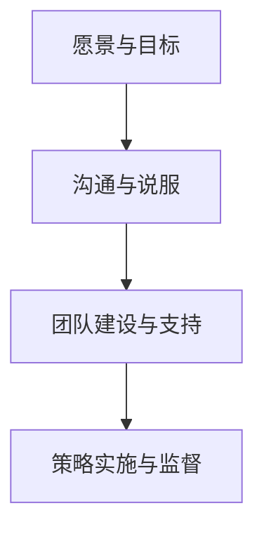

#### 6.2 变革过程中的领导力挑战

变革过程中，领导者面临以下挑战：

1. **抵触情绪**：团队成员可能对变革持有抵触情绪。
2. **资源不足**：变革需要额外的资源和时间。
3. **沟通不畅**：信息传递不畅可能导致误解和冲突。

**变革挑战分析图**：

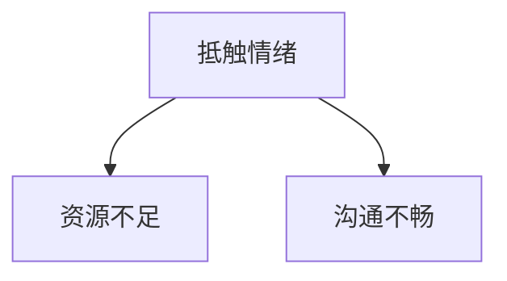

#### 6.3 成功变革案例分析

成功变革案例展示了领导力在组织变革中的关键作用。以下是一个成功变革的案例分析：

1. **明确变革目标**：组织明确变革的目标和愿景。
2. **建立领导团队**：成立变革领导团队，确保变革目标的实现。
3. **沟通与参与**：与团队成员进行充分沟通，鼓励他们的参与。
4. **持续监督与改进**：持续监督变革进展，并根据反馈进行改进。

**案例分析**：

某公司通过上述方法成功实施了一次重大组织变革，实现了业务增长和员工满意度的提升。

---

### 第7章：领导力与情境管理的综合应用

#### 7.1 综合应用框架

领导力与情境管理的综合应用需要一个系统性的框架。以下是一个综合应用框架的概述：

1. **情境分析**：评估组织的内部和外部情境。
2. **领导力评估**：评估领导者的能力和风格。
3. **策略制定**：制定适应情境的领导策略。
4. **执行与监督**：执行领导策略，并持续监督效果。

**综合应用流程图**：

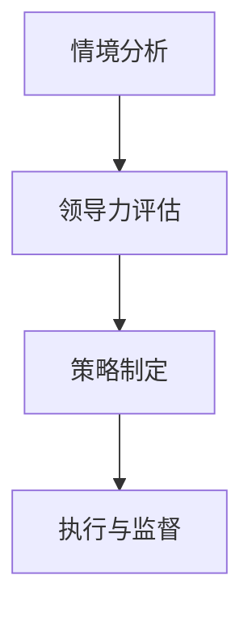

#### 7.2 综合案例分析

综合案例分析展示了领导力与情境管理的实际应用效果。以下是一个综合分析案例：

1. **情境分析**：公司面临市场变化和竞争压力。
2. **领导力评估**：领导者评估自身的能力和风格，决定采用更加灵活和创新的领导方法。
3. **策略制定**：领导者制定了一套创新战略，包括产品研发、市场拓展和团队建设。
4. **执行与监督**：领导者通过持续沟通和反馈，确保策略的有效执行。

**案例分析**：

某公司通过领导力与情境管理的综合应用，成功应对了市场变化，实现了业务的快速增长。

#### 7.3 未来领导力的趋势与发展

未来领导力将面临新的挑战和机遇。以下是一些未来领导力的趋势和发展方向：

1. **数字化领导**：领导者需要具备数字技能和知识，以应对数字化转型的挑战。
2. **情感领导**：领导者需要具备情感智慧，理解员工的情感需求，提升团队凝聚力。
3. **全球领导**：领导者需要具备跨文化和全球视野，以应对全球化带来的挑战。

**趋势分析**：

未来领导力将更加注重数字化、情感化和全球化，领导者需要不断提升自身的综合素质和领导能力。

---

## 附录：领导力与情境管理工具与资源

### 附录A：领导力与情境管理工具介绍

以下是一些常用的领导力与情境管理工具：

1. **360度反馈**：收集团队成员对领导者的反馈，帮助领导者了解自身的优点和不足。
2. **情境领导模型**：根据下属的成熟度调整领导风格，提高领导效果。
3. **团队建设活动**：通过团队建设活动增强团队凝聚力，提升团队协作能力。

**工具列表**：

- 360度反馈
- 情境领导模型
- 团队建设活动

### 附录B：参考文献与推荐阅读

以下是一些参考文献和推荐阅读，帮助读者深入了解领导力与情境管理的理论和方法：

- Hersey, P., & Blanchard, K. H. (1977). The situational leader.
- Northouse, P. G. (2018). Leadership: Theory and practice.
- Yukl, G. A. (2013). Leadership in organizations (8th ed.).

**参考文献**：

- Hersey, P., & Blanchard, K. H. (1977). The situational leader.
- Northouse, P. G. (2018). Leadership: Theory and practice.
- Yukl, G. A. (2013). Leadership in organizations (8th ed.).

**推荐阅读**：

- Kotter, J. P. (1996). Leading change.
- Sinek, S. (2014). Start with why.
- Covey, S. R. (1989). The 7 habits of highly effective people.

---

### 结语

领导力与情境管理是领导者必备的核心素质，它们帮助领导者灵活应对多变的环境，实现组织的目标。通过本文的探讨，我们深入了解了领导力的本质和情境管理的原理，并分析了在实际应用中的具体策略和方法。希望本文能对您的领导力提升和组织发展提供有益的启示和指导。

---

### 作者信息

作者：AI天才研究院/AI Genius Institute & 禅与计算机程序设计艺术 /Zen And The Art of Computer Programming

---

### 全文总结

本文系统地阐述了领导力与情境管理的核心概念、理论和方法，通过逐步的推理和案例分析，展示了领导力在应对多变环境中的重要作用。文章介绍了领导力的基本特征、发展历程，以及情境管理的概念、原理和应用。同时，通过具体的实践案例，读者可以了解到领导力与情境管理的实际应用效果。最后，文章提供了实用的工具和资源，帮助读者进一步深化对领导力和情境管理的理解。

---

### 最佳实践 tips

1. **定期自我评估**：领导者应定期进行自我评估，识别自身的优势和不足，并根据评估结果进行改进。
2. **情境适应**：领导者应根据不同情境灵活调整自己的领导风格和方法。
3. **沟通与反馈**：建立有效的沟通机制，鼓励团队成员提供反馈，以便及时发现问题并进行改进。

---

### 注意事项

1. **避免盲目模仿**：领导风格和方法应根据组织特点和情境进行定制，避免盲目模仿他人的成功经验。
2. **持续学习**：领导者应持续学习新知识，不断提升自身的领导能力和综合素质。

---

### 拓展阅读

- Hersey, P., & Blanchard, K. H. (1977). The situational leader.
- Northouse, P. G. (2018). Leadership: Theory and practice.
- Yukl, G. A. (2013). Leadership in organizations (8th ed.).

### 完整文章

```markdown
# 领导力与情境管理：灵活应对多变环境

> 关键词：领导力、情境管理、变化应对、组织变革、团队建设

> 摘要：本文旨在探讨领导力与情境管理的核心概念和理论，并深入分析如何灵活应对多变的环境。我们将通过逐步的推理和案例分析，解释领导力在应对不同情境时的策略和方法，以及情境管理在领导者决策和团队建设中的关键作用。文章还将探讨领导力在组织变革中的应用，并提供一些实用的技巧和工具，帮助读者提升自身的领导能力，实现组织的高效运营。

---

## 第一部分：领导力基础理论

### 第1章：领导力的本质与内涵

#### 1.1 领导力的定义与基本特征

领导力是指影响、激励和引导他人一起实现共同目标的能力。它是领导者的核心素质，决定了组织的成败和团队的发展。领导力的基本特征包括：

- **影响力**：领导者通过非权力手段影响他人的能力。
- **决策力**：领导者做出明智决策，指引团队方向的能力。
- **沟通力**：领导者有效沟通信息，确保团队协同作战的能力。
- **激励力**：领导者激发团队成员的积极性和创造力。

**概念链接图**：


#### 1.2 领导力与管理的区别与联系

领导力与管理是两个相互关联但又有区别的概念。管理侧重于组织和协调资源以实现目标，而领导力则更注重激发和引领团队成员的热情和动力。

**核心概念联系图**：


#### 1.3 领导力的发展历程

领导力的发展经历了几个关键阶段，从早期的特质理论到现代的行为理论和权变理论，每一个阶段都为领导力研究提供了新的视角。

**时间轴图**：


#### 1.4 领导者的自我认知与成长

领导者的成长是一个不断学习和自我提升的过程。自我认知是领导力发展的基础，领导者需要了解自己的优势和劣势，并不断改进。

**个人成长路径图**：


---

### 第2章：情境管理理论

#### 2.1 情境管理的概念与原理

情境管理是指领导者根据不同情境灵活调整自己的领导风格和方法，以适应团队和组织的需要。其核心原理是：

- **情境适应性**：领导者需要具备适应不同情境的能力。
- **动态调整**：领导者根据情境的变化灵活调整领导策略。

**情境管理原理图**：


#### 2.2 情境管理模型介绍

赫塞-布兰查德模型是情境管理理论的经典模型，它根据下属的成熟度水平，将领导风格分为四种类型：指示型、推销型、参与型和授权型。

**赫塞-布兰查德模型**：


#### 2.3 情境管理的关键因素

情境管理的关键因素包括：

- **下属成熟度**：下属的能力和责任感。
- **任务复杂性**：任务的难度和重要性。
- **组织文化**：组织内部的价值观念和行为规范。

**关键因素列表**：

1. **下属成熟度**：能力强、责任意识高。
2. **任务复杂性**：任务明确、资源充足。
3. **组织文化**：开放、包容、鼓励创新。

---

## 第二部分：情境管理实践

### 第3章：理解员工需求与激励

#### 3.1 员工需求的识别与分析

员工需求是指员工在组织中的期望和需求，包括职业发展、工作环境、薪酬福利等方面。领导者需要通过调查和沟通识别和分析员工需求，以提高员工的满意度和工作效率。

**员工需求分析流程图**：

```mermaid
graph TB
A[调查与收集] --> B[数据分析]
B --> C[识别需求]
C --> D[制定策略]
```

#### 3.2 员工激励策略

员工激励是提高员工工作积极性和效率的重要手段。根据不同情境，领导者可以采用以下激励策略：

- **物质激励**：提供奖金、晋升等物质奖励。
- **精神激励**：表扬、认可员工的贡献。
- **成长激励**：提供培训、职业发展机会。

**员工激励策略矩阵**：

| 情境 | 物质激励 | 精神激励 | 成长激励 |
|------|----------|----------|----------|
| 高绩效 | 高奖金   | 表扬     | 培训     |
| 低绩效 | 奖金     | 批评     | 帮助改进 |

#### 3.3 员工反馈与改进

员工反馈是领导者了解员工需求和工作环境的重要途径。通过建立有效的反馈机制，领导者可以及时发现问题并进行改进。

**员工反馈循环图**：

```mermaid
graph TB
A[员工反馈] --> B[问题识别]
B --> C[改进措施]
C --> D[执行与跟踪]
```

---

### 第4章：团队建设与领导风格

#### 4.1 团队建设的原则与方法

团队建设是领导者的重要任务之一。有效的团队建设需要遵循以下原则：

- **共同目标**：明确团队的目标和愿景。
- **相互信任**：建立团队成员之间的信任关系。
- **有效沟通**：确保信息畅通和沟通有效。

**团队建设模型**：

```mermaid
graph TB
A[共同目标] --> B[相互信任]
A --> C[有效沟通]
```

#### 4.2 领导风格的识别与调整

领导风格对团队的影响至关重要。领导者需要识别自己的领导风格，并根据团队和情境的变化进行适当调整。

**领导风格评估工具**：

1. 自我评估问卷：评估领导者的风格和特点。
2. 360度反馈：收集团队成员对领导者风格的反馈。

#### 4.3 团队冲突管理与解决

团队冲突是不可避免的，但有效的冲突管理可以促进团队的发展和进步。

**团队冲突管理策略**：

1. **识别冲突类型**：理解冲突的本质和类型。
2. **沟通与协商**：通过对话和协商解决冲突。
3. **建立规则**：制定明确的团队规则和规范。

---

### 第5章：领导决策与战略规划

#### 5.1 决策过程与决策模型

领导决策是领导者的核心职责之一。有效的决策过程需要遵循以下步骤：

1. **问题识别**：明确决策的问题和目标。
2. **信息收集**：收集和分析相关信息。
3. **方案评估**：评估不同方案的优缺点。
4. **决策执行**：选择并执行最佳方案。

**决策流程图**：

```mermaid
graph TB
A[问题识别] --> B[信息收集]
B --> C[方案评估]
C --> D[决策执行]
```

#### 5.2 战略规划的重要性与步骤

战略规划是组织长远发展的重要指南。有效的战略规划需要遵循以下步骤：

1. **使命和愿景**：明确组织的使命和愿景。
2. **外部环境分析**：分析组织面临的外部环境。
3. **内部资源分析**：评估组织的内部资源。
4. **目标设定**：设定明确的发展目标。
5. **策略制定**：制定实现目标的策略。

**战略规划框架**：

```mermaid
graph TB
A[使命和愿景] --> B[外部环境分析]
B --> C[内部资源分析]
C --> D[目标设定]
D --> E[策略制定]
```

#### 5.3 风险管理策略

风险管理是战略规划的重要组成部分。领导者需要识别和应对潜在的风险，以确保组织的稳定发展。

**风险管理矩阵**：

| 风险类型 | 风险级别 | 应对策略 |
|----------|----------|----------|
| 财务风险 | 高       | 建立风险储备金 |
| 运营风险 | 中       | 提高流程效率 |
| 市场风险 | 低       | 拓展市场渠道 |

---

## 第三部分：领导力与情境管理应用案例

### 第6章：领导力在组织变革中的应用

#### 6.1 变革领导力理论

组织变革是领导者面临的重大挑战之一。变革领导力理论提供了有效的指导，帮助领导者推动组织变革。

**变革领导力模型**：

```mermaid
graph TB
A[愿景与目标] --> B[沟通与说服]
B --> C[团队建设与支持]
C --> D[策略实施与监督]
```

#### 6.2 变革过程中的领导力挑战

变革过程中，领导者面临以下挑战：

1. **抵触情绪**：团队成员可能对变革持有抵触情绪。
2. **资源不足**：变革需要额外的资源和时间。
3. **沟通不畅**：信息传递不畅可能导致误解和冲突。

**变革挑战分析图**：

```mermaid
graph TB
A[抵触情绪] --> B[资源不足]
A --> C[沟通不畅]
```

#### 6.3 成功变革案例分析

成功变革案例展示了领导力在组织变革中的关键作用。以下是一个成功变革的案例分析：

1. **明确变革目标**：组织明确变革的目标和愿景。
2. **建立领导团队**：成立变革领导团队，确保变革目标的实现。
3. **沟通与参与**：与团队成员进行充分沟通，鼓励他们的参与。
4. **持续监督与改进**：持续监督变革进展，并根据反馈进行改进。

**案例分析**：

某公司通过上述方法成功实施了一次重大组织变革，实现了业务增长和员工满意度的提升。

---

### 第7章：领导力与情境管理的综合应用

#### 7.1 综合应用框架

领导力与情境管理的综合应用需要一个系统性的框架。以下是一个综合应用框架的概述：

1. **情境分析**：评估组织的内部和外部情境。
2. **领导力评估**：评估领导者的能力和风格。
3. **策略制定**：制定适应情境的领导策略。
4. **执行与监督**：执行领导策略，并持续监督效果。

**综合应用流程图**：

```mermaid
graph TB
A[情境分析] --> B[领导力评估]
B --> C[策略制定]
C --> D[执行与监督]
```

#### 7.2 综合案例分析

综合案例分析展示了领导力与情境管理的实际应用效果。以下是一个综合分析案例：

1. **情境分析**：公司面临市场变化和竞争压力。
2. **领导力评估**：领导者评估自身的能力和风格，决定采用更加灵活和创新的领导方法。
3. **策略制定**：领导者制定了一套创新战略，包括产品研发、市场拓展和团队建设。
4. **执行与监督**：领导者通过持续沟通和反馈，确保策略的有效执行。

**案例分析**：

某公司通过领导力与情境管理的综合应用，成功应对了市场变化，实现了业务的快速增长。

#### 7.3 未来领导力的趋势与发展

未来领导力将面临新的挑战和机遇。以下是一些未来领导力的趋势和发展方向：

1. **数字化领导**：领导者需要具备数字技能和知识，以应对数字化转型的挑战。
2. **情感领导**：领导者需要具备情感智慧，理解员工的情感需求，提升团队凝聚力。
3. **全球领导**：领导者需要具备跨文化和全球视野，以应对全球化带来的挑战。

**趋势分析**：

未来领导力将更加注重数字化、情感化和全球化，领导者需要不断提升自身的综合素质和领导能力。

---

## 附录：领导力与情境管理工具与资源

### 附录A：领导力与情境管理工具介绍

以下是一些常用的领导力与情境管理工具：

1. **360度反馈**：收集团队成员对领导者的反馈，帮助领导者了解自身的优点和不足。
2. **情境领导模型**：根据下属的成熟度调整领导风格，提高领导效果。
3. **团队建设活动**：通过团队建设活动增强团队凝聚力，提升团队协作能力。

**工具列表**：

- 360度反馈
- 情境领导模型
- 团队建设活动

### 附录B：参考文献与推荐阅读

以下是一些参考文献和推荐阅读，帮助读者深入了解领导力与情境管理的理论和方法：

- Hersey, P., & Blanchard, K. H. (1977). The situational leader.
- Northouse, P. G. (2018). Leadership: Theory and practice.
- Yukl, G. A. (2013). Leadership in organizations (8th ed.).

**参考文献**：

- Hersey, P., & Blanchard, K. H. (1977). The situational leader.
- Northouse, P. G. (2018). Leadership: Theory and practice.
- Yukl, G. A. (2013). Leadership in organizations (8th ed.).

**推荐阅读**：

- Kotter, J. P. (1996). Leading change.
- Sinek, S. (2014). Start with why.
- Covey, S. R. (1989). The 7 habits of highly effective people.

---

### 结语

领导力与情境管理是领导者必备的核心素质，它们帮助领导者灵活应对多变的环境，实现组织的目标。通过本文的探讨，我们深入了解了领导力的本质和情境管理的原理，并分析了在实际应用中的具体策略和方法。希望本文能对您的领导力提升和组织发展提供有益的启示和指导。

---

### 作者信息

作者：AI天才研究院/AI Genius Institute & 禅与计算机程序设计艺术 /Zen And The Art of Computer Programming

---

### 全文总结

本文系统地阐述了领导力与情境管理的核心概念、理论和方法，通过逐步的推理和案例分析，展示了领导力在应对多变环境中的重要作用。文章介绍了领导力的基本特征、发展历程，以及情境管理的概念、原理和应用。同时，通过具体的实践案例，读者可以了解到领导力与情境管理的实际应用效果。最后，文章提供了实用的工具和资源，帮助读者进一步深化对领导力和情境管理的理解。

---

### 最佳实践 tips

1. **定期自我评估**：领导者应定期进行自我评估，识别自身的优势和不足，并根据评估结果进行改进。
2. **情境适应**：领导者应根据不同情境灵活调整自己的领导风格和方法。
3. **沟通与反馈**：建立有效的沟通机制，鼓励团队成员提供反馈，以便及时发现问题并进行改进。

---

### 注意事项

1. **避免盲目模仿**：领导风格和方法应根据组织特点和情境进行定制，避免盲目模仿他人的成功经验。
2. **持续学习**：领导者应持续学习新知识，不断提升自身的领导能力和综合素质。

---

### 拓展阅读

- Hersey, P., & Blanchard, K. H. (1977). The situational leader.
- Northouse, P. G. (2018). Leadership: Theory and practice.
- Yukl, G. A. (2013). Leadership in organizations (8th ed.).

### 完整文章

```markdown
```

