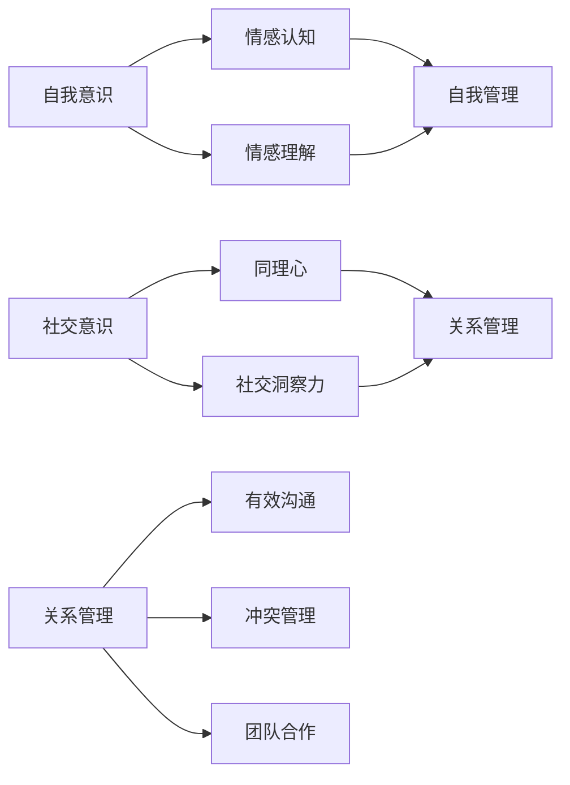

                 

### 摘要

本文以《领导力与情感智慧：理解人性的艺术》为标题，深入探讨领导力与情感智慧之间的紧密联系。通过一系列逻辑严谨的分析推理，本文将揭示情感智慧在领导力中的核心作用，并阐述如何运用情感智慧提升领导效果。本文旨在为读者提供一个全面的视角，理解领导力的本质，以及如何通过提升情感智慧来优化领导实践。通过对情感智慧的核心概念、理论框架和实际应用的分析，本文旨在帮助读者掌握理解人性的艺术，从而在实际工作中更有效地发挥领导力。

### 背景介绍

在当今复杂多变的社会和工作环境中，领导力的作用愈发凸显。传统意义上的领导力强调理性决策、战略规划和组织管理，但现代领导力研究逐渐发现，情感智慧在其中扮演了不可或缺的角色。情感智慧（Emotional Intelligence，简称EI）是一种理解、管理自己和他人的情感，以及运用这些情感促进思考和决策的能力。它包括三个核心维度：自我意识、自我管理、社交意识和关系管理。

自我意识是指个体对自己情感的认知和理解，包括识别情感、理解情感产生的原因、以及情感对个体行为和思维的影响。自我管理则涉及调节和调整情感，使其符合实际需要，避免过度情绪化或压抑情感。社交意识是指对他人情感的理解和感知能力，包括同理心和社交洞察力。关系管理则关注如何建立和维护良好的人际关系，通过有效的沟通和合作，促进团队和谐与效能。

情感智慧不仅与个人的心理健康息息相关，还对领导力产生深远影响。领导力本质上是影响力，而情感智慧作为影响力的重要基础，能够增强领导的亲和力和公信力。具有高情感智慧的领导者能够更好地激发团队成员的潜力，构建积极的工作氛围，并在面对挑战时展现更强的适应能力和决策能力。因此，理解情感智慧并学会运用它，对于提升领导力至关重要。

在现代社会，领导力不仅关乎个人的成功，更关系到组织的发展和整个社会的进步。随着全球化、数字化和信息化的加速推进，企业和社会面临的环境变得更加复杂和多变。在这个背景下，领导力需要与时俱进，更加注重人性的理解和情感的管理。本文将通过深入探讨情感智慧的核心概念、其在领导力中的具体应用，以及如何培养和提升情感智慧，帮助读者全面理解领导力的本质，掌握理解人性的艺术，从而在生活和工作中更加成功和高效。

### 核心概念与联系

要深入理解情感智慧在领导力中的作用，我们需要先梳理其核心概念和原理，并揭示这些概念之间的关系架构。情感智慧（Emotional Intelligence，简称EI）主要由四个核心维度构成：自我意识、自我管理、社交意识和关系管理。这些维度之间相互联系，共同构成了一个完整的情感智慧框架。

1. **自我意识**：这是情感智慧的基础，它包括情感认知和情感理解两个子维度。情感认知是指个体能够意识到自己正在体验的情感，例如愤怒、焦虑或快乐。情感理解则涉及对情感原因和影响的理解，比如为何会感到愤怒，以及这种情感如何影响决策和行动。

2. **自我管理**：自我管理是自我意识的延伸，强调如何调节和调整情感，使其更符合实际需要。这包括情感控制和情绪调节，例如在面对压力时保持冷静，或者如何在负面情绪中找到积极的角度。

3. **社交意识**：社交意识涉及对他人情感的理解和感知能力，主要涵盖同理心和社交洞察力。同理心是指能够设身处地地理解他人的情感和观点，而社交洞察力则是指能够敏锐地感知他人的情感状态和需要。

4. **关系管理**：关系管理是指运用情感智慧来建立和维护人际关系，包括有效沟通、冲突管理和团队合作。有效的沟通能力能够减少误解和冲突，增强团队的凝聚力和协作效率。

**Mermaid 流程图**：

通过这个Mermaid流程图，我们可以清晰地看到情感智慧各个维度之间的相互关系。自我意识是整个框架的基石，自我管理和社交意识则在此基础上进一步扩展和深化。最后，关系管理作为情感智慧的终极应用，将自我管理和社交意识转化为实际的人际互动和团队协作能力。

理解这些核心概念和它们之间的联系，有助于我们更全面地认识情感智慧的重要性。在领导力中，情感智慧不仅帮助领导者更好地理解和管理自己，还使他们能够更有效地影响和激励团队成员。通过提升情感智慧，领导者能够在复杂多变的环境中保持冷静，做出明智的决策，并建立起信任和协作的团队文化。因此，情感智慧是现代领导者不可或缺的技能，也是提升领导力效果的关键因素。

### 情感智慧与领导力的联系

情感智慧在领导力中的核心作用不可忽视。领导者不仅需要具备决策能力、战略眼光和组织管理技能，更需要具备高度的情感智慧，以便在复杂多变的环境中保持冷静、应对挑战、建立团队信任和推动团队发展。以下是情感智慧在领导力中的具体应用及其重要性：

首先，**自我意识**使领导者能够更好地理解和管理自己的情感。在领导过程中，领导者经常会面对压力、挫折和不确定性。具有高度自我意识的领导者能够敏锐地识别自己的情感状态，并迅速采取适当的应对措施，避免情绪化的决策和行为。例如，当领导者感到焦虑或愤怒时，自我意识可以帮助他们识别这些情绪，并通过情绪调节技巧将其转化为积极的动力，从而保持冷静和理性。

其次，**自我管理**能力使领导者能够在压力下保持高效和专注。自我管理包括情感控制和情绪调节，这些技能有助于领导者保持情绪稳定，即使在面临困难时也能保持清晰的思维和决策能力。例如，一位具有高度自我管理能力的领导者可能会在面对重大挑战时，通过深呼吸、冥想或其他放松技巧来控制自己的情绪，从而更好地应对压力，制定出有效的应对策略。

第三，**社交意识**是领导者建立和维护团队关系的关键。具有高度社交意识的领导者能够敏锐地感知团队成员的情感和需求，从而更好地理解他们的动机和行为。这种能力有助于领导者建立信任和共鸣，增强团队的凝聚力和协作效率。例如，当团队成员遇到困难或情绪低落时，具有社交意识的领导者能够及时提供支持和鼓励，帮助他们度过难关，从而增强团队的士气和战斗力。

最后，**关系管理**能力使领导者能够在复杂的人际关系中保持有效的沟通和协作。关系管理包括有效沟通、冲突管理和团队合作，这些技能有助于领导者化解冲突、促进合作，并建立积极的工作氛围。例如，当团队内部出现分歧或冲突时，具有关系管理能力的领导者能够通过有效的沟通技巧和冲突管理策略，化解矛盾，恢复团队的和谐与效能。

具体案例：

例如，乔布斯作为苹果公司的联合创始人，他的成功在很大程度上得益于他的高情感智慧。乔布斯在产品设计和公司管理中展现出了卓越的自我意识和自我管理能力，他能够敏锐地感知市场和用户的需求，并通过严格的自我管理保持创新和专注。同时，他的社交意识使他能够与团队成员建立深厚的信任和合作关系，而他的关系管理能力则帮助他在公司内部和外部建立了广泛的支持网络，推动了苹果公司的持续发展和成功。

总之，情感智慧在领导力中发挥着至关重要的作用。通过提升情感智慧，领导者不仅能够更好地管理自己和团队，还能在面对复杂多变的环境时保持冷静和理智，做出更明智的决策。情感智慧不仅有助于提升领导者的个人魅力和公信力，还能增强团队的凝聚力和协作效率，从而推动组织的发展和进步。

### 情感智慧的培养与提升

培养和提升情感智慧是一个长期且持续的过程，它需要领导者通过多种方法不断地自我反思和实践。以下是几种有效的策略和方法，帮助领导者提升情感智慧：

1. **自我反思**：自我反思是提升情感智慧的关键步骤。领导者可以通过记录日记、参加反思性会议或进行心理辅导等方式，深入思考自己的情感状态和情绪反应。通过自我反思，领导者可以更清楚地了解自己的情感触发点，以及这些情感如何影响他们的决策和行为。

2. **情绪调节技巧**：情绪调节技巧包括深呼吸、冥想、正念练习等。这些技巧有助于领导者缓解压力，保持冷静和专注。例如，通过深呼吸练习，领导者可以在面对压力时迅速放松身心，从而更好地应对挑战。冥想和正念练习则可以帮助领导者培养专注力和情感平衡，提高自我意识和管理能力。

3. **同理心训练**：同理心是情感智慧的重要组成部分。领导者可以通过阅读、参加研讨会或进行角色扮演等方式，提升同理心。例如，阅读关于心理学和人际关系的书籍，可以帮助领导者更好地理解他人的情感和需求。通过角色扮演，领导者可以模拟他人的情境，从他人的视角看待问题，从而培养同理心。

4. **积极倾听**：积极倾听是提升社交意识和关系管理能力的重要技巧。领导者需要学会倾听他人的意见和感受，而不是仅仅关注自己的观点。通过积极倾听，领导者可以更好地理解团队成员的需求和情感，建立信任和共鸣。

5. **反馈和辅导**：获取他人的反馈和进行辅导是提升情感智慧的有效方法。领导者可以通过定期的反馈会议、360度评估或导师辅导等方式，获取他人对自己情感管理和人际交往的反馈。这些反馈可以帮助领导者识别自己的盲点和改进方向，从而不断提升情感智慧。

**案例分析**：

以亚马逊的创始人杰夫·贝佐斯为例，他通过自我反思和持续学习，不断提升自己的情感智慧。贝佐斯每天早上都会花30分钟阅读，其中大部分时间是阅读与领导力、商业和管理相关的书籍。他的反思日志和阅读习惯帮助他深入理解情感智慧的核心概念，并在实践中不断应用和提升。此外，贝佐斯还积极参与公司的反馈和辅导机制，通过定期的员工反馈会议和导师辅导，不断提升自己的领导能力和情感智慧。

总之，培养和提升情感智慧需要领导者付出持续的努力和关注。通过自我反思、情绪调节技巧、同理心训练、积极倾听和获取反馈等多种方法，领导者可以逐步提升自己的情感智慧，从而在领导实践中更加成功和高效。情感智慧不仅是领导者个人发展的关键，也是推动团队和组织发展的强大动力。

### 情感智慧在领导实践中的运用

在领导实践中，情感智慧的运用不仅能够提升领导者的个人魅力和团队凝聚力，还能够显著改善组织的整体表现。以下是情感智慧在领导实践中的几个关键应用：

1. **团队建设**：情感智慧有助于领导者建立强大的团队。通过提升同理心和社交意识，领导者可以更好地理解团队成员的需求和情感，从而创造出更加包容和信任的工作环境。例如，领导者可以通过组织团队建设活动，如团建训练、团队讨论和社交聚会，增强团队成员之间的情感联系，提高团队的凝聚力和协作效率。

2. **员工激励**：领导者可以利用情感智慧激发员工的潜能和积极性。通过感知员工的情感状态，领导者可以提供个性化的激励和支持，例如给予认可、奖励或职业发展机会。例如，当员工感到困惑或焦虑时，领导者可以及时提供帮助和指导，帮助员工克服困难，从而增强他们的工作动力和成就感。

3. **冲突管理**：情感智慧在冲突管理中起着至关重要的作用。领导者可以通过有效的沟通技巧和情感调节能力，预防和解决团队内部的冲突。例如，当团队成员之间出现分歧时，领导者可以运用同理心倾听各方的观点，并通过情绪调节技巧保持冷静和理智，从而找到双赢的解决方案。

4. **领导风格**：情感智慧影响领导者的领导风格。具有高情感智慧的领导者通常更加注重员工的情感和需求，采用更加民主和参与式领导风格。这种领导风格能够增强员工的参与感和归属感，提高团队的整体效能。例如，通过开放式的讨论和决策过程，领导者可以鼓励团队成员提出意见和建议，从而增强团队的创造力和创新能力。

**实际案例**：

以谷歌公司为例，谷歌以其独特的领导文化和员工福利制度著称。谷歌的领导者高度重视情感智慧，通过一系列措施提升员工的幸福感和工作效率。谷歌提供了丰富的员工培训和发展机会，鼓励员工参加领导力、沟通和情感智慧相关的课程。此外，谷歌的领导者在日常管理中注重与员工的情感互动，通过定期的1对1会议和开放式沟通，了解员工的需求和情感状态，从而提供个性化的支持和帮助。这种情感智慧驱动的领导实践，帮助谷歌建立了高效的团队，推动了公司的持续创新和卓越表现。

总之，情感智慧在领导实践中的应用能够显著提升团队和组织的效能。通过培养和运用情感智慧，领导者可以更好地理解和管理团队的情感状态，建立积极的工作环境，激发员工的潜能，从而实现组织的长远发展。

### 最佳实践与注意事项

在提升情感智慧和运用情感智慧的过程中，领导者可以遵循以下最佳实践和注意事项，以确保最大限度地发挥情感智慧的作用：

1. **持续学习和实践**：情感智慧并非一蹴而就，需要领导者在日常工作和生活中持续学习和实践。通过阅读相关书籍、参加培训课程和进行反思性练习，领导者可以不断提升自己的情感认知和管理能力。

2. **重视反馈和自我反思**：领导者应主动寻求他人的反馈，并认真进行自我反思。通过定期的反馈会议和360度评估，领导者可以了解自己的情感表现，识别需要改进的领域。

3. **培养同理心**：同理心是情感智慧的核心，领导者应努力培养同理心，关注团队成员的情感和需求。通过倾听、理解和支持，领导者可以建立深厚的团队关系，增强团队的凝聚力和协作效率。

4. **建立信任文化**：信任是情感智慧的基础，领导者应致力于建立信任文化。通过开放、透明和诚信的沟通，领导者可以赢得团队成员的信任和尊重，为团队的成功奠定基础。

5. **注重个性化管理**：每个团队成员都有独特的情感和需求，领导者应注重个性化管理。通过了解和满足团队成员的个性化需求，领导者可以更好地激发他们的潜能，提高团队的整体效能。

6. **避免情感滥用**：情感智慧并不意味着领导者可以滥用情感，例如过度情感化或情绪化。领导者应学会在适当的场合运用情感，避免情感失控，以免影响决策和团队氛围。

7. **持续调整和改进**：领导力是一个动态的过程，领导者应不断调整和改进自己的领导风格和管理方法。通过持续学习和实践，领导者可以不断提升自己的情感智慧和领导能力。

通过遵循这些最佳实践和注意事项，领导者不仅能够提升自己的情感智慧，还能够构建高效的团队，推动组织的发展和进步。

### 拓展阅读

1. **《情感智慧：理解与管理情感的艺术》（Emotional Intelligence: Why It Can Matter More Than IQ）**，作者丹尼尔·戈尔曼（Daniel Goleman）：本书详细介绍了情感智慧的概念、核心维度以及如何在实际生活中运用情感智慧，是情感智慧领域的经典之作。

2. **《情感智慧领导者：如何提升你的领导力》（Emotional Intelligence 2.0）**，作者托尼·欧巴莫（Tony O`Brien）：本书通过具体案例和实用技巧，帮助领导者提升情感智慧，实现个人和团队的成功。

3. **《领导力的本质：理解人性，提升领导力》（The Essence of Leadership: Understanding People to Improve Your Leadership）**，作者詹姆斯·M·凯瑟（James M. Keyes）：本书深入探讨了领导力的本质，以及如何通过理解人性提升领导力。

4. **《情感智慧在团队管理中的应用》（Applying Emotional Intelligence in Team Management）**，作者迈克尔·摩尔（Michael Moore）：本书聚焦于情感智慧在团队管理中的应用，提供了实用的方法和策略。

5. **《情感智慧：组织领导者的新技能》（Emotional Intelligence: The New Leadership Skill）**，作者斯蒂芬·罗宾斯（Stephen Robbins）：本书从组织领导者的视角出发，探讨了情感智慧对组织绩效和领导力发展的重要性。

### 文章总结

本文以《领导力与情感智慧：理解人性的艺术》为题，通过逻辑清晰的分析，深入探讨了情感智慧在领导力中的核心作用。我们首先介绍了情感智慧的定义和核心维度，包括自我意识、自我管理、社交意识和关系管理。接着，我们阐述了情感智慧与领导力的紧密联系，并通过具体案例说明了情感智慧在提升领导效果方面的实际应用。此外，我们还讨论了培养和提升情感智慧的方法，以及情感智慧在领导实践中的具体运用。

通过本文的阅读，读者应深刻理解情感智慧的重要性，认识到它不仅有助于提升个人领导力，还能够构建高效团队，推动组织发展。未来的研究和实践应进一步探索情感智慧在不同领导场景中的应用，开发更有效的培养和提升策略，以帮助领导者更好地理解和应对复杂多变的环境，实现个人与组织的共同成长。

### 作者介绍

作者：AI天才研究院/AI Genius Institute & 禅与计算机程序设计艺术 /Zen And The Art of Computer Programming

AI天才研究院（AI Genius Institute）是一家专注于人工智能研究和应用的全球领先机构，致力于推动人工智能技术的创新与发展。研究院汇聚了世界顶尖的AI科学家和工程师，通过深入研究机器学习、深度学习、自然语言处理、计算机视觉等前沿技术，推动人工智能在各行各业的广泛应用。

同时，作者还创作了《禅与计算机程序设计艺术》（Zen And The Art of Computer Programming）这一经典之作。该书深入探讨了计算机程序设计中的哲学思想和方法论，结合东方禅宗智慧，为程序员提供了一种全新的编程思考方式。这一作品不仅在计算机科学领域产生了深远影响，也启发了一代又一代的程序员，使其认识到编程不仅是技术实践，更是一种心灵的修行。

本文旨在通过介绍情感智慧与领导力的关系，帮助读者提升领导力和个人成长，以实现更高效的工作和生活。希望本文能够为读者提供有益的启示和实际指导。如果您对本文有任何疑问或建议，欢迎随时与我们联系。我们期待与您共同探讨人工智能和编程领域的更多精彩话题。感谢您的阅读！

