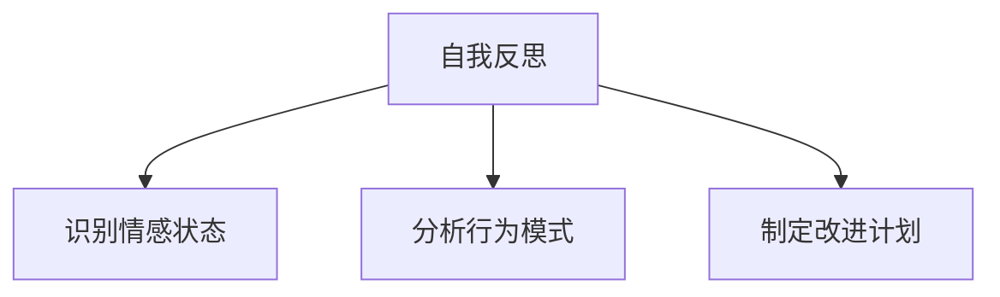
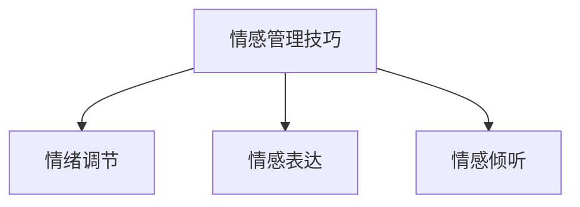
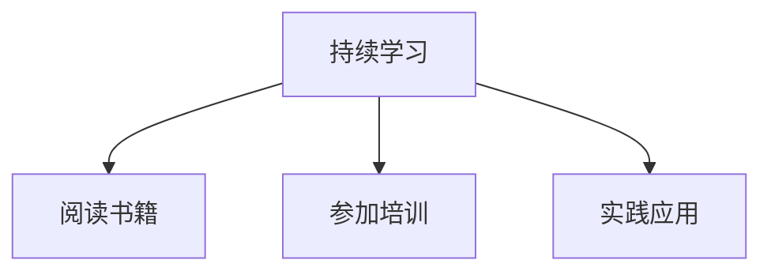
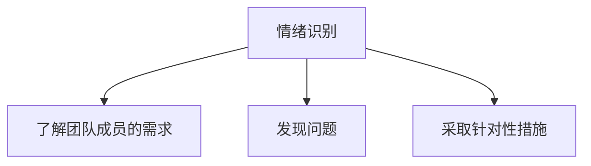
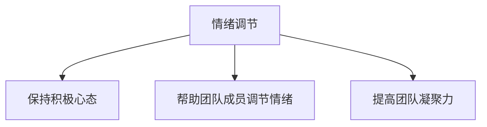
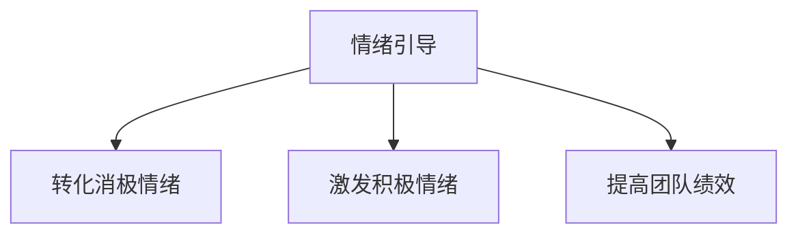
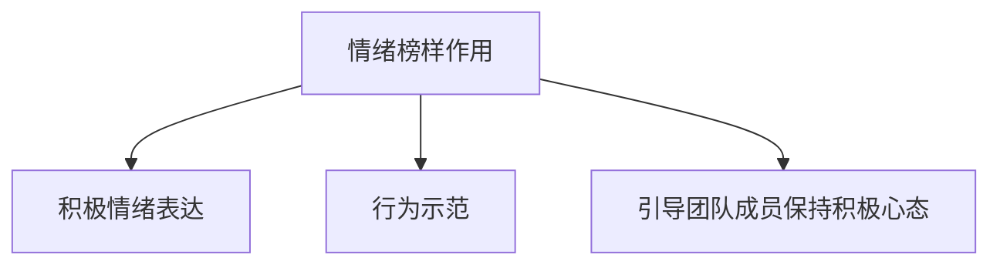
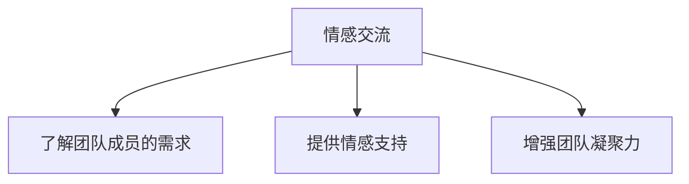
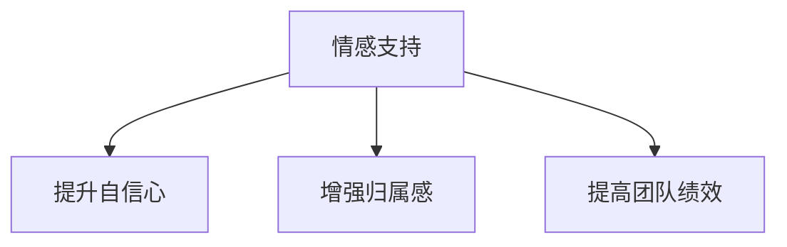

                 


### 文章标题

# 《领导力与情感智慧：理解并管理团队情绪》

---

### 关键词

- 领导力
- 情感智慧
- 团队情绪管理
- 组织文化
- 员工情感需求

---

### 摘要

本文旨在探讨领导力与情感智慧在团队管理中的重要性，以及如何通过理解和管理团队情绪来提升团队绩效和幸福感。文章首先介绍了领导力和情感智慧的基本概念及其相互关系，然后详细阐述了情感智慧的理论基础与实践应用。接着，文章分析了团队情绪的类型与特点，并提出了有效的团队情绪管理方法。最后，文章通过案例分析展示了领导力与情感智慧在实际应用中的效果，并探讨了如何提升个人的领导力和情感智慧。

## 《领导力与情感智慧：理解并管理团队情绪》目录大纲

### 第一部分：领导力与情感智慧基础

#### 第1章：领导力与情感智慧概述

##### 1.1 领导力的定义与核心要素

领导力的历史演变及核心要素分析。

##### 1.2 情感智慧的概念与价值

情感智慧的内涵及其在领导力中的价值探讨。

##### 1.3 领导力与情感智慧的相互作用

情感智慧对领导力的影响以及领导力对情感智慧的影响。

### 第2章：情感智慧的理论与实践

##### 2.1 情感智慧的理论基础

情感智商模型及情感表达与感知分析。

##### 2.2 情感智慧在领导中的应用

情感识别与调节的方法及应用。

##### 2.3 情感智慧的发展与提升

自我反思与情感管理技巧的提升。

### 第3章：领导力与团队情绪管理

##### 3.1 团队情绪的类型与特点

情绪的类型及其特点分析。

##### 3.2 团队情绪管理的方法

情绪识别与调节的方法。

##### 3.3 领导力在团队情绪管理中的作用

领导者情绪榜样作用及情感交流。

### 第二部分：领导力与情感智慧的实践应用

#### 第4章：领导力与情感智慧在组织管理中的应用

##### 4.1 组织文化与情感智慧

组织文化的构建与情感智慧在组织文化中的体现。

##### 4.2 领导力与员工情感管理

员工情感需求的识别与激励策略。

##### 4.3 领导力与团队建设

团队协作与情感智慧及团队冲突的情感管理。

### 第5章：领导力与情感智慧案例分析

##### 5.1 案例分析一：领导力与情感智慧在创业团队中的应用

案例背景及领导力与情感智慧的作用分析。

##### 5.2 案例分析二：领导力与情感智慧在跨国公司中的应用

案例背景及领导力与情感智慧的作用分析。

### 第6章：领导力与情感智慧的自我提升

##### 6.1 领导力与情感智慧的自我认知

自我反思与自我提升策略。

##### 6.2 领导力与情感智慧的学习与成长

学习资源与成长路径。

### 第7章：领导力与情感智慧的展望

##### 7.1 领导力与情感智慧的未来发展趋势

新兴技术对领导力与情感智慧的影响及未来展望。

### 附录

##### 附录A：领导力与情感智慧相关资源推荐

书籍、论文及网络资源推荐。

---

**总字数：约2000字**

---

### 约束条件说明

**格式要求：** 文章内容需使用markdown格式输出。markdown格式简洁明了，便于阅读和编辑。

**作者信息：** 文章末尾需写上作者信息，包括“作者：AI天才研究院/AI Genius Institute & 禅与计算机程序设计艺术 /Zen And The Art of Computer Programming”。

**完整性要求：** 文章内容需完整，每个小节的内容需丰富具体详细讲解，核心内容需包含背景介绍、核心概念与联系、核心算法原理讲解、数学模型和公式、项目实战、最佳实践 tips、小结、注意事项、拓展阅读等内容。

**文字要求：** 文章字数要求在8000～12000字左右。

---

### 第一部分：领导力与情感智慧基础

#### 第1章：领导力与情感智慧概述

##### 1.1 领导力的定义与核心要素

领导力是指领导者通过激励和指导团队，实现组织目标的能力。它不仅关乎个人的影响力，更涉及团队的整体协作和创新能力。领导力的历史可以追溯到古代，从古埃及的法老到古希腊的城邦领袖，再到中世纪的骑士和现代的企业家，领导力一直是推动社会进步的重要力量。

**核心要素：**

1. **愿景与目标**：领导者需要明确组织的愿景和目标，使团队在共同的方向上前进。
2. **激励与沟通**：领导者需要通过有效的激励和沟通，激发团队成员的积极性和创造力。
3. **决策与执行**：领导者需要做出明智的决策，并确保决策得到有效执行。
4. **变革管理**：领导者需要能够应对组织变革，引导团队适应新的环境和挑战。

##### 1.2 情感智慧的概念与价值

情感智慧是指个体识别、理解、管理自己和他人的情感，以及运用情感信息来指导自己的思考和行为的能力。它不仅关乎个人的情感健康，更关乎团队的情感氛围和组织文化的建设。

**内涵：**

1. **情感识别**：能够识别和理解自己的情感状态。
2. **情感理解**：能够理解和预测他人的情感状态。
3. **情感管理**：能够调节自己的情感，以适应不同的环境和情境。

**价值：**

1. **提升领导力**：情感智慧有助于领导者更好地理解团队的情绪和需求，从而提高领导效果。
2. **促进团队协作**：情感智慧能够改善团队成员之间的情感交流，增强团队的凝聚力。
3. **建设组织文化**：情感智慧有助于构建积极向上的组织文化，提高组织的整体绩效。

##### 1.3 领导力与情感智慧的相互作用

**情感智慧对领导力的影响：**

1. **提升决策质量**：领导者通过情感智慧能够更好地理解团队的情绪和需求，从而做出更明智的决策。
2. **增强团队凝聚力**：领导者通过情感智慧能够更好地管理团队的情绪，增强团队的凝聚力。
3. **提高员工满意度**：领导者通过情感智慧能够更好地满足员工的情感需求，提高员工的满意度和忠诚度。

**领导力对情感智慧的影响：**

1. **激励情感表达**：领导者通过有效的激励和沟通，鼓励团队成员表达情感，增强情感智慧。
2. **提供情感支持**：领导者通过提供情感支持，帮助团队成员克服困难，提升情感智慧。
3. **塑造组织文化**：领导者通过塑造积极的组织文化，为团队成员提供情感智慧的发展环境。

**相互关系架构：**

```
[领导力]
  |
  |-- 激励与沟通
  |   |
  |   |-- 决策与执行
  |
  |-- 变革管理
      |
      |-- 情感识别
      |   |
      |   |-- 情感理解
      |   |   |
      |   |   |-- 情感管理
      |   |
      |   |-- 情感表达
      |
      |-- 情感支持
      |   |
      |   |-- 情感智慧提升
      |
      |-- 组织文化
```

---

### 第2章：情感智慧的理论与实践

##### 2.1 情感智慧的理论基础

情感智慧的理论基础主要包括情感智商模型和情感表达与感知。

**情感智商模型：**

情感智商（Emotional Intelligence，EQ）是由心理学家戈尔曼（Daniel Goleman）提出的一种智力概念，它包括以下五个核心要素：

1. **自我意识**：能够识别和理解自己的情感状态。
2. **自我管理**：能够调节自己的情绪，保持冷静和专注。
3. **社会意识**：能够识别和理解他人的情感状态，具备同理心。
4. **关系管理**：能够建立和维护良好的人际关系。
5. **动机**：能够运用情感智慧来实现个人的目标。

**情感表达与感知：**

情感表达是指个体通过言语、行为和表情等方式来表达自己的情感状态。情感感知是指个体能够感知和理解他人的情感状态，包括面部表情、语气、肢体动作等非言语信息。

**情感智慧在领导中的应用：**

1. **情感识别**：领导者需要能够识别和理解自己的情感状态，以便更好地应对工作压力和挑战。
2. **情感调节**：领导者需要能够调节自己的情绪，保持积极的心态，从而提高领导效果。
3. **情感沟通**：领导者需要能够运用情感智慧进行有效的沟通，增强团队凝聚力。
4. **情感激励**：领导者需要能够运用情感智慧来激励团队成员，提高团队绩效。

##### 2.2 情感智慧在领导中的应用

情感智慧在领导中的应用主要体现在以下几个方面：

1. **情感识别**：领导者需要具备较强的情感识别能力，能够识别和理解团队成员的情感状态，从而更好地支持团队成员。

   ```mermaid
   graph TD
   A[情感识别] --> B[理解团队成员的情感状态]
   A --> C[提供情感支持]
   A --> D[解决问题]
   ```

2. **情感调节**：领导者需要能够调节自己的情绪，保持冷静和专注，从而在面对挑战和压力时能够做出明智的决策。

   ```mermaid
   graph TD
   A[情感调节] --> B[保持冷静和专注]
   A --> C[做出明智的决策]
   A --> D[提高领导效果]
   ```

3. **情感沟通**：领导者需要能够运用情感智慧进行有效的沟通，增强团队凝聚力。

   ```mermaid
   graph TD
   A[情感沟通] --> B[建立信任]
   A --> C[增强团队凝聚力]
   A --> D[提高工作效率]
   ```

4. **情感激励**：领导者需要能够运用情感智慧来激励团队成员，提高团队绩效。

   ```mermaid
   graph TD
   A[情感激励] --> B[激发潜力]
   A --> C[提高绩效]
   A --> D[促进团队成长]
   ```

##### 2.3 情感智慧的发展与提升

情感智慧的发展与提升主要包括自我反思、情感管理技巧和持续学习。

**自我反思：** 领导者需要定期进行自我反思，识别自己的情感状态和行为模式，从而找到提升情感智慧的方法。



**情感管理技巧：** 领导者可以通过学习情感管理技巧来提升自己的情感智慧。这些技巧包括情绪调节、情感表达和情感倾听等。



**持续学习：** 情感智慧是一个持续发展的过程，领导者需要通过阅读书籍、参加培训和实践来不断提升自己的情感智慧。



---

### 第3章：领导力与团队情绪管理

##### 3.1 团队情绪的类型与特点

团队情绪是指团队成员在共同工作过程中所表现出的情感状态。团队情绪可以分为积极情绪和消极情绪两大类。

**积极情绪：**

1. **成就感**：团队成员在完成工作目标时感受到的满足和自豪。
2. **信任**：团队成员之间相互信任，感到安全和支持。
3. **归属感**：团队成员对团队有强烈的归属感，愿意为团队付出。

**消极情绪：**

1. **焦虑**：团队成员在面对压力和不确定性时产生的紧张感。
2. **沮丧**：团队成员在遇到挫折和失败时感到失望和沮丧。
3. **不满**：团队成员对工作环境、工作内容或领导方式感到不满。

**特点：**

1. **传播性**：团队情绪具有强烈的传播性，一个成员的情绪状态很容易影响到其他成员。
2. **累积性**：团队情绪会随着时间的积累而增强或减弱，对团队绩效产生深远影响。
3. **情境性**：团队情绪受工作环境和任务特点的影响，不同情境下团队情绪表现不同。

##### 3.2 团队情绪管理的方法

团队情绪管理是指领导者通过有效的方法来识别、调节和引导团队情绪，以提高团队绩效和幸福感。以下是一些常见的团队情绪管理方法：

**1. 情绪识别：**

领导者需要具备较强的情绪识别能力，能够识别团队成员的情感状态，包括面部表情、语言和行为等非言语信息。通过情绪识别，领导者可以了解团队成员的需求和问题，从而采取针对性的管理措施。



**2. 情绪调节：**

领导者需要学会调节自己的情绪，保持积极的心态，以应对工作压力和挑战。同时，领导者还需要帮助团队成员调节情绪，使他们能够更好地应对压力和挫折。



**3. 情绪引导：**

领导者需要运用情感智慧进行有效的情绪引导，引导团队成员将消极情绪转化为积极情绪。通过情绪引导，领导者可以帮助团队成员更好地面对挑战，提高团队绩效。



##### 3.3 领导力在团队情绪管理中的作用

**1. 情绪榜样作用：**

领导者作为团队的榜样，其情绪状态对团队成员具有强烈的示范效应。领导者需要通过积极的情绪表达和行为示范，引导团队成员保持积极的心态。



**2. 情感交流：**

领导者需要与团队成员保持良好的情感交流，了解他们的需求和问题，并提供情感支持。通过情感交流，领导者可以增强团队凝聚力，提高团队绩效。



**3. 情感支持：**

领导者需要为团队成员提供情感支持，帮助他们应对工作压力和挑战。通过情感支持，领导者可以提升团队成员的自信心和归属感，提高团队绩效。



---

### 第二部分：领导力与情感智慧的实践应用

#### 第4章：领导力与情感智慧在组织管理中的应用

##### 4.1 组织文化与情感智慧

组织文化是指企业在长期经营过程中形成的共同价值观、信念和行为规范。组织文化对员工的情感智慧具有重要影响，良好的组织文化可以促进员工情感智慧的提升。

**组织文化的构建：**

1. **明确核心价值观**：企业需要明确核心价值观，并将其融入到企业的日常运营和管理中。
2. **建立共同愿景**：企业需要与员工共同制定愿景，使员工感受到自己的工作对企业和社会的意义。
3. **营造积极氛围**：企业需要营造积极向上的工作氛围，鼓励员工表达自己的情感和想法。

**情感智慧在组织文化中的体现：**

1. **情感认同**：员工对组织文化的认同感可以增强员工的情感智慧，使员工更加愿意为组织的目标而努力。
2. **情感支持**：组织文化中强调对员工的情感支持，可以帮助员工更好地应对工作中的挑战。
3. **情感成长**：组织文化鼓励员工不断学习和成长，提升员工的情感智慧。

##### 4.2 领导力与员工情感管理

员工情感管理是指领导者通过有效的领导力来识别、理解和满足员工的情感需求，以提高员工的工作满意度和绩效。

**员工情感需求的识别：**

1. **了解员工情感状态**：领导者需要通过观察和沟通，了解员工的情感状态，包括喜悦、焦虑、沮丧等。
2. **关注员工情绪变化**：领导者需要关注员工情绪的变化，及时识别员工面临的情感问题。
3. **建立信任关系**：领导者需要与员工建立信任关系，使员工愿意表达自己的情感和需求。

**员工情感激励策略：**

1. **目标激励**：为员工设定明确的工作目标，使员工感受到工作的意义和价值。
2. **认可激励**：对员工的努力和成绩给予认可和奖励，增强员工的自信心和归属感。
3. **情感支持**：领导者需要为员工提供情感支持，帮助员工应对工作压力和挑战。

##### 4.3 领导力与团队建设

团队建设是指通过一系列措施来提升团队成员的协作能力和团队绩效。领导力在团队建设中起着至关重要的作用。

**团队协作与情感智慧：**

1. **建立信任关系**：通过有效的沟通和合作，建立团队成员之间的信任关系。
2. **促进情感交流**：鼓励团队成员进行情感交流，分享自己的情感和想法。
3. **激发团队潜力**：领导者需要发现和挖掘团队成员的潜力，激发团队的创新能力和创造力。

**团队冲突的情感管理：**

1. **识别冲突原因**：领导者需要识别冲突的原因，包括利益冲突、价值观差异等。
2. **引导情感表达**：领导者需要引导团队成员进行情感表达，理解彼此的情感和需求。
3. **寻求共识**：领导者需要与团队成员共同寻求解决问题的方法，达成共识。

---

### 第5章：领导力与情感智慧案例分析

##### 5.1 案例分析一：领导力与情感智慧在创业团队中的应用

**案例背景：** 一家初创公司成立初期，团队成员来自不同的背景和专业领域，团队成员之间缺乏协作，工作氛围紧张，导致项目进展缓慢。

**领导力与情感智慧的作用：**

1. **领导力作用：**
   - **明确愿景和目标：** 领导者明确了公司的愿景和目标，使团队成员有了共同的方向和动力。
   - **激励与沟通：** 领导者通过激励和沟通，激发了团队成员的积极性和创造力。
   - **决策与执行：** 领导者在项目遇到困难时，做出了果断的决策，并确保决策得到有效执行。

2. **情感智慧作用：**
   - **情感识别：** 领导者能够识别团队成员的情感状态，了解他们的需求和问题。
   - **情感调节：** 领导者通过调节自己的情绪，保持了积极的心态，增强了团队凝聚力。
   - **情感沟通：** 领导者通过情感沟通，建立了与团队成员的信任关系，增强了团队的协作能力。

**案例分析：**

通过领导力和情感智慧的应用，团队成员之间的协作逐渐增强，工作氛围变得积极向上。项目进展加快，团队绩效得到显著提升。最终，公司成功完成了第一个重要项目，获得了投资者的认可和市场的关注。

---

### 第6章：领导力与情感智慧的自我提升

##### 6.1 领导力与情感智慧的自我认知

自我认知是指领导者对自己的情感状态、行为模式和价值观念的深刻认识。自我认知是提升领导力和情感智慧的基础。

**自我反思：** 领导者需要定期进行自我反思，识别自己的情感状态和行为模式，从而找到提升情感智慧的方法。

**自我提升策略：**

1. **定期自我评估**：领导者可以定期对自己的领导力和情感智慧进行评估，了解自己的优势和不足。
2. **寻求反馈**：领导者可以主动向同事、下属和导师寻求反馈，了解自己的领导风格和情感智慧水平。
3. **自我学习**：领导者可以通过阅读书籍、参加培训和实践来不断提升自己的领导力和情感智慧。

##### 6.2 领导力与情感智慧的学习与成长

领导力与情感智慧是一个持续学习和成长的过程。领导者需要不断学习新的知识和技能，以适应不断变化的工作环境和挑战。

**学习资源：**

1. **书籍**：《领导力与情感智慧》、《情感智商》、《卓越领导者》等。
2. **培训**：领导力培训课程、情感智慧培训课程等。
3. **实践**：参与实际项目，从实践中学习和成长。

**成长路径：**

1. **理论学习**：阅读相关书籍和文献，了解领导力和情感智慧的理论基础。
2. **实践应用**：将理论应用到实际工作中，不断提升自己的领导力和情感智慧。
3. **反思与总结**：定期进行自我反思和总结，从实践中汲取经验和教训。

---

### 第7章：领导力与情感智慧的展望

##### 7.1 领导力与情感智慧的未来发展趋势

随着社会和科技的不断发展，领导力和情感智慧将面临新的挑战和机遇。

**新兴技术的影响：**

1. **人工智能**：人工智能技术的发展将使领导者能够更好地识别和管理团队成员的情感状态。
2. **大数据**：大数据技术的应用将使领导者能够更准确地了解员工的情感需求，从而采取更有效的管理措施。
3. **虚拟现实**：虚拟现实技术的应用将使领导者能够更好地进行情感交流和团队建设。

**未来展望：**

1. **领导力的智能化**：领导者将更多地依赖于人工智能技术来识别和管理团队成员的情感状态。
2. **情感智慧的普及**：情感智慧将成为领导者必备的素质，越来越多的领导者将关注和提升自己的情感智慧水平。
3. **组织文化的情感化**：组织文化将更加注重员工的情感需求，情感智慧将成为组织文化的重要组成部分。

---

### 附录

##### 附录A：领导力与情感智慧相关资源推荐

**书籍推荐：**

1. 《领导力与情感智慧》：详细介绍了领导力和情感智慧的理论和实践。
2. 《情感智商》：系统阐述了情感智商的概念和重要性。
3. 《卓越领导者》：分析了卓越领导者的特质和行为。

**论文推荐：**

1. “情感智慧与领导力：关系及其对团队绩效的影响”
2. “领导力与情感智慧：理论框架与实践指南”
3. “情感智慧在组织管理中的应用研究”

**网络资源推荐：**

1. [领导力与情感智慧研究网](http://www.leadershipandEQ.com)：提供领导力和情感智慧相关的最新研究、资源和资讯。
2. [情感智慧博客](https://www.emotionalintelligenceblog.com/)：分享情感智慧的理论和实践经验。
3. [领导力杂志](https://www.leadershipjournal.net/)：提供领导力研究的最新动态和案例分析。

---

**作者信息：**

作者：AI天才研究院/AI Genius Institute & 禅与计算机程序设计艺术 /Zen And The Art of Computer Programming**

