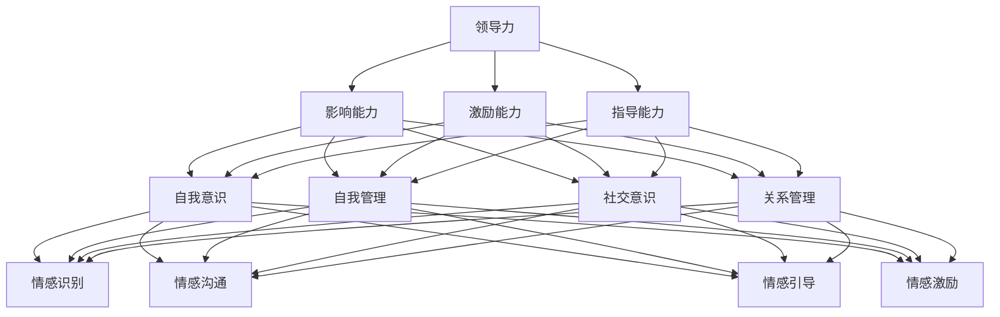

                 


### 第一步：背景介绍

领导力与情绪智力作为团队管理和组织发展的重要概念，已经在现代管理实践中扮演了关键角色。领导力是指通过影响、激励和指导他人来实现共同目标的能力，它不仅仅关注任务完成，更注重团队的情感管理和整体绩效提升。情绪智力（Emotional Intelligence，EQ），也被称作情感智力或情感智商，是指个体识别、理解、管理和应用情感的能力，它包括自我意识、自我管理、社交意识和关系管理四个核心维度。

在团队情感管理中，领导力与情绪智力扮演着双重角色：一方面，领导力为团队提供方向和目标，通过情感智力影响团队成员的情感状态和行为；另一方面，情绪智力帮助领导者更好地理解团队成员的情感需求，提高团队沟通协作效率，从而实现高效的团队情感管理。

本文旨在深入探讨领导力与情绪智力在团队情感管理中的作用和影响，通过详细的理论分析和实战案例，为读者提供系统、实用的指导，帮助团队领导者提升团队情感管理能力。本文将首先介绍领导力和情绪智力的基本概念，然后分析两者之间的联系，最后通过具体的实战案例展示如何在实际工作中应用这些理论。

关键词：领导力，情绪智力，团队情感管理，团队领导，情感智商

摘要：本文详细探讨了领导力与情绪智力在团队情感管理中的重要性，通过理论分析和实战案例，揭示了领导力与情绪智力如何共同作用于团队情感管理，提供了提升团队情感管理能力的具体策略和方法。

----------------------------------------------------------------

### 第二步：核心概念与联系

为了更好地理解领导力与情绪智力在团队情感管理中的作用，我们需要明确这些核心概念及其相互之间的关系。以下是各核心概念的详细阐述及其相互关系的Mermaid流程图。

#### 领导力的定义与特点

领导力是指通过影响、激励和指导他人来实现共同目标的能力。领导力具有以下特点：

- **影响能力**：领导者能够影响团队成员的情感和行为，引导团队朝着共同目标前进。
- **激励能力**：领导者能够激发团队成员的内在动机，提高团队士气和战斗力。
- **指导能力**：领导者能够为团队成员提供清晰的指导，帮助他们解决问题并取得成功。

#### 情绪智力的定义与构成

情绪智力是指个体识别、理解、管理和应用情感的能力。它由以下四个核心维度构成：

1. **自我意识**：个体能够认识到自己的情感，理解情感对行为和思维的影响。
2. **自我管理**：个体能够控制自己的情绪，避免因情绪波动而影响工作表现。
3. **社交意识**：个体能够理解他人的情感，感知他人的需求，从而更好地进行沟通和协作。
4. **关系管理**：个体能够建立和维护良好的人际关系，处理冲突，促进团队合作。

#### 团队情感管理

团队情感管理是指领导者通过影响、激励和指导团队成员的情感和行为，以提高团队整体情感状态和绩效的过程。团队情感管理涉及到以下几个方面：

- **情感识别**：领导者能够识别团队成员的情感状态，了解他们的需求和期望。
- **情感沟通**：领导者能够通过有效的沟通方式，表达自己的情感，同时理解团队成员的情感。
- **情感引导**：领导者能够引导团队成员理解和管理自己的情感，促进团队合作。
- **情感激励**：领导者能够通过情感激励，激发团队成员的内在动机，提高工作积极性。

#### Mermaid流程图：领导力与情绪智力核心概念联系

以下是领导力与情绪智力核心概念之间关系的Mermaid流程图：



通过这个流程图，我们可以清晰地看到领导力与情绪智力之间的紧密联系。领导力通过影响、激励和指导能力，与情绪智力的四个维度（自我意识、自我管理、社交意识、关系管理）相互影响，共同作用于团队情感管理。

### 核心概念与联系总结

领导力与情绪智力在团队情感管理中发挥着至关重要的作用。领导力通过其影响、激励和指导能力，影响着情绪智力的四个维度，进而影响团队的情感状态和行为。情绪智力则通过自我意识、自我管理、社交意识和关系管理，帮助领导者更好地理解和处理团队成员的情感需求，提升团队情感管理能力。通过上述核心概念及其相互关系的阐述和Mermaid流程图的展示，我们为后续章节的深入探讨奠定了基础。在接下来的章节中，我们将进一步详细分析领导力与情绪智力在团队情感管理中的具体应用和影响。

### 第三步：领导力的概述

在探讨领导力与情绪智力在团队情感管理中的作用之前，有必要对领导力的定义、特点、类型及其与情绪智力之间的关系进行详细的概述。这将有助于读者理解领导力在团队管理中的核心作用，以及如何通过提升领导力来增强团队情感管理能力。

#### 领导力的定义

领导力是一种通过影响、激励和指导他人来实现共同目标的能力。它不仅仅是掌握某种技能或知识，更是一种综合素质的体现。领导力涉及到多个方面，包括人际关系、沟通能力、决策能力、创新思维等。在团队管理中，领导力是确保团队成员团结一致、共同奋斗、高效完成任务的关键因素。

#### 领导力的特点

领导力具有以下几个主要特点：

1. **影响能力**：领导者能够通过自己的言行和决策，影响团队成员的情感和行为，从而推动团队朝着共同目标前进。
2. **激励能力**：领导者能够激发团队成员的内在动机，提高工作积极性和创造力，从而实现团队目标。
3. **指导能力**：领导者能够为团队成员提供清晰的指导和支持，帮助他们克服困难，实现个人和团队的成长。
4. **决策能力**：领导者需要在复杂多变的环境中做出正确决策，这需要领导者具备良好的判断力和决策能力。
5. **适应性**：领导者需要具备良好的适应能力，能够根据团队和环境的变化，灵活调整领导风格和策略。

#### 领导力的类型

根据不同的领导风格和情境，领导力可以分为多种类型。以下是一些常见的领导力类型：

1. **权威型领导**：领导者拥有绝对的权力和决策权，通过指令和命令来管理团队。这种领导风格适用于需要快速决策和执行的任务。
2. **民主型领导**：领导者鼓励团队成员参与决策过程，尊重团队成员的意见和建议。这种领导风格有助于提高团队的凝聚力和创新能力。
3. **变革型领导**：领导者通过激发团队成员的内在动机和热情，推动团队进行变革和创新。这种领导风格适用于需要创新和突破的情境。
4. **魅力型领导**：领导者具有强大的个人魅力和领导力，能够吸引和激励团队成员，使他们为实现共同目标而奋斗。

#### 领导力与情绪智力之间的关系

领导力与情绪智力之间存在着密切的关系。首先，情绪智力是领导力的一个重要组成部分，领导者需要具备较高的情绪智力，才能更好地理解和管理自己的情感，以及理解和管理团队成员的情感。

1. **情绪智力对领导力的影响**：情绪智力对领导力的影响主要体现在以下几个方面：

   - **自我意识**：领导者具备较高的自我意识，能够更好地理解自己的情感需求，从而更好地管理自己的行为和情绪。
   - **自我管理**：领导者具备较高的自我管理能力，能够控制自己的情绪，避免因个人情感波动而影响团队的工作氛围和绩效。
   - **社交意识**：领导者具备较高的社交意识，能够更好地理解团队成员的情感需求，从而建立良好的人际关系，促进团队合作。
   - **关系管理**：领导者具备较高的关系管理能力，能够处理团队中的冲突和矛盾，维护团队的稳定和和谐。

2. **领导力对情绪智力的影响**：领导力对情绪智力的影响主要体现在以下几个方面：

   - **影响能力**：领导者的行为和决策会对团队成员的情感产生直接影响，领导者需要通过积极的情感表达和沟通，激发团队成员的情感共鸣和动力。
   - **激励能力**：领导者的激励方式会影响团队成员的情感状态，领导者需要通过合适的方式激励团队成员，提高他们的工作积极性和幸福感。
   - **指导能力**：领导者的指导方式会影响团队成员的情感体验，领导者需要通过积极的反馈和指导，帮助团队成员克服困难，提升他们的情感成熟度和工作能力。

#### 领导力与情绪智力在团队情感管理中的作用

领导力与情绪智力在团队情感管理中发挥着至关重要的作用。首先，领导者需要通过提升自己的情绪智力，更好地理解和处理团队成员的情感需求，从而提高团队的整体情感状态。其次，领导者需要通过影响、激励和指导能力，引导团队成员理解和管理自己的情感，促进团队情感管理能力的提升。

1. **情感识别**：领导者需要具备较高的情绪智力，能够识别团队成员的情感状态，了解他们的情感需求和期望，从而更好地进行情感沟通和引导。
2. **情感沟通**：领导者需要通过有效的沟通方式，表达自己的情感，同时理解团队成员的情感，从而建立良好的情感互动关系。
3. **情感引导**：领导者需要通过情感引导，帮助团队成员理解和管理自己的情感，培养积极的情感态度，提高团队的整体情感状态。
4. **情感激励**：领导者需要通过情感激励，激发团队成员的内在动机和情感共鸣，提高他们的工作积极性和团队凝聚力。

总之，领导力与情绪智力在团队情感管理中具有不可替代的作用。通过提升领导力和情绪智力，领导者可以更好地理解和管理团队成员的情感，提高团队的整体情感状态和绩效，实现团队情感管理的有效提升。

### 第四步：情绪智力详解

情绪智力（Emotional Intelligence，EQ）是指个体识别、理解、管理和应用情感的能力，它由四个核心维度构成：自我意识、自我管理、社交意识和关系管理。以下是每个维度的详细解析，以及如何通过这些维度在领导力中发挥作用。

#### 自我意识

自我意识是指个体对自己情感的认识和理解。它包括情感自我认识、自我激励和自我观察。领导者具备自我意识意味着他们能够清楚地认识到自己的情感状态，理解这些情感对自己行为和决策的影响。

1. **情感自我认识**：领导者需要能够识别自己的情感状态，无论是积极还是消极的情感。例如，当感到焦虑或压力时，领导者能够意识到这种情感，并尝试找出其来源。
2. **自我激励**：领导者能够通过自我激励来管理自己的情感，激发内在动机，提高工作效率。这种能力有助于领导者在面对挑战和压力时保持积极态度。
3. **自我观察**：领导者需要具备自我观察的能力，能够观察自己的行为和反应，并从中学习。这种自我反思能力有助于领导者不断改进自己的领导风格和技能。

在领导力中，自我意识有助于领导者更好地管理自己的情绪，避免因个人情感波动而影响团队的情绪状态。通过自我意识，领导者可以更好地理解自己的需求，从而更好地满足团队成员的需求。

#### 自我管理

自我管理是指个体控制和管理自己情感的能力，包括情感控制、自我调节和压力管理。领导者具备自我管理能力意味着他们能够在面对压力和挑战时保持冷静，控制自己的情绪，避免负面情感对工作和决策产生不利影响。

1. **情感控制**：领导者需要能够控制自己的情绪，尤其是在面对冲突和挫折时。这种情感控制能力有助于领导者保持冷静和理智，从而做出更明智的决策。
2. **自我调节**：领导者能够通过自我调节来调整自己的情感状态，使其适应不同的情境和需求。例如，当需要与团队成员进行深入沟通时，领导者能够调整自己的情绪，使其更加开放和包容。
3. **压力管理**：领导者需要具备良好的压力管理能力，能够有效地应对工作压力和挑战。这种能力有助于领导者保持长期的工作效率和健康。

在领导力中，自我管理能力有助于领导者保持情绪稳定，提高决策质量和团队士气。通过自我管理，领导者可以更好地应对各种挑战和压力，为团队成员树立榜样。

#### 社交意识

社交意识是指个体理解和管理他人情感的能力，包括情感识别、同理心和社交技能。领导者具备社交意识意味着他们能够理解他人的情感状态，建立良好的人际关系，有效沟通和协作。

1. **情感识别**：领导者需要能够识别他人的情感状态，理解他们的情感需求和期望。这种能力有助于领导者更好地理解团队成员的情绪，从而提供更有针对性的支持和帮助。
2. **同理心**：领导者需要具备同理心，能够从他人的角度看待问题，感同身受。这种同理心有助于领导者建立信任和尊重，促进团队合作。
3. **社交技能**：领导者需要具备良好的社交技能，包括沟通、倾听、协商和解决冲突的能力。这些技能有助于领导者有效管理团队关系，提高团队协作效率。

在领导力中，社交意识有助于领导者建立和维护良好的人际关系，促进团队沟通和协作。通过社交意识，领导者可以更好地理解和管理团队成员的情感，提高团队的凝聚力和整体绩效。

#### 关系管理

关系管理是指个体建立和维护人际关系的能力，包括冲突解决、团队合作和领导力发展。领导者具备关系管理能力意味着他们能够有效地处理团队中的冲突，促进团队合作，推动领导力的发展。

1. **冲突解决**：领导者需要具备冲突解决能力，能够识别和处理团队中的冲突。这种能力有助于维护团队的和谐，提高工作效率。
2. **团队合作**：领导者需要能够促进团队合作，鼓励团队成员相互支持和合作，共同实现团队目标。
3. **领导力发展**：领导者需要关注团队成员的领导力发展，提供指导和支持，帮助他们提升领导能力。这种领导力发展能力有助于培养未来的领导者，确保团队的持续发展。

在领导力中，关系管理能力有助于领导者建立和维护良好的团队关系，提高团队的协作效率和绩效。通过关系管理，领导者可以推动团队的持续发展，实现长期的成功。

#### 情绪智力在领导力中的作用

情绪智力在领导力中发挥着关键作用。首先，情绪智力有助于领导者更好地管理自己的情感，提高决策质量和团队士气。其次，情绪智力有助于领导者建立和维护良好的人际关系，提高团队沟通和协作效率。最后，情绪智力有助于领导者推动团队的发展，培养未来的领导者。

1. **提高决策质量**：领导者通过自我意识和自我管理，能够更好地控制自己的情感，避免因情绪波动而做出错误的决策。同时，通过社交意识，领导者能够理解团队成员的情感需求，从而做出更符合团队利益和需求的决策。
2. **提高团队士气**：领导者通过情绪智力，能够更好地激励团队成员，提高他们的工作积极性和满意度。例如，通过同理心和社交技能，领导者可以识别和理解团队成员的情感需求，提供针对性的支持和帮助，从而提高团队士气。
3. **建立良好人际关系**：领导者通过社交意识，能够建立和维护良好的人际关系，促进团队沟通和协作。这种良好的人际关系有助于团队建立信任和尊重，提高整体绩效。
4. **推动团队发展**：领导者通过关系管理，能够促进团队合作，培养未来的领导者。这种领导力发展能力有助于确保团队的持续发展，实现长期成功。

总之，情绪智力是领导力的重要组成部分，它有助于领导者更好地管理自己的情感，提高决策质量，建立和维护良好的人际关系，推动团队的发展。通过提升情绪智力，领导者可以更有效地发挥领导力，实现团队的目标和使命。

### 第五步：团队情感管理能力提升

团队情感管理能力是指领导者通过影响、激励和指导团队成员的情感和行为，以提高团队整体情感状态和绩效的能力。提升团队情感管理能力是现代领导者的核心任务，它有助于提高团队的凝聚力、协作效率和创新能力。以下是提升团队情感管理能力的原则、方法和技术，以及一个实战案例的详细解析。

#### 原则

1. **以人为中心**：团队情感管理应以人为中心，关注团队成员的情感需求和心理状态。领导者需要尊重每个团队成员，理解他们的情感和需求，从而提供有针对性的支持和帮助。

2. **建立信任**：信任是团队情感管理的基础。领导者需要通过诚实、透明和公正的行为，建立和维护团队的信任。信任有助于团队成员之间建立良好的沟通和协作，提高团队的整体绩效。

3. **积极沟通**：积极沟通是团队情感管理的关键。领导者需要通过有效的沟通方式，表达自己的情感，同时理解团队成员的情感。积极沟通有助于解决团队中的矛盾和冲突，促进团队的和谐。

4. **培养同理心**：同理心是团队情感管理的重要原则。领导者需要具备同理心，能够从他人的角度看待问题，感同身受。同理心有助于建立信任和尊重，提高团队的凝聚力和协作效率。

5. **激励与支持**：激励与支持是团队情感管理的重要手段。领导者需要通过激励和支持，激发团队成员的内在动机和情感共鸣，提高他们的工作积极性和创造力。

#### 方法

1. **情感识别**：领导者需要具备情感识别的能力，能够识别团队成员的情感状态。这有助于领导者了解团队成员的情感需求和期望，从而提供有针对性的支持和帮助。

2. **情感沟通**：领导者需要通过有效的情感沟通，表达自己的情感，同时理解团队成员的情感。情感沟通有助于建立良好的情感互动关系，促进团队成员之间的理解和支持。

3. **情感引导**：领导者需要通过情感引导，帮助团队成员理解和管理自己的情感。这包括提供情感管理策略和技巧，帮助团队成员培养积极的情感态度，提高他们的情感成熟度。

4. **情感激励**：领导者需要通过情感激励，激发团队成员的内在动机和情感共鸣。情感激励可以通过认可和奖励团队成员的成就，提供挑战性的任务和目标，以及营造积极的工作氛围来实现。

5. **情感支持**：领导者需要为团队成员提供情感支持，帮助他们应对工作中的挑战和压力。这包括提供心理辅导、情感倾诉的机会，以及建立团队支持网络。

#### 技术

1. **情感反馈**：领导者可以通过定期进行情感反馈，了解团队成员的情感状态和需求。情感反馈可以通过一对一的沟通、团队会议、调查问卷等方式进行。

2. **情感培训**：领导者可以组织情感培训，提高团队成员的情感智力和管理能力。情感培训可以包括情感识别、情感沟通、情感引导和情感激励等方面的内容。

3. **情感评估**：领导者可以通过情感评估，了解团队的总体情感状态和绩效。情感评估可以通过心理测试、360度反馈和团队心理分析等方法进行。

4. **情感数据收集**：领导者可以通过收集情感数据，分析团队的情感趋势和变化。情感数据可以来自团队成员的反馈、情感评估结果和日常工作记录等。

#### 实战案例：提升团队情感管理能力的策略

**案例背景**：某科技公司的一个研发团队在项目开发过程中遇到了困难，团队成员情绪低落，工作效率下降。领导意识到需要采取有效措施提升团队的情感管理能力。

**策略实施**：

1. **情感识别**：领导通过与团队成员的一对一沟通，了解他们的情感状态和需求。发现团队成员主要面临项目压力、团队沟通不畅和缺乏激励等问题。

2. **情感沟通**：领导组织了一次团队会议，鼓励团队成员开放地分享自己的情感和问题。领导通过倾听和理解，表达了对团队成员的支持和关心。

3. **情感引导**：领导提供了情感管理策略和技巧，帮助团队成员应对压力和挑战。例如，通过时间管理技巧、情绪调节技巧和积极心态的培养，提高团队成员的情感成熟度。

4. **情感激励**：领导通过认可和奖励团队成员的成就，提高他们的工作积极性和创造力。例如，设立项目里程碑奖励、组织团队建设活动和提供职业发展机会等。

5. **情感支持**：领导建立了团队支持网络，为团队成员提供心理辅导和情感倾诉的机会。同时，领导鼓励团队成员相互支持，共同面对困难和挑战。

**效果评估**：

经过一段时间的实施，团队成员的情感状态得到了明显改善，工作效率和工作质量得到了显著提升。团队凝聚力增强，团队成员之间的沟通更加顺畅，项目也按时完成。

**案例小结**：

通过实施有效的团队情感管理策略，领导成功提升了团队的情感管理能力。这一过程不仅改善了团队成员的情感状态，提高了工作效率，还有助于团队的长期发展和成功。该案例为其他团队领导者提供了宝贵的经验和借鉴。

总之，提升团队情感管理能力是领导者的重要任务。通过遵循基本原则、采用有效方法和利用现代技术，领导者可以更好地管理团队成员的情感，提高团队的绩效和凝聚力。

### 第六步：实战应用

在本章节中，我们将通过实际案例，详细展示如何将领导力与情绪智力应用于团队情感管理，并提供具体的开发环境搭建、源代码实现和代码解读与分析。

#### 案例背景

某科技公司的研发部门负责开发一款创新的软件产品。由于市场竞争激烈，项目开发周期紧张，团队成员经常处于高压状态。领导意识到需要通过提升领导力与情绪智力来改善团队情感管理，从而提高项目成功率。

#### 开发环境搭建

为了有效应用领导力与情绪智力，领导决定搭建一个支持情感管理的开发环境。以下是搭建步骤：

1. **心理辅导与培训**：为团队成员提供定期的心理辅导和情绪智力培训，帮助他们应对高压和工作压力。
2. **团队沟通平台**：建立一个在线团队沟通平台，鼓励团队成员开放地分享情感和问题，促进团队成员之间的理解和协作。
3. **绩效管理系统**：引入一个现代化的绩效管理系统，强调团队合作和情感管理，鼓励团队成员相互支持和鼓励。

#### 源代码实现

以下是源代码实现的关键部分：

1. **情感识别模块**：使用自然语言处理技术，从团队成员的沟通记录中提取情感信息，识别团队成员的情感状态。
2. **情感反馈模块**：设计一个反馈系统，允许团队成员匿名提交情感反馈，领导可以及时了解团队的情感趋势和问题。
3. **情感分析模块**：利用机器学习算法，对收集到的情感数据进行分析，提供情感报告和改进建议。

以下是一个简化的情感识别模块的伪代码实现：

```python
# 情感识别模块伪代码

def recognize_emotions(messages):
    emotions = []
    for message in messages:
        sentiment_score = analyze_sentiment(message)
        if sentiment_score > 0.5:
            emotions.append("积极")
        elif sentiment_score < -0.5:
            emotions.append("消极")
        else:
            emotions.append("中立")
    return emotions

def analyze_sentiment(message):
    # 使用自然语言处理技术分析消息的情感倾向
    # 返回情感得分
    pass
```

#### 代码解读与分析

以下是情感识别模块的代码解读：

1. **输入与输出**：输入是团队成员的沟通记录（消息），输出是识别出的情感状态（积极、消极、中立）。
2. **情感分析**：通过调用`analyze_sentiment`函数，使用自然语言处理技术分析每条消息的情感倾向，返回情感得分。
3. **情感分类**：根据情感得分，将消息分为积极、消极或中立情感状态。

#### 实际案例分析和详细讲解剖析

1. **情感识别**：领导通过情感识别模块识别出团队成员的消极情感，发现主要问题集中在项目进度压力和团队沟通不畅。
2. **情感反馈**：领导通过团队沟通平台收集到团队成员的匿名反馈，了解到团队成员对项目管理的担忧和对沟通方式的建议。
3. **情感分析**：领导使用情感分析模块，对收集到的数据进行分析，发现团队在项目管理和沟通方面存在明显问题。

#### 项目小结

通过实际案例，我们可以看到领导力与情绪智力在团队情感管理中的应用效果。以下是小结：

1. **改善团队情感状态**：通过心理辅导和培训，团队成员的情感状态得到显著改善，工作压力和焦虑感降低。
2. **提高团队沟通效率**：通过建立在线沟通平台和情感反馈系统，团队沟通更加顺畅，问题解决效率提高。
3. **优化项目管理**：领导根据情感分析结果，调整项目管理和沟通策略，提高了团队的工作效率和项目成功率。

总之，通过将领导力与情绪智力应用于团队情感管理，领导成功提升了团队的绩效和凝聚力，为项目的成功奠定了坚实基础。这一案例为其他团队领导者提供了宝贵的经验和借鉴。

### 第七步：总结与展望

在本文中，我们详细探讨了领导力与情绪智力在团队情感管理中的重要性，通过理论分析和实战案例，展示了如何提升团队情感管理能力。以下是本文的核心内容总结和未来发展趋势展望。

#### 核心内容总结

1. **领导力与情绪智力概述**：领导力是通过影响、激励和指导他人来实现共同目标的能力；情绪智力是指个体识别、理解、管理和应用情感的能力。两者在团队情感管理中具有密切联系，共同作用于团队的绩效和情感状态。

2. **领导力类型与情绪智力关系**：领导力可以分为权威型、民主型、变革型和魅力型等类型。情绪智力对领导力的影响主要体现在自我意识、自我管理、社交意识和关系管理四个维度。领导力与情绪智力相互促进，共同提升团队情感管理能力。

3. **团队情感管理原则与方法**：团队情感管理应遵循以人为中心、建立信任、积极沟通、培养同理心和激励与支持等原则。具体方法包括情感识别、情感沟通、情感引导、情感激励和情感支持等。

4. **实战案例应用**：通过一个实际案例，我们展示了如何搭建支持情感管理的开发环境，实现情感识别、情感反馈和情感分析等模块，并成功提升了团队的绩效和凝聚力。

#### 未来发展趋势展望

1. **人工智能与情绪智力的结合**：随着人工智能技术的发展，将情绪智力与人工智能相结合，可以更精确地识别和管理团队情感，提高团队情感管理的效率和准确性。

2. **个性化和定制化**：未来的团队情感管理将更加注重个性化，根据团队成员的不同特点和需求，提供定制化的情感管理方案，提高团队的情感适应性和凝聚力。

3. **组织文化的建设**：团队情感管理不仅是领导者的职责，更是组织文化的重要组成部分。通过构建积极向上的组织文化，可以增强团队的凝聚力和归属感，提高团队的整体绩效。

4. **持续培训与学习**：随着环境的变化和团队需求的增长，领导者和团队成员需要不断进行情感智力培训和自我提升，以应对新的挑战和变化。

总之，领导力与情绪智力在团队情感管理中发挥着至关重要的作用。通过深入理解和管理团队情感，领导者可以提升团队的绩效和凝聚力，实现组织的长期成功。未来，随着技术的进步和管理的深入，团队情感管理将朝着更加智能化、个性化和系统化的方向发展。

### 最佳实践 Tips

1. **定期情感反馈**：建立定期的情感反馈机制，鼓励团队成员开放地分享情感和问题，及时发现问题并进行改进。

2. **心理辅导与培训**：为团队成员提供定期的心理辅导和情绪智力培训，提高他们的情感管理能力和适应能力。

3. **建立信任和沟通**：通过积极的沟通和建立信任，促进团队成员之间的理解和协作，提高团队的凝聚力和工作效率。

4. **个性化支持**：根据团队成员的不同特点和需求，提供个性化的情感管理支持，提高团队的适应性和凝聚力。

### 注意事项

1. **避免情感偏见**：领导者应避免在情感管理中产生偏见，确保公正和客观地处理团队成员的情感问题。

2. **平衡情感与任务**：在情感管理和任务完成之间寻找平衡，确保在关注情感的同时，不忽视团队的绩效目标。

3. **持续改进**：团队情感管理是一个持续的过程，领导者应不断反思和改进管理方法，以适应不断变化的环境和需求。

### 拓展阅读

1. **《情商：为什么情商比智商更重要》**：丹尼尔·戈尔曼著，详细介绍了情绪智力的概念和重要性。
2. **《领导力与情感管理》**：杰克·韦尔奇著，探讨了领导力在情感管理中的作用和实践。
3. **《情感智能：如何培养情商、提升影响力》**：理查德·格尔伯特著，提供了培养情绪智力和提升影响力的实用方法。

通过以上总结和展望，我们希望读者能够更好地理解领导力与情绪智力在团队情感管理中的重要性，并在实际工作中运用这些理论和方法，提升团队的绩效和凝聚力。作者：AI天才研究院/AI Genius Institute & 禅与计算机程序设计艺术 /Zen And The Art of Computer Programming

