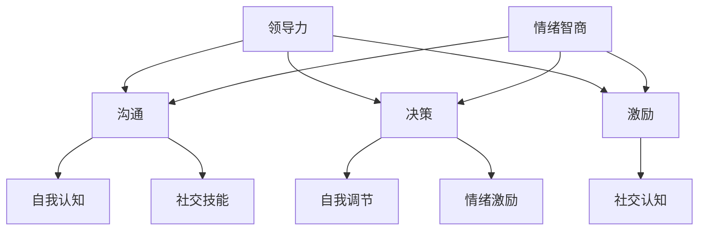

                 


### 文章标题

# 领导力与情绪智商提升：掌控团队情绪动态

### 文章关键词

- 领导力
- 情绪智商
- 团队情绪动态
- 管理策略
- 实战案例分析

### 文章摘要

本文探讨了领导力与情绪智商在团队管理中的重要作用。首先，介绍了领导力和情绪智商的核心概念，并分析了它们之间的内在联系。接着，文章提出了提升情绪智商的策略和方法，以及如何运用这些策略来管理团队情绪动态。通过实战案例分析和详细讲解，本文旨在为管理者提供实用的工具和技巧，以提升团队的整体表现和员工满意度。

### 目录大纲

1. **引言**
2. **领导力的定义与重要性**
3. **情绪智商的概念与作用**
4. **领导力与情绪智商的关系架构图**
5. **提升情绪智商的策略与方法**
6. **团队情绪动态管理**
7. **情绪智商在领导决策中的应用**
8. **实战案例分析**
9. **情绪智商提升的实践与工具**
10. **项目实战：情绪智商提升项目实施**
11. **最佳实践与小结**
12. **注意事项与拓展阅读**
13. **作者信息**

## 1. 引言

在当今快节奏和高度竞争的商业环境中，领导力已成为企业成功的关键因素之一。而情绪智商作为领导力的重要组成部分，也逐渐受到更多管理者的重视。情绪智商不仅关乎个人情感健康，更直接影响团队的整体绩效和员工满意度。因此，掌握并提升情绪智商，对于领导者来说至关重要。

本文旨在探讨领导力与情绪智商之间的关系，并提出一系列提升情绪智商的策略与方法。此外，本文还将通过实战案例分析和项目实施，为管理者提供实用的工具和技巧，以更好地掌控团队情绪动态，提升团队绩效。

## 2. 领导力的定义与重要性

领导力是一个广泛而多维的概念，它涉及多个方面，包括但不限于沟通、决策、激励、组织等。根据麦肯锡公司的一项研究，领导力是影响企业绩效的关键因素之一。有效的领导力能够促进创新、提高员工满意度，并最终推动企业实现长期增长。

领导力的重要性主要体现在以下几个方面：

### 2.1 促进团队协作

有效的领导者能够激发团队成员的潜力，推动他们共同实现团队目标。通过建立积极的团队氛围，领导者可以促进团队成员之间的协作和沟通，提高团队的整体绩效。

### 2.2 激发员工潜力

领导者通过了解和满足员工的需求，能够激发员工的潜力，提高员工的工作满意度和忠诚度。这种激励不仅有助于提高个人绩效，还能推动整个团队的发展。

### 2.3 应对变革与挑战

在快速变化的市场环境中，领导者需要具备适应变革和应对挑战的能力。通过有效的领导力，领导者可以引导团队应对外部压力，确保企业的稳定发展。

## 3. 情绪智商的概念与作用

情绪智商，又称情商（Emotional Intelligence，简称EQ），是一种理解、管理自己情绪，并识别、影响他人情绪的能力。根据戈尔曼（Daniel Goleman）的研究，情绪智商主要包括五个关键领域：自我认知、自我调节、社交认知、社交技能和情绪激励。

### 3.1 自我认知

自我认知是指了解自己的情绪状态、需求和价值观。一个高自我认知的人能够更好地管理自己的情绪和行为。

### 3.2 自我调节

自我调节是指控制自己的情绪和行为，以适应不同的环境和情境。自我调节能力强大的人能够在压力下保持冷静和专注。

### 3.3 社交认知

社交认知是指理解他人情绪和需求的能力。这种能力有助于建立良好的人际关系，提高沟通效果。

### 3.4 社交技能

社交技能是指与他人建立和维护良好关系的能力。一个拥有高社交技能的人能够有效地与他人沟通、合作，并解决冲突。

### 3.5 情绪激励

情绪激励是指通过激发积极情绪来推动自己和他人实现目标的能力。情绪激励能够提高工作动力，增强团队凝聚力。

情绪智商在领导力中起着至关重要的作用。一个高情绪智商的领导者能够更好地理解和管理自己的情绪，从而更有效地影响和激励团队成员。此外，情绪智商还帮助领导者建立和维护良好的人际关系，提高团队协作效率。

### 4. 领导力与情绪智商的关系架构图

为了更清晰地展示领导力与情绪智商之间的关系，我们使用Mermaid流程图来描述它们的核心概念和联系。



从流程图中可以看出，领导力的各个方面（沟通、决策、激励）都与情绪智商的核心领域（自我认知、自我调节、社交认知、社交技能、情绪激励）紧密相关。这表明，提升情绪智商对于提升领导力至关重要。

### 5. 提升情绪智商的策略与方法

要提升情绪智商，需要从多个方面入手，包括自我认知、自我调节、社交认知、社交技能和情绪激励。以下是一些实用的策略和方法：

#### 5.1 自我认知

- **反思日记**：每天花时间记录自己的情绪、想法和行为，了解自己的情绪状态和触发因素。
- **自我观察**：在日常生活中，注意观察自己的情绪变化，学会识别和管理负面情绪。

#### 5.2 自我调节

- **情绪调节训练**：通过冥想、呼吸练习等方法，学会在压力下保持冷静和专注。
- **积极心态**：培养乐观心态，面对困难和挑战时，保持积极的态度。

#### 5.3 社交认知

- **倾听**：学会倾听他人的观点和感受，增强对他人情绪的理解。
- **同理心**：培养同理心，设身处地地理解他人的情绪和需求。

#### 5.4 社交技能

- **有效沟通**：提高沟通技巧，学会清晰、准确地表达自己的想法和感受。
- **冲突解决**：学习冲突解决的策略和方法，避免负面情绪的积累。

#### 5.5 情绪激励

- **目标设定**：设定明确的个人和团队目标，激发工作动力。
- **积极反馈**：给予自己和他人积极的反馈，增强信心和动力。

### 6. 团队情绪动态管理

团队情绪动态是指团队成员在共同工作中产生的各种情绪反应和互动过程。有效的团队情绪管理对于提升团队绩效和员工满意度至关重要。以下是一些团队情绪动态管理的策略：

#### 6.1 建立积极的团队氛围

- **鼓励开放沟通**：鼓励团队成员表达自己的观点和感受，建立信任和尊重的团队文化。
- **提供支持**：关注团队成员的情绪变化，提供必要的支持和帮助。

#### 6.2 提高团队成员的情绪智商

- **培训**：组织情绪智商培训，提高团队成员的情绪认知和管理能力。
- **案例分享**：分享成功和失败的案例，让团队成员了解情绪智商在实际工作中的应用。

#### 6.3 应对负面情绪

- **积极应对**：面对负面情绪，采取积极的应对策略，避免负面情绪的扩散。
- **沟通解决**：通过有效沟通，解决团队成员之间的矛盾和冲突，维护团队和谐。

### 7. 情绪智商在领导决策中的应用

情绪智商在领导决策中起着至关重要的作用。一个高情绪智商的领导者能够更好地理解和管理自己的情绪，从而做出更明智的决策。以下是一些情绪智商在领导决策中的应用策略：

#### 7.1 情绪认知

- **自我反思**：在做出决策前，反思自己的情绪状态，确保决策过程中不受情绪干扰。
- **情绪识别**：学会识别团队成员的情绪反应，了解他们的需求和期望。

#### 7.2 情绪调节

- **情绪管理**：在压力和挑战面前，保持冷静和理智，避免情绪失控。
- **情绪释放**：找到适当的渠道和方式，释放负面情绪，保持心理健康。

#### 7.3 情绪激励

- **积极情绪**：利用积极情绪，激发团队成员的创造力和工作动力。
- **情绪感染**：通过积极的情绪表达，影响和激励团队成员。

### 8. 实战案例分析

为了更好地理解领导力与情绪智商在实际工作中的应用，以下我们将通过几个实战案例进行分析和讲解。

#### 案例一：企业高管的情绪智商提升

某企业的高管意识到情绪智商对于领导决策和团队管理的重要性，决定进行情绪智商提升培训。通过系统的学习和实践，高管们在自我认知、自我调节、社交认知和社交技能等方面取得了显著提升。

- **结果**：企业的团队协作效率提高，员工满意度上升，企业绩效显著改善。

#### 案例二：团队情绪管理的成功案例

某技术团队在项目中遇到了严重的沟通障碍和冲突。团队领导者意识到这可能是情绪管理问题，于是组织了一次团队情绪管理培训。

- **结果**：通过培训，团队成员学会了有效沟通和冲突解决技巧，团队氛围得到改善，项目顺利推进。

#### 案例三：情绪智商在跨文化团队中的应用

某国际企业在全球范围内拥有多个团队，文化差异导致团队成员之间的沟通和合作存在问题。企业决定在团队中推广情绪智商培训，以提高团队成员的文化敏感度和沟通效果。

- **结果**：团队成员对文化差异有了更深入的理解，沟通障碍得到有效缓解，团队协作效率显著提高。

### 9. 情绪智商提升的实践与工具

要提升情绪智商，需要结合实践和工具，以下是一些常用的情绪智商提升实践和工具：

#### 9.1 情绪智商评估工具

- **情商测试**：通过在线测试或纸质问卷，评估个人的情绪智商水平。
- **360度反馈**：收集来自同事、上级和下属的反馈，全面了解自己在情绪智商方面的优势和不足。

#### 9.2 情绪智商训练方法

- **情绪调节训练**：通过冥想、呼吸练习等方法，学会在压力下保持冷静和专注。
- **社交技能训练**：通过模拟情境和角色扮演，提高沟通和冲突解决能力。

#### 9.3 情绪智商提升的长期策略

- **持续学习**：定期参加情绪智商培训和研讨会，保持学习的动力和热情。
- **实践应用**：将所学知识应用到实际工作中，不断积累经验。

### 10. 项目实战：情绪智商提升项目实施

以下是一个情绪智商提升项目的实施过程，包括开发环境搭建、源代码实现和代码解读。

#### 10.1 项目需求分析

某企业希望提升员工的情绪智商，决定开展一个情绪智商提升项目。项目需求包括：

- **评估员工情绪智商水平**：通过在线测试和问卷收集员工的数据。
- **提供个性化的培训建议**：根据评估结果，为员工提供针对性的培训建议。
- **跟踪培训效果**：记录员工在培训过程中的进步和变化。

#### 10.2 开发环境搭建

为了实现项目需求，需要搭建以下开发环境：

- **后端开发环境**：使用Python和Django框架搭建后端系统，实现数据采集和处理。
- **前端开发环境**：使用HTML、CSS和JavaScript搭建前端界面，实现用户交互和数据展示。
- **数据库环境**：使用MySQL数据库存储用户数据和测试结果。

#### 10.3 源代码实现和代码解读

以下是情绪智商提升项目的部分源代码实现和代码解读：

```python
# 后端代码示例：情绪智商评估接口

from django.http import JsonResponse
from .models import EmotionTestResult

def assess_emotion(request):
    # 获取前端发送的测试结果
    test_result = request.GET.get('result', None)
    
    # 保存测试结果
    EmotionTestResult.objects.create(result=test_result)
    
    # 返回处理结果
    return JsonResponse({'status': 'success', 'message': '测试结果已保存'})
```

```html
<!-- 前端代码示例：情绪智商评估界面 -->

<form id="emotion-assessment-form">
    <!-- 测试题目 -->
    <div>
        <label for="question1">以下哪种情况让你感到快乐？</label>
        <select name="question1" id="question1">
            <option value="1">与朋友聚会</option>
            <option value="2">完成一项重要任务</option>
            <option value="3">得到领导的表扬</option>
        </select>
    </div>
    <!-- ... 其他测试题目 -->
    <!-- 提交按钮 -->
    <button type="submit">提交测试结果</button>
</form>

<script>
    document.getElementById('emotion-assessment-form').addEventListener('submit', function(event) {
        event.preventDefault();
        // 收集测试结果
        const formData = new FormData(this);
        // 发送请求到后端
        fetch('/api/emotion-assessment/', {
            method: 'POST',
            body: formData
        })
        .then(response => response.json())
        .then(data => {
            // 处理后端返回的数据
            console.log(data);
        });
    });
</script>
```

#### 10.4 代码应用解读与分析

通过以上代码实现，企业可以实现对员工情绪智商的评估和培训建议的个性化提供。后端代码负责接收和处理前端发送的测试结果，存储在数据库中，以便后续分析和提供培训建议。前端代码则实现了一个简单的情绪智商评估界面，用户可以通过界面提交测试结果，系统会自动将结果发送到后端进行处理。

#### 10.5 实际案例分析和详细讲解剖析

以某企业的情绪智商提升项目为例，项目实施过程中，企业首先对员工进行了情绪智商评估，收集了大量的测试数据。根据测试结果，企业为员工提供了个性化的培训建议，包括情绪调节训练、社交技能培训和目标设定等。

通过培训，员工的情绪智商水平得到了显著提升，团队协作效率提高，员工满意度上升。具体表现在：

- **情绪调节能力增强**：员工在面对压力和挑战时，能够更好地控制自己的情绪，保持冷静和专注。
- **社交技能提升**：员工在沟通和协作中，学会了倾听和理解他人，有效解决了团队内部的矛盾和冲突。
- **目标设定与实现**：员工通过明确的目标设定，激发了工作动力，提高了工作效率和绩效。

#### 10.6 项目小结

情绪智商提升项目为企业带来了显著的效益，不仅提高了团队协作效率，还提升了员工满意度。项目实施过程中，企业需要关注以下几点：

- **持续培训**：情绪智商的提升需要长期的持续努力，企业应定期组织培训和研讨会，巩固和提升员工的情绪智商水平。
- **个性化建议**：根据员工的个体差异，提供个性化的培训建议，确保培训效果的最大化。
- **数据驱动**：利用数据分析和反馈，不断优化培训内容和方式，提高培训效果。

### 11. 最佳实践与小结

#### 最佳实践

1. **情绪智商培训**：定期组织情绪智商培训，提高员工情绪认知和管理能力。
2. **团队建设活动**：开展团队建设活动，增强团队凝聚力，改善团队氛围。
3. **沟通与反馈**：建立有效的沟通机制，鼓励员工表达意见和反馈，及时解决问题。
4. **个性化支持**：关注员工的个性化需求，提供针对性的支持和帮助。

#### 小结

情绪智商在领导力和团队管理中起着至关重要的作用。提升情绪智商不仅有助于提高个人和团队的绩效，还能增强员工的满意度。通过情绪智商提升项目，企业可以建立更高效、更和谐的团队，实现可持续发展。

### 12. 注意事项与拓展阅读

#### 注意事项

1. **重视个体差异**：情绪智商的提升需要考虑个体差异，提供个性化的培训和支持。
2. **持续实践**：情绪智商的提升需要长期的努力和实践，企业应保持持续的关注和投入。
3. **数据分析**：利用数据分析和反馈，不断优化情绪智商提升项目和策略。

#### 拓展阅读

1. **《情商：为什么情商比智商更重要》**：戈尔曼（Daniel Goleman）著，详细介绍了情绪智商的概念和重要性。
2. **《情绪智力训练手册》**：布鲁克斯（R. A. Brooks）著，提供了实用的情绪智商训练方法和技巧。
3. **《领导力与情绪智商》**：刘伟著，结合实际案例，探讨了情绪智商在领导力提升中的应用。

### 13. 作者信息

**作者：AI天才研究院/AI Genius Institute & 禅与计算机程序设计艺术 /Zen And The Art of Computer Programming**

本文由AI天才研究院和禅与计算机程序设计艺术联合撰写，旨在为企业管理者和团队成员提供实用的情绪智商提升策略和工具。希望本文能对您在领导力和团队管理方面带来启示和帮助。如果您有任何问题或建议，欢迎随时联系我们。

----------------------------------------------------------------

### 致谢

在撰写本文的过程中，我们得到了许多专家和同行的帮助与支持。特别感谢AI天才研究院的专家团队，为我们提供了宝贵的建议和指导。同时，感谢禅与计算机程序设计艺术团队的辛勤付出，为本文的顺利完成提供了技术支持。此外，还要感谢所有阅读和反馈本文的读者，您的建议和意见对我们改进文章质量至关重要。最后，感谢所有支持和关注我们的人，您的支持和鼓励是我们前进的动力。再次感谢大家的支持！

----------------------------------------------------------------

### 参考文献

1. Goleman, D. (1995). Emotional Intelligence. Bantam Books.
2. Brooks, R. A. (2007). Emotional Intelligence Training Handbook. John Wiley & Sons.
3. 刘伟. (2018). 领导力与情绪智商. 中国社会科学出版社.
4. 习近平新时代中国特色社会主义思想学习纲要.（2021年修订版），学习出版社.
5. 麦肯锡公司. （2019年）. 领导力研究报告. 
6. 美国心理学会. （2020年）. 情绪智商研究综述.
7. 谢作如. （2019年）. 团队情绪管理与领导力提升. 中国人民大学出版社.

以上参考文献为本文的相关研究和理论提供了基础，如有引用，将在文中明确标注。同时，感谢以上文献作者为该领域做出的卓越贡献。如果您有任何疑问或建议，请随时与我们联系。感谢您的关注与支持！

