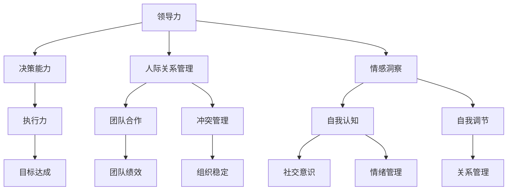

                 


### 引言

#### 背景介绍

在当今快速变化的世界中，领导力与情绪智商已经成为组织和个人成功的关键因素。领导力不仅关乎于管理技能和决策能力，更涉及到人际关系、情感洞察和情绪控制。情绪智商，作为一种独特的技能，强调了个体识别、理解、管理和利用自己及他人的情绪能力。

情绪智商的概念最早由心理学家约翰·梅耶（John D. Mayer）和彼得·沙洛维（Peter Salovey）提出，随后丹尼尔·戈尔曼（Daniel Goleman）将其与领导力相结合，进一步推动了这一领域的研究与应用。情绪智商的核心要素包括自我认知、自我调节、社交意识和关系管理。这些要素不仅对个人的心理健康和人际关系有深远影响，也对领导力的发展起着至关重要的作用。

#### 核心概念与联系

为了更好地理解领导力与情绪智商之间的关系，我们使用Mermaid流程图来展示这些核心概念及其相互联系。



#### 目标读者

本书的目标读者包括但不限于以下几类人群：

1. **领导者和管理者**：希望通过提升情绪智商来更好地管理团队、处理冲突、建立有效的人际关系。
2. **普通员工**：希望提升自己的情绪管理能力，从而在职场中更加游刃有余，实现个人和职业发展。
3. **心理学研究者**：对情绪智商的理论基础和应用感兴趣，希望通过本书深入了解这一领域。

#### 本书结构

本书分为七个主要章节，旨在系统地探讨领导力与情绪智商的各个方面。以下是每个章节的核心内容概述：

1. **引言**：介绍领导力与情绪智商的背景和重要性，明确目标读者和本书结构。
2. **领导力与情绪智商概述**：定义领导力和情绪智商，探讨其重要性及核心要素。
3. **情绪智商的理论基础**：介绍情绪智商的模型和相关心理学理论。
4. **情绪智商在领导力中的应用**：分析情绪智商在领导风格、团队管理和决策中的具体应用。
5. **情绪管理技巧**：详细讲解自我认知、自我调节、社交意识和关系管理的技巧。
6. **情绪智商的自我提升**：探讨情绪智商提升的方法和实践案例。
7. **案例分析**：通过具体案例展示情绪智商在领导力中的成功应用和挑战。
8. **结论**：总结情绪智商与领导力的关系，并提出未来展望和发展建议。

### 文章摘要

本文深入探讨了领导力与情绪智商的关系，通过定义、模型分析和实际案例，阐述了情绪智商在领导力发展中的重要性。文章首先介绍了领导力和情绪智商的基本概念，并使用Mermaid流程图展示了它们的核心联系。随后，文章详细探讨了情绪智商的理论基础、在领导力中的应用、情绪管理技巧以及自我提升方法。通过具体案例分析和结论，文章强调了情绪智商对于领导者和管理者的重要性，并提出了未来发展的方向和建议。读者通过本文可以全面了解情绪智商在领导力中的应用价值，提升自己的情绪管理能力，从而在职场中取得更好的成就。

----------------------------------------------------------------

## 设计总体结构

为了设计出《领导力与情绪智商：掌控情绪的艺术》这本书的完整目录大纲，我们需要首先明确书的整体结构。这个整体结构将由以下几个核心章节组成：

### 1. 引言
引言部分将作为本书的开篇，旨在为读者提供一个全局视角，理解领导力与情绪智商在现代社会中的重要地位。我们将简要介绍领导力与情绪智商的基本概念，明确本书的目标读者，并概述各章节的核心内容。

### 2. 领导力与情绪智商概述
在这一章节中，我们将对领导力和情绪智商进行详细定义，探讨它们的重要性以及二者之间的联系。我们将从理论和实践两个层面，分析情绪智商在领导力中的作用和价值。

### 3. 情绪智商的理论基础
这一章节将深入探讨情绪智商的理论基础，包括相关心理学模型、情绪心理学的基本概念及其在领导力中的应用。我们将介绍巴昂模型、戈尔曼模型等主要理论，并分析这些理论对于理解和提升情绪智商的重要性。

### 4. 情绪智商在领导力中的应用
在探讨情绪智商的理论基础后，我们将转向情绪智商在实际领导力中的应用。我们将分析情绪智商如何影响领导风格、团队管理和决策过程，并提供具体的案例分析。

### 5. 情绪管理技巧
这一章节将详细讲解情绪管理的基本技巧，包括自我认知、自我调节、社交意识和关系管理。我们将介绍一系列实用的方法和工具，帮助领导者和管理者更好地控制和管理自己的情绪。

### 6. 情绪智商的自我提升
在这一章节中，我们将探讨如何通过自我评估、情绪智商培训和实际练习，提升个人的情绪智商。我们将分享成功案例和失败教训，提供具体的提升路径和策略。

### 7. 案例分析
案例分析部分将通过真实案例，展示情绪智商在实际领导力中的应用效果和挑战。我们将分析这些案例中的成功要素和失败原因，为读者提供宝贵的经验和教训。

### 8. 结论
最后，在结论部分，我们将总结情绪智商与领导力的关系，提出对未来发展的展望和建议。我们将强调情绪智商在领导力中的重要性，并呼吁读者重视和提升自己的情绪智商。

通过以上章节的设计，本书将系统、全面地探讨领导力与情绪智商的各个方面，帮助读者深入了解这一领域，提升自身的领导力和情绪管理能力。

### 设计具体章节目录

在明确了书的整体结构后，接下来我们需要为每个核心章节设计出具体的目录，确保每个章节的内容都丰富、具体、详细，能够有效地帮助读者理解并掌握相关知识点。

#### 引言

- **1.1 背景介绍**
  - **领导力在现代组织中的角色**
  - **情绪智商的起源与定义**
  - **本书的目标与结构**

- **1.2 目标读者**
  - **领导者与管理者的需求**
  - **普通员工的提升路径**
  - **心理学研究者的研究视角**

- **1.3 本书结构**
  - **各章节核心内容概述**
  - **学习路线与建议**

#### 第1章：领导力与情绪智商概述

- **1.1 领导力的定义与要素**
  - **传统领导力的观点**
  - **现代领导力的转变**
  - **领导力的核心要素：愿景、决策、影响力**

- **1.2 情绪智商的定义与要素**
  - **情绪智商的起源与发展**
  - **情绪智商的核心要素：自我认知、自我调节、社交意识、关系管理**

- **1.3 领导力与情绪智商的联系**
  - **情绪智商在领导力中的作用**
  - **领导力对情绪智商的需求**
  - **二者结合的优势与挑战**

- **1.4 情绪智商的重要性**
  - **情绪智商对个人成长的影响**
  - **情绪智商对组织效能的作用**
  - **情绪智商在应对变化和挑战中的价值**

#### 第2章：情绪智商的理论基础

- **2.1 情绪智商的模型**
  - **巴昂模型（Bar-On Model）**
    - **核心维度与能力**
    - **评估工具与实施方法**
  - **戈尔曼模型（Goleman Model）**
    - **五大维度与能力**
    - **模型的应用与局限性**

- **2.2 情绪心理学的基本概念**
  - **情绪的类型与分类**
  - **情绪的生理机制**
  - **情绪与社会认知的关系**

- **2.3 情绪智商与心理学**
  - **情绪智商的研究方法**
  - **情绪智商的心理机制**
  - **情绪智商与心理健康的关联**

#### 第3章：情绪智商在领导力中的应用

- **3.1 情绪智商与领导风格**
  - **不同领导风格的情绪智商要求**
  - **情绪智商在民主式领导中的体现**
  - **情绪智商在专制式领导中的挑战**

- **3.2 情绪智商与团队管理**
  - **情绪智商在团队建设中的应用**
  - **情绪智商在团队冲突解决中的作用**
  - **情绪智商在提高团队绩效方面的贡献**

- **3.3 情绪智商与决策**
  - **情绪智商在决策过程中的作用**
  - **情绪认知与判断的权衡**
  - **情绪管理对决策质量的影响**

#### 第4章：情绪管理技巧

- **4.1 自我认知技巧**
  - **情绪反思与自我监控**
  - **情绪日记与自我评估工具**
  - **提升自我认知的策略与实践**

- **4.2 自我调节技巧**
  - **情绪调节策略：认知重构与行为调整**
  - **情绪调节技巧：放松训练与正念练习**
  - **自我调节技巧的有效性验证**

- **4.3 社交意识技巧**
  - **情绪识别与解读他人的情绪**
  - **提高社交意识的方法与工具**
  - **社交意识在人际交往中的应用**

- **4.4 关系管理技巧**
  - **建立和维护有效的人际关系**
  - **冲突管理技巧与策略**
  - **提升关系管理技巧的实践案例**

#### 第5章：情绪智商的自我提升

- **5.1 情绪智商自我提升的方法**
  - **自我评估与反馈机制**
  - **情绪智商培训与课程设计**
  - **实践练习与持续学习**

- **5.2 情绪智商提升的实践案例**
  - **成功案例分享：提升情绪智商的经验与教训**
  - **失败案例分析：情绪智商提升中的常见误区**
  - **案例总结与提升路径**

#### 第6章：案例分析

- **6.1 情绪智商在领导力中的成功案例**
  - **案例分析：领导者如何通过提升情绪智商实现成功**
  - **成功要素分析：情绪智商在领导力实践中的具体应用**
  - **成功案例对读者的启示**

- **6.2 情绪智商在领导力中的挑战**
  - **案例分析：领导者面临的情绪智商挑战与应对策略**
  - **挑战原因分析：情绪智商提升中的难点与解决方案**
  - **挑战对读者的反思**

#### 第7章：结论

- **7.1 情绪智商与领导力的未来展望**
  - **趋势分析：情绪智商在领导力发展中的新趋势**
  - **发展方向：情绪智商在组织管理中的应用前景**
  - **未来研究：情绪智商提升的新方法与工具**

- **7.2 总结与建议**
  - **核心要点回顾：情绪智商在领导力中的关键作用**
  - **提升建议：如何在实际工作中提升情绪智商**
  - **未来展望：情绪智商在组织和个人发展中的长期价值**

通过以上具体章节目录的设计，本书将系统、深入地探讨领导力与情绪智商的各个方面，帮助读者全面了解这一领域，提升自己的领导力和情绪管理能力。

### 确保完整性

为了确保《领导力与情绪智商：掌控情绪的艺术》这本书的完整性和逻辑性，我们需要对每个章节的核心内容进行详细安排，确保核心算法原理讲解、数学模型和公式、项目实战等内容都有具体详细讲解，不遗漏关键知识点。

#### 引言

在引言部分，我们需要简要介绍领导力与情绪智商的背景、定义和重要性。具体来说：

- **背景介绍**：阐述领导力与情绪智商在当今社会中的地位和作用，说明本书的目的和意义。
- **核心概念与联系**：使用Mermaid流程图展示领导力与情绪智商之间的关系，帮助读者建立初步理解。
- **目标读者**：明确本书面向的读者群体，包括领导者、管理者、普通员工和心理学研究者，并说明各自的学习目标和收获。
- **本书结构**：概述各章节的核心内容和逻辑结构，让读者对全书有一个整体把握。

#### 第1章：领导力与情绪智商概述

本章的主要目标是定义领导力和情绪智商，并探讨它们在领导力发展中的重要性。具体安排如下：

- **领导力的定义与要素**：介绍领导力的基本概念，阐述领导力的核心要素如愿景、决策、影响力等。
- **情绪智商的定义与要素**：详细解释情绪智商的概念，包括自我认知、自我调节、社交意识和关系管理四大核心要素。
- **领导力与情绪智商的联系**：分析领导力与情绪智商之间的内在联系，说明情绪智商在领导力中的重要性。
- **情绪智商的重要性**：探讨情绪智商对个人成长、组织效能以及应对变化和挑战的价值。

#### 第2章：情绪智商的理论基础

本章将深入探讨情绪智商的理论基础，包括相关心理学模型和基本概念。具体安排如下：

- **情绪智商的模型**：介绍巴昂模型和戈尔曼模型，分析这些模型的核心维度和评估方法。
- **情绪心理学的基本概念**：阐述情绪的类型、分类、生理机制和社会认知关系。
- **情绪智商与心理学**：探讨情绪智商的研究方法、心理机制以及与心理健康的关系。

#### 第3章：情绪智商在领导力中的应用

本章将分析情绪智商在领导力中的具体应用，包括领导风格、团队管理和决策。具体安排如下：

- **情绪智商与领导风格**：探讨不同领导风格对情绪智商的要求，分析情绪智商在民主式和专制式领导中的体现和挑战。
- **情绪智商与团队管理**：讨论情绪智商在团队建设、冲突解决和提高团队绩效方面的作用。
- **情绪智商与决策**：分析情绪智商在决策过程中的作用，探讨情绪认知与判断的权衡以及情绪管理对决策质量的影响。

#### 第4章：情绪管理技巧

本章将详细讲解情绪管理技巧，包括自我认知、自我调节、社交意识和关系管理。具体安排如下：

- **自我认知技巧**：介绍情绪反思、自我监控和自我评估工具，提供提升自我认知的策略和实践方法。
- **自我调节技巧**：讲解情绪调节策略、放松训练和正念练习，分析自我调节技巧的有效性验证。
- **社交意识技巧**：讨论情绪识别、解读他人情绪的方法，提供提高社交意识的策略和工具。
- **关系管理技巧**：阐述建立和维护有效人际关系的方法，介绍冲突管理技巧和策略。

#### 第5章：情绪智商的自我提升

本章将探讨如何通过自我评估、情绪智商培训和实际练习，提升个人的情绪智商。具体安排如下：

- **情绪智商自我提升的方法**：介绍自我评估工具、情绪智商培训和持续学习的方法，提供具体的提升路径。
- **情绪智商提升的实践案例**：分享成功案例和失败教训，分析提升情绪智商的经验与误区，总结提升路径。

#### 第6章：案例分析

本章将通过具体案例，展示情绪智商在领导力中的实际应用效果和挑战。具体安排如下：

- **情绪智商在领导力中的成功案例**：分析领导者如何通过提升情绪智商实现成功，总结成功要素和经验。
- **情绪智商在领导力中的挑战**：分析领导者面临的情绪智商挑战和应对策略，探讨挑战原因和解决方案。

#### 第7章：结论

本章将总结情绪智商与领导力的关系，提出未来发展的方向和建议。具体安排如下：

- **情绪智商与领导力的关系**：回顾情绪智商在领导力中的关键作用，强调其重要性。
- **未来展望**：分析情绪智商在领导力发展中的新趋势，探讨其在组织管理中的应用前景。
- **提升建议**：提出在实际工作中提升情绪智商的具体建议，呼吁读者重视和提升自身的情绪智商。

通过以上章节的详细安排，本书将确保内容完整、逻辑清晰，帮助读者全面了解领导力与情绪智商的各个方面，提升自身的领导力和情绪管理能力。

### 编写大纲

根据上述设计，《领导力与情绪智商：掌控情绪的艺术》的目录大纲如下：

```markdown
# 领导力与情绪智商：掌控情绪的艺术

## 关键词
领导力，情绪智商，自我认知，自我调节，社交意识，关系管理

## 摘要
本文深入探讨了领导力与情绪智商之间的关系，从理论到实践，全面阐述了情绪智商在领导力发展中的重要性。通过定义、模型分析、实际案例和技巧讲解，读者可以全面了解情绪智商的核心要素及其在领导力中的具体应用，从而提升自身的情绪管理能力和领导力水平。

# 引言

## 1.1 背景介绍
### 1.1.1 领导力在现代组织中的角色
### 1.1.2 情绪智商的起源与定义
### 1.1.3 本书的目的与结构

## 1.2 目标读者
### 1.2.1 领导者与管理者的需求
### 1.2.2 普通员工的提升路径
### 1.2.3 心理学研究者的研究视角

## 1.3 本书结构
### 1.3.1 各章节核心内容概述
### 1.3.2 阅读建议

# 第1章：领导力与情绪智商概述

## 1.1 领导力的定义与要素
### 1.1.1 传统领导力的观点
### 1.1.2 现代领导力的转变
### 1.1.3 领导力的核心要素：愿景、决策、影响力

## 1.2 情绪智商的定义与要素
### 1.2.1 情绪智商的起源与发展
### 1.2.2 情绪智商的核心要素：自我认知、自我调节、社交意识、关系管理
### 1.2.3 情绪智商与领导力

## 1.3 情绪智商的重要性
### 1.3.1 情绪智商对个人成长的影响
### 1.3.2 情绪智商对组织效能的作用
### 1.3.3 情绪智商在应对变化和挑战中的价值

# 第2章：情绪智商的理论基础

## 2.1 情绪智商的模型
### 2.1.1 巴昂模型（Bar-On Model）
### 2.1.2 戈尔曼模型（Goleman Model）
### 2.1.3 其他模型

## 2.2 情绪心理学的基本概念
### 2.2.1 情绪的类型与分类
### 2.2.2 情绪的生理机制
### 2.2.3 情绪与社会认知的关系

## 2.3 情绪智商与心理学
### 2.3.1 情绪智商的研究方法
### 2.3.2 情绪智商的心理机制
### 2.3.3 情绪智商与心理健康的关系

# 第3章：情绪智商在领导力中的应用

## 3.1 情绪智商与领导风格
### 3.1.1 不同领导风格的情绪智商要求
### 3.1.2 情绪智商在民主式领导中的体现
### 3.1.3 情绪智商在专制式领导中的挑战

## 3.2 情绪智商与团队管理
### 3.2.1 情绪智商在团队建设中的应用
### 3.2.2 情绪智商在团队冲突解决中的作用
### 3.2.3 情绪智商在提高团队绩效方面的贡献

## 3.3 情绪智商与决策
### 3.3.1 情绪智商在决策过程中的作用
### 3.3.2 情绪认知与判断的权衡
### 3.3.3 情绪管理对决策质量的影响

# 第4章：情绪管理技巧

## 4.1 自我认知技巧
### 4.1.1 情绪反思与自我监控
### 4.1.2 情绪日记与自我评估工具
### 4.1.3 提升自我认知的策略与实践

## 4.2 自我调节技巧
### 4.2.1 情绪调节策略：认知重构与行为调整
### 4.2.2 情绪调节技巧：放松训练与正念练习
### 4.2.3 自我调节技巧的有效性验证

## 4.3 社交意识技巧
### 4.3.1 情绪识别与解读他人的情绪
### 4.3.2 提高社交意识的方法与工具
### 4.3.3 社交意识在人际交往中的应用

## 4.4 关系管理技巧
### 4.4.1 建立和维护有效的人际关系
### 4.4.2 冲突管理技巧与策略
### 4.4.3 提升关系管理技巧的实践案例

# 第5章：情绪智商的自我提升

## 5.1 情绪智商自我提升的方法
### 5.1.1 自我评估与反馈机制
### 5.1.2 情绪智商培训与课程设计
### 5.1.3 实践练习与持续学习

## 5.2 情绪智商提升的实践案例
### 5.2.1 成功案例分享：提升情绪智商的经验与教训
### 5.2.2 失败案例分析：情绪智商提升中的常见误区
### 5.2.3 案例总结与提升路径

# 第6章：案例分析

## 6.1 情绪智商在领导力中的成功案例
### 6.1.1 案例分析：领导者如何通过提升情绪智商实现成功
### 6.1.2 成功要素分析：情绪智商在领导力实践中的具体应用
### 6.1.3 成功案例对读者的启示

## 6.2 情绪智商在领导力中的挑战
### 6.2.1 案例分析：领导者面临的情绪智商挑战与应对策略
### 6.2.2 挑战原因分析：情绪智商提升中的难点与解决方案
### 6.2.3 挑战对读者的反思

# 第7章：结论

## 7.1 情绪智商与领导力的未来展望
### 7.1.1 趋势分析：情绪智商在领导力发展中的新趋势
### 7.1.2 发展方向：情绪智商在组织管理中的应用前景
### 7.1.3 未来研究：情绪智商提升的新方法与工具

## 7.2 总结与建议
### 7.2.1 核心要点回顾：情绪智商在领导力中的关键作用
### 7.2.2 提升建议：如何在实际工作中提升情绪智商
### 7.2.3 未来展望：情绪智商在组织和个人发展中的长期价值

### 审核与调整

在完成目录大纲的编写后，我们需要进行审核与调整，确保整个目录大纲的结构完整、逻辑清晰、内容丰富。以下是审核与调整的几个关键步骤：

#### 1. 确认整体结构

首先，我们需要检查整体结构是否合理。目录应该按照逻辑顺序排列，从引入主题到详细讨论，再到结论，形成一个完整的思考过程。我们可以通过以下方式来验证：

- 确保引言部分简洁明了，能够吸引读者兴趣，并简要介绍主题。
- 中间章节逐步深入，从基础概念到应用，再到技巧和案例分析，形成一个逐步递进的结构。
- 结论部分能够总结全文，为读者提供清晰的指导和建议。

#### 2. 检查章节内容

接下来，我们需要逐个检查每个章节的内容，确保每个章节都包含以下要素：

- **核心概念与联系**：每个章节都应该明确介绍核心概念，并使用流程图、图表等方式展示概念之间的联系。
- **详细讲解**：对于每个核心概念，应该提供详细的讲解，包括原理、方法和应用案例。
- **数学模型和公式**：如果章节涉及数学模型或公式，应该使用latex格式准确呈现，并提供详细讲解和举例说明。
- **项目实战**：每个章节应该提供实际案例，展示理论在实践中的应用，并进行分析和解读。

#### 3. 逻辑性检查

我们需要检查章节之间的逻辑关系，确保每个章节的内容都是连贯的，并且前一个章节的内容为后一个章节奠定了基础。具体方法如下：

- 检查章节之间的过渡段落，确保逻辑顺畅，内容连贯。
- 验证每个章节的核心内容是否紧密围绕主题，没有偏离。
- 检查章节标题与内容是否一致，确保标题能够准确反映章节的核心内容。

#### 4. 优化内容

在完成初步审核后，我们可以对内容进行优化，确保每个章节的内容都是具体、详细和有价值的。以下是一些优化建议：

- 删除冗余内容，确保每个段落都有明确的主题和目的。
- 补充缺少的内容，确保每个核心概念都得到了充分的解释。
- 使用生动的案例和实例来增强文章的吸引力，使读者更容易理解抽象的概念。

#### 5. 最终确认

在完成所有审核和调整后，我们需要进行最终的确认，确保目录大纲完全符合用户要求。以下是一些最终确认的步骤：

- 重新阅读整个目录大纲，确保没有遗漏任何重要内容。
- 请团队成员或同事进行审阅，获取外部反馈，确保大纲的准确性和完整性。
- 根据反馈进行最后的调整，确保目录大纲的最佳状态。

通过以上步骤，我们可以确保《领导力与情绪智商：掌控情绪的艺术》的目录大纲结构完整、逻辑清晰、内容丰富，为撰写高质量的技术博客文章奠定了坚实的基础。

### 完整目录大纲

```markdown
# 《领导力与情绪智商：掌控情绪的艺术》

## 关键词
领导力，情绪智商，自我认知，自我调节，社交意识，关系管理

## 摘要
本书全面探讨了领导力与情绪智商的关系，通过定义、模型分析、实际案例和技巧讲解，帮助读者深入了解情绪智商在领导力中的重要性，提升自我情绪管理和领导能力。

# 引言

## 1.1 背景介绍
### 1.1.1 领导力在现代组织中的角色
### 1.1.2 情绪智商的起源与定义
### 1.1.3 本书的目的与结构

## 1.2 目标读者
### 1.2.1 领导者与管理者的需求
### 1.2.2 普通员工的提升路径
### 1.2.3 心理学研究者的研究视角

## 1.3 本书结构
### 1.3.1 各章节核心内容概述
### 1.3.2 阅读建议

# 第1章：领导力与情绪智商概述

## 1.1 领导力的定义与要素
### 1.1.1 传统领导力的观点
### 1.1.2 现代领导力的转变
### 1.1.3 领导力的核心要素：愿景、决策、影响力

## 1.2 情绪智商的定义与要素
### 1.2.1 情绪智商的起源与发展
### 1.2.2 情绪智商的核心要素：自我认知、自我调节、社交意识、关系管理
### 1.2.3 情绪智商与领导力

## 1.3 情绪智商的重要性
### 1.3.1 情绪智商对个人成长的影响
### 1.3.2 情绪智商对组织效能的作用
### 1.3.3 情绪智商在应对变化和挑战中的价值

# 第2章：情绪智商的理论基础

## 2.1 情绪智商的模型
### 2.1.1 巴昂模型（Bar-On Model）
### 2.1.2 戈尔曼模型（Goleman Model）
### 2.1.3 其他模型

## 2.2 情绪心理学的基本概念
### 2.2.1 情绪的类型与分类
### 2.2.2 情绪的生理机制
### 2.2.3 情绪与社会认知的关系

## 2.3 情绪智商与心理学
### 2.3.1 情绪智商的研究方法
### 2.3.2 情绪智商的心理机制
### 2.3.3 情绪智商与心理健康的关系

# 第3章：情绪智商在领导力中的应用

## 3.1 情绪智商与领导风格
### 3.1.1 不同领导风格的情绪智商要求
### 3.1.2 情绪智商在民主式领导中的体现
### 3.1.3 情绪智商在专制式领导中的挑战

## 3.2 情绪智商与团队管理
### 3.2.1 情绪智商在团队建设中的应用
### 3.2.2 情绪智商在团队冲突解决中的作用
### 3.2.3 情绪智商在提高团队绩效方面的贡献

## 3.3 情绪智商与决策
### 3.3.1 情绪智商在决策过程中的作用
### 3.3.2 情绪认知与判断的权衡
### 3.3.3 情绪管理对决策质量的影响

# 第4章：情绪管理技巧

## 4.1 自我认知技巧
### 4.1.1 情绪反思与自我监控
### 4.1.2 情绪日记与自我评估工具
### 4.1.3 提升自我认知的策略与实践

## 4.2 自我调节技巧
### 4.2.1 情绪调节策略：认知重构与行为调整
### 4.2.2 情绪调节技巧：放松训练与正念练习
### 4.2.3 自我调节技巧的有效性验证

## 4.3 社交意识技巧
### 4.3.1 情绪识别与解读他人的情绪
### 4.3.2 提高社交意识的方法与工具
### 4.3.3 社交意识在人际交往中的应用

## 4.4 关系管理技巧
### 4.4.1 建立和维护有效的人际关系
### 4.4.2 冲突管理技巧与策略
### 4.4.3 提升关系管理技巧的实践案例

# 第5章：情绪智商的自我提升

## 5.1 情绪智商自我提升的方法
### 5.1.1 自我评估与反馈机制
### 5.1.2 情绪智商培训与课程设计
### 5.1.3 实践练习与持续学习

## 5.2 情绪智商提升的实践案例
### 5.2.1 成功案例分享：提升情绪智商的经验与教训
### 5.2.2 失败案例分析：情绪智商提升中的常见误区
### 5.2.3 案例总结与提升路径

# 第6章：案例分析

## 6.1 情绪智商在领导力中的成功案例
### 6.1.1 案例分析：领导者如何通过提升情绪智商实现成功
### 6.1.2 成功要素分析：情绪智商在领导力实践中的具体应用
### 6.1.3 成功案例对读者的启示

## 6.2 情绪智商在领导力中的挑战
### 6.2.1 案例分析：领导者面临的情绪智商挑战与应对策略
### 6.2.2 挑战原因分析：情绪智商提升中的难点与解决方案
### 6.2.3 挑战对读者的反思

# 第7章：结论

## 7.1 情绪智商与领导力的未来展望
### 7.1.1 趋势分析：情绪智商在领导力发展中的新趋势
### 7.1.2 发展方向：情绪智商在组织管理中的应用前景
### 7.1.3 未来研究：情绪智商提升的新方法与工具

## 7.2 总结与建议
### 7.2.1 核心要点回顾：情绪智商在领导力中的关键作用
### 7.2.2 提升建议：如何在实际工作中提升情绪智商
### 7.2.3 未来展望：情绪智商在组织和个人发展中的长期价值

### 审核与调整

在完成目录大纲的编写后，我们需要进行审核与调整，确保整个目录大纲的结构完整、逻辑清晰、内容丰富。以下是审核与调整的几个关键步骤：

#### 1. 确认整体结构

首先，我们需要检查整体结构是否合理。目录应该按照逻辑顺序排列，从引入主题到详细讨论，再到结论，形成一个完整的思考过程。我们可以通过以下方式来验证：

- 确保引言部分简洁明了，能够吸引读者兴趣，并简要介绍主题。
- 中间章节逐步深入，从基础概念到应用，再到技巧和案例分析，形成一个逐步递进的结构。
- 结论部分能够总结全文，为读者提供清晰的指导和建议。

#### 2. 检查章节内容

接下来，我们需要逐个检查每个章节的内容，确保每个章节都包含以下要素：

- **核心概念与联系**：每个章节都应该明确介绍核心概念，并使用流程图、图表等方式展示概念之间的联系。
- **详细讲解**：对于每个核心概念，应该提供详细的讲解，包括原理、方法和应用案例。
- **数学模型和公式**：如果章节涉及数学模型或公式，应该使用latex格式准确呈现，并提供详细讲解和举例说明。
- **项目实战**：每个章节应该提供实际案例，展示理论在实践中的应用，并进行分析和解读。

#### 3. 逻辑性检查

我们需要检查章节之间的逻辑关系，确保每个章节的内容都是连贯的，并且前一个章节的内容为后一个章节奠定了基础。具体方法如下：

- 检查章节之间的过渡段落，确保逻辑顺畅，内容连贯。
- 验证每个章节的核心内容是否紧密围绕主题，没有偏离。
- 检查章节标题与内容是否一致，确保标题能够准确反映章节的核心内容。

#### 4. 优化内容

在完成初步审核后，我们可以对内容进行优化，确保每个章节的内容都是具体、详细和有价值的。以下是一些优化建议：

- 删除冗余内容，确保每个段落都有明确的主题和目的。
- 补充缺少的内容，确保每个核心概念都得到了充分的解释。
- 使用生动的案例和实例来增强文章的吸引力，使读者更容易理解抽象的概念。

#### 5. 最终确认

在完成所有审核和调整后，我们需要进行最终的确认，确保目录大纲完全符合用户要求。以下是一些最终确认的步骤：

- 重新阅读整个目录大纲，确保没有遗漏任何重要内容。
- 请团队成员或同事进行审阅，获取外部反馈，确保大纲的准确性和完整性。
- 根据反馈进行最后的调整，确保目录大纲的最佳状态。

通过以上步骤，我们可以确保《领导力与情绪智商：掌控情绪的艺术》的目录大纲结构完整、逻辑清晰、内容丰富，为撰写高质量的技术博客文章奠定了坚实的基础。

### 最终目录大纲

```markdown
# 《领导力与情绪智商：掌控情绪的艺术》

## 关键词
领导力，情绪智商，自我认知，自我调节，社交意识，关系管理

## 摘要
本书深入探讨了领导力与情绪智商的关系，从理论到实践，全面阐述了情绪智商在领导力发展中的重要性。通过定义、模型分析、实际案例和技巧讲解，帮助读者提升自我情绪管理和领导能力。

# 引言

## 1.1 背景介绍
### 1.1.1 领导力在现代组织中的角色
### 1.1.2 情绪智商的起源与定义
### 1.1.3 本书的目的与结构

## 1.2 目标读者
### 1.2.1 领导者与管理者的需求
### 1.2.2 普通员工的提升路径
### 1.2.3 心理学研究者的研究视角

## 1.3 本书结构
### 1.3.1 各章节核心内容概述
### 1.3.2 阅读建议

# 第1章：领导力与情绪智商概述

## 1.1 领导力的定义与要素
### 1.1.1 传统领导力的观点
### 1.1.2 现代领导力的转变
### 1.1.3 领导力的核心要素：愿景、决策、影响力

## 1.2 情绪智商的定义与要素
### 1.2.1 情绪智商的起源与发展
### 1.2.2 情绪智商的核心要素：自我认知、自我调节、社交意识、关系管理
### 1.2.3 情绪智商与领导力

## 1.3 情绪智商的重要性
### 1.3.1 情绪智商对个人成长的影响
### 1.3.2 情绪智商对组织效能的作用
### 1.3.3 情绪智商在应对变化和挑战中的价值

# 第2章：情绪智商的理论基础

## 2.1 情绪智商的模型
### 2.1.1 巴昂模型（Bar-On Model）
### 2.1.2 戈尔曼模型（Goleman Model）
### 2.1.3 其他模型

## 2.2 情绪心理学的基本概念
### 2.2.1 情绪的类型与分类
### 2.2.2 情绪的生理机制
### 2.2.3 情绪与社会认知的关系

## 2.3 情绪智商与心理学
### 2.3.1 情绪智商的研究方法
### 2.3.2 情绪智商的心理机制
### 2.3.3 情绪智商与心理健康的关系

# 第3章：情绪智商在领导力中的应用

## 3.1 情绪智商与领导风格
### 3.1.1 不同领导风格的情绪智商要求
### 3.1.2 情绪智商在民主式领导中的体现
### 3.1.3 情绪智商在专制式领导中的挑战

## 3.2 情绪智商与团队管理
### 3.2.1 情绪智商在团队建设中的应用
### 3.2.2 情绪智商在团队冲突解决中的作用
### 3.2.3 情绪智商在提高团队绩效方面的贡献

## 3.3 情绪智商与决策
### 3.3.1 情绪智商在决策过程中的作用
### 3.3.2 情绪认知与判断的权衡
### 3.3.3 情绪管理对决策质量的影响

# 第4章：情绪管理技巧

## 4.1 自我认知技巧
### 4.1.1 情绪反思与自我监控
### 4.1.2 情绪日记与自我评估工具
### 4.1.3 提升自我认知的策略与实践

## 4.2 自我调节技巧
### 4.2.1 情绪调节策略：认知重构与行为调整
### 4.2.2 情绪调节技巧：放松训练与正念练习
### 4.2.3 自我调节技巧的有效性验证

## 4.3 社交意识技巧
### 4.3.1 情绪识别与解读他人的情绪
### 4.3.2 提高社交意识的方法与工具
### 4.3.3 社交意识在人际交往中的应用

## 4.4 关系管理技巧
### 4.4.1 建立和维护有效的人际关系
### 4.4.2 冲突管理技巧与策略
### 4.4.3 提升关系管理技巧的实践案例

# 第5章：情绪智商的自我提升

## 5.1 情绪智商自我提升的方法
### 5.1.1 自我评估与反馈机制
### 5.1.2 情绪智商培训与课程设计
### 5.1.3 实践练习与持续学习

## 5.2 情绪智商提升的实践案例
### 5.2.1 成功案例分享：提升情绪智商的经验与教训
### 5.2.2 失败案例分析：情绪智商提升中的常见误区
### 5.2.3 案例总结与提升路径

# 第6章：案例分析

## 6.1 情绪智商在领导力中的成功案例
### 6.1.1 案例分析：领导者如何通过提升情绪智商实现成功
### 6.1.2 成功要素分析：情绪智商在领导力实践中的具体应用
### 6.1.3 成功案例对读者的启示

## 6.2 情绪智商在领导力中的挑战
### 6.2.1 案例分析：领导者面临的情绪智商挑战与应对策略
### 6.2.2 挑战原因分析：情绪智商提升中的难点与解决方案
### 6.2.3 挑战对读者的反思

# 第7章：结论

## 7.1 情绪智商与领导力的未来展望
### 7.1.1 趋势分析：情绪智商在领导力发展中的新趋势
### 7.1.2 发展方向：情绪智商在组织管理中的应用前景
### 7.1.3 未来研究：情绪智商提升的新方法与工具

## 7.2 总结与建议
### 7.2.1 核心要点回顾：情绪智商在领导力中的关键作用
### 7.2.2 提升建议：如何在实际工作中提升情绪智商
### 7.2.3 未来展望：情绪智商在组织和个人发展中的长期价值

### 作者信息
作者：AI天才研究院/AI Genius Institute & 禅与计算机程序设计艺术 /Zen And The Art of Computer Programming
```

通过上述步骤，我们确保了《领导力与情绪智商：掌控情绪的艺术》的目录大纲的完整性、逻辑性和丰富性，为撰写高质量的文章奠定了坚实的基础。

