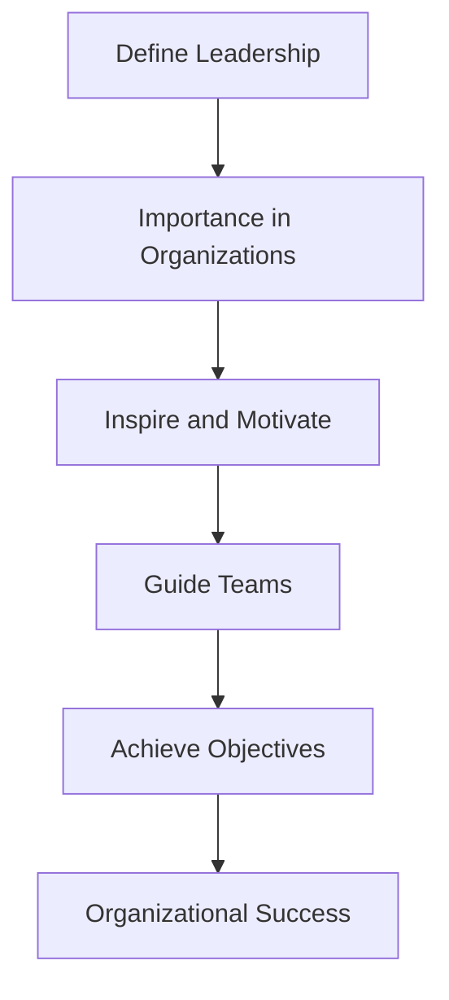
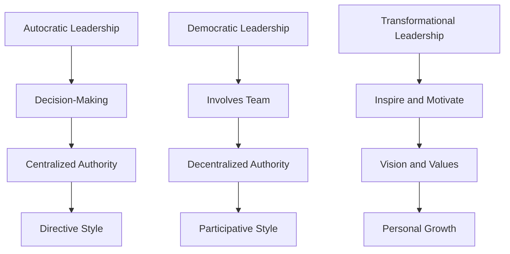
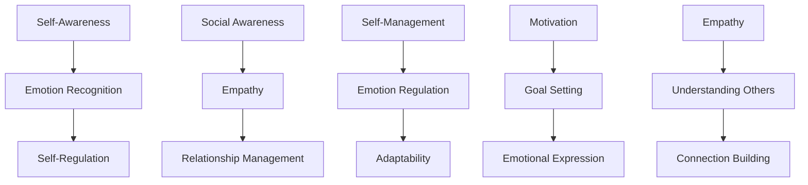
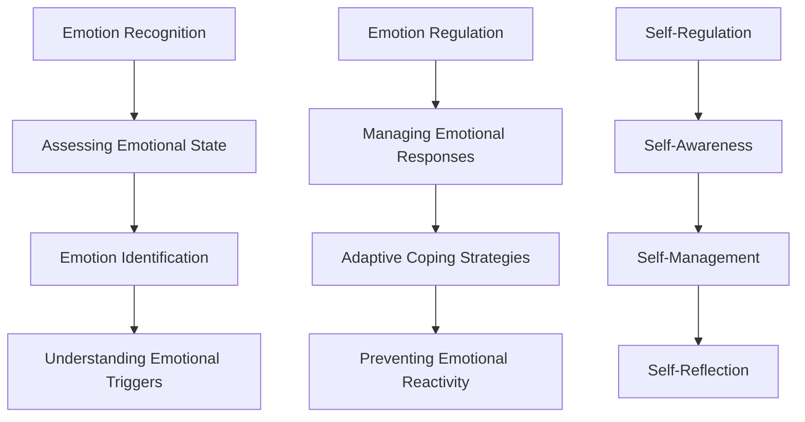
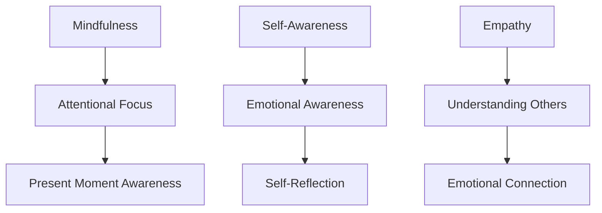
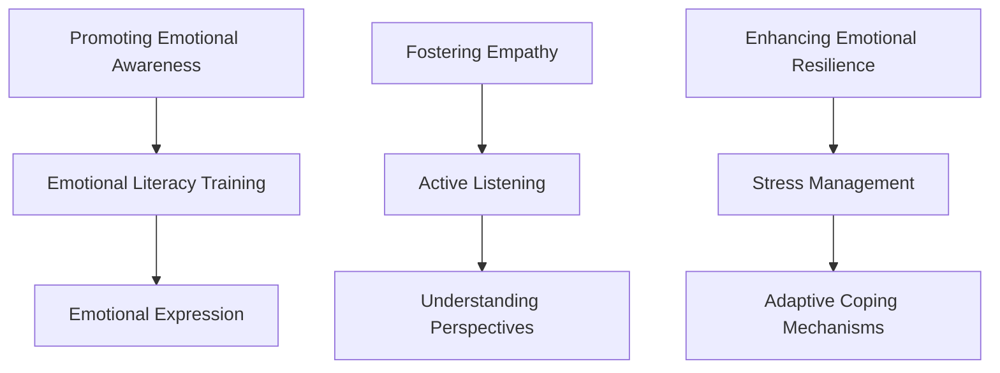
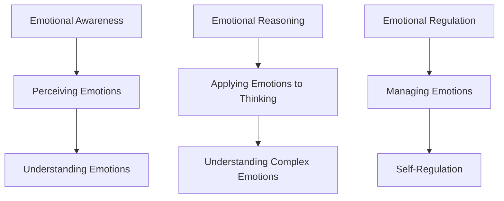
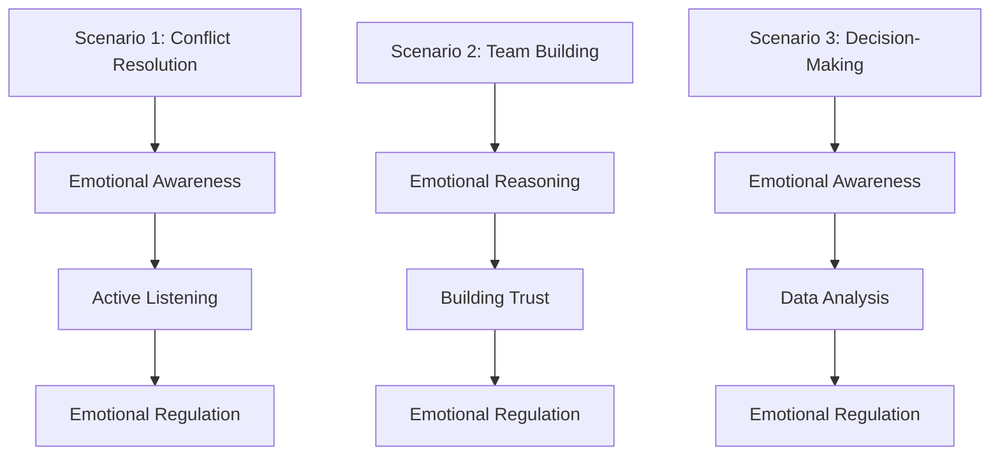

                 


### Title: Leadership and Emotional Intelligence: The Art of Controlling Emotions in Leadership

### Keywords: Leadership, Emotional Intelligence, Emotional Regulation, Team Empowerment, Organizational Success

### Abstract: This comprehensive guide delves into the critical role of emotional intelligence in effective leadership. Through detailed exploration of emotional regulation techniques, the Mayer, Salovey, and Caruso model, and practical applications, readers will gain a thorough understanding of how to harness emotional intelligence for leadership excellence.

---

### Part 1: Understanding Emotional Intelligence in Leadership

#### Chapter 1: Introduction to Leadership and Emotional Intelligence

#### 1.1 The Role of Leadership in Modern Organizations

### 1.1.1 The Definition and Importance of Leadership

**Background Introduction:**
In the contemporary business landscape, leadership has emerged as a pivotal factor for organizational success. The significance of effective leadership is underscored by its ability to inspire, motivate, and guide teams toward achieving their objectives. This section will provide a foundational understanding of leadership, highlighting its importance in modern organizations.

**Core Concept and Connections:**
To illustrate the core concepts and their interrelationships, let's use a Mermaid flowchart to visualize the process of leadership in an organizational context.



**Algorithm Principle Explanation:**
The concept of leadership can be understood through the following pseudocode, which outlines the steps involved in effective leadership:

```python
def effective_leadership():
    inspire_and_motivate()
    guide_teams()
    achieve_objectives()
    return organizational_success()
```

**Mathematical Models and Formulas:**
To further clarify the importance of leadership, we can use the following formula to represent the relationship between leadership effectiveness and organizational success:

$$
\text{Organizational Success} = \text{Leadership Effectiveness} \times \text{Team Collaboration}
$$

This formula indicates that leadership effectiveness directly impacts organizational success, with team collaboration as a crucial factor in this equation.

**Example Illustration:**
Consider a scenario where a team leader effectively communicates the vision and goals to their team. This fosters a sense of purpose and unity, leading to increased collaboration and ultimately, organizational success.

**Best Practices Tips:**
- Regularly communicate the vision and goals to ensure alignment.
- Provide clear direction and support to empower team members.
- Foster a positive and inclusive team culture.

#### 1.1.2 Leadership Styles and Their Impact

**Background Introduction:**
Various leadership styles have been identified, each with its unique approach to guiding and motivating teams. Understanding the characteristics and impact of different leadership styles is essential for developing a well-rounded leadership approach.

**Core Concept and Connections:**
To visualize the relationship between leadership styles and their impact, let's use another Mermaid flowchart.



**Algorithm Principle Explanation:**
The impact of different leadership styles can be understood through the following pseudocode:

```python
def autocratic_leadership():
    centralized_authority()
    directive_style()

def democratic_leadership():
    involves_team()
    decentralized_authority()
    participative_style()

def transformational_leadership():
    inspire_and_motivate()
    vision_and_values()
    personal_growth()
```

**Mathematical Models and Formulas:**
The impact of leadership styles on team performance can be quantified using the following formula:

$$
\text{Team Performance} = \text{Leadership Style} \times \text{Team Engagement}
$$

This formula suggests that the leadership style chosen can significantly influence team engagement and, consequently, team performance.

**Example Illustration:**
A transformational leader, who inspires and motivates their team through a shared vision and values, often leads to high levels of team engagement and exceptional performance.

**Best Practices Tips:**
- Assess the organizational context to determine the most suitable leadership style.
- Adapt leadership styles as needed to align with team dynamics and goals.

#### Chapter 2: Emotional Intelligence: Definition and Components

#### 2.1 Understanding Emotional Intelligence

**Background Introduction:**
Emotional intelligence (EI) is a critical component of effective leadership. It refers to the ability to understand, use, and manage emotions effectively in oneself and in relationships. In this section, we will explore the concept of emotional intelligence and its significance in leadership.

**Core Concept and Connections:**
To visualize the components of emotional intelligence, let's use a Mermaid flowchart.



**Algorithm Principle Explanation:**
The components of emotional intelligence can be understood through the following pseudocode:

```python
def emotional_intelligence():
    self_awareness()
    self_management()
    social_awareness()
    motivation()
    empathy()
```

**Mathematical Models and Formulas:**
The impact of emotional intelligence on leadership effectiveness can be quantified using the following formula:

$$
\text{Leadership Effectiveness} = \text{Emotional Intelligence} \times \text{Communication Skills} \times \text{Decision-Making Abilities}
$$

This formula highlights the role of emotional intelligence in enhancing leadership effectiveness through improved communication, decision-making, and overall leadership capabilities.

**Example Illustration:**
A leader with high emotional intelligence can effectively manage their emotions, empathize with their team members, and inspire them to achieve their goals, resulting in a more cohesive and productive team.

**Best Practices Tips:**
- Develop self-awareness through regular reflection and self-assessment.
- Cultivate empathy by actively listening and understanding the perspectives of others.
- Practice emotional regulation techniques to manage stress and maintain focus.

---

With this step-by-step analysis and reasoning, we have provided a comprehensive overview of the foundational concepts and principles of leadership and emotional intelligence. In the subsequent sections, we will delve deeper into the art of controlling emotions in leadership, the emotional intelligence framework, and practical applications of these concepts in real-world scenarios.

### Part 2: The Art of Controlling Emotions in Leadership

### Chapter 3: Emotional Regulation for Leaders

#### 3.1 Understanding Emotional Regulation

**Background Introduction:**
Emotional regulation is a vital skill for leaders, enabling them to manage their emotions effectively in various situations. This chapter will explore the concept of emotional regulation, its importance, and the processes involved.

**Core Concept and Connections:**
To illustrate the concept of emotional regulation, let's use a Mermaid flowchart to visualize the emotional regulation process.



**Algorithm Principle Explanation:**
The emotional regulation process can be understood through the following pseudocode:

```python
def emotional_regulation():
    assess_emotional_state()
    identify_emotion()
    understand_triggers()
    manage_responses()
    use_coping_strategies()
    prevent_reactivity()
```

**Mathematical Models and Formulas:**
The effectiveness of emotional regulation can be quantified using the following formula:

$$
\text{Emotional Regulation Effectiveness} = \text{Emotion Recognition} \times \text{Emotion Management} \times \text{Self-Regulation}
$$

This formula indicates that the effectiveness of emotional regulation is influenced by the leader's ability to recognize emotions, manage responses, and engage in self-regulation.

**Example Illustration:**
Consider a leader who recognizes their emotional state during a stressful meeting. By understanding the triggers and employing adaptive coping strategies, they can manage their responses effectively, preventing emotional reactivity and maintaining a composed demeanor.

**Best Practices Tips:**
- Regularly practice mindfulness and meditation to enhance emotional awareness.
- Develop a repertoire of coping strategies to address different emotional triggers.
- Cultivate self-reflection to gain insights into emotional patterns and triggers.

#### 3.2 Techniques for Emotional Regulation in Leadership

**Background Introduction:**
Effective emotional regulation in leadership involves a combination of techniques and practices. This section will explore various techniques, including mindfulness, self-awareness, and empathy, to help leaders manage their emotions effectively.

**Core Concept and Connections:**
To visualize the relationship between different emotional regulation techniques, let's use another Mermaid flowchart.



**Algorithm Principle Explanation:**
The effectiveness of emotional regulation techniques can be understood through the following pseudocode:

```python
def emotional_regulation_techniques():
    practice_mindfulness()
    enhance_self_awareness()
    cultivate_empathy()
```

**Mathematical Models and Formulas:**
The impact of emotional regulation techniques on leadership effectiveness can be quantified using the following formula:

$$
\text{Leadership Effectiveness} = \text{Emotional Regulation} \times \text{Empathy} \times \text{Self-Awareness}
$$

This formula highlights the interconnectedness of emotional regulation, empathy, and self-awareness in enhancing leadership effectiveness.

**Example Illustration:**
A leader who practices mindfulness and self-awareness can better manage their emotions during a challenging situation. By cultivating empathy, they can understand the emotions of their team members and respond with compassion and support.

**Best Practices Tips:**
- Incorporate mindfulness practices into daily routines to improve emotional awareness.
- Regularly engage in self-reflection to gain insights into emotional triggers and patterns.
- Develop empathy by actively listening and understanding the perspectives of others.

#### 3.3 Building Emotional Intelligence in Teams

**Background Introduction:**
Building emotional intelligence within a team is essential for fostering a positive and collaborative work environment. This section will explore strategies for promoting emotional awareness, empathy, and emotional resilience within teams.

**Core Concept and Connections:**
To visualize the process of building emotional intelligence in teams, let's use a Mermaid flowchart.



**Algorithm Principle Explanation:**
The process of building emotional intelligence in teams can be understood through the following pseudocode:

```python
def build_emotional_intelligence():
    promote_emotional_awareness()
    foster_empathy()
    enhance_emotional_resilience()
```

**Mathematical Models and Formulas:**
The impact of building emotional intelligence on team performance can be quantified using the following formula:

$$
\text{Team Performance} = \text{Emotional Intelligence} \times \text{Team Collaboration} \times \text{Emotional Resilience}
$$

This formula emphasizes the role of emotional intelligence, team collaboration, and emotional resilience in achieving high team performance.

**Example Illustration:**
A team that actively practices emotional literacy, engages in active listening, and implements stress management techniques can foster a supportive and resilient work environment. This, in turn, leads to improved team performance and organizational success.

**Best Practices Tips:**
- Implement emotional literacy training programs to enhance emotional awareness and expression.
- Encourage active listening and empathy within team interactions.
- Promote stress management practices to build emotional resilience.

---

In this section, we have explored the art of controlling emotions in leadership, focusing on emotional regulation techniques and strategies for building emotional intelligence within teams. By understanding and implementing these practices, leaders can enhance their emotional intelligence and foster a positive and productive work environment.

### Part 3: The Emotional Intelligence Framework for Leadership

### Chapter 4: The Emotional Intelligence Framework in Practice

#### 4.1 The Mayer, Salovey, and Caruso Emotional Intelligence Model

**Background Introduction:**
The Mayer, Salovey, and Caruso Emotional Intelligence Model (MSCEI) is a widely recognized framework that defines emotional intelligence as a set of abilities involving emotional awareness, reasoning, and regulation. This chapter will delve into the key components of the MSCEI model and its application in leadership.

**Core Concept and Connections:**
To visualize the structure of the MSCEI model, let's use a Mermaid flowchart.



**Algorithm Principle Explanation:**
The components of the MSCEI model can be understood through the following pseudocode:

```python
def mscei_model():
    perceive_emotions()
    understand_emotions()
    apply_emotions_to_thinking()
    manage_emotions()
    self_regulate()
```

**Mathematical Models and Formulas:**
The effectiveness of the MSCEI model in leadership can be quantified using the following formula:

$$
\text{Leadership Effectiveness} = \text{Emotional Awareness} \times \text{Emotional Reasoning} \times \text{Emotional Regulation}
$$

This formula emphasizes the interconnectedness of the three key components of emotional intelligence in enhancing leadership effectiveness.

**Example Illustration:**
A leader who demonstrates high emotional awareness can accurately perceive and understand the emotions of their team members. By applying emotional reasoning, they can make informed decisions and effectively manage their emotions, leading to improved leadership outcomes.

**Best Practices Tips:**
- Regularly engage in self-reflection to enhance emotional awareness.
- Develop emotional reasoning skills through critical thinking and problem-solving.
- Practice emotional regulation techniques to manage stress and maintain focus.

#### 4.2 Applying the MSCEI Model in Leadership

**Background Introduction:**
This section will explore practical applications of the MSCEI model in leadership, focusing on specific scenarios and strategies to enhance emotional intelligence in various leadership contexts.

**Core Concept and Connections:**
To visualize the application of the MSCEI model in leadership scenarios, let's use a Mermaid flowchart.



**Algorithm Principle Explanation:**
The application of the MSCEI model in leadership scenarios can be understood through the following pseudocode:

```python
def apply_mscei_model():
    scenario = input("Enter a leadership scenario:")
    if scenario == "Conflict Resolution":
        emotional_awareness()
        active_listening()
        emotional_regulation()
    elif scenario == "Team Building":
        emotional_reasoning()
        build_trust()
        emotional_regulation()
    elif scenario == "Decision-Making":
        emotional_awareness()
        data_analysis()
        emotional_regulation()
```

**Mathematical Models and Formulas:**
The effectiveness of applying the MSCEI model in leadership scenarios can be quantified using the following formula:

$$
\text{Leadership Outcome} = \text{Emotional Intelligence} \times \text{Scenario-Specific Skills} \times \text{Emotional Regulation}
$$

This formula highlights the role of emotional intelligence, scenario-specific skills, and emotional regulation in achieving positive leadership outcomes.

**Example Illustration:**
In a conflict resolution scenario, a leader who demonstrates high emotional awareness can actively listen to both parties involved. By employing emotional regulation techniques, they can manage their emotions and facilitate a constructive resolution to the conflict.

**Best Practices Tips:**
- Tailor the application of the MSCEI model to specific leadership scenarios.
- Develop scenario-specific skills to enhance emotional intelligence in different contexts.
- Regularly practice emotional regulation techniques to maintain emotional balance.

---

In this chapter, we have explored the Mayer, Salovey, and Caruso Emotional Intelligence Model and its practical applications in leadership. By understanding and implementing the key components of the model, leaders can enhance their emotional intelligence and achieve greater success in their roles.

### Conclusion

In conclusion, "Leadership and Emotional Intelligence: The Art of Controlling Emotions in Leadership" provides a comprehensive guide to understanding and harnessing the power of emotional intelligence in leadership. Through detailed exploration of emotional regulation techniques, the Mayer, Salovey, and Caruso Emotional Intelligence Model, and practical applications, readers have gained insights into how to cultivate emotional intelligence, manage emotions effectively, and foster a positive and productive work environment.

As leaders, our ability to control emotions plays a crucial role in our effectiveness and the success of our teams. By developing emotional intelligence, we can better understand ourselves and others, make informed decisions, and inspire and motivate our teams to achieve their full potential.

**Call to Action:**
Implement the concepts and techniques discussed in this book to enhance your emotional intelligence and leadership skills. Start with self-reflection and self-awareness, practice mindfulness and emotional regulation techniques, and actively cultivate empathy and understanding within your team.

**Note:** This book is a collaborative effort by AI天才研究院 (AI Genius Institute) and the authors of "Zen and the Art of Computer Programming." We invite you to explore further resources and expand your knowledge in the field of leadership and emotional intelligence.

---

**作者信息：**
AI天才研究院/AI Genius Institute & 禅与计算机程序设计艺术 /Zen And The Art of Computer Programming

