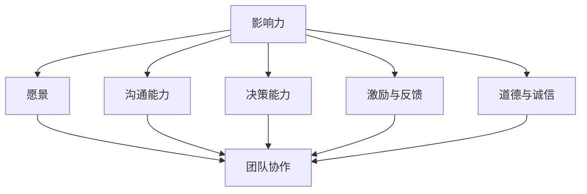
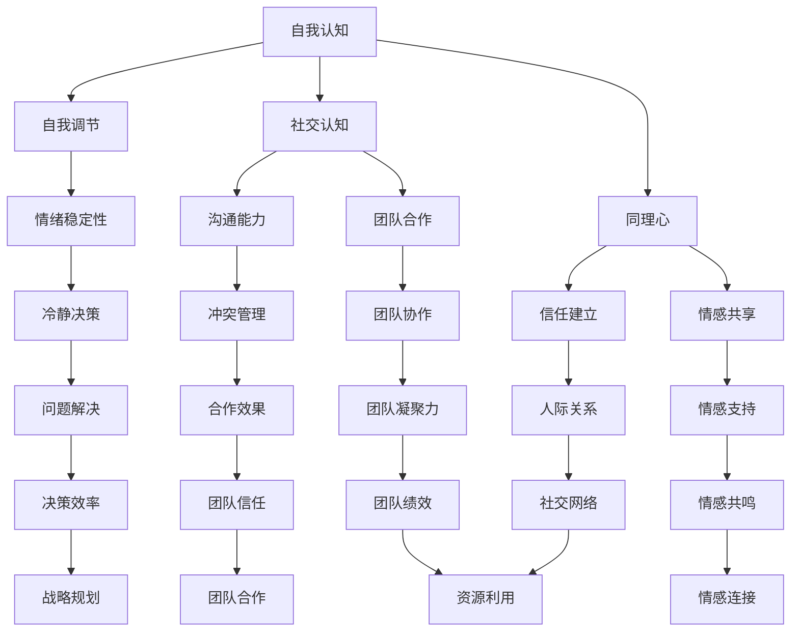
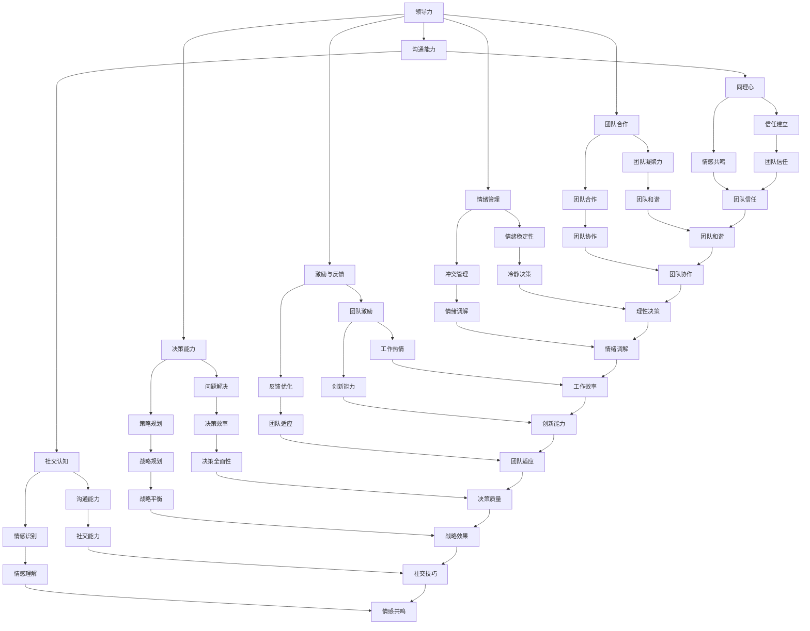
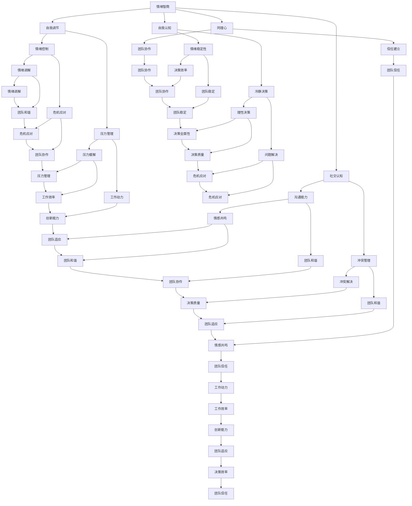
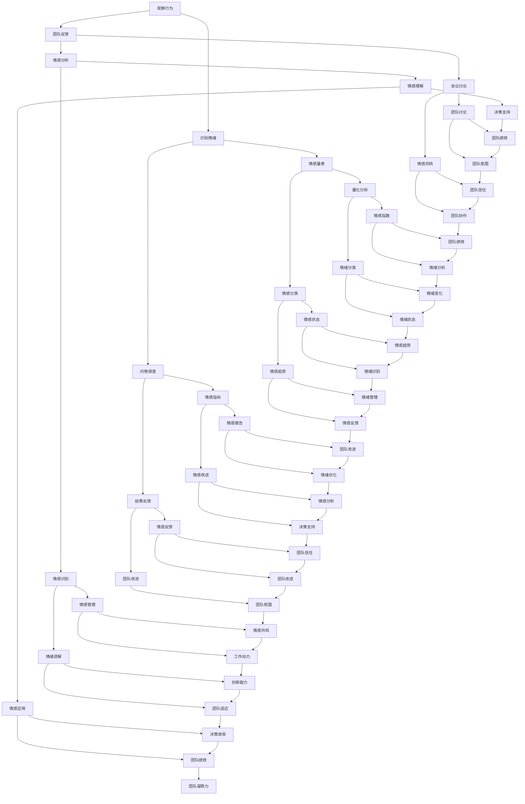
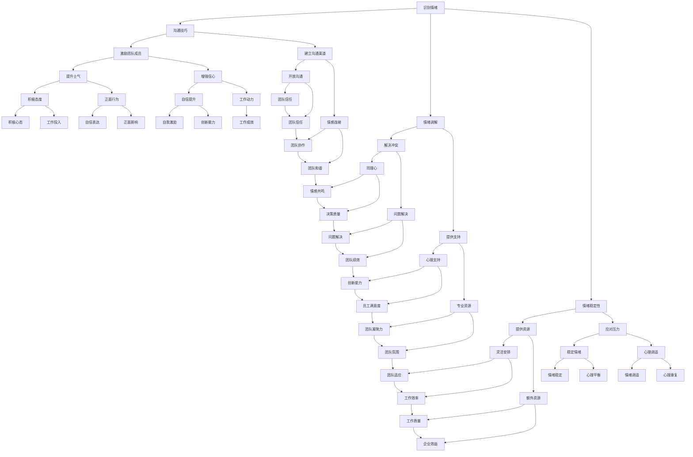

                 

## 引言

在现代企业管理中，领导力与情绪智商（Emotional Intelligence, EI）逐渐成为企业成功的关键要素。领导力不仅仅涉及决策能力和战略规划，更包括了如何激励和引导团队成员，使其在团队中发挥最大潜力。而情绪智商则是领导者理解和管理自己及他人情绪的能力，这种能力在团队管理和决策过程中发挥着至关重要的作用。

本文旨在探讨领导力与情绪智商之间的关系，深入分析情绪智商在团队管理中的关键作用，并讨论领导者如何通过提升情绪智商来更好地管理团队情绪。本文的结构如下：

1. **领导力的定义与特征**：介绍领导力的基本概念和关键特征。
2. **情绪智商的概念与构成**：解释情绪智商的定义、核心构成要素及其重要性。
3. **领导力与情绪智商的联系**：探讨二者之间的相互关系及其对企业绩效的影响。
4. **情绪智商的重要性**：详细阐述情绪智商在领导力中的关键作用。
5. **如何理解团队情绪**：介绍团队情绪的识别和测量方法。
6. **领导力在管理团队情绪中的作用**：分析领导者在管理团队情绪方面的职责和技巧。
7. **管理团队情绪的策略和方法**：提供一系列实用的策略和方法，帮助领导者有效地管理团队情绪。
8. **案例分析**：通过具体案例展示领导力与情绪智商在实际工作中的应用。
9. **实践指南**：总结提升情绪智商的方法和实际操作建议。

通过本文的深入探讨，我们希望能够为领导者提供实用的理论指导和实践策略，帮助其在团队管理中更好地发挥领导力，提升团队的凝聚力和工作效率。

### 文章标题

领导力与情绪智商：理解并管理团队情绪

### 关键词

领导力、情绪智商、团队管理、情绪识别、情绪管理、领导技巧、团队凝聚力、工作绩效

### 摘要

本文探讨了领导力与情绪智商之间的关系及其在团队管理中的重要性。首先，定义了领导力的基本概念和特征，随后解释了情绪智商的核心构成及其在领导力中的关键作用。接着，文章分析了情绪智商对团队情绪的识别与管理的重要性，并提出了一系列实用的情绪管理策略。通过具体案例，展示了领导力与情绪智商在实际工作中的应用，并提供了提升情绪智商的实践指南。本文旨在帮助领导者更好地理解和管理团队情绪，从而提升团队凝聚力和工作效率。

### 领导力的定义与特征

领导力是一种激励和引导他人实现共同目标的能力。它不仅仅关乎个人的决策能力，还涉及到如何与他人沟通、合作以及影响他人。领导力可以通过多种方式进行分类和描述，但通常可以从以下几个关键特征来理解：

1. **影响力**：领导力的核心在于其影响力，即领导者能够激励和影响他人朝着共同目标努力。这种影响力不仅来源于职位和权力，更多的是基于领导者个人的魅力、专业能力和人际关系。

2. **愿景**：有效的领导者通常具有清晰的愿景，能够为团队描绘一个激动人心的未来，并使团队成员相信这个愿景的实现是可能的。这种愿景能够激发团队成员的积极性和创造力，使他们更加投入工作。

3. **沟通能力**：领导者必须具备出色的沟通能力，包括口头和书面沟通。他们需要能够清晰地传达信息，倾听团队成员的意见和需求，以及通过有效的反馈来促进团队协作。

4. **决策能力**：领导者经常需要在不确定和压力下做出决策。良好的决策能力包括对信息的分析、风险评估和快速决策的能力。此外，领导者还需具备反思和调整决策的能力，以便在执行过程中根据实际情况进行灵活应对。

5. **激励与反馈**：领导者需要能够激励团队成员，认可他们的贡献，并提供及时、有建设性的反馈。这种激励和反馈机制能够增强团队成员的工作动力和自我效能感。

6. **道德与诚信**：领导者的行为和决策需要遵循道德和诚信原则，建立信任和尊重。这种信任是团队有效运作的基础，也是领导者影响力的关键来源。

为了更好地理解这些特征，我们可以通过一个简单的 Mermaid 流程图来展示领导力核心概念之间的关系：

这个 Mermaid 图展示了领导力的各个特征如何相互关联，共同促进团队协作和目标实现。在接下来的部分中，我们将深入探讨情绪智商的概念及其在领导力中的重要性。

### 情绪智商的概念与构成

情绪智商（Emotional Intelligence，简称EI）是一个相对较新的概念，由心理学家约翰·梅耶（John Mayer）和彼得·萨洛维（Peter Salovey）在1990年首次提出。情绪智商是指个体识别、理解、管理和使用情绪信息的能力，它不仅仅涉及个人情绪的管理，还包括如何有效地与他人互动。情绪智商通常包括以下几个核心构成要素：

1. **自我认知**（Self-awareness）：自我认知是指个体对自己情绪的识别和了解。一个具备高自我认知能力的人能够准确地感知自己的情绪状态，并理解这些情绪如何影响他们的思考和行为。自我认知是情绪智商的基础，因为它为其他情绪管理能力提供了信息。

2. **自我调节**（Self-regulation）：自我调节是指个体在情绪上保持稳定，尤其是在压力和挑战面前能够保持冷静和理性的能力。自我调节能力强的人能够控制自己的情绪反应，避免冲动行为，从而更好地应对各种情况。

3. **社交认知**（Social skills）：社交认知是指个体理解和管理他人情绪的能力。这包括对他人情绪的识别、解释和有效沟通的能力，以及如何在社交场合中运用这些信息来促进积极的社交互动。

4. **同理心**（Empathy）：同理心是指个体能够理解并感受他人情绪的能力。一个具备高同理心的人能够站在他人的立场上思考问题，理解和分享他人的情感体验。同理心是建立信任和有效团队合作的关键因素。

为了更清晰地理解情绪智商的构成，我们可以通过以下 Mermaid 流程图展示其各个要素之间的关系：

这个 Mermaid 图展示了情绪智商的各个构成要素如何相互关联，共同影响个体的情绪管理和社交能力。在下一部分，我们将探讨情绪智商在领导力中的重要性，并分析其在团队管理和决策过程中的关键作用。

### 领导力与情绪智商的联系

领导力和情绪智商之间的关系是复杂而微妙的。领导力不仅依赖于传统的管理技能，如决策能力和沟通技巧，还需要情绪智商的支持。情绪智商在领导力中扮演着至关重要的角色，可以极大地影响领导者的行为、决策以及团队的整体表现。

首先，情绪智商是领导者自我认知和自我调节能力的基础。自我认知能力使领导者能够更好地了解自己的情绪状态，识别情绪对决策和行为的影响。这种自我觉察能力有助于领导者避免在情绪的影响下做出冲动的决策。自我调节能力则帮助领导者管理自己的情绪反应，保持冷静和理性，尤其是在面对压力和挑战时。这种稳定的情绪状态不仅有助于个人健康，还能为团队树立积极的榜样，增强团队的凝聚力。

其次，社交认知和同理心是领导者建立和维护团队关系的关键。社交认知能力使领导者能够理解和识别团队成员的情绪，从而更有效地进行沟通和协作。同理心则使领导者能够站在团队成员的角度思考问题，理解和分享他们的情感体验。这种共情能力有助于建立信任和尊重，促进团队成员之间的开放沟通和协作。一个具备高同理心的领导者能够更好地理解团队成员的需求和痛点，从而制定更符合团队利益的政策和决策。

此外，情绪智商在团队管理和决策过程中也有重要作用。高情绪智商的领导者能够更好地识别和解决团队中的情绪冲突，通过有效的沟通和调解，维护团队的和谐与稳定。同时，他们能够利用情绪智商来激励和鼓励团队成员，激发他们的工作热情和创造力。在决策过程中，情绪智商使领导者能够综合考虑各种情绪因素，做出更加全面和平衡的决策。

为了更好地理解情绪智商在领导力中的重要性，我们可以通过以下 Mermaid 流程图展示其与领导力各个特征之间的关系：

这个 Mermaid 图展示了情绪智商如何与领导力的各个要素相互关联，共同促进团队的有效运作和领导者的成功。在下一部分，我们将详细探讨情绪智商在领导力中的具体应用和重要性。

### 情绪智商的重要性

情绪智商在领导力中的重要性不容忽视，它不仅是领导者个人素质的重要组成部分，也是团队成功的关键因素。情绪智商的高水平领导者能够更好地理解和管理自己及他人的情绪，从而提升团队绩效、促进团队协作，并创造一个积极的工作环境。

首先，情绪智商有助于提升领导者的自我认知和自我调节能力。一个具备高自我认知能力的人能够更清晰地识别和理解自己的情绪状态，这有助于他们避免在情绪波动时做出冲动或错误的决策。自我调节能力使领导者能够有效地管理自己的情绪反应，保持冷静和理性，即使在面对压力和挑战时也能做出明智的决策。这种自我控制能力不仅有助于个人成长，还能为团队成员树立积极的榜样，增强团队的信任和凝聚力。

其次，情绪智商在团队管理和决策过程中发挥着关键作用。高情绪智商的领导者能够识别并理解团队成员的情绪，从而更有效地进行沟通和激励。他们能够通过同理心站在团队成员的角度思考问题，理解和分享他们的情感体验。这种共情能力有助于建立信任和尊重，促进团队成员之间的开放沟通和协作。此外，情绪智商使领导者能够更好地识别和解决团队中的情绪冲突，通过有效的沟通和调解，维护团队的和谐与稳定。

情绪智商对团队绩效的提升有着显著的影响。一个具备高情绪智商的领导者能够激发团队成员的工作热情和创造力，提高团队的整体工作效率。他们能够识别团队成员的需求和痛点，并提供支持和资源，从而提高团队的工作满意度和忠诚度。此外，情绪智商还助于领导者更好地应对变化和挑战，提高团队的适应能力和创新能力。

为了更好地理解情绪智商的重要性，我们可以通过以下 Mermaid 流程图展示其在领导力中的具体应用和影响：

这个 Mermaid 图展示了情绪智商在领导力中的具体应用和其对团队绩效的积极影响。通过提升情绪智商，领导者不仅能够更好地管理自己和团队的情绪，还能显著提升团队的整体绩效和协作效率。在下一部分，我们将探讨如何理解和识别团队情绪，以及情绪识别在团队管理中的重要性。

### 如何理解团队情绪

团队情绪是指团队成员在共同工作和互动过程中所表现出的情感状态，包括正面情绪和负面情绪。理解团队情绪对于领导者来说至关重要，因为它直接影响团队的士气和绩效。以下方法可以帮助领导者识别和测量团队情绪：

1. **观察员工行为**：领导者的日常工作中，通过观察员工的行为和表情可以初步识别他们的情绪状态。例如，一个经常皱眉、显得疲惫不堪的员工可能正在经历负面情绪，而一个笑容满面、积极参与讨论的员工则可能处于正面情绪状态。

2. **定期进行团队反馈**：定期举行团队反馈会议，让团队成员分享他们的感受和看法，可以帮助领导者更全面地了解团队的士气。这种反馈可以是匿名进行的，以减少员工的顾虑，确保他们能够坦诚地表达自己的情感。

3. **使用情绪测量工具**：有多种情绪测量工具可以帮助领导者量化团队的情绪状态，例如情绪量表、情绪问卷调查等。这些工具通常包括一系列问题，旨在评估员工的情绪状态，如快乐、焦虑、满意等。

4. **开展情绪训练**：通过情绪训练，领导者可以学习如何识别和理解团队成员的情绪，从而更有效地管理团队情绪。这种训练可能包括角色扮演、情景模拟等互动活动。

5. **定期团队活动**：定期组织团建活动和团队建设训练，可以帮助团队成员更好地相互了解，增强团队凝聚力。这些活动不仅能够提升员工的情感状态，还能增强他们对团队的归属感。

为了更直观地理解团队情绪的识别和测量方法，我们可以通过以下 Mermaid 流程图展示这个过程：

这个 Mermaid 图展示了如何通过多种方法来识别和测量团队情绪，并详细说明了这些方法在团队管理中的具体应用和影响。在下一部分，我们将探讨领导力在管理团队情绪中的作用，并分析领导者在这一过程中的职责和技巧。

### 领导力在管理团队情绪中的作用

领导者作为团队的核心人物，在管理团队情绪中扮演着至关重要的角色。他们的行为和决策不仅直接影响团队成员的情绪状态，还决定了整个团队的情绪氛围。以下将分析领导者在管理团队情绪方面的职责和技巧：

首先，领导者的一个主要职责是识别团队成员的情绪。这包括理解他们的情感反应、关注他们的情绪变化，并识别可能导致情绪波动的因素。通过观察、沟通和倾听，领导者可以识别出团队成员的情绪状态，从而采取相应的措施。例如，如果发现某个成员情绪低落，领导者可以通过一对一谈话了解具体情况，提供必要的支持和帮助。

其次，领导者需要具备有效的沟通技巧，以便在团队中传达清晰的信息和积极的情绪。领导者应该学会如何通过积极的语言和行为来激励团队成员，增强他们的信心和士气。同时，他们还需要在团队内部建立开放的沟通渠道，鼓励成员分享他们的情绪和想法。这种开放的沟通环境有助于团队成员之间的情感连接，减少误解和冲突。

再者，领导者需要具备情绪调解能力，以应对团队中的情绪冲突。当团队出现负面情绪或冲突时，领导者应该能够冷静地分析和解决这些问题。他们需要了解不同情绪调解技巧，如倾听、同理心、妥协和问题解决，以帮助团队成员找到共同点和解决方案。例如，在解决团队内部的矛盾时，领导者可以通过组织团队会议，让冲突双方进行坦诚的对话，从而找到问题的根源和解决方法。

此外，领导者还应该关注团队成员的情绪稳定性，并提供支持和资源。这包括在团队成员面临压力和挑战时，提供必要的心理支持和资源，帮助他们应对情绪波动。例如，当团队成员经历个人问题时，领导者可以提供灵活的工作安排，或者推荐专业的心理咨询资源，以帮助成员稳定情绪。

为了更好地履行这些职责，领导者需要不断提升自己的情绪智商。情绪智商包括自我认知、自我调节、社交认知和同理心等多个方面，领导者可以通过培训和练习来提高这些能力。例如，他们可以参加情绪管理培训课程，学习如何更好地识别和管理自己的情绪，以及如何理解和影响他人的情绪。

以下是一个简化的 Mermaid 流程图，展示了领导者在管理团队情绪过程中的关键职责和技巧：

这个 Mermaid 图展示了领导者在管理团队情绪过程中的关键职责和技巧，以及这些职责和技巧对团队绩效和氛围的积极影响。在下一部分，我们将提供一系列实用的策略和方法，帮助领导者更好地管理团队情绪。

### 管理团队情绪的策略和方法

在管理团队情绪方面，领导者可以采取多种策略和方法，以提升团队的士气和生产力。以下是一些有效的策略和方法，包括建立积极的团队文化、促进有效的沟通以及应用情绪智商技巧。

#### 建立积极的团队文化

建立积极的团队文化是管理团队情绪的基础。一个充满正能量的工作环境能够激发团队成员的积极性和创造力，从而提高整体工作效率。以下是一些关键步骤：

1. **树立榜样**：领导者应以身作则，展示积极的工作态度和行为。通过自己的行动，为团队成员树立榜样，激励他们保持积极心态。
   
2. **鼓励反馈**：鼓励团队成员分享他们的感受和建议，并对此给予积极的反馈。这种开放的沟通环境有助于团队成员感受到被重视和尊重，从而增强他们的归属感。

3. **庆祝成就**：及时庆祝团队和个人的成就，无论是小胜利还是大突破。这种庆祝活动能够增强团队的凝聚力，提高成员的自信心和积极性。

4. **培养团队精神**：通过组织团队建设活动，如团建旅行、团队拓展训练等，增强团队成员之间的情感联系和信任感。

#### 促进有效的沟通

有效的沟通是管理团队情绪的重要手段。以下是一些促进有效沟通的策略：

1. **倾听与理解**：领导者应学会倾听团队成员的意见和感受，真正理解他们的需求和困惑。通过同理心，领导者可以更好地与团队成员建立信任和合作关系。

2. **积极反馈**：及时给予团队成员积极的反馈，包括表扬和鼓励。这种反馈能够增强成员的自我价值感和工作动力。

3. **开放讨论**：鼓励团队成员在团队会议上积极发言，表达自己的想法和观点。开放讨论不仅能够促进团队决策的多元化，还能增强团队成员的参与感和责任感。

4. **定期会议**：定期举行团队会议，让团队成员有机会分享工作进展、困难和建议。这种会议机制有助于及时发现和解决问题，保持团队的情绪稳定。

#### 应用情绪智商技巧

应用情绪智商技巧能够帮助领导者更好地理解和管理团队成员的情绪。以下是一些具体的情绪智商技巧：

1. **自我认知**：领导者应培养自我认知能力，了解自己的情绪状态及其对行为的影响。这种自我认知有助于领导者避免在情绪波动时做出冲动决策。

2. **自我调节**：领导者需要学会调节自己的情绪，特别是在面对压力和挑战时保持冷静和理性。这种情绪调节能力有助于领导者更好地应对各种情况，保持工作效率。

3. **同理心**：领导者应培养同理心，理解和分享团队成员的情感体验。这种共情能力有助于建立信任和尊重，促进团队成员之间的有效沟通和协作。

4. **情绪管理**：领导者需要学会管理团队成员的情绪，特别是在团队出现负面情绪时。通过有效的情绪调解技巧，领导者可以缓解冲突，维护团队的和谐稳定。

#### 具体方法示例

以下是一些具体的方法，帮助领导者更好地管理团队情绪：

1. **情感面谈**：定期与团队成员进行一对一的情感面谈，了解他们的情绪状态和需求。这种面谈可以帮助领导者及时发现和解决团队中的情绪问题。

2. **情绪反馈机制**：建立一种匿名反馈机制，让团队成员可以自由地表达自己的情绪和意见。这种机制有助于领导者全面了解团队的士气和工作环境。

3. **情绪培训**：组织情绪管理培训，提高团队成员的情绪智商水平。通过培训，团队成员可以学习到情绪管理技巧，从而更好地应对工作中的情绪波动。

4. **个性化支持**：针对不同团队成员的情绪特点，提供个性化的支持。例如，对于情绪波动较大的成员，可以提供心理咨询资源，帮助他们稳定情绪。

总之，通过建立积极的团队文化、促进有效的沟通以及应用情绪智商技巧，领导者可以更好地管理团队情绪，提升团队的士气和生产力。在下一部分，我们将通过具体案例展示这些策略和方法在实际工作中的应用。

### 案例分析

为了更好地理解领导力与情绪智商在实际工作中的应用，以下将介绍两个具体的案例：第一个是成功案例，第二个是失败案例。通过这两个案例，我们可以看到情绪智商在领导力中的作用，以及如何通过正确的策略和技巧来管理团队情绪。

#### 成功案例

**案例背景**：这是一家大型科技公司，该公司的领导层非常注重情绪智商的培养和应用。公司创始人兼CEO李明（化名）在创业初期就意识到，情绪智商对于团队管理的重要性。他在公司内部推行了一系列情绪智商培养计划，并身体力行地展示高情绪智商的行为。

**领导策略**：

1. **建立积极的团队文化**：李明通过设立开放沟通的机制，鼓励团队成员分享自己的想法和感受。他经常组织团队活动，增强团队成员之间的情感连接和信任。

2. **有效沟通**：李明具备出色的沟通技巧，他不仅能够倾听员工的意见，还能通过积极的反馈和鼓励来激励团队。每次团队会议后，他都会跟进会议的决策实施情况，确保团队成员得到及时的支持和资源。

3. **情绪调解**：当团队出现负面情绪或冲突时，李明能够冷静处理，运用同理心和理解来调解冲突。例如，在某个项目进展不顺时，他不仅提供了实际的帮助，还鼓励团队成员一起找到问题的解决方案。

**结果**：

通过李明的领导，公司团队的士气显著提升，员工的工作满意度和忠诚度也大幅增加。公司项目成功率提高，创新能力增强，最终实现了业务的快速增长。

#### 失败案例

**案例背景**：这是一家中型制造企业，由于领导层缺乏对情绪智商的认识，导致团队管理出现严重问题。公司总经理张伟（化名）是一个严厉且独断的领导者，他对团队成员的要求非常苛刻，但缺乏对员工情绪的理解和管理。

**领导策略**：

1. **缺乏同理心**：张伟常常忽略员工的情感需求，只关注工作结果。他经常用高压手段来管理团队，导致员工情绪低落，士气低迷。

2. **沟通不畅**：张伟的沟通方式主要依赖于命令和指示，缺乏与员工的互动和反馈。团队成员无法自由地表达自己的意见和感受，导致了很多误解和冲突。

3. **情绪管理不足**：张伟在面对团队负面情绪时，无法有效调节和管理。例如，当某个项目出现问题，他通常只会责怪团队成员，而不是寻找解决问题的方法。

**结果**：

由于张伟的领导方式，公司团队的士气严重受挫，员工流失率增加，工作效率下降。最终，公司业务增长停滞，面临严重的经营困境。

#### 结论

通过这两个案例，我们可以看到情绪智商在领导力中的关键作用。成功的领导者能够通过高情绪智商策略，提升团队士气和工作效率，而失败的领导者则因为忽视情绪智商，导致团队管理失控，最终影响企业绩效。这表明，情绪智商不仅是个人素质的体现，更是企业成功的重要保障。

### 实践指南

#### 提升情绪智商的方法

要提升情绪智商，领导者可以采取以下方法和步骤：

1. **自我认知**：通过反思和自我观察，了解自己的情绪状态及其触发因素。领导者可以记录每天的思考和行为模式，分析情绪变化的原因。

2. **情绪调节**：学习如何控制和调节自己的情绪反应。通过深呼吸、冥想和放松技巧，领导者可以在压力和挑战面前保持冷静和理性。

3. **社交认知**：提高对他人情绪的识别和理解能力。领导者可以通过观察、倾听和反馈来识别团队成员的情绪，从而更好地进行沟通和协作。

4. **同理心**：培养对他人情感的共鸣和理解。领导者可以通过角色扮演和模拟情景来练习同理心，学会从不同角度思考问题。

5. **情绪管理培训**：参加情绪管理相关的培训和研讨会，学习专业情绪管理技巧。这些培训可以帮助领导者提升情绪智商，更好地应对工作中的情绪挑战。

#### 应对常见情绪管理挑战

在团队管理中，领导者可能会遇到以下常见的情绪管理挑战：

1. **团队冲突**：当团队成员产生冲突时，领导者应保持冷静，通过倾听和调解来解决问题。使用同理心，尝试从双方的角度理解问题，并提出建设性的解决方案。

2. **情绪波动**：面对情绪波动的员工，领导者应提供情感支持，帮助他们稳定情绪。可以通过一对一谈话或心理咨询服务，帮助员工找到情绪调节的方法。

3. **工作压力**：领导者应关注团队成员的工作压力，提供必要的资源和支持。例如，调整工作量、提供额外的休息时间或安排心理辅导，帮助员工缓解压力。

4. **士气低迷**：当团队士气低迷时，领导者可以通过激励和鼓励来提升团队的士气。组织团建活动、庆祝团队成就或提供奖励，增强员工的归属感和工作动力。

#### 最佳实践

以下是一些提升情绪智商和团队管理效率的最佳实践：

1. **建立反馈机制**：定期进行团队反馈，鼓励员工分享他们的感受和建议。这种开放沟通的环境有助于提升员工的情绪智商和团队的凝聚力。

2. **鼓励自我提升**：为员工提供成长和发展的机会，鼓励他们参加培训和学习。这种投资不仅有助于提升员工的情绪智商，还能提高他们的专业技能和职业素养。

3. **培养团队文化**：通过设立明确的价值观和行为准则，建立积极的团队文化。鼓励团队成员之间的相互尊重和信任，创造一个有利于情绪智商发挥的环境。

4. **灵活管理**：领导者应根据团队成员的不同需求和情况，采取灵活的管理策略。例如，提供个性化的工作安排或灵活的工作时间，以适应员工的情感需求。

通过这些实践指南，领导者可以更好地提升自己的情绪智商，管理团队情绪，从而实现团队的高效运作和长期发展。

### 总结

本文通过详细探讨领导力与情绪智商的关系，强调了情绪智商在团队管理中的关键作用。我们介绍了领导力的基本概念和特征，以及情绪智商的核心构成要素，并通过Mermaid流程图展示了二者的相互联系。接着，我们分析了情绪智商对团队情绪识别和管理的重要性，并提出了一系列实用的策略和方法，帮助领导者更好地管理团队情绪。

情绪智商不仅有助于领导者自我认知和自我调节，还能够提升沟通技巧和同理心，从而促进团队协作和决策效率。通过具体案例，我们看到了成功和失败的领导力实践，强调了情绪智商在领导力中的重要性。

为了提升情绪智商，领导者可以采取自我认知、情绪调节、社交认知和同理心的方法，并参加相关培训和研讨会。同时，领导者应关注团队情绪管理中的常见挑战，并提供相应的支持。

提升情绪智商不仅能提高领导者的个人素质，还能增强团队的凝聚力和工作效率，实现企业的长期发展。希望本文能为领导者提供有价值的理论和实践指导，帮助他们在团队管理中更好地发挥领导力，推动企业的持续进步。

### 注意事项与拓展阅读

在提升情绪智商和领导力的过程中，领导者应注意以下几点：

1. **持续学习**：情绪智商和领导力并非一蹴而就，领导者应保持持续的学习和自我提升，不断更新知识和技能。
2. **实践与反思**：理论知识和实际操作之间存在差距，领导者应在实践中不断反思和调整自己的领导方式，以便更好地应对各种挑战。
3. **个性化管理**：每个团队成员都有独特的性格和需求，领导者应采取个性化的管理策略，以适应不同成员的情感需求。
4. **文化氛围**：积极的工作文化有助于提升员工的情绪智商，领导者应致力于营造一个开放、包容和支持的文化环境。

为帮助读者进一步了解相关概念和方法，以下推荐几本拓展阅读的书籍：

1. 《情绪智商》（Emotional Intelligence）- 丹尼尔·戈尔曼（Daniel Goleman）：这本书是情绪智商领域的经典之作，详细介绍了情绪智商的构成要素及其在领导力中的重要性。
2. 《领导力五项修炼》（The Five Dysfunctions of a Team）- 帕特里克·莱西奥尼（Patrick Lencioni）：通过寓言故事的形式，阐述了团队协作中的五大障碍及其解决方法。
3. 《正面管教》（Positive Discipline）- 简·尼尔森（Jane Nelsen）：介绍了正面管教的原则和实践方法，帮助家长和教育者培养孩子的自律和责任感。
4. 《禅与计算机程序设计艺术》（Zen and the Art of Motorcycle Maintenance）- 罗伯特·M·波西格（Robert M. Pirsig）：这本书不仅讨论了计算机编程，还融入了哲学思考，有助于提升领导者的思维方式。

通过阅读这些书籍，读者可以进一步深化对情绪智商和领导力的理解，从而在实践过程中更好地应用所学知识。希望这些拓展阅读能为读者提供有价值的参考和启示。

