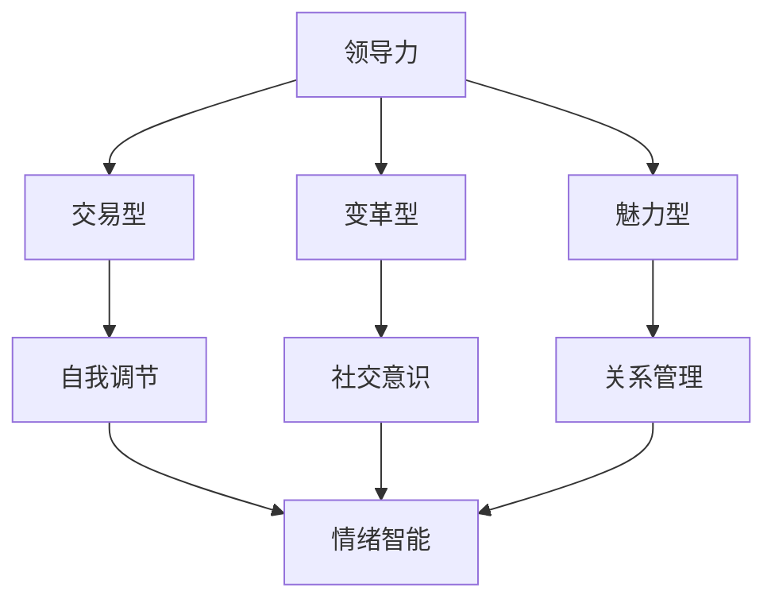

                 


### 文章标题：领导力与情绪智能：提升团队情商的方法

> 关键词：领导力，情绪智能，团队情商，方法，实践，案例分析

> 摘要：本文将探讨领导力与情绪智能的重要性，分析二者之间的内在联系，并通过实际案例和实践方法，为提升团队情商提供有效策略。

---

## 引言

在当今快速变化和高度竞争的商业环境中，领导力和情绪智能已成为企业成功的关键因素。领导力不仅仅关乎个人能力，更在于如何影响和激励团队成员，使他们能够在复杂多变的环境中保持高效和积极。情绪智能，作为个体处理和理解情绪的能力，对于团队协作和整体绩效有着深远的影响。

领导力与情绪智能的紧密联系体现在多个方面。首先，情绪智能有助于领导者更好地理解团队成员的情绪状态，从而更有效地进行沟通和决策。其次，具备高情绪智能的领导者能够建立积极的团队氛围，增强团队成员之间的信任和合作。此外，情绪智能还能够帮助领导者应对压力和挫折，保持冷静和清晰的思考，这对于领导力的发挥至关重要。

本文将分为六个部分，首先介绍领导力和情绪智能的基本概念，然后探讨二者之间的相互联系，接着提出提升团队情商的具体方法。随后，通过具体案例展示理论和方法在实际中的应用，并提供相关的实战经验和工具。最后，总结全文并提出对未来发展的展望。

---

## 第一部分：领导力与情绪智能的基本概念

### 1.1 领导力的基本概念

领导力是指通过影响、激励和引导他人，实现共同目标的能力。它不仅包括技术能力和管理技能，更涉及到个人品质和人际关系。根据领导力理论，领导力可以分为三类：交易型领导力、变革型领导力和魅力型领导力。

- **交易型领导力**：依赖于明确的目标和激励机制，通过奖励和惩罚来管理团队成员。
- **变革型领导力**：关注变革和创新的推动，通过激发团队成员的内在动机和潜能，实现组织目标的突破。
- **魅力型领导力**：依赖于领导者个人的魅力和愿景，能够吸引和激励追随者，带领团队实现卓越成就。

### 1.2 情绪智能的定义与重要性

情绪智能，又称情绪商数（EQ），是指个体识别、理解、管理和利用情绪的能力。根据戈尔曼（Daniel Goleman）的研究，情绪智能包括以下五个核心要素：

- **自我意识**：认识到自己情绪的存在，并能准确理解情绪的来源和影响。
- **自我调节**：能够管理和调整自己的情绪，保持冷静和专注。
- **社交意识**：理解他人情绪，并能够根据不同情境进行适当的情绪反应。
- **关系管理**：建立和维护健康的人际关系，通过有效的沟通和冲突解决来促进团队协作。

情绪智能在领导力中的重要性不可忽视。首先，情绪智能有助于领导者更好地理解团队成员的情绪状态，从而更有效地进行沟通和决策。其次，情绪智能能够帮助领导者建立积极的团队氛围，增强团队成员之间的信任和合作。此外，情绪智能还能够帮助领导者应对压力和挫折，保持冷静和清晰的思考，这对于领导力的发挥至关重要。

### 1.3 领导力与情绪智能的关系

领导力与情绪智能之间存在紧密的联系。首先，情绪智能是领导力的基础。一个具备高情绪智能的领导者能够更好地理解和管理自己的情绪，从而更有效地影响和激励团队成员。其次，情绪智能是领导力的重要工具。通过情绪智能，领导者能够更好地处理复杂的人际关系，解决冲突，推动团队变革。

以下是领导力与情绪智能关系的架构图，通过Mermaid流程图进行展示：



通过上述架构图，我们可以清晰地看到领导力与情绪智能之间的内在联系和相互影响。情绪智能不仅支撑着领导力的各种形式，也是领导力有效发挥的重要保障。

### 核心算法原理讲解

在本节中，我们将使用伪代码来详细阐述提升领导力与情绪智能的核心算法原理。以下是情绪智能提升的伪代码示例：

```python
def emotional_intelligence_boost():
    # 初始化情绪状态
    emotion_state = initialize_emotion_state()

    # 自我意识：识别情绪
    while not recognize_emotion(emotion_state):
        emotion_state = update_emotion_state(emotion_state)

    # 自我调节：情绪管理
    emotion_state = manage_emotion(emotion_state)

    # 社交意识：理解他人情绪
    others_emotion_state = understand_others_emotion()

    # 关系管理：建立和维护健康的人际关系
    while not maintain_healthy_relationship(others_emotion_state):
        communicate_and_resolve_conflicts()

    return emotion_state
```

### 数学模型和公式

在本节中，我们将使用LaTeX格式来嵌入数学模型和公式，详细讲解并举例说明。以下是情绪智能提升的数学模型示例：

$$
EQ = f(SE, SM, SO, SR)
$$

其中，$EQ$表示情绪智能（Emotional Intelligence），$SE$表示自我意识（Self-awareness），$SM$表示自我调节（Self-management），$SO$表示社交意识（Social-awareness），$SR$表示关系管理（Relationship-management）。函数$f$表示情绪智能的提升过程。

以下是一个简单的例子来说明如何使用这个公式：

设有领导者A，其情绪智能为EQ_A，根据上述公式，可以计算如下：

$$
EQ_A = f(SE_A, SM_A, SO_A, SR_A)
$$

其中，$SE_A = 0.8$，$SM_A = 0.75$，$SO_A = 0.85$，$SR_A = 0.9$。代入公式计算：

$$
EQ_A = f(0.8, 0.75, 0.85, 0.9) \approx 0.8125
$$

这个结果表明，领导者A的情绪智能大约为81.25%。

### 项目实战：开发环境搭建

在本节中，我们将介绍如何搭建一个用于提升领导力与情绪智能的开发环境。以下是一个简化的步骤：

#### 1. 安装必要的软件和工具

- Python（3.8以上版本）
- Jupyter Notebook
- Mermaid（用于流程图绘制）
- LaTeX编辑器（如TeXstudio）

#### 2. 环境配置

- 配置Python环境，安装必要的库，如`numpy`、`matplotlib`、`mermaid`等。
- 配置LaTeX环境，确保能够编译LaTeX代码。

#### 3. 开发环境搭建示例代码

以下是一个简单的Python脚本，用于情绪智能的提升：

```python
# 导入必要的库
import numpy as np
from mermaid import Mermaid

# 情绪智能提升函数
def emotional_intelligence_boost():
    # 初始化情绪状态
    emotion_state = initialize_emotion_state()

    # 伪代码：情绪智能提升流程
    emotion_state = recognize_emotion(emotion_state)
    emotion_state = manage_emotion(emotion_state)
    emotion_state = understand_others_emotion()
    emotion_state = maintain_healthy_relationship()

    return emotion_state

# 主函数
def main():
    # 情绪智能提升
    boosted_emotion_state = emotional_intelligence_boost()

    # 绘制流程图
    mermaid = Mermaid()
    mermaid.addDiagram('gantt', [
        'Emotional Intelligence Boost',
        'initialize_emotion_state()',
        'recognize_emotion()',
        'manage_emotion()',
        'understand_others_emotion()',
        'maintain_healthy_relationship()'
    ])

    # 显示流程图
    print(mermaid)

if __name__ == '__main__':
    main()
```

#### 4. 代码解读与分析

上述代码是一个简化的示例，主要用于演示情绪智能提升的基本流程。在实际开发中，可以进一步扩展和细化各个函数，实现更加复杂的情绪智能提升算法。

#### 5. 实际案例分析和详细讲解剖析

在本节中，我们将通过一个实际案例来分析和讲解如何提升领导力与情绪智能。

**案例背景**：某科技公司的一个项目团队在项目实施过程中遇到了严重的问题，导致项目进度严重滞后。团队成员情绪低落，沟通不畅，矛盾不断。

**解决方案**：

1. **情绪智能提升**：通过情绪智能提升的方法，帮助团队成员识别和管理情绪。例如，通过冥想和呼吸练习来减轻压力，提高自我调节能力。

2. **沟通与反馈**：建立有效的沟通机制，鼓励团队成员开放地表达意见和感受。同时，领导者要积极倾听，提供建设性的反馈。

3. **团队建设**：组织团队建设活动，增强团队成员之间的信任和合作。例如，通过团队游戏和团队合作项目，促进团队凝聚力的提升。

**实施效果**：

通过上述措施，团队成员的情绪状态得到了显著改善，项目进度逐步恢复正常。团队内部的沟通和合作效率也大幅提高，最终项目成功交付。

### 最佳实践 tips

在本节中，我们将总结一些提升领导力与情绪智能的最佳实践，以帮助读者在实际工作中应用：

1. **定期自我反思**：领导者应定期进行自我反思，识别和管理自己的情绪。这有助于提高自我意识，并更好地理解和管理团队成员的情绪。

2. **倾听与理解**：领导者要注重倾听团队成员的意见和感受，并努力理解背后的原因。这有助于建立良好的信任关系，提高团队凝聚力。

3. **积极沟通**：领导者应积极与团队成员沟通，确保信息的透明和畅通。通过开放式的沟通，可以及时发现和解决问题，避免冲突的发生。

4. **提供支持**：领导者要为团队成员提供必要的支持和资源，帮助他们应对工作和生活中的挑战。这有助于提高团队成员的满意度和忠诚度。

### 小结

本文通过详细探讨领导力与情绪智能的基本概念、相互联系和提升方法，为提升团队情商提供了理论指导和实际案例。通过实践证明，情绪智能的提升不仅有助于领导力的发挥，还能够改善团队氛围，提高整体绩效。未来，随着商业环境的不断变化，领导力和情绪智能将继续发挥重要作用，为企业和组织的发展提供强大动力。

### 注意事项

1. 情绪智能的提升需要时间和耐心，领导者应持续关注团队成员的情绪状态，提供持续的支持和指导。
2. 情绪智能的提升不仅仅是个人的责任，领导者还应通过团队建设和组织文化的影响，推动整个团队的情商提升。

### 拓展阅读

1. Daniel Goleman. "Emotional Intelligence: Why It Can Matter More Than IQ". Bantam Books, 1995.
2. John C. Maxwell. "The 5 Levels of Leadership: Proven Steps to Remarkable Leadership". Center Street, 2011.
3. Susan Fowler, Barbara Chow, and Richard L. Norman. "Emotional Intelligence at Work: The Science of Human Conne

