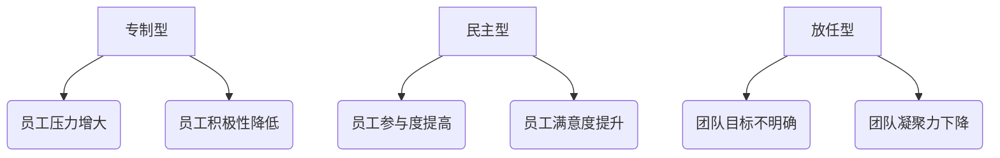

                 

为了完成这个任务，我们将遵循以下步骤：

### 1. 确定核心主题和目标读者

- 核心主题：领导力与情绪管理
- 目标读者：IT行业领导者、项目经理、技术团队负责人等

### 2. 制定文章结构和大纲

- 根据提供的大纲，我们将细化每个章节的内容，确保每个小节都有详细讲解、实例、代码和数学模型等。

### 3. 编写文章内容

- 每个章节将包括：
  - 背景介绍
  - 核心概念与联系（使用Mermaid流程图）
  - 算法原理讲解（使用伪代码）
  - 数学模型和公式（使用latex格式）
  - 项目实战（包括代码实现、分析、案例讲解）
  - 最佳实践 tips、小结、注意事项、拓展阅读等

### 4. 格式整理

- 使用Markdown格式输出文章内容。
- 在文章末尾添加作者信息。

### 5. 审核与修改

- 审核文章内容的完整性、逻辑性和可读性。
- 进行必要的修改和优化。

### 6. 最终确认

- 确认文章的字数在8000～12000字之间。
- 确认文章格式、内容和结构符合要求。

下面，我们将开始撰写文章，并逐步细化每个章节的内容。

---

# 《领导力与情绪管理：保持冷静的艺术》

## 关键词
- 领导力，情绪管理，冷静，团队管理，决策过程

## 摘要
本文旨在探讨领导力与情绪管理之间的关系，以及如何通过情绪管理保持冷静，从而提升领导力。文章分为三个部分：第一部分介绍领导力与情绪管理的基础知识；第二部分提供情绪管理策略与实践；第三部分通过案例分析，展示情绪管理在实际中的应用。

---

### 第一部分：领导力与情绪管理基础

#### 第1章：领导力的本质

##### 1.1 领导力定义与重要性
领导力是指个体影响和激励他人达成共同目标的能力。它不仅影响团队的整体表现，还对员工的情绪和行为产生深远影响。

$$
领导力 = 影响力 + 激励力
$$

领导力的重要性在于，它能够促进团队协作，提高工作效率，增强员工的忠诚度和满意度。

##### 1.2 领导风格
领导风格包括专制型、民主型、放任型等。不同的领导风格对员工情绪有不同的影响。

Mermaid流程图：

##### 1.3 领导力与情绪管理的关系
领导力与情绪管理密切相关。一个有效的领导者不仅需要具备决策能力，还需要懂得如何管理自己的情绪，以避免负面情绪对团队的影响。

#### 第2章：情绪管理基础

##### 2.1 情绪类型与情感
情绪可以分为基本情绪（如快乐、愤怒、悲伤等）和复杂情绪（如焦虑、厌恶等）。情感是情绪的深层次体验。

##### 2.2 情绪的影响
情绪对个体和团队的影响不可忽视。积极情绪可以提高工作效率，增强团队凝聚力；而消极情绪则会降低工作效率，影响团队协作。

##### 2.3 情绪识别与管理
情绪识别是情绪管理的基础。领导者需要学会识别自己的情绪，并采取有效的管理策略。

---

### 第二部分：情绪管理策略与实践

#### 第3章：自我情绪管理

##### 3.1 自我情绪认知
自我情绪认知是情绪管理的重要步骤。领导者需要了解自己的情绪，并学会对其进行认知。

##### 3.2 自我情绪调节
自我情绪调节包括认知重构、行为调节和情绪表达。领导者需要学会在压力下保持冷静，并有效地表达自己的情绪。

##### 3.3 自我情绪表达
有效的情绪表达可以减少误解和冲突，增强团队的沟通。

#### 第4章：团队情绪管理

##### 4.1 团队情绪氛围建设
团队情绪氛围对团队的整体表现有重要影响。领导者需要营造积极、和谐的团队氛围。

##### 4.2 团队情绪沟通
团队情绪沟通是团队情绪管理的关键。领导者需要学会倾听和理解团队成员的情绪，并采取适当的沟通策略。

##### 4.3 团队情绪冲突管理
团队情绪冲突不可避免，但有效的冲突管理可以减少负面影响，增强团队凝聚力。

#### 第5章：领导者的情绪管理

##### 5.1 领导者情绪管理的重要性
领导者的情绪管理对团队和组织的影响深远。有效的情绪管理可以提高领导者的决策能力和团队绩效。

##### 5.2 领导者情绪管理策略
领导者需要掌握情绪管理策略，如情绪认知、情绪调节和情绪表达。

##### 5.3 领导者情绪角色模型
领导者需要扮演不同的情绪角色，以适应不同的领导场景。

---

### 第三部分：情绪管理实战案例

#### 第6章：企业情绪管理案例分析

##### 6.1 案例背景介绍
介绍案例企业的基本情况，以及情绪管理问题的具体表现。

##### 6.2 情绪管理策略实施
分析案例企业如何实施情绪管理策略，并介绍实施过程。

##### 6.3 案例效果评估
评估情绪管理策略实施的效果，包括团队绩效、员工满意度等方面。

#### 第7章：情绪管理实践指南

##### 7.1 情绪管理工具与方法
介绍情绪管理相关的工具和方法，如情绪日记、情绪调节技巧等。

##### 7.2 情绪管理培训与教育
探讨情绪管理培训和教育的重要性，以及如何设计和实施有效的培训计划。

##### 7.3 情绪管理可持续发展
讨论情绪管理的长期策略和可持续发展路径。

---

## 附录

### 附录A：情绪管理资源与参考文献

- 情绪管理相关书籍推荐
- 情绪管理在线资源链接
- 参考文献

---

# 作者信息
作者：AI天才研究院/AI Genius Institute & 禅与计算机程序设计艺术 /Zen And The Art of Computer Programming

---

接下来，我们将继续细化每个章节的内容，包括添加伪代码、数学模型、实战案例等，以满足字数要求和文章完整性。请您确认上述内容，并告知是否需要进一步调整。

