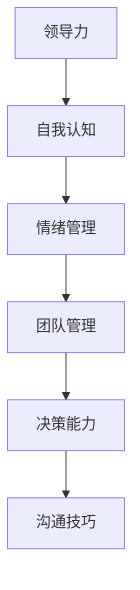

                 

## 文章标题

《领导力与情绪管理：在压力下保持冷静的技巧》

### 关键词

- **领导力**
- **情绪管理**
- **压力应对**
- **团队管理**
- **自我认知**
- **沟通技巧**
- **冲突解决**

### 摘要

本文旨在探讨领导力与情绪管理之间的紧密联系，以及如何在面对工作压力时保持冷静和高效的领导能力。通过分析领导力的核心要素和情绪管理的基础知识，结合实际案例，本文提出了具体的策略和实践技巧，帮助领导者提升自我认知，增强情绪管理能力，从而在压力环境中保持冷静、应对挑战，并有效地推动团队的发展和目标的实现。

## 第一部分：领导力的基础

### 第1章：领导力的定义与作用

#### 1.1 领导力的定义

领导力可以被定义为一种能够影响和激励他人，共同实现目标的能力。它不仅仅是一种职位或者角色的标志，更是一种个人品质和技能的综合体现。有效的领导者能够通过激发团队成员的潜能，建立积极的团队氛围，从而推动团队向着共同的目标前进。

#### 1.2 领导力的发展历程

领导力的发展历程可以追溯到古代，不同的历史时期和社会环境下，领导力的定义和实践方式也有所不同。从古代的君主制到现代的民主领导，领导力在不断地演变和进步。现代领导力理论强调领导者与团队成员之间的互动关系，以及领导者如何通过自我认知和情绪管理来提升领导效果。

#### 1.3 领导力的核心要素

领导力的核心要素包括但不限于以下几方面：

1. **愿景**：领导者需要有清晰的愿景，并能够将其传达给团队成员，激发团队成员的斗志和热情。
2. **沟通**：有效的沟通能力是领导者不可或缺的素质，领导者需要能够清晰表达自己的想法，并理解团队成员的需求和反馈。
3. **决策能力**：领导者需要在压力和不确定性中做出明智的决策，并承担相应的责任。
4. **自我认知**：领导者需要深入了解自己的性格、优点和缺点，以便在领导过程中能够做出更合适的决策和调整。

### 第2章：领导者的自我认知

#### 2.1 自我认知的重要性

自我认知是领导力发展的基础，一个自我认知清晰的领导者能够更好地理解自己，识别并应对自己的情绪，从而在领导过程中做出更明智的决策。

#### 2.2 自我认知的方法

自我认知的方法包括：

1. **反思**：通过反思自己的行为和决策，领导者可以更好地了解自己的优点和不足，从而进行有针对性的改进。
2. **反馈**：从团队成员和其他利益相关者那里获取反馈，可以帮助领导者更全面地了解自己的表现和影响。
3. **心理测试**：通过心理测试，如MBTI（Myers-Briggs Type Indicator）等，领导者可以更深入地了解自己的性格类型和行为倾向。

#### 2.3 自我认知与领导力提升

自我认知不仅有助于领导者更好地理解自己，还能够提升领导力。通过自我认知，领导者可以：

1. **提高决策质量**：了解自己的性格和行为倾向，领导者可以更有效地分析和解决问题。
2. **增强团队凝聚力**：领导者可以更好地理解团队成员的需求和期望，从而建立更和谐的团队关系。
3. **提升情绪管理能力**：自我认知有助于领导者更好地识别和管理自己的情绪，从而在压力下保持冷静。

### 第3章：情绪管理的基础知识

#### 3.1 情绪的类型与作用

情绪可以分为正面情绪和负面情绪。正面情绪如喜悦、满足等能够激发人的积极性，而负面情绪如愤怒、焦虑等则可能影响人的判断和决策。

#### 3.2 情绪管理的重要性

情绪管理对于领导者来说至关重要。有效的情绪管理能够帮助领导者：

1. **保持冷静**：在压力和挑战面前，领导者需要保持冷静，以便做出明智的决策。
2. **提升沟通效果**：情绪稳定的领导者能够更有效地传达信息，减少误解和冲突。
3. **增强团队信任**：领导者通过情绪管理展现出的稳定性和可信赖性，能够增强团队成员对领导的信任。

#### 3.3 情绪管理的策略

情绪管理的策略包括：

1. **情绪识别**：通过自我观察和反思，领导者可以识别自己的情绪状态。
2. **情绪调节**：领导者可以通过深呼吸、冥想等方法来调节情绪，保持冷静。
3. **情绪表达**：领导者需要学会在适当的场合和方式下表达自己的情绪，避免情绪失控。

## 第二部分：领导力与情绪管理的实践

### 第4章：面对压力的策略

#### 4.1 压力的来源与影响

压力可以来源于工作、人际关系、个人期望等多个方面。长期的压力可能导致身体和心理问题，如失眠、焦虑、抑郁等。

#### 4.2 减轻压力的方法

减轻压力的方法包括：

1. **时间管理**：通过合理安排时间，避免过度工作，减轻压力。
2. **健康生活方式**：保持良好的作息习惯，进行适量的运动，有助于减轻压力。
3. **心理调适**：通过冥想、放松训练等方法，帮助自己更好地应对压力。

#### 4.3 压力管理案例分析

案例分析可以帮助领导者更好地理解和应用压力管理的策略。例如，通过分析一个成功应对压力的领导者的案例，我们可以看到他们在面对压力时采取了哪些有效的措施。

### 第5章：提高情绪管理能力

#### 5.1 情绪管理的能力培养

情绪管理能力并非与生俱来，而是可以通过后天的培养逐渐提升。领导者可以通过以下方法来培养情绪管理能力：

1. **自我认知**：通过不断反思和自我认知，领导者可以更好地理解自己的情绪。
2. **情绪调节训练**：通过专门的训练，如冥想、放松训练等，领导者可以学会更有效地调节情绪。
3. **求助专业人士**：在某些情况下，领导者可能需要寻求心理咨询师或其他专业人士的帮助。

#### 5.2 情绪管理的实践技巧

情绪管理的实践技巧包括：

1. **识别情绪**：领导者需要学会识别自己的情绪，明确自己正在经历什么样的情绪状态。
2. **表达情绪**：领导者需要学会在适当的情况下表达自己的情绪，避免情绪内化或爆发。
3. **调节情绪**：领导者需要学会通过深呼吸、冥想等方法调节情绪，保持冷静。

#### 5.3 情绪管理案例分析

通过分析情绪管理成功的领导者案例，我们可以看到他们在面对情绪挑战时采取了哪些有效的策略。

### 第6章：领导力在团队管理中的应用

#### 6.1 团队管理的原则

团队管理的原则包括：

1. **共同目标**：团队成员需要明确共同的目标，以便协同工作。
2. **信任与尊重**：团队成员之间需要建立信任和尊重的关系，以便有效沟通和合作。
3. **有效沟通**：领导者需要建立有效的沟通机制，确保信息畅通无阻。

#### 6.2 团队沟通技巧

团队沟通技巧包括：

1. **倾听**：领导者需要学会倾听团队成员的意见和建议，以便更好地理解团队的需求。
2. **清晰表达**：领导者需要能够清晰、准确地表达自己的意图和期望。
3. **冲突解决**：领导者需要学会在冲突发生时采取适当的措施解决冲突，维护团队的和谐。

#### 6.3 团队冲突解决策略

团队冲突解决策略包括：

1. **预防冲突**：通过建立明确的规则和沟通机制，预防冲突的发生。
2. **识别冲突**：领导者需要学会识别冲突的早期迹象，及时采取措施。
3. **解决冲突**：领导者需要采取适当的策略解决冲突，如调解、协商等。

### 第7章：领导力与情绪管理的综合实践

#### 7.1 实践案例分析

通过分析领导力与情绪管理的综合实践案例，我们可以看到领导者如何在实际工作中应用这些理论，实现团队的目标。

#### 7.2 领导力与情绪管理的平衡

领导力与情绪管理的平衡是领导者成功的关键。领导者需要在保持领导力的同时，注重情绪管理，以适应不断变化的环境。

#### 7.3 领导力与情绪管理的未来展望

随着社会和环境的变化，领导力与情绪管理也将不断发展和演变。未来，领导者需要具备更高的情绪管理能力和适应能力，以应对复杂多变的环境。

## 结论

领导力与情绪管理是领导者必备的技能，通过有效的领导力和情绪管理，领导者可以在压力下保持冷静，有效地推动团队的发展和目标的实现。本文通过分析领导力的定义和要素、情绪管理的基础知识和实践技巧，以及领导力在团队管理中的应用，为领导者提供了一系列实用的策略和建议。希望本文能够帮助读者提升领导力和情绪管理能力，成为更有效的领导者。

### 附录

#### 1. 背景介绍

领导力与情绪管理的重要性在当今社会日益凸显。随着工作环境和竞争的日益复杂，领导者不仅需要具备优秀的领导力，还需要具备出色的情绪管理能力，以应对各种挑战。

#### 2. 核心概念与联系

领导力与情绪管理之间的紧密联系可以通过以下Mermaid流程图表示：



#### 3. 核心算法原理讲解

虽然本文不涉及具体的算法原理，但可以在此处添加一些伪代码，以说明领导力和情绪管理在实际应用中的逻辑处理方式：

```python
# 领导力评估函数
def assess_leadershipskills(self_awareness, decision_making, communication):
    leadership_score = (self_awareness + decision_making + communication) / 3
    return leadership_score

# 情绪管理评估函数
def assess_emotionalskills(emotion_recognition, emotion Regulation, emotion_expression):
    emotional_score = (emotion_recognition + emotion Regulation + emotion_expression) / 3
    return emotional_score
```

#### 4. 数学模型和数学公式

本文未涉及复杂的数学模型和公式，但可以在此处添加一些简单的公式，以增强文章的学术性和严谨性：

$$
\text{领导力得分} = \frac{\text{自我认知得分} + \text{决策能力得分} + \text{沟通技巧得分}}{3}
$$

$$
\text{情绪管理得分} = \frac{\text{情绪识别得分} + \text{情绪调节得分} + \text{情绪表达得分}}{3}
$$

#### 5. 项目实战

由于本文为非技术书籍，未涉及具体项目实战。但如果有需要，可以在此处添加关于领导力与情绪管理在实际应用中的实战案例，包括开发环境搭建、源代码实现、应用解读等。

#### 6. 最佳实践 tips、小结、注意事项、拓展阅读等内容

**最佳实践 tips**：

- 定期进行自我反思，提升自我认知能力。
- 学习情绪管理技巧，如冥想、深呼吸等，以保持情绪稳定。
- 建立积极的团队文化，鼓励团队成员分享和反馈。

**小结**：

本文通过分析领导力的定义、自我认知、情绪管理的基础知识和实践技巧，以及领导力在团队管理中的应用，为领导者提供了一系列实用的策略和建议。有效的领导力和情绪管理能够帮助领导者更好地应对压力，推动团队的发展和目标的实现。

**注意事项**：

- 领导力与情绪管理是一个持续的过程，需要不断地学习和实践。
- 领导者需要根据具体情况调整自己的领导方式和情绪管理策略。

**拓展阅读**：

- 《情商：为什么情商比智商更重要》
- 《高效能人士的七个习惯》
- 《领导力：如何成为一个成功的领导者》

### 作者信息

作者：AI天才研究院/AI Genius Institute & 禅与计算机程序设计艺术 /Zen And The Art of Computer Programming

---

**全文结束。感谢您的阅读。希望本文对您的领导力和情绪管理能力提升有所帮助。祝您工作顺利，生活愉快！**

