                 

### 文章标题

领导力与情绪管理：掌控情绪的智慧

### 关键词

领导力，情绪管理，情绪智力，情商，自我认知，情绪调节，情绪表达

### 摘要

本文旨在探讨领导力与情绪管理之间的关系，以及如何通过掌控情绪的智慧来提升领导力。文章首先介绍了领导力的本质和重要性，接着深入探讨了情绪管理的基本概念，包括情绪的类型、生理反应以及管理情绪的重要性。随后，文章详细分析了情绪管理与领导力的联系，以及情绪智力在领导力中的作用。在此基础上，文章介绍了情绪管理的技巧，包括自我认知、情绪调节和情绪表达。最后，通过实际案例和项目实战，阐述了情绪管理在领导力实践中的应用，并给出了最佳实践和注意事项。

## 第一部分：领导力的基础

### 第1章：领导力的本质

#### 1.1 领导力的定义

领导力是一种能力，它不仅仅关乎指挥和控制，更重要的是激发和引导他人的潜能，实现共同的目标。领导力与传统管理存在显著差异，管理强调的是秩序、规则和效率，而领导力则强调愿景、信任和变革。

**核心概念与联系**

领导力的定义与理论发展密切相关。图1展示了领导力定义的发展历程，从早期的特质理论到行为理论，再到情境理论，最终形成了现代的多维领导力模型。

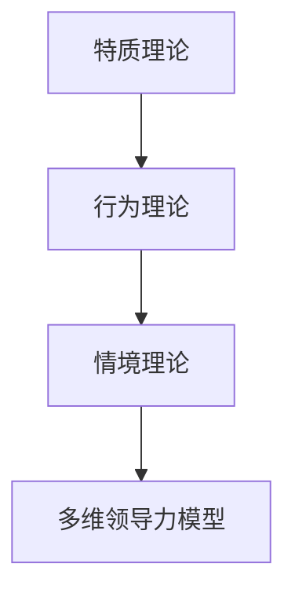

**核心算法原理讲解**

为了更好地理解领导力，我们可以将其视为一种算法。图2展示了领导力算法的基本步骤，包括识别目标、建立愿景、激发团队动力、反馈和调整。

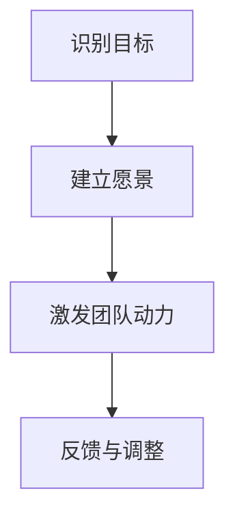

**数学模型和数学公式**

我们可以用以下公式来描述领导力的影响：

$$
L = f(E, S, M)
$$

其中，$L$ 代表领导力，$E$ 代表情商，$S$ 代表战略思维，$M$ 代表行动力。这个公式表明，领导力是情商、战略思维和行动力的函数。

**项目实战**

在实际应用中，领导力可以通过以下步骤来提升：

1. **自我认知**：通过反思和自我评估，了解自身的优点和不足。
2. **愿景建立**：明确团队的目标和愿景，使团队成员有所追求。
3. **团队建设**：通过有效的沟通和激励，建立信任和凝聚力。
4. **战略规划**：制定可行的战略和计划，确保目标的实现。

#### 1.2 领导力的重要性

领导力对个人、团队和组织的影响至关重要。对于个人而言，领导力是职业发展的关键因素，能够提升个人的影响力和竞争力。对于团队而言，领导力能够激发团队成员的潜力，提高团队的绩效和满意度。对于组织而言，领导力是保持竞争优势和持续发展的基础。

**核心概念与联系**

领导力的重要性可以通过以下三个方面来理解：

1. **个人成长**：领导力是一种自我管理的能力，能够帮助个人更好地应对挑战，实现个人价值。
2. **团队发展**：领导力能够引导团队朝着共同的目标前进，提高团队的整体效能。
3. **组织效率**：领导力是组织战略执行的核心，能够提高组织的运行效率和创新能力。

**数学模型和数学公式**

我们可以用以下公式来描述领导力对团队绩效的影响：

$$
P = f(L, T, O)
$$

其中，$P$ 代表团队绩效，$L$ 代表领导力，$T$ 代表团队成员的能力，$O$ 代表组织环境。这个公式表明，团队绩效是领导力、团队成员能力和组织环境的函数。

**项目实战**

为了提升领导力，个人可以采取以下策略：

1. **不断学习**：通过阅读、培训和经验分享，提升自身的知识和技能。
2. **积极实践**：通过参与实际项目和领导团队，提升领导实践能力。
3. **反思与总结**：定期反思领导实践，总结经验教训，不断改进。

#### 1.3 领导力的三要素

领导力不是单一的能力，而是由多个要素构成的。其中，情商、战略思维和行动力是领导力的三个核心要素。

**核心概念与联系**

1. **情商**：情商是理解和管理自己及他人情绪的能力。它包括自我认知、自我调节、社交意识和关系管理。
2. **战略思维**：战略思维是制定和实施长期目标的思维能力。它包括愿景规划、资源整合和风险评估。
3. **行动力**：行动力是将战略转化为实际行动的能力。它包括目标设定、时间管理和执行力。

**核心算法原理讲解**

我们可以用以下算法来描述领导力的三要素：

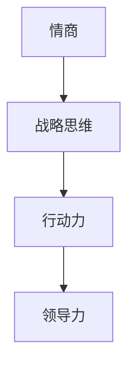

**数学模型和数学公式**

我们可以用以下公式来描述领导力的三要素：

$$
L = f(EQ, ST, AC)
$$

其中，$L$ 代表领导力，$EQ$ 代表情商，$ST$ 代表战略思维，$AC$ 代表行动力。这个公式表明，领导力是情商、战略思维和行动力的函数。

**项目实战**

为了提升领导力的三要素，个人可以采取以下策略：

1. **提升情商**：通过自我反思和情感教练，提升自我认知和情感调节能力。
2. **培养战略思维**：通过阅读战略管理书籍和参与战略规划实践，提升战略规划能力。
3. **增强行动力**：通过制定清晰的目标和计划，提升执行力和时间管理能力。

### 第2章：情绪管理的概念

#### 2.1 情绪的类型

情绪是人的心理体验，包括正面情绪和负面情绪。正面情绪如喜悦、满足和兴奋，能够提升个体的幸福感和生产力。负面情绪如焦虑、沮丧和愤怒，如果得不到有效管理，会降低个体的幸福感和生产力。

**核心概念与联系**

情绪的类型可以通过以下两个方面来理解：

1. **生理反应**：情绪不仅是一种心理体验，还伴随着生理反应。图3展示了情绪的生理反应过程。
2. **情感体验**：不同类型的情绪会带来不同的情感体验，影响个体的思维和行为。

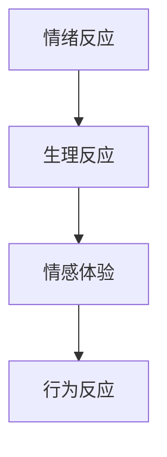

**核心算法原理讲解**

我们可以用以下算法来描述情绪的类型和生理反应：

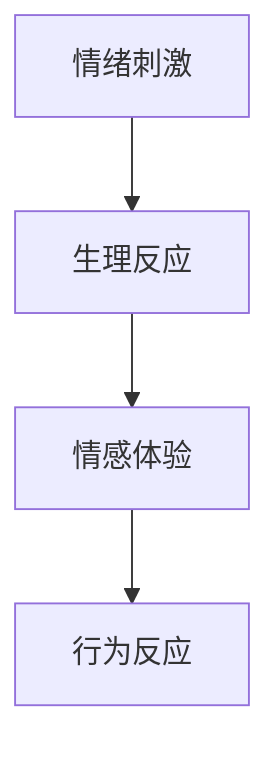

**数学模型和数学公式**

我们可以用以下公式来描述情绪的类型和生理反应：

$$
E = f(S, P)
$$

其中，$E$ 代表情绪，$S$ 代表情绪刺激，$P$ 代表生理反应。这个公式表明，情绪是情绪刺激和生理反应的函数。

**项目实战**

为了更好地理解情绪的类型和生理反应，个人可以采取以下策略：

1. **情绪记录**：记录自己的情绪变化，了解不同情绪的生理反应。
2. **情绪观察**：观察他人的情绪表达，提升社交意识。
3. **情绪调节**：通过情绪调节技巧，管理负面情绪，提升情绪体验。

#### 2.2 情绪的生理反应

情绪的生理反应是情绪体验的生理基础。当个体经历情绪刺激时，大脑会释放出一系列神经递质，导致生理反应。这些生理反应包括心率变化、血压升高、呼吸急促等。

**核心概念与联系**

情绪的生理反应可以通过以下三个方面来理解：

1. **神经传递**：情绪刺激通过神经系统传递，引起生理反应。
2. **激素分泌**：情绪刺激导致激素分泌，影响生理状态。
3. **生理反应**：生理反应包括心率、血压、呼吸等生理指标的变化。

**核心算法原理讲解**

我们可以用以下算法来描述情绪的生理反应：

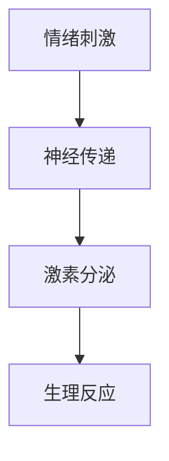

**数学模型和数学公式**

我们可以用以下公式来描述情绪的生理反应：

$$
P = f(N, H)
$$

其中，$P$ 代表生理反应，$N$ 代表神经传递，$H$ 代表激素分泌。这个公式表明，生理反应是神经传递和激素分泌的函数。

**项目实战**

为了更好地理解情绪的生理反应，个人可以采取以下策略：

1. **生理监测**：通过生理监测设备，记录自己的生理反应。
2. **情绪管理**：通过情绪管理技巧，减轻负面情绪的生理反应。
3. **健康生活**：通过健康的生活方式，改善情绪的生理反应。

#### 2.3 情绪管理的重要性

情绪管理是情绪智力的重要组成部分，对于个体的幸福感和生产力有着重要的影响。有效的情绪管理能够帮助个体更好地应对挑战，提高工作效率，改善人际关系。

**核心概念与联系**

情绪管理的重要性可以通过以下两个方面来理解：

1. **工作效率**：情绪管理能够帮助个体保持专注和冷静，提高工作效率。
2. **人际关系**：情绪管理能够帮助个体更好地处理人际关系，提升沟通效果。

**核心算法原理讲解**

我们可以用以下算法来描述情绪管理的重要性：

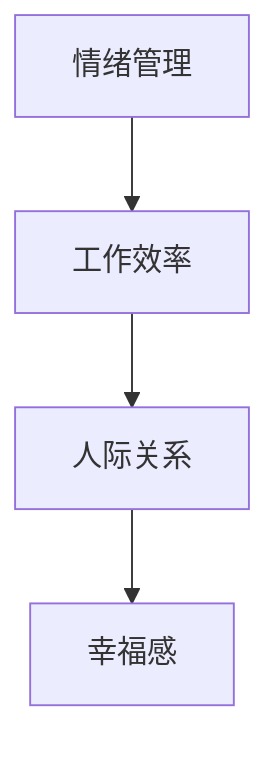

**数学模型和数学公式**

我们可以用以下公式来描述情绪管理的重要性：

$$
W = f(EM, HR)
$$

其中，$W$ 代表幸福感，$EM$ 代表情绪管理，$HR$ 代表人际关系。这个公式表明，幸福感是情绪管理和人际关系的函数。

**项目实战**

为了提升情绪管理能力，个人可以采取以下策略：

1. **情绪认知**：通过自我反思和情绪记录，提升对情绪的认知。
2. **情绪调节**：通过情绪调节技巧，管理负面情绪。
3. **情绪表达**：通过有效的情绪表达，改善人际关系。

### 第二部分：情绪管理技巧

#### 第3章：情绪管理与领导力

#### 3.1 情绪管理在领导力中的应用

情绪管理在领导力中的应用至关重要。有效的情绪管理能够帮助领导者在面对挑战和压力时保持冷静和理智，提高决策质量和执行力。同时，情绪管理也能够帮助领导者建立信任，提升团队凝聚力。

**核心概念与联系**

情绪管理在领导力中的应用可以通过以下两个方面来理解：

1. **情绪调节**：领导者通过情绪调节技巧，管理自己的情绪，避免负面情绪对决策和行为的影响。
2. **情绪表达**：领导者通过有效的情绪表达，传达自己的情感和意图，增强团队沟通和理解。

**核心算法原理讲解**

我们可以用以下算法来描述情绪管理在领导力中的应用：

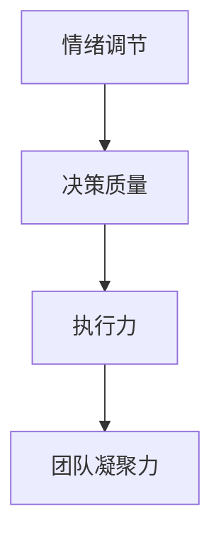

**数学模型和数学公式**

我们可以用以下公式来描述情绪管理在领导力中的应用：

$$
L = f(EM, D, E)
$$

其中，$L$ 代表领导力，$EM$ 代表情绪管理，$D$ 代表决策质量，$E$ 代表执行力。这个公式表明，领导力是情绪管理、决策质量和执行力的函数。

**项目实战**

为了提升情绪管理在领导力中的应用，领导者可以采取以下策略：

1. **情绪认知**：通过自我反思和情绪记录，提升对自身情绪的认知。
2. **情绪调节**：通过情绪调节技巧，管理负面情绪。
3. **情绪表达**：通过有效的情绪表达，增强团队沟通和理解。

#### 3.2 情绪智力与领导力

情绪智力是情绪管理的重要组成部分，它包括自我认知、自我调节、社交意识和关系管理。情绪智力对领导力有着深远的影响，能够提升领导者的决策能力、执行力和团队凝聚力。

**核心概念与联系**

情绪智力与领导力之间的关系可以通过以下三个方面来理解：

1. **自我认知**：情绪智力帮助领导者更好地理解自己的情绪，提高自我调节能力。
2. **社交意识**：情绪智力帮助领导者更好地理解他人的情绪，提升沟通和人际关系管理能力。
3. **关系管理**：情绪智力帮助领导者建立和维护良好的团队关系，提升团队凝聚力。

**核心算法原理讲解**

我们可以用以下算法来描述情绪智力与领导力之间的关系：

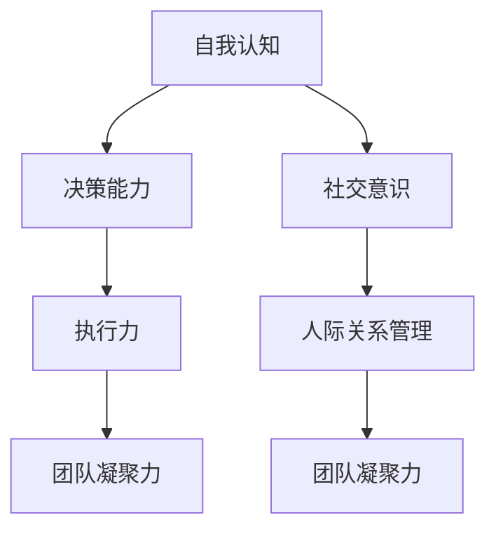

**数学模型和数学公式**

我们可以用以下公式来描述情绪智力与领导力之间的关系：

$$
L = f(EQ, D, E)
$$

其中，$L$ 代表领导力，$EQ$ 代表情绪智力，$D$ 代表决策能力，$E$ 代表执行力。这个公式表明，领导力是情绪智力、决策能力和执行力的函数。

**项目实战**

为了提升情绪智力，领导者可以采取以下策略：

1. **情绪认知**：通过自我反思和情绪记录，提升对自身情绪的认知。
2. **情绪调节**：通过情绪调节技巧，管理负面情绪。
3. **社交意识**：通过观察他人的情绪表达，提升社交意识。
4. **关系管理**：通过有效的沟通和情感表达，建立和维护良好的团队关系。

#### 3.3 情绪管理与领导风格

领导风格是领导者管理团队的方式和方法，包括权力距离、变革型和民主型领导风格。情绪管理对领导风格有着重要的影响，能够提升领导者的管理效果。

**核心概念与联系**

情绪管理与领导风格之间的关系可以通过以下两个方面来理解：

1. **权力距离**：情绪管理能够帮助领导者更好地处理权力距离，提升领导效果。
2. **变革型和民主型领导风格**：情绪管理能够帮助领导者更好地适应变革型和民主型领导风格，提升团队绩效。

**核心算法原理讲解**

我们可以用以下算法来描述情绪管理与领导风格之间的关系：

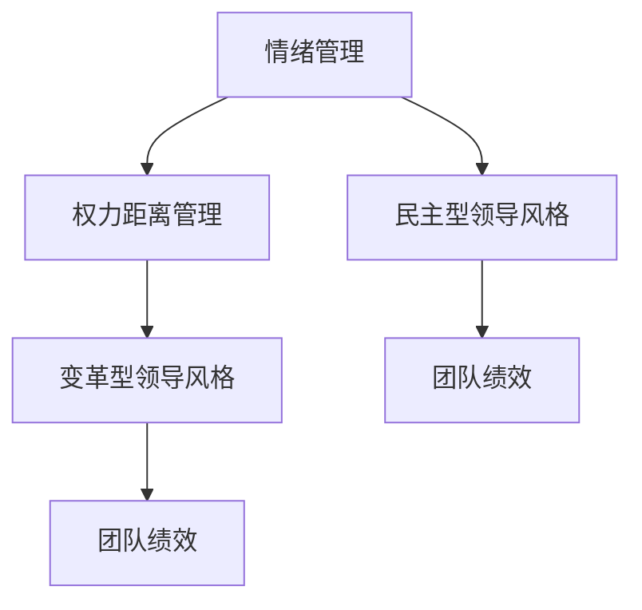

**数学模型和数学公式**

我们可以用以下公式来描述情绪管理与领导风格之间的关系：

$$
L = f(EM, PD, C)
$$

其中，$L$ 代表领导力，$EM$ 代表情绪管理，$PD$ 代表权力距离，$C$ 代表变革型领导风格。这个公式表明，领导力是情绪管理、权力距离和变革型领导风格的函数。

**项目实战**

为了提升情绪管理与领导风格，领导者可以采取以下策略：

1. **情绪认知**：通过自我反思和情绪记录，提升对自身情绪的认知。
2. **情绪调节**：通过情绪调节技巧，管理负面情绪。
3. **变革型领导**：通过有效的变革型领导技巧，提升团队绩效。
4. **民主型领导**：通过有效的民主型领导技巧，增强团队凝聚力。

### 第3章：情绪管理与领导力

#### 3.1 情绪管理在领导力中的应用

情绪管理是领导力的重要组成部分，对于领导者的个人成长、团队发展和组织效率有着深远的影响。有效的情绪管理能够帮助领导者更好地应对挑战，提高决策质量和执行力，同时也能够提升团队凝聚力和员工满意度。

**核心概念与联系**

情绪管理在领导力中的应用可以通过以下几个方面来理解：

1. **情绪调节**：领导者需要通过情绪调节技巧来管理自己的情绪，避免负面情绪对决策和行为产生负面影响。情绪调节包括自我认知、自我调节和情感表达。

2. **情绪表达**：领导者需要学会如何有效地表达自己的情绪，以增强沟通和理解。情绪表达包括直接表达和间接表达。

3. **情绪智力**：情绪智力是领导者情绪管理能力的重要体现，它包括自我认知、自我调节、社交意识和关系管理。

4. **情绪情境**：领导者需要根据不同的情境来调整自己的情绪管理策略，以适应不同的工作环境和团队需求。

**核心算法原理讲解**

情绪管理在领导力中的应用可以通过以下算法来描述：

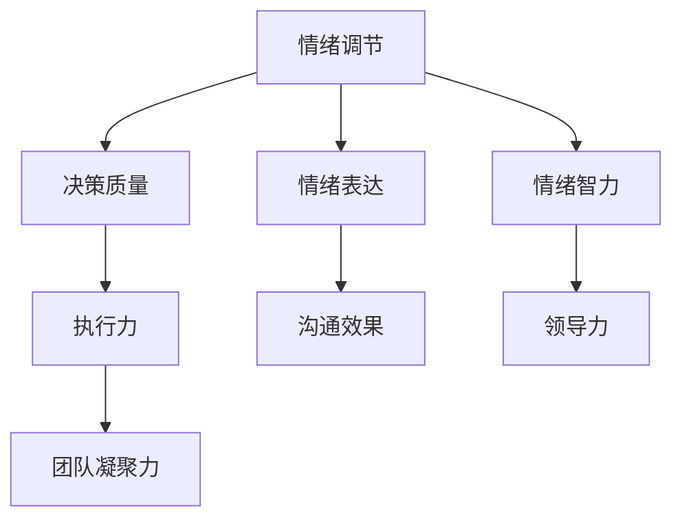

**数学模型和数学公式**

情绪管理在领导力中的应用可以通过以下数学模型来描述：

$$
L = f(EM, EQ, E, A)
$$

其中，$L$ 代表领导力，$EM$ 代表情绪管理，$EQ$ 代表情绪智力，$E$ 代表情绪表达，$A$ 代表情绪情境。这个公式表明，领导力是情绪管理、情绪智力、情绪表达和情绪情境的函数。

**项目实战**

在实际应用中，领导者可以采取以下策略来提升情绪管理：

1. **自我认知**：通过定期反思和自我评估，提升对自身情绪的认知。

2. **情绪调节**：通过深呼吸、冥想和认知重构等技巧，管理负面情绪。

3. **情绪表达**：通过有效的沟通技巧，如非暴力沟通，提升情绪表达。

4. **情绪智力**：通过阅读相关书籍、参加培训和实践，提升情绪智力。

#### 3.2 情绪智力与领导力

情绪智力（Emotional Intelligence，简称EQ）是领导者成功的关键因素之一。情绪智力包括自我认知、自我调节、社交意识和关系管理。情绪智力对领导力有着深远的影响，能够提升领导者的决策能力、执行力和团队凝聚力。

**核心概念与联系**

情绪智力与领导力之间的关系可以通过以下几个方面来理解：

1. **自我认知**：领导者需要具备良好的自我认知能力，了解自己的情绪和行为，这是情绪智力的基础。

2. **自我调节**：领导者需要能够有效地调节自己的情绪，避免负面情绪对决策和行为产生负面影响。

3. **社交意识**：领导者需要具备良好的社交意识，能够理解和识别他人的情绪，这是建立良好人际关系的基础。

4. **关系管理**：领导者需要能够建立和维护良好的团队关系，提升团队凝聚力和工作效率。

**核心算法原理讲解**

情绪智力与领导力之间的关系可以通过以下算法来描述：

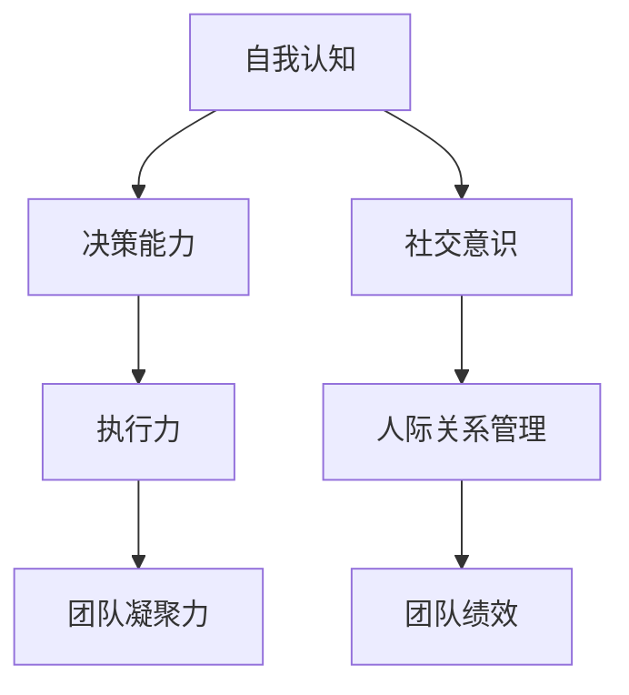

**数学模型和数学公式**

情绪智力与领导力之间的关系可以通过以下数学模型来描述：

$$
L = f(EQ, D, E)
$$

其中，$L$ 代表领导力，$EQ$ 代表情绪智力，$D$ 代表决策能力，$E$ 代表执行力。这个公式表明，领导力是情绪智力、决策能力和执行力的函数。

**项目实战**

为了提升情绪智力，领导者可以采取以下策略：

1. **自我认知**：通过定期反思和自我评估，提升对自身情绪的认知。

2. **情绪调节**：通过深呼吸、冥想和认知重构等技巧，管理负面情绪。

3. **社交意识**：通过观察和倾听，提升对他人的情绪认知。

4. **关系管理**：通过有效的沟通技巧，如非暴力沟通，提升人际关系管理。

#### 3.3 情绪管理与领导风格

领导风格是领导者管理团队的方式和方法，包括权力距离、变革型和民主型领导风格。情绪管理对领导风格有着重要的影响，能够提升领导者的管理效果。

**核心概念与联系**

情绪管理与领导风格之间的关系可以通过以下几个方面来理解：

1. **权力距离**：领导者需要通过情绪管理来处理权力距离，避免因权力差距导致的冲突和不满。

2. **变革型领导风格**：情绪管理能够帮助领导者更好地实施变革型领导风格，激发团队成员的潜力。

3. **民主型领导风格**：情绪管理能够帮助领导者更好地实施民主型领导风格，增强团队凝聚力和创造力。

**核心算法原理讲解**

情绪管理与领导风格之间的关系可以通过以下算法来描述：

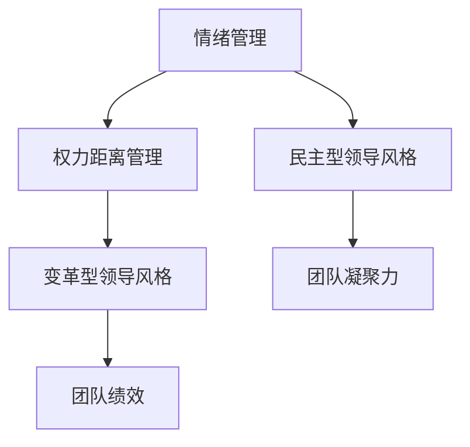

**数学模型和数学公式**

情绪管理与领导风格之间的关系可以通过以下数学模型来描述：

$$
L = f(EM, PD, C)
$$

其中，$L$ 代表领导力，$EM$ 代表情绪管理，$PD$ 代表权力距离，$C$ 代表变革型领导风格。这个公式表明，领导力是情绪管理、权力距离和变革型领导风格的函数。

**项目实战**

为了提升情绪管理与领导风格，领导者可以采取以下策略：

1. **权力距离管理**：通过有效的沟通和协商，处理权力差距。

2. **变革型领导**：通过激发团队成员的潜力，推动团队变革。

3. **民主型领导**：通过鼓励团队参与决策，增强团队凝聚力和创造力。

### 第4章：情绪管理的技巧

情绪管理是一项重要的技能，它可以帮助我们更好地应对生活中的各种挑战，提高工作效率，改善人际关系。情绪管理包括自我认知、情绪调节和情绪表达等方面。以下是情绪管理的具体技巧。

#### 4.1 自我认知

自我认知是情绪管理的第一步，它涉及到对自己的情绪和行为的深刻理解。通过自我认知，我们可以了解自己的情绪反应模式，识别触发情绪的因素，并找到有效的应对策略。

**核心概念与联系**

自我认知与情绪管理的关系可以理解为：

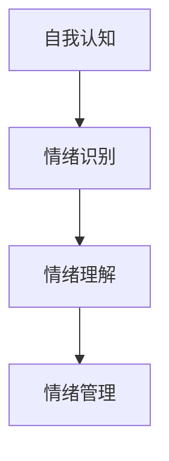

**核心算法原理讲解**

我们可以用以下算法来描述自我认知：

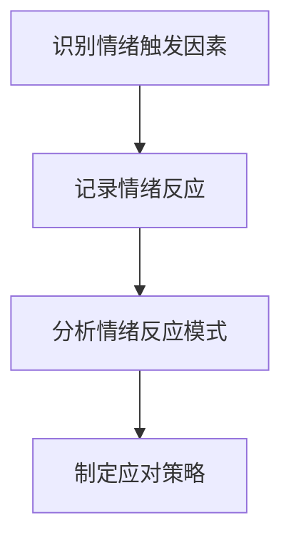

**数学模型和数学公式**

自我认知可以通过以下公式来描述：

$$
SC = f(IT, RT, AT)
$$

其中，$SC$ 代表自我认知，$IT$ 代表识别情绪触发因素，$RT$ 代表记录情绪反应，$AT$ 代表分析情绪反应模式。这个公式表明，自我认知是识别情绪触发因素、记录情绪反应和分析情绪反应模式的函数。

**项目实战**

在实际应用中，自我认知可以通过以下步骤来实现：

1. **情绪记录**：记录每天的的情绪反应，包括情绪的类型、时间和情境。
2. **情绪分析**：定期分析情绪记录，识别情绪反应模式。
3. **情绪反思**：反思情绪反应的原因和后果，制定改进策略。

#### 4.2 情绪调节

情绪调节是指通过一系列策略和技巧来管理负面情绪，使其对个人生活和工作的负面影响降到最低。情绪调节包括深呼吸、冥想、认知重构和情绪释放等方法。

**核心概念与联系**

情绪调节与情绪管理的关系可以理解为：


**核心算法原理讲解**

情绪调节可以通过以下算法来描述：

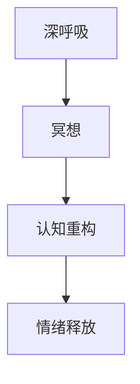

**数学模型和数学公式**

情绪调节可以通过以下公式来描述：

$$
ER = f(DB, M, CR, EL)
$$

其中，$ER$ 代表情绪调节，$DB$ 代表深呼吸，$M$ 代表冥想，$CR$ 代表认知重构，$EL$ 代表情绪释放。这个公式表明，情绪调节是深呼吸、冥想、认知重构和情绪释放的函数。

**项目实战**

情绪调节可以通过以下步骤来实现：

1. **深呼吸**：在感到紧张或焦虑时，进行深呼吸练习，以缓解情绪。
2. **冥想**：定期进行冥想，以提升情绪稳定性和专注力。
3. **认知重构**：通过认知重构技巧，改变负面思维模式。
4. **情绪释放**：通过运动、写日记或倾诉等方式，释放情绪压力。

#### 4.3 情绪表达

情绪表达是指通过适当的方式表达自己的情绪，包括直接表达和间接表达。有效的情绪表达可以帮助我们建立良好的人际关系，减少误解和冲突。

**核心概念与联系**

情绪表达与情绪管理的关系可以理解为：

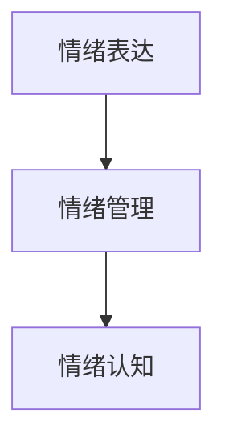

**核心算法原理讲解**

情绪表达可以通过以下算法来描述：

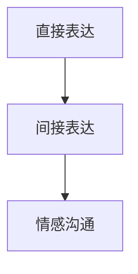

**数学模型和数学公式**

情绪表达可以通过以下公式来描述：

$$
EE = f(DE, IE, FC)
$$

其中，$EE$ 代表情绪表达，$DE$ 代表直接表达，$IE$ 代表间接表达，$FC$ 代表情感沟通。这个公式表明，情绪表达是直接表达、间接表达和情感沟通的函数。

**项目实战**

情绪表达可以通过以下步骤来实现：

1. **直接表达**：在适当的时候，直接表达自己的情绪和需求。
2. **间接表达**：通过身体语言、表情和语气等非言语方式，表达情绪。
3. **情感沟通**：通过倾听和反馈，建立有效的情感沟通。

### 第5章：情绪管理实践

情绪管理不仅需要理论知识的支持，更需要实际的实践。本章将通过具体的案例和项目实战，展示情绪管理在现实中的应用，并提供实用的技巧和建议。

#### 5.1 情绪管理的实际案例

情绪管理在实际工作中扮演着重要的角色。以下是一些情绪管理的实际案例，展示了情绪管理如何帮助个人和团队应对挑战，提高工作效率。

**案例1：领导者的情绪调节**

某公司的部门经理在面临项目压力时，通过深呼吸和冥想练习来调节情绪，以保持冷静和理智。通过这种方式，他能够更好地处理紧急事务，做出明智的决策。

**核心算法原理讲解**

情绪调节的算法可以描述为：

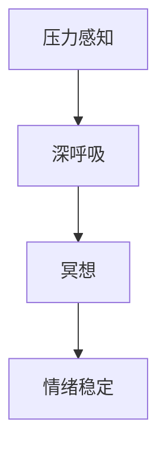

**项目实战**

为了实践情绪调节，可以采取以下步骤：

1. **识别压力源**：了解自己的压力来源，明确需要调节的情绪。
2. **练习深呼吸**：在感到紧张时，进行深呼吸练习，以缓解压力。
3. **尝试冥想**：定期进行冥想，提升情绪稳定性。

**案例2：团队的情绪管理**

在一个项目团队中，团队成员通过定期进行情绪交流，分享彼此的情绪和困扰。通过这种方式，团队建立了信任，减少了误解和冲突，提高了团队协作效率。

**核心算法原理讲解**

情绪交流的算法可以描述为：

```mermaid
graph TD
A[情绪分享] --> B[理解与支持]
B --> C[团队信任]
C --> D[协作效率]
```

**项目实战**

为了实践情绪交流，可以采取以下步骤：

1. **定期会议**：设立定期的情绪交流会议，让团队成员分享情绪和困扰。
2. **倾听与反馈**：倾听团队成员的情绪表达，提供支持和反馈。
3. **建立信任**：通过有效的沟通和合作，建立团队成员之间的信任。

#### 5.2 情绪管理的实战技巧

情绪管理需要结合实际情况，采取有效的实战技巧。以下是一些情绪管理的实战技巧，帮助个人和团队更好地应对情绪挑战。

**技巧1：情绪日记**

情绪日记是一种有效的情绪管理工具，它可以帮助个人记录自己的情绪变化，分析情绪反应模式，并制定改进策略。

**核心算法原理讲解**

情绪日记的算法可以描述为：

```mermaid
graph TD
A[情绪记录] --> B[情绪分析]
B --> C[策略制定]
```

**项目实战**

为了实践情绪日记，可以采取以下步骤：

1. **记录情绪**：每天记录情绪的类型、时间和情境。
2. **分析情绪**：定期分析情绪记录，识别情绪反应模式。
3. **制定策略**：根据情绪分析结果，制定改善情绪的策略。

**技巧2：情绪表达练习**

情绪表达练习可以帮助个人学会如何有效地表达自己的情绪，避免误解和冲突。

**核心算法原理讲解**

情绪表达练习的算法可以描述为：

```mermaid
graph TD
A[情绪识别] --> B[情绪表达]
B --> C[反馈与调整]
```

**项目实战**

为了实践情绪表达练习，可以采取以下步骤：

1. **情绪识别**：学会识别和理解自己的情绪。
2. **情绪表达**：在适当的时候，直接表达自己的情绪和需求。
3. **反馈与调整**：接受他人的反馈，调整自己的情绪表达方式。

**技巧3：情绪管理培训**

情绪管理培训是一种有效的情绪管理方法，它可以帮助个人和团队提升情绪管理能力。

**核心算法原理讲解**

情绪管理培训的算法可以描述为：

```mermaid
graph TD
A[知识传授] --> B[技能实践]
B --> C[反馈与改进]
```

**项目实战**

为了实践情绪管理培训，可以采取以下步骤：

1. **知识传授**：提供情绪管理的理论知识。
2. **技能实践**：通过角色扮演、小组讨论等方式，实践情绪管理技能。
3. **反馈与改进**：提供反馈，帮助参与者改进情绪管理技巧。

#### 5.3 情绪管理的心得与反思

情绪管理是一项长期的实践过程，需要个人和团队不断地学习和改进。以下是一些情绪管理的心得与反思：

1. **自我认知**：情绪管理的基础是自我认知，只有了解自己的情绪反应模式，才能有效地管理情绪。
2. **实践与反思**：情绪管理需要通过实践来验证效果，通过反思来不断改进。
3. **团队合作**：情绪管理不仅仅是个人行为，也需要团队的支持和协作。
4. **持续学习**：情绪管理是一个不断发展的领域，需要个人和团队持续学习，以适应不断变化的工作和生活环境。

### 第6章：情绪表达

情绪表达是情绪管理的重要环节，它涉及到如何有效地将自己的情绪传递给他人。情绪表达不仅影响个人的心理健康，也关系到人际关系和团队协作。有效的情绪表达能够帮助个人建立良好的人际关系，减少冲突，提高沟通效果。

#### 6.1 情绪表达的重要性

情绪表达的重要性体现在以下几个方面：

1. **心理健康**：情绪表达能够帮助个人释放情绪压力，缓解焦虑和抑郁等心理问题。
2. **人际关系**：有效的情绪表达能够增进人与人之间的理解和信任，建立良好的人际关系。
3. **团队协作**：情绪表达对于团队协作至关重要，它能够促进团队成员之间的沟通，减少误解和冲突。
4. **领导力**：领导者有效的情绪表达能够激发团队动力，提高团队的凝聚力和工作效率。

#### 6.2 情绪表达的方法

情绪表达可以分为直接表达和间接表达两种方法。每种方法都有其适用的情境和优点。

**直接表达**

直接表达是指直接用言语或行为表达自己的情绪。这种方法适用于情绪较为强烈或紧急的情境。

**核心概念与联系**

直接表达与情绪管理的关系可以理解为：

```mermaid
graph TD
A[情绪识别] --> B[直接表达]
B --> C[情绪释放]
```

**核心算法原理讲解**

直接表达的算法可以描述为：

```mermaid
graph TD
A[识别情绪] --> B[表达情绪]
B --> C[释放情绪]
```

**项目实战**

为了实践直接表达，可以采取以下步骤：

1. **情绪识别**：在表达情绪之前，先识别自己的情绪。
2. **表达情绪**：用清晰的言语表达自己的情绪，避免模糊或含糊的表述。
3. **释放情绪**：通过表达情绪，释放内心的压力。

**间接表达**

间接表达是指通过非言语的方式，如身体语言、表情和语气等，表达自己的情绪。这种方法适用于情绪较为微妙或敏感的情境。

**核心概念与联系**

间接表达与情绪管理的关系可以理解为：

```mermaid
graph TD
A[情绪识别] --> B[间接表达]
B --> C[情绪缓和]
```

**核心算法原理讲解**

间接表达的算法可以描述为：

```mermaid
graph TD
A[识别情绪] --> B[使用非言语表达]
B --> C[缓和情绪]
```

**项目实战**

为了实践间接表达，可以采取以下步骤：

1. **情绪识别**：在表达情绪之前，先识别自己的情绪。
2. **使用非言语表达**：通过身体语言、表情和语气等非言语方式，传达情绪。
3. **缓和情绪**：在表达情绪时，注意语气和语调，避免过于激烈的表达方式。

#### 6.3 情绪表达的技巧

为了有效地进行情绪表达，可以采取以下技巧：

**技巧1：倾听和反馈**

在情绪表达时，倾听对方的意见和反馈，理解对方的立场和感受。通过有效的倾听和反馈，可以增进彼此的理解，减少误解和冲突。

**核心概念与联系**

倾听和反馈与情绪表达的关系可以理解为：

```mermaid
graph TD
A[倾听] --> B[理解]
B --> C[反馈]
C --> D[有效沟通]
```

**项目实战**

为了实践倾听和反馈，可以采取以下步骤：

1. **倾听**：在对方表达情绪时，全神贯注地倾听，避免打断或评判。
2. **理解**：通过提问和总结，确认自己对对方情绪的理解。
3. **反馈**：给予对方积极的反馈，表达对其情绪的认同和理解。

**技巧2：非言语表达**

在情绪表达时，注意使用非言语表达方式，如身体语言、表情和语调等。这些非言语表达可以增强言语表达的效果，使情绪表达更加自然和有效。

**核心概念与联系**

非言语表达与情绪表达的关系可以理解为：

```mermaid
graph TD
A[身体语言] --> B[表情]
B --> C[语调]
C --> D[情绪表达效果]
```

**项目实战**

为了实践非言语表达，可以采取以下步骤：

1. **使用身体语言**：保持眼神交流，保持开放的姿势，以展示友好和开放的态度。
2. **表达表情**：根据情绪的变化，调整面部表情，以传达真实的情绪状态。
3. **调整语调**：通过语调的变化，表达情绪的强度和复杂性。

**技巧3：情绪调节**

在情绪表达之前，先进行情绪调节，以避免过度激动或压抑的情绪表达。情绪调节包括深呼吸、冥想和认知重构等方法。

**核心概念与联系**

情绪调节与情绪表达的关系可以理解为：

```mermaid
graph TD
A[情绪调节] --> B[情绪表达]
B --> C[情绪释放]
```

**项目实战**

为了实践情绪调节，可以采取以下步骤：

1. **深呼吸**：在情绪表达前，进行深呼吸，以缓解紧张和焦虑。
2. **冥想**：通过冥想，提升情绪稳定性，减少冲动表达。
3. **认知重构**：通过认知重构，调整负面思维，以更客观和理性的方式表达情绪。

### 第7章：情绪管理的实践

情绪管理是一个需要持续实践的过程。通过实际案例和项目实战，我们可以更好地理解和应用情绪管理技巧，提升个人和团队的情绪管理能力。以下是一些实际案例和项目实战的总结。

#### 7.1 情绪管理的实际案例

**案例1：领导者的情绪调节**

在某公司的领导团队中，一位部门经理在面临项目压力时，发现自己情绪波动较大，影响到了决策和工作效率。为了改善这一情况，他采取了以下措施：

1. **定期冥想**：每天早晨和晚上各进行15分钟的冥想练习，以提升情绪稳定性和专注力。
2. **情绪记录**：每周记录自己的情绪变化，分析情绪波动的原因。
3. **积极沟通**：与团队成员分享自己的情绪状态，寻求支持和建议。

通过这些实践，这位经理不仅提高了情绪管理能力，还增强了团队凝聚力和工作效率。

**核心算法原理讲解**

情绪调节的算法可以描述为：

```mermaid
graph TD
A[情绪波动] --> B[冥想]
B --> C[情绪记录]
C --> D[积极沟通]
```

**项目实战**

为了实践情绪调节，可以采取以下步骤：

1. **识别情绪波动**：了解自己的情绪变化，识别情绪波动的触发因素。
2. **定期冥想**：每天进行冥想练习，提升情绪稳定性。
3. **情绪记录**：每周记录自己的情绪变化，分析情绪波动的原因。
4. **积极沟通**：与团队成员分享自己的情绪状态，寻求支持和建议。

**案例2：团队的情绪管理**

在一个项目团队中，成员们发现团队内部存在情绪冲突，影响了团队协作和工作效率。为了改善这一情况，团队采取了以下措施：

1. **情绪分享会**：每周举行一次情绪分享会，让团队成员分享自己的情绪和困扰。
2. **情绪辅导**：邀请专业的情绪管理教练，为团队成员提供情绪管理辅导。
3. **团队建设活动**：定期组织团队建设活动，增强团队成员之间的信任和凝聚力。

通过这些实践，团队的情绪冲突得到有效缓解，团队协作效率显著提升。

**核心算法原理讲解**

情绪管理的算法可以描述为：

```mermaid
graph TD
A[情绪冲突] --> B[情绪分享会]
B --> C[情绪辅导]
C --> D[团队建设活动]
```

**项目实战**

为了实践情绪管理，可以采取以下步骤：

1. **识别情绪冲突**：了解团队内部的情绪冲突，识别冲突的原因。
2. **举行情绪分享会**：定期举行情绪分享会，让团队成员分享情绪和困扰。
3. **情绪辅导**：邀请专业的情绪管理教练，为团队成员提供情绪管理辅导。
4. **团队建设活动**：定期组织团队建设活动，增强团队成员之间的信任和凝聚力。

#### 7.2 情绪管理的实战技巧

情绪管理需要结合实际情况，采取有效的实战技巧。以下是一些情绪管理的实战技巧，帮助个人和团队更好地应对情绪挑战。

**技巧1：情绪日记**

情绪日记是一种有效的情绪管理工具，它可以帮助个人记录自己的情绪变化，分析情绪反应模式，并制定改进策略。

**核心算法原理讲解**

情绪日记的算法可以描述为：

```mermaid
graph TD
A[情绪记录] --> B[情绪分析]
B --> C[策略制定]
```

**项目实战**

为了实践情绪日记，可以采取以下步骤：

1. **记录情绪**：每天记录情绪的类型、时间和情境。
2. **分析情绪**：定期分析情绪记录，识别情绪反应模式。
3. **制定策略**：根据情绪分析结果，制定改善情绪的策略。

**技巧2：情绪表达练习**

情绪表达练习可以帮助个人学会如何有效地表达自己的情绪，避免误解和冲突。

**核心算法原理讲解**

情绪表达练习的算法可以描述为：

```mermaid
graph TD
A[情绪识别] --> B[情绪表达]
B --> C[反馈与调整]
```

**项目实战**

为了实践情绪表达练习，可以采取以下步骤：

1. **情绪识别**：学会识别和理解自己的情绪。
2. **情绪表达**：在适当的时候，直接表达自己的情绪和需求。
3. **反馈与调整**：接受他人的反馈，调整自己的情绪表达方式。

**技巧3：情绪管理培训**

情绪管理培训是一种有效的情绪管理方法，它可以帮助个人和团队提升情绪管理能力。

**核心算法原理讲解**

情绪管理培训的算法可以描述为：

```mermaid
graph TD
A[知识传授] --> B[技能实践]
B --> C[反馈与改进]
```

**项目实战**

为了实践情绪管理培训，可以采取以下步骤：

1. **知识传授**：提供情绪管理的理论知识。
2. **技能实践**：通过角色扮演、小组讨论等方式，实践情绪管理技能。
3. **反馈与改进**：提供反馈，帮助参与者改进情绪管理技巧。

#### 7.3 情绪管理的心得与反思

情绪管理是一个持续的过程，需要个人和团队不断的学习和实践。以下是一些情绪管理的心得与反思：

1. **自我认知**：情绪管理的基础是自我认知，只有了解自己的情绪反应模式，才能有效地管理情绪。
2. **实践与反思**：情绪管理需要通过实践来验证效果，通过反思来不断改进。
3. **团队合作**：情绪管理不仅仅是个人行为，也需要团队的支持和协作。
4. **持续学习**：情绪管理是一个不断发展的领域，需要个人和团队持续学习，以适应不断变化的工作和生活环境。

### 总结与展望

领导力与情绪管理密切相关，情绪管理是提升领导力的重要途径。通过有效的情绪管理，领导者可以更好地应对挑战，提高决策质量和执行力，建立良好的团队关系。本章通过深入分析领导力与情绪管理的关系，介绍了情绪管理的核心概念、技巧和实践方法。

展望未来，随着社会环境的变化和工作压力的增大，情绪管理将越来越受到重视。个人和团队需要不断提升情绪管理能力，以适应不断变化的工作和生活环境。同时，情绪管理的研究和实践也将不断深化，为领导力和个人成长提供更多有益的指导。

### 作者信息

作者：AI天才研究院/AI Genius Institute & 禅与计算机程序设计艺术 /Zen And The Art of Computer Programming

### 拓展阅读

1. 《情绪智力：为什么它比智商更重要》
2. 《情商领导力：如何成为卓越领导者》
3. 《积极心理学：寻求幸福的方法》
4. 《非暴力沟通：如何进行有效的沟通》
5. 《深度工作：如何有效利用每一点脑力》

通过阅读这些书籍，可以更深入地了解情绪管理和领导力的相关知识，提升个人和团队的竞争力。

