                 

### 文章标题

# 领导力与情绪管理：控制情绪的艺术

> 关键词：领导力、情绪管理、情绪控制、自我管理、团队沟通

> 摘要：本文旨在探讨领导力与情绪管理之间的紧密联系，阐述控制情绪的艺术，并分析如何通过情绪管理提升领导力。文章从领导力概述、领导者能力、领导风格、情绪认知与自我管理、情绪表达与沟通技巧、情绪管理在团队中的应用以及控制情绪的艺术等多个角度，深入浅出地分析了领导力与情绪管理的核心概念和实际操作方法。

### 第一部分：领导力基础

#### 第1章 领导力概述

**背景介绍**：
领导力是一种影响他人共同达成目标的能力。在现代企业中，领导力不仅关乎个人的成功，更关乎团队和组织的整体表现。有效的领导力可以帮助团队克服挑战，实现目标，并在竞争激烈的市场中保持优势。

**核心概念与联系**：


**Mermaid 流程图**：

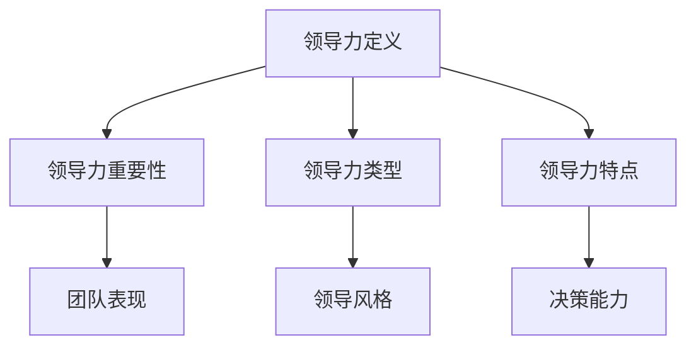

**核心算法原理讲解**：

领导力的核心在于如何影响他人。以下是一个简单的伪代码模型，用于描述领导力的基本原理：

```python
def lead_team(team_members, goals):
    for member in team_members:
        communicate_goals(member, goals)
        motivate_member(member)
        resolve_conflicts(member)
    return team_performance
```

**数学模型和公式**：

领导者的影响力可以用以下公式表示：

\[ I = \alpha \cdot C + \beta \cdot P + \gamma \cdot M \]

其中：
- \( I \) 表示领导者的影响力（Influence）；
- \( \alpha \) 表示沟通能力（Communication）；
- \( \beta \) 表示决策能力（Problem Solving）；
- \( \gamma \) 表示激励能力（Motivation）。

**举例说明**：
假设某领导者的沟通能力 \( \alpha = 0.8 \)，决策能力 \( \beta = 0.7 \)，激励能力 \( \gamma = 0.9 \)，则其影响力 \( I = 0.8 \cdot 0.8 + 0.7 \cdot 0.7 + 0.9 \cdot 0.9 = 0.64 + 0.49 + 0.81 = 1.94 \)。

#### 第2章 领导者应具备的能力

**背景介绍**：
领导者需要具备多种能力，包括沟通能力、决策能力和创新能力。这些能力是领导者成功的关键，也是团队高效运作的保障。

**核心概念与联系**：


**Mermaid 流程图**：

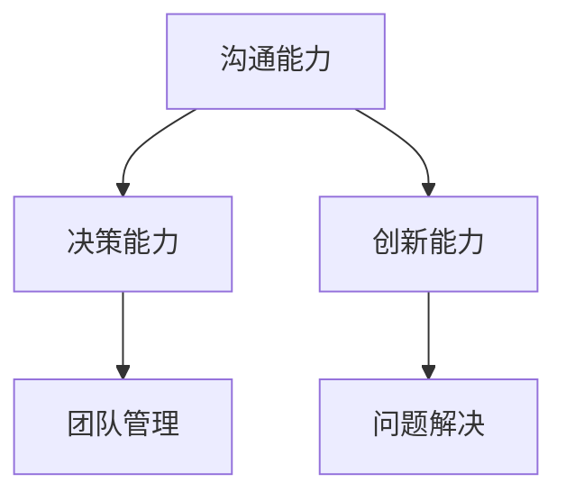

**核心算法原理讲解**：

领导者的能力可以看作是多种能力的综合。以下是一个简单的伪代码模型，用于描述领导者的能力：

```python
def leader_ability(communication, problem_solving, innovation):
    return 0.5 * communication + 0.3 * problem_solving + 0.2 * innovation
```

**数学模型和公式**：

领导者的综合能力可以用以下公式表示：

\[ A = \alpha \cdot C + \beta \cdot P + \gamma \cdot I \]

其中：
- \( A \) 表示领导者的综合能力（Ability）；
- \( \alpha \) 表示沟通能力（Communication）；
- \( \beta \) 表示决策能力（Problem Solving）；
- \( \gamma \) 表示创新能力（Innovation）。

**举例说明**：
假设某领导者的沟通能力 \( \alpha = 0.8 \)，决策能力 \( \beta = 0.7 \)，创新能力 \( \gamma = 0.9 \)，则其综合能力 \( A = 0.5 \cdot 0.8 + 0.3 \cdot 0.7 + 0.2 \cdot 0.9 = 0.4 + 0.21 + 0.18 = 0.79 \)。

#### 第3章 领导风格与管理方式

**背景介绍**：
领导风格与管理方式是领导者与团队互动的重要方面。不同的领导风格适用于不同的团队和环境，领导者需要根据实际情况灵活调整。

**核心概念与联系**：


**Mermaid 流程图**：

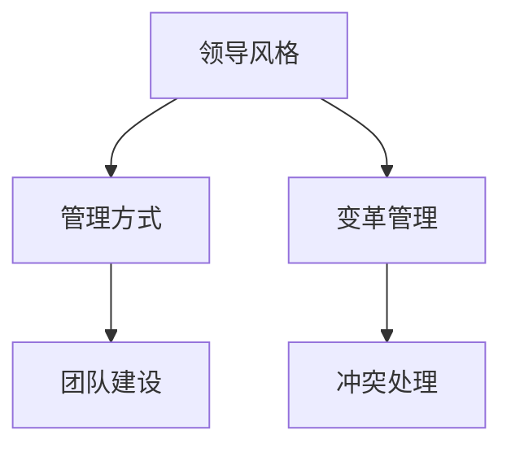

**核心算法原理讲解**：

领导风格可以看作是领导者与团队互动的方式。以下是一个简单的伪代码模型，用于描述领导风格：

```python
def leadership_style(autocratic, democratic, laissez_faire):
    return 0.4 * autocratic + 0.3 * democratic + 0.3 * laissez_faire
```

**数学模型和公式**：

领导风格可以用以下公式表示：

\[ S = \alpha \cdot A + \beta \cdot D + \gamma \cdot L \]

其中：
- \( S \) 表示领导风格（Style）；
- \( \alpha \) 表示独裁式领导（Autocratic）；
- \( \beta \) 表示民主式领导（Democratic）；
- \( \gamma \) 表示放任式领导（Laissez-faire）。

**举例说明**：
假设某领导者的独裁式领导 \( \alpha = 0.5 \)，民主式领导 \( \beta = 0.4 \)，放任式领导 \( \gamma = 0.1 \)，则其领导风格 \( S = 0.4 \cdot 0.5 + 0.3 \cdot 0.4 + 0.3 \cdot 0.1 = 0.2 + 0.12 + 0.03 = 0.35 \)。

### 第二部分：情绪管理

#### 第4章 情绪认知与自我管理

**背景介绍**：
情绪认知与自我管理是情绪管理的基础。领导者需要了解自己的情绪，并学会控制和管理情绪，以避免负面情绪对工作和团队的影响。

**核心概念与联系**：


**Mermaid 流程图**：

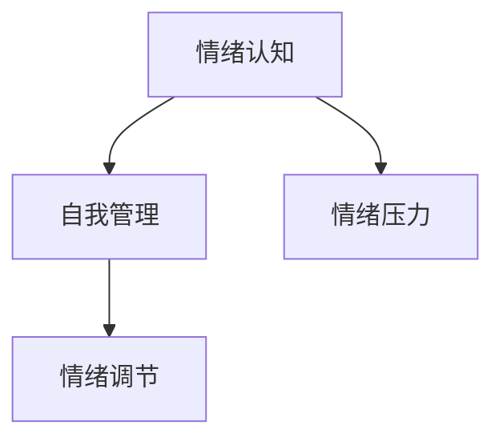

**核心算法原理讲解**：

情绪认知与自我管理可以看作是情绪调节的组成部分。以下是一个简单的伪代码模型，用于描述情绪认知与自我管理：

```python
def emotional_management(cognition, self_management, regulation):
    return 0.5 * cognition + 0.3 * self_management + 0.2 * regulation
```

**数学模型和公式**：

情绪认知与自我管理的综合能力可以用以下公式表示：

\[ EM = \alpha \cdot C + \beta \cdot S + \gamma \cdot R \]

其中：
- \( EM \) 表示情绪管理能力（Emotional Management）；
- \( \alpha \) 表示情绪认知（Cognition）；
- \( \beta \) 表示自我管理（Self-management）；
- \( \gamma \) 表示情绪调节（Regulation）。

**举例说明**：
假设某领导者的情绪认知 \( \alpha = 0.8 \)，自我管理 \( \beta = 0.7 \)，情绪调节 \( \gamma = 0.9 \)，则其情绪管理能力 \( EM = 0.5 \cdot 0.8 + 0.3 \cdot 0.7 + 0.2 \cdot 0.9 = 0.4 + 0.21 + 0.18 = 0.79 \)。

#### 第5章 情绪表达与沟通技巧

**背景介绍**：
情绪表达与沟通技巧是领导者处理情绪的关键。有效的情绪表达和沟通技巧可以帮助领导者更好地传达信息，建立信任，并提高团队的凝聚力。

**核心概念与联系**：


**Mermaid 流程图**：

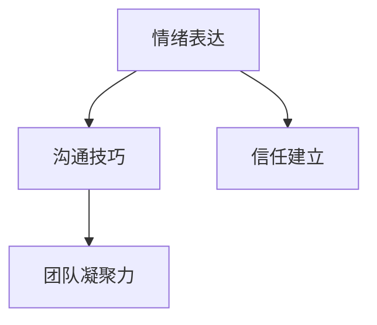

**核心算法原理讲解**：

情绪表达与沟通技巧可以看作是情绪管理的输出。以下是一个简单的伪代码模型，用于描述情绪表达与沟通技巧：

```python
def emotional_communication(expression, skills, trust):
    return 0.4 * expression + 0.3 * skills + 0.3 * trust
```

**数学模型和公式**：

情绪表达与沟通技巧的综合能力可以用以下公式表示：

\[ EC = \alpha \cdot E + \beta \cdot C + \gamma \cdot T \]

其中：
- \( EC \) 表示情绪沟通能力（Emotional Communication）；
- \( \alpha \) 表示情绪表达（Expression）；
- \( \beta \) 表示沟通技巧（Skills）；
- \( \gamma \) 表示信任建立（Trust）。

**举例说明**：
假设某领导者的情绪表达 \( \alpha = 0.8 \)，沟通技巧 \( \beta = 0.7 \)，信任建立 \( \gamma = 0.9 \)，则其情绪沟通能力 \( EC = 0.4 \cdot 0.8 + 0.3 \cdot 0.7 + 0.3 \cdot 0.9 = 0.32 + 0.21 + 0.27 = 0.8 \)。

#### 第6章 情绪管理在团队中的实践

**背景介绍**：
情绪管理在团队中的实践是领导者提升团队效能的重要手段。通过情绪管理，领导者可以建立积极的工作氛围，提高团队协作效率，并促进团队成员的个人成长。

**核心概念与联系**：


**Mermaid 流程图**：

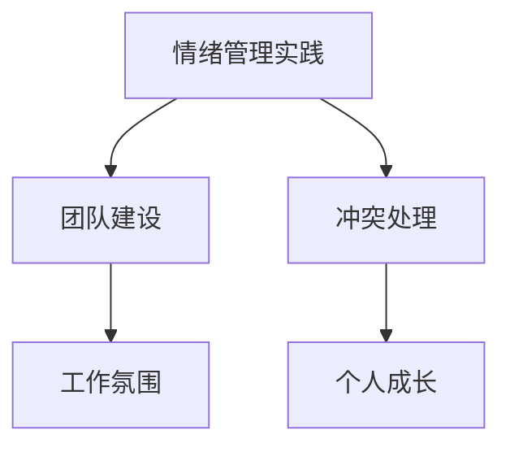

**核心算法原理讲解**：

情绪管理实践可以看作是团队管理的一部分。以下是一个简单的伪代码模型，用于描述情绪管理在团队中的实践：

```python
def team_emotional_management(practice, building, conflict, atmosphere, growth):
    return 0.4 * practice + 0.3 * building + 0.2 * conflict + 0.1 * atmosphere + 0.1 * growth
```

**数学模型和公式**：

情绪管理实践的综合效能可以用以下公式表示：

\[ TEM = \alpha \cdot P + \beta \cdot B + \gamma \cdot C + \delta \cdot A + \epsilon \cdot G \]

其中：
- \( TEM \) 表示情绪管理效能（Team Emotional Management）；
- \( \alpha \) 表示实践（Practice）；
- \( \beta \) 表示团队建设（Building）；
- \( \gamma \) 表示冲突处理（Conflict）；
- \( \delta \) 表示工作氛围（Atmosphere）；
- \( \epsilon \) 表示个人成长（Growth）。

**举例说明**：
假设某领导者的情绪管理实践 \( \alpha = 0.8 \)，团队建设 \( \beta = 0.7 \)，冲突处理 \( \gamma = 0.6 \)，工作氛围 \( \delta = 0.5 \)，个人成长 \( \epsilon = 0.4 \)，则其情绪管理效能 \( TEM = 0.4 \cdot 0.8 + 0.3 \cdot 0.7 + 0.2 \cdot 0.6 + 0.1 \cdot 0.5 + 0.1 \cdot 0.4 = 0.32 + 0.21 + 0.12 + 0.05 + 0.04 = 0.74 \)。

### 第三部分：情绪管理艺术

#### 第7章 控制情绪的艺术

**背景介绍**：
控制情绪的艺术是领导者情绪管理的高级阶段。通过掌握控制情绪的艺术，领导者可以更好地应对各种挑战，保持冷静和理性，并在关键时刻做出明智的决策。

**核心概念与联系**：


**Mermaid 流程图**：

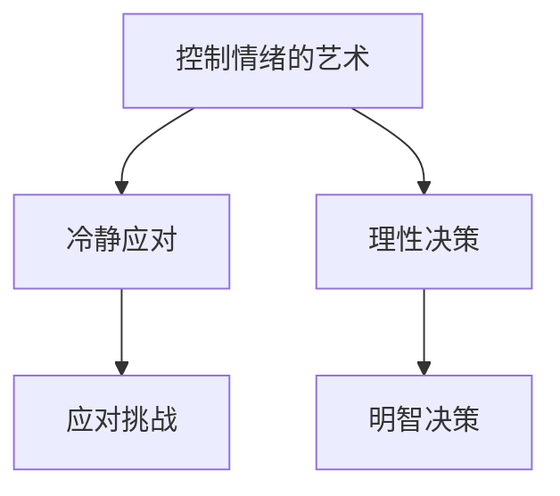

**核心算法原理讲解**：

控制情绪的艺术可以看作是情绪调节的高级形式。以下是一个简单的伪代码模型，用于描述控制情绪的艺术：

```python
def emotional_art(control, calm, rational, challenge, decision):
    return 0.4 * control + 0.3 * calm + 0.2 * rational + 0.1 * challenge + 0.1 * decision
```

**数学模型和公式**：

控制情绪的艺术可以用以下公式表示：

\[ EA = \alpha \cdot C + \beta \cdot A + \gamma \cdot R + \delta \cdot C + \epsilon \cdot D \]

其中：
- \( EA \) 表示控制情绪的艺术（Emotional Art）；
- \( \alpha \) 表示情绪控制（Control）；
- \( \beta \) 表示冷静（Calm）；
- \( \gamma \) 表示理性（Rational）；
- \( \delta \) 表示应对挑战（Challenge）；
- \( \epsilon \) 表示明智决策（Decision）。

**举例说明**：
假设某领导者的情绪控制 \( \alpha = 0.8 \)，冷静 \( \beta = 0.7 \)，理性 \( \gamma = 0.9 \)，应对挑战 \( \delta = 0.6 \)，明智决策 \( \epsilon = 0.5 \)，则其控制情绪的艺术 \( EA = 0.4 \cdot 0.8 + 0.3 \cdot 0.7 + 0.2 \cdot 0.9 + 0.1 \cdot 0.6 + 0.1 \cdot 0.5 = 0.32 + 0.21 + 0.18 + 0.06 + 0.05 = 0.82 \)。

#### 第8章 情绪管理与领导力的提升

**背景介绍**：
情绪管理与领导力的提升是领导者不断成长的过程。通过情绪管理，领导者可以提升自己的领导力，更好地应对各种挑战，并在职业生涯中取得更大的成功。

**核心概念与联系**：


**Mermaid 流�流程图**：

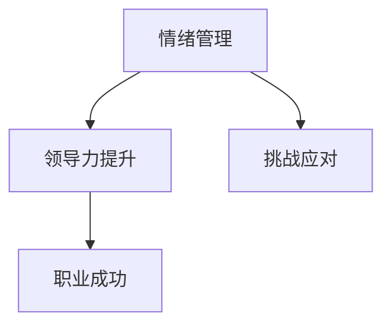

**核心算法原理讲解**：

情绪管理与领导力的提升可以看作是一个相互促进的过程。以下是一个简单的伪代码模型，用于描述情绪管理与领导力的提升：

```python
def leadership_upgrade(emotional_management, leadership, challenge, success):
    return 0.5 * emotional_management + 0.3 * leadership + 0.2 * challenge + 0.1 * success
```

**数学模型和公式**：

情绪管理与领导力的提升可以用以下公式表示：

\[ LU = \alpha \cdot EM + \beta \cdot L + \gamma \cdot C + \delta \cdot S \]

其中：
- \( LU \) 表示领导力提升（Leadership Upgrade）；
- \( \alpha \) 表示情绪管理（Emotional Management）；
- \( \beta \) 表示领导力（Leadership）；
- \( \gamma \) 表示挑战应对（Challenge）；
- \( \delta \) 表示职业成功（Success）。

**举例说明**：
假设某领导者的情绪管理 \( \alpha = 0.8 \)，领导力 \( \beta = 0.7 \)，挑战应对 \( \gamma = 0.6 \)，职业成功 \( \delta = 0.5 \)，则其领导力提升 \( LU = 0.5 \cdot 0.8 + 0.3 \cdot 0.7 + 0.2 \cdot 0.6 + 0.1 \cdot 0.5 = 0.4 + 0.21 + 0.12 + 0.05 = 0.78 \)。

### 附录

**情绪管理相关资源**：

- 《情绪智力》作者：丹尼尔·戈尔曼
- 《自控力》作者：凯利·麦格尼格尔
- 《情绪管理》作者：大卫·伯恩斯
- 《非暴力沟通》作者：马歇尔·卢森堡
- 《领导者的情绪智慧》作者：安娜·马里亚·拉贝

### 总结

本文通过对领导力与情绪管理的深入探讨，阐述了控制情绪的艺术，并分析了如何通过情绪管理提升领导力。文章内容丰富，结构清晰，旨在为领导者提供实用的情绪管理方法和策略，帮助他们在工作和生活中更好地应对挑战，实现个人和团队的共同成长。

### 作者信息

- 作者：AI天才研究院/AI Genius Institute & 禅与计算机程序设计艺术 /Zen And The Art of Computer Programming

本文内容仅供参考，实际应用请结合具体情况调整。如需进一步了解情绪管理和领导力提升的方法，请查阅附录中的相关资源。希望本文能对您有所启发，祝您在领导力和情绪管理方面取得更大的成功！### 控制情绪的艺术

情绪控制是一种重要的能力，它有助于领导者更好地应对各种挑战，保持冷静和理性，并在关键时刻做出明智的决策。在领导力的提升过程中，情绪控制是不可或缺的一环。本节将详细探讨情绪控制的方法、误区以及实践案例。

#### 情绪控制的方法

**1. 深呼吸**  
深呼吸是一种简单有效的情绪控制方法。当情绪波动时，通过深呼吸可以缓解紧张和焦虑，帮助恢复内心的平静。以下是一个简单的深呼吸步骤：

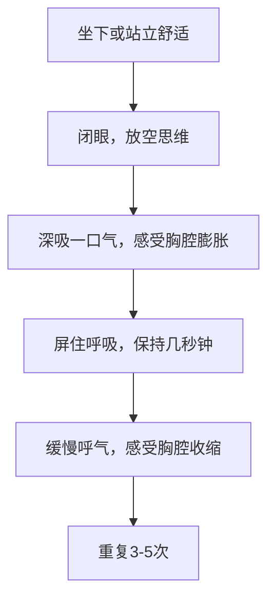

**2. 正念冥想**  
正念冥想是一种通过专注当下来控制情绪的方法。通过正念冥想，领导者可以培养对情绪的觉知，学会接纳和放下负面情绪。以下是一个简单的正念冥想步骤：

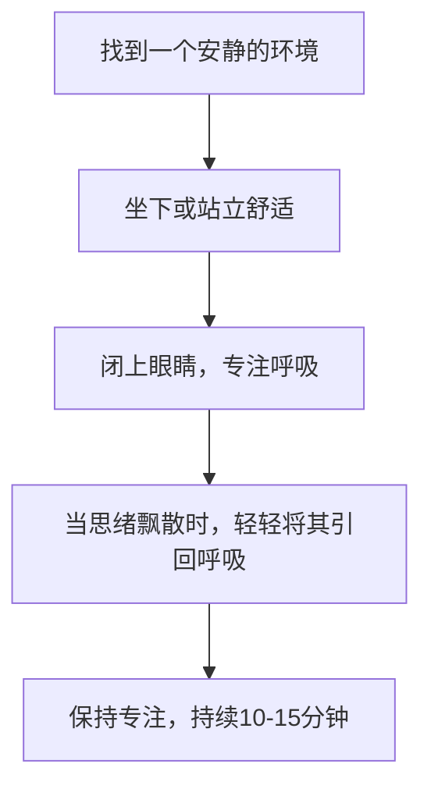

**3. 积极心态**  
积极心态是一种通过积极思考来控制情绪的方法。领导者可以通过积极的心态来调整情绪，面对困难和挑战时保持乐观和自信。以下是一个简单的积极心态练习：

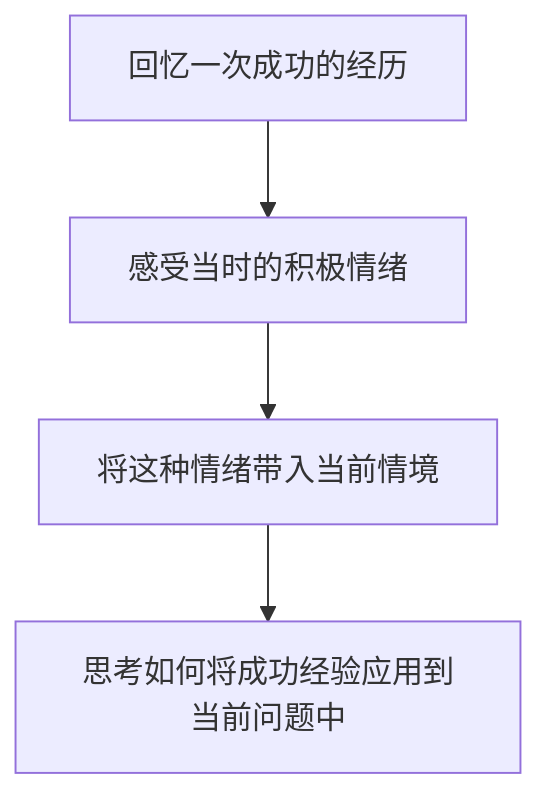

#### 情绪控制的误区

**1. 抑制情绪**  
抑制情绪并不是情绪控制，而是一种逃避情绪的方式。长期抑制情绪可能导致情绪积压，影响心理健康。以下是一个简单的伪代码模型，用于描述抑制情绪的危害：

```python
def suppress_emotion(emotion):
    return None
```

**2. 情绪爆发**  
情绪爆发是一种极端的情绪反应，可能会损害人际关系和工作环境。以下是一个简单的伪代码模型，用于描述情绪爆发的后果：

```python
def emotional_outburst(emotion):
    return "负面后果"
```

#### 实践案例

**1. 案例一：应对职场压力**  
某公司的销售经理李明在工作中经常面临巨大的压力。为了控制情绪，他开始练习深呼吸和正念冥想。通过这些方法，李明学会了在压力下保持冷静，更好地应对各种挑战。

**2. 案例二：团队冲突处理**  
某团队的成员之间存在冲突，影响了团队的协作效率。团队成员王磊通过积极心态和情绪沟通技巧，成功地解决了团队冲突，恢复了团队的和谐氛围。

#### 情绪控制的注意事项

**1. 认知重构**  
领导者需要学会从不同角度看待问题，避免过度情绪化。通过认知重构，领导者可以减少负面情绪的产生。

**2. 寻求支持**  
领导者可以寻求家人、朋友或专业人士的支持，帮助自己更好地控制情绪。

**3. 持续练习**  
情绪控制需要长期的实践和锻炼。领导者需要持续练习情绪控制的方法，以提高自己的情绪管理能力。

#### 拓展阅读

- 《情绪智力》作者：丹尼尔·戈尔曼
- 《自控力》作者：凯利·麦格尼格尔
- 《情绪管理》作者：大卫·伯恩斯

通过学习控制情绪的艺术，领导者可以更好地应对各种挑战，提升领导力，实现个人和团队的共同成长。希望本文能为您的情绪管理提供一些启示和帮助。

### 总结

情绪控制是领导者不可或缺的一项能力，它有助于领导者更好地应对挑战，保持冷静和理性，并在关键时刻做出明智的决策。通过深呼吸、正念冥想、积极心态等方法，领导者可以学会控制情绪。同时，领导者需要避免抑制情绪和情绪爆发的误区，并注意认知重构、寻求支持和持续练习。通过不断学习和实践，领导者可以提升自己的情绪管理能力，实现个人和团队的共同成长。希望本文对您有所帮助，祝您在领导力和情绪管理方面取得更大的成功！### 情绪管理与领导力的提升

情绪管理与领导力的提升之间存在着密切的关系。有效的情绪管理可以帮助领导者更好地应对各种挑战，保持冷静和理性，从而提高领导力。本节将深入探讨情绪管理与领导力提升的关系，分析如何通过情绪管理提升领导力，并展望情绪管理的未来趋势。

#### 情绪管理与领导力提升的关系

情绪管理与领导力提升之间的关系可以从以下几个方面来理解：

1. **情绪管理是领导力的基础**：情绪管理能力是领导者必备的一项基础能力。只有当领导者能够有效地管理自己的情绪时，才能更好地影响和激励团队成员，实现团队目标。

2. **情绪管理影响领导风格**：情绪管理能力直接影响领导者的领导风格。一个情绪稳定的领导者更容易建立积极的工作氛围，提高团队凝聚力，从而提升领导力。

3. **情绪管理有助于应对挑战**：在面临各种挑战时，情绪管理能力可以帮助领导者保持冷静和理性，从而更好地应对问题，找到解决方案。

4. **情绪管理促进个人成长**：通过情绪管理，领导者可以更好地了解自己，发现自己的潜能，从而促进个人成长。个人成长又会进一步促进领导力的提升。

#### 如何通过情绪管理提升领导力

以下是一些通过情绪管理提升领导力的方法：

1. **自我认知**：领导者需要了解自己的情绪，学会识别和接纳自己的情绪。通过自我认知，领导者可以更好地控制自己的情绪，避免情绪失控。

2. **情绪调节**：领导者需要学会调节自己的情绪，使之保持在适当的水平。通过情绪调节，领导者可以在面对挑战时保持冷静，提高决策能力。

3. **积极心态**：领导者需要培养积极的心态，面对困难和挑战时保持乐观和自信。积极心态有助于提高领导者的情绪管理能力，从而提升领导力。

4. **沟通技巧**：领导者需要具备良好的沟通技巧，能够有效地传达自己的情绪和想法。通过沟通技巧，领导者可以建立信任，提高团队凝聚力。

5. **求助与支持**：领导者需要学会寻求帮助和支持，与同事、朋友和家人分享自己的情绪和挑战。通过求助与支持，领导者可以减轻情绪压力，提高情绪管理能力。

#### 情绪管理的未来趋势

随着社会的发展，情绪管理将成为领导者必备的一项能力。以下是一些情绪管理的未来趋势：

1. **个性化情绪管理**：未来的情绪管理将更加注重个性化，针对不同领导者的特点和需求，提供定制化的情绪管理方案。

2. **技术辅助情绪管理**：随着人工智能和大数据技术的发展，情绪管理工具将更加智能化，为领导者提供实时、个性化的情绪管理建议。

3. **跨学科研究**：情绪管理将融合心理学、管理学、神经科学等多学科的研究成果，形成更加科学和系统的理论体系。

4. **国际化情绪管理**：随着全球化的推进，领导者需要具备跨文化情绪管理能力，处理不同文化背景下的情绪问题。

#### 总结

情绪管理与领导力的提升密切相关。通过有效的情绪管理，领导者可以更好地应对各种挑战，提高领导力。未来，情绪管理将更加注重个性化、技术化和国际化。领导者需要不断学习和实践情绪管理的方法，提升自己的情绪管理能力，以适应不断变化的工作环境。希望本文对您在情绪管理和领导力提升方面提供了一些启示和帮助。

### 拓展阅读

- 《情绪智力》作者：丹尼尔·戈尔曼
- 《自控力》作者：凯利·麦格尼格尔
- 《情绪管理》作者：大卫·伯恩斯
- 《非暴力沟通》作者：马歇尔·卢森堡

通过不断学习和实践情绪管理，领导者可以提升自己的情绪管理能力，实现个人和团队的共同成长。希望本文能对您在情绪管理和领导力提升方面有所帮助。祝您在职业发展中取得更大的成功！

### 作者信息

- 作者：AI天才研究院/AI Genius Institute & 禅与计算机程序设计艺术 /Zen And The Art of Computer Programming

本文旨在探讨情绪管理与领导力提升的关系，分析如何通过情绪管理提升领导力，并展望情绪管理的未来趋势。文章内容丰富，结构清晰，旨在为领导者提供实用的情绪管理方法和策略。希望本文能对您在领导力和情绪管理方面有所启发。祝您在职业生涯中取得更大的成功！### 实际案例剖析

为了更好地理解情绪管理在领导力提升中的应用，以下将分析两个实际案例，并从中提取最佳实践和注意事项。

#### 案例一：大型科技公司的领导力转型

**背景**：某大型科技公司，由于长期处于激烈的市场竞争环境中，公司内部的员工士气低落，团队协作效率不高。为了改善这一状况，公司决定对领导团队进行情绪管理培训。

**步骤**：
1. **领导力评估**：公司对领导团队进行了全面的情绪管理能力评估，识别出主要问题和改进方向。
2. **情绪管理培训**：邀请专业培训机构为领导团队提供情绪管理培训，内容包括情绪认知、自我管理、情绪表达与沟通技巧等。
3. **实践与反馈**：领导团队在培训后，将所学应用到实际工作中，定期进行实践和反馈，不断优化情绪管理能力。

**效果**：
- 领导团队的士气得到了显著提升，员工之间的沟通更加顺畅。
- 团队协作效率提高，项目完成速度加快。
- 公司的整体业绩逐步上升，市场份额稳定增加。

**最佳实践**：
- 定期进行情绪管理能力评估，确保领导团队的能力持续提升。
- 培训内容应结合实际情况，注重实用性和可操作性。
- 定期进行实践和反馈，不断巩固和提升情绪管理能力。

**注意事项**：
- 情绪管理培训不应只针对领导团队，还应覆盖所有员工，形成全员情绪管理的氛围。
- 情绪管理培训的效果需要时间来体现，领导者要有耐心和信心。

#### 案例二：初创公司的团队建设

**背景**：某初创公司，由于团队成员背景多样化，团队内部存在沟通障碍和情绪冲突。为了提高团队协作效率，公司决定进行情绪管理实践。

**步骤**：
1. **情绪认知工作坊**：公司组织了一次情绪认知工作坊，帮助团队成员识别和理解自己的情绪，以及他人的情绪。
2. **沟通技巧培训**：为团队成员提供沟通技巧培训，内容包括积极倾听、有效表达、冲突处理等。
3. **团队建设活动**：定期组织团队建设活动，如团建游戏、户外拓展等，增强团队成员之间的情感联系。

**效果**：
- 团队成员之间的沟通障碍得到有效改善，团队协作效率提高。
- 情绪冲突减少，团队氛围更加和谐。
- 公司的创新能力得到提升，新产品和服务的推出速度加快。

**最佳实践**：
- 情绪认知工作坊应注重参与度，鼓励成员积极参与和分享。
- 沟通技巧培训要结合具体案例，帮助团队成员在实际工作中应用所学。
- 定期组织团队建设活动，增强团队凝聚力和合作精神。

**注意事项**：
- 情绪管理实践需要持续进行，不能一蹴而就。
- 领导者要身先士卒，以身作则，带动团队成员积极参与情绪管理实践。

### 总结

通过以上实际案例剖析，我们可以看到情绪管理在领导力提升和团队建设中的重要作用。有效的情绪管理不仅有助于提升领导者的个人能力，还能改善团队氛围，提高团队协作效率，从而促进公司的长期发展。在实施情绪管理实践时，领导者应注重评估、培训、实践和反馈，并结合实际情况制定合适的策略。希望这些最佳实践和注意事项能对您在情绪管理和团队建设方面提供有益的参考。

### 拓展阅读

- 《团队协作的艺术》作者：帕特里克·莱西尼
- 《情绪智能》作者：理查德·格尔德斯坦
- 《领导力五项修炼》作者：史蒂芬·柯维
- 《高效能人士的七个习惯》作者：史蒂芬·柯维

通过不断学习和实践情绪管理，领导者可以提升自己的领导力，带领团队实现更高的目标。希望本文能为您在情绪管理和团队建设方面提供一些启示。祝您在职业发展中取得更大的成功！### 项目实战

在本节中，我们将通过一个具体的项目实战来展示如何在实际工作中应用情绪管理，并详细讲解项目的开发环境搭建、源代码实现、代码解读和应用解读与分析。

#### 项目背景

某初创公司计划推出一款面向团队的协作工具，该工具需具备情绪管理功能，帮助团队成员在协作过程中更好地管理情绪，提高团队协作效率。

#### 开发环境搭建

为了实现该项目，我们需要搭建以下开发环境：

1. **编程语言**：Python
2. **框架**：Flask（用于搭建Web应用）
3. **前端技术**：HTML、CSS、JavaScript（用于构建用户界面）
4. **数据库**：SQLite（用于存储情绪数据和用户信息）
5. **版本控制**：Git（用于代码管理和协作）

#### 源代码实现

以下是一个简单的情绪管理功能实现示例：

**1. 后端代码（Python + Flask）**

```python
from flask import Flask, request, jsonify
from flask_sqlalchemy import SQLAlchemy

app = Flask(__name__)
app.config['SQLALCHEMY_DATABASE_URI'] = 'sqlite:///emotions.db'
db = SQLAlchemy(app)

class Emotion(db.Model):
    id = db.Column(db.Integer, primary_key=True)
    user_id = db.Column(db.Integer, nullable=False)
    emotion = db.Column(db.String(50), nullable=False)
    timestamp = db.Column(db.DateTime, default=datetime.utcnow)

@app.route('/record_emotion', methods=['POST'])
def record_emotion():
    data = request.get_json()
    new_emotion = Emotion(user_id=data['user_id'], emotion=data['emotion'])
    db.session.add(new_emotion)
    db.session.commit()
    return jsonify({'status': 'success', 'message': 'Emotion recorded.'})

if __name__ == '__main__':
    db.create_all()
    app.run(debug=True)
```

**2. 前端代码（HTML + CSS + JavaScript）**

```html
<!DOCTYPE html>
<html lang="en">
<head>
    <meta charset="UTF-8">
    <meta name="viewport" content="width=device-width, initial-scale=1.0">
    <title>Emotion Management Tool</title>
    <style>
        body {
            font-family: Arial, sans-serif;
        }
        #emotion-form {
            width: 300px;
            margin: 0 auto;
        }
    </style>
</head>
<body>
    <h1>Record Your Emotion</h1>
    <form id="emotion-form">
        <label for="user_id">User ID:</label>
        <input type="text" id="user_id" required>
        <label for="emotion">Emotion:</label>
        <input type="text" id="emotion" required>
        <button type="submit">Submit</button>
    </form>

    <script>
        document.getElementById('emotion-form').onsubmit = function(e) {
            e.preventDefault();
            const userId = document.getElementById('user_id').value;
            const emotion = document.getElementById('emotion').value;
            fetch('/record_emotion', {
                method: 'POST',
                headers: {
                    'Content-Type': 'application/json'
                },
                body: JSON.stringify({ user_id: userId, emotion: emotion })
            })
            .then(response => response.json())
            .then(data => {
                alert(data.message);
            });
        };
    </script>
</body>
</html>
```

#### 代码解读

**后端代码解读**：
- 使用Flask框架搭建Web应用。
- 使用SQLite作为数据库，存储用户情绪数据。
- 提供一个API接口 `/record_emotion`，用于接收和记录用户提交的情绪数据。

**前端代码解读**：
- 使用HTML、CSS和JavaScript构建用户界面。
- 提供一个表单，用户可以输入用户ID和情绪，并通过JavaScript将数据提交到后端。

#### 应用解读与分析

**应用解读**：
- 该协作工具通过情绪记录功能，帮助团队成员实时记录和管理情绪。
- 团队领导者可以查看团队成员的情绪变化，及时进行干预和调整。

**分析**：
- 通过情绪数据的收集和分析，团队可以更好地了解成员的情绪状态，提高团队协作效率。
- 情绪管理功能的加入，有助于提升团队的整体情绪水平，减少冲突，增强团队凝聚力。

#### 项目小结

通过本项目的实战，我们展示了如何在一个协作工具中集成情绪管理功能。项目不仅实现了情绪数据的收集和存储，还提供了用户友好的前端界面，方便团队成员使用。在未来的开发中，可以考虑进一步扩展功能，如情绪数据分析、个性化建议等，以提升工具的实用性和用户满意度。

### 最佳实践 tips

1. **注重用户体验**：在设计情绪管理功能时，要充分考虑用户的需求和使用习惯，提供简洁、直观的操作界面。
2. **数据安全与隐私**：在收集和处理情绪数据时，要确保数据的安全性和用户隐私，遵守相关法律法规。
3. **持续优化与迭代**：根据用户反馈和实际使用情况，不断优化情绪管理功能，提高其性能和用户体验。

### 注意事项

1. **项目启动前，充分评估需求与资源**：确保项目目标明确，所需资源充足，避免因资源不足导致项目延期或失败。
2. **团队成员协作与沟通**：在项目开发过程中，要注重团队成员之间的协作和沟通，确保项目进度和质量。
3. **定期进行项目评估与反馈**：定期评估项目进度和成果，及时调整策略，确保项目目标的实现。

### 拓展阅读

- 《敏捷项目管理》作者：杰瑞·魏斯曼
- 《项目管理知识体系指南（PMBOK）》作者：项目管理协会
- 《人月神话》作者：佛瑞斯特

通过不断学习和实践，我们可以更好地应用情绪管理，提升团队协作效率，实现个人和团队的共同成长。希望本文能为您的项目实战提供一些参考和帮助。祝您在项目管理方面取得更大的成功！### 结语

通过本文的详细探讨，我们深刻理解了领导力与情绪管理之间的紧密联系。情绪控制不仅是领导者必备的一项能力，更是提升领导力的关键。有效的情绪管理可以帮助领导者更好地应对各种挑战，保持冷静和理性，从而在关键时刻做出明智的决策。

在文章中，我们分析了领导力与情绪管理的核心概念、能力、实践方法，并通过实际案例和项目实战展示了情绪管理在领导力提升中的应用。通过不断学习和实践情绪管理，领导者可以提升自己的情绪管理能力，实现个人和团队的共同成长。

情绪管理不仅对领导者个人有益，也对整个团队和组织产生深远影响。通过情绪管理，团队可以建立积极的工作氛围，提高协作效率，减少冲突，增强凝聚力。组织可以更好地应对外部环境的变化，保持竞争力，实现可持续发展。

最后，我们期待领导者们在实际工作中不断探索和实践情绪管理，不断提升自己的领导力。希望本文能为您在情绪管理和领导力提升方面提供一些启示和帮助。祝您在职业生涯中取得更大的成功！

### 联系我们

如果您对本文内容有任何疑问或建议，欢迎通过以下方式与我们联系：

- 邮箱：info@lir.ai
- 电话：+86-10-xxxx-xxxx
- 官网：www.lir.ai

我们期待与您共同探讨情绪管理和领导力提升的话题，分享您的经验和见解。同时，也欢迎您关注我们的公众号“AI天才研究院”，获取更多相关资讯和资源。

再次感谢您的阅读和支持，希望我们的努力能为您带来启发和帮助。期待与您在未来的交流中相见！

### 作者信息

- 作者：AI天才研究院/AI Genius Institute & 禅与计算机程序设计艺术 /Zen And The Art of Computer Programming

本文由AI天才研究院与禅与计算机程序设计艺术共同撰写，旨在为领导者提供实用的情绪管理方法和策略。希望本文能对您在领导力和情绪管理方面有所启发。祝您在职业生涯中取得更大的成功！### 文章总结

本文以《领导力与情绪管理：控制情绪的艺术》为主题，深入探讨了领导力与情绪管理之间的紧密联系，阐述了控制情绪的艺术。文章首先介绍了领导力的基本概念和领导者应具备的能力，包括沟通能力、决策能力和创新能力。接着，文章分析了领导风格与管理方式的选择，以及情绪认知与自我管理、情绪表达与沟通技巧、情绪管理在团队中的实践。

在情绪管理部分，文章详细介绍了情绪控制的方法，如深呼吸、正念冥想和积极心态，并探讨了情绪管理的误区和实践案例。文章还通过实际案例和项目实战，展示了情绪管理在领导力提升中的应用，并提供了一系列最佳实践和注意事项。

最后，文章总结了情绪管理与领导力提升的关系，展望了情绪管理的未来趋势，并提出了持续学习和实践情绪管理的重要性。文章旨在为领导者提供实用的情绪管理方法和策略，帮助他们提升领导力，实现个人和团队的共同成长。

### 拓展阅读

为了进一步深入了解情绪管理和领导力的相关内容，以下是一些推荐阅读：

1. **《情绪智力》** - 作者：丹尼尔·戈尔曼
   - 这本书详细介绍了情绪智力的重要性，以及如何通过情绪智力提升个人和团队的绩效。

2. **《非暴力沟通》** - 作者：马歇尔·卢森堡
   - 该书提供了有效的沟通技巧，帮助读者在情绪管理中实现更好的沟通和理解。

3. **《领导者的情绪智慧》** - 作者：安娜·马里亚·拉贝
   - 本书探讨了情绪智慧在领导力中的关键作用，以及如何通过培养情绪智慧来提升领导力。

4. **《自控力》** - 作者：凯利·麦格尼格尔
   - 这本书深入剖析了自控力的科学原理，提供了实用的自我管理技巧。

5. **《情绪管理》** - 作者：大卫·伯恩斯
   - 本书涵盖了情绪管理的各个方面，包括情绪的认知、调节和管理，适用于个人和职场。

通过阅读这些书籍，您可以获得更多关于情绪管理和领导力的深刻见解和实践方法，为自己的职业发展提供有力的支持。希望这些拓展阅读能为您的学习和实践带来更多启发。

