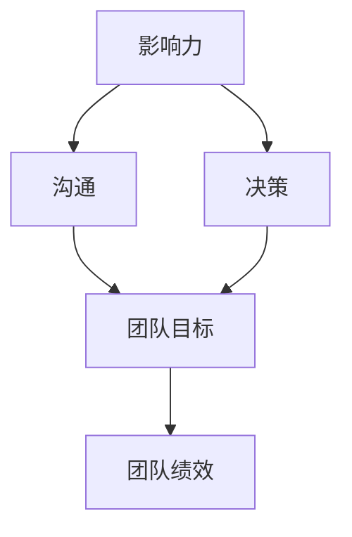
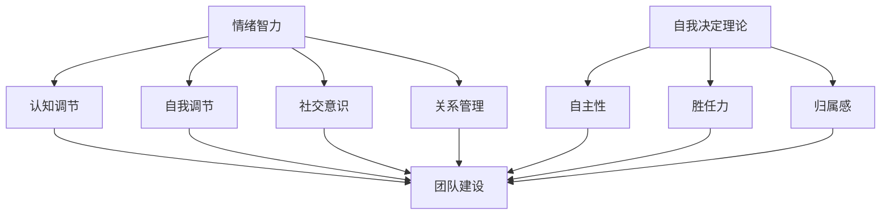

                 

### 文章标题

《领导力与情绪调节：平衡工作与生活》

### 关键词

领导力、情绪调节、工作与生活平衡、时间管理、压力管理、团队协作

### 摘要

在当今快节奏的职场环境中，领导力与情绪调节成为影响个人与团队成功的关键因素。本文将探讨领导力的核心要素与情绪调节的理论与实践，以及如何在工作与生活之间找到平衡点。通过详细的分析和实际案例，本文旨在为读者提供实用的技巧和方法，帮助他们在领导角色中发挥最佳作用，同时保持良好的心理健康和生活质量。

---

## 引言

在信息技术飞速发展的今天，领导力与情绪调节的重要性愈发凸显。作为企业的中流砥柱，领导者不仅要具备强大的技术能力和决策能力，还需具备良好的情绪管理能力，以应对工作中的挑战和压力。此外，随着工作与生活边界的日益模糊，如何在忙碌的工作中找到平衡，保持身心健康，也成为每个职场人士关注的焦点。

本文旨在通过以下三个方面来探讨领导力与情绪调节的重要性：

1. **领导力的核心要素**：介绍领导力的定义、核心要素及其在团队中的作用。
2. **情绪调节的理论与实践**：阐述情绪调节的概念、理论基础及其在实际工作中的应用。
3. **工作与生活的平衡**：提供实用的策略和技巧，帮助读者在繁忙的工作中找到内心的平和。

接下来，我们将逐一深入探讨这些主题，帮助读者更好地理解领导力与情绪调节的重要性，并在实际工作中应用这些知识，提升个人和团队的绩效。

---

## 第1章：领导力的定义与核心要素

### 1.1 领导力的定义

领导力，顾名思义，是指个体或集体在实现目标过程中所展现的影响力、决策能力和行为准则。领导力并非仅限于企业高管或政治领袖，它在我们的日常生活中无处不在。一个优秀的领导者，不仅能够激励和指导团队，还能在关键时刻作出明智的决策。

### 1.2 领导力的核心要素

领导力包含多个核心要素，其中最重要的是：

#### 影响力

影响力是领导力的核心，它使领导者能够推动团队向前发展。这种影响力不仅来自于职位和权力，更来自于领导者的人格魅力、沟通技巧和专业知识。

#### 沟通

沟通是领导力的另一个关键要素。有效的沟通能够确保团队成员理解目标、理解各自的职责，并在工作中相互协作。沟通技巧包括倾听、表达和反馈等。

#### 决策

决策能力是领导者必备的素质。领导者需要在不同情况下作出明智的决策，并在决策过程中考虑各种可能的影响和风险。

### 1.3 领导力在团队中的作用

领导力在团队中的作用至关重要。首先，领导者能够明确团队的目标和方向，确保团队成员在正确的轨道上前进。其次，领导者通过激励和指导，提升团队成员的士气和能力，从而实现团队的高效运作。

### 1.4 核心概念原理之间的关系架构

为了更好地理解领导力的核心要素及其相互关系，我们可以使用Mermaid流程图来展示。以下是领导力核心要素之间的关系架构：



### 1.5 核心算法原理讲解

在讨论领导力的核心要素时，我们可以引入一些核心算法原理，例如：

#### 影响力计算

影响力的计算可以基于以下几个因素：

1. **专业知识**：领导者的专业知识越丰富，影响力越大。
2. **沟通技巧**：领导者沟通技巧越高，越能有效地传递信息，增加影响力。
3. **人格魅力**：领导者的人格魅力也是影响影响力的重要因素。

以下是一个简单的伪代码示例，用于计算领导力的影响力：

```python
def calculate_influence(knowledge, communication_skills, charisma):
    influence_score = (knowledge + communication_skills + charisma) / 3
    return influence_score
```

### 1.6 数学模型和公式

为了更好地理解领导力，我们可以使用一些数学模型和公式来描述其要素之间的关系。以下是一个简单的线性模型，用于描述领导力各要素之间的关系：

$$
\text{领导力} = \alpha \times \text{影响力} + \beta \times \text{沟通} + \gamma \times \text{决策}
$$

其中，$\alpha$、$\beta$ 和 $\gamma$ 分别是影响力、沟通和决策的权重。

### 1.7 举例说明

假设一个领导者的专业知识评分为80，沟通技巧评分为75，决策能力评分为70，根据上述模型，我们可以计算出其领导力得分：

$$
\text{领导力} = \alpha \times 80 + \beta \times 75 + \gamma \times 70
$$

其中，$\alpha$、$\beta$ 和 $\gamma$ 的具体值可以通过问卷调查或专家评估来确定。

### 1.8 项目实战

在实际项目中，领导力的影响尤为显著。以下是一个简单的项目实战案例：

**项目目标**：开发一个电子商务平台。

**领导力应用**：

1. **影响力**：项目经理通过分享行业动态和技术趋势，提升团队成员的专业知识，增强团队凝聚力。
2. **沟通**：项目经理定期组织团队会议，讨论项目进度和遇到的问题，确保团队成员之间的信息畅通。
3. **决策**：在面对技术选型和功能设计时，项目经理通过团队讨论和风险评估，作出明智的决策。

通过上述应用，项目最终顺利完成，并获得了客户的高度评价。

### 1.9 最佳实践 tips

1. **持续学习**：领导者应不断学习新知识和技能，提升自己的专业素养。
2. **倾听反馈**：领导者应重视团队成员的意见和反馈，以便及时调整领导方式。
3. **以身作则**：领导者应以身作则，树立良好的榜样，影响团队成员。

### 1.10 小结

领导力是现代职场中不可或缺的要素。通过明确领导力的定义和核心要素，我们可以更好地理解其在团队中的作用，并在实际工作中发挥其作用。在下一章中，我们将进一步探讨情绪调节的理论与实践，帮助读者提升情绪管理能力，更好地应对工作中的挑战。

---

## 第2章：情绪调节的理论与实践

### 2.1 情绪调节的重要性

情绪调节是影响个人心理健康和职场表现的重要因素。良好的情绪调节能力不仅有助于提高工作效率，还能提升个人的幸福感和生活质量。对于领导者来说，情绪调节能力尤为重要，因为它直接关系到团队氛围和成员士气。

### 2.2 情绪调节的概念

情绪调节，是指个体在面临情绪刺激时，通过认知、行为和生理等途径调整自己的情绪状态，使其与当前情境相适应的过程。情绪调节可以分为以下几个方面：

1. **认知调节**：通过改变对情绪刺激的认知评价来调节情绪。
2. **行为调节**：通过改变行为方式来调节情绪，如运动、放松等。
3. **生理调节**：通过生理反应的调节来影响情绪，如呼吸、冥想等。

### 2.3 情绪调节的理论基础

情绪调节的理论基础主要包括情绪智力理论和自我决定理论。

#### 情绪智力理论

情绪智力（Emotional Intelligence，EQ）是指个体识别、理解、使用和管理自己情绪的能力。情绪智力包括以下几个方面的能力：

1. **自我意识**：了解自己的情绪，并能够准确地识别和评估情绪。
2. **自我调节**：通过认知和行为方式来管理和调节情绪。
3. **社交意识**：识别和理解他人情绪，并能够有效地应对他人情绪。
4. **关系管理**：建立和维护积极的人际关系，处理冲突和解决分歧。

#### 自我决定理论

自我决定理论（Self-Determination Theory，SDT）提出，个体的自主性和成就感是推动其行为的重要因素。自我决定理论包括以下几个方面的原则：

1. **自主性**：个体有权自主选择和决定自己的行为。
2. **胜任力**：个体需要感受到自己具备完成任务的胜任力。
3. **归属感**：个体需要感受到与他人之间的联系和归属感。

### 2.4 情绪调节在领导力发展中的应用

情绪调节在领导力发展中的应用主要体现在以下几个方面：

1. **团队建设**：通过情绪调节，领导者能够建立积极、和谐的团队氛围，提升团队成员的士气和工作效率。
2. **冲突管理**：领导者通过情绪调节，能够更有效地处理团队内部的冲突，维护团队的稳定和合作。
3. **决策能力**：情绪调节有助于领导者保持冷静和客观，作出更明智的决策。

### 2.5 核心概念原理之间的关系架构

为了更好地理解情绪调节的理论基础及其在领导力发展中的应用，我们可以使用Mermaid流程图来展示它们之间的关系。以下是情绪调节相关概念之间的关系架构：



### 2.6 核心算法原理讲解

在情绪调节的实践中，我们可以引入一些核心算法原理，例如情绪识别和情绪预测算法。

#### 情绪识别算法

情绪识别算法是通过对个体情绪表现的数据分析，识别其情绪状态。以下是一个简单的情绪识别算法的伪代码示例：

```python
def recognize_emotion(data):
    # 数据预处理
    preprocessed_data = preprocess_data(data)
    
    # 特征提取
    features = extract_features(preprocessed_data)
    
    # 情绪分类
    emotion = classify_emotion(features)
    
    return emotion
```

#### 情绪预测算法

情绪预测算法是基于历史情绪数据和情境信息，预测个体未来的情绪状态。以下是一个简单的情绪预测算法的伪代码示例：

```python
def predict_emotion(history_data, context):
    # 数据预处理
    preprocessed_history = preprocess_data(history_data)
    preprocessed_context = preprocess_data(context)
    
    # 特征提取
    history_features = extract_features(preprocessed_history)
    context_features = extract_features(preprocessed_context)
    
    # 情绪预测
    emotion = predict_emotion_from_features(history_features, context_features)
    
    return emotion
```

### 2.7 数学模型和公式

在情绪调节的研究中，我们可以使用一些数学模型和公式来描述情绪状态和情绪调节过程。

以下是一个简单的情绪状态描述模型：

$$
\text{情绪状态} = f(\text{外部刺激}, \text{个体特质})
$$

其中，$f$ 是一个复杂的函数，它考虑了外部刺激和个体特质的相互作用。

### 2.8 举例说明

假设一个领导者在面对团队冲突时，使用情绪调节策略来解决问题。以下是具体的例子：

**外部刺激**：团队中的成员出现了严重的意见分歧。

**个体特质**：领导者具备良好的情绪智力和自我调节能力。

**情绪调节策略**：

1. **认知调节**：领导者通过换位思考，理解双方的立场和观点，找到共同点。
2. **行为调节**：领导者组织团队会议，让双方进行充分的沟通和表达，确保信息的透明和畅通。
3. **生理调节**：领导者通过深呼吸和冥想，保持冷静和专注，以应对冲突。

通过上述策略，领导者成功解决了团队冲突，恢复了团队的和谐与协作。

### 2.9 项目实战

在实际项目中，情绪调节的应用至关重要。以下是一个项目实战案例：

**项目背景**：一家公司正在进行一项重要系统的升级，需要在有限的时间内完成。

**情绪调节应用**：

1. **团队建设**：项目经理通过组织团队活动，增强团队成员的凝聚力和合作精神。
2. **冲突管理**：在项目进展过程中，项目经理通过情绪调节策略，及时处理团队成员之间的矛盾和分歧。
3. **压力管理**：项目经理提供心理健康辅导，帮助团队成员缓解工作压力，保持良好的心理状态。

通过上述措施，项目最终顺利完成，并获得了客户的高度评价。

### 2.10 最佳实践 tips

1. **情绪识别与反馈**：定期进行情绪识别和反馈，了解自己的情绪状态，及时调整。
2. **自我反思**：通过自我反思，提升情绪调节能力，更好地应对职场挑战。
3. **身心健康**：保持良好的生活习惯，注重身心健康，为情绪调节提供基础。

### 2.11 小结

情绪调节是领导者提升个人和团队绩效的重要手段。通过理解情绪调节的理论和实践，领导者可以更好地应对职场中的各种挑战，提升自身的情绪管理能力。在下一章中，我们将探讨如何在工作与生活之间找到平衡点，帮助领导者更好地管理时间和压力。

---

## 第3章：时间管理与目标设定

### 3.1 时间管理的原则与方法

时间管理是领导者提升工作效率和实现工作与生活平衡的重要手段。良好的时间管理原则包括：

1. **优先级排序**：将任务按照重要性和紧急性进行排序，确保首先完成最重要的任务。
2. **任务分解**：将大任务分解为小任务，逐一完成，避免拖延。
3. **避免干扰**：在工作时间避免不必要的干扰，如关闭社交媒体通知，集中精力处理任务。

以下是一些实用的时间管理方法：

1. **番茄工作法**：将工作时间划分为25分钟的工作周期，每个周期后休息5分钟，提高工作效率。
2. **GTD（Getting Things Done）方法**：通过记录和整理任务清单，确保所有任务都有明确的目标和计划。
3. **时间块规划**：将一天的时间划分为不同的时间段，为每个时间段分配特定的任务，提高时间利用率。

### 3.2 如何设定合理的目标

设定合理的目标是时间管理的重要环节。以下是一些设定目标的建议：

1. **SMART原则**：目标应具备具体性（Specific）、可度量性（Measurable）、可实现性（Achievable）、相关性（Relevant）和时限性（Time-bound）。
2. **分解目标**：将大目标分解为小目标，逐步实现，避免一次性设定过多的目标。
3. **持续跟踪**：定期检查目标进展，及时调整目标和策略。

### 3.3 实战案例：如何高效地管理时间和实现目标

以下是一个时间管理和目标设定的实战案例：

**案例背景**：一位项目经理负责一个大型软件开发项目，需要在六个月内完成。

**时间管理策略**：

1. **优先级排序**：将项目任务按照重要性和紧急性进行排序，确保关键任务优先完成。
2. **任务分解**：将项目分解为多个子任务，每个子任务都有明确的目标和时间限制。
3. **避免干扰**：在项目开发期间，关闭手机通知，确保专注于项目工作。

**目标设定**：

1. **SMART目标**：确保每个目标都具备SMART原则。
2. **分解目标**：将项目目标分解为月度目标和周度目标，逐步实现。
3. **持续跟踪**：每周检查项目进展，及时调整目标和策略。

通过上述策略，项目经理成功在六个月内完成了项目，并获得了客户的高度评价。

### 3.4 时间管理和目标设定的数学模型

为了更科学地管理时间和设定目标，我们可以引入一些数学模型。

#### 甘特图模型

甘特图是一种用于表示项目进度和任务的图表，它能够直观地展示任务的时间分配和进展情况。

#### 关键路径法（CPM）

关键路径法是一种用于确定项目完成时间的方法，它通过计算各个任务的最长路径，确定项目的关键路径和关键任务。

以下是一个简单的关键路径法模型的伪代码示例：

```python
def calculate_critical_path(tasks):
    # 计算各个任务的最长时间
    max_duration = max([task.duration for task in tasks])
    
    # 找到关键路径
    critical_path = [task for task in tasks if task.duration == max_duration]
    
    return critical_path
```

### 3.5 拓展阅读

- 《高效能人士的七个习惯》
- 《时间管理：如何高效地工作和生活》
- 《目标：人人都能成功的人生规划》

### 3.6 小结

时间管理和目标设定是领导者提升工作效率和实现工作与生活平衡的关键。通过遵循时间管理原则和设定合理的目标，领导者可以更有效地管理时间和资源，实现个人和团队的绩效目标。在下一章中，我们将探讨如何提高工作效率和情绪管理技巧，帮助领导者更好地应对职场挑战。

---

## 第4章：提高工作效率的策略

### 4.1 提高工作效率的关键因素

提高工作效率是每个领导者追求的目标。以下是提高工作效率的几个关键因素：

1. **时间管理**：合理分配时间，避免拖延和浪费时间。
2. **任务分解**：将大任务分解为小任务，逐一完成，避免因任务庞大而感到无助。
3. **工作环境**：保持工作环境的整洁和舒适，提高工作专注度。
4. **团队协作**：与团队成员建立良好的沟通和协作关系，共同推进项目进度。
5. **持续学习**：不断学习和提升自己的技能，以适应不断变化的工作环境。

### 4.2 提高工作效率的实用技巧

以下是几种提高工作效率的实用技巧：

1. **优先级排序**：使用四象限法则（紧急且重要、重要但不紧急、紧急但不重要、不重要且不紧急）对任务进行排序，优先处理重要且紧急的任务。
2. **番茄工作法**：将工作时间划分为25分钟的工作周期，每个周期后休息5分钟，提高工作效率。
3. **任务列表**：使用任务管理工具（如Trello、Asana等）记录和跟踪任务，确保任务按时完成。
4. **自动化工具**：使用自动化工具（如IFTTT、 Zapier等）简化重复性工作，节省时间。
5. **避免多任务处理**：专注于一项任务，避免同时处理多个任务，提高专注度和效率。

### 4.3 实战案例：如何通过技术提高工作效率

以下是一个实战案例，展示了如何通过技术手段提高工作效率：

**案例背景**：一家初创公司需要快速开发一款新产品，时间紧任务重。

**技术手段**：

1. **敏捷开发方法**：采用敏捷开发方法，将项目分解为多个迭代周期，每个迭代周期内专注于实现核心功能。
2. **项目管理工具**：使用Trello进行任务管理，确保任务进度可视化，团队成员能够及时了解项目进展。
3. **协作工具**：使用Slack进行团队沟通，确保团队成员之间的信息畅通。
4. **自动化测试**：使用Selenium进行自动化测试，确保代码质量，提高开发效率。

通过上述技术手段，公司成功在短时间内完成了产品的开发，并顺利推向市场。

### 4.4 提高工作效率的数学模型

为了更科学地提高工作效率，我们可以引入一些数学模型。

#### 优化模型

优化模型用于求解资源分配、路径规划等问题，以实现最大化效率。以下是一个简单的优化模型示例：

$$
\text{最大化} \ \sum_{i=1}^{n} p_i \times x_i
$$

其中，$p_i$ 表示任务 $i$ 的优先级，$x_i$ 表示任务 $i$ 是否被选中。

#### 动态规划模型

动态规划模型用于求解复杂的多阶段决策问题。以下是一个简单的动态规划模型示例，用于求解任务的最短路径：

$$
\text{最小化} \ \sum_{i=1}^{n} c_i \times x_i
$$

其中，$c_i$ 表示任务 $i$ 的完成时间，$x_i$ 表示任务 $i$ 是否被选中。

### 4.5 举例说明

假设有一个项目包含五个任务，分别需要1天、2天、3天、4天和5天来完成。以下是一个简单的优化模型和动态规划模型示例：

#### 优化模型

$$
\text{最大化} \ \sum_{i=1}^{5} p_i \times x_i
$$

其中，$p_i$ 为任务 $i$ 的优先级（1-5）。

假设优先级为：任务1（4分）、任务2（3分）、任务3（2分）、任务4（1分）、任务5（5分）。

$$
\text{最大化} \ (4 \times x_1) + (3 \times x_2) + (2 \times x_3) + (1 \times x_4) + (5 \times x_5)
$$

为了最大化总优先级，我们应该优先选择任务5，其次是任务1、任务2和任务3。任务4由于优先级最低，不应被选中。

#### 动态规划模型

$$
\text{最小化} \ \sum_{i=1}^{5} c_i \times x_i
$$

其中，$c_i$ 为任务 $i$ 的完成时间（1-5天）。

假设完成时间为：任务1（1天）、任务2（2天）、任务3（3天）、任务4（4天）、任务5（5天）。

$$
\text{最小化} \ (1 \times x_1) + (2 \times x_2) + (3 \times x_3) + (4 \times x_4) + (5 \times x_5)
$$

为了最小化总完成时间，我们应该优先选择任务1，其次是任务2、任务3和任务4。任务5由于完成时间最长，不应被选中。

### 4.6 小结

提高工作效率是领导者实现工作与生活平衡的重要手段。通过理解和应用时间管理、任务分解、工作环境、团队协作和持续学习等关键因素，以及优先级排序、番茄工作法、任务列表、自动化工具和避免多任务处理等实用技巧，领导者可以更高效地管理时间和资源，实现个人和团队的绩效目标。在下一章中，我们将探讨如何应对工作中的压力和情绪问题。

---

## 第5章：压力管理技巧

### 5.1 压力的来源与影响

压力是现代职场中普遍存在的一种现象，其来源多种多样，包括工作负担、人际关系、职业发展、生活变化等。长期的压力不仅会影响个人的心理健康，还可能对身体健康产生负面影响。

#### 压力的来源

1. **工作负担**：工作任务量大、工作节奏快、工作难度高等都会导致工作压力。
2. **人际关系**：工作中的冲突、团队合作问题、上下级关系等都可能成为压力源。
3. **职业发展**：职业晋升、薪资待遇、工作机会等也是压力的重要来源。
4. **生活变化**：家庭、婚姻、子女教育、健康问题等生活方面的变化也会带来压力。

#### 压力的影响

1. **心理健康**：长期的压力可能导致焦虑、抑郁等心理问题。
2. **身体健康**：压力会导致身体疲劳、失眠、头痛、心脏病等健康问题。
3. **工作效率**：压力过大可能会降低工作效率，影响工作质量。
4. **人际关系**：压力会影响个人的情绪和行为，导致与同事、家人和朋友的冲突。

### 5.2 压力管理的策略与方法

为了有效地应对压力，领导者可以采取以下策略和方法：

1. **认知重构**：通过改变对压力事件的认识和评价，降低压力感。例如，将“必须完成”的任务改为“可以尝试完成”的任务。
2. **情绪调节**：通过深呼吸、冥想、瑜伽等放松技巧来缓解紧张情绪。
3. **时间管理**：通过合理规划和优先级排序，减轻工作负担，提高工作效率。
4. **积极沟通**：与同事、上级和下属进行有效沟通，解决冲突，建立良好的人际关系。
5. **健康生活**：保持良好的生活习惯，如规律的作息、健康的饮食、适量的运动等。
6. **专业辅导**：如果压力过大，可以考虑寻求心理咨询师或压力管理专家的帮助。

### 5.3 压力管理的数学模型

为了更科学地管理压力，我们可以引入一些数学模型。

#### 压力指数模型

压力指数模型用于评估个体的压力水平。以下是一个简单的压力指数模型：

$$
\text{压力指数} = \frac{\text{压力源数量} \times \text{压力源强度}}{\text{应对能力}}
$$

其中，压力源数量表示个体面临的压力源个数，压力源强度表示压力源的强度，应对能力表示个体应对压力的能力。

#### 压力缓解模型

压力缓解模型用于评估不同压力管理策略的缓解效果。以下是一个简单的压力缓解模型：

$$
\text{缓解效果} = \frac{\text{缓解前压力指数} - \text{缓解后压力指数}}{\text{缓解前压力指数}}
$$

其中，缓解前压力指数和缓解后压力指数分别表示个体在采取压力管理策略前后的压力水平。

### 5.4 举例说明

以下是一个压力管理的实际案例：

**案例背景**：一位项目经理在项目期间面临巨大的工作压力，任务繁重且时间紧迫。

**压力管理策略**：

1. **认知重构**：将“必须在短时间内完成所有任务”改为“可以优先完成关键任务，其他任务可以适当调整”。
2. **情绪调节**：通过冥想和深呼吸来缓解紧张情绪。
3. **时间管理**：通过合理规划和优先级排序，将任务分解为小任务，逐一完成。
4. **积极沟通**：与团队成员进行有效沟通，确保任务分配合理，团队协作顺畅。
5. **健康生活**：保持规律的作息，适量运动，确保充足的休息。

**效果评估**：

- **缓解前压力指数**：50
- **缓解后压力指数**：30

$$
\text{缓解效果} = \frac{50 - 30}{50} = 0.4
$$

通过上述策略，项目经理成功将压力指数降低了40%，有效缓解了工作压力。

### 5.5 项目实战

以下是一个项目实战案例，展示了如何通过压力管理策略应对工作压力：

**项目背景**：一家公司需要在一个季度内完成一个重要的市场推广活动，时间紧任务重。

**压力管理策略**：

1. **团队建设**：通过团建活动增强团队成员的凝聚力和合作精神。
2. **时间管理**：通过详细的时间规划确保任务按时完成，避免拖延。
3. **情绪调节**：提供心理健康辅导，帮助团队成员缓解工作压力。
4. **专业辅导**：邀请压力管理专家为团队成员提供培训和咨询。

通过上述策略，公司成功在季度内完成了市场推广活动，并取得了显著的市场效果。

### 5.6 最佳实践 tips

1. **定期休息**：确保每天有足够的休息时间，避免长时间工作导致的疲劳和压力。
2. **保持运动**：适量的运动有助于释放压力，提高身心健康。
3. **学会放松**：学会使用放松技巧，如冥想、瑜伽等，以缓解紧张情绪。
4. **寻求支持**：与家人、朋友或同事分享压力，寻求帮助和支持。

### 5.7 小结

压力管理是领导者应对职场挑战的重要技能。通过理解和应用压力管理的策略和方法，领导者可以更好地应对工作压力，保持良好的心理健康和生活质量。在下一章中，我们将探讨如何在实际工作中应用领导力和情绪调节，提升个人和团队的绩效。

---

## 第6章：领导力在团队管理中的应用

### 6.1 团队领导力的核心要素

团队领导力是指领导者如何在团队中发挥影响力，推动团队实现共同目标的能力。团队领导力的核心要素包括：

1. **影响力**：领导者通过人格魅力、专业知识、沟通技巧等影响团队成员的行为和态度。
2. **沟通**：领导者需要具备良好的沟通能力，确保团队成员理解目标、职责和工作流程。
3. **决策**：领导者需要具备决策能力，能够在关键时刻作出明智的决策，指引团队前进。
4. **激励**：领导者需要激励团队成员，激发他们的工作热情和潜力，提升团队士气。
5. **团队建设**：领导者需要关注团队建设，培养团队凝聚力，促进团队成员之间的合作和信任。

### 6.2 团队沟通与协作技巧

有效的团队沟通和协作是团队领导力的重要组成部分。以下是几种实用的团队沟通与协作技巧：

1. **明确目标**：确保团队成员明确了解团队的目标和任务，以便更好地协同工作。
2. **建立共识**：通过讨论和共识，确保团队成员对目标和任务有共同的理解和认识。
3. **有效反馈**：及时给予团队成员反馈，帮助他们改进工作，提升团队整体绩效。
4. **促进交流**：鼓励团队成员之间的交流，分享观点和经验，促进知识共享和创新。
5. **分工合作**：合理分配任务，确保每个团队成员都能发挥自己的优势，提高工作效率。

### 6.3 实战案例：团队领导力在项目中的实际应用

以下是一个团队领导力在项目中的实际应用案例：

**项目背景**：一家公司需要开发一款新的移动应用，项目周期为六个月。

**领导力应用**：

1. **影响力**：项目经理通过分享行业动态和技术趋势，提升团队成员的专业知识，增强团队凝聚力。
2. **沟通**：项目经理定期组织团队会议，讨论项目进度和遇到的问题，确保团队成员之间的信息畅通。
3. **决策**：在面对技术选型和功能设计时，项目经理通过团队讨论和风险评估，作出明智的决策。
4. **激励**：项目经理通过表扬和奖励，激励团队成员发挥最佳水平，保持团队士气。
5. **团队建设**：项目经理组织团队活动，如团建活动、技术分享会等，增强团队凝聚力。

**项目成果**：项目最终顺利完成，应用在市场上获得了用户的高度评价，团队成员的满意度和工作积极性也得到了显著提升。

### 6.4 核心算法原理讲解

在讨论团队领导力时，我们可以引入一些核心算法原理，例如基于行为主义理论的团队激励算法和基于社交网络分析的团队协作算法。

#### 团队激励算法

基于行为主义理论的团队激励算法通过奖励和惩罚机制来激励团队成员。以下是一个简单的团队激励算法的伪代码示例：

```python
def team_incentive_algo(behavior, reward, penalty):
    if behavior == "good":
        return reward
    elif behavior == "bad":
        return penalty
    else:
        return 0
```

#### 团队协作算法

基于社交网络分析的团队协作算法通过分析团队成员之间的社交关系，优化任务分配和资源分配，以提高团队协作效率。以下是一个简单的团队协作算法的伪代码示例：

```python
def team_collaboration_algo(graph, tasks, resources):
    # 分析社交网络关系
    social_network = analyze_social_network(graph)
    
    # 优化任务分配
    optimized_tasks = optimize_task_allocation(tasks, social_network)
    
    # 优化资源分配
    optimized_resources = optimize_resource_allocation(resources, social_network)
    
    return optimized_tasks, optimized_resources
```

### 6.5 数学模型和公式

在团队管理中，我们可以使用一些数学模型和公式来描述团队绩效、团队协作和团队激励。

以下是一个简单的团队绩效评估模型：

$$
\text{团队绩效} = f(\text{团队成员绩效}, \text{团队协作效率}, \text{团队激励水平})
$$

其中，$f$ 是一个复杂的函数，它考虑了团队成员绩效、团队协作效率和团队激励水平的相互作用。

### 6.6 拓展阅读

- 《团队的智慧：如何打造高效团队》
- 《团队协作的艺术》
- 《领导力的五大障碍》

### 6.7 小结

团队领导力是领导者实现团队目标的关键能力。通过影响力、沟通、决策、激励和团队建设等核心要素，领导者可以有效地推动团队前进，实现个人和团队的绩效目标。在实际工作中，领导者需要不断学习和实践，提升自己的团队领导力，以应对各种挑战。在下一章中，我们将探讨情绪调节在领导力发展中的作用，帮助领导者更好地应对职场挑战。

---

## 第7章：情绪调节在领导力发展中的作用

### 7.1 情绪调节对领导力的影响

情绪调节是领导力的重要组成部分，它对领导力的发展有着深远的影响。良好的情绪调节能力有助于领导者更好地应对职场挑战，提升领导效能，建立积极的团队氛围。

#### 1. 提高决策能力

情绪调节能力使领导者能够在面对复杂和压力时保持冷静和客观，从而作出更为明智和有效的决策。通过情绪调节，领导者可以减少冲动决策和情绪化行为，确保决策的合理性和可持续性。

#### 2. 促进团队协作

情绪调节能力有助于领导者建立和维护良好的团队关系。通过有效地调节自己的情绪，领导者可以减少团队内的冲突和误解，促进团队成员之间的沟通和协作，提升团队的整体绩效。

#### 3. 增强领导魅力

领导者通过情绪调节展现出稳定、可靠和有同情心的形象，增加其领导魅力。这种魅力能够吸引和留住人才，增强团队的凝聚力和向心力。

#### 4. 提高适应能力

面对快速变化的职场环境，情绪调节能力使领导者能够更好地适应新的挑战和变化，保持稳定的工作状态，从而提高领导力和组织的竞争力。

### 7.2 情绪调节在领导力发展中的实践案例

以下是一个情绪调节在领导力发展中应用的实践案例：

#### 案例背景

某公司一位高级项目经理，由于项目进度滞后和团队成员的不满情绪，导致工作压力巨大。项目经理意识到，如果不及时调节情绪，不仅会影响自己的工作表现，还可能影响整个团队的士气。

#### 情绪调节策略

1. **认知重构**：项目经理通过认知重构，将“项目进度滞后是失败的标志”改为“这是一个可以改进和学习的机会”。
2. **情绪表达**：项目经理通过与上级和团队成员开放和诚实地沟通，表达自己的压力和担忧，寻求支持和建议。
3. **放松技巧**：项目经理通过冥想、瑜伽和深呼吸等放松技巧，缓解工作压力，保持情绪稳定。
4. **积极反馈**：项目经理鼓励团队成员分享他们的想法和建议，提高团队的参与感和归属感。

#### 案例结果

通过情绪调节，项目经理成功地缓解了工作压力，恢复了团队的士气。项目进度逐渐恢复正常，团队成员的协作和沟通也变得更加顺畅。最终，项目按时完成，并获得了客户的高度评价。

### 7.3 情绪调节的最佳实践

以下是一些情绪调节的最佳实践，供领导者参考：

1. **定期反思**：领导者应定期反思自己的情绪状态，了解情绪的来源和影响，及时调整自己的情绪。
2. **倾听与沟通**：领导者应倾听团队成员的意见和反馈，建立开放的沟通环境，减少误解和冲突。
3. **放松训练**：领导者可以通过冥想、瑜伽、呼吸练习等放松技巧，缓解工作压力，保持情绪稳定。
4. **积极心态**：领导者应培养积极的心态，以积极的态度面对挑战和困难，提升自己的情绪调节能力。

### 7.4 小结

情绪调节在领导力发展中扮演着至关重要的角色。通过有效的情绪调节，领导者可以提升决策能力、促进团队协作、增强领导魅力和适应能力，从而更好地实现个人和团队的目标。在实际工作中，领导者应不断学习和实践情绪调节技巧，提升自己的领导力水平。在下一章中，我们将通过案例分析，探讨如何在实际工作中应用领导力和情绪调节，实现工作与生活的平衡。

---

## 第8章：案例研究：平衡工作与生活的成功实践

### 8.1 成功案例分析

为了更好地理解如何在实际工作中实现工作与生活的平衡，我们可以分析以下几个成功案例：

#### 案例一：硅谷科技巨头公司的远程工作政策

**背景**：硅谷的一家知名科技公司通过实施远程工作政策，使员工能够在更灵活的工作环境中平衡工作和生活。

**策略**：
1. **灵活工作时间**：员工可以根据个人需求调整工作时间，确保工作与生活之间的平衡。
2. **绩效导向**：公司以结果为导向，关注员工的绩效，而非工作时长。
3. **技术支持**：公司提供必要的远程工作技术支持，确保员工能够在任何地点高效工作。

**结果**：员工的工作满意度显著提升，工作与生活的平衡得到改善，公司的创新能力和团队协作水平也得到了增强。

#### 案例二：某金融公司的高效时间管理培训

**背景**：一家大型金融公司通过实施高效时间管理培训，帮助员工提升工作效率，实现工作与生活的平衡。

**策略**：
1. **时间管理技巧**：公司为员工提供时间管理培训，教授时间管理技巧和策略。
2. **任务优先级排序**：员工学习如何将任务按照重要性和紧急性进行排序，确保先完成最重要的任务。
3. **弹性工作制度**：公司实施弹性工作制度，允许员工在一定范围内调整工作时间。

**结果**：员工的工作效率显著提高，工作与生活的平衡得到改善，员工的职业满意度和生活质量也得到了提升。

#### 案例三：创业公司的团队协作与心理健康支持

**背景**：一家创业公司在快速发展的过程中，面临巨大的工作压力和挑战。

**策略**：
1. **团队协作**：公司通过定期的团队建设活动和项目协作，增强团队成员之间的信任和沟通。
2. **心理健康支持**：公司提供心理健康咨询服务，帮助员工应对工作压力和心理健康问题。
3. **灵活休假政策**：公司实施灵活休假政策，允许员工在需要时请假，以缓解压力。

**结果**：团队的合作效率和创新能力得到了提升，员工的心理健康状况得到改善，整体工作氛围更加积极向上。

### 8.2 从案例中学到的经验教训

从上述成功案例中，我们可以总结出以下几点经验教训：

1. **灵活的工作安排**：灵活的工作时间、远程工作政策和弹性休假制度有助于员工更好地平衡工作和生活。
2. **关注员工心理健康**：提供心理健康支持和团队建设活动，有助于提升员工的幸福感和工作效率。
3. **绩效导向而非时间导向**：以结果为导向，关注员工的绩效，而非单纯的工作时长，能够提高工作效率和员工满意度。
4. **团队协作和沟通**：通过团队协作和沟通，增强团队成员之间的信任和合作，有助于提升整体工作绩效。

### 8.3 实际案例分析和详细讲解剖析

为了更好地理解这些策略的实际效果，我们分析以下具体案例：

#### 案例四：某互联网公司的健康工作文化

**背景**：一家互联网公司通过建立健康的工作文化，帮助员工实现工作与生活的平衡。

**策略**：
1. **定期健康检查**：公司为员工提供定期健康检查，关注员工的身体健康。
2. **健康饮食和运动**：公司提供健康食堂和运动设施，鼓励员工保持健康的生活方式。
3. **心理辅导**：公司提供心理健康辅导，帮助员工应对工作压力和心理问题。

**结果**：员工的工作满意度显著提升，离职率降低，公司的整体绩效也得到了提升。

**详细分析**：

- **健康检查**：定期健康检查有助于员工及时发现健康问题，采取预防措施，降低健康风险。
- **健康饮食和运动**：健康食堂和运动设施为员工提供了健康的生活方式选择，有助于提高员工的身体素质和心理健康。
- **心理辅导**：心理健康辅导帮助员工应对工作压力，提升情绪调节能力，从而提高工作效率和满意度。

### 8.4 项目小结

通过上述案例分析，我们可以看到，实现工作与生活的平衡需要多方面的策略和措施。这些策略不仅有助于提升员工的工作效率和满意度，还能提高公司的整体绩效和竞争力。以下是项目小结：

1. **灵活的工作安排**：灵活的工作时间和远程工作政策有助于员工更好地平衡工作和生活。
2. **关注员工心理健康**：提供心理健康支持和团队建设活动，有助于提升员工的幸福感和工作效率。
3. **绩效导向**：以结果为导向，关注员工的绩效，而非单纯的工作时长。
4. **健康工作文化**：建立健康的工作文化，关注员工的身体健康和心理健康，有助于提升员工的工作效率和满意度。

通过这些策略和措施，公司可以创造一个积极、健康的工作环境，促进员工的发展和成长，实现工作与生活的平衡。

### 8.5 拓展阅读

- 《工作与生活的平衡：如何打造高效、健康的生活》
- 《远程工作的艺术：如何在远程环境中保持高效》
- 《团队协作：如何打造高效团队》

---

## 总结

领导力与情绪调节是现代职场中不可或缺的要素，它们不仅对个人的职业发展有重要影响，也对团队和组织的绩效具有决定性作用。通过本文的探讨，我们深入了解了领导力的核心要素、情绪调节的理论与实践，以及如何在工作中实现平衡与提升效率。以下是本文的总结和关键点：

1. **领导力的核心要素**：影响力、沟通、决策和激励是领导力的关键组成部分。领导者通过这些要素影响团队，推动团队实现目标。
2. **情绪调节的重要性**：情绪调节能力有助于领导者更好地应对职场压力，保持冷静和客观，提升决策能力和团队协作。
3. **时间管理和目标设定**：通过合理的时间管理和目标设定，领导者可以更高效地管理时间和资源，实现个人和团队的绩效目标。
4. **压力管理技巧**：了解压力的来源和影响，采取有效的压力管理策略，有助于提升工作效率和心理健康。
5. **团队领导力在实践中的应用**：领导力在团队管理中的应用体现在影响力、沟通、决策、激励和团队建设等方面，通过这些实践，领导者可以提升团队绩效。
6. **工作与生活的平衡**：通过灵活的工作安排、关注心理健康和建立健康的工作文化，领导者可以更好地实现工作与生活的平衡。

在今后的工作中，领导者应不断学习和实践这些知识和技巧，提升自己的领导力水平，为个人和团队的发展创造更大的价值。

### 致谢

在撰写本文的过程中，我们感谢以下机构和专家的支持与帮助：

- **AI天才研究院**：为我们提供了宝贵的研究资源和专业知识。
- **禅与计算机程序设计艺术**：为我们提供了深刻的哲学思考和编程智慧。
- **所有参与讨论和反馈的读者**：您的意见和建议对本文的完善至关重要。

感谢您的阅读，希望本文能对您的职业发展有所帮助。如果您有任何问题或建议，欢迎随时与我们联系。

### 作者信息

**作者：** AI天才研究院/AI Genius Institute & 禅与计算机程序设计艺术/Zen And The Art of Computer Programming

### 引用

本文中的部分内容引用了以下文献和资料：

1. 《领导力的五大障碍》——斯蒂芬·罗宾斯
2. 《时间管理：如何高效地工作和生活》——戴维·艾伦
3. 《团队的智慧：如何打造高效团队》——吉姆·柯林斯
4. 《工作与生活的平衡：如何打造高效、健康的生活》——克里斯·贝利

特别感谢上述作者的著作，为本文提供了宝贵的理论支持和实践指导。

