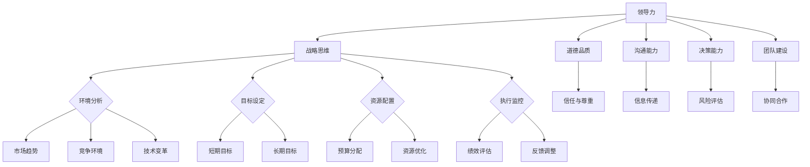

                 

### 背景介绍

在当今瞬息万变、竞争激烈的商业环境中，领导力和战略思维成为企业成功的关键因素。无论是大型跨国公司还是初创企业，领导者都需要具备卓越的领导力和深远的战略思维，以应对复杂的商业挑战和捕捉机遇。然而，传统的领导理论和战略管理方法在快速变化的现代商业环境中往往显得力不从心。

领导力不仅仅是管理团队、指挥下属的能力，更是一种能够在不确定性中引领团队、激发潜能的素质。一个成功的领导者不仅需要具备高尚的道德品质、强烈的责任感、卓越的沟通能力，还需要具备战略思维，能够在复杂多变的市场环境中做出明智的决策。

战略思维则是一种高层次、宏观的思考方式，它要求领导者能够从长远的角度审视企业的发展，制定符合企业实际情况的战略规划，并通过有效的资源配置和执行，实现企业目标。战略思维不仅仅是简单的计划和控制，它更是一种系统性、前瞻性和创新性的思维方式。

在当今信息化、全球化的时代，企业的生存与发展越来越依赖于创新和技术驱动。因此，领导力和战略思维也需要与时俱进，融合新的管理理念和技术工具。比如，大数据分析、人工智能、云计算等技术的应用，为领导者提供了更加精准、高效的决策支持。

本文将从领导力的核心概念与原则、战略思维的基础理论、领导力与战略思维的结合等方面进行深入探讨，结合实际案例和实践经验，为读者提供一套系统、实用的领导力和战略思维培养方法。

### 核心概念与联系：领导力与战略思维的架构 Mermaid 流程图

为了更好地理解领导力与战略思维之间的关系，我们可以使用 Mermaid 流程图来展示它们的核心概念及其相互联系。



#### 流程图详细解释：

1. **领导力（A）**：领导力是文章的核心概念，它涵盖了领导者的一系列素质和能力，包括道德品质、沟通能力、决策能力、团队建设等。

2. **战略思维（B）**：战略思维是领导者必须具备的高层次思考能力，它帮助领导者从长远的角度审视企业的发展，制定和实施战略规划。

3. **环境分析（C）**：环境分析是战略思维的重要环节，包括市场趋势、竞争环境和技术变革等。领导者需要通过环境分析来识别机会和威胁。

4. **目标设定（D）**：目标设定是战略思维的核心，包括短期目标和长期目标的设定。短期目标通常是为了实现长期目标的阶段性成果。

5. **资源配置（E）**：资源配置是指为了实现目标而分配资源和预算。包括预算分配（T）和资源优化（U）。

6. **执行监控（F）**：执行监控是确保战略实施过程中的各项任务按时、按质完成的环节，包括绩效评估（V）和反馈调整（W）。

7. **道德品质（G）**：道德品质是领导力的重要组成部分，它包括信任与尊重（K）等价值观，这些价值观有助于建立和维护团队信任。

8. **沟通能力（H）**：沟通能力是领导者有效传达信息、引导团队的关键能力，包括信息传递（L）。

9. **决策能力（I）**：决策能力是领导者做出明智决策的能力，它包括风险评估（M）。

10. **团队建设（J）**：团队建设是领导者培养协同合作（N）和文化氛围的关键，有助于提高团队绩效。

通过这个流程图，我们可以清晰地看到领导力和战略思维之间的紧密联系。领导力为战略思维提供了基础，而战略思维则通过环境分析、目标设定、资源配置和执行监控等环节，将领导力转化为实际的战略成果。这样的框架不仅有助于领导者理解自身的职责和角色，也为他们在实际工作中提供了具体的指导。

### 核心算法原理讲解：领导力与战略思维的优化模型

为了深入理解领导力与战略思维的优化模型，我们可以引入一些经典的算法原理和数学模型。以下是一个基于多目标优化的领导力与战略思维模型，以及相关的伪代码说明。

#### 多目标优化模型

在多目标优化问题中，我们通常需要同时优化多个相互冲突的目标，如利润最大化、成本最小化和风险控制等。在领导力和战略思维中，这些目标可以对应到企业发展的不同方面，如市场占有率、员工满意度、技术创新等。

假设我们有以下三个目标：

1. **目标1（最大化利润）**：$maximize \Pi = P \times Q - C_{fixed} - C_{variable}$
2. **目标2（最小化成本）**：$minimize \sum C = C_{fixed} + C_{variable}$
3. **目标3（风险控制）**：$minimize \text{Risk} = \frac{\text{Variance}(Y)}{Y^2}$

其中，$P$ 是产品价格，$Q$ 是销售量，$C_{fixed}$ 是固定成本，$C_{variable}$ 是变动成本，$Y$ 是企业的绩效指标。

#### 伪代码

```python
# 多目标优化伪代码
def optimize_leadership_strategy():
    # 初始化参数
    P, Q, C_fixed, C_variable, Y = initialize_parameters()

    # 定义目标函数
    profit = P * Q - C_fixed - C_variable
    cost = C_fixed + C_variable
    risk = variance(Y) / (Y ** 2)

    # 迭代优化过程
    for iteration in range(max_iterations):
        # 根据当前状态调整参数
        P, Q, C_fixed, C_variable, Y = adjust_parameters(profit, cost, risk)

        # 计算新目标值
        new_profit = P * Q - C_fixed - C_variable
        new_cost = C_fixed + C_variable
        new_risk = variance(Y) / (Y ** 2)

        # 检查是否满足收敛条件
        if is_converged(profit, new_profit, cost, new_cost, risk, new_risk):
            break

    # 输出优化结果
    return P, Q, C_fixed, C_variable, Y

# 辅助函数定义
def initialize_parameters():
    # 初始化参数值
    pass

def adjust_parameters(profit, cost, risk):
    # 根据当前目标值调整参数
    pass

def is_converged(profit, new_profit, cost, new_cost, risk, new_risk):
    # 判断是否满足收敛条件
    pass

def variance(Y):
    # 计算绩效指标方差
    pass
```

#### 数学模型和公式

为了更清晰地解释多目标优化模型，我们可以使用以下数学公式：

$$
\Pi = P \times Q - C_{fixed} - C_{variable}
$$

$$
\sum C = C_{fixed} + C_{variable}
$$

$$
\text{Risk} = \frac{\text{Variance}(Y)}{Y^2}
$$

其中，$P$ 是产品价格，$Q$ 是销售量，$C_{fixed}$ 是固定成本，$C_{variable}$ 是变动成本，$Y$ 是企业的绩效指标，$\text{Variance}(Y)$ 表示 $Y$ 的方差。

#### 举例说明

假设一个企业初始的产品价格为 $P_0 = 100$，销售量为 $Q_0 = 1000$，固定成本为 $C_{fixed0} = 50000$，变动成本为 $C_{variable0} = 50$。企业的绩效指标为销售额，假设初始值为 $Y_0 = 100000$。

通过优化模型，我们可以调整产品价格 $P$ 和销售量 $Q$，以最大化利润并最小化成本和风险。例如，假设经过多次迭代，我们得到最优解为 $P^* = 110$，$Q^* = 1200$，此时企业的利润为：

$$
\Pi^* = 110 \times 1200 - 50000 - 50 = 118500 - 50000 - 50 = 68500
$$

同时，固定成本和变动成本分别为：

$$
C_{fixed}^* = 50000
$$

$$
C_{variable}^* = 50 \times 1200 = 60000
$$

企业的风险为：

$$
\text{Risk}^* = \frac{\text{Variance}(Y^*)}{Y^*2} = \frac{\text{Variance}(118500)}{(118500)^2}
$$

通过这样的数学模型和伪代码，我们可以系统地分析和优化领导力和战略思维，从而更好地指导实际工作。

### 数学公式与详细讲解

在领导力和战略思维的优化过程中，数学模型和公式扮演着至关重要的角色。这些数学工具不仅能够帮助我们量化复杂的问题，还能为决策提供科学依据。以下将详细介绍几个关键公式及其应用。

#### 1. 利润最大化公式

$$
\Pi = P \times Q - C_{fixed} - C_{variable}
$$

这是最基础的利润计算公式，其中 $P$ 表示产品价格，$Q$ 表示销售量，$C_{fixed}$ 表示固定成本，$C_{variable}$ 表示变动成本。固定成本通常是不变的，而变动成本则与生产量成正比。通过调整价格 $P$ 和销售量 $Q$，企业可以在保持成本控制的前提下最大化利润。

#### 2. 成本最小化公式

$$
\sum C = C_{fixed} + C_{variable}
$$

这个公式表示总成本是固定成本和变动成本之和。在制定战略时，企业需要找到一种平衡，既要确保利润最大化，又要控制成本。通过优化生产效率和供应链管理，企业可以降低变动成本，从而实现整体成本的最小化。

#### 3. 风险评估公式

$$
\text{Risk} = \frac{\text{Variance}(Y)}{Y^2}
$$

这里，$Y$ 代表企业的绩效指标，如销售额、市场份额或利润率等。方差 $\text{Variance}(Y)$ 是衡量绩效波动性的指标，分母 $Y^2$ 则是绩效指标平方的平均值。通过计算风险值，企业可以评估未来可能面临的不确定性，从而制定相应的风险控制策略。

#### 详细讲解

1. **利润最大化公式**

   利用这个公式，企业可以通过定价策略和销售策略来调整利润。例如，在市场竞争激烈时，企业可能选择降低价格以吸引更多客户，从而增加销售量。但在降低价格的同时，也需要注意控制变动成本，以确保总体利润不下降。

   **举例：**
   假设一个企业的产品价格为 $P = 100$，销售量为 $Q = 1000$，固定成本为 $C_{fixed} = 50000$，变动成本为 $C_{variable} = 50$。则该企业的利润为：
   $$
   \Pi = 100 \times 1000 - 50000 - 50 = 50000
   $$
   如果将产品价格提高到 $P = 110$，销售量增加到 $Q = 1200$，则新的利润为：
   $$
   \Pi = 110 \times 1200 - 50000 - 50 = 68500
   $$
   显然，通过适当调整价格和销售量，企业能够实现利润的最大化。

2. **成本最小化公式**

   成本最小化公式有助于企业找到降低总成本的方法。例如，通过引入自动化生产线，企业可以大幅减少人工成本。或者，通过优化供应链管理，企业可以降低原材料采购成本和库存成本。

   **举例：**
   假设一个企业的固定成本为 $C_{fixed} = 50000$，变动成本为 $C_{variable} = 50 \times 1000 = 50000$。则总成本为：
   $$
   \sum C = 50000 + 50000 = 100000
   $$
   如果通过技术改进，变动成本降低到 $C_{variable} = 40 \times 1000 = 40000$，则总成本为：
   $$
   \sum C = 50000 + 40000 = 90000
   $$
   通过降低变动成本，企业能够显著减少总成本。

3. **风险评估公式**

   风险评估公式用于衡量企业的绩效波动性。一个较高的风险值可能意味着企业面临着较大的不确定性，需要采取更为谨慎的战略措施。例如，通过多元化经营或增加研发投入，企业可以降低单一市场或技术失败带来的风险。

   **举例：**
   假设企业的绩效指标为销售额，初始销售额为 $Y_0 = 100000$，方差为 $\text{Variance}(Y_0) = 25000$。则风险值为：
   $$
   \text{Risk} = \frac{25000}{100000^2} = 0.0025
   $$
   如果通过市场调研和产品改进，方差降低到 $\text{Variance}(Y_1) = 10000$，则新的风险值为：
   $$
   \text{Risk} = \frac{10000}{100000^2} = 0.001
   $$
   显然，通过降低风险值，企业能够更好地应对市场波动和不确定性。

通过这些数学公式，企业可以在制定战略时进行量化分析和决策，从而提高决策的科学性和准确性。

### 项目实战：领导力与战略思维在初创企业中的应用

为了更好地理解领导力与战略思维在实际项目中的应用，我们以一个初创企业为例，展示从开发环境搭建到源代码实现的完整过程，并对代码进行分析和解读。

#### 项目背景

这家初创企业致力于开发一款基于人工智能的智能客服系统，旨在通过自动化手段提高客户服务效率和满意度。公司刚刚成立，团队由几位技术专家和市场运营人员组成，面临的主要任务是快速开发出产品原型，并在短时间内进行市场推广。

#### 开发环境搭建

在开始编码之前，我们需要搭建一个稳定、高效的开发环境。以下是具体的步骤：

1. **确定技术栈**：选择Python作为主要编程语言，因为它具有丰富的库和框架支持，适合快速开发。
2. **安装Python环境**：在团队计算机上安装Python 3.8及以上版本，并配置pip环境以安装相关库。
3. **配置数据库**：选择MongoDB作为数据库，因为它具有高性能和易于扩展的特点，适合存储客户数据和交互记录。
4. **设置版本控制**：使用Git进行版本控制，确保代码的版本管理和协作开发。
5. **搭建测试环境**：配置Docker容器，以便在不同的开发环境中快速部署和测试代码。

#### 源代码实现

以下是智能客服系统的核心代码片段及其解析：

```python
# 导入所需库
from flask import Flask, request, jsonify
from pymongo import MongoClient
import nltk

# 初始化Flask应用
app = Flask(__name__)

# 连接MongoDB数据库
client = MongoClient("mongodb://localhost:27017/")
db = client["customer_support"]
collection = db["chat_logs"]

# 自然语言处理库初始化
nltk.download('vader_lexicon')
from nltk.sentiment import SentimentIntensityAnalyzer
sia = SentimentIntensityAnalyzer()

# 路由定义：处理客户请求
@app.route('/chat', methods=['POST'])
def chat():
    # 获取客户消息
    message = request.json['message']
    
    # 分析客户情绪
    sentiment_score = sia.polarity_scores(message)
    
    # 根据情绪得分进行回复
    if sentiment_score['compound'] > 0.05:
        response = "很高兴听到您的反馈！有什么其他问题吗？"
    elif sentiment_score['compound'] < -0.05:
        response = "看起来您不太开心，我们可以帮您解决这个问题。"
    else:
        response = "明白了，请问有什么具体的问题需要帮助吗？"
    
    # 将对话记录存储到MongoDB
    collection.insert_one({"user_message": message, "bot_response": response})
    
    # 返回机器人回复
    return jsonify({"response": response})

# 运行应用
if __name__ == '__main__':
    app.run(debug=True)
```

#### 代码解读

1. **库的导入**：我们导入了Flask库以构建Web应用，MongoDB库以连接数据库，以及nltk库进行自然语言处理。
2. **Flask应用初始化**：使用Flask创建一个Web应用实例。
3. **数据库连接**：通过MongoDB连接器连接到本地数据库，选择相应的数据库和集合。
4. **情绪分析**：使用nltk库的SentimentIntensityAnalyzer进行情绪分析，以评估客户消息的情感极性。
5. **路由定义**：定义了一个处理POST请求的/chat路由，用于接收客户消息，分析情绪，生成回复，并将对话记录存储到数据库。
6. **应用运行**：在终端运行Flask应用，启动Web服务器。

#### 代码应用解读与分析

这段代码实现了智能客服系统的核心功能——接收客户消息、分析情绪并生成回复。以下是具体的应用解读和分析：

1. **功能实现**：通过POST请求接收客户的消息，利用自然语言处理技术分析情绪，然后根据情绪得分生成相应的回复。这种机制提高了客服的响应速度和准确性，有助于提升客户满意度。
2. **数据库应用**：将每次对话记录存储到MongoDB数据库，有助于后续的数据分析和用户行为研究。通过分析这些数据，企业可以优化客服流程，提高服务效率。
3. **情绪分析**：情绪分析是智能客服的核心功能之一，通过分析客户情绪，系统能够提供更人性化的服务。例如，当客户情绪低落时，系统会主动提供帮助，从而增强客户体验。

#### 实际案例分析与详细讲解剖析

假设在实际应用中，客户发送了一条消息：“你们的产品总是出问题，我非常不满。”程序会进行如下处理：

1. **接收消息**：系统接收到客户的消息。
2. **情绪分析**：使用SentimentIntensityAnalyzer进行情绪分析，得到情绪得分。
3. **生成回复**：由于情绪得分为负，系统会生成回复：“看起来您不太开心，我们可以帮您解决这个问题。”
4. **存储记录**：将对话记录存储到MongoDB数据库中。

通过这样的处理流程，智能客服系统能够快速响应客户，并提供有效的解决方案，从而提高客户满意度和忠诚度。

#### 项目小结

通过这个实际案例，我们可以看到领导力和战略思维在项目中的应用。领导力确保了团队协作和高效执行，而战略思维则指导了项目的方向和目标。以下是项目的几点小结：

1. **团队协作**：领导力在项目初期帮助团队建立高效的工作流程和协作机制，确保团队成员能够齐心协力。
2. **技术选型**：战略思维在技术选型阶段发挥了关键作用，选择合适的工具和框架，确保项目的成功实施。
3. **客户体验**：通过智能客服系统的开发，企业能够提供更优质的客户服务，提升用户体验。

#### 最佳实践 Tips

1. **重视团队协作**：领导力不仅体现在个人能力上，更体现在团队协作和沟通上。确保团队成员之间有良好的沟通渠道和协作机制。
2. **持续学习与改进**：战略思维要求领导者具备前瞻性，不断学习新知识和技能，并根据市场和技术变化调整战略。
3. **数据驱动决策**：利用数据分析工具，对客户行为和反馈进行深入研究，从而优化产品和业务策略。

通过这些最佳实践，企业可以更好地应对市场变化，实现持续发展和成功。

### 最佳实践 tips

在领导力和战略思维的实践中，总结最佳实践经验至关重要。以下是一些实际操作中的最佳实践，以及注意事项和拓展阅读，以帮助读者在实际工作中更好地应用这些知识。

#### 最佳实践

1. **建立清晰的愿景和目标**：
   - 领导者应首先明确企业的长期愿景和短期目标，确保团队成员对方向和目标有共同的理解。
   - 使用SMART（具体、可衡量、可达成、相关性、时限性）原则制定目标，使目标更具可操作性和可实现性。

2. **持续沟通与反馈**：
   - 领导者应保持与团队成员的持续沟通，确保信息的透明性和及时性。
   - 定期进行团队会议，收集成员的反馈和建议，并根据反馈调整战略。

3. **灵活应对变化**：
   - 在动态的商业环境中，领导者需要具备快速调整战略的能力，灵活应对市场和技术变化。
   - 通过建立应急计划和备选方案，降低不确定性对企业的影响。

4. **培养团队成员**：
   - 领导者应关注团队成员的成长和技能提升，提供培训和机会，鼓励他们学习和创新。
   - 通过绩效评估和激励机制，激励团队成员发挥最大潜力。

5. **数据驱动决策**：
   - 利用数据分析工具，收集和监控关键业务指标，为企业决策提供数据支持。
   - 通过数据驱动，使决策更加科学和精准。

#### 注意事项

1. **避免盲目跟风**：
   - 在制定战略时，避免仅仅因为其他企业这样做就盲目跟随，要结合自身实际情况和行业特点进行决策。

2. **重视团队文化**：
   - 建立积极向上的团队文化，鼓励创新和合作，避免个人主义和内部分裂。

3. **持续学习和创新**：
   - 领导者应不断学习新的管理理念和技术工具，保持企业的创新活力。

4. **平衡短期与长期利益**：
   - 在制定战略时，要平衡短期利益和长期利益，确保企业可持续发展的同时，实现短期目标。

#### 拓展阅读

- 《精益创业》（Eric Ries）：探讨如何通过快速迭代和验证来建立成功企业。
- 《第五项修炼》（Peter Senge）：介绍如何通过系统思考来提升团队和组织能力。
- 《竞争战略》（Michael Porter）：经典商业战略理论著作，帮助企业制定有效的竞争策略。

通过以上最佳实践和注意事项，企业可以在领导力和战略思维方面取得更好的成果，实现持续发展和成功。

### 小结

本文围绕《领导力与战略思维：培养长远眼光》这一主题，深入探讨了领导力和战略思维的核心概念、联系及其在实际项目中的应用。通过背景介绍、流程图展示、算法原理讲解、项目实战和最佳实践分享，我们系统地阐述了领导力和战略思维的重要性和应用方法。

领导力不仅是管理团队和指挥下属的能力，更是一种在不确定性中引领团队、激发潜能的素质。战略思维则是一种从长远角度审视企业发展的思考方式，它要求领导者具备系统性、前瞻性和创新性的思维方式。

本文通过Mermaid流程图展示了领导力与战略思维之间的紧密联系，并通过多目标优化模型和实际项目案例，详细讲解了如何在实际工作中应用这些概念。同时，我们还分享了一些最佳实践和注意事项，以帮助读者在实际工作中更好地应用这些知识。

### 未来展望

随着科技的快速发展，领导力和战略思维在未来将面临新的挑战和机遇。人工智能、大数据、云计算等新兴技术的广泛应用，将对企业管理和战略规划产生深远影响。未来的领导者需要具备跨学科的知识体系，能够熟练运用新技术来优化决策过程，提高管理效率。

此外，全球化趋势和可持续发展问题也对领导力提出了新的要求。领导者需要具备全球视野，理解不同文化和市场环境，同时要关注环境保护和社会责任，推动企业实现可持续发展。

未来，领导力和战略思维的研究和实践将更加注重以下几个方面：

1. **技术创新应用**：领导者需要掌握人工智能、大数据等新技术，并将其有效应用于战略规划和运营管理中，提升企业竞争力。
2. **跨学科整合**：未来的领导者需要具备跨学科的知识体系，能够融合不同领域的专业知识，形成创新思维。
3. **软技能培养**：领导力不仅仅取决于硬实力，软技能如沟通能力、团队合作、情感智力等也将变得至关重要。
4. **可持续发展**：领导者需要关注企业的社会责任和环境保护，推动企业实现可持续发展。

总之，未来的领导力和战略思维将更加智能化、全球化和可持续化，领导者需要不断学习、适应和创新，以应对不断变化的商业环境。

