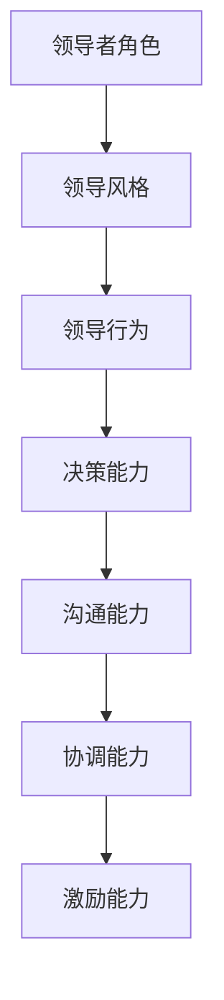
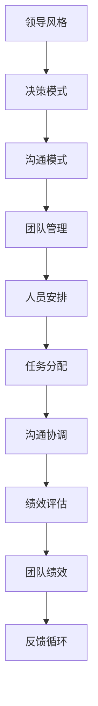
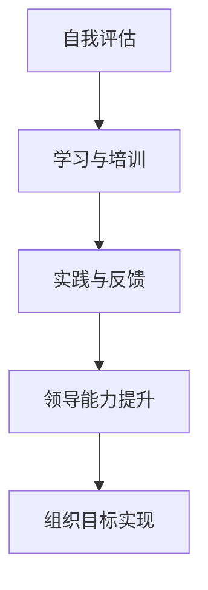
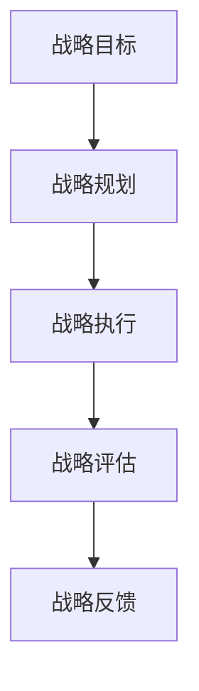
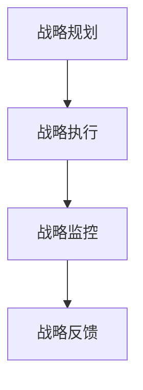
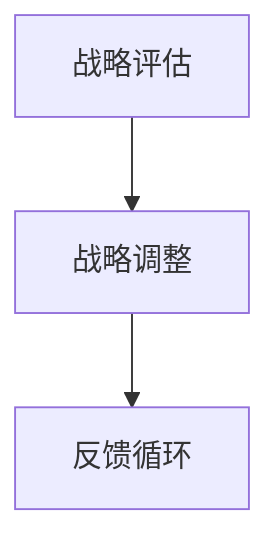
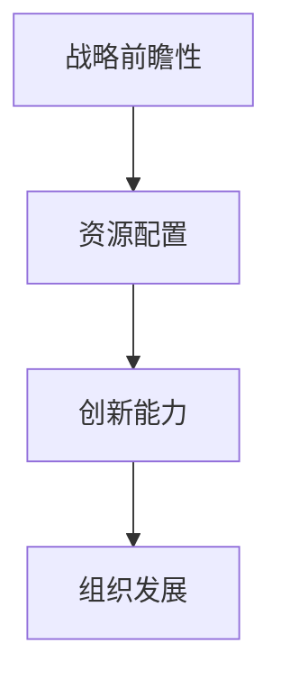
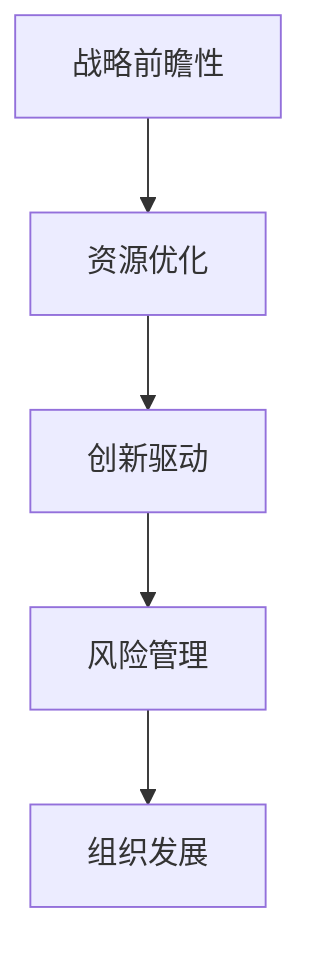

                 

# 《领导力与战略思维：培养长远眼光的方法》

## 引言

领导力和战略思维是现代企业和组织中不可或缺的核心要素。随着全球化和信息化的发展，企业面临的竞争环境日益复杂多变，领导者的角色不再仅仅是执行指令，而是需要具备前瞻性的战略眼光和卓越的领导能力。《领导力与战略思维：培养长远眼光的方法》这本书旨在为读者提供一套系统的理论框架和实践指南，帮助领导者更好地理解并运用领导力和战略思维，培养长远眼光。

### 关键词

- **领导力**
- **战略思维**
- **长远眼光**
- **领导风格**
- **团队管理**
- **战略规划**
- **战略执行**
- **战略评估**

### 摘要

本书分为三个主要部分：领导力、战略思维和长远眼光。第一部分详细阐述了领导力的核心概念、领导风格、团队管理和领导力发展，以及成功领导者的特质。第二部分介绍了战略思维的概述、战略规划与执行以及战略评估与调整的方法。第三部分探讨了培养长远眼光的重要性、长远眼光在领导力与战略思维中的应用，以及如何培养长远眼光。通过实际案例分析和详细讲解，本书为读者提供了一个全方位的理解和实战指南。

## 第一部分：领导力

### 第1章：领导力的核心概念与原则

领导力是领导者引导、激励和影响他人实现目标的能力。领导力不仅关乎领导者的个人素质，还涉及领导力原则的实践。以下是领导力的核心概念与原则：

### 背景介绍

领导力的概念最早可以追溯到19世纪末20世纪初，随着工业革命的兴起，领导者在组织中的角色逐渐凸显。随着时代的变迁，领导力的定义也在不断演进。现代领导力强调领导者的个性、情境和关系三个维度。

### 核心概念与联系

领导力的核心概念包括：

1. **领导者角色**：领导者是团队的核心，需要具备决策能力、沟通能力、协调能力和激励能力。
2. **领导风格**：领导风格是领导者处理事务的方式，包括民主式、专制式、参与式等。
3. **领导行为**：领导行为是领导者实际的行为表现，包括指导、支持、参与等。

以下是领导力核心概念的Mermaid流程图：



### 核心算法原理讲解

领导力的核心算法原理包括：

1. **情境领导模型**：该模型认为领导风格应根据下属的成熟度进行调整。成熟度包括能力水平和工作动机。
2. **领导影响力模型**：该模型认为领导影响力来源于权力基础和关系基础。

以下是领导影响力的伪代码：

```python
def 领导影响力（领导者，下属）：
    权力基础 = 领导者的影响力来源
    关系基础 = 领导者与下属的关系质量
    影响力 = 权力基础 * 关系基础
    return 影响力
```

### 数学模型和公式

领导力的数学模型可以表示为：

$$
领导力 = f(领导者角色，领导风格，领导行为)
$$

### 详细讲解与举例说明

**案例**：一个团队面临项目延迟的风险，领导者决定采用情境领导模型，根据团队成员的成熟度调整领导风格。对于成熟度较高的团队成员，领导者采用授权式领导风格，给予他们更多的自主权；对于成熟度较低的团队成员，领导者采用指导式领导风格，提供具体的指导和支持。

### 项目实战

在领导力实践中，一个成功的领导项目需要考虑以下几个方面：

1. **项目目标**：明确项目的目标和期望成果。
2. **团队成员**：了解团队成员的能力和成熟度。
3. **领导风格**：根据团队成员的成熟度调整领导风格。
4. **沟通与协调**：确保团队成员之间的有效沟通和协调。
5. **激励与反馈**：提供及时的激励和反馈，帮助团队成员保持动力和进步。

**示例**：在一个软件开发项目中，领导者根据团队成员的成熟度，采用不同的领导风格。对于技术熟练的团队成员，领导者给予更多的自主权，鼓励他们提出创新的想法；对于技术较弱的团队成员，领导者提供具体的指导和支持，帮助他们克服困难。

### 最佳实践 Tips

1. **了解团队成员**：领导者需要了解团队成员的能力和成熟度，以便调整领导风格。
2. **建立信任关系**：领导者需要与团队成员建立信任关系，以提高领导力的影响力。
3. **持续学习与改进**：领导者需要不断学习和改进，以适应不断变化的环境。

### 小结

领导力的核心概念与原则是领导者成功的关键。通过了解领导力的核心概念、领导风格和领导行为，领导者可以更好地引导和激励团队，实现组织的目标。

## 第2章：领导风格与团队管理

### 背景介绍

领导风格是指领导者处理事务的方式，包括与团队成员互动、决策和沟通的特定模式。不同的领导风格适用于不同的情境和团队。团队管理是领导者确保团队高效运作的过程，包括人员安排、任务分配、沟通协调和绩效评估等。

### 核心概念与联系

领导风格和团队管理的关系可以从以下几个方面来理解：

1. **领导风格影响团队管理**：领导者的风格直接影响团队的管理方式。例如，民主式领导风格鼓励团队成员参与决策，而专制式领导风格则由领导者做出决策。
2. **团队管理优化领导风格**：团队管理的有效实施可以反过来影响领导风格。通过了解团队成员的反馈和需求，领导者可以调整自己的风格，提高团队绩效。

以下是领导风格与团队管理关系的Mermaid流程图：



### 核心算法原理讲解

领导风格的分类包括：

1. **民主式领导风格**：领导者鼓励团队成员参与决策，提高团队的参与感和责任感。
2. **专制式领导风格**：领导者独自做出决策，团队成员负责执行。
3. **参与式领导风格**：领导者与团队成员共同参与决策，注重团队合作。

以下是领导风格的伪代码：

```python
def 领导风格（领导者，团队成员）：
    如果 领导者更倾向于民主式：
        风格 = "民主式"
    否则 如果 领导者更倾向于专制式：
        风格 = "专制式"
    否则：
        风格 = "参与式"
    return 风格
```

### 数学模型和公式

领导风格的数学模型可以表示为：

$$
领导风格 = f(领导者的个性，团队的需求)
$$

### 详细讲解与举例说明

**案例**：在一个创业公司中，领导者倾向于采用参与式领导风格，因为团队成员都是富有创造力的专业人士。领导者鼓励团队成员提出创意，共同讨论并制定项目计划。这种领导风格提高了团队的参与感和创造力，促进了公司的快速发展。

### 项目实战

在团队管理中，一个成功的管理项目需要考虑以下几个方面：

1. **项目目标**：明确项目的目标和期望成果。
2. **团队成员**：了解团队成员的能力和特点。
3. **领导风格**：根据团队成员的需求和项目目标调整领导风格。
4. **沟通与协调**：确保团队成员之间的有效沟通和协调。
5. **绩效评估**：定期评估团队成员的绩效，并提供反馈。

**示例**：在一个软件开发项目中，领导者根据团队成员的技术水平和项目需求，采用不同的领导风格。对于技术熟练的团队成员，领导者采用授权式领导风格，鼓励他们独立完成任务；对于技术较弱的团队成员，领导者采用指导式领导风格，提供具体的指导和支持。

### 最佳实践 Tips

1. **灵活调整领导风格**：领导者应根据团队成员的需求和项目目标，灵活调整领导风格。
2. **建立有效的沟通机制**：领导者需要建立有效的沟通机制，确保团队成员之间的信息流通。
3. **关注团队成员的发展**：领导者应关注团队成员的个人发展，提供培训和指导。

### 小结

领导风格与团队管理是领导者成功的关键要素。通过理解领导风格的分类和团队管理的方法，领导者可以更好地适应不同的情境，提高团队绩效。

## 第3章：领导力发展

### 背景介绍

领导力发展是指领导者通过学习和实践，不断提高自己的领导能力和素质的过程。随着组织环境和团队需求的变化，领导力发展成为一个长期而持续的过程。有效的领导力发展有助于领导者更好地应对挑战，实现组织目标。

### 核心概念与联系

领导力发展包括以下几个方面：

1. **自我评估**：领导者需要定期评估自己的领导能力和行为，识别自己的优势和劣势。
2. **学习与培训**：领导者需要不断学习和参加培训，更新自己的知识和技能。
3. **实践与反馈**：领导者需要通过实际工作和反馈，不断改进自己的领导能力。

以下是领导力发展核心概念的Mermaid流程图：



### 核心算法原理讲解

领导力发展的核心算法原理可以表示为：

$$
领导力发展 = f(自我评估，学习与培训，实践与反馈)
$$

### 数学模型和公式

领导力发展的数学模型可以表示为：

$$
领导力发展 = f(领导能力，知识储备，实践经验)
$$

### 详细讲解与举例说明

**案例**：一个公司的高级管理人员决定进行领导力发展。首先，他们进行了自我评估，识别了在沟通能力和团队管理方面的不足。然后，他们参加了领导力培训课程，学习了最新的领导理论和管理技巧。最后，他们在实际工作中运用所学知识，通过实践和反馈不断提高自己的领导能力。

### 项目实战

在领导力发展中，一个成功的项目需要考虑以下几个方面：

1. **领导力发展计划**：明确领导力发展的目标和步骤。
2. **自我评估**：领导者定期进行自我评估，识别自己的优势和劣势。
3. **学习与培训**：领导者参加培训和研讨会，学习新的知识和技能。
4. **实践与反馈**：领导者通过实际工作，不断实践和反思，提高领导能力。
5. **导师制度**：领导者可以寻找导师，从导师的经验中获得指导和反馈。

**示例**：在一个公司的领导力发展项目中，高级管理人员定期进行自我评估，识别自己的沟通能力不足。他们参加了沟通技巧培训课程，并在实际工作中积极应用所学知识。通过实践和反馈，他们的沟通能力得到了显著提高。

### 最佳实践 Tips

1. **定期自我评估**：领导者应定期进行自我评估，识别自己的优势和劣势。
2. **持续学习**：领导者应保持持续学习的态度，不断更新自己的知识和技能。
3. **实践与反馈**：领导者应通过实际工作和反馈，不断改进自己的领导能力。

### 小结

领导力发展是领导者成功的关键。通过自我评估、学习和实践，领导者可以不断提高自己的领导能力，实现组织的目标。

## 第二部分：战略思维

### 第4章：战略思维概述

战略思维是领导者制定和实施战略的核心能力，它涉及对组织内外部环境的深入分析、对未来的预见和规划。战略思维不仅是一种思维方式，更是一种行动指南，帮助组织在复杂多变的环境中保持竞争优势。

### 背景介绍

战略思维的概念最早可以追溯到20世纪，随着企业管理理论的不断发展，战略思维逐渐成为企业管理的重要组成部分。战略思维的重要性在于它能够帮助组织明确发展方向，优化资源配置，提高整体效能。

### 核心概念与联系

战略思维的核心概念包括：

1. **战略目标**：组织的发展方向和最终目标。
2. **战略规划**：为实现战略目标而制定的具体行动方案。
3. **战略执行**：战略规划的具体实施过程。
4. **战略评估**：对战略执行效果的评估和调整。

以下是战略思维核心概念的Mermaid流程图：



### 核心算法原理讲解

战略思维的核心算法原理可以表示为：

$$
战略思维 = f(环境分析，目标设定，资源分配，风险评估)
$$

### 数学模型和公式

战略思维的数学模型可以表示为：

$$
战略思维 = f(目标函数，约束条件，优化算法)
$$

### 详细讲解与举例说明

**案例**：一家公司面临市场竞争加剧和成本上升的挑战。首先，公司进行了外部环境分析，发现市场需求变化迅速，竞争对手也在积极创新。然后，公司设定了提高产品质量和降低成本的战略目标。接下来，公司进行了资源分配和风险评估，确保战略目标的实现。最后，公司通过战略执行，不断调整和优化战略方案，以应对市场变化。

### 项目实战

在战略思维实践中，一个成功的战略项目需要考虑以下几个方面：

1. **外部环境分析**：了解市场趋势、竞争对手和行业动态。
2. **内部能力分析**：评估组织的核心竞争力和资源状况。
3. **战略目标设定**：明确组织的发展方向和目标。
4. **资源分配与风险管理**：确保资源的高效利用和风险的可控性。
5. **战略执行与监控**：确保战略规划的有效实施和持续优化。

**示例**：一家制造业公司在面临原材料价格波动和市场变化时，采用了战略思维的方法。首先，公司进行了外部环境分析，发现原材料价格上涨和市场需求下降。然后，公司设定了提高产品质量和降低成本的战略目标。接下来，公司进行了资源分配和风险评估，确保战略目标的实现。最后，公司通过战略执行，不断调整和优化战略方案，以应对市场变化。

### 最佳实践 Tips

1. **全面分析**：在战略思维过程中，领导者应进行全面的环境分析和能力评估。
2. **明确目标**：领导者应明确组织的发展方向和目标，确保战略规划的有效性。
3. **灵活调整**：领导者应根据实际情况，灵活调整战略规划和执行方案。

### 小结

战略思维是领导者制定和实施战略的关键能力。通过理解战略思维的核心概念和算法原理，领导者可以更好地应对复杂多变的环境，实现组织的目标。

## 第5章：战略规划与执行

### 背景介绍

战略规划是组织制定长期发展方向和目标的流程，它涉及对内部和外部环境的分析、资源的优化配置以及目标的明确。战略执行是战略规划的具体实施过程，确保战略目标的实现。有效的战略规划和执行是组织成功的关键。

### 核心概念与联系

战略规划与执行的核心概念包括：

1. **战略规划**：制定组织的发展方向和目标，以及实现这些目标的策略和方法。
2. **战略执行**：将战略规划转化为具体行动，确保战略目标的实现。
3. **战略监控**：对战略执行过程进行监控和评估，确保战略目标的实现。

以下是战略规划与执行核心概念的Mermaid流程图：



### 核心算法原理讲解

战略规划与执行的核心算法原理可以表示为：

$$
战略规划与执行 = f(环境分析，目标设定，资源分配，风险评估)
$$

### 数学模型和公式

战略规划与执行的数学模型可以表示为：

$$
战略规划与执行 = f(目标函数，约束条件，优化算法)
$$

### 详细讲解与举例说明

**案例**：一家公司在进行战略规划和执行时，首先进行了外部环境分析，了解了市场需求、竞争态势和行业趋势。接着，公司明确了提升市场份额和产品创新的战略目标。然后，公司进行了资源分配和风险评估，确保战略目标的实现。在战略执行过程中，公司设立了具体的项目计划和时间表，并定期进行监控和评估，确保战略目标的实现。

### 项目实战

在战略规划和执行项目中，一个成功的项目需要考虑以下几个方面：

1. **外部环境分析**：了解市场趋势、竞争对手和行业动态。
2. **内部能力分析**：评估组织的核心竞争力和资源状况。
3. **战略目标设定**：明确组织的发展方向和目标。
4. **资源分配与风险管理**：确保资源的高效利用和风险的可控性。
5. **战略执行与监控**：确保战略规划的有效实施和持续优化。

**示例**：一家互联网公司在进行战略规划和执行时，首先进行了外部环境分析，了解了用户需求和市场变化。接着，公司明确了拓展海外市场和提升用户体验的战略目标。然后，公司进行了资源分配和风险评估，确保战略目标的实现。在战略执行过程中，公司设立了具体的市场拓展项目和用户体验优化项目，并定期进行监控和评估，确保战略目标的实现。

### 最佳实践 Tips

1. **全面分析**：在战略规划和执行过程中，领导者应进行全面的环境分析和能力评估。
2. **明确目标**：领导者应明确组织的发展方向和目标，确保战略规划的有效性。
3. **灵活调整**：领导者应根据实际情况，灵活调整战略规划和执行方案。

### 小结

战略规划和执行是组织成功的关键。通过理解战略规划与执行的核心概念和算法原理，领导者可以更好地制定和实施战略，实现组织的目标。

## 第6章：战略评估与调整

### 背景介绍

战略评估是对战略实施效果进行评估和反馈的过程，它有助于组织了解战略的执行情况，发现问题并进行调整。战略调整是在战略评估的基础上，根据实际情况对战略目标和执行方案进行调整的过程。有效的战略评估与调整能够确保组织在动态变化的环境中保持竞争优势。

### 核心概念与联系

战略评估与调整的核心概念包括：

1. **战略评估**：对战略执行效果进行评估，包括目标实现程度、资源配置效率等。
2. **战略调整**：根据战略评估结果，对战略目标和执行方案进行调整。
3. **反馈循环**：通过战略评估和调整，形成一个持续优化的反馈循环。

以下是战略评估与调整核心概念的Mermaid流程图：



### 核心算法原理讲解

战略评估与调整的核心算法原理可以表示为：

$$
战略评估与调整 = f(目标评估，资源评估，调整方案)
$$

### 数学模型和公式

战略评估与调整的数学模型可以表示为：

$$
战略评估与调整 = f(目标函数，约束条件，优化算法)
$$

### 详细讲解与举例说明

**案例**：一家公司对其三年的战略规划进行了评估，发现市场变化和内部资源分配存在偏差。首先，公司对市场变化进行了分析，发现竞争对手推出了更具竞争力的产品，导致公司市场份额下降。接着，公司对内部资源进行了评估，发现研发投入不足，创新能力不足。基于这些评估结果，公司决定调整战略，增加研发投入，推出更具竞争力的产品。

### 项目实战

在战略评估与调整项目中，一个成功的项目需要考虑以下几个方面：

1. **定期评估**：定期对战略执行效果进行评估，包括目标实现程度和资源配置效率。
2. **问题识别**：识别战略执行中的问题和挑战。
3. **调整方案**：根据评估结果和问题，制定调整方案。
4. **执行与监控**：确保调整方案的有效实施和持续优化。

**示例**：一家零售公司在进行战略评估与调整时，首先对其市场份额、客户满意度等关键指标进行了评估。发现市场份额下降，客户满意度下降。接着，公司对内部运营流程进行了分析，发现物流效率低下，客户服务不足。基于这些评估结果，公司决定调整战略，优化物流体系，提升客户服务水平。

### 最佳实践 Tips

1. **定期评估**：领导者应定期对战略执行效果进行评估，确保及时发现问题。
2. **灵活调整**：领导者应根据实际情况，灵活调整战略目标和执行方案。
3. **持续优化**：通过反馈循环，持续优化战略规划和执行。

### 小结

战略评估与调整是确保组织战略目标实现的关键。通过理解战略评估与调整的核心概念和算法原理，领导者可以更好地评估战略执行效果，发现问题并进行调整，实现组织的目标。

## 第三部分：长远眼光

### 第7章：培养长远眼光的重要性

长远眼光是指领导者能够超越短期利益，关注长期发展和可持续性的能力。在快速变化的商业环境中，长远眼光成为领导者成功的关键因素。培养长远眼光的重要性体现在以下几个方面：

### 背景介绍

随着全球化、信息化和市场竞争的加剧，企业面临的环境变得更加复杂多变。传统的短期经营策略已经难以适应这种变化，领导者需要具备长远眼光，以应对不确定性和挑战。

### 核心概念与联系

长远眼光的核心概念包括：

1. **战略前瞻性**：领导者能够预见未来趋势和机遇，制定长远的发展战略。
2. **资源配置**：领导者能够合理配置资源，确保长期目标的实现。
3. **创新能力**：领导者能够推动组织持续创新，保持竞争优势。

以下是长远眼光核心概念的Mermaid流程图：



### 核心算法原理讲解

培养长远眼光的核心算法原理可以表示为：

$$
长远眼光 = f(战略前瞻性，资源配置，创新能力)
$$

### 数学模型和公式

长远眼光的数学模型可以表示为：

$$
长远眼光 = f(目标函数，约束条件，优化算法)
$$

### 详细讲解与举例说明

**案例**：一家公司在面临市场变化和竞争压力时，领导者通过战略前瞻性，预见到新的市场需求和技术趋势。他们决定调整资源配置，增加研发投入，开发新产品，以满足市场需求。同时，领导者推动组织持续创新，不断优化产品和服务，保持竞争优势。

### 项目实战

在培养长远眼光的实践中，一个成功的项目需要考虑以下几个方面：

1. **战略前瞻性**：领导者需要具备战略前瞻性，预见未来趋势和机遇。
2. **资源配置**：领导者需要合理配置资源，确保长期目标的实现。
3. **创新能力**：领导者需要推动组织持续创新，保持竞争优势。
4. **持续优化**：通过反馈循环，持续优化战略和资源配置。

**示例**：一家科技公司通过战略前瞻性，预见到人工智能技术的发展趋势。他们决定调整资源配置，增加人工智能研发团队，开发人工智能产品。同时，公司推动组织持续创新，不断优化人工智能技术，保持竞争优势。

### 最佳实践 Tips

1. **持续学习**：领导者需要不断学习新知识，提升战略前瞻性。
2. **资源优化**：领导者需要合理配置资源，确保长期目标的实现。
3. **创新驱动**：领导者需要推动组织持续创新，保持竞争优势。

### 小结

培养长远眼光是领导者成功的关键。通过理解长远眼光的核心概念和算法原理，领导者可以更好地预见未来趋势，优化资源配置，推动组织持续创新，实现长期发展。

## 第8章：长远眼光在领导力与战略思维中的应用

长远眼光在领导力和战略思维中的应用至关重要，它能够帮助领导者更好地把握发展机遇，应对挑战，实现组织目标。在这一章中，我们将探讨长远眼光在领导力和战略思维中的具体应用，以及如何通过培养长远眼光来提升领导力和战略思维能力。

### 背景介绍

随着全球化进程的加速，市场竞争日益激烈，企业面临的环境变得更加复杂和不确定。在这种背景下，领导者需要具备长远眼光，不仅能够应对当前的挑战，还要能够预见未来可能出现的机遇和威胁。长远眼光在领导力和战略思维中的应用，有助于组织在长期内保持竞争优势。

### 核心概念与联系

长远眼光在领导力与战略思维中的应用包括以下几个方面：

1. **战略前瞻性**：领导者通过长远眼光，预见未来发展趋势，制定适应未来的发展战略。
2. **资源优化**：领导者利用长远眼光，合理配置资源，确保长期目标的实现。
3. **创新驱动**：领导者通过长远眼光，推动组织持续创新，保持竞争优势。
4. **风险管理**：领导者通过长远眼光，识别潜在风险，制定应对策略。

以下是长远眼光在领导力和战略思维中的应用关系的Mermaid流程图：



### 核心算法原理讲解

长远眼光在领导力和战略思维中的应用核心算法原理可以表示为：

$$
长远眼光应用 = f(战略前瞻性，资源优化，创新驱动，风险管理)
$$

### 数学模型和公式

长远眼光在领导力和战略思维中的应用数学模型可以表示为：

$$
长远眼光应用 = f(目标函数，约束条件，优化算法)
$$

### 详细讲解与举例说明

**案例**：一家科技公司在面临技术变革和市场竞争时，领导者通过战略前瞻性，预见到人工智能和大数据技术的发展趋势。他们决定调整资源分配，增加在人工智能和大数据领域的投资，推动技术创新。同时，领导者通过创新驱动，不断优化产品和服务，满足市场需求。通过风险管理，领导者识别出潜在的市场和技术风险，并制定了相应的应对策略。

### 项目实战

在长远眼光的领导力和战略思维应用实践中，一个成功的项目需要考虑以下几个方面：

1. **战略前瞻性**：领导者需要具备战略前瞻性，预见未来发展趋势，制定适应未来的发展战略。
2. **资源优化**：领导者需要合理配置资源，确保长期目标的实现。
3. **创新驱动**：领导者需要推动组织持续创新，保持竞争优势。
4. **风险管理**：领导者需要识别潜在风险，制定应对策略。

**示例**：一家互联网公司在进行战略规划和资源优化时，通过战略前瞻性，预见到移动互联网和社交电商的发展趋势。他们决定调整资源分配，增加在移动互联网和社交电商领域的投资，推动技术创新。同时，公司通过创新驱动，不断优化用户体验和营销策略，满足市场需求。通过风险管理，公司识别出潜在的市场和技术风险，并制定了相应的应对策略。

### 最佳实践 Tips

1. **持续学习**：领导者需要不断学习新知识，提升战略前瞻性。
2. **资源优化**：领导者需要合理配置资源，确保长期目标的实现。
3. **创新驱动**：领导者需要推动组织持续创新，保持竞争优势。
4. **风险管理**：领导者需要识别潜在风险，制定应对策略。

### 小结

长远眼光在领导力和战略思维中的应用，有助于领导者更好地把握发展机遇，应对挑战，实现组织目标。通过理解长远眼光的核心概念和算法原理，领导者可以提升自己的战略思维和领导能力，推动组织实现长期发展。

## 实战案例

为了更好地理解领导力与战略思维在实践中的应用，我们将通过两个实际案例进行深入分析。

### 案例一：亚马逊的领导力与战略思维

亚马逊的创始人杰夫·贝索斯是一位杰出的领导者，他在公司的成长过程中展现出了卓越的领导力和战略思维。以下是对亚马逊领导力与战略思维应用的案例分析：

#### 背景介绍

亚马逊成立于1994年，最初是一家在线书店。随着互联网的发展，亚马逊逐步扩展业务范围，涵盖了电子产品、家居用品、云计算等多个领域。贝索斯作为公司领导者，始终保持着远见卓识和卓越的战略思维。

#### 领导力应用

1. **愿景领导**：贝索斯制定了清晰的愿景，即“成为地球上最以顾客为中心的公司”。这一愿景激发了员工的热情和使命感，推动了公司的快速发展。
2. **战略思维**：贝索斯注重长期投资和持续创新，他通过战略思维，预见到了云计算、智能家居等未来趋势，并率先布局这些领域。

#### 战略思维应用

1. **成本领先战略**：亚马逊通过规模效应和科技创新，实现了成本领先，为消费者提供了更具竞争力的价格。
2. **差异化战略**：亚马逊通过推出Kindle电子书、AWS云计算等差异化产品，满足了消费者的多样化需求。

#### 结果分析

通过领导力和战略思维的结合，亚马逊实现了从一家在线书店到全球电商巨头的华丽转型。公司的市值不断攀升，成为全球最有价值的公司之一。

### 案例二：谷歌的战略思维与长远眼光

谷歌作为全球领先的科技企业，其成功离不开卓越的战略思维和长远眼光。以下是对谷歌战略思维与长远眼光应用的案例分析：

#### 背景介绍

谷歌成立于1998年，由拉里·佩奇和谢尔盖·布林共同创立。最初，谷歌只是一个基于网页搜索技术的初创公司。随着时间的推移，谷歌通过战略思维和长远眼光，逐步扩展业务，成为全球科技巨头。

#### 战略思维应用

1. **创新驱动**：谷歌一直强调技术创新，通过研发搜索引擎、自动驾驶汽车、人工智能等产品，保持了竞争优势。
2. **多元化战略**：谷歌通过多元化战略，拓展了广告业务、云计算、硬件设备等多元化业务，实现了收入的多元化。

#### 长远眼光应用

1. **长期投资**：谷歌通过长期投资，如投资可再生能源、医疗技术等领域，为未来业务增长奠定了基础。
2. **人才战略**：谷歌重视人才培养和引进，通过独特的招聘机制和培训体系，吸引了全球顶尖人才。

#### 结果分析

通过卓越的战略思维和长远眼光，谷歌在竞争激烈的科技行业中脱颖而出，成为全球最有价值的公司之一。公司的业务覆盖了搜索、广告、云计算、硬件设备等多个领域，为消费者提供了丰富的产品和服务。

### 结论

通过亚马逊和谷歌的案例，我们可以看到领导力和战略思维在实践中的重要性。卓越的领导力有助于激发员工的热情和创造力，而卓越的战略思维和长远眼光则能帮助企业把握发展机遇，应对挑战，实现长期发展。这些案例为我们提供了宝贵的经验和启示，值得我们在实际工作中借鉴和应用。

## 附录

### 附录 A：领导力与战略思维工具与资源

1. **领导力评估工具**：包括领导力问卷、360度评估等，用于评估领导者的能力和行为。
2. **战略规划工具**：包括SWOT分析、PEST分析等，用于分析外部环境和内部能力。
3. **战略执行工具**：包括项目管理工具、关键绩效指标（KPI）等，用于确保战略规划的有效实施。
4. **战略评估工具**：包括平衡计分卡、战略地图等，用于评估战略执行效果。
5. **在线资源**：包括领导力与战略思维的书籍、论文、案例研究等，提供丰富的学习资源。

### 附录 B：战略规划与执行案例研究

1. **战略规划案例**：分析某公司如何通过SWOT分析和PEST分析制定战略规划。
2. **战略执行案例**：分析某公司如何通过项目管理工具和KPI确保战略规划的有效实施。
3. **战略评估案例**：分析某公司如何通过平衡计分卡和战略地图评估战略执行效果。

### 拓展阅读

1. **《领导力与新科学》**：作者史蒂芬·罗宾斯，探讨领导力与现代科学的关系。
2. **《战略思维》**：作者迈克尔·波特，介绍战略思维的基本原理和策略。
3. **《企业战略管理》**：作者肯尼斯·安德鲁斯，详细阐述企业战略规划与执行的方法。

## 作者信息

作者：AI天才研究院/AI Genius Institute & 禅与计算机程序设计艺术 /Zen And The Art of Computer Programming

## 小结

领导力和战略思维是企业成功的关键。通过培养长远眼光，领导者可以更好地把握发展机遇，应对挑战，实现组织目标。本书通过系统的理论框架和实践指南，帮助读者深入理解领导力和战略思维，提升自身的领导能力。希望本书能对您的职业生涯和个人成长带来启示和帮助。愿您在领导力和战略思维的领域中不断探索，取得更大的成就。

---

## 关键词

- 领导力
- 战略思维
- 长远眼光
- 领导风格
- 团队管理
- 战略规划
- 战略执行
- 战略评估
- 成功领导者
- 创新能力
- 风险管理
- 持续学习
- 拓展阅读

## 摘要

《领导力与战略思维：培养长远眼光的方法》是一本系统性的领导力与战略思维指南。本书首先介绍了领导力的核心概念与原则，探讨了领导风格与团队管理的方法，并详细阐述了领导力的发展过程。随后，本书深入分析了战略思维的概述、战略规划与执行、以及战略评估与调整的方法。最后，本书探讨了培养长远眼光的重要性，并阐述了长远眼光在领导力与战略思维中的应用。通过实际案例分析和详细讲解，本书为读者提供了一个全方位的理解和实战指南。

