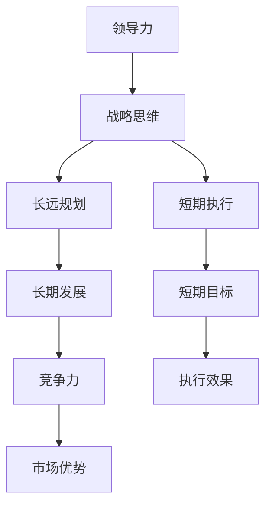

                 

### 引言

领导力和战略思维在当今快速变化和高度竞争的商业环境中变得越来越重要。有效的领导力能够激发团队的潜力，推动组织的成功；而战略思维则是确保企业在长期竞争中保持优势的关键。本文将深入探讨领导力与战略思维的关系，阐述长远规划和短期执行在领导过程中的重要性，并通过案例分析和最佳实践来提供实用的指导。

#### 关键词

- 领导力
- 战略思维
- 长远规划
- 短期执行
- 案例分析
- 最佳实践

#### 摘要

本文首先介绍领导力与战略思维的基本概念和重要性。接着，通过一个Mermaid流程图展示核心概念之间的关系。然后，本文详细探讨长远规划与短期执行的策略，包括其定义、重要性及实施方法。随后，通过一个具体的企业案例，展示这些策略在实际中的应用。最后，总结本文的主要观点，并提供一些实用的最佳实践和拓展阅读建议。

# 领导力与战略思维：长远规划与短期执行

> 关键词：领导力、战略思维、长远规划、短期执行、案例分析

> 摘要：本文探讨了领导力与战略思维在组织中的重要性，并详细阐述了长远规划和短期执行的核心概念及其在领导力实践中的应用。通过案例分析和最佳实践，为企业管理者提供了实用的指导。

## 引言

在当今快速变化的商业环境中，领导者需要具备强大的领导力和战略思维，以应对各种挑战和机遇。领导力不仅关乎个人的能力，更涉及到如何有效地激励和引导团队，实现组织的目标。而战略思维则是对企业长远发展的规划和布局，确保组织在竞争中保持优势。

### 1. 领导力

领导力是一种影响力，它不仅仅是关于职位和权威，更重要的是关于影响他人共同实现目标的能力。领导力的核心概念包括：

- **定义**：领导力是指通过激励、引导和影响他人来实现共同目标的能力。
- **领导风格与影响力**：领导风格可以分为权威式、民主式、参与式等，每种风格都有其独特的优势和适用场景。

### 2. 战略思维

战略思维是企业领导者进行决策和规划的重要工具。它涉及到：

- **定义**：战略思维是关于制定长期目标和实现这些目标的方法和策略的思维方式。
- **战略规划**：战略规划是制定长期目标和为实现这些目标制定详细计划的过程。

### 3. 长远规划

长远规划是企业战略思维的重要组成部分，它关注企业长期的发展和竞争力的提升。长远规划包括：

- **重要性**：确保企业在长期竞争中保持优势。
- **挑战与应对**：识别并应对企业发展过程中可能遇到的各种挑战。

### 4. 短期执行

短期执行是实现长远规划的重要步骤，它涉及到：

- **重要性**：短期执行是实现长远规划的具体行动。
- **关键要素**：目标设定、时间管理、资源分配等。

### 核心概念关系架构

下面是一个Mermaid流程图，展示领导力、战略思维、长远规划和短期执行之间的关系：

## 领导力基础

领导力是组织成功的关键因素。一个优秀的领导者不仅能够激发团队的潜力，还能够为组织创造价值。下面，我们将深入探讨领导力的核心概念和发展路径。

### 1. 领导力的核心概念

领导力的核心概念包括以下几个方面：

- **定义**：领导力是一种影响力，通过激励、引导和影响他人来实现共同目标的能力。
- **领导风格与影响力**：领导风格可以分为权威式、民主式、参与式等，每种风格都有其独特的优势和适用场景。

### 2. 领导力发展

领导力不是与生俱来的，而是可以通过学习和实践不断发展的。领导力的发展路径包括：

- **自我认知**：领导者需要首先了解自己的优势和劣势，从而更好地发挥自己的潜力。
- **持续学习**：领导者需要不断学习新的知识和技能，以适应快速变化的商业环境。
- **实践与反思**：通过实践和反思，领导者可以不断改进自己的领导方式，提高领导效果。

### 1.1.1 领导力的定义

领导力是一种影响力，它涉及到个人如何激励、引导和影响他人，以实现共同的目标。领导力不仅仅是职位和权威的象征，更重要的是一种能力，这种能力能够使领导者在面对复杂和不确定的环境时，做出正确的决策和采取有效的行动。

#### 定义

领导力可以定义为：在特定的情境中，通过激励、引导和影响他人，共同实现目标的能力。这种能力不仅包括对个人行为的指导，还涉及到团队协作和组织管理。

### 1.1.2 领导风格与影响力

领导风格是指领导者处理和管理团队的方式。不同的领导风格有不同的优势和适用场景。以下是几种常见的领导风格：

- **权威式领导**：领导者做出决策，并为团队成员提供明确的指导和期望。
- **民主式领导**：领导者鼓励团队成员参与决策过程，并尊重团队成员的意见和建议。
- **参与式领导**：领导者与团队成员建立合作关系，共同制定目标和行动计划。

#### 领导风格与影响力

每种领导风格都有其独特的优势和影响力。权威式领导能够在短时间内做出决策，确保团队的效率。民主式领导能够激发团队成员的创造力和参与感，提高团队的整体绩效。参与式领导则能够建立团队合作和信任，促进组织的长期发展。

### 1.2 领导力发展

领导力不是与生俱来的，而是可以通过学习和实践不断发展的。一个成功的领导者需要不断地自我提升，以适应不断变化的环境。以下是领导力发展的几个关键步骤：

#### 1.2.1 自我认知

自我认知是领导力发展的第一步。领导者需要深入了解自己的优势、劣势、价值观和动机。通过自我认知，领导者可以更好地理解自己的行为模式，从而改进自己的领导方式。

#### 1.2.2 持续学习

持续学习是领导力发展的重要途径。领导者需要不断学习新的知识和技能，以适应快速变化的商业环境。这包括学习新的管理理念、技术知识以及行业趋势。

#### 1.2.3 实践与反思

实践与反思是领导力发展的重要环节。领导者需要在实际工作中不断尝试新的方法，并从中学习。通过反思，领导者可以评估自己的行为和决策，找到改进的空间。

## 战略思维框架

战略思维是企业领导者进行决策和规划的重要工具。它不仅关系到企业的短期目标，更关注企业的长远发展和竞争力的提升。在本章节中，我们将详细探讨战略思维的定义、战略规划的过程以及常用的战略规划工具与方法。

### 2.1 战略思维概述

战略思维是企业领导者在面对复杂和不确定的商业环境时，进行决策和规划的一种思维方式。它涉及到对企业的内外部环境进行深入分析，识别机会和威胁，并制定相应的战略和计划。

#### 2.1.1 战略思维的定义

战略思维可以定义为：一种基于对市场、竞争对手和内部资源的分析，制定长期目标和实现这些目标的方法和策略的思维方式。战略思维不仅仅是一种计划，更是一种持续的过程，它要求领导者时刻关注企业所处的环境变化，并做出相应的调整。

#### 2.1.2 战略思维与决策

战略思维与决策密切相关。有效的战略思维能够帮助领导者做出正确的决策，从而确保企业在竞争中获得优势。战略思维涉及到以下几个方面：

- **市场分析**：了解市场需求、竞争对手和行业趋势，为企业的发展提供方向。
- **资源评估**：评估企业的内部资源，包括人力资源、财务资源和技术资源，以便制定合理的战略计划。
- **风险评估**：识别企业面临的潜在风险，并制定相应的应对措施，确保战略目标的实现。
- **目标设定**：根据市场分析和资源评估，设定企业的长期目标和短期目标，为决策提供依据。

### 2.2 战略规划

战略规划是企业为实现长期目标和提升竞争力而制定的具体行动方案。一个有效的战略规划需要明确企业的目标、资源配置、行动计划和时间表。以下是战略规划的过程和常用的方法：

#### 2.2.1 战略规划的过程

战略规划的过程可以分为以下几个步骤：

- **市场分析**：了解市场需求、竞争对手和行业趋势，为企业的战略方向提供依据。
- **资源评估**：评估企业的内部资源，包括人力资源、财务资源和技术资源，以便制定合理的战略计划。
- **目标设定**：根据市场分析和资源评估，设定企业的长期目标和短期目标，为决策提供依据。
- **战略选择**：根据目标设定，选择最适合企业的战略方案，包括产品策略、市场策略、运营策略等。
- **行动计划**：制定具体的行动计划，包括任务的分配、资源的配置、时间表等，确保战略规划的有效实施。
- **评估与调整**：在战略规划实施过程中，定期评估战略目标是否达成，并根据实际情况进行调整，以确保战略规划的持续有效性。

#### 2.2.2 战略规划工具与方法

在战略规划过程中，常用的工具和方法包括：

- **SWOT分析**：SWOT分析是一种常用的战略规划工具，它通过分析企业的优势（Strengths）、劣势（Weaknesses）、机会（Opportunities）和威胁（Threats），帮助领导者制定有效的战略计划。
- **五力模型**：五力模型是另一种常用的战略规划工具，它通过分析行业的竞争强度、供应商的议价能力、客户的议价能力、替代品的威胁和行业的新进入者的威胁，帮助领导者了解行业的竞争环境，制定相应的战略。
- **目标设定**：目标设定是战略规划的核心，它要求领导者明确企业的长期目标和短期目标，并将其具体化，以便在战略规划过程中有明确的方向。
- **关键绩效指标（KPI）**：关键绩效指标是衡量战略规划实施效果的重要工具，它通过设定具体的绩效指标，帮助领导者评估战略目标的实现情况。

## 长远规划

长远规划是企业战略思维的重要组成部分，它关系到企业的长期发展和竞争力的提升。在本章节中，我们将深入探讨长远规划的重要性、制定方法以及实际应用。

### 3.1 长远规划的重要性

长远规划对于企业的发展至关重要。它不仅能够帮助企业在复杂和不确定的商业环境中找到明确的发展方向，还能够为企业的未来发展提供战略指导。以下是长远规划的重要性：

- **指导企业发展方向**：长远规划能够帮助企业明确长期目标和发展方向，确保企业的所有决策和行动都围绕这些目标进行。
- **提升企业竞争力**：通过长远规划，企业可以更好地了解自身的优势和劣势，从而制定有效的战略和计划，提升企业的竞争力。
- **应对市场变化**：长远规划能够帮助企业提前预见市场变化，制定相应的应对措施，降低市场波动对企业的影响。
- **资源优化配置**：长远规划有助于企业合理配置资源，确保资源的使用效率和最大化企业的价值。

### 3.2 长远规划的挑战与应对

在制定长远规划的过程中，企业可能会面临一些挑战。以下是几个常见的挑战以及应对策略：

- **不确定性**：商业环境变化迅速，企业难以准确预测未来的市场情况。应对策略包括建立灵活的规划机制，及时调整规划内容。
- **资源有限**：企业在资源有限的情况下制定长远规划，可能需要更加关注资源的合理分配和利用。应对策略包括优化资源配置，提高资源使用效率。
- **内部协作**：长远规划的制定需要企业内部各部门的协作和支持。应对策略包括建立有效的沟通和协作机制，确保规划过程的顺利进行。

### 3.3 长远规划的方法

制定长远规划的方法多种多样，以下是一些常用的方法：

- **SWOT分析**：通过分析企业的优势、劣势、机会和威胁，帮助企业制定符合实际的长远规划。
- **五力模型**：通过分析行业的竞争强度、供应商的议价能力、客户的议价能力、替代品的威胁和行业的新进入者的威胁，帮助企业了解行业环境，制定相应的战略。
- **愿景和使命**：明确企业的愿景和使命，确保长远规划与企业的核心价值观和发展方向保持一致。
- **关键绩效指标（KPI）**：设定具体的绩效指标，衡量长远规划的实施效果，确保规划目标的实现。

### 3.4 长远规划的实际应用

以下是一个企业长远规划的实际案例：

**企业背景**：

某企业是一家从事电子商务的公司，市场环境竞争激烈，行业变化迅速。为了在未来的市场竞争中占据有利位置，该企业决定制定一份长远规划。

**规划目标**：

- 提升用户体验，增加用户黏性。
- 拓展新的市场领域，增加收入来源。
- 提高运营效率，降低成本。

**实施策略**：

- **用户体验提升**：通过用户调研和数据分析，了解用户需求和偏好，优化产品功能和界面设计，提升用户体验。
- **市场拓展**：在现有市场基础上，拓展海外市场，增加新的收入来源。
- **运营效率提升**：引入新的管理工具和技术，优化运营流程，提高效率。

**行动计划**：

- **用户体验提升**：每月进行一次用户调研，收集用户反馈，根据反馈优化产品功能。
- **市场拓展**：每年举办一次海外市场拓展会议，与潜在合作伙伴进行洽谈，签订合作协议。
- **运营效率提升**：每季度进行一次运营流程优化，引入新的管理工具和技术。

**评估与调整**：

- **用户体验提升**：通过用户满意度调查，评估用户体验提升的效果，根据评估结果调整优化策略。
- **市场拓展**：通过销售额和市场份额数据，评估市场拓展的效果，根据评估结果调整市场策略。
- **运营效率提升**：通过运营效率指标，评估运营流程优化的效果，根据评估结果调整优化策略。

通过以上案例，我们可以看到，长远规划对于企业的发展具有重要意义。只有通过科学的规划方法和实际的应用，企业才能在激烈的竞争中脱颖而出，实现可持续发展。

## 短期执行

短期执行是实现长远规划的关键步骤，它涉及到如何将战略目标转化为具体的行动计划，并确保这些行动的有效实施。在本章节中，我们将详细探讨短期执行的重要性、关键要素以及实施方法。

### 4.1 短期执行的重要性

短期执行是企业战略规划得以实现的基础。它不仅关系到企业当前的发展，还影响到长远规划的实施效果。以下是短期执行的重要性：

- **确保战略目标实现**：短期执行是将长远规划中的战略目标转化为具体行动的过程，只有通过有效的短期执行，才能确保战略目标的实现。
- **提高运营效率**：短期执行有助于企业优化运营流程，提高资源使用效率，从而降低成本，提高企业的竞争力。
- **快速响应市场变化**：短期执行能够帮助企业快速调整战略和行动，应对市场变化，降低市场波动对企业的影响。
- **培养团队执行力**：通过短期执行，企业能够培养团队的执行力和协作能力，为长远发展奠定基础。

### 4.2 短期执行的关键要素

短期执行的成功取决于多个关键要素，以下是几个关键要素：

- **目标设定**：明确的目标是短期执行的基础，它为行动提供了清晰的方向。目标设定需要具体、可衡量、可实现。
- **资源分配**：合理分配资源是短期执行的重要保障。企业需要根据目标的要求，合理配置人力资源、财务资源和物资资源。
- **时间管理**：时间是有限的资源，合理的时间管理能够确保行动的按时完成。企业需要制定详细的时间表，并严格遵守。
- **风险管理**：在短期执行过程中，企业需要识别和应对各种风险，以确保行动的顺利进行。

### 4.3 短期执行的方法

以下是几种常用的短期执行方法：

- **目标分解法**：将长远规划中的战略目标分解为具体的短期目标，并为每个目标制定详细的行动计划。
- **关键路径法**：识别并优先处理关键任务，确保关键任务按时完成，从而保证整个短期执行计划的成功。
- **项目管理法**：使用项目管理工具和方法，对短期执行过程中的各项任务进行有效的计划、监控和调整。
- **团队合作法**：鼓励团队协作，发挥团队成员的潜力，共同完成短期执行任务。

### 4.4 短期执行的实际案例

以下是一个企业短期执行的实际案例：

**企业背景**：

某企业是一家从事智能制造的公司，为了实现长远规划中的目标，决定制定一份短期执行计划。

**短期执行目标**：

- 提升生产效率，减少生产成本。
- 加强市场推广，提高产品知名度。
- 建立客户关系管理体系，提高客户满意度。

**实施策略**：

- **生产效率提升**：通过引入新的生产线和技术，优化生产流程，提高生产效率。
- **市场推广**：通过线上线下相结合的方式，加大市场推广力度，提高产品知名度。
- **客户关系管理**：建立客户关系管理体系，定期与客户沟通，了解客户需求，提供个性化的服务。

**行动计划**：

- **生产效率提升**：在3个月内完成新生产线和技术的引入，优化生产流程。
- **市场推广**：在6个月内完成市场推广计划，提高产品知名度。
- **客户关系管理**：在9个月内建立客户关系管理体系，提高客户满意度。

**评估与调整**：

- **生产效率提升**：通过生产效率指标，评估生产效率提升的效果，根据评估结果调整优化策略。
- **市场推广**：通过市场推广效果数据，评估市场推广效果，根据评估结果调整市场策略。
- **客户关系管理**：通过客户满意度调查，评估客户关系管理效果，根据评估结果调整优化策略。

通过以上案例，我们可以看到，短期执行在实现企业长远规划中的重要作用。只有通过科学的策略和有效的实施，企业才能在激烈的市场竞争中取得优势，实现可持续发展。

## 领导力实践

领导力实践是将理论转化为实际行动的过程，它关系到领导力是否能够在组织中真正发挥作用。在本章节中，我们将探讨领导力实践的重要性、实践方法以及如何通过建立信任和激励团队来提升领导效果。

### 5.1 领导力实践概述

领导力实践是指领导者将领导理论应用于实际工作场景，通过具体行动来影响和引导团队，实现组织目标的过程。领导力实践的重要性体现在以下几个方面：

- **提高领导效果**：通过实践，领导者能够检验和改进自己的领导方法，提高领导效果。
- **增强团队凝聚力**：领导力实践能够增强团队成员之间的信任和合作，提高团队的凝聚力。
- **推动组织变革**：领导力实践有助于推动组织内部的变革和创新，提高组织的适应能力和竞争力。

### 5.2 领导力实践方法

以下是几种常用的领导力实践方法：

- **角色扮演**：通过角色扮演，领导者能够更深刻地理解不同角色的需求和期望，提高领导效果。
- **情景模拟**：通过情景模拟，领导者能够在模拟的环境中进行实践，检验和改进自己的领导方法。
- **行动学习**：通过行动学习，领导者将理论应用于实际工作中，通过实践来解决问题，提高领导能力。
- **反思与反馈**：通过反思和反馈，领导者能够评估自己的领导行为，识别改进的机会，提高领导效果。

### 5.3 建立信任

建立信任是领导力实践的核心，它关系到领导者的领导效果和团队的协作效率。以下是建立信任的几个关键步骤：

- **诚实与透明**：领导者需要保持诚实和透明，公开分享信息，减少误解和猜疑。
- **尊重与认可**：领导者需要尊重团队成员，认可他们的贡献和价值，增强团队凝聚力。
- **共同目标**：领导者需要与团队成员共同设定目标，确保团队成员明确自己的职责和期望。

### 5.4 激励团队

激励团队是领导力实践的重要任务，它关系到团队的士气和工作效率。以下是几种常用的激励方法：

- **目标激励**：设定明确的目标，激发团队成员的斗志和积极性。
- **奖励激励**：通过奖励机制，激励团队成员的积极性和创造力。
- **情感激励**：关注团队成员的情感需求，提供关怀和支持，增强团队的凝聚力。

### 5.5 实际案例

以下是一个企业领导力实践的实际案例：

**企业背景**：

某企业是一家从事高科技产品研发的公司，由于市场竞争激烈，企业决定通过领导力实践来提升团队的整体表现。

**领导力实践目标**：

- 增强团队的凝聚力。
- 提高团队的工作效率。
- 促进企业的创新和发展。

**实践策略**：

- **角色扮演**：领导团队进行角色扮演，模拟不同的工作场景，提升领导者的情境意识和应对能力。
- **情景模拟**：通过情景模拟，团队成员能够提前预知可能遇到的问题，并制定相应的应对策略。
- **行动学习**：鼓励团队成员将领导力理论应用于实际工作中，通过实践来解决问题，提高领导能力。
- **反思与反馈**：定期组织团队成员进行反思和反馈，评估领导效果，并根据反馈进行调整。

**实施步骤**：

- **角色扮演**：在每月的团队会议上，领导团队进行角色扮演，模拟客户沟通、项目讨论等场景，提升团队成员的情境意识和应对能力。
- **情景模拟**：每季度组织一次情景模拟，让团队成员在实际操作中检验和改进自己的领导方法。
- **行动学习**：鼓励团队成员在工作中运用领导力理论，通过实践来解决问题，提高领导能力。
- **反思与反馈**：每半年进行一次领导力评估，团队成员相互反馈，评估领导效果，并根据反馈进行调整。

**评估与调整**：

- **团队凝聚力**：通过团队建设活动和员工满意度调查，评估团队的凝聚力，并根据评估结果进行调整。
- **工作效率**：通过工作量和质量指标，评估团队的工作效率，并根据评估结果进行调整。
- **创新与发展**：通过新产品开发和市场表现，评估企业的创新和发展能力，并根据评估结果进行调整。

通过以上案例，我们可以看到，领导力实践对于提升团队整体表现具有重要意义。只有通过科学的策略和有效的实施，企业才能在激烈的市场竞争中脱颖而出，实现可持续发展。

## 案例分析

案例分析是理解领导力和战略思维在真实环境中应用的重要方法。通过深入分析成功的案例，我们可以提炼出关键策略和最佳实践，为其他企业提供参考。以下是一个关于企业长远规划与短期执行的案例分析。

### 6.1 案例分析概述

我们选择了一家全球知名的科技公司——谷歌（Google）作为案例分析的对象。谷歌以其创新的企业文化和高效的领导力而闻名，其在长远规划和短期执行方面的成功经验值得我们深入探讨。

### 6.2 案例分析实例

**谷歌的长远规划**

1. **愿景和使命**：谷歌的愿景是“组织全球信息，使人人皆可访问并从中受益”。这一愿景明确指导了谷歌的战略方向。
   
2. **战略选择**：谷歌通过持续投资于前沿技术，如人工智能、云计算和机器学习，保持其在技术领域的领先地位。同时，谷歌通过多元化的产品和服务（如搜索引擎、广告技术、云计算、硬件等）来扩展其市场影响力。

**谷歌的短期执行**

1. **目标设定**：谷歌每年设定明确的短期目标，如提升广告收益、扩大市场份额、提升用户体验等。这些目标具有具体、可衡量、可实现的特点。

2. **资源分配**：谷歌通过高效的资源管理，将资金和人力投入到高优先级的领域。例如，谷歌在人工智能领域的投资远远超过了其他公司，这使得其在人工智能技术上取得了显著的优势。

3. **时间管理**：谷歌采用敏捷开发方法，以快速迭代和灵活调整的方式推进项目。这种方法确保了谷歌能够迅速响应市场变化，并保持产品的竞争力。

4. **风险管理**：谷歌建立了完善的风险管理机制，通过多样化的投资和持续的创新来降低单一业务风险。

### 6.3 案例分析和详细讲解

**长远规划的关键点**

- **明确的愿景和使命**：谷歌的愿景和使命为其长远规划提供了清晰的方向，使所有决策和行动都围绕这一目标进行。
- **多元化战略**：通过多元化战略，谷歌不仅能够保持其在搜索引擎市场的领先地位，还能够通过新的产品和业务领域来降低市场风险。

**短期执行的关键点**

- **具体的目标设定**：谷歌每年设定明确的短期目标，这些目标与公司的长远规划紧密相连，确保公司的每一步行动都朝着正确的方向前进。
- **高效的资源管理**：通过高效的资源管理，谷歌能够将有限的资源投入到最有价值的领域，从而最大化公司的价值。
- **敏捷开发**：敏捷开发方法使得谷歌能够快速迭代和调整项目，确保公司始终能够应对市场变化。
- **风险管理**：通过多样化的投资和持续的创新，谷歌能够有效降低单一业务风险，确保公司的长期稳定发展。

### 6.4 案例小结

谷歌的成功在于其清晰的愿景和使命、多元化的战略选择、具体的目标设定、高效的资源管理、敏捷的开发方法以及完善的风险管理。这些关键点为我们提供了宝贵的经验和启示，帮助我们在实际工作中更好地应用领导力和战略思维。

### 6.5 拓展阅读

- **《谷歌如何工作》（How Google Works）**：作者艾伦·艾肯布拉姆和吉姆·克拉维克详细介绍了谷歌的企业文化和管理实践。
- **《敏捷开发实践指南》（Agile Project Management: Creating Innovative Products）**：作者杰里·威斯曼和杰夫·萨瑟兰介绍了敏捷开发的方法和应用。

通过这些拓展阅读，读者可以更深入地了解谷歌的成功之道，并将其应用于自己的组织中。

## 结论与展望

领导力和战略思维在组织管理中扮演着至关重要的角色。有效的领导力能够激发团队的潜力，推动组织的成功；而战略思维则能够帮助企业应对复杂和不确定的商业环境，确保长远发展。本文通过详细探讨长远规划和短期执行的核心概念、实施方法以及实际案例，为企业管理者提供了实用的指导。

### 7.1 本书主要内容总结

本文的主要内容可以总结为以下几点：

- 领导力与战略思维的基本概念及其重要性。
- 领导力发展路径、核心概念和领导风格。
- 战略思维框架、战略规划过程和常用方法。
- 长远规划的重要性、挑战与应对、制定方法。
- 短期执行的关键要素、实施方法和实际案例。
- 领导力实践的重要性、方法和实际案例。
- 案例分析中的成功经验和最佳实践。

### 7.2 领导力与战略思维的未来发展趋势

随着全球化、数字化和人工智能等技术的快速发展，领导力与战略思维也将面临新的挑战和机遇。以下是未来发展的几个趋势：

- **领导力个性化**：随着员工个性化需求的增加，领导者需要更加关注个体的需求和动机，采用更加灵活的领导风格。
- **战略思维的敏捷性**：面对快速变化的市场环境，企业需要更加敏捷的战略思维，能够快速响应市场变化。
- **数字化转型**：数字化技术将深刻改变企业的运营模式和管理方式，战略思维需要更加关注数字化转型带来的机会和挑战。
- **全球化视野**：全球化将使企业面临更加复杂和多变的商业环境，领导者需要具备全球视野，能够适应不同文化和市场的需求。

### 7.3 企业管理者应如何应对未来的挑战

为了应对未来的挑战，企业管理者应采取以下策略：

- **持续学习和创新**：不断学习新知识、新技能，鼓励创新思维，保持企业的竞争力。
- **灵活应变**：建立敏捷的战略思维，能够快速调整和适应市场变化。
- **关注员工需求**：关注员工的个性化需求，提高员工的满意度和忠诚度。
- **数字化转型**：积极拥抱数字化技术，提升企业的运营效率和创新能力。
- **全球化布局**：拓展国际市场，建立全球化的运营和合作网络。

通过以上策略，企业管理者可以更好地应对未来的挑战，推动企业的可持续发展。

作者：AI天才研究院/AI Genius Institute & 禅与计算机程序设计艺术 /Zen And The Art of Computer Programming

