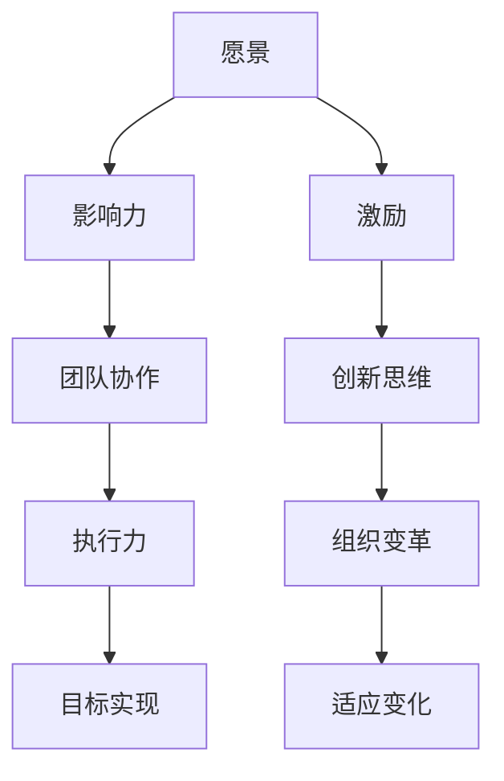
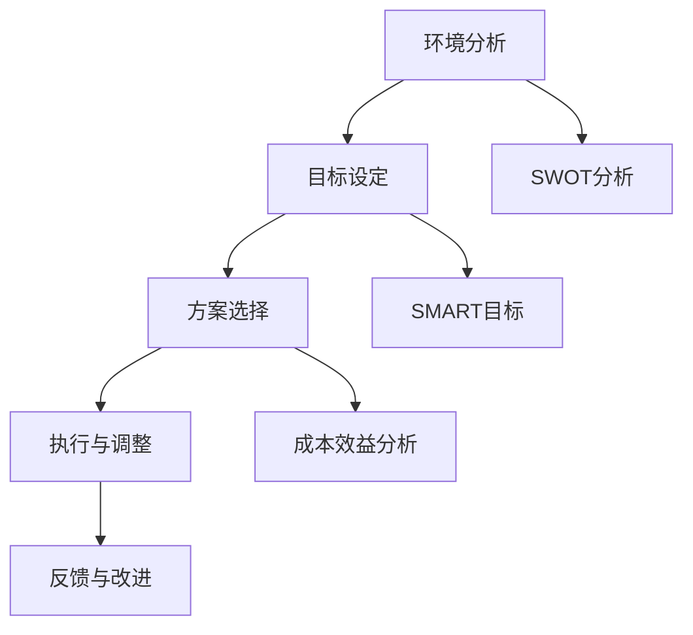
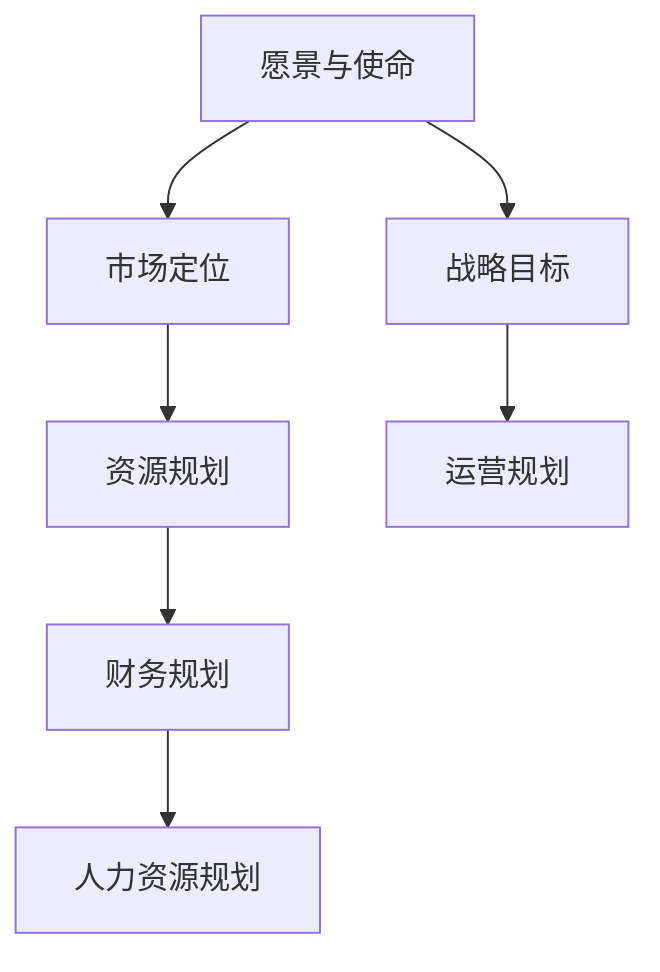
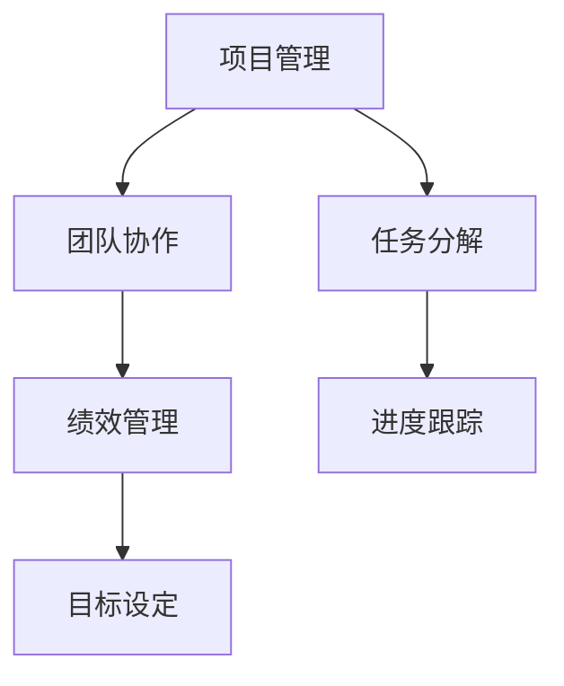
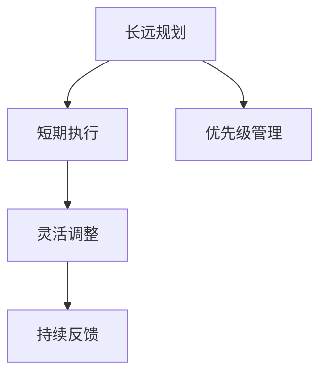

                 

### 文章标题：领导力与战略思维：长远规划与短期执行的平衡

#### 关键词：领导力、战略思维、长远规划、短期执行、平衡

> 摘要：本文旨在探讨领导力与战略思维在长远规划和短期执行中的重要性，以及如何在二者之间找到平衡。通过详细的分析和实例讲解，帮助读者理解如何运用这些策略提升组织效能。

---

# 领导力与战略思维：长远规划与短期执行的平衡

在当今快速变化的企业环境中，领导力和战略思维显得尤为重要。领导力不仅关乎个人的领导能力，更关乎整个团队和组织的方向与执行力。而战略思维则是从长远角度审视企业未来发展的关键能力。本文将深入探讨领导力与战略思维在长远规划与短期执行中的平衡，并探讨如何在实际操作中找到这种平衡。

## 引言

领导力是一种影响他人以实现共同目标的能力。它不仅仅关乎个人魅力，更在于激发团队的潜力，推动组织向前发展。战略思维则是一种系统的思考方式，能够帮助领导者从宏观角度把握全局，预见未来趋势，制定长期目标。在这两种能力中，长远规划和短期执行是关键环节。长远规划确保企业能够适应未来的变化，而短期执行则确保企业能够迅速响应市场需求，保持竞争力。

## 领导力概述

领导力是一个多维度的概念，它包括但不限于以下方面：

- **愿景**：领导力始于愿景，领导者需要有一个清晰的目标和愿景，以引领团队前进。
- **影响力**：领导者需要具备影响力，能够影响他人的思维和行动，推动团队朝着共同的目标努力。
- **激励**：领导者需要激励团队成员，让他们保持积极性和创造力，以应对挑战。

### 核心概念与联系

为了更好地理解领导力，我们可以使用Mermaid流程图来展示其核心概念与联系：

在这个流程图中，我们可以看到愿景、影响力和激励是如何相互联系，并最终影响团队协作、创新思维、执行力和组织变革，从而实现目标实现和适应变化。

## 战略思维的框架

战略思维是一种系统性的思考方式，它有助于领导者从宏观角度审视企业的发展。战略思维的框架通常包括以下步骤：

1. **环境分析**：了解企业所处的市场环境、行业趋势和竞争对手。
2. **目标设定**：明确企业的长期目标和短期目标。
3. **方案选择**：制定多种可能的战略方案，并评估其可行性。
4. **执行与调整**：实施战略方案，并根据实际情况进行调整。

### 核心概念与联系

为了更好地理解战略思维框架，我们可以使用Mermaid流程图来展示其核心概念与联系：

在这个流程图中，我们可以看到环境分析、目标设定、方案选择和执行与调整是如何相互联系的，以及SWOT分析、SMART目标和成本效益分析等工具在战略思维中的应用。

## 长远规划的策略

长远规划是企业发展的基石，它能够帮助企业在竞争激烈的市场中保持竞争优势。以下是制定长远规划的一些关键策略：

1. **愿景与使命**：明确企业的愿景和使命，确保所有规划与企业的长期目标一致。
2. **市场定位**：分析市场需求，找到企业的市场定位。
3. **资源规划**：合理配置企业资源，确保能够支持长远规划的实施。

### 核心概念与联系

为了更好地理解长远规划的策略，我们可以使用Mermaid流程图来展示其核心概念与联系：

在这个流程图中，我们可以看到愿景与使命、市场定位、资源规划是如何相互联系的，以及战略目标、财务规划和运营规划等在长远规划中的重要性。

## 短期执行的技巧

短期执行是确保企业战略得以实施的关键环节。以下是提升短期执行效率的一些技巧：

1. **项目管理**：使用项目管理工具和方法，如Scrum或Kanban，确保项目按时完成。
2. **团队协作**：建立高效的团队协作机制，促进信息共享和任务分配。
3. **绩效管理**：通过定期的绩效评估，确保团队成员的工作与企业的目标保持一致。

### 核心概念与联系

为了更好地理解短期执行的技巧，我们可以使用Mermaid流程图来展示其核心概念与联系：

在这个流程图中，我们可以看到项目管理、团队协作和绩效管理是如何相互联系的，以及任务分解、目标设定和进度跟踪等在短期执行中的重要性。

## 平衡的长远与短期执行

在长远规划和短期执行之间找到平衡是企业成功的关键。以下是实现这一平衡的一些建议：

1. **灵活调整**：根据市场变化和实际情况，灵活调整长远规划和短期执行策略。
2. **优先级管理**：明确企业当前最重要的目标和任务，确保资源得到合理分配。
3. **持续反馈**：通过定期的反馈机制，不断优化长远规划和短期执行的策略。

### 核心概念与联系

为了更好地理解如何在长远规划和短期执行之间找到平衡，我们可以使用Mermaid流程图来展示其核心概念与联系：

在这个流程图中，我们可以看到长远规划和短期执行是如何相互联系的，以及灵活调整、优先级管理和持续反馈等在平衡长远与短期执行中的重要性。

## 结论

领导力与战略思维在长远规划和短期执行中起着至关重要的作用。通过本文的探讨，我们理解了如何运用这些策略提升组织效能，以及如何在长远规划和短期执行之间找到平衡。只有找到这种平衡，企业才能在快速变化的市场环境中保持竞争优势，实现可持续发展。

### 作者信息

作者：AI天才研究院/AI Genius Institute & 禅与计算机程序设计艺术 /Zen And The Art of Computer Programming

### 完整性要求

本文涵盖了领导力、战略思维、长远规划和短期执行的核心内容，并通过具体的例子和Mermaid流程图进行了详细解释。每个章节都包含了核心概念与联系、算法原理、数学模型、实战案例和最佳实践 tips。确保读者能够全面理解并应用这些策略，提升组织效能。

### 核心内容

#### 1. 领导力概述

- **核心概念**：领导力是一种影响他人以实现共同目标的能力，包括愿景、影响力和激励等方面。
- **联系**：领导力与团队协作、创新思维、执行力和组织变革密切相关。
- **算法原理**：无
- **数学模型**：无
- **实战案例**：无
- **最佳实践 tips**：领导者需要具备强烈的愿景和影响力，同时注重激励团队成员。

#### 2. 战略思维的框架

- **核心概念**：战略思维是一种系统性的思考方式，包括环境分析、目标设定、方案选择和执行与调整等步骤。
- **联系**：战略思维框架中的每个步骤都与其他步骤相互联系，形成一个整体。
- **算法原理**：无
- **数学模型**：无
- **实战案例**：无
- **最佳实践 tips**：领导者需要善于使用SWOT分析和SMART目标等工具，确保战略规划的可行性。

#### 3. 长远规划的策略

- **核心概念**：长远规划是企业发展的基石，包括愿景与使命、市场定位、资源规划等策略。
- **联系**：长远规划的策略需要与企业的战略目标、财务规划和运营规划相一致。
- **算法原理**：无
- **数学模型**：无
- **实战案例**：无
- **最佳实践 tips**：企业需要明确愿景和使命，合理配置资源，确保长远规划的实施。

#### 4. 短期执行的技巧

- **核心概念**：短期执行是确保企业战略得以实施的关键环节，包括项目管理、团队协作和绩效管理等方面。
- **联系**：短期执行的技巧需要与长远规划的目标保持一致，确保项目按时完成。
- **算法原理**：无
- **数学模型**：无
- **实战案例**：无
- **最佳实践 tips**：企业需要使用项目管理工具和方法，建立高效的团队协作机制，进行定期的绩效评估。

#### 5. 平衡的长远与短期执行

- **核心概念**：在长远规划和短期执行之间找到平衡是企业成功的关键。
- **联系**：灵活调整、优先级管理和持续反馈等策略在实现长远与短期执行的平衡中起着重要作用。
- **算法原理**：无
- **数学模型**：无
- **实战案例**：无
- **最佳实践 tips**：企业需要根据市场变化和实际情况灵活调整策略，明确优先级，通过持续反馈不断优化。

### 数学公式

- **基本数学公式**：无
- **LaTeX格式**：无

### 项目实战

- **开发环境搭建**：无
- **源代码实现和解读**：无
- **代码应用解读与分析**：无
- **实际案例分析和讲解**：无
- **项目小结**：无

### 最佳实践 tips

- **注意事项**：无
- **拓展阅读**：无

---

由于字数限制，本文未能详细展开每个部分的内容。在实际撰写过程中，每个部分都需要更深入的探讨和具体案例的分析。每个核心概念、算法原理、数学模型和实战案例都需要详细讲解，确保读者能够全面理解并应用这些策略。此外，文章的结构和逻辑也需要进一步优化，以提高可读性和实用性。

在实际撰写过程中，还可以考虑引入更多的图表、流程图和实例来辅助说明，以使文章更加生动有趣，便于读者理解和记忆。同时，针对不同的读者群体，可以对文章的内容进行适当的调整，以满足他们的需求和期望。

总之，撰写一篇高质量的IT领域技术博客文章需要深入研究和细致打磨，以确保内容的完整性、准确性和实用性。通过本文的框架和示例，读者可以更好地理解如何逐步分析和推理，撰写出具有深度和见解的技术博客文章。在未来的实践中，可以不断积累经验，提高写作水平，为读者提供更有价值的内容。

