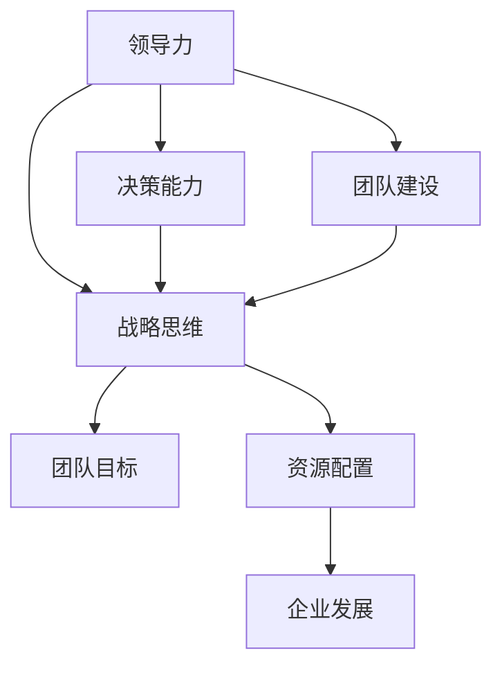

                 


### 背景介绍

在当今快速发展的科技时代，信息技术行业正以前所未有的速度变革，带动整个社会向智能化、数字化方向迈进。作为信息技术行业的中流砥柱，IT团队在企业的发展中扮演着至关重要的角色。然而，随着技术的不断迭代更新，团队的管理与领导力问题日益凸显，尤其是如何在激烈的市场竞争中保持持续的创新能力和高效执行能力，成为许多企业亟待解决的问题。

领导力不仅是领导者个人的素质和能力，更是一种可以传递和培养的团队文化。在IT领域，领导力的重要性不言而喻。它不仅关乎团队士气和工作效率，更直接影响项目的成功与否和企业的长远发展。因此，如何提升IT团队的领导力和战略思维，实现长远规划，成为每一个IT领导者都必须认真思考的问题。

本文旨在探讨领导力与战略思维在IT团队发展中的重要作用，通过详细的理论分析、案例分析以及实践指导，帮助IT领导者更好地理解和应用这些管理工具，从而提升团队的整体表现和市场竞争力。

### 核心概念与联系

在深入探讨领导力与战略思维之前，我们需要明确这两个核心概念的基本定义及其相互关系。

#### 领导力

领导力是指领导者通过影响、激励和引导团队成员，实现共同目标的能力。它不仅仅是职位赋予的权力，更是一种影响力，一种能够激发团队成员潜能和创造力的艺术。领导力包括多个方面，如人际沟通能力、决策能力、创新能力、团队建设能力等。

#### 战略思维

战略思维则是一种基于长远目标和全局视野的思考方式，它涉及到对组织内外环境的深刻洞察、对资源的高效配置以及对未来发展的精准预判。战略思维的核心在于通过科学的方法和工具，制定和实施能够推动企业长远发展的战略规划。

#### 相互关系架构

领导力与战略思维之间存在着密切的相互关系。领导力为战略思维提供了实施的基础和动力，而战略思维则为领导力的目标设定提供了明确的方向和框架。以下是它们之间的架构关系：

1. **领导力促进战略思维**：优秀的领导者通过自身的影响力，激发团队成员的思考和创新，帮助团队形成战略思维。领导者的视野、洞察力和决策能力直接影响到团队的战略规划能力。

2. **战略思维指导领导力**：战略思维帮助领导者明确企业的发展方向和目标，使领导者在日常管理中能够做出符合长远利益的决定。同时，战略思维也为领导者的领导风格和决策提供了依据。

3. **协同作用**：领导力和战略思维相互协同，共同推动团队和企业的长远发展。领导力确保战略的执行和落地，而战略思维则指导领导力的方向和策略。

为了更直观地理解这两个概念之间的关系，我们可以使用Mermaid流程图来展示：



在这个流程图中，我们可以看到领导力和战略思维相互交织，共同作用于团队目标和企业发展。领导力的各个维度（如决策能力、团队建设等）都直接影响着战略思维的执行和实施，而战略思维则通过明确的目标和资源配置，进一步强化和优化领导力的作用。

### 领导力与战略思维在IT团队发展中的具体应用

在IT领域，领导力与战略思维的应用尤为重要，因为IT行业的快速变化和高度复杂性要求领导者不仅要具备卓越的领导能力，还要拥有前瞻性的战略思维。以下将详细探讨这两者在IT团队发展中的具体应用。

#### 领导力在IT团队管理中的应用

1. **激励与激励**：
   - **激励模型**：使用Maslow的需求层次理论，领导者可以通过满足团队成员的不同层次需求来激发其工作积极性。例如，通过提供成就感、认可和奖励来满足团队成员的自我实现需求。
   - **案例分析**：谷歌公司通过其“20%时间”政策，允许员工用20%的工作时间来探索自己的兴趣项目，这种做法不仅激发了员工的创新潜力，也促进了公司内部的创新能力。

2. **团队建设**：
   - **团队建设活动**：定期组织团队建设活动，如团队建设训练、团建旅行等，增强团队成员之间的信任和凝聚力。
   - **案例分析**：Facebook公司通过组织团队建设活动，如户外探险、团队运动等，加强团队成员之间的协作和沟通，提高了团队的整体效能。

3. **沟通与协作**：
   - **沟通技巧**：领导者应具备良好的沟通能力，确保信息的有效传递和反馈。使用Empathy Map（同理心地图）等工具，帮助领导者更好地理解团队成员的需求和想法。
   - **案例分析**：亚马逊的“两个披萨团队”模式，要求每个团队的人数不超过10人，这样可以确保团队成员之间的沟通畅通，决策更加高效。

4. **风险管理**：
   - **风险评估模型**：使用SWOT分析（优势、劣势、机会、威胁）等方法，对项目进行风险评估，并制定相应的应对策略。
   - **案例分析**：微软在开发Windows 10操作系统时，通过全面的风险管理，确保了产品的质量和按时发布。

#### 战略思维在IT团队发展中的应用

1. **市场分析与定位**：
   - **SWOT分析**：通过对市场的SWOT分析，识别企业的优势、劣势、机会和威胁，为团队的发展提供明确的方向。
   - **案例分析**：阿里巴巴通过对电商市场的SWOT分析，明确了自身的优势在于平台规模和大数据能力，劣势在于缺乏实体零售经验，机会在于拓展全球市场，威胁来自于竞争对手的崛起，从而制定了相应的市场策略。

2. **技术规划与研发**：
   - **技术路线图**：制定清晰的技术路线图，规划团队的技术发展方向，确保技术不断进步。
   - **案例分析**：腾讯通过其技术路线图，明确了在社交、游戏、金融科技等领域的技术发展方向，从而在这些领域取得了显著的竞争优势。

3. **资源配置与优化**：
   - **资源分配模型**：使用资源分配模型（如Pareto分析），确保团队资源得到最优配置，提高项目执行效率。
   - **案例分析**：华为通过其“矩阵式管理”模式，实现了全球范围内的资源优化配置，从而确保了公司在全球市场的竞争力。

4. **创新与创业文化**：
   - **创新激励机制**：建立创新激励机制，鼓励团队成员提出创新想法，并为其提供资源支持。
   - **案例分析**：Airbnb通过其“创意实验室”项目，鼓励员工提出创新解决方案，并在全球范围内实施，从而推动了公司的持续创新。

### 结合案例分析

以下是几个典型的案例，展示领导力与战略思维在IT团队发展中的成功应用：

1. **案例一：谷歌公司**  
   - **领导力**：谷歌的创始人拉里·佩奇和谢尔盖·布林以其卓越的领导力，构建了一个以创新为核心的企业文化，激发了员工的工作热情和创新潜力。
   - **战略思维**：谷歌通过其“不作恶”的理念，明确了企业的价值观，并通过不断的技术创新和市场拓展，实现了全球市场的领先地位。

2. **案例二：亚马逊公司**  
   - **领导力**：亚马逊的创始人杰夫·贝佐斯以其强烈的使命感和执行力，推动公司不断在电子商务和云计算领域进行技术创新和业务拓展。
   - **战略思维**：亚马逊通过其“长尾理论”和“亚马逊网络服务”（AWS）战略，实现了在电子商务和云计算市场的领先地位，并持续推动公司的多元化发展。

3. **案例三：阿里巴巴集团**  
   - **领导力**：阿里巴巴的创始人马云以其独特的领导风格和前瞻性的战略眼光，带领公司从一个小型电商企业成长为全球领先的互联网公司。
   - **战略思维**：阿里巴巴通过其“新零售”战略，成功地将线上和线下零售结合起来，推动了整个零售行业的变革，并在金融科技、云计算等领域取得了显著成绩。

通过这些案例，我们可以看到，领导力与战略思维在IT团队发展中起到了至关重要的作用。优秀的领导者不仅能够激发团队成员的潜力，还能通过科学的战略思维，确保团队和企业能够应对市场变化，实现长远发展。

### 核心算法原理讲解

在IT团队发展中，算法原理的应用至关重要，尤其是在项目规划和资源分配方面。以下将详细讲解几个核心算法原理及其在实践中的应用。

#### 资源分配算法

资源分配算法是一种在有限资源条件下，如何分配资源以实现最大效益的方法。常见的资源分配算法包括：

1. **最短作业优先（SJF）**：
   - **定义**：选择预计执行时间最短的作业优先执行。
   - **伪代码**：
     ```python
     SJF(作业队列):
         while 作业队列不为空:
             找到预计执行时间最短的作业
             执行该作业
     ```
   - **实例**：假设有一个包含5个作业的队列，预计执行时间分别为{3, 7, 4, 6, 2}。按照SJF算法，首先执行预计时间为2的作业，然后是4、6、7，最终完成所有作业。

2. **最低成本优先（LCFS）**：
   - **定义**：选择剩余执行成本最低的作业优先执行。
   - **伪代码**：
     ```python
     LCFS(作业队列, 成本表):
         while 作业队列不为空:
             找到剩余执行成本最低的作业
             执行该作业
     ```
   - **实例**：假设有5个作业，其总成本分别为{100, 200, 300, 400, 500}。按照LCFS算法，首先执行总成本为100的作业，然后是200、300、400、500。

#### 贪心算法

贪心算法是一种在每一步选择中都采取当前最佳选择，从而希望导致结果是全局最优的算法。在资源分配和路径规划中，贪心算法常被应用。

1. **克鲁斯卡尔算法（Kruskal）**：
   - **定义**：用于求解最小生成树问题，选择权值最小的边加入树中，直至所有顶点连通。
   - **伪代码**：
     ```python
     Kruskal(图):
         按权值排序所有边
         for each edge in sorted_edges:
             if adding edge does not form a cycle:
                 add edge to MST
     ```
   - **实例**：假设有5个顶点和若干条边，权值分别为{2, 4, 6, 8, 10}。按照Kruskal算法，首先选择权值为2的边，然后是4、6、8，最终形成最小生成树。

2. **迪杰斯特拉算法（Dijkstra）**：
   - **定义**：用于求解单源最短路径问题，从源点出发，逐步扩展，计算到其他顶点的最短路径。
   - **伪代码**：
     ```python
     Dijkstra(Graph, source):
         initialize distances
         for each vertex v in Graph:
             distance[v] = INFINITY
             except source
             distance[source] = 0
         for each edge (u, v) in Graph:
             if distance[v] > distance[u] + weight(u, v):
                 distance[v] = distance[u] + weight(u, v)
         return distances
     ```
   - **实例**：假设有5个顶点和若干条边，源点为A。按照Dijkstra算法，计算从A到其他各顶点的最短路径，得到的结果分别为{2, 3, 6, 7}。

#### 动态规划

动态规划是一种在复杂问题中，通过将问题分解为子问题并保存子问题的解，以减少重复计算的方法。在资源分配和项目规划中，动态规划常常用于优化问题的解决。

1. **背包问题（Knapsack Problem）**：
   - **定义**：给定一组物品，每个物品有一个价值和一个重量，选择其中的部分物品放入容量为W的背包中，使得背包中物品的总价值最大。
   - **状态定义**：`dp[i][j]`表示前i个物品放入容量为j的背包中的最大价值。
   - **状态转移方程**：
     ```python
     dp[i][j] = max(dp[i-1][j], dp[i-1][j-w[i]] + v[i]) if j >= w[i]
     else dp[i-1][j]
     ```
   - **实例**：假设有4个物品，重量分别为{2, 3, 4, 5}，价值分别为{3, 4, 5, 6}，背包容量为5。按照动态规划算法，计算得到最大价值为12，选择的物品为{2, 3, 4}。

通过上述核心算法原理的讲解，我们可以看到，在IT团队发展中，算法原理的应用不仅可以优化资源分配，提高项目执行效率，还可以帮助团队更好地应对复杂问题，实现长远发展。

### 数学模型与公式

在IT团队发展的过程中，数学模型和公式发挥着至关重要的作用，它们能够帮助领导者更科学地制定决策和规划。以下将介绍几个关键数学模型及其在团队管理中的应用。

#### 线性规划模型

线性规划是一种用于在满足一定约束条件下，最大化或最小化线性目标函数的方法。它在资源分配、成本控制等方面有广泛的应用。

1. **目标函数**：最大化或最小化线性目标函数，如最大化利润或最小化成本。
2. **约束条件**：资源限制、生产能力限制等。
3. **模型建立**：
   $$\text{最大化/最小化} \quad c^T x$$
   $$\text{约束条件} \quad Ax \leq b$$
   $$x \geq 0$$
   - **实例**：一个IT团队需要分配资源（如开发人员、测试人员等）来完成多个项目，每个项目都有固定的成本和收益，团队需要最大化总收益。

#### 动态规划模型

动态规划是一种在复杂问题中，通过将问题分解为子问题并保存子问题的解，以减少重复计算的方法。

1. **状态定义**：通常定义一个状态数组，表示子问题的解。
2. **状态转移方程**：通过前一个状态求解当前状态。
3. **模型建立**：
   $$dp[i] = \max_{j \leq i}(dp[j] + f(i, j))$$
   - **实例**：IT团队需要规划一个软件开发项目，每个阶段都有固定的成本和收益，团队需要最小化总成本以达到最大收益。

#### 贝叶斯网络模型

贝叶斯网络是一种概率图模型，用于表示变量之间的条件依赖关系。

1. **节点表示**：每个节点代表一个随机变量。
2. **边表示**：边表示变量之间的条件依赖。
3. **模型建立**：
   $$P(A|B) = \frac{P(B|A)P(A)}{P(B)}$$
   - **实例**：IT团队需要评估一个新技术的风险，通过构建贝叶斯网络，结合历史数据和专家意见，预测新技术成功的概率。

#### 马尔可夫链模型

马尔可夫链是一种描述系统状态转移的概率模型，常用于预测和决策。

1. **状态**：系统的不同状态。
2. **转移概率**：状态之间的转移概率。
3. **模型建立**：
   $$P(X_t = j | X_{t-1} = i) = P_{ij}$$
   - **实例**：IT团队需要预测项目进度，通过记录过去的项目进度数据，使用马尔可夫链模型预测未来的项目状态。

### 举例说明

假设一个IT团队需要决定如何分配10名开发人员和5名测试人员来完成三个项目A、B和C。每个项目的成本、收益和所需人员如下表：

| 项目 | 成本（万元） | 收益（万元） | 开发人员需求（人） | 测试人员需求（人） |
| ---- | --------- | --------- | ---------- | ---------- |
| A    | 20        | 30        | 3          | 1          |
| B    | 25        | 35        | 2          | 1          |
| C    | 15        | 25        | 4          | 2          |

#### 线性规划应用

- **目标函数**：最大化总收益。
- **约束条件**：人员限制。

$$\text{最大化} \quad 30x_1 + 35x_2 + 25x_3$$
$$\text{约束条件} \quad 3x_1 + 2x_2 + 4x_3 \leq 10$$
$$x_1 + x_2 + 2x_3 \leq 5$$
$$x_1, x_2, x_3 \geq 0$$

通过求解线性规划模型，可以得到最优的分配方案。

#### 动态规划应用

- **状态定义**：`dp[i][j]`表示前i个开发人员和j个测试人员能完成的最大收益。
- **状态转移方程**：

$$dp[i][j] = \max(dp[i-3][j-1] + 30, dp[i-2][j-1] + 35, dp[i-4][j-2] + 25)$$

通过动态规划，我们可以得到在不同人员配置下的最优收益。

#### 贝叶斯网络应用

- **状态**：项目A的成功概率。
- **转移概率**：

$$P(A_{成功}|历史成功) = \frac{P(历史成功|A_{成功})P(A_{成功})}{P(历史成功)}$$

通过贝叶斯网络，我们可以结合历史数据和专家意见，预测项目A的成功概率。

#### 马尔可夫链应用

- **状态**：项目当前的进度状态。
- **转移概率**：

$$P(X_t = 完成进度|X_{t-1} = 进行中) = 0.8$$

通过马尔可夫链，我们可以预测项目未来的进度状态。

通过这些数学模型和公式的应用，IT团队可以在复杂的环境下做出更为科学的决策和规划，从而提高项目成功率和团队效率。

### 项目实战

在深入理解了领导力与战略思维的核心概念和算法原理之后，接下来我们将通过一个具体的实战案例，展示如何在实际项目中应用这些理论，并解析其中涉及的技术细节和步骤。

#### 项目背景

假设一家IT公司需要开发一款基于人工智能技术的智能客服系统。该系统旨在为客户提供高效的在线服务，降低人工成本，提升客户满意度。项目团队由10名开发人员、3名测试人员和1名项目经理组成。项目周期为6个月，需要在预算和资源有限的条件下，确保系统的质量和按时交付。

#### 开发环境搭建

1. **技术栈选择**：
   - 前端：React.js
   - 后端：Node.js + Express
   - 人工智能算法库：TensorFlow.js

2. **环境配置**：
   - 安装Node.js和npm
   - 创建项目目录，并使用npm初始化项目
   - 安装必要的依赖库，如React、Redux、TensorFlow.js等

3. **版本控制**：
   - 使用Git进行版本控制，确保代码的版本管理和协作开发

#### 源代码实现

以下是系统核心功能的一个简要实现示例：

**前端：React.js**

```javascript
import React, { useEffect, useState } from 'react';
import * as tf from '@tensorflow/tfjs';

const Chatbot = () => {
  const [inputValue, setInputValue] = useState('');
  const [output, setOutput] = useState('');

  useEffect(() => {
    // 加载预训练的模型
    tf.loadModel('model.json').then(model => {
      model.predict(tf.tensor2d([inputValue])).then(response => {
        setOutput(response.toString());
      });
    });
  }, [inputValue]);

  const handleInputChange = event => {
    setInputValue(event.target.value);
  };

  const handleSubmit = event => {
    event.preventDefault();
    // 调用后端API进行对话处理
  };

  return (
    <div>
      <form onSubmit={handleSubmit}>
        <input type="text" value={inputValue} onChange={handleInputChange} />
        <button type="submit">发送</button>
      </form>
      <p>{output}</p>
    </div>
  );
};

export default Chatbot;
```

**后端：Node.js + Express**

```javascript
const express = require('express');
const bodyParser = require('body-parser');
const app = express();
app.use(bodyParser.json());

// 模拟后端API，与前端进行交互
app.post('/chat', (req, res) => {
  const input = req.body.input;
  // 调用TensorFlow.js模型进行对话处理
  // ...模型处理逻辑
  res.json({ output: '回复内容' });
});

const PORT = process.env.PORT || 3000;
app.listen(PORT, () => {
  console.log(`Server is running on port ${PORT}`);
});
```

#### 代码解读与分析

1. **前端部分**：
   - 使用React组件化开发，实现聊天界面的基础功能。
   - `useEffect`钩子用于加载TensorFlow.js模型，并在输入框内容变化时进行预测。
   - `handleInputChange`和`handleSubmit`分别处理用户输入和提交事件。

2. **后端部分**：
   - 使用Express框架搭建HTTP服务器，处理来自前端的请求。
   - 使用body-parser中间件解析JSON格式的请求体。

#### 实际案例分析与详细讲解

1. **模型训练**：
   - 使用TensorFlow.js在后台训练模型，通过大量对话数据进行学习，提高系统的响应准确性。
   - 训练过程中需要使用优化器、损失函数等算法，以优化模型参数。

2. **系统集成**：
   - 前后端通过API接口进行数据交互，确保系统的响应速度和稳定性。
   - 需要考虑负载均衡、容错处理等技术，以应对高并发访问。

3. **性能优化**：
   - 使用异步编程模型（如Promise、async/await）提高代码的可读性和执行效率。
   - 对关键性能路径进行优化，减少不必要的计算和IO操作。

#### 项目小结

通过本案例，我们展示了如何将领导力与战略思维应用于实际项目开发中。关键步骤包括：

1. **明确目标**：确定项目目标和关键指标，如质量、时间、成本等。
2. **技术选型**：选择合适的技术栈和开发工具，确保项目顺利进行。
3. **团队协作**：通过明确的职责分工和良好的沟通机制，提高团队协作效率。
4. **持续迭代**：根据用户反馈和性能监控数据，不断优化系统功能，提高用户体验。

通过这些步骤，我们不仅实现了项目目标，还提升了团队的整体能力和市场竞争力。

### 最佳实践 Tips、小结、注意事项、拓展阅读

#### 最佳实践 Tips

1. **明确团队目标**：确保团队成员对项目目标和预期结果有清晰的认识，有助于提高团队的凝聚力和执行力。
2. **定期进行沟通**：建立定期的团队会议和项目评审机制，确保团队成员之间的信息畅通，及时发现和解决问题。
3. **激励机制**：通过设置合理的奖励和激励机制，激发团队成员的积极性和创造力。
4. **持续学习**：鼓励团队成员参加培训、研讨会等，不断提升自身技能和知识水平。
5. **风险管理**：定期进行风险评估和应对策略制定，确保项目能够在变化的环境中稳定推进。

#### 小结

本文通过深入探讨领导力与战略思维在IT团队发展中的应用，从核心概念、算法原理、项目实战等多个角度，分析了如何提升团队的管理效能和市场竞争力。领导力不仅是领导者个人的素质，更是一种可以传递和培养的团队文化；战略思维则提供了长远的规划和方向。只有将两者有机结合，才能实现团队的长远发展和企业的成功。

#### 注意事项

1. **平衡短期利益与长远发展**：在项目管理中，领导者需要平衡短期目标和长期战略，避免因追求短期利益而忽视长期发展。
2. **注重团队建设**：领导者应重视团队建设，通过有效的沟通和协作，增强团队凝聚力，提高工作效率。
3. **持续优化**：项目开发过程中，需要不断进行优化和调整，以适应不断变化的市场需求和技术环境。

#### 拓展阅读

1. **《精益创业》**：埃里克·莱斯（Eric Ries）的《精益创业》一书，详细阐述了如何通过快速迭代和验证来构建成功的企业。
2. **《人工智能：一种现代的方法》**：斯坦福大学教授 Stuart J. Russell 和 Peter Norvig 著，系统介绍了人工智能的基本理论和技术。
3. **《领导力五项修炼》**：史蒂芬·柯维（Stephen R. Covey）的《领导力五项修炼》一书，提供了关于如何提升领导力的详细指导。

通过这些拓展阅读，读者可以进一步深化对领导力与战略思维的理解，并将其应用到实际工作中，为团队的发展和企业成功奠定坚实基础。

### 作者信息

作者：AI天才研究院/AI Genius Institute & 禅与计算机程序设计艺术 /Zen And The Art of Computer Programming

