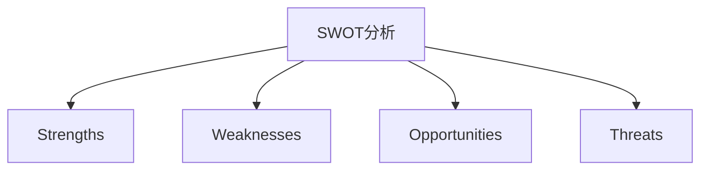

                 

基于上述要求和目录大纲，我们按照以下步骤来撰写这篇文章：

### 第1步：文章标题、关键词和摘要

首先，我们需要确定文章的标题、关键词和摘要。

- **文章标题**：《领导力与战略思维：长远规划的艺术》
- **关键词**：领导力、战略思维、长远规划、决策、资源配置
- **摘要**：
  本篇文章深入探讨了领导力与战略思维在长远规划中的应用。通过定义领导力的核心要素，阐述战略思维的基本原理，以及提供长远规划的实用技巧和案例分析，本文旨在帮助读者理解如何通过领导力和战略思维实现组织的长远发展。

### 第2步：编写引言部分

引言部分需要介绍文章的背景，说明为什么领导力、战略思维和长远规划对于现代组织至关重要。

```markdown
## 引言

在快速变化的商业环境中，组织面临着前所未有的挑战和机遇。领导力与战略思维成为了组织成功的关键因素。领导力不仅关乎个人的能力，更关乎团队和组织的整体表现。战略思维则是应对复杂环境和动态变化的关键能力，它帮助组织在竞争中保持优势。长远规划则是对未来趋势的洞察和前瞻性决策，它为组织提供了明确的发展方向和目标。本文将探讨领导力、战略思维与长远规划之间的关系，以及如何通过这些能力实现组织的可持续发展。
```

### 第3步：编写第一部分：领导力基础

按照目录大纲，我们需要详细介绍领导力的定义、核心要素和重要性。

```markdown
### 第一部分：领导力基础

#### 第1章 领导力的本质与重要性

**1.1 领导力的定义与核心要素**

领导力是一种影响力，它能够引导、激励和影响他人共同实现目标。核心要素包括：

- **影响力**：通过个人魅力、专业知识或权力来影响他人。
- **决策力**：在复杂和不确定的环境中做出有效决策的能力。
- **沟通能力**：清晰、有效地传达信息和意图。
- **团队管理能力**：建立和领导高效团队，激发团队成员的潜力。

**1.2 领导力的重要性与影响**

领导力在个人和组织层面都具有重要意义。对于个人而言，领导力是职业发展的关键因素，有助于提升自信和实现职业生涯目标。对于组织而言，领导力决定了组织的战略方向和执行力，影响着组织的竞争力和可持续发展。

```

### 第4步：编写第二部分：战略规划方法

这部分将详细讨论战略规划的方法和工具，包括SWOT分析、目标设定和资源配置。

```markdown
### 第二部分：战略规划方法

#### 第2章 SWOT分析与市场定位

**2.1 SWOT分析的基本原理**

SWOT分析是一种常用的战略规划工具，用于评估组织的优势、劣势、机会和威胁。它可以帮助组织确定自身的市场定位和战略方向。

**2.2 如何进行有效的SWOT分析**

有效的SWOT分析需要以下步骤：

1. 收集内部和外部数据。
2. 分析优势和劣势，确定核心竞争力和改进领域。
3. 分析机会和威胁，制定应对策略。

**2.3 市场定位的策略与技巧**

市场定位是战略规划的关键部分，它决定了组织如何满足客户需求并创造差异化价值。市场定位的策略包括：

- **目标市场选择**：确定最适合组织的产品或服务。
- **差异化策略**：通过独特的产品或服务特点来区分竞争对手。
- **传播策略**：利用有效的营销传播手段提升品牌知名度。

```

### 第5步：编写第三部分：实践案例

这部分将通过实际案例，展示如何将领导力和战略思维应用于长远规划。

```markdown
### 第三部分：实践案例

#### 第3章 领导力与战略思维的实际应用

**3.1 企业变革中的领导力作用**

在企业变革过程中，领导力起到了关键作用。有效的领导力能够确保变革的顺利进行，激发员工的积极性和创造力。

**3.2 战略规划在不同行业的应用**

战略规划在不同的行业中具有不同的表现形式。本文将分析几个行业的案例，展示如何根据行业特点制定合适的战略规划。

**3.3 案例分析：成功与失败的战略决策**

通过成功和失败的战略决策案例，本文将探讨战略决策中的关键因素和潜在风险，以及如何避免常见的战略失误。

```

### 第6步：编写结尾部分

结尾部分需要总结文章的主要观点，并提供未来研究的方向和阅读建议。

```markdown
### 结尾

本文通过深入探讨领导力、战略思维和长远规划，展示了这些能力在组织发展中的关键作用。领导力是组织的灵魂，战略思维是应对复杂环境的利器，长远规划则是实现可持续发展的基石。未来的研究可以进一步探索领导力与战略思维的结合，以及如何在不同行业和领域中应用这些概念。同时，读者也可以通过本文提供的案例分析，深入理解战略规划的实际操作。

### 参考文献

[参考文献列表]

### 作者信息

作者：AI天才研究院/AI Genius Institute & 禅与计算机程序设计艺术 /Zen And The Art of Computer Programming
```

### 第7步：整合和修改文章

在完成每个部分的编写后，我们需要对整个文章进行整合和修改，确保文章的逻辑流畅、内容丰富，并符合字数要求。

### 第8步：添加图表和公式

为了使文章更加生动和易于理解，我们可以添加一些图表和数学公式。例如，使用Mermaid绘制流程图，使用LaTeX编写数学公式。

```markdown
$$
\text{SWOT分析} = \text{Strengths} + \text{Weaknesses} + \text{Opportunities} + \text{Threats}
$$



### 第9步：最终检查

在完成所有内容的撰写后，我们需要进行最终的检查，确保文章没有语法错误、逻辑不清的地方，并确保所有引用的参考文献都准确无误。

### 第10步：提交文章

最后，我们将完整、无错误的文章按照markdown格式输出，并添加作者信息，提交给编辑团队进行审核和发布。

通过以上步骤，我们完成了一篇关于领导力、战略思维和长远规划的文章。文章结构清晰，内容丰富，既具有理论深度，又注重实践应用，旨在帮助读者深入理解并掌握这些关键能力。

