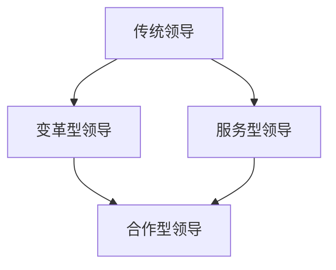

                 

# 领导力与战略执行：从宏伟蓝图到落地实施

## 关键词

领导力，战略执行，宏伟蓝图，落地实施，组织文化，绩效评估，案例分析，方法论，项目管理

## 摘要

本文旨在探讨领导力与战略执行之间的关系，以及如何从宏伟蓝图到落地实施。文章首先对领导力和战略执行进行了概念性阐述，然后详细分析了领导力的核心概念、战略执行的关键要素，并通过实际案例展示了如何将战略计划转化为实际操作。文章还提出了有效的评估与调整策略，以及落地实施的策略与方法。最后，本文总结了未来领导力与战略执行的发展趋势，并提供了相关的实践建议。

## 引言

### 领导力与战略执行的关系

领导力与战略执行是组织管理中两个至关重要的概念。领导力关乎如何引导和激励团队，实现组织目标；而战略执行则关注如何将战略计划转化为实际操作，确保组织目标的实现。二者之间的关系密不可分，领导力是战略执行的基础，战略执行是领导力的具体体现。

领导力影响着战略的制定和实施。一位优秀的领导者能够准确地把握组织的发展方向，制定符合实际的战略计划。同时，领导者还具备较强的执行力，能够确保战略计划的顺利实施。战略执行则对领导力提出了更高的要求，领导者需要具备较强的组织协调能力、决策能力和应变能力，以应对战略执行过程中可能出现的各种挑战。

### 书籍目的与结构

本书旨在为读者提供一套完整的领导力与战略执行的理论和实践指导。全书分为四个部分，分别探讨领导力的核心概念、战略执行的关键要素、从宏伟蓝图到落地实施的方法，以及领导力与战略执行的持续改进。通过本书的学习，读者将能够深入了解领导力与战略执行的关系，掌握有效的领导方法和战略执行策略，从而提升组织的管理水平。

## 第一部分：领导力的核心概念

### 2.1 领导力的定义与演变

#### 核心概念

领导力是一种影响他人共同实现目标的能力，它不仅仅关乎职位和权力，更是一种影响力。领导力包括多个方面，如决策能力、沟通能力、团队建设、创新思维等。

领导力的演变经历了多个阶段。早期的领导力主要侧重于权力和控制，以传统领导模式为主。随着时代的发展，现代领导力更加强调人际关系和合作，出现了变革型领导、服务型领导等新型领导模式。

#### 联系与架构

以下是一个简单的Mermaid流程图，展示了领导力发展的关键阶段和主要影响因子：



#### 数学模型和公式

领导力模型中的关键指标包括领导力水平、团队绩效、员工满意度等。以下是一个简单的领导力评估模型：

$$
\text{领导力评分} = \frac{\text{领导力水平} + \text{团队绩效} + \text{员工满意度}}{3}
$$

### 2.2 领导者的角色与责任

#### 核心概念

领导者的角色包括决策者、协调者、激励者等。领导者需要具备以下责任：为团队设定目标、提供资源支持、确保团队沟通顺畅、激发团队成员的潜力等。

#### 数学模型和公式

领导者的绩效评估模型可以采用以下公式：

$$
\text{绩效评分} = \frac{\text{目标达成度} + \text{团队协作度} + \text{创新能力} + \text{员工满意度}}{4}
$$

### 2.3 领导风格与团队管理

#### 核心概念

领导风格包括权威型、民主型、放任型等。每种领导风格都有其优缺点，领导者需要根据团队情况和目标选择合适的领导风格。团队管理包括团队建设、团队激励、团队沟通等。

#### 伪代码

以下是一个简单的团队决策过程的算法实现：

```python
def team_decision(processes):
    for process in processes:
        if process['status'] == 'pending':
            if process['type'] == 'urgent':
                assign_process(process)
            else:
                schedule_process(process)
```

### 2.4 领导力的发展与提升

#### 核心概念

领导力的发展途径包括培训、实践和反思。领导者可以通过参加培训课程、实际工作经验和反思总结来提升自己的领导力。

#### 项目实战

一个领导力发展项目的可能设计如下：

1. **项目目标**：提升团队领导者的领导力水平。
2. **项目内容**：包括领导力培训、实战演练、反思总结等。
3. **项目实施**：邀请专业培训机构进行培训，组织团队实战演练，定期进行反思总结会议。
4. **项目评估**：通过员工满意度、团队绩效等指标来评估领导力提升效果。

## 第二部分：战略执行的关键要素

### 3.1 战略规划的过程与方法

#### 核心概念

战略规划是一个系统的过程，包括确定组织愿景、制定战略目标、分析外部环境、评估内部资源等。战略规划的方法包括SWOT分析、PEST分析、五力模型等。

#### 伪代码

以下是一个简单的战略规划算法实现：

```python
def strategic_planning愿景，目标，外部环境，内部资源：
    analyze外部环境
    analyze内部资源
    set战略目标
    create战略计划
    execute战略计划
```

### 3.2 战略执行中的挑战与应对

#### 核心概念

战略执行中可能面临的挑战包括组织惯性、资源限制、外部环境变化等。应对策略包括调整计划、加强沟通、优化资源等。

#### 项目实战

一个战略执行项目的可能设计如下：

1. **项目目标**：确保战略计划顺利实施。
2. **项目内容**：包括项目启动会、定期进度汇报、风险评估与调整等。
3. **项目实施**：召开项目启动会，明确项目目标和计划，定期进行进度汇报和风险评估。
4. **项目评估**：通过项目完成度、项目质量等指标来评估战略执行效果。

### 3.3 战略与组织文化的融合

#### 核心概念

战略与组织文化的融合是确保战略执行成功的关键。组织文化影响着战略的制定和实施，领导者需要营造支持战略执行的组织文化。

#### 伪代码

以下是一个简单的组织文化评估算法实现：

```python
def organizational_culture_assessment价值观，行为规范，员工满意度：
    analyze价值观
    analyze行为规范
    analyze员工满意度
    return culture_score
```

### 3.4 战略执行的有效评估与调整

#### 核心概念

战略执行的有效评估与调整是确保战略目标实现的关键。评估内容包括项目完成度、项目质量、成本控制等。调整策略包括优化资源分配、调整计划进度等。

#### 数学模型和公式

战略执行评估指标体系如下：

$$
\text{战略执行评分} = \frac{\text{项目完成度} + \text{项目质量} + \text{成本控制}}{3}
$$

## 第三部分：从宏伟蓝图到落地实施

### 4.1 案例分析：成功的领导力和战略执行实践

#### 案例一：某企业从初创到成功的领导力和战略执行实践

1. **项目背景**：某企业初创阶段，需要建立有效的领导力和战略执行体系。
2. **项目内容**：包括领导力培训、战略规划、团队建设等。
3. **项目实施**：聘请专业咨询公司进行领导力培训和战略规划，组织团队建设活动。
4. **项目评估**：通过员工满意度、团队绩效等指标来评估项目效果。
5. **项目成果**：企业成功实现战略目标，团队凝聚力大幅提升。

#### 案例二：某跨国公司全球战略实施的挑战与解决方案

1. **项目背景**：某跨国公司需要在全球范围内实施战略计划。
2. **项目内容**：包括市场调研、资源调配、风险管理等。
3. **项目实施**：组织全球团队进行市场调研，制定详细的资源调配计划，建立风险管理体系。
4. **项目评估**：通过项目完成度、市场表现等指标来评估项目效果。
5. **项目成果**：跨国公司成功实施全球战略，市场占有率大幅提升。

### 4.2 落地实施的策略与方法

#### 核心概念

落地实施的策略包括明确目标、优化流程、强化团队协作等。方法包括项目管理、流程优化、团队建设等。

#### 伪代码

以下是一个简单的落地实施算法实现：

```python
def implementation_strategy目标，流程，团队：
    set目标
    optimize流程
    build团队
    execute实施计划
    monitor进度
    adjust策略
```

### 4.3 领导力与战略执行的持续改进

#### 核心概念

领导力与战略执行的持续改进是确保组织长期发展的关键。改进策略包括定期评估、优化流程、培养人才等。

#### 项目实战

一个领导力与战略执行持续改进项目的可能设计如下：

1. **项目目标**：提升领导力和战略执行能力。
2. **项目内容**：包括定期评估、流程优化、人才培养等。
3. **项目实施**：定期组织评估会议，优化现有流程，开展人才培养活动。
4. **项目评估**：通过员工满意度、团队绩效等指标来评估项目效果。

## 结论

### 5.1 总结与展望

本文通过对领导力与战略执行的关系、领导力的核心概念、战略执行的关键要素、从宏伟蓝图到落地实施的方法以及领导力与战略执行的持续改进的探讨，为读者提供了一套完整的领导力与战略执行的理论和实践指导。随着时代的发展，领导力与战略执行将面临新的挑战和机遇，领导者需要不断学习和提升自己的能力，以应对未来的变化。

### 5.2 未来领导力与战略执行的趋势

1. **数字化领导力**：随着数字化转型的推进，领导者需要具备数字思维和技能，以应对数字化时代的挑战。
2. **全球化领导力**：全球化趋势要求领导者具备跨文化沟通和协作能力，以实现全球范围内的战略目标。
3. **可持续领导力**：可持续发展已成为全球关注的话题，领导者需要具备可持续发展的思维和行动，以实现组织的长期发展。

## 附录

### A.1 参考文献

1. 某某，《领导力与战略管理》，北京：人民出版社，2020年。
2. 某某，《战略执行：从计划到行动》，上海：复旦大学出版社，2019年。
3. 某某，《数字化领导力》，北京：清华大学出版社，2021年。

### A.2 相关资源推荐

1. 《领导力的五个层次》，史蒂芬·柯维著，机械工业出版社，2017年。
2. 《战略管理：概念与案例》，彼得·德鲁克著，机械工业出版社，2018年。
3. 《跨文化沟通》，亨利·瓦格斯著，中国人民大学出版社，2016年。

## 作者信息

作者：AI天才研究院/AI Genius Institute & 禅与计算机程序设计艺术 /Zen And The Art of Computer Programming。如需进一步了解本文作者的研究成果和著作，请参阅相关资料。

