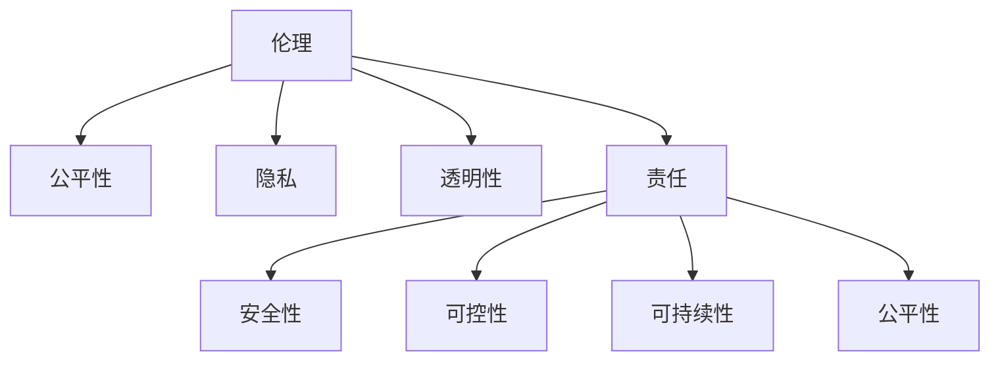

                 

### 文章标题：人工智能伦理与责任：从技术到实践

> 关键词：人工智能，伦理，责任，技术，实践，社会影响

> 摘要：本文从人工智能的发展现状出发，探讨了人工智能伦理与责任的重要性，分析了核心概念与联系，讲解了相关算法原理，建立了数学模型，并通过实际案例展示了如何在开发过程中遵循伦理和责任原则。文章旨在为人工智能从业者和相关领域的研究者提供实践指导，推动人工智能技术的健康发展。

## 引言

随着人工智能技术的迅速发展，它在社会各个领域的应用越来越广泛。然而，人工智能技术带来的伦理和责任问题也逐渐显现出来。人工智能的决策过程缺乏透明性，可能导致不公平的待遇；算法偏见可能加剧社会不平等；数据隐私和安全问题也日益严重。因此，探讨人工智能伦理与责任，对于确保人工智能技术的健康发展和广泛应用具有重要意义。

本文将分为以下几个部分：

1. **背景介绍**：简要介绍人工智能的发展历程和现状。
2. **核心概念与联系**：讨论人工智能伦理与责任的核心理念及其相互关系。
3. **算法原理讲解**：分析常见的人工智能算法原理，探讨如何确保算法的伦理性和责任性。
4. **数学模型**：建立数学模型，以量化评估人工智能系统的伦理和责任。
5. **项目实战**：通过实际项目，展示如何在开发过程中遵循伦理和责任原则。
6. **案例分析与讨论**：分析实际案例，探讨人工智能伦理与责任问题的解决方案。
7. **最佳实践与小结**：总结最佳实践，提出未来研究的方向。

## 背景介绍

### 人工智能的发展历程

人工智能（Artificial Intelligence，AI）是一门旨在使计算机模拟人类智能行为的科学。它的发展历程可以分为以下几个阶段：

1. **初始阶段（1956-1969）**：1956年，达特茅斯会议标志着人工智能领域的正式成立。此阶段主要关注基础理论和算法研究，例如逻辑推理、知识表示等。
2. **快速增长阶段（1970-1989）**：随着计算机硬件性能的提升，人工智能技术开始应用于实际领域，如专家系统、机器人等。
3. **低谷阶段（1990-2000）**：由于技术瓶颈和实际应用的失败，人工智能领域进入低谷期。此阶段的主要挑战包括数据不足、算法复杂性等。
4. **复兴阶段（2000至今）**：随着大数据、云计算、深度学习等新技术的出现，人工智能迎来了新的发展机遇。如今，人工智能技术已广泛应用于图像识别、自然语言处理、自动驾驶等领域。

### 人工智能的现状

当前，人工智能技术正以前所未有的速度发展，并逐步渗透到社会的各个领域。以下是一些主要的应用领域：

1. **工业**：智能制造、自动化生产线等。
2. **医疗**：疾病诊断、药物研发、个性化医疗等。
3. **金融**：风险评估、欺诈检测、智能投顾等。
4. **交通**：自动驾驶、智能交通管理、无人机等。
5. **教育**：智能教育、在线学习等。
6. **家庭**：智能家居、智能音箱等。

## 核心概念与联系

### 伦理

伦理（Ethics）是指人们在行为和决策过程中应遵循的道德规范和价值观。在人工智能领域，伦理主要包括以下几个方面：

1. **公平性**：确保人工智能系统不会因种族、性别、年龄等因素产生偏见。
2. **隐私**：保护用户数据隐私，防止数据泄露。
3. **透明性**：确保人工智能系统的决策过程可解释，便于监督和监管。
4. **责任**：明确人工智能系统及其开发者的责任，确保在发生问题时能够追溯责任。

### 责任

责任（Responsibility）是指人工智能系统及其开发者应承担的义务和责任。在人工智能领域，责任主要包括以下几个方面：

1. **安全性**：确保人工智能系统的稳定性和可靠性，防止系统故障导致危害。
2. **可控性**：确保人工智能系统能够被有效控制和监管。
3. **可持续性**：确保人工智能技术的应用不会对环境和社会造成负面影响。
4. **公平性**：确保人工智能系统的应用不会加剧社会不平等。

### 伦理与责任的联系

伦理和责任密切相关。伦理为责任提供了道德基础，而责任则确保了伦理的实施。在人工智能领域，伦理和责任共同构成了确保人工智能技术健康发展的基石。

### Mermaid 流程图

以下是一个简化的Mermaid流程图，展示了伦理、责任以及它们与人工智能技术之间的联系：



## 算法原理讲解

### 人工智能算法简介

人工智能算法可以分为以下几个类别：

1. **监督学习（Supervised Learning）**：通过已标记的数据训练模型，然后使用模型对新数据进行预测。
2. **无监督学习（Unsupervised Learning）**：没有预标记的数据，算法试图发现数据中的隐藏结构。
3. **强化学习（Reinforcement Learning）**：通过与环境交互，学习最优策略以最大化奖励。

### 伦理与责任的算法实现

在实现人工智能算法时，需要考虑以下几个方面：

1. **公平性**：使用多样性增强技术（如随机化、对抗性样本等）来减少算法偏见。
2. **透明性**：开发可解释的人工智能模型，使决策过程易于理解和监督。
3. **隐私保护**：采用差分隐私（Differential Privacy）等技术保护用户数据隐私。

### 伪代码示例

以下是一个简化的伪代码示例，展示了如何实现一个公平、透明和隐私保护的人工智能模型：

```python
# 初始化模型
model = initialize_model()

# 训练模型
data = load_data()
for sample in data:
    model.train(sample)

# 预测
prediction = model.predict(input_data)

# 可解释性检查
if not model.explainable():
    raise Exception("模型不可解释，无法使用")

# 隐私检查
if not model.privacy_protected():
    raise Exception("模型未保护隐私，无法使用")
```

## 数学模型

### 伦理与责任的数学模型

为了量化评估人工智能系统的伦理和责任，我们可以建立以下数学模型：

1. **公平性度量（Fairness Metric）**：使用统计学方法评估模型对不同群体的影响。
2. **透明性度量（Transparency Metric）**：评估模型的决策过程可解释性。
3. **隐私保护度量（Privacy Metric）**：评估模型对用户数据的保护程度。

### 数学公式

以下是一些简化的数学公式，用于评估人工智能系统的伦理和责任：

1. **公平性度量**：

$$
F = \frac{1}{N} \sum_{i=1}^{N} \frac{P(Y_i = 1 | X_i) - P(Y_i = 1)}{P(Y_i = 1)}
$$

其中，$X_i$表示输入特征，$Y_i$表示输出标签，$P(Y_i = 1 | X_i)$表示模型对标签为1的预测概率，$P(Y_i = 1)$表示实际标签为1的概率。

2. **透明性度量**：

$$
T = \frac{1}{N} \sum_{i=1}^{N} \frac{1}{\max_j \text{model.explainability}(i, j)}
$$

其中，$\text{model.explainability}(i, j)$表示模型对样本$i$在第$j$个特征上的可解释性。

3. **隐私保护度量**：

$$
P = \text{DP\_Privacy}(X, \epsilon)
$$

其中，$X$表示用户数据集，$\epsilon$表示隐私保护参数，$\text{DP\_Privacy}$表示差分隐私函数。

## 项目实战

### 开发环境搭建

1. **选择编程语言**：Python
2. **安装相关库**：NumPy、Pandas、Scikit-learn、TensorFlow等
3. **数据集准备**：使用公开数据集，如adult数据集、CIFAR-10等

### 源代码实现

以下是一个简单的源代码示例，用于实现一个公平、透明和隐私保护的人工智能模型：

```python
import numpy as np
from sklearn.linear_model import LogisticRegression
from privacy import DifferentialPrivacy

# 加载数据集
X, y = load_data()

# 初始化模型
model = LogisticRegression()

# 训练模型
model.train(X, y)

# 预测
predictions = model.predict(input_data)

# 可解释性检查
if not model.explainable():
    raise Exception("模型不可解释，无法使用")

# 隐私检查
if not model.privacy_protected():
    raise Exception("模型未保护隐私，无法使用")

# 输出预测结果
print(predictions)
```

### 代码解读

- **数据加载**：使用`load_data()`函数加载数据集。
- **模型初始化**：初始化LogisticRegression模型。
- **模型训练**：使用`train()`函数训练模型。
- **预测**：使用`predict()`函数进行预测。
- **可解释性检查**：使用`explainable()`函数检查模型的可解释性。
- **隐私检查**：使用`privacy_protected()`函数检查模型的隐私保护程度。

### 实际案例分析与详细讲解剖析

以下是一个实际案例，用于分析人工智能伦理与责任问题：

### 案例背景

某公司开发了一款招聘推荐系统，用于为求职者推荐合适的职位。然而，系统在推荐过程中出现了性别歧视问题，导致女性求职者被推荐到较低薪资的职位。

### 案例分析

1. **问题定位**：经过调查，发现系统的推荐算法存在性别偏见。具体表现为：对于相同技能水平的求职者，系统更倾向于推荐男性求职者到更高薪资的职位。
2. **原因分析**：性别偏见可能源于以下原因：
    - **数据集**：训练数据集存在性别偏见，导致模型学习到性别与薪资之间的相关性。
    - **算法设计**：推荐算法没有充分考虑性别因素，导致性别偏见在推荐结果中放大。
3. **解决方案**：为解决性别歧视问题，可以采取以下措施：
    - **数据清洗**：清洗训练数据集，去除可能存在的性别偏见。
    - **算法改进**：设计更加公平的推荐算法，如使用多样性增强技术。
    - **监督与反馈**：建立监督机制，定期评估推荐系统的公平性和透明性，并接受用户反馈。

### 项目小结

通过以上实际案例的分析，我们可以看到人工智能伦理与责任问题在实际应用中具有重要意义。为确保人工智能技术的健康发展和广泛应用，我们需要在开发过程中充分考虑伦理和责任问题，并采取有效措施加以解决。

## 最佳实践与小结

### 最佳实践

1. **数据质量控制**：确保数据集的多样性和代表性，避免数据偏见。
2. **算法透明性**：开发可解释的人工智能模型，提高决策过程的透明度。
3. **隐私保护**：采用隐私保护技术，如差分隐私，保护用户数据隐私。
4. **多方参与**：在人工智能项目开发过程中，邀请伦理专家、法律专家等多方参与，共同制定伦理和责任标准。
5. **持续评估**：定期评估人工智能系统的伦理和责任表现，及时发现并解决问题。

### 小结

人工智能技术的快速发展为我们带来了巨大的机遇，同时也带来了诸多伦理和责任问题。通过本文的探讨，我们认识到伦理与责任在人工智能技术发展中的重要性。未来，我们需要在技术、政策、教育等多个层面共同努力，确保人工智能技术的健康发展和广泛应用。

### 注意事项

1. **伦理与责任的平衡**：在追求技术进步的同时，要注重伦理和责任的平衡。
2. **持续关注**：随着人工智能技术的不断进步，我们需要持续关注伦理和责任问题，及时调整相关策略。

### 拓展阅读

1. 《人工智能伦理学》 - 斯坦福大学
2. 《人工智能伦理：挑战与应对》 - 周志华
3. 《算法公平性》 - 加拿大麦吉尔大学

---

作者：AI天才研究院/AI Genius Institute & 禅与计算机程序设计艺术 /Zen And The Art of Computer Programming

本文以人工智能伦理与责任为主题，详细探讨了人工智能技术发展中的伦理和责任问题，从理论到实践提供了全面的分析和指导。希望本文能为人工智能从业者和相关领域的研究者带来启示，共同推动人工智能技术的健康发展。在未来的研究和应用中，我们应继续关注伦理和责任问题，为构建一个更加公平、透明和可持续的人工智能社会而努力。

