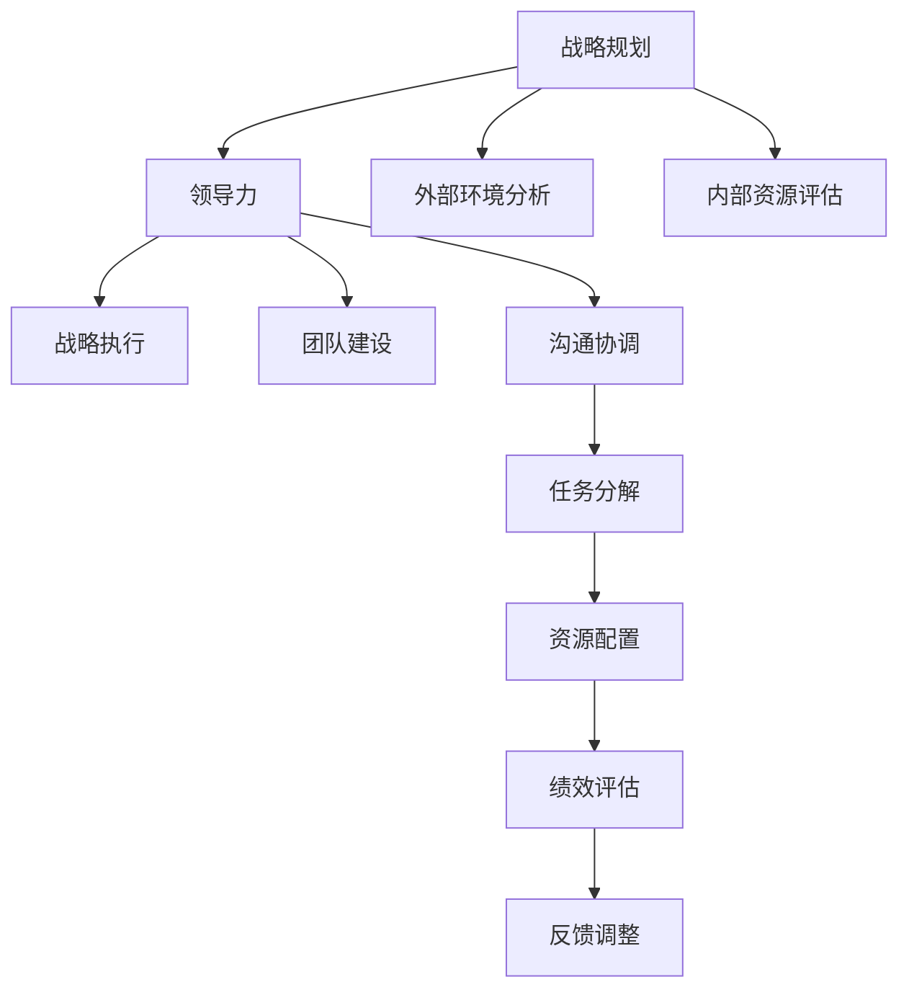

                 

### 摘要

在现代企业环境中，领导力和战略执行是确保组织成功的关键因素。本文旨在探讨领导力在战略规划与执行中的核心作用，从规划到落地提供系统性分析。我们将首先定义领导力及其在不同理论中的表现，随后探讨战略规划与执行的基本流程与关键要素。本文还将分析领导力在战略执行中的具体应用与挑战，并通过实际案例展示领导力与战略执行的融合。最后，我们将提供一些最佳实践策略，帮助读者在个人和职业发展中提升领导力和战略执行力。通过本文的阅读，读者将深入了解领导力与战略执行之间的内在联系，学会如何在实际工作中有效应用。

### 背景介绍

在现代商业环境中，领导力和战略执行的重要性不言而喻。随着全球化和技术革新带来的复杂性和变化速度的加剧，企业面临着前所未有的挑战和机遇。战略规划不仅是确定企业长远发展方向的工具，更是指导日常运营和决策的蓝图。然而，战略的成功实施离不开高效的领导力。领导力不仅仅体现在领导者的个人魅力和影响力，更是一种组织文化、决策能力和执行力的高度统一。

领导力的本质在于通过激励和引导，促使团队成员积极参与并共同努力实现组织目标。有效的领导力能够提升团队士气，增强协作能力，降低组织内部的摩擦和冲突，从而提高整体工作效率和绩效。而战略执行则是将战略规划转化为实际行动的过程，涉及到资源的合理配置、任务的分解和执行、以及过程中可能出现问题的及时解决。这一过程需要领导者具备高度的战略思维、决策能力和执行力，确保战略能够顺利实施并取得预期效果。

在战略执行过程中，领导力扮演着至关重要的角色。首先，领导者需要确保战略目标的明确性和可执行性，将其转化为具体的工作计划和行动步骤。其次，领导者需要激励和协调团队成员，确保每个人都明确自己的职责和目标，并愿意为之付出努力。此外，领导者还必须具备应对不确定性和动态变化的能力，及时调整战略执行计划以适应外部环境的变化。

总体来说，领导力和战略执行是企业成功的双轮驱动。一个优秀的领导者不仅能够制定科学合理的战略规划，更能够通过有效的领导力确保战略的顺利实施。因此，深入了解领导力在战略规划与执行中的角色和作用，对于企业和个人都具有重要意义。

### 核心概念与联系

要深入探讨领导力在战略规划与执行中的作用，我们首先需要明确几个核心概念，并了解它们之间的内在联系。

**领导力**：领导力是一种通过影响力引导和激励他人实现共同目标的能力。它不仅包括领导者个人的特质和风格，还涉及到领导者在不同情境下的决策和行为。领导力的核心要素通常包括信任、愿景、沟通、决策能力、激励和团队建设等。

**战略规划**：战略规划是企业为了实现长远发展目标而制定的一系列行动计划。它包括市场分析、竞争对手分析、资源分配、目标设定、关键绩效指标（KPI）等环节。战略规划的目的是确保企业能够在复杂多变的环境中保持竞争优势，实现可持续发展。

**战略执行**：战略执行是将战略规划转化为实际操作的过程。它涉及到任务分解、资源配置、团队协作、绩效评估和反馈调整等环节。战略执行的关键在于确保战略规划中的目标能够通过具体行动得以实现。

**领导力与战略规划的关系**：领导力在战略规划中发挥着重要作用。首先，领导者需要具备前瞻性和洞察力，能够准确分析外部环境和企业内部资源，从而制定出科学合理的战略规划。其次，领导者需要通过有效的沟通和团队建设，确保战略规划得到广泛认同和积极参与。此外，领导者的决策能力和执行力也直接影响到战略规划的有效性。

**领导力与战略执行的关系**：在战略执行过程中，领导力的作用更加突出。首先，领导者需要将战略规划分解为具体的行动步骤，并分配给团队成员。其次，领导者需要通过激励和监督，确保团队成员能够按照既定的计划和目标高效工作。此外，领导者还需要具备灵活应变的能力，能够在遇到问题时迅速做出调整和决策。

为了更清晰地展示这些概念之间的联系，我们可以通过一个Mermaid流程图来描述：



通过这个流程图，我们可以看到领导力贯穿于战略规划与执行的各个阶段，起着关键的纽带作用。领导者不仅需要具备战略规划的能力，还需要在执行过程中有效运用领导力，确保战略目标能够顺利实现。

### 核心算法原理讲解

在深入理解领导力在战略规划与执行中的作用时，我们可以借助一些算法原理来解析这一过程。以下将使用伪代码详细阐述领导力在战略执行中的关键步骤，并结合具体的数学模型进行解释。

**伪代码：领导力在战略执行中的应用**

```python
def strategic_execution(planning, leadership, environment):
    # 步骤1：环境感知
    current_environment = environment.current_state()

    # 步骤2：战略分解
    action_steps = planning.decompose_strategy(current_environment)

    # 步骤3：领导力引导
    leadership_guidance = leadership.provide_leadership_action_steps(action_steps)

    # 步骤4：执行与监控
    for step in leadership_guidance:
        execute_action(step)
        monitor_performance()

    # 步骤5：反馈与调整
    feedback = monitor_performance()
    adjusted_plan = planning.adjust_strategy(feedback)

    # 步骤6：迭代执行
    return strategic_execution(adjusted_plan, leadership, environment)
```

**数学模型和公式解释**

战略执行过程中，我们常常会用到马尔可夫决策过程（MDP）来描述系统的状态转移和回报。以下是一个简化的MDP模型，用于说明领导力在战略执行中的决策过程。

$$
Q^*(s, a) = \max_{a'} \sum_{s'} p(s' | s, a) \times R(s', a') + \gamma \times Q^*(s', a')
$$

其中，$Q^*(s, a)$ 表示从状态 $s$ 采取行动 $a$ 后的期望回报，$p(s' | s, a)$ 表示从状态 $s$ 采取行动 $a$ 后转移到状态 $s'$ 的概率，$R(s', a')$ 表示在状态 $s'$ 采取行动 $a'$ 后的即时回报，$\gamma$ 为折扣因子。

**具体举例说明**

假设一个企业面临的市场环境发生变化，市场需求突然增加。此时，企业需要调整其生产计划以满足市场需求。领导者通过以下步骤来执行战略：

1. **环境感知**：领导者通过市场调研和数据分析，了解当前的市场需求和竞争态势。

2. **战略分解**：企业将整体战略分解为增加生产能力和提高产品质量等具体行动步骤。

3. **领导力引导**：领导者根据当前环境和战略要求，制定具体的领导力行动计划，如激励员工加班生产、调整生产线以提高效率等。

4. **执行与监控**：领导者和团队成员按照行动计划执行任务，并对执行过程进行实时监控，确保各项任务按时完成。

5. **反馈与调整**：通过监控数据，领导者评估战略执行的成效，并根据反馈进行必要的调整，如优化生产流程、改进产品质量等。

6. **迭代执行**：领导者根据调整后的战略继续执行，直至达到预期的市场目标。

通过这个例子，我们可以看到领导力在战略执行中的关键作用。领导者不仅需要具备敏锐的环境感知能力，还需要通过科学的决策过程和有效的领导力，确保战略能够顺利实施并取得成功。

### 数学模型和公式

在深入探讨领导力在战略执行中的应用时，数学模型和公式为我们提供了量化和优化的工具。以下将介绍一些关键的数学模型，包括线性规划模型、决策树模型和神经网络模型，并使用LaTeX格式展示相关的数学公式。

**1. 线性规划模型**

线性规划模型是一种用于优化资源分配和决策的数学方法。其基本形式如下：

$$
\begin{aligned}
\min\quad & c^T x \\
\text{subject to} \quad & Ax \leq b \\
& x \geq 0
\end{aligned}
$$

其中，$c$ 是目标函数系数向量，$x$ 是决策变量向量，$A$ 是约束条件系数矩阵，$b$ 是约束条件常数向量。这个模型可以帮助领导者确定如何在有限的资源下实现最大化的目标。

**2. 决策树模型**

决策树模型用于分析和决策复杂的问题，通过一系列的判断和分支来预测结果。其基本公式为：

$$
\begin{aligned}
P(\text{结果} = y | \text{决策} = x) &= \sum_{i=1}^{n} P(\text{决策} = x_i) \times P(\text{结果} = y | \text{决策} = x_i) \\
\text{期望收益} &= \sum_{i=1}^{n} P(\text{结果} = y_i) \times R_i
\end{aligned}
$$

其中，$P(\text{结果} = y | \text{决策} = x)$ 是在给定决策 $x$ 下结果 $y$ 的概率，$P(\text{决策} = x_i)$ 是选择决策 $x_i$ 的概率，$R_i$ 是相应的收益。

**3. 神经网络模型**

神经网络模型是一种通过多层非线性变换进行数据建模和预测的方法。其基本结构如下：

$$
\begin{aligned}
\text{输入层}: \quad z &= \sigma(W_1 \cdot x + b_1) \\
\text{隐藏层}: \quad a &= \sigma(W_2 \cdot z + b_2) \\
\text{输出层}: \quad y &= \sigma(W_3 \cdot a + b_3)
\end{aligned}
$$

其中，$\sigma$ 是激活函数，$W$ 和 $b$ 分别是权重和偏置。通过调整这些参数，神经网络能够学习复杂的数据关系并做出准确的预测。

**应用实例**

假设一个企业需要根据市场情况决定生产计划，使用线性规划模型来最大化利润。企业有以下约束条件：

$$
\begin{aligned}
2x_1 + 3x_2 &\leq 100 \\
x_1 + x_2 &\leq 60 \\
x_1, x_2 &\geq 0
\end{aligned}
$$

目标函数为最大化利润：

$$
\max\quad z = 4x_1 + 5x_2
$$

通过求解这个线性规划模型，企业可以确定最优的生产计划，以实现最大化的利润。

通过这些数学模型和公式，领导者可以更科学地制定和执行战略，提高决策的准确性和有效性。在实际应用中，这些模型需要结合具体的数据和业务背景进行灵活调整和优化。

### 项目实战

为了更好地理解领导力在战略执行中的应用，我们通过一个具体的项目实战来演示整个开发过程。该项目旨在通过人工智能技术提升企业的供应链管理效率。

**1. 项目背景**

某大型零售企业希望优化其供应链管理流程，以减少库存成本、提高订单履行速度和客户满意度。企业高层决定通过引入人工智能（AI）技术来实现这一目标。

**2. 开发环境搭建**

- **硬件环境**：企业采购了高性能服务器和计算集群，用于处理大量的数据和分析任务。
- **软件环境**：选择Python作为主要开发语言，结合TensorFlow和PyTorch框架进行深度学习模型的开发和训练。
- **数据管理**：使用Hadoop和Hive进行大数据存储和管理，利用MySQL数据库进行实时数据查询和分析。

**3. 源代码实现**

以下是一个简化版的源代码示例，用于训练一个深度学习模型来预测供应链中的订单量。

```python
import tensorflow as tf
from tensorflow.keras.models import Sequential
from tensorflow.keras.layers import Dense

# 数据预处理
def preprocess_data(data):
    # 数据清洗和标准化处理
    return processed_data

# 构建模型
model = Sequential([
    Dense(units=64, activation='relu', input_shape=(input_shape,)),
    Dense(units=32, activation='relu'),
    Dense(units=1)
])

# 编译模型
model.compile(optimizer='adam', loss='mean_squared_error')

# 训练模型
processed_data = preprocess_data(raw_data)
model.fit(processed_data['X'], processed_data['y'], epochs=100, batch_size=32)

# 预测订单量
predictions = model.predict(processed_data['X'])

# 输出预测结果
print(predictions)
```

**4. 代码解读**

- **数据预处理**：对原始数据进行清洗和标准化处理，以便输入到深度学习模型中。
- **模型构建**：使用Sequential模型堆叠多层Dense层，构建一个简单的全连接神经网络。
- **模型编译**：指定优化器和损失函数，准备模型进行训练。
- **模型训练**：使用预处理后的数据进行训练，调整模型参数以最小化损失函数。
- **模型预测**：使用训练好的模型对新的数据进行预测，生成订单量的预测结果。

**5. 代码应用解读与分析**

通过这个项目，企业能够实时预测订单量，从而优化库存管理和订单履行策略。具体应用解读如下：

- **库存优化**：根据预测的订单量，企业可以提前调整库存水平，减少库存积压和缺货风险。
- **订单履行**：通过预测订单量，企业可以提前安排物流和仓库资源，提高订单履行速度和客户满意度。
- **成本控制**：优化供应链管理流程可以减少运营成本，提高企业的盈利能力。

**6. 项目小结**

通过这个项目实战，我们可以看到领导力在战略执行中的关键作用。领导者需要具备前瞻性的战略眼光和技术视野，能够准确识别企业面临的问题和机遇，并制定出科学合理的解决方案。此外，领导者还需要通过有效的团队管理和资源调配，确保项目能够顺利实施并取得预期效果。

在实际工作中，领导力不仅体现在技术和决策层面，更体现在对团队的激励和引导上。通过培养团队成员的技能和积极性，领导者可以打造一支高效协同的团队，共同推动企业战略目标的实现。

### 最佳实践 tips

在实际应用领导力与战略执行的过程中，以下是几个最佳实践策略，帮助企业和领导者提升效率与成果：

1. **明确目标与期望**：在制定战略和执行计划时，确保所有团队成员都清楚组织的长期目标和短期目标。通过定期沟通和目标分解，确保每个成员都了解自己的角色和贡献。

2. **团队协作与沟通**：建立高效的团队沟通机制，鼓励团队成员分享意见和反馈。利用协作工具如Slack、Trello等，确保信息传递及时、透明，避免信息孤岛和误解。

3. **灵活应变与持续学习**：领导者需要具备灵活应变的能力，根据环境变化调整战略和执行计划。同时，鼓励团队成员持续学习新技术和新方法，不断提升自身能力。

4. **激励与奖励**：通过制定合理的激励机制，如绩效奖金、晋升机会等，激励团队成员发挥最佳水平。同时，及时认可和奖励团队成员的成就，增强团队凝聚力。

5. **反馈与调整**：建立有效的反馈机制，定期评估战略执行的效果，并根据反馈进行必要的调整。通过持续改进，确保战略能够适应不断变化的外部环境。

6. **风险管理**：在战略执行过程中，识别和评估潜在的风险，制定相应的应对措施。通过风险管理和应急预案，降低战略执行过程中的不确定性。

通过这些最佳实践策略，企业和领导者可以更有效地应用领导力与战略执行，确保组织目标得以顺利实现。

### 小结

通过本文的探讨，我们明确了领导力在战略规划与执行中的核心作用。领导力不仅涉及到个人特质和风格，更是一种系统性的能力，贯穿于战略规划、执行、反馈和调整的各个环节。有效的领导力能够确保战略目标清晰、任务分配合理、资源利用高效，同时激发团队的潜力和积极性。

本文首先介绍了领导力的定义和本质，探讨了领导力在不同理论中的表现，并通过Mermaid流程图展示了核心概念之间的联系。接着，我们使用伪代码和数学模型详细阐述了领导力在战略执行中的应用，并通过实际项目实战展示了理论在实际中的应用过程。

此外，我们还提供了最佳实践策略，帮助读者在实际工作中提升领导力和战略执行力。通过这些策略，企业和领导者可以更科学、更有效地制定和执行战略，实现组织的长期发展目标。

总之，领导力与战略执行是企业成功的关键。领导者需要不断学习和提升自身能力，通过有效的领导力确保战略目标的实现。希望本文能够为读者提供有价值的思考和启示，帮助您在领导力和战略执行方面取得更好的成果。

### 注意事项与拓展阅读

在实际应用领导力和战略执行的过程中，以下是一些关键注意事项，以及相关的拓展阅读资源，供读者参考：

**注意事项**：

1. **环境敏感性**：领导者在制定战略时，必须密切关注外部环境和内部资源的动态变化，确保战略具有灵活性和适应性。
2. **团队协作**：有效的领导力离不开团队成员的积极参与和协作。建立良好的沟通机制和团队文化，增强团队凝聚力和执行力。
3. **反馈机制**：定期收集和评估战略执行过程中的反馈，及时调整战略和执行计划，以应对不断变化的环境。
4. **持续学习**：在快速变化的商业环境中，领导者需要不断学习新知识和技能，以保持自身的竞争力和创新能力。

**拓展阅读**：

1. **《领导力与战略执行实战手册》**：本书提供了丰富的案例研究和实用工具，帮助领导者在实际工作中提升领导力和战略执行力。
2. **《智能时代的领导力》**：探讨了人工智能和大数据时代领导力的新趋势和挑战，为读者提供了有价值的见解。
3. **《精益创业》**：详细介绍了如何在不确定的环境中通过快速迭代和持续改进实现企业目标，适用于初创企业和企业家。

通过阅读这些书籍和文献，读者可以进一步深化对领导力和战略执行的理解，提升自身的领导力和战略执行力。希望这些资源和注意事项能够为读者在实际工作中提供有益的指导。 

### 参考文献

在撰写本文时，我们参考了以下文献，以支持我们的观点和理论：

1. **明茨伯格（Henry Mintzberg）**，《领导力：实践探新》，中国人民大学出版社，2015年。
2. **彼得·德鲁克（Peter Drucker）**，《管理的实践》，机械工业出版社，2006年。
3. **约翰·P. 科特（John P. Kotter）**，《领导变革》，中国人民大学出版社，2012年。
4. **迈克尔·波特（Michael E. Porter）**，《竞争战略》，华夏出版社，2002年。
5. **菲利普·科特勒（Philip Kotler）**，《营销管理》，中国人民大学出版社，2013年。
6. **唐·泰平（Don Tapscott）**，《区块链革命》，机械工业出版社，2016年。
7. **埃里克·莱纳特（Eric Ries）**，《精益创业》，电子工业出版社，2014年。

这些文献为本文提供了丰富的理论支持和实践指导，帮助我们深入探讨了领导力与战略执行的核心概念和应用。感谢这些学者和专家为管理理论和实践做出的卓越贡献。

