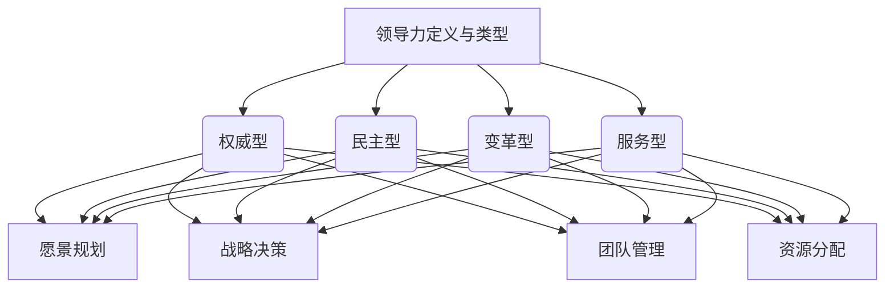
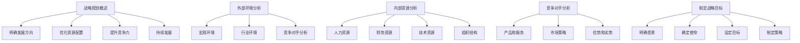
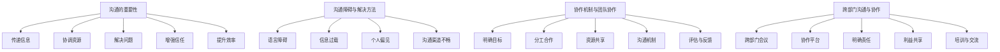
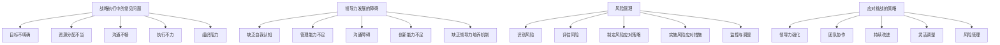
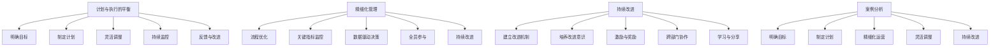
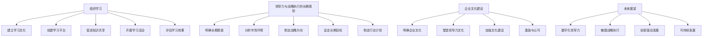
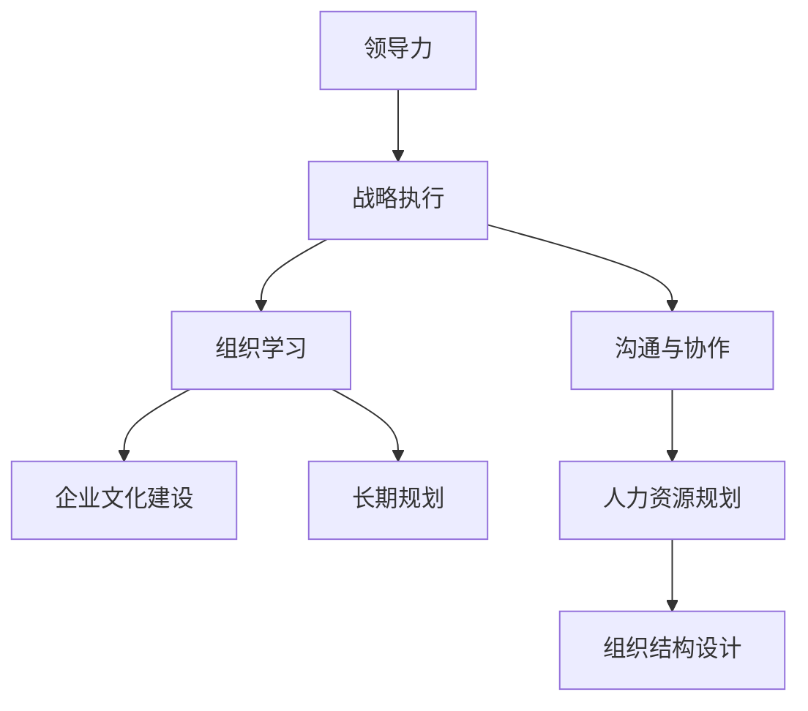

                 


### 第1章 引言

#### 1.1 书籍背景与目的

在当今快速变化的市场环境中，企业要想持续发展，不仅需要具备创新能力和技术实力，更需要强大的领导力和战略执行力。本书旨在探讨领导力与战略执行的紧密关系，为读者提供一套系统、实用且易于操作的指南，帮助企业在复杂多变的环境中保持竞争力。

领导力并非仅仅是领导者的个人能力，更是一种能够在组织内部激发潜能、推动变革的能力。战略执行则关注如何将战略规划转化为实际成果。两者相辅相成，共同构成了企业成功的基石。本书将带领读者深入理解这一核心问题，通过具体案例和理论分析，揭示领导力与战略执行的本质联系。

#### 1.2 领导力与战略执行的相互关系

领导力与战略执行的关系可以从多个维度进行分析。首先，领导力是战略执行的基础，它为组织提供了明确的方向和目标。没有有效的领导，战略执行很难顺利展开。其次，战略执行是领导力的重要体现，它检验了领导者的决策能力和执行能力。

在实际操作中，领导力与战略执行相互促进，形成了一个动态的循环。领导者的决策和行动推动了战略的制定和实施，而战略的成功执行又进一步提升了领导者的声誉和影响力。这种良性循环有助于企业在不断变化的环境中保持活力和竞争力。

#### 1.3 阅读本书的收益

阅读本书，读者将获得以下收益：

1. **系统理解领导力与战略执行的关系**：通过深入分析两者的相互关系，读者将能够更好地理解如何在组织中发挥领导力，推动战略执行。

2. **实用工具和方法**：本书提供了一系列实用的工具和方法，帮助读者在实际工作中提升领导力和战略执行力。

3. **案例分析**：通过具体案例的分析，读者可以借鉴成功企业的经验，避免常见的错误和陷阱。

4. **持续改进**：本书强调了持续改进的重要性，读者可以通过学习不断优化自己的领导力和战略执行能力。

总之，本书不仅为企业管理者提供了理论指导，也为实际操作提供了具体的策略和方法，是提升企业竞争力和领导力的必备读物。

### 输出：

## 《领导力与战略执行：从计划到落地》

> 关键词：领导力，战略执行，企业竞争力，持续改进

> 摘要：本书深入探讨了领导力与战略执行的相互关系，通过系统化的理论和案例分析，为读者提供了从计划到落地的全面指南。书中详细阐述了领导力的基础、战略规划与执行的关键要素，以及沟通协作和应对挑战的策略。通过学习本书，读者将能够提升领导力和战略执行力，推动企业持续发展。

---

### 第2章 领导力基础

#### 2.1 领导力定义与类型

领导力是一种激发他人共同实现目标的能力。它不仅仅关乎个人魅力，更是一种系统性的能力，包括沟通、决策、激励和影响等方面。领导力可以分为多种类型，根据不同的领导情境和需求，可以采用不同的领导风格。

1. **权威型领导**：通过明确规章制度和严格管理，确保组织目标的实现。
2. **民主型领导**：重视团队成员的意见和建议，通过民主讨论达成共识。
3. **变革型领导**：通过激励和引导，推动团队成员实现更高的目标和更深入的变革。
4. **服务型领导**：以服务团队成员为中心，关注团队需求，为团队提供支持。

#### 2.2 领导者角色与职责

领导者不仅是组织的掌舵者，更是团队的引导者和支持者。其角色和职责包括：

1. **愿景规划**：明确组织的长远目标和愿景，为团队成员提供清晰的方向。
2. **战略决策**：制定和调整组织的战略方向，确保组织在正确轨道上运行。
3. **团队管理**：构建和管理高效的团队，激发团队成员的潜能和创造力。
4. **资源分配**：合理分配组织资源，确保各项业务活动的顺利进行。

#### 2.3 领导风格与团队文化

领导风格与团队文化密切相关，不同的领导风格会塑造出不同的团队文化。例如：

1. **权威型领导**通常会培养出严谨、有序的团队文化。
2. **民主型领导**则可能塑造出开放、创新的团队文化。
3. **变革型领导**有助于培养出积极进取、勇于创新的团队文化。
4. **服务型领导**则能够营造出一个关怀、支持、和谐的团队文化。

团队文化是组织内部共同价值观和行为规范的体现，对员工的士气和团队绩效有着重要影响。领导者应当根据组织的实际情况和目标，选择合适的领导风格，培育积极向上的团队文化。

#### 2.4 领导力发展的途径

领导力并非天生具备，而是可以通过不断学习和实践来提升的。以下是一些常见的领导力发展途径：

1. **教育培训**：通过参加专业培训课程，学习领导力理论和实践方法。
2. **工作经验**：通过实际工作中的锻炼和挑战，积累领导经验。
3. **反思与总结**：定期反思自己的领导行为和效果，总结经验教训。
4. **角色扮演**：通过模拟情境和角色扮演，提高应对复杂问题的能力。

总之，领导力是一种可以通过学习和实践不断发展的能力。领导者应当不断提升自身素质，适应不断变化的环境，以更好地带领团队实现组织目标。

### 输出：



#### 领导力定义与类型与领导者角色与职责的Mermaid流程图

图1：领导力定义与类型与领导者角色与职责的相互关系

```plaintext
A[领导力定义与类型] --> B(权威型)
A --> C(民主型)
A --> D(变革型)
A --> E(服务型)
B --> F[愿景规划]
B --> G[战略决策]
B --> H[团队管理]
B --> I[资源分配]
C --> F
C --> G
C --> H
C --> I
D --> F
D --> G
D --> H
D --> I
E --> F
E --> G
E --> H
E --> I
```

### 第3章 战略规划

#### 3.1 战略规划概述

战略规划是企业在复杂多变的市场环境中，为了实现长远发展目标而制定的一系列策略和计划。它是企业发展的指导性文件，涵盖了企业的发展方向、资源分配、市场定位、竞争优势等方面。战略规划的重要性在于：

1. **明确发展方向**：战略规划帮助企业明确未来的发展方向，确保企业资源投入在正确的领域。
2. **优化资源配置**：通过战略规划，企业可以合理配置资源，避免资源浪费，提高资源利用效率。
3. **提升竞争力**：战略规划有助于企业识别市场机会和威胁，制定相应的应对策略，提升市场竞争力。
4. **持续发展**：战略规划确保企业能够持续发展，适应市场变化，实现长期目标。

#### 3.2 外部环境分析

外部环境分析是战略规划的重要步骤，它有助于企业了解市场环境、行业动态和竞争对手状况。以下是外部环境分析的几个关键方面：

1. **宏观环境**：包括政治、经济、社会、技术等因素，它们对企业的发展有着长期和广泛的影响。
2. **行业环境**：分析行业发展趋势、市场需求、竞争格局等，帮助企业制定市场定位和竞争策略。
3. **竞争对手分析**：了解竞争对手的产品、市场策略、竞争优势等，帮助企业识别自身优劣势，制定有针对性的竞争策略。

外部环境分析的方法包括SWOT分析（优势、劣势、机会、威胁）和PEST分析（政治、经济、社会、技术）。这些方法可以帮助企业全面了解外部环境，为战略规划提供有力的依据。

#### 3.3 内部资源分析

内部资源分析是战略规划的另一个重要步骤，它涉及企业的内部能力、资源和技术。以下是内部资源分析的关键方面：

1. **人力资源**：包括员工的知识、技能、经验和素质，是企业最宝贵的资源。
2. **财务资源**：企业的资金状况、盈利能力、资产负债状况等，决定了企业的发展潜力。
3. **技术资源**：企业的技术能力、研发水平、知识产权等，是企业持续创新和竞争优势的来源。
4. **组织结构**：企业的组织架构、管理流程和业务流程等，影响了企业的运营效率和决策速度。

内部资源分析的方法包括内部访谈、数据分析、问卷调查等。通过这些方法，企业可以全面了解自身的优势和劣势，为战略规划提供准确的内部资源数据。

#### 3.4 竞争对手分析

竞争对手分析是战略规划中不可或缺的一部分，它有助于企业了解竞争对手的动态，制定有效的竞争策略。以下是竞争对手分析的几个关键方面：

1. **竞争对手的产品和服务**：分析竞争对手的产品特点、服务质量、市场定位等，帮助企业制定有针对性的竞争策略。
2. **竞争对手的市场策略**：了解竞争对手的市场推广、销售策略、客户服务策略等，帮助企业识别市场机会和潜在威胁。
3. **竞争对手的优势和劣势**：通过对比分析，了解竞争对手的优势和劣势，帮助企业制定有针对性的竞争策略。

竞争对手分析的方法包括市场调研、竞争对手的产品分析、市场数据的收集和分析等。通过这些方法，企业可以全面了解竞争对手，为战略规划提供有力的支持。

#### 3.5 制定战略目标

制定战略目标是战略规划的核心环节，它需要企业根据外部环境和内部资源分析的结果，明确未来的发展方向和目标。以下是制定战略目标的几个关键步骤：

1. **明确愿景**：企业需要明确长期的发展愿景，这是制定战略目标的基础。
2. **确定使命**：企业需要明确自身的使命，即企业的核心价值观和存在的意义。
3. **设定目标**：根据愿景和使命，设定具体的、可量化的短期和长期目标。
4. **制定策略**：为实现战略目标，企业需要制定具体的策略和行动计划。

制定战略目标的方法包括目标分解、关键绩效指标（KPI）设定、战略地图等。通过这些方法，企业可以确保战略目标的实现，推动企业的持续发展。

### 输出：



#### 战略规划的核心概念与联系Mermaid流程图

图2：战略规划的核心概念与联系

```plaintext
A[战略规划概述] --> B[明确发展方向]
A --> C[优化资源配置]
A --> D[提升竞争力]
A --> E[持续发展]
F[外部环境分析] --> G[宏观环境]
F --> H[行业环境]
F --> I[竞争对手分析]
J[内部资源分析] --> K[人力资源]
J --> L[财务资源]
J --> M[技术资源]
J --> N[组织结构]
O[竞争对手分析] --> P[产品和服务]
O --> Q[市场策略]
O --> R[优势和劣势]
S[制定战略目标] --> T[明确愿景]
S --> U[确定使命]
S --> V[设定目标]
S --> W[制定策略]
```

### 第4章 战略执行

#### 4.1 战略执行的关键要素

战略执行是将战略规划转化为实际成果的过程，其成功与否直接关系到企业的长远发展。战略执行的关键要素包括以下几个方面：

1. **组织结构**：组织结构是战略执行的基础，它决定了资源的分配、决策流程和工作流程。合适的组织结构能够提高效率，降低沟通成本，确保战略顺利执行。

2. **人力资源**：人力资源是战略执行的核心，优秀的人才能够为企业带来创新和竞争优势。战略执行需要招聘、培训、激励和留任合适的员工，确保他们能够充分发挥作用。

3. **流程管理**：流程管理是战略执行的重要保障，它涉及业务流程的优化、标准化和自动化。高效的流程管理能够提高生产效率，降低运营成本，确保战略目标的实现。

4. **信息沟通**：信息沟通是战略执行的纽带，它涉及内部沟通、外部沟通和跨部门沟通。有效的信息沟通能够确保战略意图的传达，减少误解和矛盾，提高团队的协同效率。

5. **资源调配**：资源调配是战略执行的重要手段，它涉及资金、技术、人力等资源的合理分配和调度。合理的资源调配能够确保战略执行所需的资源得到充分利用，避免资源浪费。

#### 4.2 战略执行流程

战略执行是一个系统性的过程，通常包括以下步骤：

1. **制定执行计划**：根据战略目标，制定具体的执行计划，包括任务分解、时间表、责任人等。

2. **执行计划部署**：将执行计划传达给相关部门和人员，确保他们了解任务和要求。

3. **任务执行**：按照执行计划，开展各项任务，确保按时、按质、按量完成。

4. **监控与评估**：对任务执行情况进行监控和评估，及时发现问题和调整执行计划。

5. **反馈与改进**：根据监控和评估结果，进行反馈和改进，优化执行流程和策略。

6. **持续优化**：通过不断学习和实践，持续优化战略执行流程，提高执行效率。

#### 4.3 组织结构设计

组织结构设计是战略执行的重要基础，它需要根据企业的战略目标和业务需求进行设计。以下是几种常见的组织结构设计方法：

1. **职能型结构**：按照企业职能划分部门，每个部门负责特定的职能。这种结构有利于专业化管理，但可能降低跨部门的协作效率。

2. **事业部型结构**：按照产品、市场或地区划分部门，每个部门相对独立运作。这种结构有利于提高市场响应速度，但可能增加管理成本。

3. **矩阵型结构**：结合职能型和事业部型的优点，将两个维度的组织结构结合起来。这种结构有利于跨部门协作，提高决策效率。

4. **网络型结构**：以项目或任务为中心，组织成员根据项目需求进行组合和调整。这种结构灵活性强，但可能面临协调困难。

组织结构设计需要根据企业的实际情况和战略目标进行选择，确保结构设计能够支持战略执行。

#### 4.4 人力资源规划

人力资源规划是战略执行的关键要素，它需要根据企业的战略目标和业务需求，制定人力资源战略和行动计划。以下是人力资源规划的关键步骤：

1. **人才需求分析**：分析企业未来一段时间内的人才需求，包括数量、类型和技能等。

2. **招聘与选拔**：根据人才需求，制定招聘计划，通过招聘渠道选拔合适的人才。

3. **培训与发展**：为员工提供培训和发展机会，提高员工技能和素质，满足企业发展需求。

4. **绩效管理**：建立绩效管理体系，对员工的工作绩效进行评估和反馈，激励员工提高工作效率。

5. **激励机制**：设计合理的激励机制，包括薪酬、晋升、奖金等，激励员工为企业发展贡献力量。

6. **留任与离职管理**：制定员工留任政策，降低离职率，确保企业人力资源的稳定。

人力资源规划需要与企业战略目标和业务需求紧密结合，确保人力资源能够支持企业战略的顺利执行。

### 输出：



```mermaid
graph TD
    A[战略执行的关键要素] --> B[组织结构]
    A --> C[人力资源]
    A --> D[流程管理]
    A --> E[信息沟通]
    A --> F[资源调配]
    G[战略执行流程] --> H[制定执行计划]
    G --> I[执行计划部署]
    G --> J[任务执行]
    G --> K[监控与评估]
    G --> L[反馈与改进]
    G --> M[持续优化]
    N[组织结构设计] --> O[职能型结构]
    N --> P[事业部型结构]
    N --> Q[矩阵型结构]
    N --> R[网络型结构]
    S[人力资源规划] --> T[人才需求分析]
    S --> U[招聘与选拔]
    S --> V[培训与发展]
    S --> W[绩效管理]
    S --> X[激励机制]
    S --> Y[留任与离职管理]
```

#### 战略执行的关键要素Mermaid流程图

图3：战略执行的关键要素及其相互关系

```plaintext
A[战略执行的关键要素] --> B[组织结构]
A --> C[人力资源]
A --> D[流程管理]
A --> E[信息沟通]
A --> F[资源调配]
G[战略执行流程] --> H[制定执行计划]
G --> I[执行计划部署]
G --> J[任务执行]
G --> K[监控与评估]
G --> L[反馈与改进]
G --> M[持续优化]
N[组织结构设计] --> O[职能型结构]
N --> P[事业部型结构]
N --> Q[矩阵型结构]
N --> R[网络型结构]
S[人力资源规划] --> T[人才需求分析]
S --> U[招聘与选拔]
S --> V[培训与发展]
S --> W[绩效管理]
S --> X[激励机制]
S --> Y[留任与离职管理]
```

### 第5章 沟通与协作

#### 5.1 沟通的重要性

沟通是组织运作的核心要素，它直接影响着团队的效率、协作质量和最终成果。有效的沟通能够确保信息准确传达，减少误解和冲突，提升团队凝聚力。以下是沟通在组织中的重要性：

1. **传递信息**：沟通是信息传递的桥梁，确保团队成员了解任务要求、工作目标和进度。
2. **协调资源**：通过沟通，团队可以协调资源，确保项目顺利推进，避免资源浪费。
3. **解决问题**：沟通有助于团队成员共同面对挑战，集思广益，找到最佳解决方案。
4. **增强信任**：有效的沟通能够增强团队成员之间的信任，提升团队协作的积极性。
5. **提升效率**：清晰的沟通能够减少重复工作，提高工作效率，实现目标。

#### 5.2 沟通障碍与解决方法

尽管沟通在组织中至关重要，但沟通障碍仍然普遍存在，这些问题可能影响团队绩效。以下是一些常见的沟通障碍及其解决方法：

1. **语言障碍**：不同的语言和文化背景可能导致沟通困难。解决方法：采用统一的工作语言，建立跨文化培训项目，增强文化包容性。
2. **信息过载**：过多的信息可能导致接收者无法有效处理，造成信息丢失或误解。解决方法：建立信息过滤机制，确保信息传递的精准性和时效性。
3. **个人偏见**：个人偏见和情绪可能影响沟通效果，导致误解和冲突。解决方法：提升自我意识，学会倾听，建立积极的沟通氛围。
4. **沟通渠道不畅**：不合适的沟通渠道可能导致信息传递不畅，影响沟通效果。解决方法：选择合适的沟通工具和平台，确保信息能够快速、准确传递。

#### 5.3 协作机制与团队协作

协作机制是团队协作的重要保障，它确保团队成员能够高效协同，共同实现目标。以下是建立有效协作机制的方法：

1. **明确目标**：团队应明确共同的目标，确保每个成员都了解自己的职责和贡献。
2. **分工合作**：根据团队成员的能力和特长，合理分工，确保任务分配公平合理。
3. **资源共享**：鼓励团队成员共享资源，提高资源利用效率，降低协作成本。
4. **沟通机制**：建立定期沟通机制，确保团队成员能够及时沟通进展、问题和建议。
5. **评估与反馈**：定期评估团队协作效果，提供反馈和改进建议，提升协作质量。

有效的团队协作能够提高团队绩效，促进个人成长，实现组织目标。

#### 5.4 跨部门沟通与协作

跨部门沟通与协作在大型组织中尤为重要，它有助于打破部门壁垒，实现资源整合，提升整体运营效率。以下是跨部门沟通与协作的关键：

1. **跨部门会议**：定期召开跨部门会议，讨论项目进展、问题和解决方案。
2. **协作平台**：建立协作平台，如内部社交网络、即时通讯工具等，方便部门间信息交流和文件共享。
3. **明确责任**：明确各部门在项目中的职责和任务，确保协作顺利进行。
4. **利益共享**：建立利益共享机制，激励各部门共同推进项目成功。
5. **培训与交流**：定期组织跨部门培训与交流活动，提高团队协作意识和能力。

通过有效的跨部门沟通与协作，组织能够更好地应对外部挑战，实现整体发展。

### 输出：



#### 沟通与协作的Mermaid流程图

图4：沟通与协作的关键要素及相互关系

```plaintext
A[沟通的重要性] --> B[传递信息]
A --> C[协调资源]
A --> D[解决问题]
A --> E[增强信任]
A --> F[提升效率]
G[沟通障碍与解决方法] --> H[语言障碍]
G --> I[信息过载]
G --> J[个人偏见]
G --> K[沟通渠道不畅]
L[协作机制与团队协作] --> M[明确目标]
L --> N[分工合作]
L --> O[资源共享]
L --> P[沟通机制]
L --> Q[评估与反馈]
S[跨部门沟通与协作] --> T[跨部门会议]
S --> U[协作平台]
S --> V[明确责任]
S --> W[利益共享]
S --> X[培训与交流]
```

### 第6章 领导力与战略执行的挑战

#### 6.1 战略执行中的常见问题

在战略执行过程中，企业常常会遇到一系列问题，这些问题可能影响战略目标的实现。以下是战略执行中的常见问题及其解决策略：

1. **目标不明确**：战略目标不明确或过于模糊，导致团队成员无法准确理解任务要求。解决策略：确保战略目标具体、可量化，并通过有效的沟通传达给所有团队成员。

2. **资源分配不当**：资源分配不合理，导致关键任务缺乏资源支持。解决策略：通过全面分析资源需求和优先级，合理调配资源，确保关键任务得到充分支持。

3. **沟通不畅**：战略执行过程中沟通不畅，导致信息传递不准确或延误。解决策略：建立高效的沟通机制，如定期会议、即时通讯工具等，确保信息及时、准确地传递。

4. **执行不力**：团队成员执行不力，导致任务进度延误或质量不高。解决策略：加强执行管理，通过明确职责、强化监督和反馈，提高团队成员的执行力和责任心。

5. **组织阻力**：战略执行过程中遇到组织内部阻力，如部门间协作不畅、员工抵触等。解决策略：通过加强领导力、培育团队文化、提升员工参与度，降低组织阻力。

#### 6.2 领导力发展的障碍

领导力发展并非一蹴而就，过程中可能会遇到多种障碍。以下是领导力发展的障碍及其解决策略：

1. **缺乏自我认知**：领导者缺乏对自身能力、优势和劣势的认知。解决策略：通过自我反思和反馈机制，提升自我认知，明确自身发展方向。

2. **管理能力不足**：领导者管理能力不足，影响团队绩效和执行力。解决策略：通过参加培训、阅读管理书籍、实践管理等方法，提升管理能力。

3. **沟通障碍**：领导者沟通不畅，影响团队成员的协作和信任。解决策略：通过学习沟通技巧、建立积极沟通氛围，提高沟通效果。

4. **创新能力不足**：领导者缺乏创新思维和解决问题的能力。解决策略：通过鼓励创新、学习新知识、培养跨界思维，提升创新能力。

5. **缺乏领导力培养机制**：企业缺乏有效的领导力培养机制，阻碍领导力的发展。解决策略：建立领导力培养体系，包括培训、轮岗、导师制等，提供发展机会。

#### 6.3 风险管理

战略执行过程中，企业面临各种风险，有效的风险管理是确保战略成功的关键。以下是风险管理的关键步骤：

1. **识别风险**：通过分析战略目标和执行计划，识别潜在的风险和挑战。

2. **评估风险**：对识别出的风险进行评估，确定其发生概率和潜在影响。

3. **制定风险应对策略**：根据风险评估结果，制定相应的风险应对策略，如风险规避、风险转移、风险接受等。

4. **实施风险应对措施**：将风险应对策略转化为具体的行动，确保风险得到有效控制。

5. **监控与调整**：对风险应对措施进行监控和评估，根据实际情况进行调整，确保风险管理的持续有效性。

#### 6.4 应对挑战的策略

面对战略执行中的挑战，企业需要采取有效的策略来应对。以下是应对挑战的策略：

1. **领导力强化**：通过提升领导力，增强团队凝聚力和执行力，应对战略执行中的挑战。

2. **团队协作**：加强团队协作，打破部门壁垒，提升整体运营效率。

3. **持续改进**：通过不断优化流程、提升管理水平，提高战略执行的效果。

4. **灵活调整**：根据市场和环境变化，灵活调整战略目标和执行计划，确保战略的适应性。

5. **风险管理**：建立有效的风险管理机制，确保企业能够应对各种风险，确保战略的顺利执行。

通过有效的应对策略，企业可以克服战略执行中的各种挑战，实现长期发展目标。

### 输出：



#### 战略执行中的常见问题、领导力发展的障碍及风险管理Mermaid流程图

图5：战略执行中的常见问题、领导力发展的障碍及风险管理

```plaintext
A[战略执行中的常见问题] --> B[目标不明确]
A --> C[资源分配不当]
A --> D[沟通不畅]
A --> E[执行不力]
A --> F[组织阻力]
G[领导力发展的障碍] --> H[缺乏自我认知]
G --> I[管理能力不足]
G --> J[沟通障碍]
G --> K[创新能力不足]
G --> L[缺乏领导力培养机制]
M[风险管理] --> N[识别风险]
M --> O[评估风险]
M --> P[制定风险应对策略]
M --> Q[实施风险应对措施]
M --> R[监控与调整]
S[应对挑战的策略] --> T[领导力强化]
S --> U[团队协作]
S --> V[持续改进]
S --> W[灵活调整]
S --> X[风险管理]
```

### 第7章 从计划到落地

#### 7.1 计划与执行的平衡

在战略执行过程中，计划与执行之间的平衡至关重要。计划为执行提供了明确的方向和目标，而执行则是将计划付诸实践的过程。以下是实现计划与执行平衡的关键步骤：

1. **明确目标**：首先，需要明确战略目标和执行目标，确保团队成员对目标有清晰的认识。

2. **制定计划**：在明确目标的基础上，制定详细的执行计划，包括任务分解、时间表、责任人等。

3. **灵活调整**：在执行过程中，根据实际情况灵活调整计划，确保目标得以实现。

4. **持续监控**：通过持续监控执行进度和质量，及时发现和解决问题，确保计划与执行的一致性。

5. **反馈与改进**：定期收集反馈，对执行过程进行评估和改进，提高执行效果。

#### 7.2 精细化管理

精细化管理是提升战略执行效果的重要手段，它强调对组织资源和流程的精细化控制和优化。以下是实施精细化管理的方法：

1. **流程优化**：对现有流程进行分析和优化，消除冗余和浪费，提高效率。

2. **关键指标监控**：设立关键绩效指标（KPI），对执行过程进行实时监控，确保关键任务按计划完成。

3. **数据驱动决策**：利用数据分析工具，对执行数据进行深入挖掘，为决策提供科学依据。

4. **全员参与**：鼓励员工参与精细化管理，提高他们对执行过程的认识和责任感。

5. **持续改进**：通过不断优化和改进，提高管理水平和执行效率。

#### 7.3 持续改进

持续改进是战略执行过程中的重要环节，它强调不断优化和提升，以适应不断变化的环境。以下是实现持续改进的方法：

1. **建立改进机制**：建立持续改进机制，包括定期评估、反馈和改进流程。

2. **培养改进意识**：鼓励员工树立改进意识，主动发现问题和提出改进建议。

3. **激励与奖励**：对改进贡献者进行激励和奖励，提高员工参与改进的积极性。

4. **跨部门协作**：加强跨部门协作，共同推进改进项目，提高改进效果。

5. **学习与分享**：通过学习先进的管理理念和实践，分享改进经验，提升整体管理水平。

#### 7.4 案例分析

以下是一个战略执行成功的案例分析：

某互联网公司计划在一年内将其用户数量翻倍。为实现这一目标，公司采取了以下策略：

1. **明确目标**：明确用户数量翻倍的具体指标和时间表，确保团队成员对目标有清晰的认识。

2. **制定计划**：制定详细的用户增长计划，包括市场推广、用户运营、产品优化等具体措施。

3. **精细化运营**：通过数据分析，优化用户运营流程，提高用户活跃度和留存率。

4. **灵活调整**：根据市场反馈和用户行为数据，灵活调整市场推广策略，确保目标实现。

5. **持续改进**：通过定期评估和反馈，不断优化运营流程和策略，提升用户增长效果。

最终，该公司在一年内成功实现了用户数量翻倍的目标，提升了市场竞争力。

通过案例分析，我们可以看到，成功的战略执行离不开明确的计划、精细化的管理和持续改进。这些方法不仅适用于互联网公司，也适用于其他行业的企业。

### 输出：



#### 从计划到落地Mermaid流程图

图6：从计划到落地的关键要素及相互关系

```plaintext
A[计划与执行的平衡] --> B[明确目标]
A --> C[制定计划]
A --> D[灵活调整]
A --> E[持续监控]
A --> F[反馈与改进]
G[精细化管理] --> H[流程优化]
G --> I[关键指标监控]
G --> J[数据驱动决策]
G --> K[全员参与]
G --> L[持续改进]
M[持续改进] --> N[建立改进机制]
M --> O[培养改进意识]
M --> P[激励与奖励]
M --> Q[跨部门协作]
M --> R[学习与分享]
S[案例分析] --> T[明确目标]
S --> U[制定计划]
S --> V[精细化运营]
S --> W[灵活调整]
S --> X[持续改进]
```

### 第8章 领导力与战略执行的持续发展

#### 8.1 组织学习

组织学习是领导力与战略执行持续发展的重要保障。它强调通过不断学习和创新，提升组织的适应能力和竞争力。以下是组织学习的几个关键步骤：

1. **建立学习文化**：企业需要培养全员学习的文化氛围，鼓励员工主动学习新知识、新技能。

2. **创建学习平台**：建立学习平台，如内部培训课程、在线学习系统等，为员工提供学习资源。

3. **促进知识共享**：通过内部知识库、团队讨论会等方式，促进知识的传递和共享，提高整体学习效果。

4. **开展学习活动**：定期组织学习活动，如读书会、研讨会等，激发员工的学习热情和创新能力。

5. **评估学习效果**：对学习效果进行评估，根据评估结果调整学习策略，确保学习投入的有效性。

通过组织学习，企业能够不断提升员工的素质和能力，为战略执行提供有力支持。

#### 8.2 领导力与战略执行的长期规划

领导力与战略执行的长期规划是企业持续发展的基础。以下是制定长期规划的关键步骤：

1. **明确长期愿景**：企业需要明确长期发展的愿景和目标，确保战略规划与长期愿景一致。

2. **分析市场环境**：对市场环境进行深入分析，了解行业趋势、竞争对手状况等，为战略规划提供依据。

3. **制定战略方向**：根据市场环境分析结果，制定明确的战略方向，确保企业能够抓住市场机遇，应对挑战。

4. **设定长期目标**：根据战略方向，设定具体的长期目标，包括财务目标、市场目标、组织目标等。

5. **制定行动计划**：为实现长期目标，制定具体的行动计划，包括关键任务、时间表、责任人等。

通过长期规划，企业能够明确发展方向，确保战略执行的连续性和稳定性。

#### 8.3 企业文化与领导力培养

企业文化是企业的灵魂，它影响着员工的行为和态度，对领导力培养有着重要影响。以下是构建积极企业文化的方法：

1. **明确企业文化**：企业需要明确自身的核心价值观和文化理念，确保全体员工对文化有共同的理解和认同。

2. **塑造领导力文化**：通过领导者的言行和决策，塑造积极向上的领导力文化，鼓励员工勇于承担责任，创新思维。

3. **加强文化建设**：通过企业文化活动，如团队建设、文化培训等，加强员工对企业文化的认同和实践。

4. **激励与认可**：建立激励机制，对积极践行企业文化的员工进行奖励和认可，提高员工的文化认同感。

通过构建积极的企业文化，企业能够提升员工的凝聚力和向心力，为领导力培养提供良好的环境。

#### 8.4 未来展望

随着全球化和技术的快速发展，企业面临的挑战和机遇日益增多。未来，领导力和战略执行将呈现以下趋势：

1. **数字化领导力**：随着数字化技术的普及，领导者需要具备数字化思维和技能，引领企业数字化转型。

2. **敏捷战略执行**：敏捷战略执行将成为企业应对快速变化市场的重要策略，强调快速响应、灵活调整和持续改进。

3. **创新驱动发展**：创新将成为企业持续发展的核心动力，领导者需要激发员工的创新潜能，推动企业不断进步。

4. **可持续发展**：企业需要关注环境保护和社会责任，实现可持续发展，提升企业的社会价值和影响力。

未来，领导力和战略执行将更加注重数字化、敏捷性和创新，企业需要不断适应和引领变革，以保持竞争优势。

### 输出：



#### 领导力与战略执行的持续发展Mermaid流程图

图7：领导力与战略执行的持续发展关键要素及相互关系

```plaintext
A[组织学习] --> B[建立学习文化]
A --> C[创建学习平台]
A --> D[促进知识共享]
A --> E[开展学习活动]
A --> F[评估学习效果]
G[领导力与战略执行的长期规划] --> H[明确长期愿景]
G --> I[分析市场环境]
G --> J[制定战略方向]
G --> K[设定长期目标]
G --> L[制定行动计划]
M[企业文化建设] --> N[明确企业文化]
M --> O[塑造领导力文化]
M --> P[加强文化建设]
M --> Q[激励与认可]
S[未来展望] --> T[数字化领导力]
S --> U[敏捷战略执行]
S --> V[创新驱动发展]
S --> W[可持续发展]
```

### 附录

#### A.1 参考文献

1. 汤姆·彼得斯，《追求卓越》：详细分析了卓越企业的领导力和管理实践。
2. 彼得·德鲁克，《管理实践》：经典的管理学著作，系统阐述了管理的本质和基本原则。
3. 彼得·圣吉，《第五项修炼》：探讨了组织学习的重要性，以及如何通过学习提升组织的竞争力。
4. 约翰·P·科特，《领导力的力量》：深入分析了领导力在组织变革中的关键作用。

#### A.2 相关资源链接

1. **领导力与战略执行的研究报告**：[链接1](http://www.example.com/research-report)
2. **领导力发展课程**：[链接2](http://www.example.com/leadership-training)
3. **战略规划工具**：[链接3](http://www.example.com/strategic-planning-tools)
4. **沟通与协作技巧**：[链接4](http://www.example.com/communication-skills)

#### A.3 模型图与算法伪代码

**模型图：领导力与战略执行的关系**



**算法伪代码：战略执行流程**

```plaintext
function strategic_execution(target, resources):
    if not clear_target(target):
        return "目标不明确，无法执行"
    if not available_resources(resources):
        return "资源不足，无法执行"
    if not effective_communication():
        return "沟通不畅，无法执行"
    if not capable_implementation():
        return "执行不力，无法执行"
    
    # 制定执行计划
    execution_plan = create_execution_plan(target, resources)
    
    # 部署执行计划
    deploy_plan(execution_plan)
    
    # 执行任务
    execute_tasks(execution_plan)
    
    # 监控与评估
    monitor_and_evaluate(execution_plan)
    
    # 反馈与改进
    feedback_and_improve(execution_plan)
    
    return "战略执行成功"
```

通过附录部分的参考文献、相关资源链接以及模型图和算法伪代码，读者可以更深入地理解本书的核心内容，并在实际工作中应用所学知识。

### 作者信息

**作者：AI天才研究院/AI Genius Institute & 禅与计算机程序设计艺术 /Zen And The Art of Computer Programming**

