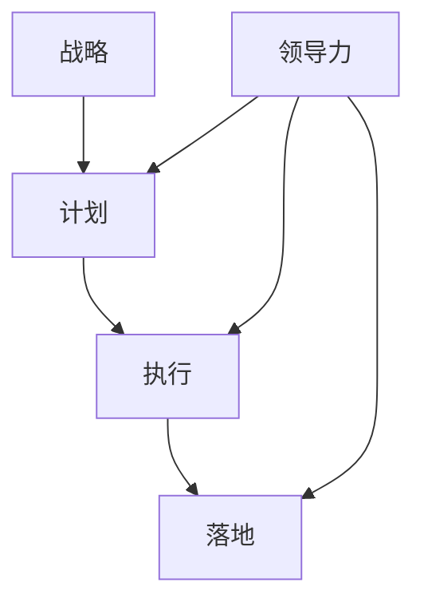
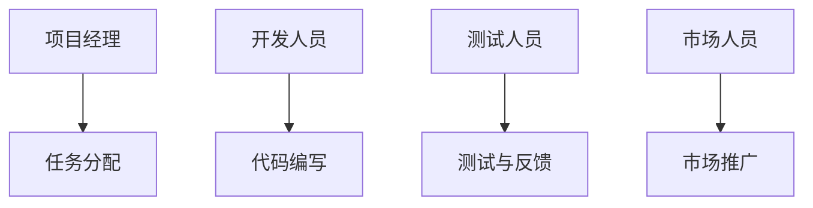

                 

### 背景介绍

在当今复杂多变的市场环境中，企业的成功不仅仅依赖于卓越的产品和服务，更取决于如何有效实施战略规划。领导力与战略执行成为企业持续发展的关键因素。领导力，指的是领导者通过影响、激励和引导他人，实现组织目标的能力。而战略执行，则是将战略计划转化为实际成果的过程。

在IT领域，领导力和战略执行的重要性尤为突出。技术日新月异，市场需求不断变化，如何快速适应并抢占市场先机，是企业面临的重要挑战。有效的领导力能够帮助IT企业培养创新思维，提升团队协作效率，从而确保战略规划的顺利实施。同时，战略执行的成功离不开科学的计划和高效的资源管理，这对于IT项目尤其重要，因为IT项目往往具有高复杂性和高风险性。

本文旨在深入探讨领导力与战略执行的关系，并详细阐述从计划到落地的全过程。我们将通过以下几个核心部分展开讨论：

1. **领导力的定义与类型**：介绍领导力的基本概念，不同类型的领导风格及其在实际应用中的表现。
2. **领导力模型与特质**：分析领导力模型，探讨领导力的内在和外在特质，以及如何进行领导力评估。
3. **领导力发展与实践**：探讨领导力培养和发展路径，通过案例分析展示成功的领导实践和领导失败的原因。
4. **战略规划与设定**：详细阐述战略规划的过程，目标设定和优先级管理的方法。
5. **资源分配与执行计划**：介绍资源分配策略和执行计划的制定，确保资源得到最优化利用。
6. **执行策略与团队协作**：探讨执行策略的制定和团队协作的关键技巧，包括沟通和团队建设策略。
7. **监督与调整**：讨论如何通过绩效评估和反馈机制来监督执行过程，以及如何进行战略调整和优化。

通过以上各部分的详细讲解，本文希望能够为IT企业的领导者提供实用的理论指导和实践建议，帮助他们在快速变化的市场环境中实现战略目标，推动企业的长期发展。

### 核心概念与联系

在深入探讨领导力与战略执行的关系之前，有必要首先明确几个核心概念及其相互关系。以下是本文中涉及到的核心概念：

1. **领导力**：领导力是领导者通过影响、激励和引导他人，以实现组织目标的能力。它不仅包括领导者的个人特质和风格，还涉及到领导过程中的行为和互动。
2. **战略**：战略是组织为实现长期目标而制定的总体计划和行动方针。它包括市场定位、竞争优势、资源配置和风险管理等多个方面。
3. **战略执行**：战略执行是将战略计划转化为实际成果的过程。它涉及具体的行动计划、执行策略、资源调配和绩效监控等。
4. **计划**：计划是战略执行的基础，它包括目标设定、任务分配、时间安排和资源配置等。
5. **落地**：落地是指将战略和计划付诸实施，确保各项措施得到有效执行。

这些概念之间的关系可以通过以下Mermaid流程图来展示：

- **战略**是组织发展的总体方向，需要通过**计划**进行具体化，再通过**执行**转化为实际行动，最终通过**落地**实现目标。
- **领导力**在这个过程中起到关键作用，通过影响和引导，确保计划能够被有效执行，并最终实现落地。

具体来说，领导力在战略执行中的角色主要体现在以下几个方面：

1. **目标设定**：领导力能够帮助确定清晰、可行的战略目标，并通过沟通和激励确保团队成员理解和认同这些目标。
2. **资源调配**：领导力能够有效地识别和分配资源，确保资源在战略执行过程中的最优化利用。
3. **执行策略制定**：领导力在制定执行策略时发挥重要作用，通过不同的领导风格和技巧，确保策略能够被有效执行。
4. **团队协作**：领导力能够促进团队内部的协作和沟通，提升团队执行力和创新能力。
5. **绩效监控与反馈**：领导力通过监督和评估绩效，及时反馈和调整执行过程，确保战略目标能够顺利实现。

通过以上流程图和概念关系分析，我们可以看出，领导力和战略执行是相辅相成的。领导力不仅为战略执行提供方向和动力，同时也是确保战略落地的重要保障。在接下来的部分中，我们将进一步探讨这些核心概念的详细内容和具体应用。

### 领导力模型与特质

在探讨领导力的具体应用之前，有必要深入理解不同的领导力模型和特质。领导力模型可以帮助我们系统地分析领导行为，而领导特质则是领导者成功的关键因素。以下将介绍几种常见的领导力模型及其背后的特质。

#### 领导力模型

**1. 领导力三角模型**

领导力三角模型认为，领导力由三个主要方面构成：技术能力、人际能力和概念能力。这三个方面共同决定了领导者的整体领导力水平。

- **技术能力**：指领导者掌握和运用特定领域知识和技术的能力。对于IT企业而言，技术能力是确保项目成功的关键。
- **人际能力**：指领导者与他人建立和维持关系的能力，包括沟通、激励和团队建设。人际能力对于提升团队协作和员工满意度至关重要。
- **概念能力**：指领导者把握全局、进行战略思考和决策的能力。这对于企业的长远发展具有决定性影响。

**2. 领导力冰山模型**

领导力冰山模型将领导力分为表层特质和深层特质，其中表层特质包括知识和技能，而深层特质则包括价值观、自我认知和动机。

- **表层特质**：如沟通技巧、项目管理能力等，是可以通过培训和学习获得的。
- **深层特质**：如对团队的承诺、自我激励和道德价值观，是内在的、不易察觉的特质，对领导者的长期影响更为深远。

#### 领导力特质

**1. 内在特质**

内在特质是指领导者固有的、深层次的个性特征，它们对领导行为有长期的、决定性的影响。

- **自信**：自信的领导者能够激励团队克服困难，勇于面对挑战。
- **诚实与透明**：诚实的领导者能够赢得团队的信任，提高组织的透明度和信任度。
- **决策能力**：决策能力强的领导者能够在复杂情况下迅速做出正确的决策，从而确保组织目标的实现。

**2. 外在特质**

外在特质是指领导者通过行为和互动表现出来的特征，它们可以通过培训和实践进行改善。

- **激励与鼓励**：领导者通过激励和鼓励，提升团队成员的积极性和创造力。
- **沟通技巧**：有效的沟通技巧能够确保信息准确传达，减少误解和冲突。
- **变革管理**：领导者需要具备推动变革的能力，以适应市场变化和技术革新。

#### 领导力特质评估

为了提升领导力水平，进行领导力特质评估是非常重要的。以下是一些常用的评估方法：

- **360度评估**：通过团队成员、上级和下属的反馈，对领导者的各个方面进行综合评估。
- **行为事件访谈（BEI）**：通过深入访谈，了解领导者如何在不同情境下应对挑战。
- **领导力测评工具**：如MBTI（性格类型指标）和360度反馈问卷，帮助领导者识别自身优势和不足。

通过领导力模型和特质的深入分析，我们可以更好地理解领导力的本质，并在实践中进行有针对性的提升。在接下来的部分中，我们将探讨领导力的发展路径和实践案例，以进一步说明如何在实际中应用这些理论。

### 领导力发展与实践

领导力并非与生俱来，而是可以通过学习和实践不断提升的。领导力的发展路径包括领导力培养、领导力提升策略以及领导力实践中的应用。以下是详细探讨这些方面的内容。

#### 领导力培养

**1. 领导力培训课程**

领导力培训是提升领导者能力的重要途径。通过系统的培训课程，领导者可以学习到最新的领导理论、管理技能和实践方法。这些课程通常包括以下几个方面：

- **领导理论基础**：介绍领导力的基本概念、模型和理论，帮助领导者建立系统化的领导思维。
- **管理技能培训**：涵盖沟通技巧、团队建设、决策能力等方面的具体技能，提升领导者的实际管理能力。
- **情境模拟**：通过模拟实际工作场景，让领导者练习如何应对不同情境，提高其应对复杂问题的能力。

**2. 实战训练**

领导力培养不仅依赖于理论知识的积累，更需要通过实战训练来提升。实战训练包括以下几种形式：

- **轮岗锻炼**：通过在不同部门和岗位的工作，领导者可以全面了解企业的运作模式，提升跨部门协作和综合管理能力。
- **项目管理**：让领导者负责具体的项目，从项目规划到执行，全面掌握项目管理的方法和技巧。
- **跨文化领导**：在全球化的背景下，领导者需要具备跨文化沟通和管理的技能。通过跨文化训练，领导者可以更好地适应不同文化环境。

#### 领导力提升策略

**1. 自我反思**

自我反思是领导力提升的重要方法。领导者需要定期进行自我反思，分析自身在领导过程中的优点和不足，找到改进的方向。自我反思可以通过以下方式进行：

- **日记记录**：领导者可以每天记录自己的工作日志，包括遇到的问题、解决方案和心得体会。
- **领导笔记**：将工作中的重要事件和感悟记录下来，形成自己的领导笔记，便于后续回顾和总结。
- **导师指导**：通过导师的指导，领导者可以更深入地分析自身的行为和思维模式，获得宝贵的反馈和建议。

**2. 不断学习**

学习是领导力提升的持续动力。领导者需要不断学习最新的管理理念、技术知识和行业动态，以保持自身的竞争力。以下是一些学习途径：

- **参加行业会议和论坛**：通过参加行业会议和论坛，领导者可以了解行业趋势、结识业界精英，拓宽视野。
- **在线课程和阅读**：利用在线课程和阅读书籍、文章，领导者可以系统地学习领导力理论和实践方法。
- **实践学习**：在实际工作中，通过不断尝试和反思，领导者可以将理论知识转化为实践经验，不断提升自身的领导能力。

#### 领导力实践案例分析

**1. 成功领导实践**

成功的领导实践能够为其他领导者提供宝贵的经验和启示。以下是几个成功领导实践的案例：

- **案例1：苹果公司的史蒂夫·乔布斯**：乔布斯通过独特的产品设计理念和强烈的愿景，成功带领苹果公司实现了一系列创新，推动了整个科技行业的变革。
- **案例2：谷歌的拉里·佩奇和谢尔盖·布林**：佩奇和布林通过开放的文化、灵活的管理方式和卓越的技术创新能力，将谷歌建设成为全球领先的科技公司。

**2. 领导失败案例分析**

领导失败不仅会对企业造成损失，还会影响领导者的声誉和职业发展。以下是几个领导失败案例的分析：

- **案例1：诺基亚前CEO史蒂芬·艾洛普**：艾洛普在任期间未能及时应对智能手机市场的变革，导致诺基亚陷入困境，最终被迫出售。
- **案例2：特斯拉CEO埃隆·马斯克**：马斯克在领导特斯拉的过程中，因管理风格激进、决策失误等问题，曾多次面临信誉危机。

通过对成功和失败的领导实践进行分析，我们可以发现，领导力不仅需要理论知识和实践技能，更需要领导者具备敏锐的市场洞察力、持续的学习能力和良好的沟通协调能力。

### 领导力实践中的挑战与应对策略

在领导力实践中，领导者经常会面临各种挑战。以下是一些常见挑战及其应对策略：

**1. 沟通障碍**

沟通障碍是领导实践中常见的问题。解决策略包括：

- **加强沟通技巧**：领导者需要通过培训和实践，提升自己的沟通能力，确保信息准确传达。
- **建立开放沟通文化**：鼓励团队成员提出意见和反馈，营造开放、包容的沟通环境。

**2. 团队管理困难**

团队管理困难主要表现为团队内部冲突和协作问题。应对策略包括：

- **团队建设活动**：通过团队建设活动，增强团队凝聚力，提升协作效率。
- **明确责任分工**：确保每个团队成员都清楚自己的职责和任务，减少职责重叠和冲突。

**3. 管理变革**

在快速变化的市场环境中，领导者需要具备管理变革的能力。应对策略包括：

- **制定明确的变革计划**：确保变革有明确的目标和步骤，减少不确定性。
- **员工参与和沟通**：通过员工参与和沟通，增加变革的透明度，减少员工的抵触情绪。

通过领导力培养、提升策略和实践案例的分析，我们可以看到，领导力不仅是一种能力，更是一种态度和责任。有效的领导力能够推动企业的发展，实现战略目标，而在领导力实践中遇到的挑战，则是领导者不断提升和成长的机会。

### 战略规划与设定

战略规划是企业实现长期目标和持续发展的关键。在IT领域，有效的战略规划尤为重要，因为它不仅关系到技术的创新和市场的竞争力，还直接影响到企业的生存和发展。本文将详细阐述战略规划的过程，以及如何设定明确、可执行的战略目标。

#### 战略规划过程

**1. 环境分析**

环境分析是战略规划的第一步，它包括外部环境和内部环境的分析。外部环境分析主要关注市场趋势、竞争对手、技术发展等方面；内部环境分析则涉及企业资源、核心竞争力、组织结构等。

- **市场趋势**：了解市场需求的变化、消费者行为的变化以及行业趋势。
- **竞争对手**：分析竞争对手的战略、优势和劣势，为企业制定战略提供参考。
- **技术发展**：关注新技术的发展和应用，以确保企业技术的前沿性和竞争力。

**2. 企业使命与愿景**

企业使命与愿景是战略规划的基础。企业使命回答了企业为什么存在的根本问题，而愿景则描述了企业未来希望达到的状态。

- **企业使命**：明确企业的核心价值观、服务宗旨和经营理念。
- **企业愿景**：设定远大的目标，激励全体员工为之努力。

**3. 目标设定**

目标设定是将企业使命和愿景转化为具体、可衡量和可实现的目标。目标设定需要遵循SMART原则（具体、可衡量、可达成、相关、时限性）。

- **具体**：目标要明确、具体，避免模糊不清。
- **可衡量**：目标需要能够量化，以便评估进展和成果。
- **可达成**：目标要具有挑战性，但也要确保是可实现的。
- **相关**：目标要与企业的使命和愿景相关，确保一致性。
- **时限性**：目标要有明确的时间期限，以推动执行和监控。

**4. 策略制定**

策略制定是将目标转化为具体行动的过程。策略包括市场进入策略、产品开发策略、人力资源策略等。

- **市场进入策略**：确定市场定位、目标客户和市场份额。
- **产品开发策略**：明确产品的开发方向、技术路线和上市时间。
- **人力资源策略**：包括招聘、培训、绩效管理和激励机制。

**5. 资源配置**

资源配置是确保战略规划得以实施的关键环节。合理的资源配置可以最大限度地发挥企业的资源优势，提高战略执行的效率。

- **资金**：根据战略规划确定资金需求，确保项目资金充足。
- **技术**：确保技术资源能够满足战略规划的需求，包括研发投入和技术储备。
- **人力**：根据战略规划确定人力资源需求，确保人才充足。

**6. 监控与评估**

监控与评估是战略规划过程中不可或缺的一环。通过监控与评估，可以及时了解战略执行的进展和效果，并对策略进行调整。

- **关键绩效指标（KPI）**：设定关键绩效指标，用于衡量战略执行的效果。
- **定期评估**：定期对战略执行情况进行评估，确保目标达成。

#### 目标设定与优先级管理

**1. 目标设定**

目标设定是战略规划的核心环节。设定目标需要遵循SMART原则，确保目标具有可操作性。

- **具体性**：目标要明确、具体，避免模糊不清。
- **可衡量性**：目标需要能够量化，以便评估进展和成果。
- **可实现性**：目标要具有挑战性，但也要确保是可实现的。
- **相关性**：目标要与企业的使命和愿景相关，确保一致性。
- **时限性**：目标要有明确的时间期限，以推动执行和监控。

**2. 优先级管理**

在设定目标时，需要考虑到资源的有限性，因此需要对目标进行优先级管理。优先级管理可以通过以下方法进行：

- **紧急与重要矩阵**：根据目标的紧急性和重要性，将其分为四个象限，优先处理重要且紧急的目标。
- **优先级排序**：根据目标的重要性和紧急性，对目标进行排序，确保优先级高的目标先得到执行。

#### 案例分析

**1. 亚马逊公司的战略规划**

亚马逊公司的战略规划以其独特的创新和执行力著称。以下是亚马逊公司战略规划的一些关键步骤：

- **环境分析**：亚马逊不断关注市场趋势和消费者行为，确保其战略规划与市场保持同步。
- **目标设定**：亚马逊的愿景是成为地球上最以客户为中心的公司，具体目标包括市场占有率、客户满意度和技术创新等。
- **策略制定**：亚马逊通过不断创新，推出新的服务和产品，如亚马逊Prime、亚马逊AWS等，以满足不同客户的需求。
- **资源配置**：亚马逊在资金、技术和人力方面的投入巨大，以确保战略规划的有效执行。
- **监控与评估**：亚马逊通过关键绩效指标，如订单量、客户满意度、市场份额等，定期评估战略执行效果，并根据评估结果进行调整。

**2. 谷歌公司的战略规划**

谷歌公司在战略规划方面同样表现出色。以下是谷歌公司战略规划的一些关键步骤：

- **环境分析**：谷歌关注全球技术发展趋势，特别是人工智能和机器学习领域，以确保其战略规划的前沿性。
- **目标设定**：谷歌的愿景是组织全球信息，让信息更加易于获取，具体目标包括技术创新、市场扩展和用户满意度等。
- **策略制定**：谷歌通过不断推出新的产品和服务，如谷歌搜索、谷歌地图、谷歌云等，以满足用户需求。
- **资源配置**：谷歌在研发和技术方面的投入巨大，以保持其技术领先地位。
- **监控与评估**：谷歌通过关键绩效指标，如用户活跃度、市场份额、技术创新等，定期评估战略执行效果。

通过以上案例分析，我们可以看到，成功的战略规划需要全面的环境分析、明确的目标设定、科学的策略制定、合理的资源配置以及有效的监控与评估。这些步骤不仅适用于IT企业，也适用于其他行业，为企业实现长期发展提供了有力保障。

### 资源分配与执行计划

资源分配与执行计划是战略实施过程中至关重要的一环，确保了战略目标能够得以有效落实。在IT领域，由于项目的复杂性和技术性，资源的合理分配和执行计划的科学制定尤为重要。以下是详细探讨资源分配策略、执行计划的制定及执行策略的制定。

#### 资源分配策略

**1. 资金分配**

资金是资源分配中的核心要素，合理分配资金能够确保项目顺利进行。资金分配策略包括以下几个方面：

- **预算制定**：根据项目的需求和预期目标，制定详细的预算计划，包括项目启动资金、运营资金、应急资金等。
- **优先级排序**：根据项目的重要性和紧急性，对资金进行优先级排序，确保关键项目得到充足的资金支持。
- **动态调整**：在项目执行过程中，根据实际情况和项目进展，对资金进行动态调整，以应对潜在风险和不确定性。

**2. 技术资源分配**

技术资源包括研发能力、技术工具和设备等，合理分配技术资源能够提升项目的技术水平和创新性。技术资源分配策略包括：

- **技术储备**：建立技术储备库，确保技术资源的丰富性和多样性，以应对不同项目需求。
- **技术优化**：通过技术评估和优化，确保技术资源的高效利用，减少浪费。
- **跨项目协作**：鼓励跨项目的技术资源协作，实现资源共享，提升整体技术实力。

**3. 人力资源分配**

人力资源是项目成功的关键，合理分配人力资源能够提升项目的执行效率。人力资源分配策略包括：

- **岗位需求分析**：根据项目需求，分析各个岗位的职责和技能要求，确保人力资源的合理配置。
- **技能提升**：通过培训和技能提升计划，提升团队成员的技能水平，以适应项目需求。
- **人员调动**：根据项目进展和人员情况，灵活调整人员配置，确保项目人力资源的动态优化。

#### 执行计划的制定

执行计划是将战略目标转化为具体行动的详细方案，包括任务分配、时间安排和资源需求等。制定执行计划需要遵循以下步骤：

**1. 任务分解**

将总体任务分解为具体的子任务，明确每个子任务的负责人和时间节点。任务分解应确保每个任务具有明确的可操作性和可衡量性。

**2. 时间安排**

根据任务分解和时间节点，制定详细的时间表，确保每个任务在规定时间内完成。时间安排应考虑潜在的风险和不确定性，留出适当的缓冲时间。

**3. 资源需求**

根据任务和时间安排，明确每个任务所需的资源，包括资金、技术、设备和人力资源等。资源需求应确保资源的充足性和高效利用。

**4. 风险评估**

对执行计划进行风险评估，识别潜在的风险和问题，制定相应的应对措施，以减少风险对项目的影响。

#### 执行策略的制定

执行策略是确保执行计划顺利实施的关键，它包括具体的执行方法和技巧。以下是执行策略的几个关键要素：

**1. 明确目标和责任**

明确每个任务的目标和责任，确保团队成员清楚自己的职责和任务，提高执行效率。

**2. 沟通与协作**

建立有效的沟通机制，确保团队成员之间信息畅通，减少误解和冲突。同时，鼓励团队合作，提高团队协作效率。

**3. 监控与调整**

建立监控机制，定期检查项目进展，及时发现问题并进行调整。通过定期的绩效评估和反馈，确保项目按照计划进行。

**4. 激励与支持**

通过激励措施，激发团队成员的工作积极性和创造力。同时，提供必要的支持和资源，确保团队成员能够在最佳状态下完成任务。

**5. 应急计划**

制定应急计划，以应对可能出现的突发情况和意外事件。应急计划应包括应对措施、责任人及执行流程，确保项目在突发事件中能够迅速恢复。

通过科学的资源分配策略、详细的执行计划制定和有效的执行策略，IT企业可以确保战略目标得到顺利实施，实现项目的成功交付。在接下来的部分中，我们将进一步探讨执行策略中的团队协作和沟通技巧，以及如何通过监督与调整确保执行计划的顺利进行。

### 执行策略与团队协作

在战略执行过程中，团队协作和沟通技巧是确保项目成功的关键因素。有效的团队协作和沟通不仅能提升工作效率，还能增强团队的凝聚力和创新能力。以下是关于执行策略中的团队协作和沟通技巧的详细探讨。

#### 团队协作

**1. 明确角色与责任**

在团队协作中，首先需要明确每个成员的角色和责任。通过制定详细的任务分配表，确保每个成员都知道自己的职责和任务。这有助于减少模糊性和责任重叠，提高团队的工作效率。

**2. 促进跨部门合作**

IT项目往往涉及多个部门和职能的协作。促进跨部门合作可以通过以下几种方式实现：

- **定期会议**：定期召开跨部门会议，讨论项目进展和遇到的难题，确保信息共享和资源协调。
- **任务卡片**：使用任务卡片或项目管理工具，记录和追踪跨部门任务的执行情况，确保每个任务都有明确的负责人和时间节点。

**3. 分享知识与经验**

团队内部的知识分享和经验交流能够促进团队学习和成长。可以通过以下方式实现：

- **内部培训**：定期举办内部培训，分享最新的技术知识和行业动态。
- **知识库**：建立团队知识库，记录和分享项目文档、技术文档和最佳实践，方便团队成员随时查阅。

#### 沟通技巧

**1. 有效沟通的重要性**

有效的沟通是确保团队协作顺畅的基础。以下是一些提升沟通效率的技巧：

- **明确沟通目标**：在每次沟通前，明确沟通的目标和内容，确保沟通的针对性。
- **积极倾听**：倾听对方的观点和意见，避免打断和批评，以建立良好的沟通氛围。

**2. 建立沟通机制**

建立有效的沟通机制，确保信息能够及时、准确地传达。以下是一些常见的沟通机制：

- **定期会议**：定期召开团队会议，讨论项目进展、问题和解决方案。
- **即时通讯工具**：使用即时通讯工具，如Slack、Telegram等，确保团队成员能够快速交流。
- **邮件与文档**：通过邮件和文档共享，记录重要的沟通内容，便于后续查阅和追踪。

**3. 情境沟通**

不同的情境需要采用不同的沟通方式。以下是几种常见的情境及其沟通策略：

- **正面情境**：在正面情境中，鼓励开放和积极的沟通，激发团队的创造力和合作精神。
- **负面情境**：在负面情境中，保持冷静和客观，避免情绪化的争吵，通过理性分析和解决方案来解决问题。

**案例分析**

**1. 亚马逊的团队协作**

亚马逊在团队协作方面有着成功的实践。以下是一个案例：

- **任务分配**：亚马逊的每个项目都有一张详细的任务分配表，确保每个团队成员清楚自己的职责。
- **跨部门合作**：亚马逊定期召开跨部门会议，讨论项目的进展和问题，确保各部门之间的信息畅通。
- **知识分享**：亚马逊有丰富的内部培训资源和知识库，鼓励员工分享知识和经验。

**2. 谷歌的沟通机制**

谷歌在沟通机制方面同样表现出色。以下是一个案例：

- **定期会议**：谷歌每周都会召开团队会议，讨论项目进展、问题和解决方案。
- **即时通讯工具**：谷歌广泛使用内部的即时通讯工具，如Google Chat，确保团队成员能够快速交流。
- **邮件与文档**：谷歌鼓励员工通过邮件和文档共享，记录重要的沟通内容，便于后续查阅和追踪。

通过团队协作和沟通技巧的有效应用，企业能够确保战略执行过程的顺利推进，提升项目的成功率。在接下来的部分中，我们将探讨如何通过监督和调整，确保执行计划的顺利进行。

### 监督与调整

在战略执行过程中，监督和调整是确保项目按计划进行并实现预期目标的关键环节。通过有效的监督和调整，企业能够及时发现并解决执行过程中的问题，确保项目顺利进行。

#### 绩效评估与反馈

**1. 绩效评估标准**

绩效评估是监督战略执行的重要手段。绩效评估标准应明确、具体、可衡量，通常包括以下几个方面：

- **定量指标**：如项目完成率、销售额、客户满意度等，这些指标可以直接量化项目进展和效果。
- **定性指标**：如团队合作精神、创新性、问题解决能力等，这些指标需要通过观察和评价来衡量。

**2. 反馈机制**

反馈机制是绩效评估的重要补充，它通过及时、具体的反馈，帮助团队成员了解自己的表现，并指导改进。以下是一些有效的反馈机制：

- **定期反馈会议**：定期召开绩效反馈会议，团队领导或项目经理对成员的表现进行评估，并提供具体的反馈和建议。
- **实时反馈工具**：使用绩效管理工具，如KPI仪表盘，实时监控项目进展和绩效指标，及时发现问题并进行反馈。

**3. 反馈实施**

有效的反馈需要遵循以下原则：

- **客观公正**：反馈应基于客观的数据和事实，避免主观偏见。
- **具体明确**：反馈应具体指出问题所在，并提供具体的改进建议。
- **及时性**：反馈应尽可能及时，以便团队成员能够迅速采取行动进行改进。

#### 战略调整与优化

**1. 战略调整的必要性**

在战略执行过程中，市场环境、技术发展、内部资源等因素都可能发生变化，因此战略调整是必要的。以下情况通常需要战略调整：

- **目标偏离**：当实际绩效与预期目标出现较大偏差时，需要调整战略以重新定位目标。
- **资源限制**：当资源（如资金、人力、技术）不足时，需要重新分配资源或调整计划。
- **市场变化**：当市场需求、竞争环境或技术趋势发生变化时，需要及时调整战略以适应新的环境。

**2. 战略调整的过程**

战略调整的过程通常包括以下几个步骤：

- **问题诊断**：识别执行过程中出现的问题和挑战，分析问题的根本原因。
- **方案制定**：根据问题诊断的结果，制定相应的调整方案，包括目标调整、资源分配、执行策略等。
- **方案评估**：对调整方案进行评估，选择最佳方案并制定详细的实施方案。
- **实施与监控**：实施调整方案，并建立监控机制，确保调整措施得到有效执行。

**3. 战略优化的策略**

在战略执行过程中，通过以下策略可以持续优化战略：

- **持续改进**：鼓励团队不断寻找改进机会，通过持续改进提高执行效率和质量。
- **风险管理**：建立风险管理机制，提前识别和应对潜在风险，减少不确定性对战略执行的影响。
- **创新能力**：鼓励创新思维和实验，探索新的战略方向和技术应用，以保持竞争优势。

#### 实际案例

**1. 亚马逊的战略调整**

亚马逊在战略调整方面有着丰富的经验。例如，在电子商务领域，亚马逊曾根据市场需求和技术发展趋势，多次调整其战略方向，从最初的在线书店扩展到全品类的电商平台，再到推出亚马逊Prime服务，实现了业务的持续增长。

- **目标调整**：亚马逊在调整过程中始终关注市场需求和用户需求，不断调整目标，以适应市场变化。
- **资源优化**：亚马逊通过技术创新和运营优化，不断提升资源利用效率，实现成本控制和利润增长。
- **执行策略调整**：亚马逊根据不同市场和用户群体，制定了差异化的执行策略，确保战略调整的有效实施。

**2. 谷歌的战略优化**

谷歌在战略优化方面也表现突出。例如，谷歌在人工智能和机器学习领域的战略布局，通过持续的技术创新和研发投入，使其在AI领域取得了显著优势。

- **持续改进**：谷歌鼓励研发团队持续探索新技术和解决方案，通过不断改进提高AI系统的性能和可靠性。
- **风险管理**：谷歌建立了完善的风险管理机制，提前识别和应对AI技术发展过程中的潜在风险。
- **创新能力**：谷歌通过开放创新和合作，不断引入外部技术资源和人才，保持其技术领先地位。

通过有效的监督和调整，企业能够确保战略执行过程顺利进行，及时应对外部和内部变化，实现持续发展和竞争优势。在接下来的部分中，我们将总结文章，并给出最佳实践和拓展阅读建议。

### 总结与最佳实践

通过本文的详细探讨，我们可以清晰地看到领导力与战略执行之间的紧密联系和相互作用。领导力不仅是推动战略规划制定和目标实现的关键，也是确保战略落地和执行成功的重要保障。以下是对本文主要内容的简要总结：

1. **领导力的定义与类型**：领导力是领导者通过影响、激励和引导他人，实现组织目标的能力。不同类型的领导风格和模型，如授权型、参与型、变革型等，在具体应用中各具特色。

2. **领导力模型与特质**：领导力模型包括技术能力、人际能力和概念能力，而领导特质包括内在的自信、诚实与透明，以及外在的激励与沟通技巧。通过领导力评估，可以更准确地识别和提升领导者的能力。

3. **领导力发展与实践**：领导力的提升需要通过培养、策略和实际应用。成功的领导实践可以为其他领导者提供宝贵经验，而失败案例则提醒我们要持续学习和改进。

4. **战略规划与设定**：战略规划包括环境分析、目标设定、策略制定、资源配置和监控评估等步骤。明确的目标设定和合理的优先级管理，是确保战略有效实施的基础。

5. **资源分配与执行计划**：资源的合理分配和执行计划的科学制定，是确保战略目标顺利实现的关键。执行策略的制定需要考虑团队协作、沟通和监督与调整。

6. **执行策略与团队协作**：团队协作和沟通技巧在战略执行过程中至关重要，通过有效的协作和沟通，可以提升团队效率和创新能力。

7. **监督与调整**：通过绩效评估和反馈机制，以及战略调整与优化，企业能够及时应对变化，确保战略目标的实现。

**最佳实践**：

1. **持续学习与反思**：领导者应不断学习和反思，提升自身能力，以适应不断变化的市场环境。
2. **明确目标和优先级**：确保目标具体、可衡量和可达成，合理分配资源，确保重点目标的优先执行。
3. **建立有效的沟通机制**：通过定期会议、即时通讯和知识库等工具，确保信息畅通和资源共享。
4. **灵活应对变化**：在执行过程中，及时评估和调整策略，以应对外部和内部的变化。

**拓展阅读**：

1. 《领导力：实践与技巧》 - 查尔斯·加菲尔德
2. 《战略规划与执行：从计划到行动的完整指南》 - 亨利·明茨伯格
3. 《团队协作与沟通技巧：如何提升团队效能》 - 丹·罗姆
4. 《敏捷项目管理实践指南》 - 史蒂夫·麦基恩

通过以上总结和最佳实践，希望读者能够更好地理解领导力与战略执行的关系，并在实际工作中运用这些理论，推动企业实现长期发展目标。

### 注意事项与拓展阅读

在实施领导力与战略执行的过程中，有一些关键点需要特别注意，以避免常见的陷阱和挑战，同时提升整体执行效果。

**1. 注意事项：**

- **沟通透明度**：确保内部沟通的透明度，避免信息孤岛和误解，特别是在跨部门合作时。
- **持续学习与成长**：领导者应保持持续学习和自我提升的态度，适应快速变化的市场环境。
- **平衡创新与稳定**：在推动创新的同时，保持项目的稳定性和可执行性，避免过度冒险。
- **风险管理**：建立有效的风险管理机制，提前识别和应对潜在的风险和挑战。
- **文化塑造**：塑造积极向上的企业文化，鼓励团队合作和创新，提高员工的满意度和忠诚度。

**2. 拓展阅读：**

- **《领导力：如何高效地沟通与协作》** - 丹尼尔·戈尔茨坦
  - 内容概述：本书详细阐述了领导者在沟通和协作中的关键技巧，帮助领导者提升团队效能。
  - 推荐理由：书中提供了许多实用的沟通策略和案例，有助于读者在实际工作中应用。

- **《战略执行：如何将战略转化为实际成果》** - 约翰·海因斯
  - 内容概述：本书从理论和实践两个角度，系统地讲解了战略执行的方法和工具，帮助企业和领导者成功实施战略。
  - 推荐理由：书中的详细案例和实用工具，能够为读者提供具体的执行指导。

- **《团队领导力：如何打造高效的团队》** - 汤姆·彼得斯
  - 内容概述：本书探讨了团队领导力的核心要素，包括团队建设、领导风格和沟通技巧等。
  - 推荐理由：书中结合了多个成功和失败的案例，为读者提供了丰富的实践经验和启示。

通过这些拓展阅读，读者可以进一步深入了解领导力和战略执行的深层理论，提升自身的实践能力，为企业的发展提供坚实的理论支持和实践指导。

