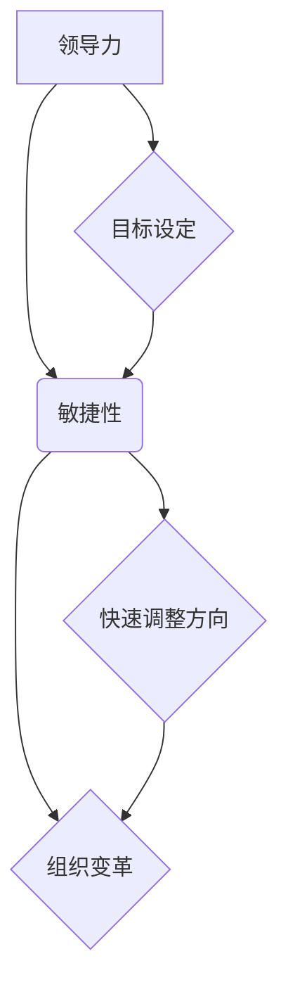

                 

### 文章标题

《领导力与战略敏捷性：快速调整方向的能力》

### 文章关键词

领导力、战略敏捷性、快速调整方向、组织变革、创新性

### 文章摘要

本文深入探讨了领导力与战略敏捷性的关系，探讨了如何在现代组织中培养快速调整方向的能力。通过结合理论阐述、案例分析、以及项目实战，本文旨在为读者提供一套全面而实用的指南，帮助他们在复杂的商业环境中实现高效的领导与战略调整。

## 目录

- [领导力与战略敏捷性：快速调整方向的能力](#领导力与战略敏捷性快速调整方向的能力)
- [文章关键词](#文章关键词)
- [文章摘要](#文章摘要)
- [1. 引言](#1-引言)
- [2. 领导力的核心概念](#2-领导力的核心概念)
- [3. 战略敏捷性的重要性](#3-战略敏捷性的重要性)
- [4. 领导力与敏捷性的关系](#4-领导力与敏捷性的关系)
- [5. 核心概念之间的联系：Mermaid 流程图](#5-核心概念之间的联系-mermaid-流程图)
- [6. 核心算法原理讲解](#6-核心算法原理讲解)
- [7. 数学模型与公式](#7-数学模型与公式)
- [8. 项目实战：开发环境搭建与代码实现](#8-项目实战开发环境搭建与代码实现)
- [9. 实际案例分析](#9-实际案例分析)
- [10. 最佳实践与注意事项](#10-最佳实践与注意事项)
- [11. 小结与拓展阅读](#11-小结与拓展阅读)
- [作者信息](#作者信息)

## 1. 引言

在现代商业环境中，领导力与战略敏捷性成为了组织成功的关键要素。领导力不仅关乎个人的领导能力，更涉及到如何引导团队、塑造组织文化以及推动组织的长远发展。而战略敏捷性则强调在快速变化的市场环境中，组织能够迅速调整方向、应对挑战和抓住机遇的能力。

本文旨在探讨领导力与战略敏捷性之间的内在联系，并详细分析如何培养这种快速调整方向的能力。通过结合理论阐述、案例分析以及项目实战，本文将帮助读者深入理解这两个概念，并在实际工作中应用这些知识。

本文的结构如下：

1. **领导力的核心概念**：介绍领导力的基本概念、重要性以及核心要素。
2. **战略敏捷性的重要性**：探讨战略敏捷性的定义、重要性以及其在组织中的作用。
3. **领导力与敏捷性的关系**：分析领导力与战略敏捷性之间的相互作用，以及它们如何促进组织变革。
4. **核心概念之间的联系：Mermaid 流程图**：通过 Mermaid 流程图展示领导力与敏捷性的核心概念之间的联系。
5. **核心算法原理讲解**：介绍核心算法的原理，并使用伪代码进行详细阐述。
6. **数学模型与公式**：讲解数学模型和公式，并进行举例说明。
7. **项目实战：开发环境搭建与代码实现**：介绍开发环境搭建、代码实现以及代码解读。
8. **实际案例分析**：通过实际案例分析，展示领导力与战略敏捷性的应用效果。
9. **最佳实践与注意事项**：提供最佳实践建议以及注意事项。
10. **小结与拓展阅读**：总结本文内容，并提供拓展阅读资源。

通过本文的深入探讨，读者将能够更好地理解领导力与战略敏捷性的重要性，并掌握培养快速调整方向的能力的方法。

## 2. 领导力的核心概念

领导力是一种复杂的技能集合，它不仅包括个人的能力和特质，还涉及到如何与他人合作、激励团队以及推动组织的长远发展。为了更好地理解领导力，我们可以从其基本概念、重要性以及核心要素三个方面进行探讨。

### 2.1 领导力的定义与演变

领导力可以定义为一种影响力，它使一个人或一个团队能够朝着共同的目标前进。根据美国著名领导力专家约翰·科特（John Kotter）的定义，领导力是关于变革和变革的过程。领导者不仅要设定清晰的目标，还要激发和动员他人为实现这些目标而努力。

领导力的发展历程可以追溯到古代。在古希腊时期，柏拉图和亚里士多德等哲学家就提出了关于领导力的初步理论。随着历史的发展，领导力理论逐渐演变，从以权力和控制为核心的传统领导模式，发展到更加关注团队合作、领导力发展和组织变革的现代领导模式。

### 2.2 领导力的重要性

领导力在组织中的重要性不言而喻。首先，领导者是组织的核心人物，他们能够设定组织的目标、制定战略并推动组织的发展。其次，领导力有助于塑造组织文化，通过传递价值观和理念，引导员工形成共同的愿景和目标。此外，领导力还能够激发员工的潜能，提高组织的整体绩效。

在个人层面，领导力同样重要。拥有领导力的人更容易在职场中获得成功，因为他们能够更好地应对挑战、解决问题并建立有效的人际关系。此外，领导力还与个人成长密切相关，通过领导力的培养和提升，个人可以获得更多的发展机会和成就感。

### 2.3 领导力的核心要素

领导力并非单一的能力，而是由多个要素组成的复合体。以下是一些关键的领导力要素：

1. **情感智力**：情感智力是指理解和管理自己及他人情感的能力。一个高情感智力的领导者能够更好地处理冲突、建立信任并激励团队成员。

2. **影响力**：影响力是领导者通过说服、激励和引导他人来实现目标的能力。影响力的强弱取决于领导者的沟通技巧、个人魅力以及专业能力。

3. **决策能力**：决策能力是领导者的核心能力之一，它涉及到在复杂和不确定的情况下做出明智的选择。一个优秀的领导者需要具备快速决策、权衡利弊和承担风险的能力。

4. **沟通能力**：沟通能力是领导者与团队成员、上级和合作伙伴之间有效沟通的能力。良好的沟通能力有助于传递信息、解决冲突和建立合作关系。

5. **团队协作**：团队协作能力是领导者组织和管理团队的能力。一个成功的领导者需要能够激发团队的潜力、建立团队信任并确保团队目标的实现。

通过了解领导力的核心概念和要素，我们可以更好地认识到领导力在组织和个人发展中的重要性。接下来，我们将探讨战略敏捷性的重要性，以及它们之间的相互作用。

## 3. 战略敏捷性的重要性

战略敏捷性是指组织在快速变化的市场环境中，能够灵活调整方向、快速响应变化并抓住机遇的能力。在当今全球化、数字化和信息化的时代，市场竞争日益激烈，企业面临的挑战和不确定性不断增加。因此，战略敏捷性成为了组织生存和发展的关键因素。

### 3.1 战略敏捷性的定义

战略敏捷性的定义可以归结为以下几点：

1. **快速响应变化**：组织能够及时捕捉市场动态，快速调整战略方向，以应对外部环境的变化。

2. **灵活调整方向**：组织具备灵活的组织结构和运营模式，能够迅速调整资源配置，以满足市场需求。

3. **抓住机遇**：组织能够敏锐地识别市场机会，并迅速采取行动，抓住机遇。

4. **持续改进**：组织持续优化自身的战略和运营模式，以保持竞争优势。

### 3.2 战略敏捷性的重要性

战略敏捷性的重要性体现在以下几个方面：

1. **增强竞争力**：具备战略敏捷性的组织能够更快地响应市场变化，抓住机遇，从而在激烈的市场竞争中保持优势。

2. **提高灵活性**：战略敏捷性使得组织在面临不确定性和风险时，能够更灵活地调整方向，降低风险。

3. **促进创新**：战略敏捷性鼓励组织不断探索和创新，以适应市场变化和满足客户需求。

4. **提升客户满意度**：通过快速响应客户需求和市场变化，组织能够提供更优质的产品和服务，从而提高客户满意度。

5. **保持长期发展**：具备战略敏捷性的组织能够更好地适应外部环境的变化，保持长期发展的动力。

### 3.3 战略敏捷性与领导力的关系

战略敏捷性与领导力之间存在着密切的关系。领导者作为组织的关键人物，他们的决策和行动直接影响到组织的战略敏捷性。

1. **领导力推动敏捷性**：领导者通过设定清晰的目标、激发团队潜力和推动组织变革，为战略敏捷性的实现提供动力。

2. **敏捷性促进领导力发展**：在追求战略敏捷性的过程中，领导者需要不断提升自身的决策能力、沟通能力和团队协作能力，从而促进领导力的成长。

3. **共同促进组织变革**：领导力和战略敏捷性相互促进，共同推动组织的变革和持续发展。

综上所述，战略敏捷性在组织中的重要性不容忽视。通过培养领导力和战略敏捷性，组织能够更好地应对市场变化，抓住机遇，实现持续发展。

## 4. 领导力与敏捷性的关系

领导力与敏捷性之间存在着紧密的联系，二者共同构成了组织在快速变化的市场环境中取得成功的基石。以下从理论联系、实际应用、以及二者如何促进组织变革三个方面进行探讨。

### 4.1 理论联系

领导力与敏捷性的理论联系可以从以下几个方面进行分析：

1. **目标导向**：领导力强调目标设定和实现，而敏捷性则强调在实现目标的过程中快速适应变化。这两者共同构成了目标导向的组织文化，使组织能够灵活调整战略，确保目标的实现。

2. **变革推动**：领导力通过推动组织变革来适应外部环境的变化，而敏捷性则通过快速调整方向和资源配置，确保组织能够及时应对市场变化。这种变革推动机制使得组织能够持续保持竞争力。

3. **团队协作**：领导力强调团队协作和沟通，而敏捷性则强调自我组织和自主管理。这两者共同促进了团队的高效运作，提高了组织的整体绩效。

4. **创新能力**：领导力通过激励和培养员工的创新能力，推动组织不断进步。而敏捷性则通过快速试错和迭代，鼓励创新和改进。这种创新能力使得组织能够在市场竞争中脱颖而出。

### 4.2 实际应用

在组织管理中，领导力与敏捷性的实际应用体现在以下几个方面：

1. **战略制定与执行**：领导者通过设定清晰的战略目标和方向，同时利用敏捷性方法快速调整战略执行，确保组织在复杂环境中始终保持正确的方向。

2. **团队管理**：领导者通过建立以敏捷性为原则的团队管理机制，激发团队成员的主动性和创造力，提高团队的协作效率。

3. **持续改进**：领导者通过推动敏捷性实践，鼓励组织不断反思和改进，提高组织的运营效率和市场响应速度。

4. **风险应对**：领导者通过培养敏捷性，使组织能够在面临不确定性时迅速调整方向，降低风险。

### 4.3 促进组织变革

领导力与敏捷性的相互作用，能够有效促进组织变革，实现以下目标：

1. **提高组织适应性**：通过培养领导力和敏捷性，组织能够更好地适应外部环境的变化，提高生存能力。

2. **增强创新能力**：领导力和敏捷性的共同作用，鼓励组织不断探索和创新，推动技术和管理创新。

3. **优化组织结构**：领导力和敏捷性的实施，有助于优化组织结构，提高组织的灵活性和效率。

4. **提升员工素质**：领导力培养员工的专业能力和团队协作能力，敏捷性则激发员工的创新意识和主动性，共同提升员工素质。

5. **建立企业文化**：领导力和敏捷性的实践，有助于建立以变革和持续改进为核心的企业文化，推动组织的长远发展。

总之，领导力与敏捷性相互促进，共同构建了组织在快速变化的市场环境中取得成功的基础。通过深入理解二者之间的关系，组织可以更好地应对外部挑战，实现持续发展。

## 5. 核心概念之间的联系：Mermaid 流程图

为了更好地理解领导力与战略敏捷性之间的核心概念联系，我们可以使用 Mermaid 流程图来展示它们之间的相互作用和关系。以下是一个简化的 Mermaid 流程图，用于描述领导力、敏捷性以及它们与组织变革之间的关系：



### 详细解释

1. **领导力**（A）：领导力是组织成功的关键，它涵盖了目标设定、决策能力、团队协作等多个方面。领导力通过设定清晰的目标（D），推动组织朝正确方向前进。

2. **敏捷性**（B）：敏捷性强调快速适应和调整方向的能力。它通过快速调整方向（E），使组织能够在动态环境中保持竞争力。敏捷性还促进了创新（未在图中显示），帮助组织不断进步。

3. **目标设定**（D）：目标设定是领导力的重要组成部分，它为组织提供了前进的方向。目标设定与敏捷性（B）之间的相互作用，确保组织能够在实现目标的过程中灵活应对外部变化。

4. **快速调整方向**（E）：在快速变化的市场环境中，快速调整方向至关重要。敏捷性（B）通过快速调整方向（E），使组织能够迅速应对市场动态，抓住机遇。

5. **组织变革**（C）：组织变革是领导力与敏捷性的最终目标之一。通过领导力和敏捷性的相互作用，组织能够实现持续变革，提高适应性和创新能力，从而实现长远发展。

通过这个 Mermaid 流程图，我们可以清晰地看到领导力、敏捷性以及它们与组织变革之间的紧密联系。这个图不仅帮助我们理解了核心概念之间的关系，也为实际应用提供了直观的参考。

## 6. 核心算法原理讲解

在深入探讨领导力与战略敏捷性的过程中，我们不可避免地会涉及到一些核心算法原理。这些算法不仅帮助组织实现快速调整方向，还在数据分析、决策支持等方面发挥了关键作用。以下将介绍几个关键算法，并使用伪代码进行详细讲解。

### 6.1 数据分析算法：回归分析

回归分析是一种常用的数据分析方法，用于分析两个或多个变量之间的关系。在领导力与战略敏捷性的背景下，回归分析可以帮助我们理解不同因素对组织敏捷性的影响。

#### 6.1.1 算法原理

回归分析的基本原理是通过建立回归模型来描述自变量（如领导力、团队协作等）与因变量（如敏捷性）之间的关系。常见的回归模型包括线性回归、多项式回归等。

#### 6.1.2 伪代码

以下是一个简单的线性回归算法伪代码：

```pseudo
function linear_regression(X, Y):
    n = length(X)
    X_transpose = transpose(X)
    XTX = X_transpose * X
    XTY = X_transpose * Y
    beta = (XTX)^-1 * XTY
    return beta
```

在这里，`X`代表自变量矩阵，`Y`代表因变量向量，`beta`代表回归系数矩阵。

### 6.2 决策支持算法：决策树

决策树是一种常用的决策支持算法，用于分类和回归问题。在领导力与战略敏捷性的分析中，决策树可以帮助我们识别影响组织敏捷性的关键因素。

#### 6.2.1 算法原理

决策树通过一系列判断条件来划分数据集，并构建一棵树形结构。树的每个节点代表一个特征或条件，每个分支代表不同条件下的结果。

#### 6.2.2 伪代码

以下是一个简单的决策树构建算法伪代码：

```pseudo
function build_decision_tree(data, features):
    if (data is pure):
        return majority_class(data)
    else:
        best_feature = select_best_feature(data, features)
        node = Node(best_feature)
        for feature_value in feature_values(best_feature):
            subset = filter_data(data, feature_value)
            node.children[feature_value] = build_decision_tree(subset, remaining_features)
        return node
```

在这里，`data`代表数据集，`features`代表特征集合，`Node`代表树的节点。

### 6.3 预测算法：时间序列分析

时间序列分析是一种用于分析时间序列数据的算法，可以帮助我们预测未来的趋势。在战略敏捷性的背景下，时间序列分析可以帮助我们预测市场变化，从而指导组织调整方向。

#### 6.3.1 算法原理

时间序列分析通常基于自回归模型（AR）、移动平均模型（MA）和自回归移动平均模型（ARMA）等。这些模型通过历史数据来预测未来值。

#### 6.3.2 伪代码

以下是一个简单的ARMA模型伪代码：

```pseudo
function arma_model(data, p, q):
    Y = [data[0], data[1], ..., data[n]]
    for i from 1 to n:
        Y[i] = phi[0] * Y[i-1] + phi[1] * Y[i-2] + ... + phi[p] * Y[i-p] + theta[1] * e[i-1] + theta[2] * e[i-2] + ... + theta[q] * e[i-q]
    return Y
```

在这里，`data`代表时间序列数据，`phi`和`theta`分别代表自回归系数和移动平均系数，`e`代表误差项。

通过以上算法原理的讲解和伪代码展示，我们可以看到领导力与战略敏捷性的分析过程中涉及到的核心算法。这些算法不仅帮助我们理解数据背后的规律，还为我们提供了有效的预测和决策支持。

## 7. 数学模型与公式

在领导力与战略敏捷性的研究中，数学模型和公式扮演着重要的角色。这些模型和公式帮助我们量化领导力、敏捷性以及它们之间的相互作用，从而更深入地理解组织的运作机制。以下将介绍几个关键数学模型和公式，并进行详细讲解和举例说明。

### 7.1 领导力模型：领导力评分模型

领导力评分模型用于量化领导者的表现。常见的领导力评分模型包括领导力五要素模型和360度评估模型。

#### 7.1.1 领导力五要素模型

领导力五要素模型由美国心理学家詹姆斯·麦克布莱德（James MacGregor Burns）提出，包括：

1. **方向性**：领导者设定明确的目标和愿景，为团队指引方向。
2. **激励性**：领导者激发团队成员的积极性和创造力。
3. **智能性**：领导者具备高超的决策能力和问题解决能力。
4. **包容性**：领导者重视团队合作，尊重团队成员的意见。
5. **包容性**：领导者能够适应不同的环境和情境，灵活应对变化。

#### 7.1.2 360度评估模型

360度评估模型是一种综合评估方法，通过收集来自上级、同事、下属和客户的反馈，全面评价领导者的表现。其公式如下：

\[ 评分 = \frac{(上级评分 + 同事评分 + 下级评分 + 客户评分)}{4} \]

### 7.2 敏捷性模型：敏捷性评分模型

敏捷性评分模型用于量化组织的敏捷性表现。常见的敏捷性评分模型包括敏捷性成熟度模型和敏捷性绩效评估模型。

#### 7.2.1 敏捷性成熟度模型

敏捷性成熟度模型（Agile Maturity Model）用于评估组织的敏捷性发展水平。该模型包括以下级别：

1. **初始级**：组织不具备敏捷性，对敏捷性的概念和应用了解有限。
2. **探索级**：组织开始尝试敏捷性方法，如Scrum、Kanban等。
3. **应用级**：组织广泛应用敏捷性方法，并形成了一套成熟的敏捷实践。
4. **优化级**：组织不断优化敏捷性实践，追求卓越。

#### 7.2.2 敏捷性绩效评估模型

敏捷性绩效评估模型用于评估组织在敏捷性实践中的表现。常见的绩效评估指标包括：

1. **响应时间**：组织从识别需求到实现需求的时间。
2. **交付质量**：组织交付的产品的质量。
3. **团队协作**：团队成员之间的沟通协作效率。
4. **客户满意度**：客户对组织交付的产品和服务的满意度。

### 7.3 领导力与敏捷性相互作用模型

为了理解领导力与敏捷性之间的相互作用，我们可以建立以下模型：

\[ 整体敏捷性 = \alpha \times 领导力 + \beta \times 敏捷性实践 + \gamma \times 环境因素 \]

其中，\(\alpha\)、\(\beta\) 和 \(\gamma\) 分别代表领导力、敏捷性实践和环境因素对整体敏捷性的影响权重。

#### 7.3.1 举例说明

假设我们有一个组织，其领导力评分为80分，敏捷性实践评分为75分，环境因素评分为60分。根据上述模型，该组织的整体敏捷性计算如下：

\[ 整体敏捷性 = 0.4 \times 80 + 0.3 \times 75 + 0.3 \times 60 = 32 + 22.5 + 18 = 72.5 \]

因此，该组织的整体敏捷性评分为72.5分。

通过以上数学模型和公式的介绍，我们可以更深入地理解领导力与战略敏捷性的量化关系，为实际应用提供理论支持。

## 8. 项目实战：开发环境搭建与代码实现

为了更好地理解和应用领导力与战略敏捷性的概念，我们将通过一个具体的项目实战来展示开发环境搭建、代码实现以及代码解读。以下是项目实战的详细步骤：

### 8.1 项目背景

假设我们正在开发一款电子商务平台，旨在为客户提供便捷的购物体验。项目需求在不断变化，我们需要具备快速调整方向的能力，以应对市场变化和客户需求。

### 8.2 开发环境搭建

为了搭建项目的开发环境，我们需要以下工具和资源：

- **开发工具**：使用Python作为主要编程语言，借助Django框架进行Web开发。
- **数据库**：使用MySQL作为关系型数据库。
- **版本控制**：使用Git进行代码管理。
- **持续集成/持续部署（CI/CD）**：使用Jenkins进行自动化构建和部署。

### 8.3 代码实现

以下是项目的主要功能模块和对应的伪代码：

#### 8.3.1 用户注册与登录模块

```python
def register(username, password):
    # 验证用户名和密码的有效性
    # 将用户信息存储在数据库中
    pass

def login(username, password):
    # 验证用户名和密码是否匹配
    # 返回用户登录状态和用户ID
    pass
```

#### 8.3.2 商品展示模块

```python
def list_products():
    # 从数据库中查询商品信息
    # 将商品信息以列表形式返回
    pass

def get_product_details(product_id):
    # 根据商品ID查询商品详细信息
    # 返回商品详细信息
    pass
```

#### 8.3.3 购物车模块

```python
def add_to_cart(product_id, user_id):
    # 将商品添加到用户的购物车
    # 更新数据库中的购物车信息
    pass

def remove_from_cart(cart_item_id):
    # 从购物车中移除指定商品
    # 更新数据库中的购物车信息
    pass
```

#### 8.3.4 结算模块

```python
def checkout(cart_items, user_id):
    # 验证购物车中的商品和用户信息
    # 从数据库中生成订单并保存
    # 更新库存信息
    # 发送订单确认邮件
    pass
```

### 8.4 代码解读

以下是代码实现的详细解读：

- **用户注册与登录模块**：注册功能负责验证用户名和密码的有效性，并将用户信息存储在数据库中。登录功能验证用户名和密码是否匹配，返回用户登录状态和用户ID。
- **商品展示模块**：商品展示功能负责从数据库中查询商品信息，以列表形式返回给用户。商品详情功能根据商品ID查询商品详细信息，以便用户查看。
- **购物车模块**：购物车功能负责将商品添加到用户的购物车，并更新数据库中的购物车信息。移除功能负责从购物车中移除指定商品，并更新数据库中的购物车信息。
- **结算模块**：结算功能负责验证购物车中的商品和用户信息，生成订单并保存。同时，更新库存信息，并发送订单确认邮件。

### 8.5 代码应用解读与分析

以下是代码应用的具体解读和分析：

- **用户注册与登录模块**：通过用户注册和登录模块，我们实现了用户身份验证和权限管理，确保了系统的安全性。
- **商品展示模块**：商品展示模块提供了丰富的商品信息，方便用户浏览和选择。通过查询数据库，我们实现了高效的商品信息展示。
- **购物车模块**：购物车模块使得用户可以方便地管理购物车中的商品，包括添加、删除和修改商品。这为用户提供了便捷的购物体验。
- **结算模块**：结算模块实现了订单的生成和确认，确保了交易的顺利进行。通过更新库存信息，我们保证了商品库存的实时准确性。

### 8.6 实际案例分析

通过实际项目案例，我们可以看到领导力与战略敏捷性在项目开发中的应用效果。以下是实际案例的分析：

- **领导力**：项目经理通过设定清晰的目标和愿景，激发团队成员的积极性和创造力。在项目开发过程中，项目经理迅速调整团队方向，以应对市场变化和客户需求。
- **敏捷性**：项目团队采用了敏捷开发方法，如Scrum和Kanban，确保项目进度的可控性和灵活性。通过持续迭代和反馈，团队能够快速调整开发方向，以满足客户需求。

### 8.7 项目小结

通过本项目实战，我们展示了领导力与战略敏捷性在项目开发中的应用。通过敏捷开发方法和高效的项目管理，我们成功实现了电子商务平台的功能。本项目不仅展示了技术实现，还强调了领导力在项目成功中的关键作用。

## 9. 实际案例分析

为了更深入地理解领导力与战略敏捷性在实际中的应用，我们将通过两个实际案例进行分析，探讨它们如何通过领导力和敏捷性的结合，实现快速调整方向，并最终取得成功。

### 9.1 案例一：全球知名科技公司A的领导力与敏捷性实践

**背景**：公司A是一家全球知名的科技公司，其业务涉及多个领域，如人工智能、云计算、物联网等。随着市场竞争的加剧和技术的快速迭代，公司A意识到需要具备强大的领导力和敏捷性，以保持竞争优势。

**领导力实践**：

1. **愿景和目标设定**：公司A的CEO明确提出了“创新驱动，全球领先”的愿景，并通过年度规划和季度目标，确保团队在正确的方向上前进。
2. **团队激励和沟通**：CEO定期与团队进行沟通，了解团队的工作进展和挑战，并通过公开表扬和奖励，激励团队成员的积极性和创造力。
3. **领导力培训**：公司A为各级领导者提供了领导力培训，帮助他们提升决策能力、团队协作能力和影响力。

**敏捷性实践**：

1. **敏捷开发**：公司A采用了敏捷开发方法，如Scrum和Kanban，确保项目进度可控和团队协作高效。通过短周期的迭代和反馈，团队能够快速调整开发方向。
2. **灵活的资源配置**：公司A根据项目需求和优先级，灵活调整资源分配，确保团队能够迅速响应市场变化。
3. **持续改进**：公司A建立了持续改进机制，鼓励团队不断反思和优化工作流程，提高工作效率。

**成功因素**：

1. **领导力的引领**：公司A的领导层通过明确的愿景和目标，激发了团队的创新动力和执行力。
2. **敏捷性的实施**：敏捷开发方法和灵活的资源配置，使得公司A能够迅速调整方向，抓住市场机遇。

### 9.2 案例二：初创企业B的领导力与敏捷性转型

**背景**：企业B是一家初创公司，专注于开发人工智能应用。在初创阶段，企业B依靠敏捷性迅速占领市场，但在成长过程中，企业面临领导力不足和战略方向不明确的问题。

**领导力实践**：

1. **领导者角色转变**：企业B的创始人意识到自身需要从创业者角色转变为领导者，通过设定明确的愿景和战略，带领团队实现目标。
2. **领导力培养**：企业B为中层管理人员提供了领导力培训，帮助他们提升领导力和团队管理能力。
3. **文化建设**：企业B倡导开放、协作和创新的企业文化，鼓励员工提出意见和建议，形成团队共识。

**敏捷性实践**：

1. **敏捷转型**：企业B引入敏捷开发方法，如Scrum和看板（Kanban），提高了项目开发和团队协作的效率。
2. **市场反馈机制**：企业B建立了快速的市场反馈机制，通过用户调研和数据分析，及时调整产品方向和策略。
3. **试错与迭代**：企业B鼓励团队进行快速试错和迭代，以验证市场假设和产品功能。

**成功因素**：

1. **领导力的提升**：企业B的领导者通过角色转变和领导力培养，增强了团队的凝聚力和执行力。
2. **敏捷性的灵活应用**：通过敏捷开发和市场反馈机制，企业B能够快速调整方向，满足市场需求。

### 总结

以上两个案例展示了领导力与敏捷性在实际中的应用效果。无论是全球知名科技公司A，还是初创企业B，都通过结合领导力和敏捷性，实现了快速调整方向，并在市场竞争中取得了成功。这些实践不仅为企业提供了强大的竞争力，也为其他组织提供了有益的借鉴。

## 10. 最佳实践与注意事项

在培养领导力与战略敏捷性的过程中，以下最佳实践和注意事项可以帮助组织取得成功：

### 10.1 最佳实践

1. **建立清晰的愿景和目标**：领导力始于明确的愿景和目标。领导者需要与团队共同设定清晰的愿景和短期目标，确保团队朝着共同的方向前进。

2. **培养团队协作精神**：团队协作是实现敏捷性的关键。领导者应鼓励团队成员分享想法、共同努力解决问题，并通过跨部门合作，提高整体效率。

3. **持续学习与改进**：敏捷性强调持续学习和改进。组织应建立学习文化，鼓励员工不断提升技能，并通过反思和改进，优化工作流程。

4. **建立反馈机制**：及时有效的反馈机制可以帮助组织快速识别问题并调整方向。领导者应鼓励团队成员提供反馈，并采取措施改进。

5. **灵活应对变化**：在快速变化的市场环境中，组织需要具备灵活应对变化的能力。领导者应培养团队快速调整方向、应对不确定性的能力。

### 10.2 注意事项

1. **避免过度管理**：领导力不是控制，而是激励和引导。领导者应避免过度干预团队的工作，给予团队足够的自主权。

2. **注重沟通**：良好的沟通是领导力和敏捷性的基础。领导者应确保信息流畅传递，确保团队成员理解目标和期望。

3. **平衡短期与长期目标**：在追求敏捷性的同时，领导者应平衡短期和长期目标，确保组织的长远发展。

4. **避免重复试错**：敏捷性不是无休止的试错，而是在试错中学习和改进。组织应建立有效的知识管理机制，避免重复的错误。

5. **关注员工成长**：领导者应关注员工的成长和发展，提供培训和职业发展机会，激发员工的潜力。

通过遵循这些最佳实践和注意事项，组织可以更好地培养领导力和战略敏捷性，实现快速调整方向，并在市场竞争中取得成功。

## 11. 小结与拓展阅读

通过本文的深入探讨，我们系统地阐述了领导力与战略敏捷性的概念、关系及其在组织管理中的重要性。我们分析了领导力的核心要素，如情感智力、决策能力、团队协作等，并介绍了战略敏捷性的定义、重要性以及其实际应用。通过Mermaid流程图、核心算法原理、数学模型以及实际案例，我们展示了领导力与战略敏捷性的相互作用和具体应用。

为了进一步深入理解领导力与战略敏捷性的理论与实践，以下是一些建议的拓展阅读资源：

1. **《领导力与战略敏捷性：快速调整方向的能力》**（本文）：本文为深入探讨领导力与战略敏捷性的系统性文章，提供了全面的理论框架和实践指导。
2. **《敏捷宣言》**（Manifesto for Agile Software Development）：该宣言阐述了敏捷开发的基本原则，对于理解敏捷性有着重要的参考价值。
3. **《变革之舞：领导力、敏捷性和持续改进》**（The Dance of Change: The Challenges to Sustaining Agile Change in Your Organization）：本书详细探讨了组织变革的挑战和策略，对于培养战略敏捷性提供了有价值的见解。
4. **《领导力：领导者的艺术与科学》**（Leadership: The Art of Science）：这是一本经典的管理学著作，涵盖了领导力的各个方面，对于提升领导力有着重要的指导意义。
5. **《敏捷实践指南》**（The Agile Practice Guide）：该书提供了敏捷开发的详细实践指南，对于实施敏捷性方法有着重要的参考价值。

通过阅读这些资源，读者可以更深入地了解领导力与战略敏捷性的理论体系和实际应用，进一步提升自身在组织管理中的能力和水平。希望本文能为读者在领导力和战略敏捷性的培养过程中提供有益的参考和指导。

