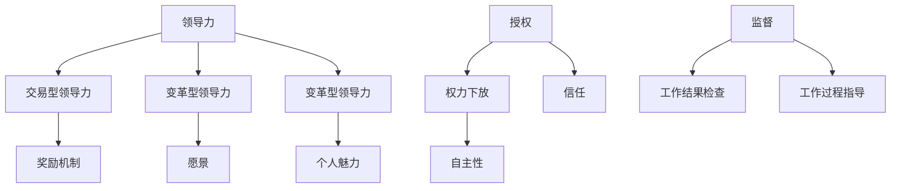

                 

### 背景介绍

在当今信息化和全球化的浪潮中，领导力和授权成为企业管理中至关重要的一环。领导力不仅仅关乎个人的魅力和能力，更涉及到如何在复杂多变的环境中激励、指导和协调团队成员，以达到组织的战略目标。授权，作为领导力的一部分，强调将决策权和责任下放给下属，从而激发团队成员的自主性和创造力，提高整体执行力。

然而，授权并非简单的权利转让，而是需要建立在信任和监督的基础之上。信任是授权的基石，它要求领导者与团队成员之间相互信赖，能够放心地让对方负责特定任务。缺乏信任的授权往往会导致团队成员的疑虑和不安，从而影响工作成效。另一方面，监督与问责机制则是确保授权过程中各项任务得到有效执行的关键。监督不仅能够发现和纠正问题，还可以为团队成员提供反馈和指导，从而促进个人和团队的成长。

在现代企业中，领导力与授权的平衡显得尤为重要。过度授权可能导致缺乏统一指导和失控的局面，而缺乏授权则可能抑制员工的积极性和创新能力。因此，如何在信任与监督之间找到平衡，成为领导者面临的重大挑战。本文将深入探讨领导力与授权的核心理念、实践方法和案例分析，帮助读者理解这一复杂但至关重要的管理主题。

### 核心概念与联系

在讨论领导力与授权时，我们首先需要明确几个核心概念及其相互之间的联系。

**1. 领导力**：领导力是指领导者通过影响力、沟通能力、决策能力和激励能力等手段，引导和激励团队成员，实现组织目标的能力。领导力可以分为三大类型：交易型领导力（Transactional Leadership）、变革型领导力（Transformational Leadership）和变革型领导力（Charismatic Leadership）。

- **交易型领导力**：通过明确的奖励机制和绩效评估来激励团队成员，强调任务完成和绩效表现。
- **变革型领导力**：通过愿景、价值观和激励，引导团队成员追求卓越，实现创新和变革。
- **变革型领导力**：通过个人魅力和感召力，激发团队成员的热情和动力，实现团队的高效协作。

**2. 授权**：授权是指领导者将部分决策权和责任赋予下属，使其能够自主处理工作任务。授权不仅包括权力下放，还涉及到信任的建立和维护。成功的授权能够提高团队成员的自主性和创新能力，从而提升组织的整体绩效。

**3. 信任**：信任是授权的基石，它要求领导者与团队成员之间相互信赖，能够放心地让对方负责特定任务。信任的建立需要时间，它需要通过透明沟通、一致性行为和可靠结果来逐步积累。

**4. 监督**：监督是确保授权过程中各项任务得到有效执行的重要手段。监督不仅包括对团队成员工作结果的检查，还包括对工作过程的指导和反馈。适当的监督能够帮助团队成员更好地完成任务，同时也能够发现和纠正潜在的问题。

**核心概念之间的联系**：

- **领导力与授权**：领导力是授权的前提和基础。只有具备强大领导力的领导者才能有效地授权，从而激发团队成员的潜力和创造力。
- **信任与授权**：信任是授权的基石。缺乏信任的授权往往会导致团队成员的疑虑和不安，从而影响工作成效。信任的建立需要领导者通过透明沟通、一致性行为和可靠结果来逐步积累。
- **监督与授权**：监督是授权的有力保障。适当的监督能够帮助团队成员更好地完成任务，同时也能够发现和纠正潜在的问题。但过度的监督可能会抑制团队成员的自主性和创新能力。

为了更直观地展示这些核心概念之间的联系，我们可以使用Mermaid流程图来表示它们之间的关系：



通过上述核心概念及其关系的梳理，我们可以更清晰地理解领导力与授权的内在机制，为后续的深入讨论奠定基础。

### 授权的概念与原则

授权，作为一种管理实践，是指领导者将决策权和责任赋予下属，使其能够在特定的范围内自主决策和处理工作任务。授权的核心在于权力下放和责任转移，从而激发下属的自主性、创新能力和工作热情。以下是授权的几个关键概念和原则。

#### 1. 授权的重要性

授权在企业管理中具有多重重要性：

- **提高工作效率**：授权能够将领导者的时间和精力从日常琐碎的工作中解放出来，使其能够专注于更战略性的任务。同时，下属在获得授权后能够自主决策，减少了信息传递的中间环节，提高了工作效率。

- **培养员工能力**：授权是培养员工能力和职业素养的重要手段。通过给予下属一定的自主权，领导者可以激励他们承担更多责任，锻炼其解决问题的能力和决策能力。

- **增强团队凝聚力**：授权能够增强团队成员之间的信任和合作。当团队成员感受到自己被信任和重视时，他们会更加愿意积极参与团队工作，从而提高团队凝聚力和合作精神。

#### 2. 授权的原则

成功的授权需要遵循以下几个原则：

- **明确目标和责任**：领导者应在授权前明确下属的工作目标和责任，确保下属了解自己的职责范围和预期成果。这有助于减少模糊和误解，确保授权任务的明确性和可执行性。

- **信任和支持**：授权不仅仅是权力的下放，更是信任的传递。领导者应在授权过程中表达对下属的信任，并提供必要的支持和资源。这种信任和支持能够激励下属更积极地承担责任。

- **适度监督和反馈**：授权并不意味着完全放手，适度的监督和反馈是确保授权任务顺利进行的重要手段。领导者应在适当的时候对下属的工作进行指导，并提供及时的反馈，帮助他们改进和成长。

- **逐步授权**：授权应是一个逐步进行的过程。领导者可以首先授权一些相对简单的任务，逐步增加下属的责任范围，让他们逐渐适应更高的授权水平。

#### 3. 授权的障碍与挑战

尽管授权具有多重优势，但在实际操作中，领导者常常面临以下障碍和挑战：

- **权力下放的不安全感**：一些领导者担心权力下放后可能失去对团队的掌控，从而影响组织的稳定和效率。这种不安全感可能阻碍他们进行有效的授权。

- **下属的能力不足**：如果下属缺乏必要的技能和经验，领导者可能会担心授权后任务无法完成。这种情况需要领导者通过培训和指导来提高下属的能力。

- **沟通不畅**：授权过程中，如果沟通不畅，可能会导致领导者与下属之间的误解和冲突，影响授权的效果。

- **反馈机制不完善**：如果缺乏有效的反馈机制，下属可能无法及时获得领导者的指导和帮助，从而影响工作成效。

#### 4. 授权的有效策略

为了克服上述障碍和挑战，领导者可以采取以下有效策略：

- **建立信任关系**：通过建立信任关系，领导者可以减少下属的不安和疑虑，增强他们对授权的接受度和执行力。

- **明确任务目标和责任**：领导者应在授权前明确任务目标和责任，确保下属了解自己的职责和预期成果，减少模糊和误解。

- **提供支持和资源**：领导者应提供必要的技术、资源和培训，帮助下属更好地完成授权任务。

- **建立反馈机制**：建立有效的反馈机制，及时收集下属的工作情况和反馈，提供指导和帮助，帮助他们改进和成长。

- **逐步授权**：领导者应逐步授权，从小任务开始，逐步增加下属的责任范围，让他们逐渐适应更高的授权水平。

通过遵循上述原则和策略，领导者可以更有效地实施授权，激发团队成员的潜力和创新能力，从而提升组织的整体绩效。

### 信任的建立与维护

信任是授权的基石，没有信任，授权将变得毫无意义。建立和维护信任需要领导者付出持续的努力，以下是一些关键策略：

#### 1. 透明沟通

透明沟通是建立信任的关键。领导者应确保团队中的信息传递是及时、准确和全面的。通过定期会议、报告、邮件等方式，领导者可以保持与团队成员的沟通渠道畅通，让每个人都了解组织的战略目标、工作进展和关键决策。

**核心算法原理讲解**：

```plaintext
透明沟通算法：
输入：领导者的信息，团队成员的反馈
输出：团队信息的同步与共享

1. 定期召开团队会议，确保信息同步
2. 鼓励团队成员提问和分享观点
3. 及时回复团队成员的信息和反馈
4. 定期发布工作进展报告
```

#### 2. 一致性行为

领导者的一致性行为是建立信任的另一个重要因素。一致性行为包括遵守承诺、遵守规章制度、对待团队成员公正无私等。领导者应在日常工作中展现一致性，这样团队成员才会相信领导者的决策和承诺。

**数学模型和公式**：

```latex
信任度 = （遵守承诺次数 × 公正无私程度）/ （违规行为次数）
```

**举例说明**：

假设一个领导者在过去一年中遵守了90%的承诺，且没有明显的违规行为。那么，该领导者的信任度可以计算为：

```latex
信任度 = （0.9 × 1）/ （0 × 1） = 0.9
```

#### 3. 可靠结果

领导者通过可靠的结果来赢得团队成员的信任。可靠的结果意味着领导者能够带领团队实现既定的目标和任务，这种结果不仅体现在短期绩效上，还应体现在长期的组织发展中。

**数学模型和公式**：

```latex
信任度 = （实现目标次数 × 长期绩效）/ （未实现目标次数 × 长期影响）
```

**举例说明**：

如果一个领导者在过去一年中实现了80%的目标，且这些目标对组织的长期发展产生了积极影响，那么该领导者的信任度可以计算为：

```latex
信任度 = （0.8 × 1）/ （0.2 × 1） = 4
```

#### 4. 维护信任的策略

除了上述建立信任的策略外，领导者还应采取以下策略来维护信任：

- **及时解决问题**：领导者应及时解决团队中出现的各种问题，确保团队成员感受到领导者的关注和支持。
- **鼓励反馈**：领导者应鼓励团队成员提供反馈，并对反馈给予积极回应，这有助于建立开放和透明的沟通环境。
- **提供支持**：领导者应在团队成员遇到困难时提供必要的帮助和支持，让他们感受到团队的凝聚力和领导者的关心。

通过透明沟通、一致性行为和可靠结果，领导者可以逐步建立和维护团队成员之间的信任，为授权打下坚实的基础。

### 监督与问责机制

监督与问责机制在授权过程中起着至关重要的作用。适当的监督不仅能够确保授权任务的顺利完成，还能够帮助团队成员不断进步，提高整体组织的绩效。以下将详细探讨监督与问责机制的定义、目的、建立方法以及如何在信任与监督之间找到平衡。

#### 1. 监督的定义与目的

监督是指通过定期检查、指导和反馈来确保团队成员按照预期目标和标准完成工作任务。监督的目的主要包括以下几点：

- **确保任务完成**：监督可以确保团队成员按照预定计划和时间表完成任务，避免拖延和遗漏。
- **发现和纠正问题**：通过监督，领导者可以及时发现团队成员在工作过程中遇到的问题，并提供及时的纠正和指导。
- **提高工作质量**：监督可以确保团队成员按照高标准完成工作，从而提高整体的工作质量。
- **促进团队成员成长**：通过监督，团队成员可以获得宝贵的反馈和指导，从而不断改进自己的工作方法和技能。

#### 2. 问责机制的建立

问责机制是指对团队成员的工作绩效进行评估和考核，并根据评估结果进行奖惩。建立有效的问责机制需要遵循以下原则：

- **明确责任**：每个团队成员都应清楚自己的职责和工作目标，确保责任分配明确。
- **公平公正**：问责机制应确保公平公正，避免主观偏见和不公正待遇。
- **合理评估**：评估标准应合理，能够全面反映团队成员的工作表现和贡献。
- **及时反馈**：评估结果应及时反馈给团队成员，并给予相应的奖惩。

为了建立有效的问责机制，组织可以采取以下步骤：

- **制定评估标准**：根据组织的战略目标和业务需求，制定明确的评估标准，包括工作量、质量、效率等方面。
- **定期评估**：定期对团队成员的工作绩效进行评估，确保评估的及时性和准确性。
- **奖惩制度**：根据评估结果，制定相应的奖惩制度，激励团队成员积极进取，提高整体绩效。
- **反馈与改进**：评估结果应及时反馈给团队成员，并提供改进建议，帮助他们提高工作能力。

#### 3. 监督与问责的平衡

在授权过程中，监督与问责机制是必不可少的，但过度的监督可能会抑制团队成员的自主性和创新能力。因此，领导者需要在信任与监督之间找到平衡。

- **适度监督**：领导者应根据团队成员的能力和任务难度，适度监督。在初期授权时，可以适当加强监督，确保团队成员能够顺利完成任务。随着团队成员逐渐熟悉任务和提升能力，可以逐步减少监督，给他们更多的自主权。
- **信任与支持**：领导者应在监督的同时，表达对团队成员的信任和支持。通过鼓励、表扬和提供必要的资源，领导者可以增强团队成员的自信心和责任感。
- **透明沟通**：领导者应保持与团队成员的透明沟通，及时分享工作进展和问题，确保团队成员了解自己的工作状态和领导者的期望。
- **反馈与改进**：领导者应通过反馈和改进机制，帮助团队成员不断进步。在监督过程中，发现团队成员的优点和不足，提供具体的改进建议，帮助他们提升工作能力。

通过适度监督、信任支持、透明沟通和反馈改进，领导者可以在信任与监督之间找到平衡，确保授权任务的顺利进行，同时促进团队成员的成长和组织的持续发展。

### 平衡领导力与授权中的信任与监督

在领导力与授权的过程中，信任与监督的平衡是确保团队高效运作的关键。过度的信任可能导致团队失去控制，而缺乏信任的监督则可能抑制团队成员的自主性和创造力。因此，如何在这种动态关系中找到平衡，是领导者面临的一大挑战。

#### 1. 信任与监督的冲突与协调

信任与监督之间存在着一定的冲突。信任强调领导者对团队成员的信任和放手，让团队成员拥有更多的自主权；而监督则强调对团队成员工作过程和结果的监控，以确保任务完成。这种冲突在授权过程中尤为明显。

为了协调这种冲突，领导者可以采取以下策略：

- **明确目标和责任**：在授权时，领导者应明确团队成员的工作目标和责任，确保团队成员了解自己的职责范围和预期成果。这有助于减少模糊和误解，降低信任与监督之间的冲突。
- **建立透明沟通机制**：通过建立透明沟通机制，领导者可以及时了解团队成员的工作进展和问题，从而在必要时进行干预和指导。这有助于在信任与监督之间建立一种平衡。
- **定期反馈和评估**：通过定期反馈和评估，领导者可以及时发现团队成员的工作表现和问题，并提供针对性的指导。这不仅可以增强团队成员的信任感，也可以确保监督的有效性。

#### 2. 提升授权效能的领导力策略

为了提升授权效能，领导者可以采取以下领导力策略：

- **培养信任文化**：领导者应在团队中营造一种信任文化，鼓励团队成员相互信任和协作。通过透明沟通、一致性行为和可靠结果，领导者可以逐步建立和维护团队成员之间的信任。
- **明确团队成员的角色和责任**：领导者应明确团队成员的角色和责任，确保每个人都清楚自己的职责和工作目标。这有助于提高团队成员的自主性和责任感，从而提升授权效能。
- **提供必要的支持和资源**：领导者应提供必要的支持和资源，帮助团队成员更好地完成任务。这包括技术支持、培训资源和心理支持等。
- **建立有效的反馈和改进机制**：领导者应建立有效的反馈和改进机制，帮助团队成员不断进步。通过定期的反馈和评估，领导者可以及时了解团队成员的工作表现和问题，并提供针对性的指导。

#### 3. 构建信任导向的组织文化

构建信任导向的组织文化是确保领导力与授权成功的关键。以下是一些构建信任导向组织文化的策略：

- **强化价值观**：领导者应明确组织的价值观，并将其融入到日常工作中。通过价值观的强化，领导者可以引导团队成员关注信任和协作，从而建立一种信任导向的文化。
- **鼓励透明沟通**：领导者应鼓励团队成员进行透明沟通，分享自己的想法和意见。通过透明沟通，团队成员可以更好地理解彼此的立场和需求，从而建立信任。
- **支持创新和变革**：领导者应支持团队成员的创新和变革，鼓励他们尝试新方法和新思路。通过支持创新和变革，领导者可以增强团队成员的自主性和创造力，从而建立信任。
- **建立反馈和改进机制**：领导者应建立反馈和改进机制，帮助团队成员不断进步。通过定期的反馈和评估，领导者可以及时了解团队成员的工作表现和问题，并提供针对性的指导。

通过培养信任文化、明确目标和责任、提供支持和资源以及建立反馈和改进机制，领导者可以在信任与监督之间找到平衡，确保授权的高效实施，从而推动组织的持续发展。

### 实践应用

在实际管理中，领导力与授权的实践应用需要结合具体情境，灵活运用相关策略和工具。以下是一些案例分析和详细讲解，帮助读者更好地理解和应用这些概念。

#### 案例分析一：授权在团队管理中的应用

**背景**：
某互联网公司技术部门需要开发一款新的移动应用，项目时间紧、任务重。为了提高开发效率，部门经理决定采用授权的方式来管理团队。

**实施步骤**：

1. **明确目标和责任**：部门经理与团队成员共同制定了项目目标，并明确了每个成员的具体职责，如前端开发、后端开发、测试等。

2. **信任和支持**：部门经理表达了对团队成员的信任，并提供必要的资源和培训，确保团队成员有足够的技能和知识来完成各自的任务。

3. **适度监督**：部门经理在项目初期进行了一些监督，以确保团队成员按照计划进行工作。随着项目进展，部门经理逐步减少监督，给予团队成员更多的自主权。

4. **反馈和改进**：部门经理定期召开会议，收集团队成员的工作进展和反馈，提供改进建议，帮助他们解决遇到的问题。

**效果评估**：

通过授权，团队成员的工作积极性和创造力得到了显著提升。项目在预定时间内完成，质量也得到了客户的高度认可。团队成员在项目中的成长和进步也得到了部门经理的认可。

**小结**：

该案例展示了授权在团队管理中的成功应用。通过明确目标和责任、信任和支持、适度监督以及反馈和改进，部门经理有效地激发了团队成员的潜力和创新能力，提高了项目的整体绩效。

#### 案例分析二：信任构建与维护的实际操作

**背景**：
某跨国公司市场营销部门需要在短时间内完成一个全球推广活动。为了确保活动的成功，部门经理决定通过构建信任来提高团队的协作效率。

**实施步骤**：

1. **透明沟通**：部门经理通过定期会议和邮件，及时与团队成员分享活动的战略目标和市场趋势，确保团队成员对活动有全面的了解。

2. **一致性行为**：部门经理在活动中遵守承诺，及时解决团队成员提出的问题，展现出高度的责任感和公正性。

3. **可靠结果**：部门经理通过明确的活动目标和考核标准，确保活动达到预期效果，从而赢得团队成员的信任。

4. **鼓励反馈**：部门经理鼓励团队成员在活动中提供反馈和建议，并对合理的建议给予积极回应，增强团队成员的参与感和信任感。

**效果评估**：

通过构建信任，团队成员在活动中表现出高度的协作和配合，活动取得了超出预期的效果。团队成员之间的信任关系也得到了加强，为后续的项目合作奠定了基础。

**小结**：

该案例展示了信任在团队协作中的重要性。通过透明沟通、一致性行为、可靠结果和鼓励反馈，部门经理成功构建了一个信任导向的工作环境，提高了团队的协作效率。

#### 案例分析三：监督与问责在项目管理中的运用

**背景**：
某软件开发公司正在开发一款大型企业级应用，项目经理希望通过有效的监督和问责机制来确保项目按计划进行。

**实施步骤**：

1. **制定评估标准**：项目经理制定了详细的项目评估标准，包括工作量、质量、时间进度等方面。

2. **定期评估**：项目经理定期对团队成员的工作绩效进行评估，确保评估的及时性和准确性。

3. **奖惩制度**：根据评估结果，项目经理制定了奖惩制度，对表现优异的团队成员给予奖励，对未达到目标的团队成员进行提醒和督促。

4. **反馈与改进**：项目经理通过定期的反馈和评估，及时提供改进建议，帮助团队成员提高工作能力。

**效果评估**：

通过监督和问责机制，项目团队的工作效率和质量得到了显著提升。项目在预定时间内完成，且质量得到了客户的高度认可。团队成员也通过反馈和改进，不断提高自己的工作能力。

**小结**：

该案例展示了监督与问责在项目管理中的重要作用。通过制定评估标准、定期评估、奖惩制度和反馈与改进，项目经理有效地确保了项目的顺利进行，同时促进了团队成员的成长。

通过以上案例分析和详细讲解，我们可以看到，领导力与授权、信任构建与维护、监督与问责机制在实际应用中的重要性。这些策略和工具不仅能够提高团队的协作效率，还能够促进团队成员的个人成长，从而实现组织的长期发展。

### 最佳实践 Tips

在领导力与授权的实践中，以下是一些最佳实践 Tips，帮助领导者更好地实施授权：

1. **明确任务目标**：在授权前，领导者应明确任务目标和责任，确保团队成员了解自己的职责和预期成果。这有助于减少模糊和误解，提高工作效率。

2. **培养信任文化**：建立信任文化是确保授权成功的关键。领导者应通过透明沟通、一致性行为和可靠结果，逐步培养团队成员之间的信任。

3. **适度监督**：授权并不意味着完全放手，领导者应在适当的时候进行监督和指导，确保团队成员能够顺利完成工作任务。适度监督有助于提高工作质量，避免失控。

4. **提供支持和资源**：领导者应提供必要的支持和资源，帮助团队成员更好地完成任务。这包括技术支持、培训资源和心理支持等。

5. **建立反馈机制**：领导者应建立有效的反馈机制，及时收集团队成员的工作情况和反馈，提供改进建议，帮助他们提高工作能力。

6. **逐步授权**：领导者应逐步授权，从小任务开始，逐步增加下属的责任范围，让他们逐渐适应更高的授权水平。

7. **鼓励创新和变革**：领导者应鼓励团队成员进行创新和变革，支持他们尝试新方法和新思路。这有助于激发团队成员的自主性和创造力。

通过遵循这些最佳实践 Tips，领导者可以更有效地实施授权，促进团队协作和整体绩效的提升。

### 小结与注意事项

本文详细探讨了领导力与授权在企业管理中的重要性，以及信任与监督在授权过程中的关键作用。通过深入分析核心概念、实践应用和最佳实践，我们明确了以下结论：

1. **领导力与授权的关系**：领导力是授权的前提和基础，只有具备强大领导力的领导者才能有效地授权。授权能够提高团队成员的自主性和创新能力，从而提升组织的整体绩效。

2. **信任的建立与维护**：信任是授权的基石。领导者通过透明沟通、一致性行为和可靠结果，可以逐步建立和维护团队成员之间的信任。这有助于提高团队的协作效率和信任水平。

3. **监督与问责机制**：监督与问责机制是确保授权任务顺利完成的重要手段。适当的监督能够帮助团队成员更好地完成任务，同时也能够发现和纠正潜在的问题。建立合理的问责机制可以促进团队成员的责任感和工作积极性。

4. **平衡领导力与授权中的信任与监督**：领导者需要在信任与监督之间找到平衡。通过明确目标和责任、提供支持和资源、建立反馈机制以及逐步授权，可以确保授权的高效实施。

在实施领导力与授权时，以下注意事项尤为重要：

- **明确任务目标和责任**：确保团队成员了解自己的职责和预期成果，减少模糊和误解。
- **培养信任文化**：建立透明、公正和可靠的沟通机制，逐步培养团队成员之间的信任。
- **适度监督**：在授权过程中，领导者应在适当的时候进行监督和指导，避免过度干预。
- **提供支持和资源**：为团队成员提供必要的技术支持和培训资源，帮助他们更好地完成任务。
- **建立反馈机制**：及时收集团队成员的工作情况和反馈，提供改进建议，帮助他们提高工作能力。

通过遵循这些注意事项，领导者可以更有效地实施领导力与授权，推动团队和组织的发展。

### 拓展阅读

对于希望深入了解领导力与授权、信任与监督相关主题的读者，以下是一些推荐书籍和论文，这些资源将提供更深入的探讨和丰富的案例：

1. **书籍**：
   - **《领导力五项修炼》**（Daniel Goleman）：这本书详细探讨了领导力的五大方面，包括自我意识、自我管理、社会意识、关系建设和创新思维。
   - **《授权的艺术》**（Stephen R. Covey）：Covey在这本书中提供了关于授权的全面指导，强调了信任和沟通在授权过程中的重要性。
   - **《信任：社会美德与创造经济繁荣的基石》**（Robert Putnam）：Putnam通过丰富的实证研究，探讨了信任对社会和经济繁荣的影响。

2. **论文**：
   - **"Trust in Organizations"**（Laurence S. Lyons）：这篇论文深入探讨了信任在组织中的作用，以及如何建立和维护组织内的信任关系。
   - **"The Role of Trust in Effective Management"**（Michael J. Schmidt）：Schmidt在这篇论文中分析了信任在管理实践中的重要性，并提出了建立信任的具体策略。
   - **"Trust and Distrust in Organizations"**（Robert J. House）：House在这篇论文中探讨了信任与不信任在组织管理中的影响，以及如何通过文化和管理实践来促进信任。

通过阅读这些书籍和论文，读者可以更全面地理解领导力与授权、信任与监督的核心理念和实践方法，从而在实际工作中更有效地运用这些管理工具。

