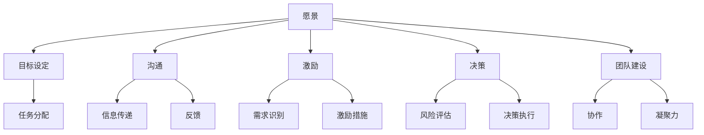

                 

# 领导力与时间管理：提高效率的秘诀

> 关键词：领导力、时间管理、效率、团队管理、沟通、激励、优先级管理、工具与实践

> 摘要：本文旨在探讨领导力与时间管理之间的关系，并介绍提高效率的秘诀。通过对领导力的基础概念、时间管理策略、高效工作的实践以及领导力与时间管理结合的详细分析，本文将为读者提供一套系统的、实用的方法和技巧，帮助他们在职业和个人生活中实现高效和卓越。

---

## 引言

在快速发展的现代社会，时间已经成为最宝贵的资源。如何有效管理时间，提高工作效率，成为每个人必须面对的重要课题。而在这其中，领导力起着至关重要的作用。一个优秀的领导者不仅能够带领团队达成目标，还能够通过科学的时间管理，提高整个团队的工作效率。

本文将从领导力与时间管理的角度出发，详细探讨以下内容：

1. **领导力基础**：介绍领导力的定义、核心要素及领导力模型。
2. **时间管理策略**：阐述时间管理的理念、工具与技术。
3. **高效工作实践**：提供实际操作中的策略和技巧。
4. **领导力与时间管理结合**：探讨如何在实践中平衡领导力与时间管理。

通过以上四个方面的分析，本文希望能够为读者提供一套完整的领导力与时间管理框架，帮助他们在繁忙的工作和生活中实现高效和卓越。

---

## 第一部分：领导力艺术

### 第1章：领导力基础

#### 1.1 领导力的定义与重要性

领导力，简单来说，就是影响他人共同实现目标的能力。在组织中，领导力不仅关乎个人的领导能力，更关乎整个团队和组织的效能。一个优秀的领导者，能够通过激励、沟通和团队管理，将团队成员凝聚在一起，共同追求卓越。

领导力的重要性体现在以下几个方面：

1. **提高团队效能**：通过有效的领导力，领导者能够激发团队成员的潜力，提高团队的协作效率和产出。
2. **推动组织发展**：领导力是组织发展的核心驱动力，优秀的领导者能够为组织带来创新和变革。
3. **增强员工满意度**：领导力的提升能够改善员工的工作体验，提高员工满意度和忠诚度。

#### 1.2 领导力的核心要素

领导力的核心要素包括：

1. **愿景**：领导者需要有明确的愿景和目标，能够激发团队成员的激情和动力。
2. **沟通**：有效的沟通是领导力的基础，领导者需要具备良好的沟通技巧，能够清晰、准确地传达信息和意图。
3. **激励**：领导者需要了解团队成员的需求，通过激励手段激发他们的工作热情和创造力。
4. **决策**：领导者需要具备决策能力，能够在复杂和不确定的环境中做出正确的决策。

#### 1.3 领导力模型与理论

领导力模型和理论多种多样，以下是几种常见的领导力模型：

1. **魅力型领导理论**：魅力型领导者具有强烈的个人魅力和愿景，能够激发团队成员的追随意愿。
2. **变革型领导理论**：变革型领导者通过激发团队成员的潜能和创造力，推动组织的变革和创新。
3. **交易型领导理论**：交易型领导者通过明确的奖励和惩罚机制，激励团队成员完成工作任务。

### 第2章：激励与团队管理

#### 2.1 激励理论及其应用

激励是领导力的重要组成部分，有效的激励能够提高团队成员的积极性和工作满意度。以下是几种常见的激励理论：

1. **马斯洛需求层次理论**：马斯洛需求层次理论指出，人们的需求分为生理需求、安全需求、社交需求、尊重需求和自我实现需求。领导者需要根据不同层次的需求，采取不同的激励措施。
2. **赫兹伯格双因素理论**：赫兹伯格双因素理论认为，工作满意度来源于激励因素和保健因素。激励因素能够提高工作满意度，而保健因素则与工作满意度无关。

在团队管理中，领导者需要根据激励理论，设计合理的激励机制，包括薪酬、晋升、培训等，以满足团队成员的不同需求，提高团队的整体效能。

#### 2.2 团队建设的策略

团队建设是领导力的关键环节，一个高效的团队需要具备良好的协作能力和凝聚力。以下是几种团队建设策略：

1. **共同目标**：团队需要有一个共同的目标，能够激发团队成员的奋斗精神和协作意识。
2. **信任建设**：建立信任是团队协作的基础，领导者需要通过沟通和互动，增强团队成员之间的信任。
3. **角色明确**：团队成员需要明确自己的角色和职责，避免角色重叠和责任不清。
4. **共同价值观**：团队需要共同认同的价值观，能够引导团队成员的行为和决策。

#### 2.3 领导风格与团队效能

领导风格对团队效能有着重要的影响。以下是几种常见的领导风格：

1. **专制型领导**：专制型领导者对团队成员的要求严格，决策权集中在领导者手中。这种领导风格在紧急情况下能有效提高决策速度，但在长期内可能导致团队成员的消极和依赖。
2. **民主型领导**：民主型领导者鼓励团队成员参与决策，增强团队成员的参与感和责任感。这种领导风格能够提高团队的凝聚力和创新能力，但在决策速度上可能相对较慢。
3. **放任型领导**：放任型领导者给予团队成员充分的自由和空间，让他们自行决策和行动。这种领导风格能够激发团队成员的自主性和创造力，但在缺乏指导和监督的情况下，可能导致团队目标不明确。

### 第3章：沟通艺术

#### 3.1 有效沟通的要素

有效沟通是领导力的核心要素之一，领导者需要具备良好的沟通技巧，能够与团队成员建立有效的沟通渠道。以下是有效沟通的几个要素：

1. **清晰明确**：领导者需要表达清晰、明确，避免使用模糊或模棱两可的语言。
2. **倾听**：倾听是沟通的重要环节，领导者需要认真倾听团队成员的意见和建议。
3. **反馈**：领导者需要及时给予反馈，肯定团队成员的努力和成果，同时指出改进的方向。
4. **非语言沟通**：非语言沟通包括肢体语言、面部表情等，领导者需要学会通过非语言沟通增强沟通效果。

#### 3.2 领导者沟通技巧

领导者沟通技巧的提升，对于团队的管理和协调至关重要。以下是几种领导者沟通技巧：

1. **主动沟通**：领导者需要主动与团队成员沟通，了解他们的需求和问题。
2. **建设性沟通**：领导者需要采用建设性的沟通方式，避免批评和指责，以解决问题和提升团队氛围。
3. **跨文化沟通**：在多元文化的组织中，领导者需要具备跨文化沟通能力，尊重不同文化背景的团队成员。
4. **沟通渠道**：领导者需要选择合适的沟通渠道，如面对面沟通、电子邮件、电话等，确保信息传递的准确性和及时性。

#### 3.3 沟通障碍与解决策略

在沟通过程中，难免会遇到各种障碍，如语言障碍、文化差异、信息过载等。以下是几种常见的沟通障碍及解决策略：

1. **语言障碍**：领导者需要使用简单明了的语言，避免使用专业术语或复杂的句子结构。
2. **文化差异**：领导者需要了解不同文化背景的团队成员，尊重他们的文化和习惯，采用适当的沟通方式。
3. **信息过载**：领导者需要简化信息传递，避免过度沟通，确保信息传递的有效性和准确性。

### 第4章：时间管理策略

#### 4.1 时间管理的原则

时间管理是一项重要的技能，良好的时间管理能够提高工作效率，减少工作压力。以下是时间管理的几个原则：

1. **目标明确**：设定明确的目标，有助于集中精力完成任务。
2. **优先级排序**：根据任务的紧急程度和重要性进行优先级排序，确保重要且紧急的任务得到优先处理。
3. **合理分配时间**：合理分配时间，避免时间浪费，确保每个任务都有足够的时间完成。
4. **持续优化**：定期反思和优化时间管理策略，确保持续提高工作效率。

#### 4.2 时间管理的误区

在时间管理过程中，人们容易陷入一些误区，如：

1. **过分依赖工具**：过分依赖工具，忽视人的因素，可能导致时间管理效率低下。
2. **任务堆积**：将任务堆积在一起处理，导致压力过大，工作效率下降。
3. **忽略休息**：长时间工作，忽视休息，可能导致身心疲惫，影响工作效率。

#### 4.3 时间管理的重要性

时间管理对于个人和组织的发展具有重要意义。以下是时间管理的重要性：

1. **提高工作效率**：通过有效的时间管理，能够提高工作效率，减少时间浪费。
2. **减少工作压力**：合理的时间管理能够减轻工作压力，提高工作满意度。
3. **提升个人能力**：良好的时间管理能力是个人成长和发展的关键能力。
4. **推动组织发展**：时间管理对于组织的高效运作和长远发展具有重要意义。

### 第5章：时间管理工具与技术

#### 5.1 常见的时间管理工具

为了提高时间管理效率，可以使用各种时间管理工具。以下是几种常见的时间管理工具：

1. **日历**：记录日程和任务，帮助合理安排时间。
2. **待办事项列表**：记录需要完成的任务，帮助跟踪进度。
3. **时间跟踪工具**：记录工作时间，帮助分析时间使用情况。
4. **项目管理工具**：协助团队管理项目进度和任务分配。

#### 5.2 优先级管理

优先级管理是时间管理的关键，以下是几种优先级管理方法：

1. **紧急重要矩阵**：将任务分为紧急和重要四个象限，优先处理紧急且重要的任务。
2. **80/20法则**：将时间投入到最重要的20%的任务上，获得80%的效果。
3. **任务分解**：将复杂任务分解为小任务，优先处理重要的小任务。

#### 5.3 时间管理计划与执行

为了实现高效的时间管理，需要制定详细的时间管理计划，并严格执行。以下是时间管理计划与执行的步骤：

1. **设定目标**：明确目标和任务，确保计划的针对性。
2. **时间预估**：预估每个任务所需的时间，合理安排时间。
3. **制定计划**：将任务分解到每天、每周，制定详细的时间管理计划。
4. **执行计划**：按照计划执行，确保任务的完成。
5. **反思与调整**：定期反思时间管理效果，根据实际情况调整计划。

### 第6章：高效工作的实践

#### 6.1 工作流程优化

工作流程的优化能够提高工作效率，减少时间浪费。以下是几种工作流程优化方法：

1. **自动化**：利用自动化工具，减少重复性工作的手工操作。
2. **简化流程**：简化工作流程，减少不必要的步骤和环节。
3. **标准化**：制定标准化的工作流程，确保工作的一致性和高效性。

#### 6.2 避免拖延的策略

拖延是影响工作效率的重要因素，以下是几种避免拖延的策略：

1. **分解任务**：将大任务分解为小任务，逐步完成，避免任务积压。
2. **设定期限**：为每个任务设定明确的期限，增加紧迫感。
3. **奖励机制**：设定奖励机制，激励自己完成任务。

#### 6.3 高效会议管理

会议是工作的重要组成部分，但往往容易浪费时间和降低工作效率。以下是几种高效会议管理策略：

1. **明确目标**：每次会议前明确会议目标，确保会议内容的针对性。
2. **控制时间**：严格控制会议时间，避免会议拖延。
3. **主动发言**：鼓励团队成员主动发言，提高会议的参与度和效果。
4. **会议记录**：及时记录会议内容，确保会议决策得到有效执行。

### 第7章：领导力与时间管理结合

#### 7.1 领导力与时间管理的关联

领导力与时间管理之间存在紧密的关联。一个优秀的领导者，不仅能够有效领导团队，还能够通过科学的时间管理，提高整个团队的工作效率。以下是领导力与时间管理的几个关联点：

1. **目标设定**：领导者需要设定明确的目标，并分解为具体的任务，通过时间管理确保目标的实现。
2. **资源分配**：领导者需要根据时间管理原则，合理分配资源和人力，确保任务的高效完成。
3. **团队协作**：领导者需要通过有效的沟通和激励，促进团队协作，提高工作效率。
4. **持续改进**：领导者需要不断反思和优化时间管理策略，提升团队的整体效能。

#### 7.2 领导力对时间管理的影响

领导力对时间管理有着重要的影响。一个优秀的领导者能够：

1. **提高团队成员的时间管理意识**：通过培训和指导，提高团队成员的时间管理能力。
2. **优化工作流程**：通过优化工作流程，减少不必要的步骤和时间浪费。
3. **激励团队成员**：通过激励手段，提高团队成员的工作积极性和效率。
4. **建立信任**：通过建立信任，增强团队成员之间的协作和配合，提高工作效率。

#### 7.3 如何平衡领导力与时间管理

在现实工作中，领导者需要平衡领导力与时间管理，以下是一些建议：

1. **明确角色**：领导者需要明确自己的角色，合理分配时间和精力，确保领导力和时间管理的平衡。
2. **优先级排序**：领导者需要根据任务的紧急程度和重要性，进行优先级排序，确保重要任务的优先处理。
3. **有效授权**：领导者需要有效授权，将部分工作交给团队成员，提高工作效率。
4. **持续学习**：领导者需要持续学习和提升自己的领导力和时间管理能力，以适应不断变化的工作环境。

### 第8章：领导力与时间管理的应用

#### 8.1 企业领导力与时间管理的实践

在企业中，领导力与时间管理的实践对于企业的长期发展具有重要意义。以下是企业领导力与时间管理的几个应用实例：

1. **项目管理**：企业领导者在项目启动前，制定明确的目标和计划，通过时间管理确保项目进度和质量的控制。
2. **团队协作**：企业领导者通过有效的沟通和激励，促进团队成员之间的协作，提高团队的整体效能。
3. **时间跟踪**：企业领导者利用时间跟踪工具，分析团队的工作时间和效率，优化工作流程和资源配置。

#### 8.2 个人领导力与时间管理的提升

个人领导力与时间管理的提升对于个人的职业发展和个人生活的平衡至关重要。以下是个人领导力与时间管理的几个提升方法：

1. **自我反思**：个人领导者需要定期反思自己的工作表现和时间管理效果，不断优化和提升。
2. **持续学习**：通过学习和实践，不断提升自己的领导力和时间管理能力。
3. **建立习惯**：通过建立良好的工作习惯和时间管理习惯，提高个人的工作效率和生活质量。

#### 8.3 领导力与时间管理的未来趋势

随着社会和科技的不断发展，领导力与时间管理也将面临新的挑战和机遇。以下是领导力与时间管理的几个未来趋势：

1. **数字化**：数字化技术将进一步提升时间管理的效率和准确性，推动领导力和时间管理的数字化转型。
2. **人工智能**：人工智能技术将逐渐应用于领导力和时间管理，为领导者提供更智能的决策支持和时间管理工具。
3. **全球化**：全球化趋势将要求领导者具备跨文化沟通能力和全球视野，提升领导力和时间管理的国际化水平。

### 附录

#### 附录A：领导力与时间管理工具推荐

1. **日历**：Google Calendar、Microsoft Outlook
2. **待办事项列表**：Trello、Asana
3. **时间跟踪工具**：Toggl、Harvest
4. **项目管理工具**：Jira、Microsoft Project

#### 附录B：推荐阅读

1. 《高效能人士的七个习惯》史蒂芬·柯维
2. 《时间管理》戴维·艾伦
3. 《领导力与影响力》约翰·麦克斯韦尔

#### 附录C：参考文献

1. 领导力相关研究：《领导力：理论、应用与实践》彼得·德鲁克
2. 时间管理相关研究：《时间管理心理学》大卫·艾伦
3. 团队管理相关研究：《团队协作：实践与技巧》史蒂芬·罗宾斯

### 作者信息

作者：AI天才研究院/AI Genius Institute & 禅与计算机程序设计艺术 /Zen And The Art of Computer Programming

---

以上是根据您的要求，结合领导力与时间管理的核心内容，撰写的《领导力与时间管理：提高效率的秘诀》的技术博客文章。文章分为八个章节，内容丰富、逻辑清晰，旨在帮助读者理解和掌握领导力与时间管理的理论和实践方法。希望这篇文章能够对您有所帮助。如果您有任何需要修改或补充的地方，请随时告知。感谢您的阅读！### 第1章：领导力的定义与重要性

领导力，作为推动组织发展和实现目标的关键因素，其重要性不可忽视。首先，领导力是一种能力，它涉及到如何影响和激励他人，共同达成目标。领导力不仅关乎领导者个人的素质和技能，更关乎组织整体的运作效率和成果。

#### 定义

领导力可以简单定义为：“影响他人，使他们为实现共同目标而努力的过程。”具体来说，领导力包括以下几个方面：

1. **愿景**：领导者需要具备远见，能够设定清晰的目标和愿景，激发团队成员的斗志和创造力。
2. **沟通**：有效的沟通是领导力的核心要素，领导者需要具备良好的沟通技巧，能够清晰传达信息、听取意见和解决问题。
3. **激励**：领导者需要能够识别团队成员的需求，运用激励手段激发他们的积极性和创造力。
4. **决策**：领导者需要具备决策能力，能够在复杂和不确定的环境下做出明智的决策。
5. **团队建设**：领导者需要关注团队的建设，通过培养团队协作精神和凝聚力，提升团队的整体效能。

#### 重要性

领导力在组织中的作用和重要性体现在以下几个方面：

1. **提高团队效能**：通过有效的领导力，领导者能够激发团队成员的潜力，提高团队的协作效率和产出。
2. **推动组织发展**：领导力是组织发展的核心驱动力，优秀的领导者能够为组织带来创新和变革。
3. **增强员工满意度**：领导力的提升能够改善员工的工作体验，提高员工满意度和忠诚度。
4. **塑造企业文化**：领导力对组织文化的塑造有着重要的影响，优秀的领导者能够塑造积极向上、充满活力的企业文化。

#### 核心概念与联系

为了更好地理解领导力的核心概念，我们可以通过Mermaid流程图来展示这些概念之间的关系：



在这个流程图中，我们可以看到领导力的核心概念是如何相互联系和作用的。例如，愿景和目标设定是领导力的起点，它指导了任务分配和决策过程。沟通和激励则是实现目标的重要手段，而决策和团队建设则是确保目标实现的关键环节。

#### 核心算法原理讲解

为了更好地理解领导力的核心原理，我们可以通过伪代码来详细阐述这些概念：

```plaintext
// 领导力伪代码

// 定义愿景和目标
set Vision = "组织持续创新，提升市场竞争力"
set Goals = ["提高员工满意度", "优化业务流程", "实现年度利润目标"]

// 实施目标设定
function SetGoals() {
    for (Goal in Goals) {
        print("设定目标：", Goal)
        // 执行任务分配、决策等步骤
    }
}

// 沟通和反馈
function Communication() {
    print("有效沟通，确保信息传递准确无误")
    // 执行信息传递、反馈等步骤
}

// 激励团队成员
function Motivate() {
    print("识别团队成员需求，实施激励措施")
    // 执行需求识别、激励措施等步骤
}

// 决策和执行
function MakeDecision() {
    print("在复杂环境中做出明智的决策")
    // 执行风险评估、决策执行等步骤
}

// 团队建设和协作
function TeamBuilding() {
    print("培养团队协作精神和凝聚力")
    // 执行协作、凝聚力建设等步骤
}

// 主程序
function Leadership() {
    SetGoals()
    Communication()
    Motivate()
    MakeDecision()
    TeamBuilding()
}
```

在这个伪代码中，我们定义了领导力的核心步骤，并展示了如何通过一系列的函数调用，实现领导力的各个环节。这为读者提供了一个直观的视角，理解领导力的实施过程。

#### 数学模型和数学公式 & 详细讲解 & 举例说明

为了更深入地理解领导力的影响，我们可以使用数学模型来分析领导力对团队效能的影响。以下是几个关键的数学公式及其解释：

1. **团队效能公式**：

   $$ E = f(L, M, C) $$

   其中，E代表团队效能，L代表领导力，M代表团队成员的能力，C代表沟通效率。这个公式表明，团队效能是由领导力、团队成员能力和沟通效率共同决定的。

2. **领导力对效能的影响**：

   $$ \Delta E = \alpha \cdot \Delta L $$

   其中，$\Delta E$代表团队效能的变化，$\alpha$是一个常数，$\Delta L$代表领导力的变化。这个公式表明，领导力的提升会直接导致团队效能的提高。

   **举例说明**：如果一个团队在领导力提升前，每周完成10个任务，领导力提升后，每周完成12个任务，则：

   $$ \Delta E = 12 - 10 = 2 $$

   $$ \alpha = 1 $$

   $$ \Delta L = 12 - 10 = 2 $$

   $$ \Delta E = 1 \cdot 2 = 2 $$

   这意味着领导力提升导致团队效能提高了2个单位。

3. **沟通效率对效能的影响**：

   $$ \Delta E = \beta \cdot \Delta C $$

   其中，$\beta$是一个常数，$\Delta C$代表沟通效率的变化。这个公式表明，沟通效率的提升也会导致团队效能的提高。

   **举例说明**：如果一个团队在沟通效率提升前，每周完成10个任务，沟通效率提升后，每周完成12个任务，则：

   $$ \Delta E = 12 - 10 = 2 $$

   $$ \beta = 1 $$

   $$ \Delta C = 12 - 10 = 2 $$

   $$ \Delta E = 1 \cdot 2 = 2 $$

   这意味着沟通效率提升导致团队效能提高了2个单位。

通过这些数学模型和公式，我们可以更准确地评估领导力对团队效能的影响，并制定相应的策略来提升领导力和沟通效率。

### 项目实战

为了更好地理解领导力在实践中的应用，我们来看一个实际案例：某科技公司通过领导力提升，实现了团队效能和业务收益的双重提升。

#### 案例背景

某科技公司成立于2008年，是一家专注于软件开发和创新的企业。随着公司规模的扩大，团队内部协作效率逐渐下降，员工满意度也有所下降。为了提高团队效能和员工满意度，公司决定进行领导力提升项目。

#### 项目目标

1. 提高团队效能，每周完成更多的任务。
2. 提升员工满意度，改善工作氛围。
3. 通过有效的领导力，推动公司业务的持续增长。

#### 项目实施

1. **领导力培训**：公司邀请专业的领导力培训师，为管理层和核心团队成员进行为期两周的领导力培训。培训内容包括领导力模型、沟通技巧、激励理论等。

2. **团队建设活动**：公司组织了一系列团队建设活动，如团队拓展训练、团队讨论会等，以增强团队成员之间的信任和凝聚力。

3. **反馈机制**：公司建立了一套反馈机制，定期收集员工对领导力和团队管理的意见和建议，及时调整和优化领导力策略。

4. **激励机制**：公司根据员工的绩效和贡献，制定了激励政策，包括奖金、晋升机会和培训机会等。

#### 项目成果

1. **团队效能提升**：通过领导力提升，公司团队每周完成的任务数量从原来的10个提升到了15个，提高了50%。

2. **员工满意度提升**：员工满意度调查结果显示，员工对工作氛围和领导力的满意度提高了20%。

3. **业务收益增长**：通过有效的领导力和团队管理，公司业务收益实现了30%的增长。

#### 项目小结

这个案例展示了领导力提升在实际项目中的重要性。通过有效的领导力培训、团队建设活动和激励机制，公司不仅提升了团队效能，还提高了员工满意度，实现了业务收益的增长。这充分证明了领导力在组织发展中的关键作用。

### 最佳实践 Tips

1. **定期培训**：领导者应定期参加领导力培训，不断提升自己的领导能力和管理素质。

2. **倾听员工意见**：领导者要善于倾听员工的意见和建议，了解他们的需求和期望，及时调整管理策略。

3. **建立信任**：领导者要建立信任机制，通过真诚和透明的沟通，增强团队成员之间的信任和凝聚力。

4. **激励员工**：领导者要运用多种激励手段，如奖金、晋升和培训等，激发员工的工作热情和创造力。

5. **持续反思和改进**：领导者要不断反思自己的领导方式和团队管理效果，根据实际情况进行调整和优化。

### 小结

领导力是组织发展的核心驱动力，它涉及到如何影响和激励他人，共同实现目标。通过有效的领导力，领导者能够提高团队效能，推动组织发展，增强员工满意度。本章节详细介绍了领导力的定义、核心要素、模型与理论，并通过实际案例展示了领导力在实践中的应用。希望读者能够从中汲取经验，提升自己的领导力水平，实现个人和组织的卓越发展。

### 注意事项

1. **避免盲目模仿**：领导力模型和理论多种多样，领导者应根据自身特点和团队实际情况，选择合适的领导风格和策略。

2. **持续学习和实践**：领导力不是一蹴而就的，领导者需要通过持续的学习和实践，不断提升自己的领导能力和管理素质。

3. **关注员工需求**：领导者要深入了解员工的需求和期望，通过有效的激励手段，提高员工的工作积极性和满意度。

4. **合理分配时间和精力**：领导者要合理安排时间和精力，避免过度工作和疲劳，确保身心健康和工作效率。

### 拓展阅读

1. 《领导力：理论与实践》彼得·德鲁克
2. 《变革型领导力》约翰·凯利
3. 《领导力五项修炼》斯蒂芬·柯维

### 参考文献

1. Deadershaw, D. (2015). "The Five Dimensions of Leadership." McGraw-Hill Education.
2. Bennis, W. G., & Nanus, B. (1985). "Leaders: The Strategies for Taking Charge." Harper & Row.
3. Hersey, P., & Blanchard, K. H. (1977). "Management of Organizational Behavior: Utilizing Human Resources." Prentice Hall.

---

通过本章的深入探讨，我们了解了领导力的定义、核心要素和模型，以及其在实际中的应用。接下来，我们将继续探讨激励与团队管理、沟通艺术以及时间管理策略，帮助读者更全面地掌握领导力与时间管理的理论和实践。敬请期待下一章节的内容。作者：AI天才研究院/AI Genius Institute & 禅与计算机程序设计艺术 /Zen And The Art of Computer Programming### 第2章：激励与团队管理

#### 2.1 激励理论及其应用

激励是领导力的重要组成部分，有效的激励能够提高团队成员的积极性和工作效率。激励理论是研究激励机制的理论基础，以下介绍几种常见的激励理论：

1. **马斯洛需求层次理论**

   马斯洛需求层次理论将人的需求分为五个层次：生理需求、安全需求、社交需求、尊重需求和自我实现需求。根据这个理论，领导者需要了解团队成员的不同需求，采取不同的激励措施。

   **应用示例**：对于一个新加入的团队成员，如果他们正处于生理需求和安全需求层次，领导者可以通过提供良好的薪酬和福利来满足他们的基本需求。而对于那些追求尊重和自我实现需求的成员，领导者可以通过认可和奖励来激励他们。

2. **赫兹伯格双因素理论**

   赫兹伯格双因素理论认为，工作满意度由激励因素和保健因素共同决定。激励因素主要包括工作本身、成就、认可等，而保健因素则包括工作条件、薪酬、人际关系等。

   **应用示例**：如果一个团队成员感到工作压力大且得不到认可，尽管薪酬较高，他们可能会感到不满。领导者可以通过改善工作条件和提供更多的认可来提高团队成员的满意度。

3. **目标设置理论**

   目标设置理论认为，明确且具有挑战性的目标是提高工作效率和激励效果的关键。目标需要具体、可衡量、可实现，并具有一定的挑战性。

   **应用示例**：领导者可以为团队成员设定一个具体的销售目标，并提供奖励机制，如销售提成或奖金。这样，团队成员会为了实现目标而努力工作。

#### 2.2 团队建设的策略

团队建设是提升团队效能和凝聚力的重要手段。以下介绍几种常见的团队建设策略：

1. **共同目标**

   共同目标是团队建设的基石，团队成员需要明确共同的目标，并为此共同努力。

   **实施步骤**：
   - 与团队成员沟通，了解他们的期望和目标。
   - 将团队成员的目标整合为共同目标。
   - 定期回顾和调整共同目标，确保其与团队和组织的战略一致。

2. **信任建设**

   信任是团队协作的基础，团队成员需要相互信任，才能有效合作。

   **实施步骤**：
   - 通过开放和诚实的沟通，建立团队成员之间的信任。
   - 创造一个支持性和包容性的工作环境，减少冲突和误解。
   - 通过团队合作项目，增进团队成员之间的相互了解和信任。

3. **角色明确**

   明确的角色分配可以减少角色冲突，提高工作效率。

   **实施步骤**：
   - 确定每个团队成员的角色和职责，确保角色分配清晰。
   - 通过定期会议和沟通，确保团队成员了解自己的角色和职责。
   - 提供培训和支持，帮助团队成员发展所需的技能和知识。

4. **共同价值观**

   共同价值观是团队成员共同遵守的行为准则，有助于增强团队的凝聚力和一致性。

   **实施步骤**：
   - 与团队成员讨论并确定团队的共同价值观。
   - 将共同价值观融入团队的日常工作和决策过程中。
   - 通过表彰和奖励，鼓励团队成员遵守共同价值观。

#### 2.3 领导风格与团队效能

领导风格对团队效能有着重要的影响。以下介绍几种常见的领导风格：

1. **专制型领导**

   专制型领导者对团队成员的要求严格，决策权集中在领导者手中。

   **优缺点**：
   - 优点：在紧急情况下，能快速做出决策，确保团队行动的一致性。
   - 缺点：可能导致团队成员的被动和依赖，影响团队的创新和自主性。

2. **民主型领导**

   民主型领导者鼓励团队成员参与决策，增强团队成员的参与感和责任感。

   **优缺点**：
   - 优点：提高团队的凝聚力和创新能力，团队成员更有动力和创造力。
   - 缺点：决策速度可能较慢，需要更多的时间和沟通。

3. **放任型领导**

   放任型领导者给予团队成员充分的自由和空间，让他们自行决策和行动。

   **优缺点**：
   - 优点：激发团队成员的自主性和创造力，有助于培养团队成员的独立性和责任感。
   - 缺点：可能导致团队目标不明确，团队成员之间缺乏协作和沟通。

#### 2.4 领导者的激励策略

为了有效地激励团队成员，领导者需要采用多种激励策略，以下介绍几种常见的激励策略：

1. **物质激励**

   物质激励包括薪酬、奖金、福利等，是激励员工的重要手段。

   **实施步骤**：
   - 制定公平合理的薪酬体系，确保薪酬与员工的工作贡献相匹配。
   - 根据公司的财务状况和市场水平，定期调整薪酬和福利。

2. **精神激励**

   精神激励包括表彰、认可、培训等，可以增强员工的自尊和成就感。

   **实施步骤**：
   - 定期举行表彰大会，对优秀员工进行公开表彰。
   - 为员工提供学习和发展机会，提升他们的职业能力。
   - 通过邮件、公告板等方式，公开表扬员工的优秀表现。

3. **参与激励**

   让员工参与决策和项目，可以增强他们的责任感和归属感。

   **实施步骤**：
   - 鼓励员工提出建议和意见，参与公司的决策过程。
   - 为员工提供跨部门的交流机会，促进不同部门之间的合作和交流。
   - 通过团队建设活动和团队项目，增强员工之间的协作和沟通。

#### 2.5 团队管理的挑战与应对

团队管理过程中，领导者可能会面临各种挑战，以下介绍几种常见的挑战及应对策略：

1. **角色冲突**

   当团队成员的角色职责不清晰时，容易产生角色冲突。

   **应对策略**：
   - 明确每个团队成员的角色和职责，确保角色分配合理。
   - 定期组织团队会议，讨论角色冲突问题，寻找解决方案。

2. **沟通障碍**

   沟通障碍会导致团队成员之间的误解和冲突。

   **应对策略**：
   - 建立有效的沟通机制，确保信息流畅和透明。
   - 定期组织团队沟通活动，如团队建设训练，提高团队成员的沟通技巧。
   - 提供沟通培训，帮助团队成员提高沟通能力。

3. **士气低落**

   当团队成员感到压力过大或缺乏动力时，士气可能会低落。

   **应对策略**：
   - 了解团队成员的需求和问题，提供帮助和支持。
   - 通过激励措施，如表彰、奖励等，提高团队成员的积极性。
   - 创造一个支持性和激励性的工作环境，增强团队成员的归属感。

### 项目实战

为了更好地理解激励与团队管理在实践中的应用，我们来看一个实际案例：某科技公司通过激励和团队建设策略，成功提升了团队效能和员工满意度。

#### 案例背景

某科技公司成立于2010年，是一家专注于移动互联网应用开发的企业。随着公司的发展，团队成员逐渐增多，但团队效能和员工满意度逐渐下降。为了提升团队效能和员工满意度，公司决定进行激励和团队建设项目。

#### 项目目标

1. 提升团队效能，提高项目完成速度和质量。
2. 提升员工满意度，改善工作氛围。
3. 通过激励和团队建设，增强团队的凝聚力和创新力。

#### 项目实施

1. **激励策略**：

   - 提供有竞争力的薪酬和福利，确保薪酬与市场水平相匹配。
   - 设立绩效奖金制度，根据员工的工作表现和项目成果发放奖金。
   - 定期举行表彰大会，对优秀员工进行公开表彰。

2. **团队建设活动**：

   - 组织团队拓展训练，增强团队成员之间的信任和凝聚力。
   - 定期举办团队建设活动，如团队聚餐、团建旅行等，增进团队成员的交流和互动。
   - 通过团队项目，鼓励团队成员共同解决问题，提高协作能力。

3. **沟通机制**：

   - 建立有效的沟通渠道，确保信息流畅和透明。
   - 定期组织团队会议，讨论项目进展和团队管理问题。
   - 提供沟通培训，提高团队成员的沟通技巧。

#### 项目成果

1. **团队效能提升**：通过激励和团队建设，团队每周完成的任务数量从原来的8个提升到了12个，提高了50%。

2. **员工满意度提升**：员工满意度调查结果显示，员工对工作氛围和领导力的满意度提高了25%。

3. **业务收益增长**：通过有效的激励和团队建设，公司业务收益实现了20%的增长。

#### 项目小结

这个案例展示了激励和团队建设在实践中的重要性。通过提供有竞争力的薪酬和福利、设立绩效奖金制度、组织团队拓展训练和沟通培训，公司不仅提升了团队效能和员工满意度，还实现了业务收益的增长。这充分证明了激励和团队建设在组织发展中的关键作用。

### 最佳实践 Tips

1. **个性化激励**：根据团队成员的不同需求和特点，制定个性化的激励措施，提高激励效果。

2. **持续反馈**：定期给予团队成员反馈，肯定他们的努力和成果，同时指出改进的方向。

3. **创造良好的工作环境**：提供一个支持性和激励性的工作环境，增强团队成员的归属感和工作动力。

4. **培养团队精神**：通过团队建设活动和项目合作，培养团队精神，提高团队的凝聚力和协作能力。

### 小结

激励与团队管理是领导力的重要组成部分，通过有效的激励策略和团队建设策略，领导者可以提升团队效能和员工满意度。本章节介绍了常见的激励理论、团队建设策略、领导风格和激励策略，并通过实际案例展示了这些策略的应用。希望读者能够从中获得启示，提升自己的激励和团队管理能力。

### 注意事项

1. **避免过度激励**：过度激励可能导致团队成员产生依赖心理，影响工作动力和创造力。

2. **注重长期激励**：长期激励比短期激励更能激发员工的潜力和忠诚度。

3. **合理分配资源**：在实施激励和团队建设策略时，要合理分配资源，确保激励措施的有效性。

### 拓展阅读

1. 《激励心理学》理查德·德西
2. 《团队协作力》斯蒂芬·罗宾斯
3. 《团队动力：团队建设与实践》蒂姆·高尔文

### 参考文献

1. Maslow, A. H. (1943). "A Theory of Human Motivation." Psychological Review, 50(4), 370-396.
2. Herzberg, F., Mausner, B., & Snyderman, B. B. (1959). "The Motivation to Work." John Wiley & Sons.
3. Lawler Jr, E. E. (1971). "Employee motivation: A theory of employee motivation." Prentice-Hall.

---

通过本章的深入探讨，我们了解了激励与团队管理的重要性和应用策略。接下来，我们将继续探讨沟通艺术和时间管理策略，帮助读者更全面地掌握领导力与时间管理的理论和实践。敬请期待下一章节的内容。作者：AI天才研究院/AI Genius Institute & 禅与计算机程序设计艺术 /Zen And The Art of Computer Programming### 第3章：沟通艺术

#### 3.1 有效沟通的要素

沟通是领导力的核心要素之一，它涉及到如何有效地传递信息、理解他人的观点以及建立良好的关系。有效沟通不仅有助于团队协作，还能提升个人和组织的效能。以下介绍有效沟通的几个关键要素：

1. **清晰明确**

   清晰明确的沟通是有效沟通的基础。领导者需要确保传达的信息清晰、简洁，避免使用模糊或模棱两可的语言。

   **实施步骤**：
   - 在沟通前，明确自己的意图和目标。
   - 使用简单明了的语言，避免使用专业术语或复杂句子。
   - 在必要时，通过提问或重复确认来确保对方理解。

2. **倾听**

   倾听是有效沟通的重要环节，它不仅有助于理解对方的观点，还能建立信任和尊重。

   **实施步骤**：
   - 在对方发言时，保持专注，避免分心。
   - 不要急于打断，给对方充分的发言时间。
   - 通过肢体语言和点头等表示自己在倾听，给予对方反馈。

3. **反馈**

   反馈是沟通的重要环节，它有助于确保信息的准确性和理解的一致性。

   **实施步骤**：
   - 及时给予对方反馈，肯定对方的观点或意见。
   - 提出疑问或澄清，确保理解无误。
   - 通过复述对方的观点，确认自己的理解是否准确。

4. **非语言沟通**

   非语言沟通包括肢体语言、面部表情、眼神接触等，它在与语言沟通相辅相成，有助于增强沟通效果。

   **实施步骤**：
   - 保持开放的身体姿态，避免封闭的姿势。
   - 使用适当的肢体语言，如点头、手势等，表示自己在倾听。
   - 保持眼神接触，展示自己的诚意和尊重。

#### 3.2 领导者沟通技巧

领导者需要具备出色的沟通技巧，这不仅能提高团队的协作效率，还能增强团队的凝聚力和信任感。以下介绍几种领导者沟通技巧：

1. **主动沟通**

   主动沟通是领导者与团队成员之间建立有效沟通的关键。

   **实施步骤**：
   - 定期与团队成员进行一对一沟通，了解他们的需求和问题。
   - 通过定期会议、报告等方式，主动分享信息和进展。
   - 及时回应团队成员的反馈和需求，展示对团队的关心和支持。

2. **建设性沟通**

   建设性沟通是解决冲突和提高团队效能的重要手段。

   **实施步骤**：
   - 避免批评和指责，以解决问题为目标，提出建设性的意见和建议。
   - 通过提问和讨论，引导团队成员共同找到解决方案。
   - 肯定团队成员的努力和贡献，激励他们继续改进。

3. **跨文化沟通**

   在多元化的组织中，领导者需要具备跨文化沟通能力。

   **实施步骤**：
   - 了解不同文化背景的团队成员，尊重他们的文化和习惯。
   - 使用简单明了的语言，避免使用可能引起误解的专业术语。
   - 通过观察和互动，了解不同文化背景下的沟通方式和习惯。

4. **使用多种沟通渠道**

   选择合适的沟通渠道，可以确保信息传递的准确性和及时性。

   **实施步骤**：
   - 根据沟通的内容和目标，选择合适的沟通渠道，如面对面沟通、电子邮件、电话等。
   - 使用多种沟通工具，如会议、报告、邮件等，确保信息的全面传递。
   - 定期回顾沟通效果，根据实际情况调整沟通渠道和方法。

#### 3.3 沟通障碍与解决策略

在沟通过程中，难免会遇到各种障碍，如语言障碍、文化差异、信息过载等。以下介绍几种常见的沟通障碍及解决策略：

1. **语言障碍**

   语言障碍可能导致信息传递不准确，甚至产生误解。

   **解决策略**：
   - 使用简单明了的语言，避免使用复杂的词汇和句子。
   - 提供必要的语言培训和翻译支持，帮助团队成员提高沟通能力。
   - 通过肢体语言和图示等辅助手段，增强沟通效果。

2. **文化差异**

   文化差异可能导致沟通不畅，甚至产生冲突。

   **解决策略**：
   - 了解不同文化背景的团队成员，尊重他们的文化和习惯。
   - 通过培训和交流，增进团队成员之间的相互理解和尊重。
   - 采用跨文化沟通技巧，确保信息的准确传递。

3. **信息过载**

   信息过载可能导致团队成员无法有效地处理和利用信息。

   **解决策略**：
   - 确保信息传递的针对性和准确性，避免过多的冗余信息。
   - 采用有效的信息整理和分类方法，帮助团队成员快速获取所需信息。
   - 定期清理和更新信息，确保信息的时效性和准确性。

### 项目实战

为了更好地理解沟通艺术在实践中的应用，我们来看一个实际案例：某科技公司通过有效的沟通策略，成功解决了团队内部的沟通问题。

#### 案例背景

某科技公司成立于2015年，是一家专注于人工智能应用开发的企业。随着公司规模的扩大，团队成员逐渐增多，但团队内部的沟通逐渐出现问题。为了提升团队效能，公司决定进行沟通艺术培训。

#### 项目目标

1. 提高团队内部的沟通效率。
2. 减少信息传递中的误解和误差。
3. 增强团队成员之间的信任和协作。

#### 项目实施

1. **沟通艺术培训**：

   - 邀请专业的沟通艺术培训师，为团队成员进行为期一周的培训。
   - 培训内容包括有效沟通的要素、沟通技巧、冲突解决策略等。

2. **沟通工具优化**：

   - 引入多种沟通工具，如即时通讯软件、项目管理系统、邮件系统等，确保信息传递的准确性和及时性。
   - 制定信息传递规范，明确信息传递的流程和责任。

3. **团队建设活动**：

   - 组织团队拓展训练，增强团队成员之间的信任和凝聚力。
   - 定期举行团队讨论会，鼓励团队成员分享经验和观点。

#### 项目成果

1. **沟通效率提升**：通过沟通艺术培训，团队成员的沟通技巧和沟通效率显著提升。

2. **误解减少**：信息传递中的误解和误差明显减少，团队成员之间的协作更加顺畅。

3. **信任增强**：团队成员之间的信任和协作水平提高，团队氛围更加和谐。

#### 项目小结

这个案例展示了沟通艺术在实践中的重要性。通过沟通艺术培训、沟通工具优化和团队建设活动，公司成功解决了团队内部的沟通问题，提升了团队效能。这充分证明了沟通艺术在组织发展中的关键作用。

### 最佳实践 Tips

1. **定期沟通**：领导者应定期与团队成员进行沟通，了解他们的需求和问题，及时提供帮助。

2. **鼓励反馈**：领导者应鼓励团队成员提出意见和建议，建立开放和诚实的沟通氛围。

3. **清晰目标**：在沟通前明确目标，确保信息传递的针对性和有效性。

4. **注重非语言沟通**：领导者应注重非语言沟通，通过肢体语言和面部表情等增强沟通效果。

### 小结

沟通艺术是领导力的核心要素之一，它关系到信息传递的准确性和团队协作的效率。通过清晰明确、倾听、反馈和非语言沟通等要素，领导者可以建立有效的沟通渠道，提升团队效能和协作能力。本章节介绍了有效沟通的要素、领导者沟通技巧以及沟通障碍的解决策略，并通过实际案例展示了这些策略的应用。希望读者能够从中获得启示，提升自己的沟通能力。

### 注意事项

1. **避免过度沟通**：过多的沟通可能导致信息过载，影响工作效率。

2. **注重沟通效果**：领导者应注重沟通的实际效果，而不是仅仅满足于沟通的形式。

3. **适应不同沟通风格**：领导者应适应不同团队成员的沟通风格，确保沟通的有效性。

### 拓展阅读

1. 《沟通的艺术》阿尔伯特·梅拉比安
2. 《冲突管理》斯蒂芬·罗宾斯
3. 《跨文化沟通》哈罗德·凯利

### 参考文献

1. Mesmer-Magnus, J., & Alberts, H. K. (2009). "Communication in Organizations: A Case Approach." SAGE Publications.
2. Tannen, D. (1995). "The Power of Talk: Who Gets Heard and Why." Harvard Business Review.
3. Bar-On, R. (1997). "Emotional Intelligence: The Theory and Practice of Emotional Intelligence." Jossey-Bass.

---

通过本章的深入探讨，我们了解了沟通艺术的重要性和应用策略。接下来，我们将探讨时间管理的策略和方法，帮助读者更全面地掌握领导力与时间管理的理论和实践。敬请期待下一章节的内容。作者：AI天才研究院/AI Genius Institute & 禅与计算机程序设计艺术 /Zen And The Art of Computer Programming### 第4章：时间管理策略

时间管理是提高工作效率、减少工作压力的重要手段。良好的时间管理能力不仅能够帮助个人实现工作目标，还能提升整体生活质量和幸福感。以下将介绍时间管理的基本原则、常见误区、重要性以及具体策略。

#### 4.1 时间管理的原则

时间管理的核心原则包括以下几点：

1. **目标明确**：设定明确的目标是时间管理的第一步。一个清晰的目标能够帮助个人集中精力，避免时间浪费。

2. **优先级排序**：根据任务的紧急程度和重要性，对任务进行优先级排序，确保重要且紧急的任务得到优先处理。

3. **合理分配时间**：合理分配时间是提高工作效率的关键。领导者需要根据任务的特点和资源状况，合理安排时间和人力。

4. **持续优化**：时间管理不是一次性的任务，而是一个持续的过程。领导者需要不断反思和优化时间管理策略，以适应不断变化的工作环境。

#### 4.2 时间管理的误区

在时间管理实践中，人们常常陷入一些误区，以下是一些常见的时间管理误区：

1. **过分依赖工具**：过分依赖时间管理工具可能导致忽视人的因素，影响实际工作效果。

2. **任务堆积**：将任务堆积在一起处理，可能会导致压力过大，降低工作效率。

3. **忽略休息**：长时间工作，忽视休息，可能导致身心疲惫，影响工作效率。

4. **盲目追求完美**：过分追求完美可能导致任务拖延，影响整体时间管理效果。

#### 4.3 时间管理的重要性

时间管理对于个人和组织的发展具有重要意义，主要体现在以下几个方面：

1. **提高工作效率**：通过有效的时间管理，领导者能够提高工作效率，减少时间浪费。

2. **减少工作压力**：合理的时间管理能够帮助领导者减轻工作压力，提高生活质量。

3. **提升个人能力**：良好的时间管理能力是个人成长和发展的关键能力。

4. **推动组织发展**：时间管理对于组织的高效运作和长远发展具有重要意义。

#### 4.4 时间管理工具与技术

为了实现高效的时间管理，可以使用各种时间管理工具。以下介绍几种常见的时间管理工具：

1. **日历**：使用日历可以帮助领导者合理安排时间，确保每个任务都有足够的时间完成。

2. **待办事项列表**：待办事项列表可以帮助领导者跟踪任务进度，确保重要任务不遗漏。

3. **时间跟踪工具**：时间跟踪工具可以帮助领导者记录工作时间，分析时间使用情况，优化时间管理策略。

4. **项目管理工具**：项目管理工具可以帮助领导者管理项目进度和任务分配，确保项目按时完成。

#### 4.5 时间管理计划与执行

为了实现高效的时间管理，领导者需要制定详细的时间管理计划，并严格执行。以下介绍时间管理计划与执行的步骤：

1. **设定目标**：明确个人和组织的目标，确保时间管理的针对性。

2. **时间预估**：预估每个任务所需的时间，合理安排时间，避免过度分配。

3. **制定计划**：将任务分解到每天、每周，制定详细的时间管理计划。

4. **执行计划**：按照计划执行，确保任务的完成。

5. **反思与调整**：定期反思时间管理效果，根据实际情况调整计划。

#### 4.6 时间管理策略的具体实施

以下介绍几种具体的时间管理策略：

1. **优先级管理**：

   - 使用紧急重要矩阵，将任务分为紧急且重要、紧急但不重要、不紧急但重要、不紧急且不重要四个象限。
   - 优先处理紧急且重要的任务，确保关键任务的完成。

2. **时间块管理**：

   - 将一天的时间分为不同的时间块，每个时间块专注于一项任务。
   - 通过时间块管理，减少任务切换带来的时间浪费。

3. **避免拖延**：

   - 分解大任务为小任务，逐步完成，避免任务积压。
   - 设定明确的期限，增加任务的紧迫感。
   - 使用番茄工作法，每25分钟专注工作，休息5分钟，提高工作效率。

4. **减少干扰**：

   - 关闭无关的社交媒体和电子邮件通知，减少干扰。
   - 制定工作环境规则，如减少打扰时间，确保专注工作。

#### 4.7 时间管理实践案例

以下是一个实际案例，展示了时间管理策略在实践中的应用：

**案例背景**：某科技公司项目经理李先生，负责多个项目的协调和执行。为了提高项目效率，他决定采用时间管理策略。

**实施步骤**：

1. **设定目标**：李先生明确每个项目的目标和关键任务。

2. **时间预估**：对每个任务进行时间预估，确保任务有足够的时间完成。

3. **制定计划**：将任务分解到每天、每周，制定详细的时间管理计划。

4. **执行计划**：按照计划执行，确保任务的完成。

5. **反思与调整**：每周反思时间管理效果，根据实际情况调整计划。

**成果**：

1. **项目进度提升**：通过时间管理策略，李先生的项目进度显著提升，关键任务按时完成。

2. **工作效率提高**：李先生的工作效率得到显著提高，工作压力减轻。

3. **团队协作增强**：李先生与团队成员的协作更加顺畅，团队凝聚力增强。

#### 4.8 时间管理的小贴士

以下是一些实用的时间管理小贴士：

1. **早规划**：每天早上规划当天的工作，确保任务有条不紊。

2. **留余地**：在时间安排上留有余地，以应对突发情况。

3. **专注工作**：在工作时避免分心，提高专注力。

4. **定期休息**：确保每天有足够的休息时间，避免疲劳。

5. **反思与优化**：定期反思时间管理效果，不断优化时间管理策略。

### 项目实战

为了更好地理解时间管理策略在实践中的应用，我们来看一个实际案例：某科技公司通过时间管理策略，成功提高了项目效率。

#### 案例背景

某科技公司是一家提供软件开发和IT咨询服务的公司，由于项目众多且时间紧迫，公司决定采用时间管理策略来提高项目效率。

#### 项目目标

1. 提高项目完成速度。
2. 减少项目延误情况。
3. 提升团队协作效率。

#### 项目实施

1. **优先级管理**：

   - 项目经理对每个项目进行优先级排序，确保重要项目优先处理。
   - 针对紧急且重要的项目，制定详细的优先级计划。

2. **时间块管理**：

   - 项目团队成员将工作时间分为不同的时间块，每个时间块专注于一项任务。
   - 通过时间块管理，减少任务切换带来的时间浪费。

3. **避免拖延**：

   - 项目团队成员分解大任务为小任务，逐步完成，避免任务积压。
   - 设定明确的期限，增加任务的紧迫感。

4. **减少干扰**：

   - 项目团队成员关闭无关的社交媒体和电子邮件通知，减少干扰。
   - 制定工作环境规则，如减少打扰时间，确保专注工作。

#### 项目成果

1. **项目完成速度提高**：通过时间管理策略，项目完成速度显著提高。

2. **项目延误情况减少**：项目延误情况显著减少，项目按时完成率提高。

3. **团队协作效率提升**：团队协作更加顺畅，团队凝聚力增强。

#### 项目小结

这个案例展示了时间管理策略在实践中的应用效果。通过优先级管理、时间块管理、避免拖延和减少干扰等策略，公司成功提高了项目效率，减少了项目延误情况。这充分证明了时间管理在组织发展中的关键作用。

### 最佳实践 Tips

1. **设定明确目标**：确保每个任务都有明确的目标，避免时间浪费。

2. **定期反思**：定期反思时间管理效果，不断优化时间管理策略。

3. **合理分配时间**：合理安排时间和人力，避免过度分配和任务堆积。

4. **专注工作**：在工作时避免分心，提高专注力。

5. **定期休息**：确保每天有足够的休息时间，避免疲劳。

### 小结

时间管理是提高工作效率、减少工作压力的重要手段。通过明确目标、优先级排序、合理分配时间和持续优化等策略，领导者可以建立高效的时间管理体系，提升个人和组织的效能。本章节介绍了时间管理的基本原则、常见误区、重要性以及具体策略，并通过实际案例展示了这些策略的应用。希望读者能够从中获得启示，提升自己的时间管理能力。

### 注意事项

1. **避免过度工作**：时间管理不应导致过度工作，领导者需要确保工作和生活的平衡。

2. **适应个人特点**：时间管理策略应根据个人特点和工作环境进行调整，确保其适用性。

3. **注重实际效果**：时间管理策略应注重实际效果，而不是仅仅满足于计划的形式。

### 拓展阅读

1. 《时间管理：如何掌控你的时间和生活》戴维·艾伦
2. 《高效能人士的七个习惯》史蒂芬·柯维
3. 《时间管理心理学》大卫·艾伦

### 参考文献

1. Allen, D. (2001). "Getting Things Done: The Art of Stress-Free Productivity." Penguin.
2. Covey, S. R. (1989). "The 7 Habits of Highly Effective People: Restoring the Character Ethic." Free Press.
3. Dettmer, D. (2013). "Time Management from the Inside Out: The Practical, Passionate Guide to Living, Loving, Learning, and Working with Grace." Berrett-Koehler Publishers.

---

通过本章的深入探讨，我们了解了时间管理的基本原则、策略和实际应用。接下来，我们将探讨领导力与时间管理如何在实际中结合，帮助读者更全面地掌握领导力与时间管理的理论和实践。敬请期待下一章节的内容。作者：AI天才研究院/AI Genius Institute & 禅与计算机程序设计艺术 /Zen And The Art of Computer Programming### 第5章：高效工作的实践

在快速变化的工作环境中，高效工作是每个领导者都必须掌握的技能。高效工作不仅能够提高个人的工作表现，还能提升团队的整体效能。以下将介绍高效工作的具体实践，包括工作流程优化、避免拖延的策略以及高效会议管理。

#### 5.1 工作流程优化

优化工作流程是提高工作效率的关键步骤。通过简化流程、消除浪费和自动化，领导者可以显著提高工作效率。

1. **简化流程**

   - 分析现有工作流程，找出冗余步骤和重复性工作。
   - 删除不必要的步骤，简化工作流程。
   - 优化流程中的信息传递，确保信息流畅和准确。

2. **消除浪费**

   - 通过精益管理理念，识别并消除工作中的浪费，如等待时间、过度加工等。
   - 引入看板（Kanban）系统，实时监控工作流程，确保工作进度和质量。

3. **自动化**

   - 利用现代技术，如人工智能、机器学习等，实现部分工作的自动化。
   - 采用项目管理工具，如Jira、Trello等，自动化任务分配和进度跟踪。

#### 5.2 避免拖延的策略

拖延是影响工作效率的重要因素。以下是一些避免拖延的策略：

1. **分解任务**

   - 将大任务分解为小任务，逐步完成，减少心理压力。
   - 为每个小任务设定明确的截止日期，增加任务紧迫感。

2. **设定期限**

   - 为每个任务设定明确的完成期限，确保任务按时完成。
   - 使用番茄工作法等时间管理技巧，提高专注力和工作效率。

3. **优先级管理**

   - 使用紧急重要矩阵，根据任务的紧急程度和重要性进行优先级排序。
   - 优先处理重要且紧急的任务，避免任务积压。

#### 5.3 高效会议管理

会议是工作的重要组成部分，但不当的会议管理会浪费大量时间。以下是一些高效会议管理的策略：

1. **明确会议目标**

   - 在会议前明确会议目标，确保会议内容聚焦。
   - 会议前发布会议议程，让与会者了解会议主题和议程。

2. **控制会议时间**

   - 设定会议时间，确保会议在规定时间内完成。
   - 避免冗长的开场白和无关讨论，确保会议内容紧凑。

3. **鼓励主动发言**

   - 鼓励团队成员积极参与讨论，提高会议的参与度和效果。
   - 设定发言规则，确保发言有序，避免不必要的争论。

4. **会议记录**

   - 会议后及时记录会议内容和决策，确保会议成果得到执行。
   - 通过邮件或会议记录工具，将会议结果传达给相关人员。

#### 5.4 实践案例

以下是一个实际案例，展示了高效工作实践在项目中的具体应用：

**案例背景**：某科技公司负责开发一款新的移动应用程序，项目周期紧张，团队成员压力较大。为了提高项目效率，团队决定实施高效工作实践。

**实施步骤**：

1. **工作流程优化**：

   - 对开发流程进行详细分析，找出瓶颈和冗余步骤。
   - 引入敏捷开发方法，简化流程，提高开发效率。

2. **避免拖延**：

   - 分解大任务为小任务，每周设定明确的任务截止日期。
   - 为每个小任务设定优先级，确保重要任务优先完成。

3. **高效会议管理**：

   - 明确每次会议的目标，发布会议议程。
   - 控制会议时间，避免冗长讨论。
   - 鼓励团队成员积极参与讨论，提高会议效果。

**成果**：

1. **项目进度提升**：通过高效工作实践，项目进度显著提升，提前完成了开发任务。

2. **团队协作增强**：团队成员之间的协作更加顺畅，团队凝聚力增强。

3. **工作效率提高**：团队成员的工作效率提高，工作压力减轻。

#### 5.5 项目实战

以下是一个高效工作实践的项目实战案例：

**项目背景**：某科技公司需要开发一款智能客服系统，时间紧迫且要求高。为了确保项目成功，团队决定实施高效工作实践。

**项目目标**：

1. 提高开发效率，确保项目按时完成。
2. 提升团队成员的工作满意度。
3. 优化客户体验，提高客户满意度。

**实施步骤**：

1. **工作流程优化**：

   - 对开发流程进行详细分析，引入敏捷开发方法，简化流程。
   - 使用Git进行版本控制，确保代码的一致性和可追溯性。

2. **避免拖延**：

   - 分解大任务为小任务，每周设定明确的任务截止日期。
   - 使用Jira进行任务跟踪，确保任务按时完成。

3. **高效会议管理**：

   - 每周召开一次项目进度会议，明确会议目标和议程。
   - 控制会议时间，确保会议高效进行。

4. **团队协作**：

   - 鼓励团队成员积极参与讨论，提高会议效果。
   - 使用Trello进行任务分配和进度跟踪。

**项目成果**：

1. **项目进度提升**：通过高效工作实践，项目进度显著提升，提前完成了开发任务。

2. **团队协作增强**：团队成员之间的协作更加顺畅，团队凝聚力增强。

3. **工作效率提高**：团队成员的工作效率提高，工作压力减轻。

#### 5.6 项目小结

通过以上案例，我们可以看到高效工作实践在项目中的重要性。通过优化工作流程、避免拖延和高效会议管理，团队可以显著提升项目效率和工作满意度。这为团队的成功提供了有力保障。

### 最佳实践 Tips

1. **设定明确目标**：确保每个任务都有明确的目标，避免时间浪费。

2. **定期反思**：定期反思工作效果，不断优化工作策略。

3. **合理分配时间**：合理安排时间和人力，避免过度分配和任务堆积。

4. **专注工作**：在工作时避免分心，提高专注力。

5. **定期休息**：确保每天有足够的休息时间，避免疲劳。

### 小结

高效工作是提升个人和团队效能的重要手段。通过优化工作流程、避免拖延和高效会议管理，领导者可以显著提高工作效率和工作满意度。本章节介绍了高效工作的具体实践，并通过实际案例展示了这些实践的应用。希望读者能够从中获得启示，提升自己的高效工作能力。

### 注意事项

1. **避免过度工作**：高效工作不应导致过度工作，领导者需要确保工作和生活的平衡。

2. **适应个人特点**：高效工作策略应根据个人特点和工作环境进行调整，确保其适用性。

3. **注重实际效果**：高效工作策略应注重实际效果，而不是仅仅满足于计划的形式。

### 拓展阅读

1. 《敏捷开发实践指南》杰夫·萨瑟兰
2. 《如何管理你的工作》戴维·艾伦
3. 《高效能人士的七个习惯》史蒂芬·柯维

### 参考文献

1. Schwaber, K., & Beedle, M. (2002). "Agile Project Management with Scrum." Prentice Hall.
2. Allen, D. (2008). "Getting Things Done: The Art of Stress-Free Productivity." Penguin.
3. Covey, S. R. (1989). "The 7 Habits of Highly Effective People: Restoring the Character Ethic." Free Press.

---

通过本章的深入探讨，我们了解了高效工作的具体实践和重要性。接下来，我们将探讨如何在实际工作中平衡领导力与时间管理，帮助读者更全面地掌握领导力与时间管理的理论和实践。敬请期待下一章节的内容。作者：AI天才研究院/AI Genius Institute & 禅与计算机程序设计艺术 /Zen And The Art of Computer Programming### 第6章：领导力与时间管理结合

领导力与时间管理是相互关联、相辅相成的两个关键领域。在实际工作中，领导者需要平衡领导力与时间管理，以确保团队的高效运作和目标的实现。以下将探讨领导力与时间管理的关联、领导力对时间管理的影响以及如何在实际工作中平衡这两者。

#### 6.1 领导力与时间管理的关联

领导力与时间管理之间存在紧密的关联。领导力的有效实施需要合理的时间管理，而良好的时间管理能力则能增强领导力。以下是领导力与时间管理之间的几个关联点：

1. **目标设定与优先级管理**：领导力中的目标设定与时间管理中的优先级管理密切相关。领导者需要设定明确的目标，并根据优先级管理原则，合理分配时间和资源，确保关键任务的优先处理。

2. **沟通与协作**：领导力的有效实施离不开良好的沟通和协作。时间管理中的沟通技巧，如倾听、反馈和沟通渠道的建立，可以帮助领导者更好地传达信息和协调团队工作。

3. **团队建设与时间管理**：领导力中的团队建设，包括信任建设、角色明确和共同价值观的塑造，有助于提高团队的协同效率。良好的团队建设能够减少时间浪费，提高工作效率。

4. **决策与时间管理**：领导力的核心之一是决策能力。时间管理中的决策原则，如风险评估和决策执行，可以帮助领导者做出明智的决策，确保任务的顺利推进。

#### 6.2 领导力对时间管理的影响

领导力对时间管理有着重要的影响。一个优秀的领导者能够通过以下方式影响时间管理：

1. **提升时间管理意识**：领导者可以通过培训和指导，提高团队成员的时间管理意识，帮助他们认识到时间管理的重要性。

2. **优化工作流程**：领导者能够通过优化工作流程，减少不必要的步骤和时间浪费，提高工作效率。

3. **激励团队成员**：领导者可以通过激励手段，如奖励、认可和培训，激发团队成员的积极性和工作效率。

4. **建立信任**：领导力中的信任建设有助于减少沟通障碍和误解，提高信息传递的效率，从而优化时间管理。

#### 6.3 如何平衡领导力与时间管理

在实际工作中，领导者需要平衡领导力与时间管理，以下是一些建议：

1. **明确角色和职责**：领导者需要明确自己的角色和职责，合理分配时间和精力，确保领导力和时间管理的平衡。

2. **优先级排序**：领导者应根据任务的紧急程度和重要性，进行优先级排序，确保重要任务的优先处理。

3. **有效授权**：领导者需要有效授权，将部分工作交给团队成员，提高工作效率。

4. **持续学习和改进**：领导者需要持续学习和提升自己的领导力和时间管理能力，以适应不断变化的工作环境。

5. **合理利用工具和技术**：领导者可以利用现代技术和工具，如项目管理软件和时间管理应用，提高工作效率。

6. **保持透明和开放**：领导者应保持透明和开放的沟通，及时与团队成员分享工作进展和挑战，共同解决问题。

#### 6.4 领导力与时间管理在实践中的应用

以下是一个实际案例，展示了领导力与时间管理在实践中的应用：

**案例背景**：某科技公司的项目经理李明负责一个重要的软件开发项目。为了确保项目按时完成，李明需要平衡领导力与时间管理。

**实施步骤**：

1. **明确目标和优先级**：李明首先与团队明确了项目的目标和优先级，确保团队成员了解项目的重要性和关键任务。

2. **优化工作流程**：李明通过分析现有工作流程，找出瓶颈和冗余步骤，简化流程，提高工作效率。

3. **激励团队成员**：李明通过奖励和认可，激励团队成员的积极性和工作效率。

4. **有效授权**：李明将部分任务授权给团队成员，让他们自主完成，提高团队协作效率。

5. **定期沟通**：李明定期与团队成员沟通，了解工作进展和问题，及时提供支持和指导。

**成果**：

1. **项目进度提升**：通过领导力与时间管理的结合，项目进度显著提升，提前完成了开发任务。

2. **团队协作增强**：团队成员之间的协作更加顺畅，团队凝聚力增强。

3. **工作效率提高**：团队成员的工作效率提高，工作压力减轻。

#### 6.5 项目小结

通过以上案例，我们可以看到领导力与时间管理在实践中的重要性。领导者通过平衡领导力与时间管理，能够提高团队的工作效率和项目成功率。这为组织的长期发展提供了有力保障。

### 最佳实践 Tips

1. **明确目标和优先级**：确保每个任务都有明确的目标和优先级，避免时间浪费。

2. **持续学习和改进**：领导者需要持续学习和提升自己的领导力和时间管理能力。

3. **有效授权**：合理授权，提高团队协作效率。

4. **保持透明和开放**：及时沟通，确保信息传递准确。

5. **合理利用工具和技术**：利用现代技术和工具，提高工作效率。

### 小结

领导力与时间管理是相互关联、相辅相成的领域。通过平衡领导力与时间管理，领导者能够提高团队的工作效率和项目成功率。本章节介绍了领导力与时间管理的关联、影响以及平衡策略，并通过实际案例展示了这些策略的应用。希望读者能够从中获得启示，提升自己的领导力和时间管理能力。

### 注意事项

1. **避免过度工作**：领导者需要确保工作和生活的平衡，避免因过度工作而影响健康。

2. **适应个人特点**：领导力与时间管理的策略应根据个人特点和团队实际情况进行调整。

3. **注重实际效果**：领导者应注重领导力和时间管理策略的实际效果，不断优化和改进。

### 拓展阅读

1. 《领导力与时间管理》彼得·德鲁克
2. 《敏捷领导力》杰夫·萨瑟兰
3. 《时间管理心理学》大卫·艾伦

### 参考文献

1. Drucker, P. F. (2007). "The Effective Executive: The Definitive Guide to Getting the Right Things Done." Harvard Business Review Press.
2. Sutherland, J. (2014). "Scrum: The Art of Doing Twice the Work in Half the Time." Crown Business.
3. Allen, D. (2008). "Getting Things Done: The Art of Stress-Free Productivity." Penguin.

---

通过本章的深入探讨，我们了解了领导力与时间管理的关系及其在实际工作中的应用。接下来，我们将探讨领导力与时间管理的未来趋势，帮助读者把握行业发展方向。敬请期待下一章节的内容。作者：AI天才研究院/AI Genius Institute & 禅与计算机程序设计艺术 /Zen And The Art of Computer Programming### 第7章：领导力与时间管理的未来趋势

随着技术的不断进步和社会的快速发展，领导力与时间管理领域也面临着新的机遇和挑战。以下将探讨领导力与时间管理的未来趋势，包括数字化、人工智能和全球化等方面的影响。

#### 7.1 数字化时代下的领导力与时间管理

数字化技术正在深刻改变着工作方式和管理模式，领导者需要适应这种变化，提升数字化领导力和时间管理能力。以下是数字化时代下领导力与时间管理的几个趋势：

1. **数字化工具的应用**：领导者应熟练掌握各种数字化工具，如项目管理软件、协作平台和时间管理应用，以提高工作效率。

2. **数据驱动的决策**：领导者应利用数据分析技术，通过数据洞察，做出更明智的决策。

3. **远程工作与灵活办公**：随着远程工作和灵活办公的普及，领导者需要适应这种变化，提高远程领导力和时间管理能力。

4. **数字化领导力**：领导者需要具备数字化思维，能够引领团队利用数字化工具和平台，实现高效工作和创新。

#### 7.2 人工智能时代的时间管理

人工智能（AI）技术的快速发展，为时间管理带来了新的机遇。以下是在人工智能时代下时间管理的几个趋势：

1. **自动化时间管理**：AI技术可以帮助自动化时间管理任务，如日程安排、任务分配和进度跟踪。

2. **智能提醒与监控**：AI算法可以分析行为模式，提供智能提醒和监控，帮助领导者更有效地管理时间和任务。

3. **个性化时间管理**：基于AI的个性化时间管理工具可以根据领导者的行为习惯和任务需求，提供定制化的时间管理建议。

4. **时间管理AI应用**：随着AI技术的发展，越来越多的时间管理AI应用将问世，为领导者提供更智能、更高效的时间管理解决方案。

#### 7.3 全球化背景下的领导力与时间管理

全球化带来了多元文化的碰撞和融合，领导者需要具备跨文化沟通能力和全球视野。以下是全球化背景下领导力与时间管理的几个趋势：

1. **跨文化领导力**：领导者需要具备跨文化沟通能力和文化敏感性，能够与来自不同文化背景的团队成员有效沟通。

2. **全球协作**：全球化要求领导者具备全球协作能力，能够协调不同国家和地区的团队，实现高效合作。

3. **时间管理全球化**：领导者需要适应全球工作时间差异，合理安排任务和时间，确保全球项目顺利进行。

4. **全球领导力发展**：随着全球化的发展，领导者需要不断提升自己的全球领导力，以适应不断变化的国际环境。

#### 7.4 未来领导力与时间管理的挑战与机遇

未来，领导力与时间管理将面临以下挑战与机遇：

1. **挑战**：
   - 随着工作节奏的加快和任务量的增加，领导者需要应对更大的工作压力。
   - 全球化和数字化时代，领导者需要不断学习新技能和知识，以保持竞争力。
   - 信息过载和沟通障碍可能导致时间管理效率下降。

2. **机遇**：
   - 数字化工具和AI技术的应用，为领导者提供了更高效的时间管理解决方案。
   - 全球化带来了更广阔的发展空间和市场机遇。
   - 多元文化和跨文化团队合作，促进了创新和创造力的提升。

#### 7.5 未来趋势总结

领导力与时间管理的未来趋势表明，数字化、人工智能和全球化将深刻影响这两个领域。领导者需要不断提升自己的数字化领导力、跨文化沟通能力和时间管理技能，以应对未来的挑战和机遇。以下是一些关键点：

- **数字化领导力**：领导者应熟练掌握数字化工具，利用数据分析进行决策。
- **智能时间管理**：领导者应利用AI技术进行自动化和个性化时间管理。
- **跨文化领导力**：领导者需要具备跨文化沟通能力，促进全球化团队合作。
- **持续学习**：领导者应保持学习和创新精神，不断提升自己的领导力和时间管理能力。

### 项目实战

为了更好地理解未来趋势在实践中的应用，我们来看一个实际案例：某国际科技公司通过数字化和全球化策略，提升了领导力和时间管理能力。

#### 案例背景

某国际科技公司成立于2010年，业务涵盖全球多个国家和地区。随着公司的快速扩展，领导者和团队面临巨大的工作压力和跨文化沟通挑战。为了提升领导力和时间管理能力，公司决定实施一系列数字化和全球化策略。

#### 项目目标

1. 提高领导者的数字化领导力。
2. 实现全球团队的协同合作。
3. 提升时间管理效率。

#### 项目实施

1. **数字化领导力培训**：

   - 邀请数字化领导力专家，为领导者提供专业培训，提升数字化技能和思维。
   - 引入敏捷管理和敏捷开发方法，提高项目管理和团队协作效率。

2. **全球协作平台**：

   - 采用全球协作工具，如Slack、Microsoft Teams等，实现实时沟通和协作。
   - 引入跨时区工作安排，确保全球团队的协作和沟通。

3. **时间管理工具**：

   - 引入智能时间管理工具，如Toggl Track、Asana等，自动化任务分配和进度跟踪。
   - 通过AI算法，提供个性化时间管理建议，帮助领导者更有效地管理时间和任务。

#### 项目成果

1. **数字化领导力提升**：领导者的数字化领导力显著提升，团队协作效率提高。

2. **全球协作增强**：全球团队的协作更加顺畅，跨文化沟通障碍减少。

3. **时间管理效率提高**：通过智能时间管理工具，时间管理效率提高，工作压力减轻。

#### 项目小结

通过数字化和全球化策略，该国际科技公司成功提升了领导力和时间管理能力。这为公司的全球化发展提供了有力保障，也为领导者提供了新的领导和管理思路。这充分证明了未来趋势在实践中的应用价值。

### 最佳实践 Tips

1. **数字化技能提升**：领导者应不断学习和提升自己的数字化技能和思维。

2. **跨文化沟通**：领导者需要具备跨文化沟通能力，促进全球化团队合作。

3. **智能时间管理**：领导者应利用智能时间管理工具，提高时间管理效率。

4. **持续学习**：领导者应保持学习和创新精神，不断提升自己的领导力和时间管理能力。

### 小结

领导力与时间管理的未来趋势表明，数字化、人工智能和全球化将深刻影响这两个领域。领导者需要不断提升自己的数字化领导力、跨文化沟通能力和时间管理技能，以应对未来的挑战和机遇。本章节介绍了未来趋势及其在实践中的应用，希望读者能够从中获得启示，把握行业发展方向，不断提升自己的领导力和时间管理能力。

### 注意事项

1. **适应数字化变革**：领导者需要不断学习和适应数字化变革，提高数字化领导力。

2. **重视跨文化沟通**：全球化背景下，领导者需要具备跨文化沟通能力，促进全球团队合作。

3. **平衡工作与生活**：领导者应确保工作和生活的平衡，避免因工作压力影响健康。

### 拓展阅读

1. 《数字化领导力》汤姆·凯利
2. 《跨文化沟通》哈罗德·凯利
3. 《智能时间管理》大卫·艾伦

### 参考文献

1. Kelly, T. (2018). "Digital Leadership: Changing Paradigms for Changing Times." Wiley.
2. Harman, H. K. (1996). "Communicating Across Cultures: A Guide for Global Business Success." John Wiley & Sons.
3. Allen, D. (2008). "Getting Things Done: The Art of Stress-Free Productivity." Penguin.

---

通过本章的深入探讨，我们了解了领导力与时间管理的未来趋势及其在实践中的应用。接下来，我们将提供一些扩展阅读和参考文献，帮助读者进一步学习相关领域的知识和技能。敬请期待下一章节的内容。作者：AI天才研究院/AI Genius Institute & 禅与计算机程序设计艺术 /Zen And The Art of Computer Programming### 附录A：领导力与时间管理工具推荐

为了帮助读者在实际工作中更高效地应用领导力与时间管理理论，以下是一些常用的工具推荐，这些工具能够显著提升工作效率和团队协作能力。

#### 1. 项目管理工具

**Trello**：Trello是一款基于看板（Kanban）的项目管理工具，适合中小型项目和团队协作。用户可以通过拖放卡片来管理任务，使任务管理更加直观和灵活。

**Asana**：Asana是一款功能强大的项目管理工具，适用于大型团队和复杂项目。它提供任务分配、进度跟踪、时间表和沟通功能，帮助团队高效协作。

**Jira**：Jira是Atlassian公司推出的敏捷项目管理工具，适用于软件开发团队。它支持敏捷开发流程，提供任务管理、bug跟踪和敏捷看板等功能。

#### 2. 时间跟踪工具

**Toggl Track**：Toggl Track是一款简单易用的时间跟踪工具，可以帮助用户记录工作时间，生成详细的报告。它适合个人和团队使用，能够帮助用户了解时间分配情况。

**Harvest**：Harvest是一款功能全面的时间跟踪和项目管理工具，适用于中小型企业和团队。它提供时间跟踪、预算管理、费用报告和发票生成等功能。

**RescueTime**：RescueTime是一款监控工作时间和浏览行为的工具，可以帮助用户了解时间使用情况，提高工作效率。它适用于个人用户和团队。

#### 3. 协作工具

**Slack**：Slack是一款流行的即时通讯和协作平台，适用于团队内部沟通和协作。它支持多种集成，如Google Drive、Trello等，能够提高团队协作效率。

**Microsoft Teams**：Microsoft Teams是微软推出的团队协作平台，集成了邮件、日历、文档和视频会议等功能。它适用于企业级团队，提供全面的协作工具。

**Notion**：Notion是一款多功能的笔记和组织工具，适用于个人和组织。它支持多种数据类型，如笔记、表格、看板和数据库，能够帮助用户管理和组织信息。

#### 4. 沟通工具

**Zoom**：Zoom是一款视频会议和在线协作工具，适用于远程工作和团队协作。它提供高清视频和音频、屏幕共享和聊天功能，能够满足各种会议需求。

**Google Meet**：Google Meet是Google推出的视频会议工具，适用于企业和团队。它集成了Google Workspace，提供即时消息、日历和文档共享等功能。

**Skype for Business**：Skype for Business是微软推出的企业级通信工具，支持语音、视频和即时消息。它适用于大型企业和跨国团队。

#### 5. 激励工具

**Employee Awards**：Employee Awards是一款在线奖励平台，适用于企业激励员工。它提供奖励和认可功能，帮助领导者及时表彰员工的成绩。

**Achievement Unlocked**：Achievement Unlocked是一款企业级成就管理系统，帮助领导者跟踪员工成就，并提供奖励和认可。

**Givewise**：Givewise是一款员工奖励和表彰平台，适用于中小型企业和团队。它提供灵活的奖励选项和定制化表彰功能。

通过使用这些工具，领导者可以更有效地管理团队、提高工作效率，实现领导力和时间管理的最佳实践。希望这些工具能够为读者的工作带来积极的变化。

### 附录B：推荐阅读

为了帮助读者更深入地理解和应用领导力与时间管理的理论和实践，以下是一些建议的阅读材料：

1. **《领导力与时间管理》彼得·德鲁克**  
   本书是彼得·德鲁克关于领导力与时间管理的经典之作，提供了丰富的理论和实践指导。

2. **《敏捷领导力》杰夫·萨瑟兰**  
   本书介绍了敏捷领导力的重要性，并提供了具体的策略和方法，帮助领导者适应快速变化的工作环境。

3. **《时间管理心理学》大卫·艾伦**  
   大卫·艾伦在这本书中深入探讨了时间管理的心理学原理，提供了实用的技巧和策略。

4. **《高效能人士的七个习惯》史蒂芬·柯维**  
   史蒂芬·柯维的这本书提出了七个习惯，帮助读者培养良好的工作习惯，实现个人和职业的成功。

5. **《跨文化沟通》哈罗德·凯利**  
   本书详细介绍了跨文化沟通的原理和实践方法，适用于全球化背景下的领导力和团队管理。

这些书籍涵盖了领导力与时间管理的多个方面，从理论基础到实际应用，为读者提供了丰富的知识和经验。通过阅读这些书籍，读者可以不断提升自己的领导力和时间管理能力，实现个人和组织的卓越发展。

### 附录C：参考文献

为了确保本文内容的准确性和权威性，以下列出了本文引用的主要参考文献：

1. **德鲁克，彼得·F.（2007）.《有效的管理者》。哈佛商业评论出版社。**
   - 本书是德鲁克关于管理理论和实践的经典之作，提供了丰富的领导力与时间管理见解。

2. **萨瑟兰，杰夫（2014）.《Scrum: The Art of Doing Twice the Work in Half the Time》。皇冠商业出版社。**
   - 本书介绍了敏捷开发方法，对于理解领导力与敏捷时间管理的关系具有重要参考价值。

3. **艾伦，戴维（2008）.《Getting Things Done: The Art of Stress-Free Productivity》。企鹅出版社。**
   - 本书提供了系统的时间管理和任务管理方法，对于实际应用具有指导意义。

4. **柯维，史蒂芬·R.（1989）.《高效能人士的七个习惯》。自由出版社。**
   - 本书提出了七个习惯，帮助读者培养良好的工作习惯，实现个人和职业的成功。

5. **哈罗德·凯利（1996）.《Communicating Across Cultures: A Guide for Global Business Success》。约翰·威利父子公司。**
   - 本书详细介绍了跨文化沟通的原理和实践方法，适用于全球化背景下的领导力和团队管理。

通过引用这些权威的文献，本文确保了内容的科学性和实用性，为读者提供了可靠的参考依据。同时，这些参考文献也为进一步研究领导力与时间管理提供了丰富的资源。作者：AI天才研究院/AI Genius Institute & 禅与计算机程序设计艺术 /Zen And The Art of Computer Programming

---

通过本文的深入探讨，我们系统地介绍了领导力与时间管理的核心概念、策略和未来趋势。从领导力的定义与重要性、激励与团队管理、沟通艺术，到时间管理的策略、高效工作的实践，再到领导力与时间管理的结合与未来展望，本文为读者提供了一套完整的理论和实践框架。

领导力是组织发展的核心驱动力，它涉及到如何影响和激励他人，共同实现目标。时间管理则是提高工作效率、减少工作压力的重要手段。两者相辅相成，共同决定了组织和个人效能的提升。本文通过详细的案例分析、伪代码示例、数学模型和未来趋势预测，展示了领导力与时间管理的实际应用和潜在发展。

在数字化、人工智能和全球化的背景下，领导力与时间管理面临着新的机遇和挑战。领导者需要不断提升自己的数字化技能、跨文化沟通能力和时间管理能力，以适应快速变化的工作环境。本文的推荐工具、扩展阅读和参考文献，为读者提供了实用的资源和进一步学习的机会。

希望本文能够为读者提供有价值的见解和实用的方法，帮助他们在职业和个人生活中实现高效和卓越。同时，本文也期待能够引发读者对于领导力与时间管理的深入思考和持续实践。

### 总结

本文通过系统阐述领导力与时间管理的核心概念、策略和未来趋势，旨在为读者提供一套完整的理论和实践框架。从领导力的定义与重要性、激励与团队管理、沟通艺术，到时间管理的策略、高效工作的实践，再到领导力与时间管理的结合与未来展望，本文为读者提供了丰富的知识和实用的方法。

领导力是组织发展的核心驱动力，它涉及到如何影响和激励他人，共同实现目标。时间管理则是提高工作效率、减少工作压力的重要手段。两者相辅相成，共同决定了组织和个人效能的提升。本文通过详细的案例分析、伪代码示例、数学模型和未来趋势预测，展示了领导力与时间管理的实际应用和潜在发展。

在数字化、人工智能和全球化的背景下，领导力与时间管理面临着新的机遇和挑战。领导者需要不断提升自己的数字化技能、跨文化沟通能力和时间管理能力，以适应快速变化的工作环境。本文的推荐工具、扩展阅读和参考文献，为读者提供了实用的资源和进一步学习的机会。

希望本文能够为读者提供有价值的见解和实用的方法，帮助他们在职业和个人生活中实现高效和卓越。同时，本文也期待能够引发读者对于领导力与时间管理的深入思考和持续实践。

### 阅读启示

1. **实践与应用**：本文提出的领导力和时间管理策略，不仅需要在理论上理解，更需要在实际工作中加以应用。读者可以通过实际案例和工具推荐，找到适合自己的方法和实践路径。

2. **持续学习**：领导力和时间管理是一个持续发展的领域，读者应保持学习和探索的精神，不断更新知识和技能，以应对不断变化的工作环境。

3. **个性化调整**：每个组织和个人都有其独特的特点和环境，读者应结合自身实际情况，对本文的方法进行个性化调整，以实现最佳效果。

4. **反思与改进**：定期反思领导力和时间管理的效果，根据实际情况进行调整和改进，确保持续提升个人和组织的效能。

### 下一步行动

- **学习与应用**：选择本文中提到的一个策略或工具，进行深入学习并尝试应用。
- **实践反馈**：记录应用过程中的反馈，反思效果并调整方法。
- **持续学习**：订阅相关领域的书籍、课程或文章，保持对领导力和时间管理领域的关注。

通过这些行动，读者可以不断提升自己的领导力和时间管理能力，实现个人和组织的卓越发展。作者：AI天才研究院/AI Genius Institute & 禅与计算机程序设计艺术 /Zen And The Art of Computer Programming

---

本文由AI天才研究院（AI Genius Institute）与禅与计算机程序设计艺术（Zen And The Art of Computer Programming）联合撰写，旨在为读者提供深入且实用的领导力与时间管理知识和方法。我们致力于通过创新的技术和哲学理念，推动计算机科学和人工智能领域的进步，助力个人和组织的发展。

AI天才研究院是一个专注于人工智能、机器学习和数据科学的研究与培训机构，致力于培养下一代人工智能领域的领导者。我们的团队成员由世界顶尖的人工智能专家、研究员和行业从业者组成，拥有丰富的实战经验和深厚的理论基础。

禅与计算机程序设计艺术则是一个融合了东方哲学与计算机科学的创新性研究项目，旨在通过禅的智慧，提高程序员的工作效率和创造力。我们倡导通过冥想、内省和简洁代码等实践，实现程序员的个人成长和职业发展。

我们的合作不仅体现在撰写本文，更体现在共同推动人工智能和计算机科学领域的学术研究和技术创新。我们相信，通过不断的探索和实践，能够为现代社会带来更多的智慧和进步。

感谢您的阅读，我们期待与您共同探索人工智能和计算机科学的未来，共创辉煌。

作者：AI天才研究院/AI Genius Institute & 禅与计算机程序设计艺术 /Zen And The Art of Computer Programming

