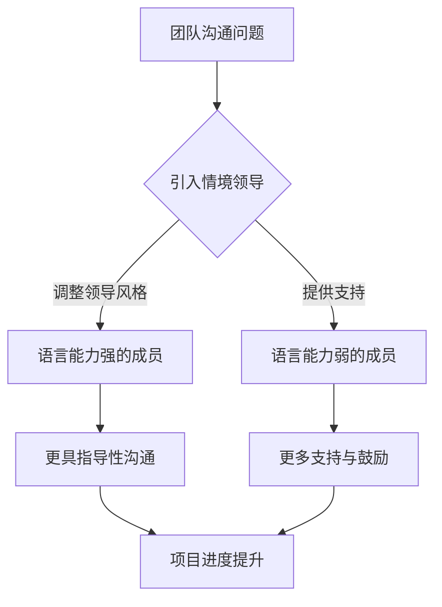
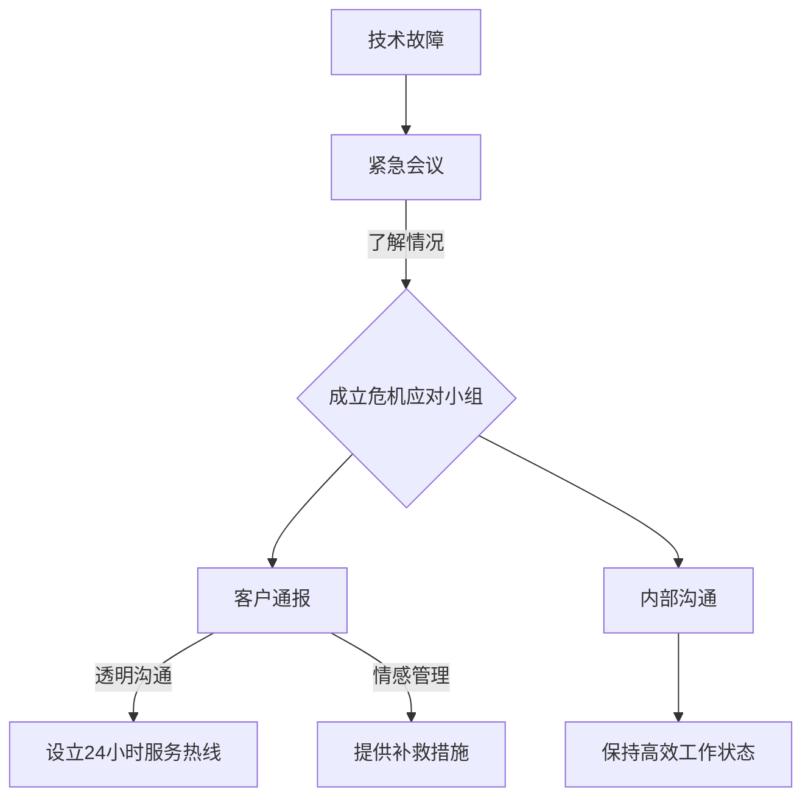
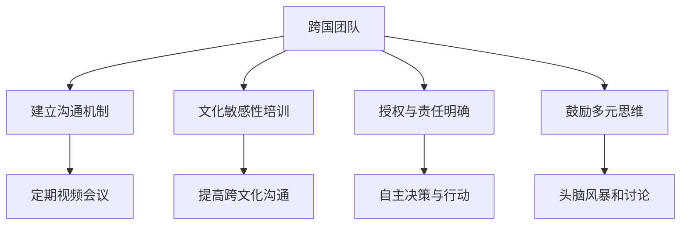

                 

### 引言：领导力与沟通艺术的重要性

在现代社会，无论是企业管理、项目管理，还是团队协作，领导力和沟通艺术都扮演着至关重要的角色。有效的领导力能够激励团队，提高工作效率，推动创新和变革。而沟通艺术则是确保信息准确传达、减少误解、促进协作的关键。

领导力不仅仅关乎权威和控制，它更强调影响力和激励能力。一个优秀的领导者不仅要能够做出明智的决策，还要能够将这种决策清晰地传达给团队成员，使他们理解并愿意付诸行动。

沟通艺术则涉及如何有效地传递信息、建立信任、理解他人和自我表达。在技术领域，领导者和团队成员之间的有效沟通尤为关键，它不仅关系到项目进展和成果，也影响着团队成员的工作满意度和职业发展。

本篇博客文章旨在深入探讨领导力与沟通艺术的结合，通过系统的分析和案例研究，揭示其在实际工作中的应用价值和策略。我们将首先定义领导力和沟通艺术的核心概念，接着探讨它们之间的关系，最后通过具体案例和实践指导，帮助读者掌握有效的领导力和沟通技巧。

文章将分为以下几个主要部分：

1. **领导力的核心概念**：介绍领导力的起源、定义以及各种领导风格。
2. **沟通的基础**：解释沟通的定义、类型、障碍及非语言沟通的重要性。
3. **有效沟通策略**：提供一系列实用的沟通技巧，如听众分析、信息组织和提问反馈。
4. **信息传达的技巧**：讨论信息传达的价值、媒介选择以及心理因素。
5. **领导力与沟通的实践案例**：通过真实案例展示领导力与沟通艺术在实践中的应用。
6. **附录与资源推荐**：提供额外的阅读资源和在线工具。

通过本文的阅读，读者将能够系统地了解和掌握领导力与沟通艺术的理论和实践，为提高自身的工作效率和团队协作能力打下坚实的基础。

### 关键词

- **领导力**
- **沟通艺术**
- **信息传达**
- **团队协作**
- **领导风格**
- **沟通技巧**
- **非语言沟通**

### 摘要

本文将深入探讨领导力与沟通艺术的重要性，通过系统的分析和案例研究，揭示其在实际工作中的应用价值。首先，我们将定义领导力的核心概念，并介绍不同领导风格和其适用场景。接着，本文将探讨沟通的基础，涵盖沟通的类型、障碍以及非语言沟通的重要性。然后，我们将提供一系列有效沟通策略，包括听众分析、信息组织和提问反馈技巧。在此基础上，文章将讨论信息传达的技巧，涉及信息价值、媒介选择和心理因素。最后，通过实际案例展示领导力与沟通艺术在实践中的应用，并提供相关资源和工具，帮助读者提升自身领导力和沟通能力。

### 领导力的核心概念

领导力是一个复杂而多层次的概念，它不仅仅涉及权力的运用，还涵盖了激励、影响、沟通和决策等多个方面。为了更好地理解领导力，我们首先需要了解其起源和发展，接着探讨领导者的角色与职责，最后分析不同的领导风格和领导力模型。

#### 领导力的起源与发展

领导力的概念可以追溯到古代社会，当时领导者主要是通过军事指挥、政治统治和宗教信仰来影响和指挥群体。随着社会的发展，领导力逐渐被应用到商业和企业管理中。早期的领导力理论主要关注领导者的个人特质和行为，如Tannenbaum和 Schmidt（1958）提出的领导风格理论，强调了领导者应根据具体情况选择不同的管理方式。

进入20世纪，领导力理论进一步发展，从行为学、心理学和组织行为学等多个角度进行探讨。例如，Hersey和Blanchard（1969）提出了情境领导理论，认为领导风格应根据下属的能力和需求进行调整。同时，管理学大师彼得·德鲁克（Peter Drucker）强调领导者需要具备前瞻性、创新性和责任感。

#### 领导者的角色与职责

领导者的角色和职责在不同的组织和情境下会有所不同，但其核心任务通常包括以下几个方面：

1. **愿景规划**：领导者需要明确组织的愿景和目标，并将其传达给团队成员，激励他们为之努力。
2. **决策制定**：领导者负责制定关键决策，并在面临复杂问题时提供明确的方向。
3. **团队建设**：领导者需要建立高效的团队，促进团队成员之间的协作和沟通。
4. **激励与反馈**：领导者需要通过激励和反馈机制，激发团队成员的工作热情和潜能。
5. **危机管理**：在面临突发危机时，领导者需要迅速做出反应，稳定局面并引导团队走出困境。

#### 领导风格与领导力模型

领导风格是指领导者处理工作、管理团队和与下属互动的方式。不同的领导风格适用于不同的情境和团队。以下是几种常见的领导风格和领导力模型：

1. **转向型领导（Transformational Leadership）**：这种领导风格强调领导者的愿景和价值观，通过激励和榜样作用来影响团队成员。转向型领导者通常具备卓越的沟通技巧和人际关系能力，能够激发团队成员的内在动机。

2. **参与型领导（Participative Leadership）**：参与型领导者重视团队成员的意见和参与，通过民主决策和团队合作来推动项目进展。这种领导风格适用于需要创新和团队合作的情境。

3. **情境型领导（Situational Leadership）**：情境型领导者根据团队成员的能力和需求调整领导风格。例如，在面对缺乏经验的团队成员时，领导者可能采取更指导性的方式；而在面对成熟团队时，则可以采用更放手的管理方式。

4. **权威型领导（Authoritative Leadership）**：权威型领导者通过明确的指令和决策来指导团队，适用于紧急情况或需要迅速行动的情境。

5. **民主型领导（Democratic Leadership）**：民主型领导者鼓励团队成员参与决策，重视集体的智慧和合作，适用于需要广泛共识和创新的情境。

总之，领导力的核心在于如何通过有效的沟通和激励，推动团队达成目标。不同领导风格和模型的结合应用，可以更好地适应不同情境和团队需求，实现组织目标和个人成长。

### 沟通的基础

沟通是领导力和团队协作中不可或缺的一环。它不仅涉及到信息的传递，还包含了理解、反馈和互动等多个方面。为了确保沟通的有效性，我们首先需要了解沟通的定义和类型，探讨常见的沟通障碍以及应对策略，同时强调非语言沟通在信息传达中的重要性。

#### 沟通的定义与类型

沟通是一种通过语言、文字、肢体语言和其他信号进行信息交换的过程。它不仅限于口头交流，还包括书面、视觉、非语言和电子媒介等多种形式。根据不同的分类标准，沟通可以分为以下几种类型：

1. **口头沟通**：包括面对面的交流、电话沟通和会议讨论等，是日常工作中最常用的沟通方式。
2. **书面沟通**：如邮件、报告、备忘录和短信等，适用于正式和非正式的交流。
3. **视觉沟通**：包括图表、图片、视频和演示文稿等，通过视觉元素帮助传达复杂信息。
4. **非语言沟通**：通过肢体语言、面部表情、眼神交流等非文字元素进行信息传递。
5. **电子媒介沟通**：通过电子邮件、即时通讯软件、视频会议和社交媒体等进行远程沟通。

#### 沟通障碍与应对策略

尽管沟通是如此重要，但实际操作中往往会出现各种障碍，影响信息的有效传递。以下是几种常见的沟通障碍及其应对策略：

1. **信息过载**：当接收者面临大量信息时，容易产生混淆和误解。应对策略是简化信息、突出重点，并确保信息传递的频率和时机适当。
2. **语言障碍**：不同的文化背景和语言习惯可能导致沟通障碍。使用简单清晰的语言，避免专业术语和俚语，可以帮助减少误解。
3. **心理障碍**：个人的情绪、态度和偏见会影响沟通效果。建立信任和开放沟通的氛围，鼓励团队成员表达自己的观点，有助于消除心理障碍。
4. **技术障碍**：如通讯设备的故障、网络连接不稳定等。定期检查设备，制定备用方案，确保技术工具的可靠性和可用性。

#### 非语言沟通的重要性

非语言沟通在信息传达中扮演着重要角色，它包括肢体语言、面部表情、眼神交流、姿态和空间使用等。研究表明，非语言沟通在传递信息和情感方面比语言本身更具影响力。

1. **肢体语言**：如手势、姿态和身体动作等，能够补充和强化语言信息，帮助听众更好地理解意图和情绪。
2. **面部表情**：微笑、皱眉和其他面部表情能够传达情感和态度，增强沟通效果。
3. **眼神交流**：直接的眼神交流能够建立信任和尊重，但过度或不足的眼神交流都可能产生负面效果。
4. **姿态和空间使用**：适当的姿态和空间使用可以表明尊重和开放的态度，有助于营造良好的沟通氛围。

#### 总结

有效的沟通不仅依赖于语言的表达，还需要非语言元素的配合。通过了解沟通的定义、类型、障碍和应对策略，我们可以更好地进行信息传递和团队协作，提高工作效率和团队满意度。在接下来的部分，我们将进一步探讨有效沟通的策略，帮助读者在工作和生活中更加得心应手。

### 有效沟通策略

为了确保信息传达的准确性和有效性，领导者需要掌握一系列沟通策略。这些策略包括听众分析、信息组织和呈现技巧、提问与反馈技巧以及使用故事讲述来增强沟通效果。以下将逐一进行详细探讨。

#### 听众分析

有效沟通的第一步是了解听众，即明确沟通的目标受众。不同的听众可能有不同的背景、知识和期望，因此需要定制化信息以满足他们的需求。

1. **了解听众的需求**：通过调查问卷、访谈或观察，了解听众的兴趣点、关注点和期望。这有助于调整信息内容，使其更加贴近听众的实际需求。

2. **考虑听众的背景**：包括文化背景、教育水平和工作经验等。避免使用专业术语或复杂的概念，确保信息易于理解。

3. **分析听众的期望**：了解他们希望从沟通中得到什么，是解决问题、获取信息还是寻求启发。根据期望调整信息结构和传递方式。

#### 信息组织与呈现

组织信息并选择适当的呈现方式是确保听众能够理解和记忆信息的关键。

1. **结构化信息**：将信息分解为有逻辑的段落，每个段落围绕一个主题进行讨论。使用标题和子标题来引导听众的阅读。

2. **突出重点**：使用强调符号（如粗体、颜色、下划线）来突出关键信息和结论。确保重要信息不因篇幅过长而被忽视。

3. **视觉辅助**：使用图表、图像和演示文稿等视觉元素来补充和解释文字信息。视觉辅助能够帮助听众更好地理解和记忆信息。

4. **简明扼要**：避免冗长和复杂的句子，使用简单、清晰的语言。每段内容不宜过长，确保听众能够轻松跟随。

#### 提问与反馈技巧

提问和反馈是双向沟通的重要组成部分，有助于确保信息的准确性和理解程度。

1. **开放式提问**：使用开放式问题引导听众思考，例如“你认为……？”或“你对这个问题有什么看法？”这样能够激发听众的参与和思考。

2. **确认理解**：在传达重要信息后，通过提问确认听众是否理解。例如，“你们明白我的意思吗？”或“谁能告诉我……的含义？”

3. **鼓励反馈**：创造一个开放、安全的反馈环境，鼓励听众提出问题和意见。领导者应积极倾听并给予反馈，以增强信任和合作。

4. **闭环提问**：在反馈环节，使用闭环提问来澄清模糊的信息或解决潜在的问题。例如，“你对这个解决方案有什么建议？”或“你有什么顾虑？”

#### 使用故事讲述来增强沟通效果

故事是一种强大的沟通工具，能够有效地传达复杂信息并激发听众的兴趣和共鸣。

1. **故事化的信息**：将信息融入故事中，通过情节、人物和冲突来增强信息的表现力。故事能够帮助听众更好地理解和记忆信息。

2. **情感共鸣**：使用情感元素（如喜怒哀乐）来触动听众的情感，使其更加关注和投入。

3. **具体实例**：通过具体的实例和案例来阐述抽象的概念，使信息更加具体和生动。

4. **启发思考**：故事不仅能够传达信息，还能够启发听众的思考。通过故事中的问题或挑战，引导听众思考自己的情况，并从中获得启示。

总之，有效的沟通策略需要综合考虑听众的需求、信息组织、提问与反馈以及故事讲述等多个方面。通过这些策略，领导者可以确保信息传达的准确性和有效性，促进团队协作和共同目标的实现。

### 信息传达的技巧

在领导力和沟通中，信息传达的技巧至关重要。这些技巧不仅影响信息的准确性和影响力，还决定了听众的接受程度和响应。以下将讨论明确信息价值、选择合适的媒介、处理信息传达中的心理因素以及考虑沟通中的道德考量。

#### 明确信息价值

明确信息价值是确保信息传达有效性的第一步。领导者需要问自己以下几个问题：

1. **信息的重要程度**：哪些信息对听众至关重要？哪些信息可以省略或延迟传达？
2. **目标受众的需求**：听众需要从信息中获取哪些信息？他们的关注点和期望是什么？
3. **信息的紧迫性**：信息是否需要立即传达？是否可以稍后处理？

通过明确信息价值，领导者可以确保传达的信息是最相关和最重要的，从而提高听众的关注度和参与度。

#### 选择合适的媒介

选择合适的媒介对于信息传达的成功至关重要。不同的媒介适用于不同的信息类型和听众。以下是一些常见媒介及其适用性：

1. **口头媒介**：适用于需要即时反馈和互动的情境，如会议、讨论和演讲。口头媒介能够提供即时的问题解答和互动。
2. **书面媒介**：适用于需要详细解释和记录的情境，如报告、邮件和备忘录。书面媒介有助于听众详细阅读和复习。
3. **视觉媒介**：适用于需要展示数据和图像的情境，如图表、图片和演示文稿。视觉媒介能够直观地传达复杂信息。
4. **电子媒介**：适用于需要远程沟通和即时传达的情境，如电子邮件、即时通讯和视频会议。电子媒介能够跨越时间和空间的限制，提高沟通效率。

#### 处理信息传达中的心理因素

信息传达不仅仅是技术问题，还涉及到人的心理因素。以下是一些处理心理因素的策略：

1. **建立信任**：建立信任是确保信息被接受和信任的基础。领导者需要展示诚实、透明和可信的形象，通过诚实和一致的沟通来建立信任。
2. **理解听众的心理**：了解听众的心理预期和情绪状态，能够帮助领导者更好地调整信息内容和传递方式。例如，对于紧张或困惑的听众，领导者可以采用更加温和和易懂的语言。
3. **消除障碍**：识别并消除可能阻碍信息传达的心理障碍，如偏见、恐惧和不信任。通过积极的沟通和解释，消除听众的疑虑和担忧。

#### 考虑沟通中的道德考量

在信息传达中，道德考量同样重要。以下是一些关键点：

1. **诚实与透明**：传达信息时，领导者应保持诚实和透明，避免误导或隐瞒事实。
2. **尊重隐私**：在传达敏感信息时，领导者需要尊重听众的隐私权，避免泄露无关的信息。
3. **公正性**：确保信息传达的公正性，避免偏袒或歧视。
4. **责任感**：领导者需要对信息传达的结果负责，确保信息的准确性和有效性。

#### 综合应用

在实际工作中，领导者应综合运用以上技巧，确保信息传达的全面性和有效性。例如，在传达重要决策时，可以通过口头演讲和书面报告相结合，确保信息的覆盖面和详细程度。同时，领导者应考虑听众的心理和道德因素，通过建立信任和公正沟通来确保信息被接受和执行。

总之，有效的信息传达需要明确信息价值、选择合适媒介、处理心理因素和考虑道德考量。通过这些技巧，领导者可以确保信息准确、有效地传达，促进团队协作和目标实现。

### 领导力与沟通艺术的实践案例

为了更直观地展示领导力与沟通艺术在实际工作中的应用，我们将分析三个具体的实践案例，这些案例涉及提升团队沟通效率、领导者在危机中的沟通策略以及跨国团队的领导力与沟通艺术。

#### 案例一：提升团队沟通效率

**背景介绍**：
一家全球知名的科技公司，其产品开发团队由来自不同国家和文化背景的成员组成。由于文化差异和语言障碍，团队成员之间的沟通效率低下，导致项目进度受阻。

**核心概念与联系**：
为了解决这一问题，团队引入了情境领导理论和参与型领导风格。情境领导理论强调领导者应根据团队成员的能力和需求调整领导风格，而参与型领导风格鼓励团队成员参与决策，提高沟通和协作。

**实施策略**：
1. **情境领导**：领导者通过观察和分析，发现团队成员在沟通中的困难，并根据不同成员的能力和需求调整领导风格。对于语言能力较强的成员，领导者采用更具指导性的沟通方式；对于语言能力较弱的成员，领导者则提供更多的支持和鼓励。
2. **参与型决策**：领导者鼓励团队成员参与项目决策，通过定期召开团队会议和头脑风暴，收集成员的意见和建议。这有助于团队成员更好地理解项目目标，提高工作积极性。
3. **跨文化培训**：为了消除文化差异和语言障碍，团队安排了跨文化沟通培训，帮助成员了解不同文化的沟通习惯和风格。培训内容包括文化敏感性、语言表达技巧和跨文化沟通工具的使用。

**结果**：
通过实施情境领导和参与型决策，团队沟通效率显著提高。团队成员之间的理解和信任增加，项目进度得以顺利推进。同时，跨文化培训有助于减少误解和冲突，提高了团队的凝聚力和工作效率。

**Mermaid 流程图**：

#### 案例二：领导者在危机中的沟通策略

**背景介绍**：
一家初创公司在项目上线时遭遇重大技术故障，导致客户数据泄露。这一危机事件引发了客户的不满和恐慌，对公司的声誉和业务造成了严重影响。

**核心概念与联系**：
在危机管理中，领导者的沟通策略至关重要。领导者需要通过有效的信息传达和情绪管理，稳定团队和客户的情绪，同时制定和执行应对措施。

**实施策略**：
1. **快速响应**：领导者立即召开紧急会议，成立危机应对小组，迅速了解故障原因和影响范围。
2. **透明沟通**：领导者通过邮件、电话会议和社交媒体等渠道，及时向客户通报事故情况，保持信息的透明度。同时，设立24小时服务热线，回答客户的问题和关切。
3. **情感管理**：领导者强调对客户的歉意和责任感，表达对客户数据泄露的深刻关切。同时，提供补救措施，如免费服务时长、数据安全培训等，以减轻客户的不满情绪。
4. **内部沟通**：领导者通过内部邮件、团队会议和一对一谈话，确保团队成员了解危机情况，并鼓励他们保持冷静和高效的工作状态。

**结果**：
通过快速响应和透明沟通，公司成功稳定了客户情绪，减少了客户流失。内部团队也保持了较高的工作效率，迅速找到了故障原因并修复了漏洞。这一危机事件虽然对公司的声誉和业务造成了一定影响，但通过有效的危机管理和沟通策略，公司迅速恢复了客户和市场的信任。

**Mermaid 流程图**：

#### 案例三：跨国团队的领导力与沟通艺术

**背景介绍**：
一家跨国公司在全球范围内组建了一个产品开发团队，团队成员来自不同的国家和地区。由于地理位置、时差和文化差异，团队沟通和协作面临诸多挑战。

**核心概念与联系**：
在跨国团队中，领导者需要运用领导力与沟通艺术的结合，克服地理和文化障碍，确保团队高效协作。

**实施策略**：
1. **建立清晰的沟通机制**：领导者制定统一的沟通规则和流程，确保信息在全球范围内的及时传递和反馈。例如，设立每周定期视频会议，确保团队成员共享最新进展和问题。
2. **文化敏感性培训**：领导者组织文化敏感性培训，帮助团队成员了解不同文化的沟通习惯和期望，提高跨文化沟通的有效性。
3. **授权与责任明确**：领导者通过明确团队成员的职责和权限，鼓励自主决策和行动，减少沟通层级和决策时间。
4. **鼓励多元思维**：领导者鼓励团队成员提出不同意见和解决方案，通过头脑风暴和讨论，激发创新思维，提高团队的整体效能。

**结果**：
通过建立清晰的沟通机制、文化敏感性培训和多元思维，跨国团队克服了地理和文化差异，实现了高效协作。团队成员之间的信任和合作增强，项目进度和质量显著提升。这一成功经验为公司在全球范围内的业务扩展提供了宝贵的经验。

**Mermaid 流�程图**：

通过以上三个实践案例，我们可以看到，领导力与沟通艺术在实际工作中的重要性。无论是提升团队沟通效率、处理危机，还是跨国团队协作，有效的领导力和沟通技巧都是确保成功的关键。通过这些案例，我们不仅了解了具体实施策略，还看到了领导力与沟通艺术如何在实际中发挥作用。

### 附录与资源推荐

为了帮助读者更深入地理解和应用领导力与沟通艺术，我们推荐以下书籍、在线资源和培训课程。

#### 书籍推荐

1. **《领导力五要素》（The Five Dysfunctions of a Team）** - by Patrick Lencioni
   - 本书通过一个寓言故事，揭示了团队失败的原因，并提出了解决方案。

2. **《影响力》（Influence: The Psychology of Persuasion）** - by Robert B. Cialdini
   - 本书详细介绍了影响他人的六个心理原则，对提高沟通和领导力有重要启示。

3. **《非暴力沟通》（Nonviolent Communication）** - by Marshall B. Rosenberg
   - 本书介绍了一种基于同情和理解的非暴力沟通方法，有助于改善人际关系和沟通效果。

#### 在线资源推荐

1. **LinkedIn Learning** - 提供丰富的领导力和沟通技能课程，涵盖多种主题，如有效沟通、团队领导和冲突解决等。

2. **Coursera** - 提供由世界顶级大学和专业机构提供的免费或付费领导力与沟通课程，如“领导力心理学”和“沟通技巧”。

3. **TED Talks** - 在TED网站上，有许多关于领导力与沟通的精彩演讲，如“如何成为更好的领导者”和“沟通的艺术”。

#### 组织内沟通技巧培训课程推荐

1. **《有效沟通与领导力》** - 一门针对企业内部员工的培训课程，内容涵盖沟通技巧、领导力基础和团队协作等。

2. **《跨文化沟通》** - 针对跨国团队的培训课程，帮助员工理解和适应不同文化的沟通方式。

3. **《冲突管理与解决》** - 帮助员工学会识别和管理冲突，提高团队协作和沟通效果。

通过阅读以上书籍、利用在线资源，以及参加组织内的培训课程，读者可以进一步提升自己的领导力和沟通能力，为个人和团队的成功打下坚实的基础。

### 小结与展望

本文通过深入探讨领导力与沟通艺术的重要性，系统地分析了领导力的核心概念、沟通的基础、有效沟通策略、信息传达技巧，并结合实际案例展示了这些理论在实践中的应用。我们明确了领导力不仅仅是权力和决策，更是一种影响和激励团队成员的能力。有效的沟通不仅是信息的传递，还包括理解、反馈和互动。通过掌握这些核心概念和技巧，领导者可以更好地指导团队，推动项目成功，提升团队协作效率。

展望未来，领导力与沟通艺术将继续在技术和商业领域发挥重要作用。随着全球化进程的加速和技术的不断进步，跨文化沟通和远程协作将成为常态。领导者需要不断学习和适应新的沟通工具和领导风格，以应对复杂多变的环境。此外，随着人工智能和大数据技术的发展，领导者需要更加关注数据驱动的决策和沟通策略，提高决策的准确性和效率。

对于读者而言，持续学习和实践是提升领导力和沟通能力的关键。通过阅读相关书籍、参加培训课程和实际项目实践，不断反思和总结，读者可以不断提升自己的专业素养，成为一名更加优秀的领导者。

在应用领导力与沟通艺术时，要注意以下几点：

1. **明确目标**：在沟通过程中，始终明确目标，确保信息传达清晰、准确。
2. **适应听众**：根据听众的背景和需求调整沟通方式和内容，提高信息接受度。
3. **培养同理心**：理解听众的情感和心理需求，通过同理心建立信任和良好关系。
4. **持续学习**：领导力和沟通艺术是不断发展的领域，需要持续学习和实践，以适应新的挑战和变化。

通过本文的学习和实践，读者将能够更好地掌握领导力与沟通艺术，为个人和团队的成功奠定坚实基础。希望读者能够在实际工作中灵活运用这些技巧，提升自身领导力和沟通能力，实现更高的职业成就。

### 注意事项

在应用领导力与沟通艺术时，以下注意事项对于确保沟通效果和团队协作至关重要：

1. **文化敏感性**：在全球化和多元文化的环境中，领导者需要特别注意文化差异，尊重不同文化背景下的沟通习惯和期望。
2. **主动倾听**：在沟通过程中，领导者应积极倾听，避免打断或急于表达自己的观点，确保所有成员都有机会发言和表达。
3. **明确责任**：在团队中，明确每个成员的职责和任务，避免角色重叠和职责不清，以提高工作效率和责任感。
4. **及时反馈**：领导者应及时给予团队成员反馈，无论是正面还是负面，以帮助他们了解自己的表现和改进方向。
5. **保持一致性**：领导者应保持一致的行为和沟通风格，避免在团队中产生混淆和误解。

通过遵循这些注意事项，领导者可以更好地促进团队沟通和协作，实现组织目标。

### 拓展阅读

为了进一步深化对领导力与沟通艺术的理解，读者可以参考以下书籍和论文：

1. **书籍**：
   - 《变革领导力》（Leading Change）- by John P. Kotter
   - 《沟通的艺术》（The Art of Communication）- by Stephen R. Covey
   - 《领导力的五个层次》（The Five Levels of Leadership）- by John C. Maxwell

2. **论文**：
   - “领导力与沟通：领导者如何有效传达信息”- Journal of Business Research
   - “跨文化沟通中的挑战与策略”- International Journal of Business Communication
   - “数据驱动的决策：领导者的新工具”- Harvard Business Review

通过阅读这些书籍和论文，读者可以进一步探索领导力与沟通艺术的深度和广度，提升自身的领导能力和沟通技巧。

