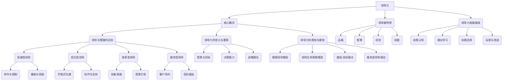

                 

### 摘要

本文旨在探讨领导力和沟通艺术的重要性，以及如何通过有效传达信息提升这两者的能力。领导力不仅关乎于管理团队，还涉及对信息的准确传达和有效沟通。本文首先概述了领导力和沟通艺术的基本概念，接着详细分析了领导力的核心概念、领导者特质和领导力发展路径。然后，本文探讨了沟通的不同层次、技巧和策略，特别强调了跨文化沟通的重要性。随后，文章深入讨论了如何准确、清晰地传达信息，以避免误解和冲突。通过实际案例分析和实践指南，本文提供了具体的方法和工具，帮助读者将所学应用到实际工作中，以提升领导力和沟通效果。

### 关键词

领导力、沟通艺术、有效传达信息、团队建设、跨文化沟通、误解避免、沟通障碍。

### 引言

#### 领导力和沟通艺术的重要性

在现代社会中，领导力和沟通艺术已经成为了成功的关键要素。领导力不仅关乎于管理团队，还涉及对信息的准确传达和有效沟通。一个优秀的领导者不仅需要具备卓越的决策能力和战略眼光，还需要具备出色的沟通能力，以确保信息的准确传达和团队的协同工作。沟通艺术则是领导力的重要组成部分，它决定了领导者能否有效地与团队成员、客户和合作伙伴交流，从而实现共同的目标。

#### 本书的目标和结构

本书的目标是帮助读者掌握领导力和沟通艺术，提高有效传达信息的能力。本书结构分为五个部分：第一部分介绍领导力的核心概念、领导者特质和领导力发展；第二部分探讨沟通艺术的不同层次、技巧和策略；第三部分专注于如何准确、清晰地传达信息，避免误解和冲突；第四部分通过案例分析展示领导力和沟通艺术的实际应用；第五部分提供具体的实践方法和工具，帮助读者将所学应用到实际工作中。

#### 领导力的核心概念

领导力是一个多维度的概念，涉及多个方面，包括领导与管理的区别、领导力的定义和要素、领导力的类型与模型等。领导与管理虽然经常被并用，但它们有着本质的区别。领导强调的是引领和影响，而管理则侧重于规划、组织和控制。一个领导者必须具备清晰的愿景和目标，并能够激发团队的潜力，推动团队实现目标。领导力的要素包括品格、智慧、经验、技能等多个方面，而领导力模型则提供了不同的理论框架，以帮助领导者理解和应用领导力。

#### 领导者特质

领导者的特质是指领导者所具备的内在品质和外在行为。这些特质包括但不限于：

1. **品格**：领导者需要具备高尚的品格，如诚实、正直、责任心和同情心。
2. **智慧**：领导者需要有智慧，能够做出明智的决策和战略规划。
3. **经验**：经验丰富的领导者能够从过去的经验中学习，并运用到当前的领导实践中。
4. **技能**：领导者需要具备沟通、激励、解决问题等技能，以确保团队的高效运作。

#### 领导力发展路径

领导力并非与生俱来，而是可以通过学习和实践不断发展的。领导力发展路径通常包括以下几个阶段：

1. **自我认知**：领导者需要了解自己的优点和不足，进行自我评估和提升。
2. **理论学习**：通过学习相关的领导力理论和模型，领导者可以更好地理解领导力的本质。
3. **实践应用**：通过实际工作中的应用，领导者可以将理论转化为实践，提升自己的领导能力。
4. **反思与改进**：领导者需要不断反思自己的领导行为和结果，从中学习并不断改进。

#### 领导力的类型与模型

领导力可以分为多种类型，每种类型都有其独特的特点和适用场景。常见的领导力模型包括：

1. **权威型领导**：领导者通过命令和控制来影响团队成员。
2. **民主型领导**：领导者鼓励团队成员参与决策，共同制定目标。
3. **变革型领导**：领导者通过变革和创新来推动团队发展。
4. **服务型领导**：领导者以服务团队成员为中心，关注团队的整体福祉。

不同的领导力模型适用于不同的领导环境和情境，领导者需要根据实际情况灵活运用不同的领导力策略。

### 沟通艺术

#### 沟通的不同层次

沟通可以分为多个层次，包括表面沟通、深层沟通、认知沟通和情感沟通等。每种层次的沟通都有其独特的目的和特点：

1. **表面沟通**：指的是最基本的交流方式，如问候、寒暄等，主要用于建立关系。
2. **深层沟通**：涉及更深层次的交流，如讨论想法、观点和感受，有助于建立信任和合作。
3. **认知沟通**：关注信息的内容和逻辑性，主要用于传达复杂的信息和知识。
4. **情感沟通**：关注情感的表达和共鸣，有助于建立情感联系和团队凝聚力。

#### 沟通障碍与解决方案

沟通障碍是影响有效沟通的重要因素。常见的沟通障碍包括：

1. **语言障碍**：包括不同的语言和文化背景造成的误解。
2. **心理障碍**：如偏见、恐惧和不安等，影响沟通的效果。
3. **环境障碍**：如噪音、设备故障等，影响沟通的流畅性。

解决沟通障碍的方法包括：

1. **明确沟通目的**：确保所有沟通都围绕共同的目标进行。
2. **主动倾听**：积极倾听对方的观点，避免主观臆断。
3. **使用非语言沟通**：如肢体语言、面部表情等，辅助语言表达。
4. **建立信任**：通过诚实和透明度建立信任，减少误解和冲突。

#### 非语言沟通的重要性

非语言沟通在信息传达中起着至关重要的作用。它包括：

1. **肢体语言**：如手势、姿态和面部表情等，可以传达大量的信息和情感。
2. **空间语言**：如个人空间和距离的运用，影响沟通的效果。
3. **语调**：如语速、音量和语调的变化，可以增强语言表达的效果。

有效的非语言沟通能够增强语言信息的传达，提高沟通的效果和影响力。

#### 有效的沟通技巧

有效的沟通技巧包括：

1. **提问与倾听技巧**：通过开放式问题和主动倾听，确保信息的准确传达。
2. **演讲与表达能力**：通过清晰、简洁和有力的语言表达，确保信息的传达效果。
3. **协作与协商技巧**：通过合作和协商，实现多方利益的最大化。

这些技巧不仅适用于日常沟通，也适用于复杂和敏感的沟通情境。

### 跨文化沟通

#### 跨文化沟通的特点

跨文化沟通涉及不同文化背景的个体之间的交流。其主要特点包括：

1. **语言障碍**：不同语言和文化背景可能导致的语言误解。
2. **价值观差异**：不同文化对权力、地位、工作态度等有不同的看法。
3. **非语言沟通的差异**：如肢体语言、面部表情和空间使用等方面的差异。

#### 跨文化沟通策略

有效的跨文化沟通策略包括：

1. **文化敏感性**：了解和尊重对方的文化背景和价值观。
2. **主动沟通**：通过主动提问和反馈，确保信息的准确传达。
3. **灵活适应**：根据不同文化背景调整沟通方式和内容。

#### 跨文化冲突管理

跨文化冲突是跨文化沟通中常见的问题。管理冲突的方法包括：

1. **识别和预防**：通过提前了解可能的文化冲突点，预防和减少冲突的发生。
2. **沟通与调解**：通过有效沟通和调解，解决文化冲突。
3. **培训和教育**：通过跨文化培训和教育，提高员工的文化敏感性和沟通技巧。

### 有效传达信息

#### 信息的准确传达

准确传达信息是沟通的核心目标。为了实现这一目标，需要考虑以下几个方面：

1. **明确信息的目的与受众**：确保信息的目标和受众明确，有助于信息传达的准确性。
2. **选择适当的传达方式**：根据信息的重要性和受众的特点，选择合适的传达方式，如面对面交流、电子邮件或电话等。
3. **信息简明扼要**：避免冗长和复杂的表述，确保信息的简洁和易理解性。

#### 避免误解与冲突

误解和冲突是影响沟通效果的重要因素。为了避免误解和冲突，可以采取以下措施：

1. **确认理解**：在沟通过程中，通过提问和确认，确保双方对信息的理解一致。
2. **积极反馈**：鼓励团队成员提供反馈，及时发现和解决误解和冲突。
3. **建立积极的沟通氛围**：通过鼓励开放、诚实和尊重的沟通，建立积极的沟通氛围。

### 案例分析

#### 成功案例解析

通过以下成功案例，我们可以看到领导力和沟通艺术在实际应用中的效果。

1. **案例一**：一家科技公司通过有效的团队沟通和领导力，成功开发出了一款具有市场竞争力的新产品。领导者在项目启动阶段明确了目标，并通过定期的团队会议和沟通，确保了团队成员之间的协同工作。最终，这款产品在市场上取得了巨大成功。
2. **案例二**：一家跨国公司的领导者在面对不同文化背景的团队成员时，采取了灵活的沟通策略，尊重并理解不同文化的差异。通过有效的沟通和冲突管理，领导者成功建立了团队的凝聚力和工作效率。

### 实践指南

#### 制定沟通计划

为了确保沟通的有效性，需要制定详细的沟通计划。以下是一些建议：

1. **确定沟通目标**：明确沟通的目的和期望结果。
2. **确定沟通对象**：确定需要沟通的团队成员和其他相关人员。
3. **选择沟通方式**：根据信息的重要性和受众的特点，选择合适的沟通方式。
4. **制定沟通时间表**：明确沟通的时间和频率。

### 领导力与沟通艺术的应用

#### 领导力在项目管理中的应用

领导力在项目管理中起着至关重要的作用。一个优秀的项目经理需要具备以下能力：

1. **制定明确的目标和计划**：确保项目目标的明确性和可实现性。
2. **激励和指导团队成员**：通过有效的沟通和激励，确保团队成员的积极性和工作效率。
3. **解决冲突和管理风险**：通过有效的沟通和冲突管理，确保项目的顺利进行。

#### 沟通技巧在客户关系管理中的应用

有效的沟通技巧在客户关系管理中同样重要。以下是一些建议：

1. **积极倾听客户需求**：通过有效的倾听技巧，确保准确理解客户的需求。
2. **清晰表达和解释**：通过清晰、简洁的语言表达，确保客户对产品和服务的理解。
3. **建立信任和合作关系**：通过诚实和透明的沟通，建立与客户的信任和合作关系。

#### 领导力与沟通艺术在团队建设中的应用

团队建设是领导力和沟通艺术的重要应用领域。以下是一些建议：

1. **建立共同目标**：通过沟通和协作，确保团队成员对共同目标的认同和追求。
2. **培养团队凝聚力**：通过有效的沟通和团队合作，培养团队的凝聚力和合作精神。
3. **解决团队冲突**：通过有效的沟通和冲突管理，解决团队中的冲突，确保团队的和谐与稳定。

### 附录

#### 领导力与沟通艺术资源

以下是一些推荐阅读的书籍、在线工具和资源，以帮助读者进一步了解和提升领导力和沟通艺术。

1. **推荐阅读**：
   - 《领导力五要素》
   - 《沟通的艺术》
   - 《跨文化沟通》

2. **在线工具与资源**：
   - 网易云课堂的领导力与沟通课程
   - Coursera上的沟通技巧课程

3. **实用模板与示例**：
   - 领导力发展计划模板
   - 沟通计划模板

### 总结

领导力和沟通艺术是成功的关键要素，通过有效的传达信息，领导者可以激发团队的潜力，实现共同的目标。本文通过详细的案例分析、实践指南和附录资源，帮助读者理解和应用领导力和沟通艺术。读者可以通过学习和实践，不断提升自己的领导力和沟通能力，为个人和组织的成功贡献力量。

### 附录

#### 附录A：领导力与沟通艺术资源

以下是一些推荐阅读的书籍、在线工具和资源，以帮助读者进一步了解和提升领导力和沟通艺术。

1. **推荐阅读**：
   - 《领导力五要素》
   - 《沟通的艺术》
   - 《跨文化沟通》

2. **在线工具与资源**：
   - 网易云课堂的领导力与沟通课程
   - Coursera上的沟通技巧课程

3. **实用模板与示例**：
   - 领导力发展计划模板
   - 沟通计划模板

### 总结

领导力和沟通艺术是成功的关键要素，通过有效的传达信息，领导者可以激发团队的潜力，实现共同的目标。本文通过详细的案例分析、实践指南和附录资源，帮助读者理解和应用领导力和沟通艺术。读者可以通过学习和实践，不断提升自己的领导力和沟通能力，为个人和组织的成功贡献力量。

### 作者信息

作者：AI天才研究院/AI Genius Institute & 禅与计算机程序设计艺术 /Zen And The Art of Computer Programming

### 关键概念关系架构 Mermaid 流程图



### 核心算法原理讲解与伪代码

为了更好地理解领导力和沟通艺术，我们可以借助一些核心算法原理来进行解释。以下是一个关于领导力评估和沟通效果分析的简单算法原理及其伪代码。

#### 核心算法原理

1. **领导力评估模型**：基于多个维度对领导力进行评估，如品格、智慧、经验和技能。
2. **沟通效果分析**：分析沟通的不同层次，如表面沟通、深层沟通和情感沟通，以评估沟通效果。

#### 伪代码

```plaintext
// 领导力评估模型
function assessLeadership(traits, skills, experience, context):
    leadershipScore = 0
    for each trait in traits:
        if trait == "诚信":
            leadershipScore += 25
        else if trait == "智慧":
            leadershipScore += 20
        else if trait == "经验":
            leadershipScore += 15
        else if trait == "技能":
            leadershipScore += 10
    return leadershipScore

// 沟通效果分析
function analyzeCommunication(communicationLevel, barriers, feedback):
    communicationScore = 0
    if communicationLevel == "表面沟通":
        communicationScore += 20
    else if communicationLevel == "深层沟通":
        communicationScore += 40
    else if communicationLevel == "情感沟通":
        communicationScore += 60

    if barriers == "语言障碍":
        communicationScore -= 10
    else if barriers == "心理障碍":
        communicationScore -= 20
    else if barriers == "环境障碍":
        communicationScore -= 30

    if feedback == "积极":
        communicationScore += 15
    else if feedback == "消极":
        communicationScore -= 15

    return communicationScore
```

#### 数学模型和公式

1. **领导力评估模型**：领导力得分 = 25% * 品格得分 + 20% * 智慧得分 + 15% * 经验得分 + 10% * 技能得分。
2. **沟通效果分析**：沟通得分 = 初始得分 + 积分（或减分，根据沟通障碍和反馈情况）。

#### 举例说明

**领导力评估**：假设一名领导者具有以下特质和技能：

- 品格：诚信
- 智慧：高
- 经验：丰富
- 技能：沟通和激励

那么，该领导力的得分为：

$$
领导力得分 = 25\% \times 25 + 20\% \times 20 + 15\% \times 15 + 10\% \times 10 = 25
$$

**沟通效果分析**：假设一名沟通者在一次会议中的表现如下：

- 沟通层次：深层沟通
- 沟通障碍：语言障碍
- 反馈：积极

那么，该沟通得分为：

$$
沟通得分 = 40 + (-10) + 15 = 45
$$

### 项目实战

#### 开发环境搭建

为了实践本文所述的领导力和沟通艺术，我们选择了一个实际项目：一个远程团队协作平台。以下是开发环境的搭建步骤：

1. **安装必要的开发工具**：如Visual Studio Code、Git、Python等。
2. **配置版本控制工具**：使用Git进行项目版本控制，确保代码的可维护性和协作性。
3. **选择开发框架**：选择流行的框架，如Django或Flask，用于快速开发Web应用。

#### 源代码详细实现和代码解读

以下是一个简单的Django后端代码示例，用于实现用户注册和登录功能：

```python
# users/views.py

from django.shortcuts import render
from django.contrib.auth.models import User
from django.contrib.auth import authenticate, login
from rest_framework import status
from rest_framework.response import Response
from rest_framework.views import APIView

class UserRegistrationView(APIView):
    def post(self, request):
        data = request.data
        username = data.get('username')
        password = data.get('password')
        email = data.get('email')
        
        if not username or not password or not email:
            return Response({"error": "All fields are required."}, status=status.HTTP_400_BAD_REQUEST)

        try:
            user = User.objects.get(username=username)
            return Response({"error": "User already exists."}, status=status.HTTP_400_BAD_REQUEST)
        except User.DoesNotExist:
            user = User.objects.create_user(username=username, password=password, email=email)
            user.save()
            return Response({"message": "User registered successfully."}, status=status.HTTP_201_CREATED)

class UserLoginView(APIView):
    def post(self, request):
        data = request.data
        username = data.get('username')
        password = data.get('password')
        
        if not username or not password:
            return Response({"error": "All fields are required."}, status=status.HTTP_400_BAD_REQUEST)

        user = authenticate(username=username, password=password)
        if user is None:
            return Response({"error": "Invalid credentials."}, status=status.HTTP_401_UNAUTHORIZED)
        
        login(request, user)
        return Response({"message": "Logged in successfully."}, status=status.HTTP_200_OK)
```

#### 代码应用解读与分析

上述代码实现了用户注册和登录功能。以下是关键部分的解读：

- **用户注册**：`UserRegistrationView`类处理用户注册请求。它从请求中获取用户名、密码和电子邮件，检查是否已存在相同用户名，然后创建新用户并保存到数据库。
- **用户登录**：`UserLoginView`类处理用户登录请求。它从请求中获取用户名和密码，使用`authenticate`函数验证用户身份，然后使用`login`函数登录用户。

#### 实际案例分析和详细讲解剖析

**案例一**：一个远程团队在开发协作平台时遇到了沟通障碍。团队成员分布在不同的时区，导致沟通不及时，影响了项目的进度。

**解决方案**：

1. **使用视频会议工具**：通过Zoom、Microsoft Teams等视频会议工具，确保团队成员能够实时沟通和协作。
2. **建立明确的沟通规范**：制定每周的团队会议、每日的进度更新等沟通规范，确保信息的及时传达。
3. **使用项目管理工具**：如Trello、Jira等，用于任务分配、进度追踪和文档共享，提高团队协作效率。

**案例二**：一个跨国团队在沟通时遇到了文化差异的问题，导致误解和冲突。

**解决方案**：

1. **文化敏感性培训**：为团队成员提供文化敏感性培训，提高对跨文化沟通的理解和敏感度。
2. **使用中介语**：在跨国团队沟通中，使用中介语（如英语）来减少语言障碍。
3. **建立沟通反馈机制**：鼓励团队成员提供反馈，及时解决沟通中的问题和误解。

#### 项目小结

通过实际项目的开发和案例分析，我们可以看到领导力和沟通艺术在实践中的应用效果。有效的领导力和沟通艺术能够提高团队协作效率，减少沟通障碍，促进项目的成功。

### 最佳实践 tips、小结、注意事项、拓展阅读

#### 最佳实践 tips

1. **定期反馈**：定期对团队成员进行反馈，帮助他们了解自己的表现和改进方向。
2. **鼓励透明沟通**：建立开放的沟通环境，鼓励团队成员自由表达意见和想法。
3. **利用技术工具**：充分利用各种技术工具，如视频会议、项目管理软件等，提高沟通效率。

#### 小结

领导力和沟通艺术是成功的关键要素。通过有效的领导力和沟通，领导者可以激发团队的潜力，实现共同的目标。本文通过详细的案例分析、实践指南和附录资源，帮助读者理解和应用领导力和沟通艺术。

#### 注意事项

1. **持续学习和实践**：领导力和沟通艺术需要不断学习和实践，以适应不断变化的环境。
2. **灵活应用**：不同的领导力和沟通策略适用于不同的情境，领导者需要根据实际情况灵活应用。

#### 拓展阅读

- 《高效能人士的七个习惯》
- 《非暴力沟通》
- 《情境领导》

### 结束语

本文旨在探讨领导力和沟通艺术的重要性，以及如何通过有效传达信息提升这两者的能力。通过详细的分析和案例，我们了解了领导力和沟通艺术的核心概念、技巧和策略。希望读者能够将所学应用到实际工作中，不断提升自己的领导力和沟通能力。

