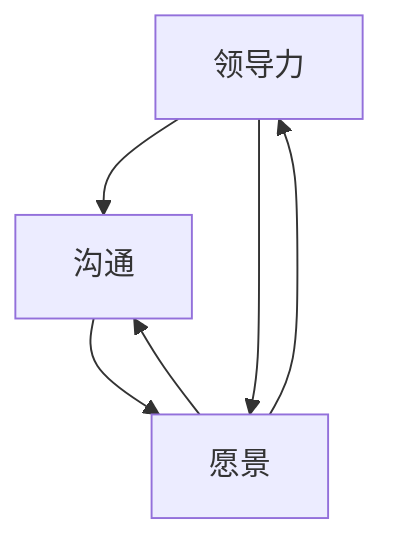

                 

### 文章标题

# 领导力与沟通：传达愿景的艺术

> 关键词：领导力、沟通、愿景、传达、组织文化

> 摘要：本文将深入探讨领导力与沟通在传达愿景过程中的重要作用。通过分析领导力的核心要素、沟通的基本原则以及愿景传达的技巧，本文旨在为IT领域的领导者提供一套实用的领导力和沟通策略，帮助他们在组织中有效传达愿景，激发团队的积极性和创造力。

---

### 第1章: 领导力与沟通：传达愿景的艺术

#### 1.1 引言

##### 1.1.1 领导力的定义与重要性

领导力，是指一个人在组织或团队中引导和影响他人的能力。领导力不仅仅是职位赋予的权威，更是基于信任、影响力以及个人魅力的一种能力。在IT领域，领导力的重要性尤为突出，因为它直接关系到项目的成功、团队的凝聚力和企业的长远发展。

**领导力的定义：**
- 领导力是一种激励和引导他人实现共同目标的能力。
- 它涉及决策、组织、沟通和激励等多个方面。

**领导力的重要性：**
- 决策能力：优秀的领导者能够做出明智的决策，并使团队团结一致地执行。
- 激励团队：领导者能够激发团队成员的潜力，提高工作效率和创造力。
- 文化建设：领导力有助于塑造积极向上的组织文化，增强团队的凝聚力和归属感。

##### 1.1.2 沟通的艺术

沟通是领导力的核心组成部分。有效的沟通不仅能够确保信息的准确传达，还能建立信任、促进合作和激发创新。

**沟通的定义：**
- 沟通是信息的传递和交流过程，包括语言和非语言形式。

**沟通的重要性：**
- 信息传递：沟通是确保信息在不同层级和部门之间有效传递的关键。
- 建立信任：有效的沟通有助于建立团队之间的信任，提高协作效率。
- 激发创新：良好的沟通环境能够激发团队成员的创新思维，推动技术进步。

**沟通的基本要素：**
- 内容：明确的信息和目标。
- 接收者：目标受众，包括团队成员、客户和合作伙伴。
- 传递方式：语言、文字、图表、肢体语言等。
- 反馈：接收者对信息的回应和反馈。

##### 1.1.3 本书结构安排

本书将分为以下几个部分：

1. **领导力概述**：介绍领导力的本质、风格、个人特质和发展路径。
2. **沟通概述**：分析沟通的定义、障碍以及克服方法。
3. **传达愿景的艺术**：探讨愿景的定义、沟通技巧以及实现路径。
4. **领导力与沟通的核心概念与联系**：阐述核心概念之间的相互关系。
5. **领导力与沟通的核心算法原理讲解**：讲解领导力和沟通的核心算法。
6. **实践与应用**：介绍如何在实际工作中应用领导力和沟通技巧。
7. **总结与反思**：总结全文内容，提出未来展望。

#### 1.2 领导力概述

##### 1.2.1 领导力的本质

领导力的本质是影响和激励他人，实现共同的目标。它不仅仅是一种技能，更是一种态度和行为。

**领导力的核心要素：**
- 影响力：领导者通过个人魅力、专业知识、经验等影响他人。
- 激励：领导者能够激发团队成员的积极性和创造力。
- 决策：领导者需要做出明智的决策，并引导团队执行。
- 沟通：领导者需要有效地沟通，确保信息传达准确。
- 持续发展：领导者需要不断学习和成长，以适应不断变化的环境。

**领导力的分类：**
- 按领导风格分类：权威型领导、参与型领导、成就导向型领导。
- 按领导行为分类：交易型领导、变革型领导、情境领导理论。

##### 1.2.2 领导风格与行为

**领导风格的分类：**

1. **权威型领导**：领导者具有高度的决策权和控制力，强调命令和指挥。
   - 优点：决策迅速，执行力强。
   - 缺点：缺乏团队参与，可能导致员工满意度低。

2. **参与型领导**：领导者鼓励团队成员参与决策过程，增强团队凝聚力。
   - 优点：提高团队参与度和满意度。
   - 缺点：决策速度可能较慢，需要更多时间和精力。

3. **成就导向型领导**：领导者注重团队的目标实现和成绩，激励团队成员追求卓越。
   - 优点：激发团队成员的积极性，提高工作效率。
   - 缺点：可能忽视团队成员的个人需求和成长。

**领导行为理论：**

1. **交易型领导**：领导者通过奖惩机制来激励团队成员。
   - 优点：简单直接，易于管理。
   - 缺点：可能导致短期行为，缺乏长期激励机制。

2. **变革型领导**：领导者通过变革和创新来推动团队发展。
   - 优点：激发团队创新思维，推动组织变革。
   - 缺点：变革过程可能引起员工的不适应。

3. **情境领导理论**：领导者根据团队成员的不同发展阶段和行为需求，采取相应的领导风格。
   - 优点：灵活多样，适应不同团队和环境。
   - 缺点：需要领导者具备较高的情境分析和应变能力。

##### 1.2.3 领导力与个人特质

**个人特质对领导力的影响：**

- **人格特质**：如自信、决心、正直、同情心等，对领导力有重要影响。
- **情感智力**：包括自我认知、自我调节、社交技能等，对领导力有显著影响。

**领导者的人格特质：**

- **自信**：领导者需要对自己和团队有信心，才能有效地引导和激励他人。
- **决心**：领导者需要有坚定的目标和决心，克服困难，实现目标。
- **正直**：领导者需要具备正直的品质，以赢得团队的信任和尊重。
- **同情心**：领导者需要关心团队成员的需求和情感，建立和谐的人际关系。

**领导者的情感智力：**

- **自我认知**：领导者需要了解自己的情绪和需求，以更好地应对工作压力。
- **自我调节**：领导者需要学会管理自己的情绪，保持冷静和客观。
- **社交技能**：领导者需要具备良好的沟通和人际交往能力，以促进团队合作和冲突解决。

##### 1.2.4 领导力发展

**领导力培养方法：**

1. **培训与学习**：通过专业培训、读书、参加研讨会等方式，提升领导力知识和技能。
2. **实践与反思**：通过实际工作，不断实践和总结经验，提升领导力水平。
3. **持续发展**：领导力不是一成不变的，领导者需要不断学习和成长，以适应不断变化的环境。

**实践与反思：**

- **角色扮演**：通过角色扮演，模拟领导情境，提升领导力实践能力。
- **反思日志**：记录自己的领导经历，反思成功和失败的原因，不断改进。
- **导师指导**：寻找导师，获得指导和建议，加速领导力成长。

##### 1.2.5 领导力与组织文化

**组织文化对领导力的影响：**

- **组织文化的类型**：包括任务型文化、人员型文化、权力型文化等，对领导力有不同影响。
- **领导力与组织文化的互动**：领导力可以塑造组织文化，而组织文化又反过来影响领导力。

**领导力在组织文化中的作用：**

- **文化塑造**：领导者通过行为和决策，塑造和传播组织文化。
- **文化变革**：领导者需要推动组织文化的变革，以适应外部环境和内部需求的变化。

**领导力与组织文化的互动：**

- **文化认同**：领导者需要与组织文化保持一致，以增强团队的凝聚力和执行力。
- **文化创新**：领导者需要推动文化创新，激发团队的创造力和创新思维。

#### 1.3 沟通概述

##### 1.3.1 沟通的定义与要素

沟通是人与人之间信息传递和交流的过程。有效的沟通不仅仅是信息的传递，还包括理解和反馈。

**沟通的定义：**

- 沟通是一种信息的传递和交流过程，包括语言和非语言形式。

**沟通的基本要素：**

- **内容**：明确的信息和目标。
- **接收者**：目标受众，包括团队成员、客户和合作伙伴。
- **传递方式**：语言、文字、图表、肢体语言等。
- **反馈**：接收者对信息的回应和反馈。

##### 1.3.2 沟通障碍与克服方法

**沟通障碍分析：**

- **语言障碍**：语言差异和表达不清可能导致信息误解。
- **非语言沟通障碍**：肢体语言、面部表情等非语言形式可能被误解或忽视。
- **心理障碍**：个人偏见、压力和情绪问题可能导致沟通不畅。

**沟通障碍的克服：**

- **提高语言表达能力**：通过学习和练习，提高语言表达的准确性和清晰度。
- **增强倾听能力**：积极倾听，确保理解对方的信息。
- **减少心理障碍**：建立信任，消除个人偏见，保持开放的心态。

##### 1.3.3 沟通在领导力中的作用

沟通在领导力中扮演着关键角色。有效的沟通能够确保领导者的意图和决策得到准确传达，同时也能建立与团队成员之间的信任和合作关系。

**沟通在领导力中的作用：**

- **信息传递**：领导者需要通过有效的沟通，将组织的目标、战略和决策传达给团队成员。
- **建立信任**：良好的沟通有助于建立团队成员之间的信任，提高协作效率。
- **激励团队**：通过有效的沟通，领导者可以激励团队成员，激发他们的积极性和创造力。
- **解决问题**：在团队面临挑战和困难时，领导者需要通过沟通，协调资源，寻求解决方案。

#### 1.4 传达愿景的艺术

##### 1.4.1 愿景的定义与作用

愿景是领导者对未来的期望和目标，是组织的方向和动力。一个明确的愿景能够激发团队成员的斗志和创造力，推动组织的持续发展。

**愿景的定义：**

- 愿景是领导者对组织未来发展方向和目标的描述和期望。

**愿景的作用：**

- **指引方向**：愿景为组织提供了明确的发展方向，帮助团队成员聚焦于共同目标。
- **激励团队**：愿景能够激发团队成员的斗志和热情，提高工作效率和创造力。
- **凝聚力量**：愿景是团队凝聚力的源泉，通过共同的愿景，团队成员能够形成合力。

##### 1.4.2 愿景沟通的技巧

有效的愿景沟通是领导者的一项关键能力。以下是一些愿景沟通的技巧：

**明确愿景：**

- **愿景的明确性**：愿景需要清晰、具体、易于理解。
- **愿景的具体性**：愿景应该包含具体的目标和时间表，使团队成员能够明确方向。

**激发共鸣：**

- **与听众建立情感联系**：领导者需要通过情感共鸣，使团队成员感受到愿景的重要性。
- **用故事传递愿景**：通过生动的故事，使团队成员更好地理解和接受愿景。
- **强调愿景的实现可能性**：领导者需要向团队成员展示愿景的实现可能性，增强他们的信心。

**持续沟通：**

- **定期回顾愿景**：领导者需要定期回顾愿景，确保团队成员始终保持对愿景的关注。
- **互动式沟通**：鼓励团队成员参与愿景的讨论和制定，增强他们的参与感和责任感。

##### 1.4.3 愿景沟通的案例分析

**成功案例：**

- **苹果公司**：乔布斯通过激情演讲和具体的产品演示，成功传达了苹果公司的愿景，激发了员工的创造力和热情。

**失败案例：**

- **某知名企业**：由于领导者未能清晰传达愿景，导致团队成员迷失方向，最终影响了企业的发展。

**原因分析：**

- **愿景不明确**：领导者未能清晰传达愿景，导致团队成员无法理解目标。
- **缺乏共鸣**：领导者未能与团队成员建立情感联系，使愿景缺乏吸引力。
- **沟通不足**：领导者未能定期沟通和互动，导致团队成员对愿景的遗忘和忽视。

##### 1.4.4 愿景实现的路径

**制定战略：**

- **战略规划的步骤**：明确愿景、分析现状、设定目标、制定行动计划。
- **战略目标的设定**：确保战略目标与愿景一致，具体、可行、有挑战性。

**团队建设：**

- **团队成员的选拔与培养**：选拔具备专业技能和团队合作精神的成员，并提供培训和发展机会。
- **团队协作与沟通**：建立有效的团队协作机制，鼓励团队成员之间的沟通和合作。

**持续改进：**

- **持续改进的重要性**：通过不断的改进和优化，确保愿景的实现。
- **改进的方法与工具**：采用科学的管理方法和技术工具，如精益管理、敏捷开发等，推动组织的持续改进。

#### 1.5 总结与反思

##### 1.5.1 领导力与沟通的重要性

领导力与沟通在传达愿景的过程中发挥着至关重要的作用。有效的领导力能够激发团队成员的积极性和创造力，而有效的沟通则能够确保愿景得到准确传达和执行。

**领导力与沟通的相互作用：**

- **领导力通过沟通发挥**：领导者需要通过有效的沟通，将愿景、目标和决策传达给团队成员，以实现领导力的影响。
- **沟通通过领导力实现**：沟通是领导力的重要组成部分，领导者的沟通能力直接影响其领导效果。

##### 1.5.2 实践与应用

在实际工作中，领导者需要将领导力和沟通技巧应用于日常工作中，以下是一些建议：

- **明确愿景**：制定清晰、具体的愿景，确保团队成员能够明确目标和方向。
- **积极沟通**：通过多种沟通方式，确保信息传达的准确性和及时性。
- **倾听与反馈**：倾听团队成员的意见和需求，及时给予反馈，建立信任和合作关系。
- **激励团队**：通过激励措施，激发团队成员的积极性和创造力。

##### 1.5.3 未来展望

随着技术的不断进步和组织环境的变化，领导力与沟通也在不断发展和演变。未来的领导者需要具备以下能力：

- **适应变革**：适应快速变化的环境，灵活调整领导风格和沟通策略。
- **创新思维**：激发团队的创造力和创新思维，推动组织的持续发展。
- **全球视野**：具备全球视野，理解和尊重不同文化和价值观，实现跨文化领导。

对未来的领导者和沟通者的期望：

- **领导者**：具备强大的领导力和沟通能力，能够激发团队的潜力和创造力，实现组织的愿景。
- **沟通者**：具备良好的沟通技巧，能够准确传达信息，建立信任和合作关系。

---

### 第2章: 领导力与沟通的核心概念与联系

在探讨领导力与沟通在传达愿景过程中的作用时，我们必须首先明确这些核心概念，并理解它们之间的相互关系。本章将深入分析领导力、沟通和愿景这三个核心概念，以及它们之间的联系和相互作用。

#### 2.1 核心概念

##### 2.1.1 领导力

领导力是一种在组织或团队中影响和激励他人实现共同目标的能力。它不仅仅涉及决策、组织和激励，还包括领导者的个人特质、情感智力和领导风格。

**定义：** 领导力是一种激励和引导他人实现共同目标的能力，涉及决策、组织、沟通和激励等多个方面。

**核心要素：**
- 影响力：领导者通过个人魅力、专业知识、经验等影响他人。
- 激励：领导者能够激发团队成员的积极性和创造力。
- 决策：领导者需要做出明智的决策，并引导团队执行。
- 沟通：领导者需要有效地沟通，确保信息传达准确。
- 持续发展：领导者需要不断学习和成长，以适应不断变化的环境。

##### 2.1.2 沟通

沟通是信息的传递和交流过程，包括语言和非语言形式。它是领导力的核心组成部分，对于确保信息准确传达、建立信任和激发创新至关重要。

**定义：** 沟通是一种信息的传递和交流过程，包括语言和非语言形式。

**基本要素：**
- 内容：明确的信息和目标。
- 接收者：目标受众，包括团队成员、客户和合作伙伴。
- 传递方式：语言、文字、图表、肢体语言等。
- 反馈：接收者对信息的回应和反馈。

##### 2.1.3 愿景

愿景是领导者对组织未来发展方向和目标的期望和描述，是组织的方向和动力。一个明确的愿景能够激发团队成员的斗志和创造力，推动组织的持续发展。

**定义：** 愿景是领导者对组织未来发展方向和目标的描述和期望。

**作用：**
- **指引方向**：愿景为组织提供了明确的发展方向，帮助团队成员聚焦于共同目标。
- **激励团队**：愿景能够激发团队成员的斗志和热情，提高工作效率和创造力。
- **凝聚力量**：愿景是团队凝聚力的源泉，通过共同的愿景，团队成员能够形成合力。

#### 2.2 核心概念之间的联系

领导力、沟通和愿景这三个核心概念之间存在着紧密的联系和相互作用。它们共同构成了一个有机的整体，相互促进，共同推动组织的成功。

##### 2.2.1 领导力与沟通

领导力与沟通是密不可分的。有效的沟通是领导力的重要组成部分，而领导力又通过沟通发挥作用。

**关系：**
- **领导力通过沟通发挥**：领导者需要通过有效的沟通，将愿景、目标和决策传达给团队成员，以实现领导力的影响。
- **沟通通过领导力实现**：沟通是领导力的重要组成部分，领导者的沟通能力直接影响其领导效果。

**领导者如何通过沟通发挥领导力：**
1. **明确目标**：领导者需要通过沟通，确保团队成员明确组织的愿景和目标。
2. **激励团队**：领导者需要通过激励性沟通，激发团队成员的积极性和创造力。
3. **建立信任**：领导者需要通过有效的沟通，建立与团队成员之间的信任和合作关系。
4. **解决问题**：领导者需要通过沟通，协调资源，寻求解决方案，解决团队面临的问题。

##### 2.2.2 沟通与愿景

沟通在传达愿景中起着关键作用。有效的沟通能够确保愿景得到准确传达和执行，从而实现组织的愿景。

**作用：**
- **确保信息传达**：通过沟通，领导者将愿景传达给团队成员，确保每个人都理解组织的方向和目标。
- **建立共识**：通过沟通，团队成员对愿景达成共识，形成共同的愿景和目标。
- **激励行动**：通过沟通，领导者能够激励团队成员为实现愿景而努力工作。

**愿景如何通过沟通实现：**
1. **明确愿景**：领导者需要通过沟通，确保愿景清晰、明确，使团队成员能够理解并接受愿景。
2. **激发共鸣**：领导者需要通过沟通，激发团队成员的情感共鸣，使他们对愿景充满热情和信心。
3. **互动式沟通**：领导者需要鼓励团队成员参与愿景的讨论和制定，增强他们的参与感和责任感。
4. **持续沟通**：领导者需要定期沟通，确保团队成员始终保持对愿景的关注和努力。

##### 2.2.3 领导力与愿景

领导力在愿景实现中起着关键作用。领导者需要通过领导力，推动愿景的实现，并确保团队为之努力。

**作用：**
- **推动愿景实现**：领导者需要通过领导力，激发团队的积极性和创造力，推动愿景的实现。
- **确保团队努力**：领导者需要通过领导力，确保团队成员为实现愿景而努力工作。

**领导者如何通过领导力推动愿景的实现：**
1. **明确愿景**：领导者需要明确组织的愿景，并将其传达给团队成员。
2. **建立信任**：领导者需要建立与团队成员之间的信任，使他们愿意为实现愿景而努力。
3. **激励团队**：领导者需要通过激励性沟通，激发团队成员的积极性和创造力。
4. **提供资源**：领导者需要提供必要的资源和支持，帮助团队成员实现愿景。
5. **持续监督**：领导者需要持续监督团队的工作进度，确保愿景的实现。

#### 2.3 核心概念之间的关系架构

为了更清晰地展示领导力、沟通和愿景之间的相互关系，我们可以使用Mermaid流程图来描述它们之间的互动和作用。



在这个流程图中，领导力通过沟通与愿景建立联系，同时愿景也通过沟通反馈到领导力，形成一个循环互动的过程。

通过这个流程图，我们可以更直观地理解领导力、沟通和愿景之间的紧密联系和相互作用，以及它们在传达愿景过程中的重要性。

总之，领导力、沟通和愿景是相互关联、相互促进的核心概念。领导力通过沟通发挥作用，沟通确保愿景得到准确传达和执行，愿景则为领导力和沟通提供了方向和目标。通过深入理解这些概念之间的关系，领导者可以更有效地传达愿景，激发团队的积极性和创造力，推动组织的持续发展。

---

### 第3章: 领导力与沟通的核心算法原理讲解

在探讨领导力和沟通的过程中，我们将引入一系列核心算法原理，这些算法原理帮助领导者更有效地管理和沟通，以实现组织的愿景。本章将详细介绍这些核心算法，包括领导行为模型、情境领导理论、有效沟通模型和愿景传达模型，并使用伪代码和数学模型来阐述其工作原理。

#### 3.1 领导力核心算法

##### 3.1.1 领导行为模型

领导行为模型是一种用于描述领导者行为的理论框架。该模型基于多个领导行为的特征，将领导行为分为不同的类型，以帮助领导者了解自己的领导风格，并根据实际情况进行调整。

**领导行为模型的定义：**
领导行为模型是一种用于描述领导者行为的理论框架，它通过分析领导行为的特征，将领导行为分为不同的类型。

**核心要素：**
- 领导行为特征：包括决策风格、沟通方式、激励策略等。
- 领导风格分类：基于领导行为特征的分类，如权威型、参与型、成就导向型等。

**伪代码描述：**
```python
def leadership_model(behavior_features):
    if behavior_features == 'authoritative':
        return '权威型领导'
    elif behavior_features == 'participative':
        return '参与型领导'
    elif behavior_features == 'achievement-oriented':
        return '成就导向型领导'
    else:
        return '未知领导风格'
```

**数学模型：**
假设领导行为特征可以表示为向量 \( \vec{B} = [b_1, b_2, b_3] \)，其中 \( b_1 \) 表示决策风格，\( b_2 \) 表示沟通方式，\( b_3 \) 表示激励策略。根据特征值，可以计算领导风格的权重，如：
$$
\omega_1 = \frac{b_1}{\sum_{i=1}^3 b_i}, \quad \omega_2 = \frac{b_2}{\sum_{i=1}^3 b_i}, \quad \omega_3 = \frac{b_3}{\sum_{i=1}^3 b_i}
$$
然后，根据权重计算领导风格：
$$
style = \begin{cases} 
'authoritative' & \text{if } \omega_1 > \omega_2 \text{ and } \omega_1 > \omega_3 \\
'participative' & \text{if } \omega_2 > \omega_1 \text{ and } \omega_2 > \omega_3 \\
'achievement-oriented' & \text{if } \omega_3 > \omega_1 \text{ and } \omega_3 > \omega_2 
\end{cases}
$$

##### 3.1.2 情境领导理论

情境领导理论是一种基于团队成员成熟度进行领导的方法。该理论认为，领导风格应根据团队成员的发展阶段进行调整，以达到最佳领导效果。

**情境领导理论的定义：**
情境领导理论是一种基于团队成员成熟度进行领导的方法，它认为领导风格应根据团队成员的发展阶段进行调整。

**核心要素：**
- 成熟度：团队成员的技能、经验和动机水平。
- 领导风格：包括指导型、支持型、委托型等。

**伪代码描述：**
```python
def situational_leadership(maturity_level):
    if maturity_level == 'low':
        return '指导型领导'
    elif maturity_level == 'medium':
        return '支持型领导'
    elif maturity_level == 'high':
        return '委托型领导'
    else:
        return '未知成熟度'
```

**数学模型：**
假设团队成员的成熟度 \( M \) 可以表示为数值，根据成熟度值，可以判断适合的领导风格：
$$
\begin{cases} 
style = 'directive' & \text{if } M < 3 \\
style = 'supportive' & \text{if } 3 \leq M < 6 \\
style = 'delegate' & \text{if } M \geq 6 
\end{cases}
$$

##### 3.1.3 领导风格理论

领导风格理论是一种描述领导者行为和风格的理论，它认为领导风格对团队绩效和员工满意度有重要影响。

**领导风格理论的定义：**
领导风格理论是一种描述领导者行为和风格的理论，它认为领导风格对团队绩效和员工满意度有重要影响。

**核心要素：**
- 领导风格：包括权威型、参与型、变革型等。
- 团队绩效：领导风格对团队工作成果的影响。
- 员工满意度：领导风格对员工工作满意度和幸福感的影响。

**伪代码描述：**
```python
def leadership_style(effectiveness, satisfaction):
    if effectiveness > satisfaction:
        return '权威型领导'
    elif effectiveness < satisfaction:
        return '参与型领导'
    else:
        return '变革型领导'
```

**数学模型：**
假设团队绩效 \( E \) 和员工满意度 \( S \) 是通过评分表示的，领导风格可以通过以下公式计算：
$$
style = \begin{cases} 
'authoritative' & \text{if } E > S \\
'participative' & \text{if } E < S \\
'change-oriented' & \text{if } E = S 
\end{cases}
$$

#### 3.2 沟通核心算法

##### 3.2.1 有效沟通模型

有效沟通模型是一种用于确保信息准确传达和有效接收的理论框架。它强调沟通的五个关键要素：内容、接收者、传递方式、反馈和上下文。

**有效沟通模型的定义：**
有效沟通模型是一种用于确保信息准确传达和有效接收的理论框架，它强调沟通的五个关键要素：内容、接收者、传递方式、反馈和上下文。

**核心要素：**
- 内容：明确的信息和目标。
- 接收者：目标受众，包括团队成员、客户和合作伙伴。
- 传递方式：语言、文字、图表、肢体语言等。
- 反馈：接收者对信息的回应和反馈。
- 上下文：沟通发生的背景和环境。

**伪代码描述：**
```python
def effective_communication(content, receiver, method, feedback, context):
    if context == 'formal':
        return formal_communication(content, receiver, method, feedback)
    elif context == 'informal':
        return informal_communication(content, receiver, method, feedback)
    else:
        return '未知上下文'
```

**数学模型：**
假设沟通有效性 \( V \) 可以通过以下公式计算：
$$
V = \frac{content \times receiver \times method \times feedback}{context}
$$

其中，\( content \) 表示内容清晰度，\( receiver \) 表示接收者理解度，\( method \) 表示传递方式有效性，\( feedback \) 表示反馈及时性，\( context \) 表示上下文适配度。

##### 3.2.2 倾听技巧

倾听技巧是有效沟通的重要组成部分。它强调积极倾听，确保理解对方的信息。

**倾听技巧的定义：**
倾听技巧是有效沟通的重要组成部分，它强调积极倾听，确保理解对方的信息。

**核心要素：**
- 积极倾听：全神贯注地听取对方的信息。
- 确认理解：通过提问和复述，确保理解对方的意图。

**伪代码描述：**
```python
def active_listening(message):
    understood_message = question_and_confirm(message)
    if understood_message == message:
        return '理解'
    else:
        return '重新沟通'
```

**数学模型：**
假设倾听效果 \( L \) 可以通过以下公式计算：
$$
L = \frac{understood_message}{message}
$$

其中，\( understood_message \) 表示理解的对方信息，\( message \) 表示原始信息。

##### 3.2.3 非语言沟通

非语言沟通是通过肢体语言、面部表情和姿态等非语言形式进行信息传递的过程。

**非语言沟通的定义：**
非语言沟通是通过肢体语言、面部表情和姿态等非语言形式进行信息传递的过程。

**核心要素：**
- 肢体语言：包括姿势、手势、眼神等。
- 面部表情：包括笑容、皱眉等。
- 姿态：包括站姿、坐姿等。

**伪代码描述：**
```python
def nonverbal_communication(body_language, facial_expression, posture):
    if body_language == 'open':
        if facial_expression == 'smiling':
            if posture == 'standing_straight':
                return '积极沟通'
            else:
                return '中性沟通'
        else:
            return '消极沟通'
    else:
        return '防御性沟通'
```

**数学模型：**
假设非语言沟通效果 \( N \) 可以通过以下公式计算：
$$
N = \frac{body_language + facial_expression + posture}{3}
$$

其中，\( body_language \)，\( facial_expression \)，\( posture \) 分别表示肢体语言、面部表情和姿态的效果值。

#### 3.3 愿景沟通核心算法

##### 3.3.1 愿景传达模型

愿景传达模型是一种用于确保愿景得到有效传达和实现的理论框架。它强调愿景的明确性、具体性和共鸣性。

**愿景传达模型的定义：**
愿景传达模型是一种用于确保愿景得到有效传达和实现的理论框架，它强调愿景的明确性、具体性和共鸣性。

**核心要素：**
- 明确性：愿景需要清晰、明确，使团队成员易于理解。
- 具体性：愿景需要具体、可行，包含明确的目标和时间表。
- 共鸣性：愿景需要激发团队成员的情感共鸣，使其愿意为实现愿景而努力。

**伪代码描述：**
```python
def vision_communication(clarity, specificity, resonance):
    if clarity > 0.8 and specificity > 0.8 and resonance > 0.8:
        return '有效传达'
    else:
        return '需要改进'
```

**数学模型：**
假设愿景传达效果 \( V \) 可以通过以下公式计算：
$$
V = (clarity \times specificity \times resonance)^{0.33}
$$

其中，\( clarity \)，\( specificity \)，\( resonance \) 分别表示愿景的清晰度、具体度和共鸣度。

##### 3.3.2 愿景实现的路径

愿景实现路径是指从愿景制定到实现的一系列步骤。它包括战略规划、团队建设和持续改进。

**战略规划：**
- **明确愿景**：确定组织的长期愿景和目标。
- **分析现状**：评估组织的当前状况，识别优势和挑战。
- **设定目标**：制定具体、可行的短期和长期目标。
- **制定行动计划**：制定实现目标的详细步骤和时间表。

**团队建设：**
- **选拔团队成员**：选择具备专业技能和团队合作精神的成员。
- **培养团队成员**：提供培训和发展机会，提升团队成员的能力。
- **团队协作**：建立有效的团队协作机制，鼓励团队成员之间的沟通和合作。

**持续改进：**
- **持续改进的重要性**：通过不断的改进和优化，确保愿景的实现。
- **改进的方法与工具**：采用科学的管理方法和技术工具，如精益管理、敏捷开发等，推动组织的持续改进。

通过这些核心算法原理，领导者可以更系统地理解和应用领导力和沟通技巧，从而有效地传达愿景，推动组织的持续发展。这些算法不仅提供了理论指导，还通过具体的伪代码和数学模型，帮助领导者将理论应用到实践中，实现愿景的有效传达和实现。

