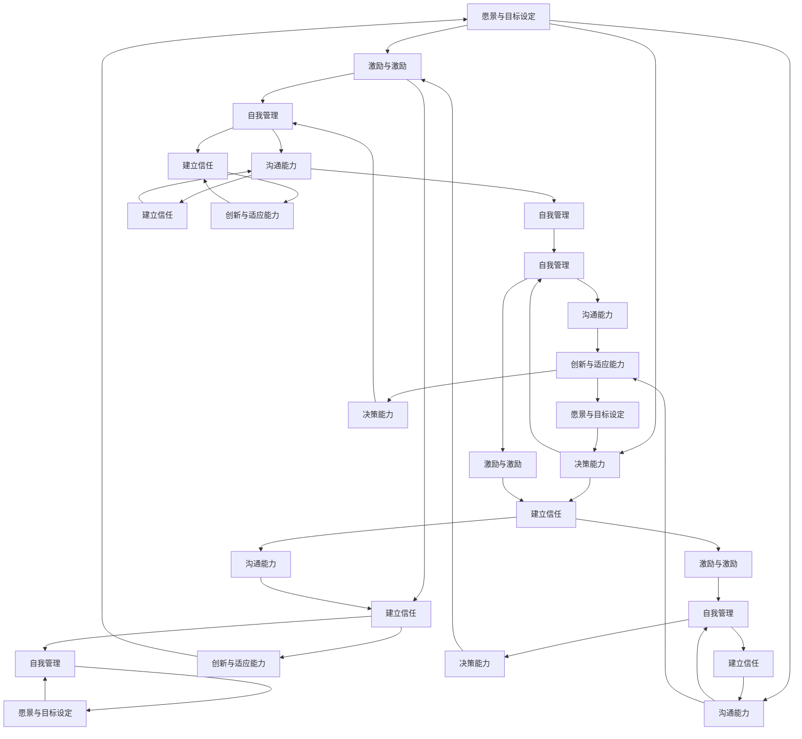

                 

### 文章标题：领导力与沟通：提升跨部门协作效率

---

#### 关键词：
- 领导力
- 沟通技巧
- 跨部门协作
- 效率提升
- 协作工具

---

#### 摘要：
本文旨在探讨领导力与沟通在提升跨部门协作效率中的关键作用。首先，我们深入分析领导力的定义与核心要素，探讨领导风格与团队管理的重要性。接着，详细阐述有效沟通的基础，包括沟通障碍的识别与解决策略。随后，我们聚焦于跨部门沟通的挑战与协作技巧，并提供协作工具与平台的最佳实践。文章还通过实际案例解析，展示高效团队协作的实战技巧。最终，我们总结了个人成长与领导力提升的途径，为未来的领导力与沟通发展提供展望。

---

### 引言

在当今复杂多变的企业环境中，跨部门协作已成为提升整体工作效率和竞争力的关键因素。然而，跨部门协作并非易事，往往面临诸多挑战。这些挑战包括沟通障碍、团队间的不信任、资源分配不均、目标不明确等。为了应对这些挑战，领导力与沟通技巧显得尤为重要。领导力不仅关乎个人能力的提升，更关系到团队和组织的整体绩效。有效的沟通则是确保信息准确传达、减少误解和冲突、促进协同合作的重要手段。

本文将从以下几个方面展开讨论：

1. **领导力的定义与核心要素**：我们将深入分析领导力的本质，探讨其核心要素及其对企业绩效的影响。
2. **领导风格与团队管理**：本文将介绍常见的领导风格，分析其优劣，并探讨如何进行有效的团队管理。
3. **沟通技巧**：我们将详细阐述有效沟通的基础，包括积极倾听、反馈技巧等，并分析常见的沟通障碍及其解决策略。
4. **跨部门沟通**：本文将探讨跨部门沟通的挑战，提供有效的协作技巧，并通过实际案例进行解析。
5. **协作工具与平台**：我们将介绍常用的协作工具与平台，分析其优缺点，并分享最佳实践。
6. **实际案例分析**：通过具体案例，展示如何在实际项目中应用领导力与沟通技巧，提升协作效率。
7. **未来展望**：最后，我们将对领导力与沟通的发展趋势进行展望，探讨持续提升协作效率的途径。

本文结构旨在通过逐步推理和分析，帮助读者全面理解领导力与沟通在提升跨部门协作效率中的重要性，并提供实用的指导策略。

### 领导力：定义与核心要素

领导力是一种通过激励和指导他人实现共同目标的能力。其定义多种多样，但核心要素基本一致。领导力不仅关乎个人魅力，更涉及一系列的技能和素质。以下是领导力的几个关键定义和核心要素：

首先，领导力可以被定义为“影响他人共同实现目标的能力”。这种能力包括愿景塑造、目标设定、资源调配、激励与反馈等多个方面。领导力不仅是职位赋予的权力，更是通过个人行为和价值观传递的影响。换句话说，领导力是一种影响力，它能够在没有直接权力的情况下，引导和激励他人。

其次，领导力的核心要素可以归纳为以下几个方面：

#### **1. 愿景与目标设定**
愿景是领导力的核心驱动力。一个成功的领导者需要具备清晰的愿景，并将其转化为具体的目标。愿景不仅为团队指明了方向，还激励团队成员为实现共同目标而努力。目标设定则是对愿景的具体化，通过明确的目标，领导者可以确保团队朝着正确的方向前进。

#### **2. 激励与激励**
激励是领导者的重要职责之一。有效的领导者能够通过激励策略，激发团队成员的潜力，提高工作效率和团队凝聚力。激励可以是物质上的奖励，如奖金和晋升，也可以是精神上的认可和鼓励，如公开表彰和团队建设活动。关键在于找到适合每个成员的激励方式，使其感到被重视和认可。

#### **3. 沟通能力**
沟通是领导力的关键要素之一。领导者需要具备清晰、有效的沟通能力，确保信息准确传达，减少误解和冲突。沟通不仅包括口头和书面沟通，还涵盖非语言沟通。领导者应学会积极倾听，理解团队成员的需求和反馈，并有效地表达自己的观点和期望。

#### **4. 决策能力**
领导者需要具备强大的决策能力，能够在复杂和不确定的环境中做出明智的决策。决策能力包括信息收集、分析评估、权衡利弊等多个方面。有效的领导者能够在关键时刻做出果断的决策，并承担相应的责任。

#### **5. 自我管理**
自我管理是领导力的基础。领导者需要具备自我认知、自我调节和自我激励的能力。自我管理不仅包括情绪管理，还包括时间管理和自我提升。一个成功的领导者需要时刻保持自我反省和成长，不断学习新知识和技能，以适应不断变化的环境。

#### **6. 建立信任**
建立信任是领导力的关键要素之一。领导者需要通过言行一致、诚信透明和公正无私来赢得团队成员的信任。信任是团队协作的基石，它能够减少冲突和误解，提高团队凝聚力和合作效率。

#### **7. 创新与适应能力**
在快速变化的市场环境中，领导者需要具备创新和适应能力。创新是推动企业发展的动力，而适应能力则是应对不确定性的关键。领导者应鼓励团队成员提出新想法和解决方案，并积极尝试和适应新的变化。

为了更直观地理解领导力的核心概念和要素之间的关系，我们可以使用Mermaid流程图来展示：

通过这个Mermaid流程图，我们可以清晰地看到领导力各核心要素之间的相互联系和作用。每个要素不仅独立存在，还通过相互作用，共同推动领导力的发展和应用。

总的来说，领导力是一种综合性的能力，它不仅涉及个人素质和技能，还包括对团队和组织的深远影响。通过理解领导力的定义和核心要素，领导者可以更好地发挥其作用，提升团队协作效率，实现组织的长期发展。

### 领导风格：理论与应用

领导风格是指领导者通过特定方式影响和引导团队成员的行为和思维模式的方法。不同的领导风格适用于不同的情境和团队，了解和运用合适的领导风格对于提升团队协作效率至关重要。以下，我们将介绍几种常见的领导风格，分析其优缺点，并提供实用的应用场景。

#### **1. 胡斯登领导风格（Hussein Leadership Style）**

胡斯登领导风格是一种以授权和信任为基础的领导方式。在这种风格下，领导者将决策权和责任赋予团队成员，鼓励他们自主行动和承担责任。这种方式能够激发团队成员的创造力和主动性，适用于创新性项目和团队。

**优点**：  
- **提高团队自主性**：团队成员有更大的自主权，可以自由发挥，提出新想法和解决方案。
- **增强团队凝聚力**：信任和授权能够增强团队成员之间的信任和合作，提高团队凝聚力。

**缺点**：  
- **管理难度增加**：由于领导者较少干预，可能会导致管理难度增加，特别是当团队成员缺乏经验或面临复杂问题时。
- **风险较高**：团队成员的自主决策可能会带来风险，需要领导者具备较强的风险控制和监管能力。

**应用场景**：适用于创新性项目、研发团队或初创企业，特别适合需要快速响应和创新的情境。

#### **2. 赛斯领导风格（Seth Leadership Style）**

赛斯领导风格是一种以情感管理和激励为核心的领导方式。领导者通过关注团队成员的情感需求，激励他们发挥最佳水平。这种方式能够提高团队成员的满意度和工作热情，适用于需要高度协作和团队精神的工作环境。

**优点**：  
- **提升团队满意度**：关注团队成员的情感需求，能够提高工作满意度和幸福感。
- **增强团队凝聚力**：情感管理能够增强团队成员之间的情感联系，提高团队凝聚力。

**缺点**：  
- **可能忽视工作目标**：过分关注情感需求可能会忽视工作目标和业绩，需要领导者平衡情感管理与工作目标。
- **管理成本较高**：情感管理需要更多的时间和精力投入，可能增加管理成本。

**应用场景**：适用于服务行业、教育机构或需要高度团队合作的部门，特别适合需要提升团队满意度和凝聚力的情境。

#### **3. 斯坦利领导风格（Stanley Leadership Style）**

斯坦利领导风格是一种以严格控制和绩效为导向的领导方式。领导者通过明确的目标、严格的监控和绩效考核，确保团队成员按照预期的工作。这种方式能够提高工作效率和绩效，适用于需要严格管理和高度纪律的工作环境。

**优点**：  
- **提高工作效率**：明确的目标和严格的监控能够提高工作效率和绩效。
- **确保工作质量**：通过绩效考核和反馈，能够确保工作质量符合预期。

**缺点**：  
- **可能压抑创造力**：过于严格的管理可能会抑制团队成员的创造力和主动性。
- **员工满意度较低**：严格的管理风格可能会导致员工满意度降低，影响团队士气。

**应用场景**：适用于制造业、军事组织或需要高度纪律和严格管理的工作环境，特别适合需要确保工作质量和效率的情境。

#### **4. 罗伯特领导风格（Robert Leadership Style）**

罗伯特领导风格是一种以变革和持续改进为核心的领导方式。领导者通过推动变革和持续改进，激发团队的创新能力和适应力。这种方式能够推动企业的持续发展和竞争力提升，适用于快速变化和需要创新的市场环境。

**优点**：  
- **增强创新能力**：变革和持续改进能够激发团队成员的创新思维和创造力。
- **提升竞争力**：通过持续改进，企业能够不断适应市场变化，提升竞争力。

**缺点**：  
- **变革阻力较大**：变革过程中可能会面临较大的阻力和挑战。
- **管理难度增加**：推动变革需要更多的管理和协调工作，可能增加管理难度。

**应用场景**：适用于高科技企业、初创企业或需要快速适应市场变化的行业，特别适合需要创新和持续改进的情境。

#### **5. 多德领导风格（Dodd Leadership Style）**

多德领导风格是一种以透明和诚信为核心的领导方式。领导者通过透明沟通和诚信行为，建立团队成员的信任和尊重。这种方式能够提高团队的透明度和信任度，适用于需要高度信任和透明度的组织。

**优点**：  
- **增强团队信任**：透明沟通和诚信行为能够增强团队成员之间的信任。
- **提升团队士气**：团队成员感受到公正和尊重，能够提升工作热情和士气。

**缺点**：  
- **决策速度较慢**：透明沟通可能会导致决策过程更加复杂和缓慢。
- **管理成本较高**：需要投入更多时间和精力进行沟通和反馈，可能增加管理成本。

**应用场景**：适用于非营利组织、咨询公司和需要高度透明和诚信的组织，特别适合需要建立高度信任和透明度的情境。

综上所述，不同的领导风格适用于不同的情境和团队。领导者需要根据具体情况，灵活运用各种领导风格，以提升团队协作效率和实现组织目标。

### 团队管理：关键要素与实践策略

团队管理是领导者职责的核心之一，对于提升跨部门协作效率至关重要。有效的团队管理不仅能够提高团队成员的工作效率和满意度，还能促进团队凝聚力和创新力。以下，我们将探讨团队管理的几个关键要素，并分享一些实用的实践策略。

#### **1. 明确目标和责任**

明确的目标是团队管理的基础。领导者需要确保每个团队成员都清楚团队的目标和自身的职责。具体来说，可以通过以下策略实现：

- **制定详细的任务清单**：将团队目标分解为具体的任务，并为每个任务分配责任。
- **定期回顾和调整目标**：定期召开团队会议，回顾目标完成情况，并根据实际情况进行调整。
- **设置明确的里程碑**：设立短期和长期的里程碑，以帮助团队成员更好地理解目标，并监控进度。

#### **2. 建立有效的沟通机制**

沟通是团队管理的核心，有效的沟通能够减少误解和冲突，提高团队协作效率。以下是几种建立有效沟通机制的方法：

- **定期召开团队会议**：定期举行团队会议，让每个成员有机会分享进展、问题和建议。
- **使用协作工具**：利用电子邮件、即时通讯工具和项目管理软件，确保信息的及时传递和共享。
- **鼓励开放式沟通**：营造一个开放和包容的沟通氛围，鼓励团队成员自由表达意见和反馈。

#### **3. 激励和奖励机制**

激励是团队管理的重要手段，适当的激励能够提高团队成员的工作积极性和创造力。以下是一些激励和奖励机制的建议：

- **设立激励机制**：制定明确的激励机制，如奖金、晋升和荣誉证书等，以奖励优秀表现。
- **认可和表扬**：定期对团队成员的成就进行认可和表扬，提高其工作动力。
- **提供成长机会**：为团队成员提供培训和学习机会，帮助他们提升技能和职业发展。

#### **4. 建立信任和尊重的文化**

信任和尊重是团队管理的基础，缺乏信任和尊重会导致团队分裂和效率低下。以下是一些建立信任和尊重文化的策略：

- **透明沟通**：领导者应保持透明沟通，分享团队和个人的目标、进展和问题。
- **公平对待**：确保团队成员得到公平的待遇，避免偏袒和歧视。
- **鼓励合作与支持**：鼓励团队成员相互合作和支持，共同解决问题和实现目标。

#### **5. 管理冲突和解决分歧**

冲突和分歧在团队中难以避免，但有效的管理可以将其转化为团队发展的机会。以下是一些管理冲突和解决分歧的策略：

- **倾听和理解**：领导者应倾听团队成员的意见和感受，理解他们的立场和需求。
- **客观分析**：对冲突和分歧进行客观分析，找出根本原因和解决方案。
- **采取行动**：根据分析结果采取行动，解决冲突和分歧，并确保措施得到有效执行。

通过以上关键要素和实践策略，领导者可以提升团队管理的效率，促进跨部门协作，实现组织目标。有效的团队管理不仅需要理论指导，更需要实践中的不断摸索和调整。只有通过不断的实践和反思，才能找到最适合团队的团队管理方法。

### 情绪管理与影响力：提升领导力的重要技能

情绪管理是领导力的重要组成部分，它不仅影响个人的心理健康，还直接关系到团队的稳定和效率。一个情绪稳定的领导者能够更好地应对压力和挑战，从而有效传递积极的影响。以下，我们将探讨情绪管理的重要性，以及如何通过情绪管理提升领导力。

#### **1. 情绪管理的重要性**

情绪管理是指个体识别、理解和调节自身情绪的过程。在领导环境中，情绪管理的重要性体现在以下几个方面：

- **降低冲突**：情绪稳定的领导者能够更好地控制冲突，减少负面情绪的传播，避免团队内部的紧张和不安。
- **提升决策质量**：情绪管理有助于领导者保持清晰的思维，减少情绪对决策的干扰，从而做出更为明智和合理的决策。
- **增强团队凝聚力**：情绪稳定的领导者能够建立积极的氛围，促进团队成员之间的信任和合作，增强团队的凝聚力。

#### **2. 提升情绪管理能力的策略**

以下是一些提升情绪管理能力的策略，帮助领导者更好地管理自己的情绪，提升领导力：

- **自我意识**：领导者需要认识到自己的情绪反应，了解情绪的触发点和规律。通过自我反思，领导者可以更好地控制情绪，避免情绪失控。
- **情绪调节技巧**：领导者可以学习一些情绪调节技巧，如深呼吸、冥想、运动等，以帮助缓解压力和紧张情绪。
- **积极心态**：培养积极的心态，学会从不同的角度看待问题和挑战，以更积极的态度面对困难和压力。

#### **3. 提升影响力的策略**

影响力是领导者的重要工具，它能够帮助领导者有效传达信息、激励团队和推动变革。以下是一些提升影响力的策略：

- **建立信任**：信任是影响力的基础。领导者需要通过诚信、透明和公平的行为赢得团队成员的信任，从而增强自己的影响力。
- **明确愿景和目标**：领导者需要清晰地传达愿景和目标，让团队成员理解他们的工作意义和目标，从而增强对领导者的认同感。
- **激励和认可**：领导者可以通过激励机制和认可，激励团队成员发挥潜力，提高工作积极性，从而增强自己的影响力。

#### **4. 实际应用案例分析**

以下是一个实际应用案例分析，展示了如何通过情绪管理和影响力提升领导力：

**案例：某公司的销售团队**

某公司的销售团队在过去一段时间内业绩不佳，团队成员情绪低落，团队氛围紧张。领导团队的销售经理意识到问题的严重性，决定采取以下措施：

1. **情绪管理**：销售经理首先通过自我反思，认识到自己情绪的波动对团队的影响。他开始学习情绪调节技巧，如深呼吸和冥想，以更好地控制自己的情绪。

2. **建立信任**：销售经理通过透明的沟通和公平的决策，赢得了团队成员的信任。他定期与团队成员交流，了解他们的困难和需求，并给予支持和帮助。

3. **明确愿景和目标**：销售经理清晰地传达了公司的愿景和目标，让团队成员理解他们工作的重要性。他通过激励和认可，鼓励团队成员发挥潜力，提高销售业绩。

4. **激励和认可**：销售经理设立了激励机制，对销售业绩突出的团队成员进行奖励。同时，他定期对团队成员进行表彰和认可，提高团队成员的工作积极性。

通过上述措施，销售团队的业绩逐渐提升，团队成员的情绪也变得更加稳定和积极。销售经理通过情绪管理和影响力，成功地提升了团队的协作效率和绩效。

总之，情绪管理和影响力是提升领导力的重要技能。通过有效的情绪管理，领导者可以更好地应对压力和挑战，保持积极的心态；通过提升影响力，领导者可以更好地传递信息、激励团队和推动变革。在实际应用中，领导者需要不断学习和实践这些技能，以实现团队的长期发展和成功。

### 有效沟通的基础

有效沟通是团队协作和领导力的重要基石。在跨部门协作中，有效沟通能够减少误解和冲突，提高工作效率和团队凝聚力。以下，我们将详细阐述有效沟通的基础，包括沟通的重要性、常见沟通障碍及其解决策略。

#### **1. 沟通的重要性**

沟通是信息传递和交流的过程，它能够确保团队成员之间的信息准确传达，促进共同理解和协作。有效沟通的重要性体现在以下几个方面：

- **提高工作效率**：通过有效沟通，团队成员可以迅速获取所需信息，避免重复工作和资源浪费，从而提高工作效率。
- **减少误解和冲突**：有效沟通能够减少误解和误读，避免因信息不对称而产生的冲突和矛盾，营造和谐的工作氛围。
- **增强团队凝聚力**：良好的沟通能够增强团队成员之间的信任和合作，提高团队凝聚力和归属感。
- **促进创新和合作**：通过开放和透明的沟通，团队成员可以分享想法和观点，激发创新思维，促进团队合作和共同进步。

#### **2. 常见沟通障碍**

在跨部门协作中，常见的沟通障碍包括：

- **信息不对称**：由于部门职责和权限的不同，可能导致信息传递过程中出现偏差和缺失。
- **语言障碍**：不同的部门和团队成员可能使用不同的术语和表达方式，导致沟通中的误解。
- **心理障碍**：团队成员可能因个人情绪、工作压力等原因，产生抵触情绪，影响沟通效果。
- **技术障碍**：缺乏有效的沟通工具和平台，可能导致信息传递延迟和误读。

#### **3. 解决沟通障碍的策略**

为了克服上述沟通障碍，可以采取以下策略：

- **明确沟通目标**：在每次沟通前，明确沟通的目标和内容，确保双方对沟通的意图有清晰的理解。
- **使用简洁明了的语言**：避免使用复杂和模糊的术语，尽量使用简单、直接的语言进行沟通。
- **倾听和反馈**：积极倾听对方的意见和需求，及时给予反馈，确保信息的准确传达和理解。
- **建立沟通机制**：制定并遵循沟通规范和流程，确保信息在不同部门和团队成员之间顺畅传递。
- **技术支持**：选择合适的沟通工具和平台，如电子邮件、即时通讯软件和项目管理工具，提高沟通效率。
- **心理辅导和培训**：提供心理辅导和沟通培训，帮助团队成员提高沟通技能和情绪管理能力。

#### **4. 实例分析**

以下是一个实际案例，展示了如何通过有效沟通解决跨部门协作中的问题：

**案例：某公司的研发与市场部门**

某公司的研发部门和市场部门在产品发布前需要进行紧密合作。然而，由于两个部门在目标、任务和沟通方式上的差异，导致了一些沟通障碍和误解。

- **问题识别**：研发部门认为市场部门的需求不明确，导致研发进度拖延；市场部门则认为研发部门的响应速度慢，影响市场推广。
- **解决方案**：为了解决这些问题，公司采取了以下措施：
  - **建立沟通机制**：设立跨部门沟通会议，定期交流项目进展、需求和反馈，确保信息及时传递。
  - **明确目标**：明确研发和市场部门的目标和任务，确保双方对项目的期望一致。
  - **使用技术支持**：使用项目管理工具，如Trello和Slack，确保信息共享和任务分配清晰。
  - **培训与辅导**：对两个部门的员工进行沟通技巧和心理辅导培训，提高沟通效率和情绪管理能力。

通过以上措施，研发和市场部门的协作逐渐顺畅，项目进展顺利，最终成功发布了新产品，取得了良好的市场反馈。

总之，有效沟通是提升跨部门协作效率的关键。通过识别和解决沟通障碍，建立有效的沟通机制和策略，领导者可以确保信息的准确传达和理解，减少误解和冲突，提高团队协作效率，实现组织目标。

### 积极倾听与反馈：提升沟通效果的关键

积极倾听和有效反馈是提升沟通效果的关键要素。它们不仅能够确保信息的准确传达和理解，还能促进团队成员之间的信任和协作。以下，我们将详细探讨积极倾听和反馈的技巧、重要性以及实际应用。

#### **1. 积极倾听的技巧**

积极倾听是一种主动接收和理解信息的过程，它要求倾听者不仅听到对方的话语，还能理解其背后的意图和情绪。以下是一些积极倾听的技巧：

- **全神贯注**：在对方讲话时，保持专注和耐心，避免分心或打断对方。
- **非语言反馈**：通过点头、微笑、眼神交流等非语言方式，表达出对对方的关注和理解。
- **重复和总结**：在对方讲话结束后，用自己的话重复和总结对方的要点，以确保理解无误。
- **提问和澄清**：在理解过程中，适时提问或请求澄清，以确保全面和准确地理解对方的信息。

#### **2. 有效反馈的技巧**

有效反馈是一种积极、建设性的沟通方式，它能够帮助对方理解自己的意图，并改进自己的行为。以下是一些有效反馈的技巧：

- **及时反馈**：在对方行为或表现后，及时给予反馈，避免延迟和不必要的误解。
- **具体和客观**：提供具体和客观的反馈，避免主观意见和情绪化表达。例如，可以说“这个方案有几点需要改进”，而不是“这个方案很差”。
- **正面与负面相结合**：在反馈中，不仅指出不足，还要肯定对方的优点和努力，以保持积极的工作氛围。
- **建议和解决方案**：在指出问题后，提供具体的建议和解决方案，帮助对方改进。

#### **3. 积极倾听与反馈的重要性**

积极倾听和有效反馈在沟通中具有重要作用：

- **确保信息准确传达**：通过积极倾听，确保接收者准确理解信息；通过有效反馈，确保信息传达无误。
- **提升团队协作效率**：积极倾听和反馈能够减少误解和冲突，促进团队成员之间的信任和合作，提高团队协作效率。
- **促进个人和团队成长**：通过倾听和反馈，团队成员可以获取有价值的意见和建议，促进个人成长和团队发展。

#### **4. 实际应用案例分析**

以下是一个实际案例，展示了如何通过积极倾听和反馈提升沟通效果：

**案例：某公司的项目团队**

某公司的项目团队在项目进展过程中遇到了沟通障碍，导致项目进度延迟。团队成员反映，项目经理的沟通方式较为单一，缺乏有效倾听和反馈。

- **问题识别**：团队成员认为项目经理的指令不明确，缺乏有效的沟通和反馈，导致工作困惑和重复。
- **解决方案**：为了改善沟通效果，项目经理采取了以下措施：
  - **积极倾听**：在会议和日常交流中，项目经理保持专注和耐心，积极倾听团队成员的意见和反馈。
  - **非语言反馈**：项目经理通过点头、微笑和眼神交流等方式，表达对团队成员的关注和理解。
  - **反馈和总结**：在会议结束后，项目经理用简洁明了的语言重复和总结团队成员的要点，确保理解无误。
  - **有效反馈**：项目经理在团队成员完成任务后，及时给予具体和客观的反馈，并提供改进建议。

通过以上措施，项目团队的沟通效果显著提升，团队成员之间的协作更加顺畅，项目进度逐步恢复正常。

总之，积极倾听和有效反馈是提升沟通效果的关键。通过运用这些技巧，领导者可以确保信息的准确传达和理解，减少误解和冲突，提升团队协作效率，实现组织目标。

### 跨部门沟通的挑战与协作技巧

在复杂的企业环境中，跨部门沟通是确保工作顺利进行和项目成功的关键。然而，由于各部门的工作职责、目标和文化背景的差异，跨部门沟通常常面临诸多挑战。以下，我们将探讨这些挑战，并提供有效的协作技巧，以提升跨部门协作效率。

#### **1. 跨部门沟通的挑战**

跨部门沟通的挑战主要包括：

- **信息不对称**：由于各部门职责和权限的不同，可能导致信息在传递过程中出现偏差和缺失。
- **文化差异**：不同的部门可能有不同的工作习惯、沟通方式和价值观，导致沟通中的误解和冲突。
- **资源竞争**：各部门在资源分配上可能存在竞争，导致合作意愿不强。
- **时间协调**：跨部门合作通常需要协调多个部门的工作时间，导致沟通成本增加。

#### **2. 协作技巧**

为了克服上述挑战，提升跨部门协作效率，以下是一些实用的协作技巧：

- **明确沟通目标**：在跨部门合作开始前，明确沟通的目标和预期成果，确保所有部门都了解合作的重要性和目标。
- **建立统一的沟通平台**：选择合适的沟通工具和平台，如即时通讯软件、邮件和项目管理工具，确保信息能够及时、准确地传递。
- **建立沟通机制**：制定并遵循统一的沟通规范和流程，确保各部门之间的信息传递顺畅。
- **建立信任和尊重**：通过透明沟通和诚信行为，建立各部门之间的信任和尊重，减少误解和冲突。
- **定期沟通会议**：定期举行跨部门沟通会议，让各部门有机会分享进展、问题和建议，确保信息的及时更新和反馈。
- **合理分配资源**：合理分配资源，确保各部门在合作过程中能够公平利用资源，避免资源浪费和竞争。
- **培养跨部门合作文化**：通过团队建设活动和文化培训，培养跨部门合作的文化氛围，提高团队成员的合作意愿和效果。

#### **3. 实际案例解析**

以下是一个实际案例，展示了如何通过有效的跨部门协作技巧提升工作效率：

**案例：某公司的市场部与研发部**

某公司的市场部和研发部在开发新产品时需要进行紧密合作。然而，由于两个部门的目标和优先级不同，沟通和协作存在一些问题。

- **问题识别**：市场部门认为研发部门的产品设计不符合市场需求，导致市场推广困难；研发部门则认为市场部门的需求变化频繁，影响研发进度。
- **解决方案**：
  - **明确沟通目标**：项目经理在项目开始前，明确市场部门和研发部门的目标，确保双方对产品的市场需求和设计目标有一致的理解。
  - **建立统一的沟通平台**：使用项目管理工具，如JIRA，确保市场部门和研发部门之间的信息传递和任务分配清晰。
  - **定期沟通会议**：项目经理每周举行跨部门沟通会议，让市场部门和研发部门分享各自的进展、问题和建议。
  - **建立信任和尊重**：项目经理通过透明和公正的沟通，建立市场部门和研发部门之间的信任，减少误解和冲突。
  - **合理分配资源**：项目经理协调市场部门和研发部门的资源，确保双方在合作过程中能够高效利用资源。

通过以上措施，市场部门和研发部门的协作逐渐顺畅，新产品开发进度得到显著提升，最终成功推向市场，获得了良好的市场反馈。

总之，跨部门沟通的挑战虽然存在，但通过明确的沟通目标、统一的沟通平台、定期沟通会议、建立信任和尊重、合理分配资源等协作技巧，可以有效提升跨部门协作效率，实现项目的成功和组织的长期发展。

### 协作工具与平台的选择与应用

在跨部门协作中，选择合适的协作工具与平台对于提升工作效率和协作质量至关重要。以下，我们将介绍几种常用的协作工具和平台，分析其优缺点，并提供最佳实践策略。

#### **1. 即时通讯工具**

即时通讯工具如Slack、Microsoft Teams和WhatsApp，是跨部门协作中不可或缺的沟通手段。这些工具的优点包括：

- **实时沟通**：即时通讯工具支持实时文本、语音和视频通话，有助于快速解决问题和协调工作。
- **灵活性**：用户可以根据工作需求创建多个聊天室和讨论组，方便团队成员之间进行实时交流。
- **文件共享**：大多数即时通讯工具都支持文件共享和云端存储，方便团队成员随时访问和使用文件。

缺点：

- **信息过多**：即时通讯工具可能导致信息过多，造成信息过载和误读。
- **隐私问题**：一些即时通讯工具的隐私保护功能较弱，可能导致敏感信息泄露。

最佳实践策略：

- **明确使用规则**：制定即时通讯工具的使用规则，确保信息的准确传递和隐私保护。
- **分类管理**：根据工作内容和需求，合理分类和管理聊天室和讨论组，避免信息混乱。
- **定期清理**：定期清理无用的聊天室和讨论组，减少信息冗余。

#### **2. 项目管理工具**

项目管理工具如Trello、Asana和JIRA，能够帮助团队高效管理项目进度和任务分配。这些工具的优点包括：

- **任务追踪**：项目管理工具支持任务创建、分配、进度追踪和反馈，确保任务按时完成。
- **团队协作**：团队成员可以在项目管理工具中实时共享进度、反馈和资源，提高协作效率。
- **可视化**：项目管理工具通常具有可视化的界面，方便团队了解项目进展和任务状态。

缺点：

- **学习成本**：部分项目管理工具功能复杂，可能需要一定时间学习和适应。
- **依赖网络**：项目管理工具通常依赖于网络，网络不稳定可能导致使用困难。

最佳实践策略：

- **制定任务清单**：在项目管理工具中详细制定任务清单，确保任务明确、具体和可执行。
- **定期更新进度**：团队成员定期更新任务进度，确保项目管理工具中的信息准确。
- **培训与指导**：为团队成员提供项目管理工具的培训，确保其能够熟练使用工具。

#### **3. 文档协作工具**

文档协作工具如Google Docs、Microsoft Office 365和Notion，能够支持团队成员实时编辑和共享文档。这些工具的优点包括：

- **实时协作**：团队成员可以在同一时间编辑和共享文档，提高协作效率。
- **版本控制**：文档协作工具通常具有版本控制功能，方便团队成员追踪文档变更历史。
- **权限管理**：可以根据团队成员的角色和权限，设置文档的访问和编辑权限。

缺点：

- **依赖网络**：文档协作工具通常依赖于网络，网络不稳定可能导致协作困难。
- **文件大小限制**：部分文档协作工具对文件大小有限制，可能影响大文件的使用。

最佳实践策略：

- **明确文档权限**：根据工作需求和角色，合理设置文档的访问和编辑权限，确保信息安全。
- **定期备份**：定期备份文档，防止数据丢失和损坏。
- **文档分类管理**：合理分类和管理文档，避免文档混乱和重复。

#### **4. 云存储和共享平台**

云存储和共享平台如Google Drive、Dropbox和OneDrive，能够提供安全、便捷的文件存储和共享服务。这些平台的优点包括：

- **安全性**：云存储和共享平台通常提供高级数据加密和安全保护，确保文件安全。
- **随时随地访问**：团队成员可以随时随地通过互联网访问和共享文件，提高协作灵活性。
- **文件同步**：云存储平台支持文件自动同步，确保团队成员访问的是最新版本的文件。

缺点：

- **依赖网络**：云存储和共享平台同样依赖于网络，网络不稳定可能导致访问困难。
- **存储空间限制**：部分平台对存储空间有限制，可能需要额外支付费用。

最佳实践策略：

- **合理分配存储空间**：根据团队需求，合理分配存储空间，避免空间浪费。
- **定期检查文件**：定期检查云存储中的文件，确保文件更新和可用性。
- **数据备份**：除云存储外，定期本地备份重要文件，以防止数据丢失。

综上所述，选择合适的协作工具与平台，结合最佳实践策略，可以显著提升跨部门协作的效率和质量。不同的协作工具和平台各有优缺点，领导者应根据团队的具体需求和实际情况，灵活选择和运用，以实现高效协作。

### 实际案例分析：跨部门协作成功实践

为了更具体地展示如何通过领导力和沟通技巧提升跨部门协作效率，以下是一个实际案例，详细描述了某公司如何成功实施跨部门协作，并最终实现项目目标。

#### **案例背景**

某大型科技公司的研发部（R&D）和市场部（Marketing）共同负责一款新产品的开发和推广。由于两个部门的工作职责和目标存在显著差异，导致项目初期沟通不畅，工作效率低下。研发部专注于产品技术性能的优化，而市场部则关注产品的市场定位和推广策略。为了解决这一问题，公司决定通过提升领导力和沟通技巧，改善跨部门协作。

#### **领导力与沟通策略**

1. **明确领导和沟通责任**：
   - **领导力**：公司高层指派一位具有丰富项目管理经验的总经理作为跨部门项目的总负责人，确保项目的顺利推进。
   - **沟通**：总经理成立了一个由研发部和市场部关键人员组成的跨部门沟通小组，定期召开会议，分享项目进展和问题。

2. **建立沟通机制**：
   - **定期会议**：每周召开一次跨部门会议，让研发部和市场部的成员面对面交流，及时解决存在的问题。
   - **即时沟通**：采用即时通讯工具（如Slack）和项目管理工具（如JIRA），确保团队成员之间的信息传递和任务分配清晰。

3. **培养信任和尊重**：
   - **透明沟通**：总经理鼓励团队成员透明沟通，分享项目进展和挑战，减少信息不对称和误解。
   - **诚信行为**：通过诚信和公正的行为，总经理赢得了团队成员的信任和尊重。

4. **激励机制**：
   - **设立目标**：总经理为研发部和市场部设立了共同的目标，激励两个部门共同努力，提升项目成功率。
   - **奖励机制**：对在项目协作中表现优秀的团队成员给予奖金和晋升机会，提高团队积极性。

5. **培训与指导**：
   - **沟通技巧培训**：为研发部和市场部的成员提供沟通技巧培训，提高团队成员的沟通效率和效果。
   - **领导力提升**：总经理组织领导力培训课程，帮助团队成员提升领导力和管理能力。

#### **项目实施过程**

1. **需求分析和方案讨论**：
   - 研发部和市场部共同参与需求分析，确保产品功能和技术性能满足市场需求。
   - 通过多次会议和讨论，明确了产品设计和市场推广的具体方案。

2. **任务分配和进度追踪**：
   - 研发部负责产品开发和测试，市场部负责市场调研和推广策略制定。
   - 通过项目管理工具（如Trello），明确任务分配和进度，确保项目按时推进。

3. **沟通与协作**：
   - 定期召开跨部门会议，分享项目进展、问题和建议，确保信息传递和协作顺畅。
   - 通过即时通讯工具（如Slack），团队成员实时沟通，快速解决问题。

4. **反馈与改进**：
   - 研发部和市场部定期提供反馈，根据市场需求和技术进展，调整产品设计和推广策略。
   - 总经理定期评估项目进展，提供指导和支持，确保项目按计划推进。

#### **项目成果**

通过以上领导力和沟通策略，该公司的研发部和市场部成功实现了跨部门协作，取得了以下成果：

- **项目按时完成**：新产品的开发和推广在预定时间内完成，产品上市后市场反应积极。
- **提高团队效率**：跨部门协作机制的建立，显著提升了项目效率，减少了不必要的重复工作和资源浪费。
- **增强团队凝聚力**：团队成员之间的信任和合作增强，团队凝聚力得到提升。

#### **项目小结**

该实际案例展示了如何通过提升领导力和沟通技巧，成功实现跨部门协作，并取得显著成果。以下是项目小结和最佳实践建议：

- **明确领导和沟通责任**：明确领导和沟通责任，建立高效的沟通机制，是跨部门协作成功的关键。
- **培养信任和尊重**：通过透明沟通和诚信行为，建立团队成员之间的信任和尊重，减少误解和冲突。
- **激励机制**：设立激励机制，激励团队成员共同努力，提升项目成功率。
- **培训与指导**：提供沟通技巧和领导力培训，提高团队成员的能力和协作效率。
- **持续改进**：通过定期反馈和改进，确保项目按计划推进，及时调整策略。

总之，通过有效的领导力和沟通技巧，跨部门协作不仅能够提高工作效率，还能促进团队凝聚力和创新力，实现组织的长期发展。

### 总结与未来展望

通过本文的探讨，我们可以明确领导力与沟通在提升跨部门协作效率中的关键作用。领导力不仅涉及个人素质和技能，还影响团队和组织整体绩效。有效的沟通则是确保信息准确传达、减少误解和冲突、促进协同合作的重要手段。以下是对本文内容的总结：

1. **领导力的定义与核心要素**：领导力是一种通过激励和指导他人实现共同目标的能力。其核心要素包括愿景与目标设定、激励与激励、沟通能力、决策能力、自我管理、建立信任和创新与适应能力。

2. **领导风格与团队管理**：不同的领导风格适用于不同的情境和团队。了解和运用合适的领导风格，如胡斯登领导风格、赛斯领导风格、斯坦利领导风格、罗伯特领导风格和多德领导风格，能够提升团队协作效率。

3. **沟通技巧**：有效沟通是团队协作和领导力的重要基石。积极倾听、反馈技巧和跨部门沟通技巧是提升沟通效果的关键。

4. **协作工具与平台**：选择合适的协作工具和平台，如即时通讯工具、项目管理工具、文档协作工具和云存储平台，能够显著提升跨部门协作效率。

5. **实际案例分析**：通过实际案例展示，如何通过领导力和沟通技巧，成功实现跨部门协作，并取得显著成果。

未来的领导力与沟通发展将更加注重以下几个方面：

1. **数字化工具的广泛应用**：随着数字化技术的发展，更加智能和高效的协作工具和平台将得到广泛应用，进一步提升协作效率。

2. **跨文化沟通能力的提升**：全球化背景下，跨文化沟通能力将变得尤为重要。领导者需要具备跨文化沟通能力，以更好地应对多元文化的团队。

3. **持续的学习与成长**：领导力和沟通技巧并非一成不变，领导者需要持续学习和成长，以适应快速变化的市场环境。

4. **心理辅导与支持**：关注团队成员的心理健康，提供心理辅导和支持，有助于提升团队协作效率和员工满意度。

总之，领导力与沟通是提升跨部门协作效率的关键。通过不断学习和实践，领导者可以提升团队协作效率，实现组织的长期发展。

### 最佳实践 tips

为了在跨部门协作中更有效地应用领导力和沟通技巧，以下是一些最佳实践建议：

1. **明确沟通目标**：在每次会议或沟通前，明确讨论的目标和期望成果，确保所有参与者都清楚会议的目的和议程。

2. **建立统一的沟通平台**：选择合适的沟通工具，如Slack、Microsoft Teams或Zoom，确保信息的及时传递和共享。

3. **定期举行跨部门会议**：设定固定的会议时间，让各部门有机会分享进展、问题和建议，确保信息的及时更新和反馈。

4. **培养倾听与反馈技巧**：鼓励团队成员积极倾听和给予有效反馈，确保信息的准确传达和理解。

5. **建立信任和尊重**：通过透明沟通和诚信行为，建立各部门之间的信任和尊重，减少误解和冲突。

6. **合理分配资源**：确保各部门在资源分配上公平，避免资源浪费和竞争。

7. **提供培训与支持**：定期为团队成员提供沟通技巧和领导力培训，提高协作效率和团队凝聚力。

8. **使用可视化工具**：利用图表、流程图和思维导图等可视化工具，帮助团队成员更好地理解和传达信息。

9. **保持开放心态**：鼓励团队成员提出新的想法和解决方案，营造一个开放和包容的沟通氛围。

10. **及时解决冲突**：遇到冲突时，及时采取行动，通过沟通和协商解决，避免影响团队合作。

通过以上最佳实践，领导者可以提升跨部门协作效率，实现组织目标。

### 小结与注意事项

本文详细探讨了领导力与沟通在提升跨部门协作效率中的关键作用，总结了以下关键点：

1. **领导力的核心要素**：包括愿景与目标设定、激励与激励、沟通能力、决策能力、自我管理、建立信任和创新与适应能力。
2. **领导风格的选择**：根据不同情境和团队特点，选择合适的领导风格，如胡斯登风格、赛斯风格、斯坦利风格、罗伯特风格和多德风格。
3. **有效沟通的基础**：积极倾听、反馈技巧和跨部门沟通技巧是提升沟通效果的关键。
4. **协作工具与平台的选择**：选择合适的协作工具和平台，如即时通讯工具、项目管理工具、文档协作工具和云存储平台。
5. **实际案例分析**：通过实际案例展示如何成功应用领导力和沟通技巧提升跨部门协作效率。

然而，跨部门协作是一个复杂的过程，需要持续的关注和改进。以下注意事项供读者参考：

1. **沟通目标的明确**：每次沟通前确保目标明确，减少不必要的误解和重复工作。
2. **沟通平台的统一**：选择一个适合所有部门使用的统一沟通平台，提高沟通效率。
3. **定期沟通会议**：确保定期举行跨部门会议，促进信息共享和问题解决。
4. **培养倾听与反馈技巧**：鼓励团队成员积极参与，提升整体沟通质量。
5. **信任和尊重**：通过透明和诚信的行为，建立各部门之间的信任和尊重。
6. **资源合理分配**：确保资源公平分配，避免因资源竞争导致的不必要冲突。
7. **持续改进**：根据反馈和实际情况，不断调整和改进协作流程。

通过以上注意事项，读者可以更好地应用本文提出的策略，提升跨部门协作效率。

### 拓展阅读

为了进一步深化对领导力与沟通在提升跨部门协作效率中的理解，以下是一些建议的拓展阅读资源：

1. **《领导力的五项修炼》**：作者史蒂芬·科维，详细介绍了领导力的核心要素和实践方法，对提升领导力和团队协作具有很好的指导作用。
2. **《非暴力沟通》**：作者马歇尔·卢森堡，阐述了如何通过非暴力沟通技巧，建立积极的人际关系和团队合作。
3. **《跨部门协作》**：作者大卫·兰伯特，提供了实用的跨部门协作策略和案例分析，有助于解决跨部门沟通中的常见问题。
4. **《敏捷管理》**：作者杰里米·杰克逊，介绍了敏捷管理理念和实践，对于提升跨部门协作效率具有重要参考价值。
5. **《如何高效沟通》**：作者赫赛尔·布莱克曼，提供了实用的沟通技巧和策略，帮助读者提升沟通效果和团队协作。
6. **《团队协作工具与实践》**：作者马克·彼得森，详细介绍了多种团队协作工具和平台的使用方法，有助于选择适合自己团队的协作工具。

这些书籍和资源将帮助读者进一步理解和应用领导力与沟通技巧，提升跨部门协作效率。

