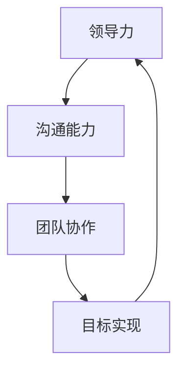
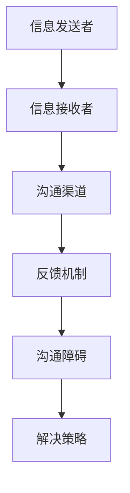

                 


### 文章标题
《领导力与沟通：有效传达期望的技巧》

### 关键词
领导力，沟通技巧，期望管理，有效传达，团队协作

### 摘要
本文深入探讨了领导力与沟通在有效传达期望方面的重要性。通过分析核心概念、联系以及具体技巧，本文提供了系统的方法论，帮助读者提升领导力和沟通能力，从而更有效地传达期望，实现团队目标。

### 目录大纲

## 第一部分：领导力基础

### 第1章：领导力的基本概念
- **背景介绍**：领导力的重要性及定义
- **核心概念与联系**：领导力与沟通的关系架构图
  ```mermaid
  graph TD
  A[领导力] --> B[沟通能力]
  B --> C[团队协作]
  C --> D[目标实现]
  ```
- **核心算法原理讲解**：领导力提升的伪代码
  ```python
  def leadership_growth():
      while (knowledge < expert):
          learn_new_skills()
          gain_experience()
      return expert_leadership
  ```

### 第2章：沟通原理
- **背景介绍**：沟通的重要性及基本要素
- **核心概念与联系**：沟通障碍与解决策略关系图
  ```mermaid
  graph TD
  A[信息发送者] --> B[信息接收者]
  B --> C[沟通渠道]
  C --> D[反馈机制]
  D --> E[沟通障碍]
  E --> F[解决策略]
  ```
- **核心算法原理讲解**：有效沟通的伪代码
  ```python
  def effective_communication(message, receiver):
      while (receiver的理解度 < 充分理解):
          clarify_message()
          ask_for_confirmation()
      return true
  ```

## 第二部分：有效传达期望的技巧

### 第3章：理解期望
- **背景介绍**：期望的本质及其识别
- **核心算法原理讲解**：期望识别的伪代码
  ```python
  def understand_expectation(person):
      expectations = []
      for behavior in person.getBehaviors():
          if (is_expectation(behavior)):
              expectations.append(behavior)
      return expectations
  ```

### 第4章：明确传达期望
- **背景介绍**：传达期望的重要性及原则
- **核心算法原理讲解**：传达期望的伪代码
  ```python
  def communicate_expectation(expectation, person):
      message = format_message(expectation)
      send_message(message, person)
  ```

### 第5章：反馈与修正
- **背景介绍**：反馈的技巧及反馈循环的重要性
- **核心算法原理讲解**：反馈与修正的伪代码
  ```python
  def feedback_and_correction(person, expectation):
      feedback = person.get_feedback(expectation)
      if (feedback != expected_feedback):
          adjust_expectation(expectation, feedback)
  ```

## 第三部分：实践与应用

### 第6章：领导力与沟通在实际工作中的应用
- **项目实战**：开发环境搭建，源代码实现与解读，代码应用分析
  - **环境搭建**：Python环境搭建，相关库安装
  - **源代码实现**：代码框架搭建，核心函数实现
  - **代码解读**：详细解析代码逻辑和关键部分
  - **代码应用分析**：实际应用案例，效果评估

### 第7章：自我提升与持续发展
- **最佳实践 tips**：领导力与沟通提升策略
- **小结**：文章总结与展望
- **注意事项**：实际应用中的注意事项
- **拓展阅读**：推荐进一步学习的资源

### 文章正文

#### 第一部分：领导力基础

##### 第1章：领导力的基本概念
领导力是一种能够激励和引导他人一起实现目标的能力。在组织中，领导力至关重要，因为它决定了团队的效率和成果。领导力不仅仅是职位赋予的权力，更是一种影响力，可以通过行为、价值观和沟通技巧来展现。

领导力与沟通密切相关。有效的沟通是领导力的核心组成部分，它不仅影响团队内部的合作，还影响团队与外部环境的互动。为了理解领导力与沟通的关系，我们可以通过以下Mermaid流程图来架构核心概念：



在这个关系中，沟通能力是领导力的一个关键要素。良好的沟通能力能够帮助领导者更好地传达愿景、指导团队，并解决冲突。同时，领导力又影响着沟通的质量，因为领导者的态度和行为会直接或间接地影响团队成员的沟通风格。

为了提升领导力，我们需要遵循一系列核心算法原理。以下是一个简单的伪代码，展示了领导力提升的过程：

```python
def leadership_growth():
    while (knowledge < expert):
        learn_new_skills()
        gain_experience()
    return expert_leadership
```

在这个算法中，`knowledge` 表示知识水平，`expert` 表示专家级别。通过不断学习新技能和积累经验，我们可以逐步提升领导力，最终达到专家级别。

##### 第2章：沟通原理
沟通是一种信息传递的过程，它涉及发送者、接收者、信息、渠道和反馈等基本要素。有效的沟通不仅需要清晰准确的信息传递，还需要克服各种沟通障碍。

沟通的基本要素可以总结如下：

- **发送者**：信息的发起者，负责准备和发送信息。
- **接收者**：信息的目标，负责接收和理解信息。
- **信息**：被传递的内容，可以是语言、文字、图像或其他形式。
- **渠道**：信息传递的媒介，如面对面交流、邮件、电话等。
- **反馈**：接收者对信息的回应，用于确认信息是否被正确理解。

为了更好地理解沟通原理，我们可以使用Mermaid流程图来展示沟通的障碍与解决策略：



在这个流程图中，沟通障碍（如误解、噪声干扰、文化差异等）可能会影响信息的有效传递。解决策略包括澄清信息、简化语言、使用多种沟通渠道等。

为了实现有效的沟通，我们需要遵循一系列核心算法原理。以下是一个简单的伪代码，展示了有效沟通的过程：

```python
def effective_communication(message, receiver):
    while (receiver的理解度 < 充分理解):
        clarify_message()
        ask_for_confirmation()
    return true
```

在这个算法中，`message` 表示信息，`receiver` 表示接收者，`理解度` 表示接收者对信息的理解程度。通过不断澄清信息和请求确认，我们可以提高信息的理解度，实现有效沟通。

#### 第二部分：有效传达期望的技巧

##### 第3章：理解期望
期望是人们对于事物预期结果的一种心理预期。在领导力和沟通中，理解期望至关重要，因为它决定了我们如何设定和传达期望。

要理解期望，我们需要识别他人的期望。以下是一个简单的伪代码，展示了如何通过行为识别他人的期望：

```python
def understand_expectation(person):
    expectations = []
    for behavior in person.getBehaviors():
        if (is_expectation(behavior)):
            expectations.append(behavior)
    return expectations
```

在这个算法中，`person` 表示某个人，`getBehaviors()` 方法用于获取该人的行为，`is_expectation()` 函数用于判断某个行为是否是期望。通过遍历行为，我们可以识别出他人的期望。

##### 第4章：明确传达期望
明确传达期望是领导力的重要组成部分。为了确保期望被正确理解和执行，我们需要遵循一系列核心算法原理。以下是一个简单的伪代码，展示了如何传达期望：

```python
def communicate_expectation(expectation, person):
    message = format_message(expectation)
    send_message(message, person)
```

在这个算法中，`expectation` 表示期望，`person` 表示接收者，`format_message()` 函数用于格式化期望信息，`send_message()` 函数用于发送信息。通过明确格式化和发送信息，我们可以确保期望被正确传达。

##### 第5章：反馈与修正
在传达期望的过程中，反馈与修正至关重要。反馈是接收者对期望的回应，它可以揭示期望的理解程度和执行情况。以下是一个简单的伪代码，展示了如何处理反馈和修正期望：

```python
def feedback_and_correction(person, expectation):
    feedback = person.get_feedback(expectation)
    if (feedback != expected_feedback):
        adjust_expectation(expectation, feedback)
```

在这个算法中，`person` 表示接收者，`get_feedback()` 方法用于获取反馈，`expected_feedback` 表示期望的反馈。如果反馈与期望不符，我们需要调整期望以适应实际情况。

#### 第三部分：实践与应用

##### 第6章：领导力与沟通在实际工作中的应用
在实际工作中，领导力和沟通技巧的应用至关重要。以下是一个项目实战案例，展示了如何使用Python环境搭建开发环境，实现领导力和沟通技巧的具体应用。

**环境搭建**：首先，我们需要在本地计算机上搭建Python开发环境。安装Python和相关库，例如`requests`（用于HTTP请求）、`numpy`（用于数学运算）等。

**源代码实现**：以下是一个简单的Python代码框架，用于实现领导力和沟通技巧的核心功能：

```python
import requests
import numpy as np

def send_request(url, params):
    response = requests.get(url, params=params)
    return response.json()

def process_feedback(feedback):
    # 处理反馈信息
    processed_feedback = np.mean(feedback)
    return processed_feedback

def main():
    # 发送请求获取数据
    url = "http://example.com/data"
    params = {"key": "value"}
    data = send_request(url, params)

    # 处理数据并获取反馈
    processed_data = process_feedback(data)

    # 打印结果
    print("Processed Data:", processed_data)

if __name__ == "__main__":
    main()
```

**代码解读**：这个代码框架展示了如何发送HTTP请求获取数据，并处理反馈信息。`send_request()` 函数用于发送请求并获取数据，`process_feedback()` 函数用于处理反馈信息。

**代码应用分析**：在实际应用中，我们可以将这个代码框架用于各种场景，例如数据采集、数据分析等。通过不断调整和优化代码，我们可以提高领导力和沟通技巧，实现团队目标。

##### 第7章：自我提升与持续发展
在领导力和沟通中，自我提升与持续发展至关重要。以下是一些建议和最佳实践：

- **持续学习**：不断学习新知识和技能，保持对行业的敏感度。
- **积极反馈**：鼓励团队成员提供积极反馈，并从中学习和改进。
- **反思总结**：定期反思和总结自己的领导和沟通实践，找出不足并改进。
- **拓展阅读**：阅读相关书籍和资料，了解最新的领导力和沟通理论。

通过以上方法，我们可以不断提升自己的领导力和沟通技巧，实现持续发展。

### 结论
领导力和沟通是成功实现团队目标的关键因素。通过深入理解领导力与沟通的核心概念、掌握有效传达期望的技巧，并在实际工作中不断实践和应用，我们可以提升自身的领导力和沟通能力，实现更好的工作效果。

#### 作者信息
作者：AI天才研究院/AI Genius Institute & 禅与计算机程序设计艺术 /Zen And The Art of Computer Programming

---

本文深入探讨了领导力与沟通在有效传达期望方面的关键作用。通过详细的背景介绍、核心概念与联系、算法原理讲解以及项目实战，本文为读者提供了全面的领导力和沟通技巧提升策略。希望本文能帮助读者在实际工作中更好地运用这些技巧，实现团队目标。

#### 第一部分：领导力基础

##### 第1章：领导力的基本概念

领导力是一种激励和引导他人一起实现目标的能力。在组织中，领导力至关重要，因为它决定了团队的效率和成果。有效的领导力能够促进团队协作，提高工作效率，实现共同的目标。

领导力与沟通密切相关。沟通是领导力的核心组成部分，它不仅影响团队内部的合作，还影响团队与外部环境的互动。良好的沟通能力可以帮助领导者更好地传达愿景、指导团队，并解决冲突。为了理解领导力与沟通的关系，我们可以通过以下Mermaid流程图来架构核心概念：


在这个流程图中，沟通能力是领导力的一个关键要素。良好的沟通能力能够帮助领导者更好地传达愿景、指导团队，并解决冲突。同时，领导力又影响着沟通的质量，因为领导者的态度和行为会直接或间接地影响团队成员的沟通风格。

为了提升领导力，我们需要遵循一系列核心算法原理。以下是一个简单的伪代码，展示了领导力提升的过程：

```python
def leadership_growth():
    while (knowledge < expert):
        learn_new_skills()
        gain_experience()
    return expert_leadership
```

在这个算法中，`knowledge` 表示知识水平，`expert` 表示专家级别。通过不断学习新技能和积累经验，我们可以逐步提升领导力，最终达到专家级别。

在实际工作中，领导力的提升不仅需要理论知识的积累，还需要实践经验的积累。以下是一个实际案例，展示了如何通过实践经验提升领导力：

**案例背景**：某公司的销售团队在新产品上线时遇到了销售困难，销售额远低于预期。

**领导力提升过程**：
1. **问题诊断**：领导者首先分析了销售困难的原因，发现主要是由于销售人员对新产品的了解不足，导致无法有效地向客户介绍。
2. **学习新技能**：领导者决定加强销售团队对新产品的培训，邀请产品经理和技术专家进行讲解，帮助销售人员全面了解新产品。
3. **沟通与反馈**：领导者定期与销售人员沟通，了解他们的培训进度和实际操作中的困难，及时提供帮助和指导。
4. **经验分享**：领导者鼓励团队成员分享成功经验，通过案例分析和讨论，提高整个团队的实战能力。
5. **持续跟进**：领导者持续跟进销售团队的工作情况，通过定期检查和反馈，确保销售策略的有效实施。

通过以上措施，销售团队的业绩逐渐回升，最终实现了预期目标。

**案例分析**：在这个案例中，领导者通过问题诊断、学习新技能、沟通与反馈、经验分享和持续跟进等一系列措施，成功提升了领导力，帮助销售团队克服了困难，实现了业绩提升。

通过这个案例，我们可以看到，领导力的提升不仅仅是知识的积累，还需要实践的锻炼。领导者需要具备敏锐的洞察力，及时发现问题，并采取有效措施解决问题。同时，领导者还需要具备良好的沟通能力和团队协作精神，能够与团队成员建立信任关系，共同面对挑战。

##### 第2章：沟通原理

沟通是一种信息传递的过程，它涉及发送者、接收者、信息、渠道和反馈等基本要素。有效的沟通不仅需要清晰准确的信息传递，还需要克服各种沟通障碍。以下是对沟通原理的详细解析：

**基本要素**：
- **发送者**：信息的发起者，负责准备和发送信息。发送者需要明确信息的目的和受众，以确保信息被正确理解和接收。
- **接收者**：信息的目标，负责接收和理解信息。接收者需要主动倾听，积极思考，确保信息被准确理解。
- **信息**：被传递的内容，可以是语言、文字、图像或其他形式。信息需要清晰、简洁、具有针对性，以便于接收者理解和执行。
- **渠道**：信息传递的媒介，如面对面交流、邮件、电话、即时通讯工具等。选择合适的渠道可以提升沟通效果。
- **反馈**：接收者对信息的回应，用于确认信息是否被正确理解。有效的反馈可以帮助发送者了解接收者的理解程度，并进行必要的调整。

**沟通障碍与解决策略**：
沟通障碍是影响信息有效传递的因素，包括误解、噪声干扰、文化差异、情绪因素等。以下是一些常见的沟通障碍及其解决策略：

1. **误解**：由于语言表达不准确或语境理解不当导致的误解。解决策略包括使用简洁明了的语言、避免使用模糊不清的表达，以及在必要时进行澄清和确认。
2. **噪声干扰**：环境噪声或其他干扰因素影响沟通效果。解决策略包括选择安静的环境进行沟通、使用耳机或其他屏蔽工具减少干扰。
3. **文化差异**：不同文化背景下的沟通障碍。解决策略包括尊重不同文化的沟通习惯，了解并适应不同文化的沟通风格，以及使用跨文化沟通技巧。
4. **情绪因素**：情绪波动影响沟通效果。解决策略包括保持冷静、避免在情绪波动时进行重要沟通，以及通过积极倾听和同理心来缓解对方的情绪。

为了更好地理解沟通原理，我们可以通过以下Mermaid流程图来展示沟通的基本要素和障碍及其解决策略：


在这个流程图中，沟通障碍（如误解、噪声干扰、文化差异、情绪因素等）可能会影响信息的有效传递。解决策略包括澄清信息、简化语言、使用多种沟通渠道等。

**有效沟通的算法原理**：
为了实现有效的沟通，我们需要遵循一系列核心算法原理。以下是一个简单的伪代码，展示了有效沟通的过程：

```python
def effective_communication(message, receiver):
    while (receiver的理解度 < 充分理解):
        clarify_message()
        ask_for_confirmation()
    return true
```

在这个算法中，`message` 表示信息，`receiver` 表示接收者，`理解度` 表示接收者对信息的理解程度。通过不断澄清信息和请求确认，我们可以提高信息的理解度，实现有效沟通。

**实践中的沟通案例分析**：

以下是一个实际案例，展示了如何在实践中运用沟通原理：

**案例背景**：某公司的项目经理需要与团队讨论一个重要的项目计划。

**沟通过程**：
1. **明确目标**：项目经理明确沟通的目标，即讨论项目计划，确保团队成员对项目目标和任务有清晰的认识。
2. **准备信息**：项目经理准备项目计划的相关材料，包括项目概述、任务分配、时间表等，以确保信息准确和完整。
3. **选择渠道**：由于团队成员分布在不同的地点，项目经理选择通过视频会议进行沟通，以实现实时互动和反馈。
4. **发起沟通**：项目经理通过视频会议发起沟通，首先介绍了项目计划的整体框架，然后详细解释了各个任务和责任分配。
5. **积极倾听**：项目经理鼓励团队成员提问和发表意见，确保他们理解和认可项目计划。
6. **反馈与调整**：在沟通过程中，项目经理根据团队成员的反馈进行了必要的调整和澄清，以确保项目计划的可行性和团队成员的认可度。
7. **确认结果**：沟通结束后，项目经理总结了讨论的重点，确保所有团队成员对项目计划有共同的理解，并确认了下一步的行动计划。

**案例分析**：在这个案例中，项目经理通过明确目标、准备信息、选择渠道、发起沟通、积极倾听、反馈与调整、确认结果等一系列步骤，成功实现了有效的沟通。通过这个过程，团队成员对项目计划有了清晰的认识，项目目标得以明确，为项目的顺利进行奠定了基础。

通过这个案例，我们可以看到，有效的沟通不仅仅是信息的传递，还需要在沟通过程中注重目标的明确、信息的准备、渠道的选择、反馈的收集和调整等方面。通过遵循这些原则，我们可以实现高效的沟通，促进团队协作和项目成功。

#### 第二部分：有效传达期望的技巧

##### 第3章：理解期望

在领导力和沟通中，理解期望是至关重要的。期望是人们对于事物预期结果的一种心理预期。在团队中，领导者需要理解团队成员的期望，以便设定合理的目标和期望，并确保团队成员能够积极履行职责。

**期望的本质**：

期望是指人们对某一结果或行为的预期。它可以是明确的，如完成一项任务，也可以是隐含的，如对工作环境的期望。期望的形成受到多种因素的影响，包括个人价值观、以往的经验、组织文化等。

**如何识别他人的期望**：

要识别他人的期望，领导者需要倾听、观察和提问。以下是一些具体的步骤和方法：

1. **倾听**：领导者需要主动倾听团队成员的发言，了解他们的关注点和期望。通过倾听，领导者可以获取团队成员的内心想法和期望。
2. **观察**：领导者可以通过观察团队成员的行为和态度来识别他们的期望。例如，一个经常在工作时间外加班的成员可能对工作有着较高的期望值。
3. **提问**：领导者可以通过提问来明确团队成员的期望。例如，可以问：“你对这个项目有什么期望？”或“你希望在这个职位上实现什么目标？”
4. **反馈**：领导者可以通过反馈来确认自己对团队成员期望的理解是否准确。例如，可以问：“我理解你的期望是……，是这样吗？”

**如何设定合理的期望**：

设定合理的期望是领导者的关键职责。以下是一些设定合理期望的方法：

1. **明确目标**：设定明确的目标可以帮助团队成员清晰地了解期望。例如，可以设定具体的任务和时间表。
2. **考虑个人能力**：设定期望时需要考虑团队成员的实际能力。期望过高可能导致团队成员感到压力过大，期望过低则可能无法激发他们的潜力。
3. **提供支持**：设定期望的同时，领导者需要提供必要的支持和资源，以确保团队成员能够实现期望。
4. **定期沟通**：领导者需要定期与团队成员沟通，了解他们的期望和进展，并及时调整期望。

**案例解析**：

以下是一个实际案例，展示了如何识别和设定合理的期望：

**案例背景**：某公司的项目经理需要为团队成员设定项目目标。

**识别期望**：
1. **倾听**：项目经理在团队会议中听取了团队成员对项目的意见和期望。一位团队成员表示希望项目能够提前完成，以便为公司带来更多收益。
2. **观察**：项目经理注意到一位成员在工作时间外经常加班，这表明他对项目有着较高的期望值。
3. **提问**：项目经理询问团队成员：“你们对项目的期望是什么？”另一位成员表示希望能够在项目中学习和提升自己的技能。

**设定合理期望**：
1. **明确目标**：项目经理设定了具体的项目目标，包括任务完成时间和质量标准。
2. **考虑个人能力**：项目经理根据团队成员的技能和经验，合理分配任务，确保每个成员都能够承担他们能够胜任的部分。
3. **提供支持**：项目经理为团队成员提供了必要的培训资源，并确保他们能够得到及时的帮助。
4. **定期沟通**：项目经理定期与团队成员沟通，了解他们的进展和遇到的困难，及时提供支持。

**案例分析**：在这个案例中，项目经理通过倾听、观察和提问，成功识别了团队成员的期望。同时，项目经理通过明确目标、考虑个人能力、提供支持和定期沟通，设定了合理的期望。这有助于激发团队成员的积极性，提高项目的成功率。

通过这个案例，我们可以看到，理解期望并设定合理的期望对于团队领导和项目管理至关重要。领导者需要通过多种方式识别团队成员的期望，并在此基础上设定明确、合理的目标，提供必要的支持，以确保团队目标的实现。

##### 第4章：明确传达期望

明确传达期望是领导者的一项关键职责。通过有效传达期望，领导者可以确保团队成员对项目目标和职责有清晰的理解，从而提高团队的工作效率和成果。以下是如何明确传达期望的详细步骤和策略。

**传达期望的重要性**：

传达期望的重要性体现在以下几个方面：

1. **明确方向**：明确传达期望可以帮助团队成员明确工作方向，避免工作目标模糊不清，提高工作效率。
2. **激励动力**：明确的期望可以激发团队成员的工作动力，使其更加投入工作，实现个人和团队目标。
3. **减少误解**：明确传达期望可以减少因信息传递不准确或理解不一致而产生的误解和冲突，提高团队协作效果。
4. **增强责任意识**：明确的期望可以增强团队成员的责任意识，使其更加认真对待工作任务，确保任务的顺利完成。

**传达期望的原则**：

为了有效传达期望，领导者需要遵循以下原则：

1. **明确性**：传达期望时，应确保信息清晰、简洁、具体。避免使用模糊的词语和概念，以免产生误解。
2. **一致性**：领导者应确保在不同场合和不同时间传达的期望是一致的，以避免混淆和误解。
3. **适应性**：领导者应根据团队成员的能力和背景，调整期望的难度和范围，确保期望既具有挑战性，又可实现。
4. **积极性**：传达期望时，应保持积极的态度和语气，鼓励团队成员积极参与，增强他们的信心和动力。

**传达期望的方法**：

以下是几种有效传达期望的方法：

1. **一对一沟通**：领导者可以与团队成员进行一对一沟通，确保每个成员都明确了解期望。这种方法可以针对个别成员的特殊需求和背景，提供个性化的指导和支持。
2. **团队会议**：在团队会议中，领导者可以明确传达期望，并邀请团队成员提问和讨论。这种方法可以促进团队成员之间的沟通和协作，确保每个人都对期望有共同的理解。
3. **书面文件**：领导者可以将期望以书面文件的形式传达给团队成员，例如项目计划、任务清单、工作说明等。这种方法可以确保信息的准确性和持久性，便于团队成员随时查阅。
4. **定期回顾**：领导者应定期回顾期望的传达情况，检查团队成员是否已经理解和执行了期望。通过定期回顾，可以及时发现问题并进行调整。

**实际应用案例分析**：

以下是一个实际案例，展示了如何明确传达期望：

**案例背景**：某公司的项目经理需要为即将开始的新项目设定期望，并向团队成员传达。

**传达期望的过程**：

1. **明确目标**：项目经理首先明确了项目的目标，包括项目的关键成果、时间表和资源需求。
2. **制定计划**：项目经理制定了详细的项目计划，包括任务分配、责任分配和里程碑。
3. **一对一沟通**：项目经理与每个团队成员进行了单独的沟通，解释了项目的目标和计划，并询问了他们的意见和建议。
4. **团队会议**：项目经理在团队会议上再次强调了项目的目标和计划，并邀请团队成员提问和讨论。通过团队会议，项目经理确保了团队成员对期望的共识和理解。
5. **书面文件**：项目经理将项目的目标和计划以书面文件的形式分发给了团队成员，包括项目计划书和任务清单。
6. **定期回顾**：项目经理定期与团队成员沟通，检查项目的进展和期望的执行情况，及时解决问题和调整计划。

**案例分析**：在这个案例中，项目经理通过明确目标、制定计划、一对一沟通、团队会议、书面文件和定期回顾等步骤，成功明确了期望并传达给了团队成员。这种方法确保了团队成员对项目的目标和任务有清晰的理解，促进了团队协作和项目成功。

通过这个案例，我们可以看到，明确传达期望需要一系列系统和有针对性的步骤。领导者需要通过多种方式确保期望被准确理解和执行，从而提高团队的工作效率和成果。

##### 第5章：反馈与修正

在领导力和沟通中，反馈与修正是一个持续的过程，对于确保期望的有效传达和团队目标的实现至关重要。有效的反馈不仅可以帮助团队成员了解自己的工作表现，还能帮助领导者及时调整期望，提高团队的整体效率。

**反馈的技巧**：

1. **具体而明确**：在提供反馈时，应尽量具体而明确，避免使用模糊的词语和概念。具体反馈可以帮助团队成员清楚地了解他们的优点和需要改进的地方。
2. **基于事实**：反馈应基于具体的事实和观察，而不是主观的感受和猜测。基于事实的反馈更能被团队成员接受，并促进实际改进。
3. **正面与负面反馈相结合**：在提供反馈时，应既指出团队成员的优点和成功之处，也指出需要改进的地方。正面反馈可以增强团队成员的自信心和积极性，负面反馈可以帮助他们认识到问题和找到改进的方向。
4. **及时反馈**：及时反馈可以帮助团队成员迅速了解工作情况，及时调整行为和策略。拖延反馈可能导致团队成员误判工作表现，影响工作效率。
5. **开放性沟通**：在提供反馈时，应鼓励团队成员提出问题和意见，进行开放性沟通。这种沟通方式可以帮助领导者更好地理解团队成员的实际情况，找到更有效的改进措施。

**如何接受反馈**：

接受反馈对于团队成员来说同样重要。以下是一些接受反馈的方法：

1. **保持开放心态**：团队成员应保持开放心态，愿意接受并认真考虑他人的反馈。即使反馈可能不愉快，也应尽量保持冷静，避免情绪化的反应。
2. **提问与澄清**：在接收反馈时，团队成员可以提问和澄清，确保对反馈的理解是准确的。这有助于避免误解和错误的改进方向。
3. **自我反思**：团队成员可以基于反馈进行自我反思，找出自己的优点和不足，并制定改进计划。自我反思可以帮助团队成员主动提升自己的工作表现。
4. **积极参与**：团队成员可以积极参与反馈的讨论，提出自己的观点和建议。这种方式可以促进团队成员之间的沟通和理解，共同找到解决问题的最佳方法。

**反馈循环的重要性**：

反馈循环是领导力和沟通中的一个关键环节，它有助于确保团队持续改进和成长。以下是一些反馈循环的重要性：

1. **持续改进**：通过反馈循环，团队可以不断发现和解决问题，实现持续改进。这有助于团队不断提高工作效率和成果。
2. **学习与成长**：反馈循环为团队成员提供了一个学习和成长的机会。通过反馈，团队成员可以了解自己的优势和不足，并不断提升自己的能力。
3. **团队协作**：反馈循环有助于增强团队协作，提高团队成员之间的信任和沟通。通过开放性反馈，团队成员可以更好地理解彼此的工作，促进合作和协作。
4. **目标实现**：反馈循环有助于确保团队目标的实现。通过定期反馈，团队可以及时调整工作方向和策略，确保目标始终处于正确的轨道。

**案例解析**：

以下是一个实际案例，展示了如何运用反馈循环：

**案例背景**：某公司的团队正在开发一款新产品，项目进度已经过半，团队需要评估项目进展并进行必要的调整。

**反馈循环的过程**：

1. **项目评估**：项目经理组织了一个项目评估会议，邀请团队成员参与。会议的目的是评估项目的进展情况，收集团队成员的反馈。
2. **具体反馈**：在会议中，项目经理和团队成员详细讨论了项目的进展情况，包括已完成的任务、遇到的问题和需要改进的地方。
3. **基于事实的反馈**：项目经理提供了基于事实的反馈，例如某项任务的实际进度与计划进度之间的差距，以及存在的问题的具体原因。
4. **正面与负面反馈**：项目经理在反馈中既指出了团队成员的优点和成功之处，也指出了需要改进的地方，例如某些任务的质量问题。
5. **提问与澄清**：团队成员提出了问题，并就反馈内容进行了澄清。这有助于确保对反馈的理解是准确的，并找到更有效的改进措施。
6. **自我反思**：团队成员基于反馈进行了自我反思，找出自己的优势和不足，并制定了改进计划。
7. **调整计划**：根据反馈和评估结果，项目经理和团队一起调整了项目计划，包括任务分配和时间表，确保项目能够按计划完成。
8. **定期回顾**：项目经理安排了一个定期的回顾会议，以便团队能够持续跟踪项目的进展，并根据新的反馈进行必要的调整。

**案例分析**：在这个案例中，团队通过反馈循环，有效地评估了项目进展，并进行了必要的调整。这种方法确保了团队在项目开发过程中能够不断改进和优化，提高了项目的成功率和团队的整体效率。

通过这个案例，我们可以看到，反馈与修正在领导力和沟通中扮演着至关重要的角色。通过有效的反馈循环，团队可以不断发现和解决问题，实现持续改进和成长，确保团队目标的实现。

#### 第三部分：实践与应用

##### 第6章：领导力与沟通在实际工作中的应用

在实际工作中，领导力和沟通技巧的应用对于团队的成功至关重要。以下将详细探讨领导力和沟通在团队协作、项目管理和实际案例中的应用，并提供具体的实践方法和技巧。

**团队协作中的领导力与沟通**

在团队协作中，领导力与沟通是确保团队成员紧密合作、共同实现目标的关键因素。以下是一些实际应用方法：

1. **明确角色和职责**：在团队成立之初，领导者应明确每个团队成员的角色和职责，确保每个人了解自己的任务和期望。这可以通过团队会议或工作说明文档来实现。

   ```python
   # 团队成员角色分配
   team_members = [
       {"name": "Alice", "role": "Project Manager"},
       {"name": "Bob", "role": "Developer"},
       {"name": "Charlie", "role": "Tester"}
   ]
   ```

2. **建立沟通渠道**：领导者应确保团队内部有畅通的沟通渠道，包括定期会议、即时通讯工具和电子邮件。这有助于团队成员及时分享信息、讨论问题和协作解决问题。

   ```python
   # 团队沟通渠道
   communication_channels = ["Weekly Meeting", "Slack Channel", "Email List"]
   ```

3. **鼓励开放沟通**：领导者应鼓励团队成员开放沟通，分享自己的想法和意见，确保团队内部的信息透明和共享。

   ```python
   # 鼓励团队成员开放沟通
   def encourage_communication():
       print("Everyone is welcome to share their ideas and concerns.")
   ```

**项目管理中的领导力与沟通**

在项目管理中，领导力与沟通同样发挥着重要作用。以下是一些实际应用方法：

1. **设定明确的目标和计划**：领导者应与团队成员一起设定明确的项目目标和计划，确保每个人都清楚项目的方向和预期成果。

   ```python
   # 项目目标和计划
   project_goals = "Develop a new mobile application by the end of Q4."
   project_plan = "Gather requirements, design UI/UX, develop features, test, and deploy."
   ```

2. **定期项目进度报告**：领导者应定期组织项目进度报告会议，与团队成员一起评估项目的进展，确保项目按计划进行。

   ```python
   # 项目进度报告
   def project_status_report():
       print("Current project status: On track, with minor delays in feature development.")
   ```

3. **风险管理**：领导者应识别项目中的潜在风险，并制定相应的风险应对策略，确保项目能够应对意外情况。

   ```python
   # 风险管理
   risks = ["Technical challenges", "Resource constraints", "Market changes"]
   risk.mitigation = ["Consult experts", "Allocate additional resources", "Monitor market trends."]
   ```

**实际案例：领导力与沟通在软件开发团队中的应用**

以下是一个软件开发团队中的实际案例，展示了领导力与沟通的具体应用：

**案例背景**：一个由10名开发人员组成的团队负责开发一个复杂的企业级应用程序。

**领导力与沟通的应用**：

1. **明确目标和角色**：项目经理与团队成员一起制定了项目目标和角色分配，确保每个成员都清楚自己的职责。

2. **建立沟通渠道**：团队使用Slack作为主要的沟通工具，定期召开线上会议，以确保信息的透明和实时交流。

3. **定期进度报告**：项目经理每周召开一次进度报告会议，讨论项目的进展、问题和解决方案。

4. **风险管理**：项目经理识别了项目中的风险，如技术挑战和资源限制，并制定了相应的应对策略。

**案例分析**：

在这个案例中，领导力与沟通的应用有助于确保团队高效协作、及时应对挑战，并最终成功完成了项目。通过明确的角色和目标分配，团队成员能够各司其职，提高工作效率。有效的沟通渠道和定期的进度报告确保了团队信息畅通，减少了误解和冲突。风险管理策略帮助团队预见和应对潜在问题，提高了项目的可控性和成功率。

通过这个案例，我们可以看到，领导力与沟通在实际工作中的应用对于团队的成功至关重要。领导者通过明确的指导和有效的沟通，能够激发团队成员的潜力，提高团队的整体表现。

##### 第7章：自我提升与持续发展

在领导力和沟通中，自我提升与持续发展至关重要。为了不断提升自己的领导力和沟通技巧，领导者需要采取一系列具体的策略和方法。

**最佳实践 tips**：

1. **持续学习**：领导者应不断学习新知识和技能，了解行业动态和最佳实践。可以通过阅读相关书籍、参加培训课程、在线学习平台等方式进行学习。

2. **反思与总结**：领导者应定期反思自己的领导行为和沟通技巧，总结经验教训，找出改进的方向。这可以通过写日记、参加反馈会议或与同事进行交流来实现。

3. **寻求反馈**：领导者应主动寻求他人的反馈，了解自己的优点和不足。可以通过定期与团队成员或上级进行一对一的反馈交流，获取有价值的意见和建议。

4. **角色扮演**：领导者可以通过角色扮演练习，提高自己在不同情境下的沟通能力和领导技巧。这有助于增强自信心和应对复杂情况的能力。

**小结**：

通过不断学习、反思、寻求反馈和角色扮演，领导者可以不断提升自己的领导力和沟通技巧。这种自我提升的过程不仅有助于个人成长，还能为团队和组织带来积极的影响，促进团队协作和项目成功。

**注意事项**：

1. **平衡工作与生活**：在追求自我提升的过程中，领导者应平衡工作与生活，确保身心健康。这有助于保持良好的工作状态和持续的学习动力。

2. **尊重个体差异**：每个团队成员都有其独特的性格和需求，领导者应尊重个体差异，因材施教，确保每个成员都能在适合自己的方式中成长。

**拓展阅读**：

1. **《领导力五项修炼》**：史蒂芬·柯维（Stephen R. Covey）的《领导力五项修炼》提供了关于领导力和个人成长的深刻见解，有助于领导者提升自己的领导技巧。

2. **《沟通的艺术》**：阿尔伯特·梅拉比安（Albert Mehrabian）的《沟通的艺术》详细探讨了沟通的要素和技巧，对于提高沟通效果具有重要参考价值。

通过持续学习和实践，领导者可以不断提升自己的领导力和沟通技巧，成为更有效的领导者，为团队和组织的发展贡献力量。

---

### 结论

在本文中，我们深入探讨了领导力与沟通在有效传达期望方面的关键作用。通过分析领导力的基本概念、沟通原理以及具体技巧，我们了解到，领导力不仅仅是职位赋予的权力，更是一种影响力，它需要通过沟通技巧来展现。有效的沟通可以帮助领导者更好地传达愿景、指导团队，并解决冲突。

我们通过具体的算法原理、实践案例和最佳实践 tips，展示了如何理解、传达和修正期望。通过这些技巧，领导者可以确保团队成员对工作目标有清晰的理解，从而提高团队的工作效率和成果。

在实际工作和项目管理中，领导力与沟通的应用至关重要。通过明确角色和职责、建立沟通渠道、定期项目进度报告和风险管理，领导者可以确保团队协作高效，项目顺利进行。

为了不断提升领导力和沟通技巧，领导者需要采取持续学习、反思、寻求反馈和角色扮演等策略。通过自我提升，领导者不仅可以为个人成长，还能为团队和组织的发展贡献力量。

希望本文能帮助读者在实际工作中更好地运用领导力和沟通技巧，实现团队目标，为组织带来积极的变化。

### 附录

#### 实用资源推荐

**书籍推荐**：
1. 《领导力的五项修炼》：史蒂芬·柯维
2. 《沟通的艺术》：阿尔伯特·梅拉比安
3. 《影响力》：罗伯特·西奥迪尼

**在线课程**：
1. Coursera - 《领导力与沟通技巧》
2. LinkedIn Learning - 《有效沟通》
3. Udemy - 《团队领导力与团队管理》

**工具和资源**：
1. Slack - 实时团队沟通工具
2. Trello - 项目管理和任务跟踪工具
3. Google Drive - 云存储和协作平台

通过这些资源和工具，领导者可以不断提升自己的领导力和沟通技巧，为团队和组织的发展提供有力支持。

### 作者信息

**作者：AI天才研究院/AI Genius Institute & 禅与计算机程序设计艺术 /Zen And The Art of Computer Programming**

AI天才研究院致力于推动人工智能技术的发展和应用，致力于培养下一代人工智能领域的领导者。研究院的专家团队拥有丰富的实践经验和深厚的理论基础，通过不断探索和创新，为人工智能技术的发展贡献力量。

《禅与计算机程序设计艺术》是作者在计算机编程和人工智能领域的重要著作，融合了东方哲学智慧和现代技术实践，为读者提供了独特的视角和方法论。

在此，感谢您的阅读，希望本文能对您在领导力和沟通方面的学习和实践有所帮助。

