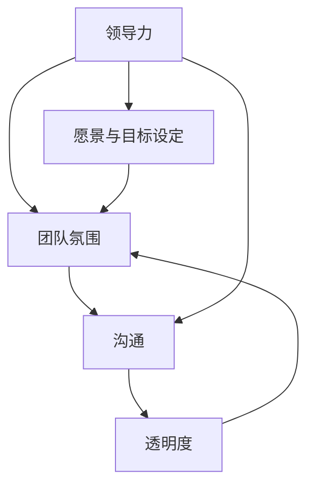

                 

# 《领导力与沟通：构建开放透明的团队氛围》

## 关键词

- 领导力
- 沟通
- 团队氛围
- 开放透明
- 愿景与目标
- 透明度

## 摘要

本文探讨了领导力与沟通在构建开放透明团队氛围中的关键作用。首先，我们定义了领导力和沟通的基本概念，并使用Mermaid流程图展示了它们在团队氛围构建中的关系。接着，我们分析了领导力与沟通的算法原理，并通过数学模型讲解了沟通效率的影响因素。最后，我们通过一个团队沟通反馈系统的项目实战，详细展示了如何在实际中实现开放透明的团队氛围。文章旨在为IT领域的领导者提供实用的指导，以构建高效、和谐的团队环境。

## 核心概念与联系

为了更好地理解领导力与沟通在团队氛围构建中的关系，我们可以使用Mermaid流程图来直观展示这些概念之间的联系。

### 1.1.1 领导力与沟通核心概念联系图



在这个流程图中，我们可以看到：

- 领导力（A）直接影响团队氛围（B）和沟通（C）。有效的领导力能够激发团队成员的积极性和参与度，从而改善团队氛围。
- 沟通（C）是领导力（A）的重要组成部分，同时也是构建开放透明团队氛围（B）的关键。透明度（E）作为沟通的一个维度，进一步影响团队氛围。
- 愿景与目标设定（D）是领导力（A）的具体体现，它为团队提供了共同的方向和目标，有助于增强团队凝聚力和透明度。

通过这个流程图，我们可以清晰地看到领导力、沟通和团队氛围之间的相互作用，以及它们在构建开放透明团队环境中的关键作用。

## 核心算法原理讲解

在了解了领导力与沟通的核心概念及其联系后，我们接下来探讨领导力与沟通的算法原理。以下是一个基于Python的领导力与沟通算法的伪代码示例：

```python
def leadership_communication():
    if has_vision():
        set_goals()
        communicate_goals()
    if has_transparency():
        share_info()
        seek_feedback()
    if has_leadership_style():
        adapt_style_to_team()
    else:
        learn_leadership_skills()
```

### 算法解释

1. **判断是否有愿景（has_vision()）**：如果团队领导具有明确的愿景，则进行下一步。

2. **设定目标（set_goals()）**：根据愿景，设定团队的目标和里程碑，确保团队成员对目标有共同的理解。

3. **沟通目标（communicate_goals()）**：通过有效的沟通手段，将目标传达给团队成员，确保每个人都清楚自己的职责和期望。

4. **判断是否有透明度（has_transparency()）**：如果团队领导能够保持透明度，则进行下一步。

5. **共享信息（share_info()）**：在团队内部共享必要的信息，确保团队成员对项目进展有清晰的了解。

6. **寻求反馈（seek_feedback()）**：鼓励团队成员提供反馈，帮助团队改进和调整。

7. **判断是否有领导风格（has_leadership_style()）**：如果团队领导具有合适的领导风格，则进行下一步。

8. **适应团队风格（adapt_style_to_team()）**：根据团队的特点和需求，调整领导风格，以最大化团队绩效。

9. **学习领导技能（learn_leadership_skills()）**：如果团队领导缺乏必要的技能，则需要通过学习和实践来提升自己的领导力。

通过这个算法，我们可以看到领导力和沟通在构建开放透明团队氛围中的具体步骤和策略。每个步骤都是基于明确的条件和目标，通过逐步实现来达到最终的目标。

## 数学模型和数学公式 & 详细讲解 & 举例说明

沟通效率是领导力和沟通的核心指标之一。为了更深入地理解沟通效率的影响因素，我们可以使用以下数学模型：

### 沟通效率模型公式

\[Efficiency = \frac{Information Shared}{Noise Level}\]

其中：
- **Information Shared** 代表共享的信息量；
- **Noise Level** 代表噪声水平。

### 模型解释

- **信息量（Information Shared）**：这是团队内部有效沟通的核心。信息量越大，团队成员对项目的理解越深入，决策的准确性越高。
- **噪声水平（Noise Level）**：这是沟通过程中的干扰和障碍，可能来自误解、信息遗漏、沟通不畅等多种因素。

通过这个公式，我们可以量化沟通效率，从而评估团队沟通的效果。以下是一个具体的举例说明：

### 举例说明

在一个团队中，每天共享的信息量为100条，同时噪声水平为20。根据公式，我们可以计算出沟通效率：

\[Efficiency = \frac{100}{20} = 5\]

这意味着，团队在处理信息时，每条信息的有效利用率是5倍。如果噪声水平降低到10，则沟通效率将提高：

\[Efficiency = \frac{100}{10} = 10\]

这个例子展示了如何通过降低噪声水平来提高沟通效率。在实际应用中，团队可以通过以下措施来降低噪声水平：
- **明确的沟通目标**：确保每次沟通都有明确的目标和议程。
- **有效的信息传递**：使用多种沟通渠道，如会议、邮件、即时消息等，确保信息传递的准确性。
- **建立反馈机制**：鼓励团队成员提供反馈，及时纠正误解和错误。

通过这些措施，团队可以显著提高沟通效率，从而在构建开放透明的团队氛围中发挥更大的作用。

## 项目实战：团队沟通反馈系统

### 开发环境搭建

为了实现一个有效的团队沟通反馈系统，我们首先需要搭建一个合适的开发环境。以下是具体的步骤：

1. **选择编程语言和框架**：我们选择Python和Flask作为主要编程语言和框架，因为它们在快速开发Web应用程序方面具有出色的表现。

2. **安装Python**：确保系统中安装了Python 3.x版本。可以从[Python官网](https://www.python.org/)下载并安装。

3. **安装Flask**：在终端中运行以下命令来安装Flask：

   ```bash
   pip install Flask
   ```

4. **安装SQLAlchemy**：为了与数据库交互，我们需要安装SQLAlchemy。运行以下命令：

   ```bash
   pip install SQLAlchemy
   ```

5. **选择数据库**：我们选择SQLite作为数据库，因为它易于使用且无需额外配置。可以通过以下命令创建一个SQLite数据库：

   ```bash
   sqlite3 feedback.db
   ```

### 源代码实现

以下是团队沟通反馈系统的核心代码：

```python
from flask import Flask, request, jsonify
from models import Feedback

app = Flask(__name__)

@app.route('/submit_feedback', methods=['POST'])
def submit_feedback():
    data = request.get_json()
    feedback = Feedback(
        user=data['user'],
        comment=data['comment'],
        rating=data['rating']
    )
    # 存储到数据库
    feedback.save()
    return jsonify({'status': 'success'})

if __name__ == '__main__':
    app.run(debug=True)
```

### 代码解读与分析

1. **导入模块**：我们首先导入所需的模块，包括Flask和SQLAlchemy。

2. **定义应用程序**：创建一个Flask应用程序实例，命名为`app`。

3. **定义路由和视图函数**：`submit_feedback`是一个视图函数，它处理来自客户端的POST请求。当用户提交反馈时，该函数会接收JSON格式的数据，并创建一个`Feedback`对象。

4. **创建Feedback对象**：我们根据接收到的数据创建一个`Feedback`对象，并将其存储到数据库中。

5. **返回响应**：成功存储反馈后，函数返回一个包含成功状态的JSON响应。

### 代码应用解读与分析

1. **接收用户反馈**：当用户提交反馈时，应用程序通过`submit_feedback`视图函数接收数据。这个函数需要接收JSON格式的数据，因此我们在路由定义中指定了`methods=['POST']`。

2. **数据验证**：在创建`Feedback`对象之前，我们需要验证接收到的数据是否完整且符合预期。例如，确保`user`、`comment`和`rating`字段都存在且类型正确。

3. **存储反馈到数据库**：通过SQLAlchemy，我们将创建的`Feedback`对象存储到SQLite数据库中。这可以通过调用对象的`save()`方法实现。

4. **返回响应**：存储反馈后，应用程序返回一个成功的JSON响应，告知用户反馈已成功提交。

### 实际案例分析和详细讲解剖析

为了展示团队沟通反馈系统在实际中的应用，我们考虑以下案例：

**案例**：一个开发团队在项目中遇到了沟通不畅的问题，导致进度缓慢。为了改善这种情况，团队决定引入一个沟通反馈系统。

**步骤**：
1. **开发反馈系统**：团队首先搭建了开发环境，并实现了反馈系统的基础功能。
2. **部署系统**：将系统部署到团队的工作站或服务器上，确保所有团队成员可以访问。
3. **培训团队成员**：团队对成员进行了系统的培训，确保他们知道如何提交反馈。
4. **收集反馈**：团队成员开始提交反馈，包括对项目进度的担忧、建议和改进意见。
5. **分析反馈**：团队定期分析反馈，识别问题并提出解决方案。

**效果**：
- 通过收集和分析反馈，团队发现了项目中的沟通障碍和瓶颈。
- 团队成员之间的沟通变得更加顺畅，项目进度得到显著提升。
- 通过反馈系统，团队成员感受到了团队对沟通问题的重视，增强了团队的凝聚力和协作性。

**项目小结**：

通过这个案例，我们可以看到团队沟通反馈系统在改善团队沟通和提升项目效率方面的显著作用。项目小结如下：

1. **改善沟通**：反馈系统提供了一个结构化的方式，让团队成员能够清晰地表达他们的意见和担忧。
2. **提高透明度**：团队成员可以随时查看和跟踪反馈的进展，增强了项目的透明度。
3. **增强团队协作**：通过共享反馈和解决方案，团队之间的协作得到加强，促进了团队的整体发展。

## 最佳实践 tips、小结、注意事项、拓展阅读等内容

### 最佳实践 tips

1. **定期沟通会议**：定期召开团队沟通会议，确保团队成员对项目的最新进展有共同的理解。
2. **明确沟通目标**：每次沟通会议或互动前，明确会议的目标和议程，避免无效沟通。
3. **多渠道沟通**：使用多种沟通渠道，如邮件、即时消息、视频会议等，以满足不同团队成员的偏好和需求。

### 小结

本文通过领导力与沟通的核心概念联系图、算法原理讲解、数学模型和项目实战，详细探讨了领导力与沟通在构建开放透明团队氛围中的关键作用。通过实施有效的领导力和沟通策略，团队可以显著提升工作效率和协作性。

### 注意事项

1. **个性化沟通**：了解团队成员的沟通风格和偏好，有针对性地进行沟通。
2. **及时反馈**：及时回应团队成员的反馈，建立积极、开放的沟通文化。

### 拓展阅读

- 《团队协作的五大法则》
- 《领导力与团队管理》
- 《沟通的艺术》

## 作者信息

- 作者：AI天才研究院/AI Genius Institute & 禅与计算机程序设计艺术 /Zen And The Art of Computer Programming

---

通过本文，我们深入探讨了领导力与沟通在构建开放透明团队氛围中的关键作用。希望本文能够为IT领域的领导者提供实用的指导，帮助他们在团队管理中取得更大的成功。再次感谢您的阅读！## 第1章：领导力基础

### 1.1 领导力概述

领导力是一个多维度的概念，它涉及激励、引导、协调和管理团队成员的能力。在IT行业中，领导力不仅仅是管理项目进度和技术团队，更是一种推动创新、提升团队绩效和实现共同目标的艺术。本文将首先概述领导力的定义，分析其在团队中的作用，以及领导者在团队管理中需要具备的核心能力。

#### 领导力的定义

领导力可以定义为一种能力，它涉及到激励和引导他人去实现共同的目标。这种能力不仅仅是技术层面的管理，更包括情感智慧、人际交往和战略思维等方面。从心理学角度来看，领导力是一种复杂的人类行为，涉及到个人特质、情境因素和互动过程。一些常见的领导力定义包括：

- **权威定义**：领导力是一种影响他人去实现共同目标的能力。
- **情境定义**：领导力是适应和应对不同情境的能力，以最大化团队绩效。
- **行为定义**：领导力是通过特定行为和决策来影响他人和团队的能力。

#### 领导力在团队中的作用

领导力在团队中的作用是至关重要的，它直接影响团队的绩效、协作和氛围。以下是领导力在团队中的几个关键作用：

1. **方向设定**：领导者为团队设定明确的目标和方向，确保团队成员朝着共同的目标努力。
2. **决策与执行**：领导者负责做出关键决策，并在执行过程中提供指导和支持。
3. **团队凝聚**：通过建立信任、激发团队精神和促进团队协作，领导者增强团队的凝聚力。
4. **创新与变革**：领导者鼓励创新思维，推动团队适应变化，以保持竞争力。
5. **激励与成长**：领导者激励团队成员发挥潜力，促进个人和团队成长。

#### 领导者在团队管理中需要具备的核心能力

为了有效地管理团队，领导者需要具备一系列核心能力。以下是几个关键的领导能力：

1. **沟通能力**：领导者需要具备清晰、有效的沟通能力，以确保信息的准确传递和理解。
2. **情感智慧**：领导者需要理解和管理自己的情感，同时能够识别和应对团队成员的情感需求。
3. **决策能力**：领导者需要能够快速做出明智的决策，并在面对复杂情境时保持冷静。
4. **团队合作**：领导者需要促进团队合作，建立良好的团队关系，并确保团队成员能够协同工作。
5. **变革管理**：领导者需要能够推动团队适应变化，鼓励创新和持续改进。

通过理解领导力的定义、作用和核心能力，我们可以更好地认识到领导力在团队管理中的重要性。在接下来的章节中，我们将进一步探讨领导风格与影响，以及领导力在沟通中的具体应用。

### 1.2 领导风格与影响

领导风格是指领导者管理团队和应对情境的方式。不同的领导风格对团队氛围、绩效和成员行为有显著影响。根据领导者如何行使权力和影响他人，领导风格可以分为多种类型，包括民主型、权威型、参与型和教练型等。本文将分析这些领导风格的特点、优缺点及其在团队管理中的应用。

#### 领导风格的类型

1. **民主型领导风格**（Democratic Leadership Style）

   民主型领导风格是一种参与式领导风格，领导者鼓励团队成员参与决策过程，尊重成员的意见和想法。这种风格的领导者通常会在制定团队目标和决策时征求团队成员的意见，确保团队成员感到被尊重和参与。

   - **优点**：
     - 增强团队成员的参与感和归属感。
     - 促进团队创新和多样性，因为每个成员都能贡献自己的知识和经验。
     - 提高决策质量，通过集体讨论和共识，减少错误和偏见。
   - **缺点**：
     - 决策过程可能较为缓慢，因为需要考虑多个观点和意见。
     - 可能导致权力分散，影响领导者的控制力。

2. **权威型领导风格**（Autocratic Leadership Style）

   权威型领导风格是一种集中式领导风格，领导者独自做出决策，并对团队成员施加严格控制。这种风格的领导者通常会直接告诉团队成员该做什么，如何做，而不需要成员的参与。

   - **优点**：
     - 决策迅速，行动果断。
     - 在紧急情况下，能够快速采取行动，避免混乱。
   - **缺点**：
     - 可能导致团队成员缺乏主动性和创造力。
     - 阻碍团队间的沟通和协作，成员可能感到被忽视或被压制。

3. **参与型领导风格**（Laissez-Faire Leadership Style）

   参与型领导风格是一种放权型领导风格，领导者给予团队成员高度的自主权和灵活性，让他们自行决定如何完成任务。这种风格的领导者通常不会干预团队成员的具体工作，而是提供支持和资源。

   - **优点**：
     - 提高团队成员的自主性和责任感。
     - 增强团队成员的创造力和创新精神。
   - **缺点**：
     - 可能导致团队成员间缺乏协作和沟通。
     - 领导者可能无法有效地监督和指导团队成员。

4. **教练型领导风格**（Coaching Leadership Style）

   教练型领导风格是一种关注个人成长和发展的领导风格，领导者不仅关注团队成员的工作成果，还关注他们的个人发展和职业成长。这种风格的领导者通常通过指导和辅导帮助团队成员提升技能和表现。

   - **优点**：
     - 促进团队成员的个人成长和职业发展。
     - 增强团队成员的自信和责任感。
     - 提高团队整体绩效。
   - **缺点**：
     - 需要大量时间和精力来指导和辅导团队成员。
     - 可能对紧急任务和决策产生延迟。

#### 领导风格在团队管理中的应用

在实际团队管理中，领导者通常会根据团队的具体情况和环境灵活运用不同的领导风格。以下是一些应用场景：

1. **项目初期**：在项目初期，领导者可能需要采用权威型领导风格，以确保项目迅速启动和有序进行。
2. **团队成熟期**：在团队成熟期，领导者可以更多地采用民主型或教练型领导风格，激发团队成员的主动性和创造力。
3. **危机管理**：在危机管理中，领导者可能需要采取权威型领导风格，迅速采取行动，稳定局势。

通过理解和灵活运用不同的领导风格，领导者可以在不同的情境下有效地管理团队，实现团队的长期发展和成功。在下一章节中，我们将深入探讨领导力的核心能力，帮助领导者更好地发挥他们的作用。

### 1.3 领导力核心能力

领导力的核心能力是领导者成功管理团队和实现目标的关键。这些能力不仅包括技术和管理技能，还涉及人际交往、情感智慧和战略思维等方面。以下是几个关键的领导力核心能力，以及如何在实际工作中提升这些能力。

#### 沟通能力

沟通能力是领导者最重要的能力之一。有效的沟通能够确保信息的准确传递，增强团队成员之间的信任和协作。以下是提升沟通能力的几种方法：

- **倾听**：积极倾听是有效沟通的基础。领导者需要耐心倾听团队成员的意见和建议，确保理解他们的观点。
- **清晰表达**：领导者应该用简单明了的语言表达自己的想法，避免使用过于专业或复杂的术语。
- **反馈与反馈**：提供及时的、具体的反馈是沟通的重要部分。领导者应该鼓励团队成员提供反馈，并对其进行适当的回应。
- **多种沟通渠道**：利用多种沟通渠道，如面对面会议、电子邮件、即时消息和视频会议，以满足不同团队成员的沟通偏好。

#### 情感智慧

情感智慧是指领导者识别、理解和管理自己及他人的情感的能力。高情感智慧能够帮助领导者建立良好的人际关系，提升团队氛围。以下是提升情感智慧的几种方法：

- **自我意识**：领导者需要认识到自己的情感状态，并学会管理这些情感。通过反思和自我觉察，领导者可以更好地控制自己的情绪。
- **同理心**：同理心是理解他人情感和观点的能力。领导者应该努力站在团队成员的角度思考问题，以建立信任和合作关系。
- **情绪调节**：领导者需要学会调节自己的情绪，避免情绪波动对团队产生负面影响。通过放松技巧和正念练习，领导者可以更好地管理自己的情绪。

#### 决策能力

决策能力是指领导者面对复杂情境时，能够快速做出明智决策的能力。以下是提升决策能力的几种方法：

- **信息收集**：在做出决策之前，领导者需要收集和分析相关信息。这包括市场趋势、竞争对手的动态以及团队成员的意见。
- **风险评估**：领导者应该评估不同决策可能带来的风险和收益，并制定相应的应对策略。
- **决策模型**：使用决策模型，如SWOT分析（优势、劣势、机会、威胁）和决策树，可以帮助领导者系统化地分析决策问题。
- **快速学习**：领导者应该从每次决策中学习经验教训，不断提升自己的决策能力。

#### 团队合作

团队合作是领导力的重要组成部分。有效的团队合作能够提升团队的绩效和创新能力。以下是提升团队合作能力的几种方法：

- **明确目标**：确保团队成员对共同的目标有清晰的认识，并明确各自的职责和期望。
- **信任建设**：通过共享信息和透明沟通，建立团队成员之间的信任。
- **冲突解决**：领导者应该具备有效的冲突解决技能，帮助团队成员解决分歧，促进和谐的合作关系。
- **激励与奖励**：领导者应该通过激励和奖励机制，鼓励团队成员积极参与团队合作。

#### 变革管理

在快速变化的商业环境中，领导者需要具备变革管理能力，帮助团队适应变化并保持竞争力。以下是提升变革管理能力的几种方法：

- **愿景引领**：领导者应该具备清晰的愿景，并能够将愿景传达给团队成员，激发他们的变革动力。
- **透明沟通**：领导者需要与团队成员进行透明沟通，解释变革的原因和目标，回答他们的疑问。
- **参与与支持**：鼓励团队成员参与变革过程，并提供必要的支持和资源。
- **持续学习**：领导者应该鼓励团队成员不断学习和适应，以应对变化带来的挑战。

通过提升这些核心能力，领导者可以更有效地管理团队，实现组织的目标。在实际工作中，领导者需要灵活运用这些能力，根据不同的情境和团队成员的需求进行适当调整。在下一章节中，我们将深入探讨沟通原理，帮助领导者更好地理解和应用沟通技巧。

## 第2章：沟通原理

### 2.1 沟通基本概念

沟通是领导力的重要组成部分，它涉及信息的传递、理解和反馈的过程。有效的沟通能够促进团队成员之间的协作，提高工作效率，并改善团队氛围。本节将介绍沟通的基本概念，包括沟通的定义、目的、类型和基本要素。

#### 沟通的定义

沟通是指信息的交换、传递和理解的过程。它不仅包括语言表达，还包括肢体语言、面部表情和其他非语言信号。有效的沟通是双方或多方之间建立共识和理解的过程。

#### 沟通的目的

沟通的目的包括以下几个方面：

1. **信息传递**：确保信息准确、及时地传递给接收者。
2. **理解与共识**：通过沟通，确保发送者和接收者对信息有共同的理解。
3. **协作与合作**：促进团队成员之间的协作，共同实现团队目标。
4. **情感交流**：通过沟通，表达情感和情绪，建立信任和合作关系。
5. **冲突解决**：通过沟通，识别和解决团队成员之间的冲突。

#### 沟通的类型

根据不同的分类标准，沟通可以分为多种类型：

1. **正式沟通**：指在正式场合进行的、遵循一定规范的沟通，如会议、报告、邮件等。
2. **非正式沟通**：指在非正式场合进行的、较为随意和自由的沟通，如闲聊、社交活动等。
3. **垂直沟通**：指在不同层级之间的沟通，如上级与下级之间的沟通。
4. **水平沟通**：指在同一层级或部门之间的沟通，如同事之间的沟通。
5. **双向沟通**：指信息在发送者和接收者之间来回流动的沟通，有助于建立共识。
6. **单向沟通**：指信息从发送者到接收者的单向流动，信息反馈较少。

#### 沟通的基本要素

有效的沟通包括以下几个基本要素：

1. **发送者**：信息的源头，负责信息的编码和传递。
2. **信息**：需要传递的内容，可以是语言、文字、图像、声音等。
3. **编码**：将信息转换为可以传递的形式，如语言、符号、肢体语言等。
4. **渠道**：信息传递的途径，如口头、书面、电子邮件、即时通讯工具等。
5. **接收者**：信息的目标，负责解码和接收信息。
6. **解码**：将接收到的信息还原成有意义的内容，确保理解。
7. **反馈**：接收者对信息的回应，有助于确认沟通的效果。

通过了解沟通的基本概念、目的、类型和基本要素，领导者可以更有效地进行沟通，提升团队的整体绩效。在下一节中，我们将深入探讨有效沟通的技巧，帮助领导者提高沟通效果。

### 2.2 有效沟通技巧

有效沟通是领导力的核心要素之一，它不仅影响团队的工作效率，还直接关系到团队的凝聚力和氛围。本节将介绍几种有效沟通的技巧，帮助领导者提升沟通效果。

#### 清晰表达

清晰表达是有效沟通的基础。领导者应该确保自己的语言简洁明了，避免使用过于复杂或模糊的词汇。以下是几个提升清晰表达技巧的方法：

- **简化语言**：使用简单的词汇和句子，避免使用过于专业或复杂的术语。
- **明确重点**：在沟通时，首先要明确沟通的重点，然后围绕这个核心进行展开。
- **避免误导**：确保信息的准确性和一致性，避免因表达不清导致的误解。

#### 倾听技巧

倾听是有效沟通的重要组成部分。领导者不仅要倾听他人的意见和需求，还要倾听他们的情感和情绪。以下是几种提升倾听技巧的方法：

- **专注倾听**：在对方讲话时，保持专注，避免分心。
- **积极倾听**：通过点头、眼神交流等方式，表达出你在认真倾听。
- **确认理解**：在对方讲话结束后，简要总结他们的观点，确认自己是否理解正确。
- **提问与反馈**：通过提问和反馈，进一步理解对方的观点，并鼓励他们分享更多信息。

#### 表达情感

在沟通中，领导者不仅需要传达信息，还需要表达情感和情绪。以下是几种提升表达情感技巧的方法：

- **真诚表达**：真诚地表达自己的情感和情绪，避免压抑或掩饰。
- **适度的情感表达**：情感表达要适度，避免过度或压抑。
- **体态语言**：通过肢体语言和面部表情，辅助表达情感，使沟通更生动。

#### 适应不同沟通风格

团队中的每个成员可能有不同的沟通风格，领导者需要能够适应这些不同的风格，以实现有效的沟通。以下是几种适应不同沟通风格的方法：

- **识别沟通风格**：了解团队成员的沟通风格，包括他们偏好什么类型的沟通方式和渠道。
- **调整沟通方式**：根据团队成员的沟通风格，调整自己的沟通方式，以适应他们的需求。
- **寻求共同点**：在沟通时，寻找与团队成员的共同点，建立共鸣和信任。

#### 多渠道沟通

为了确保信息的有效传递和理解，领导者应该使用多种沟通渠道。以下是几种多渠道沟通的方法：

- **面对面沟通**：在必要时进行面对面沟通，确保信息的准确传达和理解。
- **书面沟通**：通过邮件、报告等书面形式进行沟通，记录重要信息和决策。
- **即时通讯**：使用即时通讯工具，如Slack或Microsoft Teams，进行快速、高效的沟通。
- **视频会议**：通过视频会议，进行远程团队的沟通和协作。

通过掌握这些有效沟通技巧，领导者可以提升沟通效果，增强团队协作，提高工作效率。在下一节中，我们将探讨沟通障碍及其解决方法，帮助领导者克服沟通中的挑战。

### 2.3 沟通障碍与解决

尽管沟通是领导力的核心要素，但在实际工作中，领导者往往会遇到各种沟通障碍，这些障碍可能影响信息的有效传递和理解。本节将探讨常见的沟通障碍，并分析如何解决这些问题，以实现有效的沟通。

#### 语言障碍

语言障碍是常见的沟通障碍之一，包括语言差异、词汇理解困难以及语言表达不清晰等。以下是解决语言障碍的方法：

- **使用简单词汇**：避免使用复杂的词汇和术语，使用简单、明确的语言进行沟通。
- **提供语言支持**：如果团队成员之间存在语言差异，可以考虑提供翻译或语言支持，确保信息准确传达。
- **解释专业术语**：在需要使用专业术语时，确保对术语进行解释，帮助团队成员理解。

#### 信息过载

信息过载是指接收者接收到的信息过多，导致难以处理和理解。以下是解决信息过载的方法：

- **过滤信息**：领导者需要学会筛选和过滤信息，确保传递给团队成员的信息是有价值且必要的。
- **分阶段传递**：将大量信息分成几个阶段进行传递，每次只传递一部分信息，以便团队成员能够更好地理解和处理。
- **简化信息**：通过使用图表、简报等方式，将复杂的信息简化，使其更加直观易懂。

#### 误解与误解

误解和误解是沟通中的常见问题，可能导致团队成员之间的冲突和不信任。以下是解决误解与误解的方法：

- **确认理解**：在沟通过程中，领导者应该鼓励团队成员确认他们是否理解了信息，避免误解。
- **使用具体例子**：通过具体例子和场景，帮助团队成员更好地理解信息。
- **开放反馈**：鼓励团队成员在沟通过程中提供反馈，及时纠正误解。

#### 情绪障碍

情绪障碍是指沟通双方在情绪上的障碍，如紧张、焦虑、愤怒等，这些情绪可能影响沟通的效果。以下是解决情绪障碍的方法：

- **情绪管理**：领导者需要学会管理自己的情绪，避免情绪波动影响沟通。
- **同理心**：领导者应该展现出同理心，理解对方的情绪，并提供支持。
- **暂停与反思**：在情绪激动时，领导者可以暂时暂停沟通，给自己和对方时间冷静下来。

#### 信任缺失

信任缺失是影响沟通的重要因素之一。缺乏信任可能导致团队成员对信息的接收和反馈持怀疑态度。以下是解决信任缺失的方法：

- **建立信任**：通过透明沟通、诚实和可靠性，建立团队成员之间的信任。
- **共享信息**：领导者应该共享关键信息，确保团队成员对项目有全面的理解。
- **鼓励反馈**：领导者应该鼓励团队成员提供反馈，并对其意见给予重视和回应。

通过识别和解决这些常见的沟通障碍，领导者可以提升沟通效果，增强团队协作，提高工作效率。在下一章节中，我们将探讨领导力与沟通的关系，深入理解领导力在沟通中的具体体现和作用。

## 第3章：领导力与沟通的关系

### 3.1 领导力与沟通的联系

领导力和沟通是构建高效团队不可或缺的两个要素，它们之间存在着紧密的联系和相互依赖。领导力是沟通的基础，而有效的沟通则是领导力的体现。本节将探讨领导力与沟通之间的联系，分析它们在团队管理中的相互影响，以及如何通过沟通实现领导力目标。

#### 领导力与沟通的相互作用

1. **领导力促进沟通**：领导力在团队沟通中起到引导和推动作用。领导者通过设定沟通目标和规范，鼓励团队成员积极参与沟通，从而促进信息的有效传递和共享。

2. **沟通增强领导力**：有效的沟通可以帮助领导者更好地理解团队成员的需求和意见，增强领导者的洞察力和决策能力。通过沟通，领导者可以及时调整策略和领导风格，以适应团队变化。

#### 领导力对沟通的影响

1. **设定沟通目标**：领导者需要明确团队的沟通目标，确保团队成员了解沟通的重要性和预期成果。通过设定沟通目标，领导者可以引导团队成员围绕共同的目标进行沟通。

2. **提供沟通支持**：领导者应提供必要的资源和支持，如培训、工具和技术，帮助团队成员提升沟通能力。此外，领导者还应鼓励团队成员在沟通中提出问题和反馈，以改进沟通效果。

3. **建立沟通规范**：领导者应制定明确的沟通规范，包括沟通的时间、方式、渠道和频率等。通过建立沟通规范，领导者可以确保团队成员在沟通中遵循一定的标准和流程，提高沟通的效率和质量。

#### 沟通对领导力的影响

1. **信息收集与反馈**：通过沟通，领导者可以收集到来自团队成员的信息和反馈，了解团队的实际状况和问题。这些信息对于领导者制定决策和调整策略至关重要。

2. **团队协作与信任**：有效的沟通可以增强团队成员之间的协作和信任。通过沟通，团队成员可以更好地理解彼此的角色和职责，共同解决团队面临的问题和挑战。

3. **领导者形象塑造**：沟通是领导者塑造形象和建立影响力的关键途径。通过有效的沟通，领导者可以展现出专业、透明和负责任的形象，赢得团队成员的信任和支持。

#### 实现领导力目标通过沟通

1. **愿景传递**：领导者需要通过有效的沟通将团队的愿景和目标传达给所有成员，确保每个人都理解并致力于实现这些目标。

2. **透明度建设**：领导者应保持团队内部信息的透明度，及时分享重要信息和决策，增强团队成员的信任和归属感。

3. **冲突解决**：通过沟通，领导者可以及时发现和处理团队内部的冲突，避免冲突的扩大和影响。

4. **激励与成长**：领导者应通过沟通激发团队成员的积极性和创造力，提供反馈和支持，促进团队成员的个人和职业成长。

通过理解领导力与沟通之间的紧密联系，领导者可以更好地发挥沟通的作用，实现团队目标。在下一节中，我们将探讨领导力在沟通中的具体体现，深入分析领导力如何通过沟通来提升团队绩效和氛围。

### 3.2 领导力在沟通中的体现

领导力在沟通中的体现是通过有效的沟通手段来传递愿景、设定目标、建立信任、激发团队活力和促进创新等。以下从几个方面详细探讨领导力在沟通中的具体体现：

#### 1. 愿景传递

愿景是团队前进的方向和动力源泉。领导者需要通过有效的沟通将团队的愿景传达给每个成员，使其深入人心。以下是实现愿景传递的一些方法：

- **明确愿景表述**：领导者应将愿景用简洁、明确的语言表达出来，使其易于理解和记忆。
- **多种渠道传达**：利用会议、邮件、社交媒体等多种渠道，确保愿景传达的广泛性和一致性。
- **个人化沟通**：与团队成员进行一对一沟通，解释愿景的重要性和具体实施计划，激发成员的参与和认同。

#### 2. 目标设定

明确的目标是团队行动的指南针。领导者需要通过有效的沟通设定团队目标，确保每个成员都明确自己的职责和期望。以下是实现目标设定的方法：

- **共同制定目标**：鼓励团队成员参与目标设定过程，确保目标具有可行性和实际意义。
- **具体和量化**：确保目标具体和量化，使其能够被清晰地衡量和追踪。
- **分阶段实施**：将大目标分解为小目标，逐步实现，以便团队成员能够看到进展和成就。

#### 3. 透明度建设

透明度是建立信任的基础。领导者需要通过有效的沟通保持信息的透明度，增强团队成员的信任感和参与感。以下是实现透明度建设的方法：

- **实时信息共享**：及时分享项目的进展、决策和问题，确保团队成员对当前状况有清晰的理解。
- **公开会议**：定期召开公开会议，让团队成员了解项目进展和决策过程，鼓励提问和反馈。
- **反馈机制**：建立有效的反馈机制，鼓励团队成员提供意见和建议，并对反馈进行及时回应。

#### 4. 激励与成长

领导者需要通过有效的沟通激励团队成员，促进个人和团队成长。以下是实现激励与成长的方法：

- **认可与奖励**：对团队成员的成就和努力进行认可和奖励，增强其积极性和动力。
- **培训与发展**：提供培训和发展机会，帮助团队成员提升技能和知识，实现个人成长。
- **个性化关怀**：了解团队成员的个人需求和职业目标，提供个性化的支持和建议。

#### 5. 团队活力与协作

有效的沟通可以激发团队活力，促进协作和创新。以下是实现团队活力与协作的方法：

- **开放讨论**：鼓励团队成员在沟通中表达自己的想法和观点，促进思维碰撞和创意生成。
- **跨部门合作**：通过跨部门的沟通和合作，打破壁垒，实现资源共享和优势互补。
- **团队建设活动**：组织团队建设活动，增强团队凝聚力和协作精神。

通过上述方法，领导者可以在沟通中充分体现领导力，提升团队绩效和氛围。在下一节中，我们将探讨沟通对团队氛围的影响，分析如何通过有效的沟通来建立开放、透明和和谐的团队环境。

### 3.3 沟通对团队氛围的影响

沟通是塑造团队氛围的重要因素之一。有效的沟通不仅能促进团队成员之间的理解和协作，还能增强团队的凝聚力、信任感和创新精神。以下是沟通对团队氛围的具体影响，以及如何通过沟通来建立开放、透明和和谐的团队环境。

#### 1. 沟通增强团队凝聚力

沟通是建立团队凝聚力的基础。通过定期的沟通，团队成员能够更好地了解彼此，建立深厚的合作关系。以下是几种增强团队凝聚力的沟通策略：

- **定期团队会议**：定期召开团队会议，让团队成员分享工作进展、困难和想法，增进相互了解。
- **团队建设活动**：通过团队建设活动，如团队拓展训练、团建旅游等，增强团队成员之间的互动和合作。
- **庆祝成就**：在团队成员取得成就时，及时庆祝和表扬，增强团队的集体荣誉感和归属感。

#### 2. 沟通提升团队信任感

信任是团队有效运作的基石。通过开放和透明的沟通，团队成员能够建立相互信任的关系。以下是提升团队信任感的沟通策略：

- **共享信息**：领导者应保持信息透明，及时向团队成员共享关键信息和决策，避免信息不对称。
- **鼓励反馈**：鼓励团队成员提出意见和建议，并对反馈进行积极回应，展示对团队成员意见的重视。
- **建立信任机制**：通过建立信任机制，如团队协议和诚信奖惩制度，强化团队成员之间的信任。

#### 3. 沟通促进创新精神

创新是团队保持竞争力的关键。通过有效的沟通，团队成员能够分享创意和观点，促进创新思维的发展。以下是促进创新精神的沟通策略：

- **头脑风暴会议**：定期举行头脑风暴会议，鼓励团队成员自由表达想法，激发创新思维。
- **跨部门交流**：促进不同部门之间的交流与合作，通过跨部门的项目和活动，激发团队的创新潜力。
- **激励机制**：设立创新奖项和激励机制，鼓励团队成员提出创新方案，并对成功实施的创新方案给予奖励。

#### 4. 建立开放、透明和和谐的团队环境

开放、透明和和谐是理想团队氛围的特征。以下是通过沟通建立这种氛围的策略：

- **开放讨论**：鼓励团队成员在沟通中自由表达意见，建立开放的氛围。领导者应带头示范，主动倾听团队成员的意见。
- **透明沟通**：保持沟通的透明度，及时分享项目的进展和问题，确保团队成员对项目有全面的理解。
- **和谐互动**：通过和谐的互动和合作，促进团队成员之间的友好关系，营造和谐的团队氛围。

通过上述沟通策略，领导者可以在团队中建立开放、透明和和谐的氛围，从而提升团队的整体绩效和幸福感。在下一节中，我们将探讨如何在实际工作中应用这些沟通策略，以实现高效的团队管理和协作。

### 实际工作中领导力与沟通的应用

在实际工作中，领导力与沟通的结合对于团队管理和项目成功至关重要。以下是几个实际工作中的案例，展示了如何通过领导力与沟通策略来提升团队绩效和项目成功率。

#### 案例一：敏捷开发团队中的领导力与沟通

在一个敏捷开发团队中，领导力与沟通的应用尤为重要。以下是一个实际案例：

**背景**：一个敏捷开发团队在项目初期遇到了进度延迟和沟通不畅的问题。团队成员感到压力巨大，工作效率低下。

**解决方案**：
1. **领导力应用**：团队领导通过一对一会议了解每个成员的担忧和困难，提供情感支持，并制定改进计划。
2. **沟通策略**：团队领导定期召开站会（daily stand-up），确保每个成员都有机会分享进展、问题和计划。同时，通过电子邮件和即时通讯工具保持持续的沟通，确保信息的及时传递。
3. **透明度建设**：团队领导通过看板（kanban board）和任务管理工具公开项目进度和任务分配，确保团队成员对项目状况有清晰的了解。

**效果**：通过有效的领导力与沟通策略，团队士气提升，进度延迟问题得到解决，项目最终按时完成。

#### 案例二：跨部门项目中的领导力与沟通

在一个涉及多个部门的大型项目中，领导力与沟通的协同作用显得尤为关键。以下是一个实际案例：

**背景**：一个涉及研发、市场、销售和客服等多个部门的重大项目由于沟通不畅，导致项目进度滞后和资源浪费。

**解决方案**：
1. **领导力应用**：项目经理通过跨部门会议和内部工作坊，建立跨部门的沟通机制，确保各部门之间的协作顺畅。
2. **沟通策略**：项目经理定期召开项目进度会议，邀请各部门代表参加，分享项目的最新进展和问题，确保信息的透明和一致性。
3. **信任建设**：项目经理通过鼓励各部门之间的信任和合作，建立团队合作的文化，减少部门间的摩擦和误解。

**效果**：通过有效的领导力与沟通策略，跨部门项目顺利推进，资源得到充分利用，项目最终提前完成并达到预期目标。

#### 案例三：紧急情况下的领导力与沟通

在紧急情况下，领导力与沟通的应用对于快速响应和解决问题至关重要。以下是一个实际案例：

**背景**：一个IT公司遭遇了一次网络攻击，导致关键业务系统瘫痪。

**解决方案**：
1. **领导力应用**：公司高层迅速成立应急小组，指挥各部门协调应对网络攻击。CEO亲自协调资源，确保应急措施的迅速实施。
2. **沟通策略**：通过即时通讯工具和内部邮件，实时向全体员工通报攻击情况和应急措施，确保员工了解情况并积极配合。
3. **透明度建设**：CEO定期召开内部会议，更新攻击应对进展，回应员工的问题和担忧，增强团队的信心和凝聚力。

**效果**：通过高效的领导力与沟通策略，公司迅速恢复了业务系统的正常运行，最大限度地减少了网络攻击对业务的影响。

#### 案例四：创业公司中的领导力与沟通

在创业公司中，领导力与沟通的应用对于公司的生存和发展至关重要。以下是一个实际案例：

**背景**：一家初创公司正在开发一款新产品，但由于团队内部意见分歧和沟通不畅，项目进展缓慢。

**解决方案**：
1. **领导力应用**：公司创始人通过组织团队头脑风暴会议，鼓励团队成员分享想法和意见，促进团队内部的共识。
2. **沟通策略**：创始人定期召开团队会议，讨论项目进展、问题和解决方案，确保团队成员的参与感和责任感。
3. **激励机制**：公司创始人通过设立创新奖项和绩效奖金，激励团队成员积极参与项目开发，提升工作效率。

**效果**：通过有效的领导力与沟通策略，团队成员之间的分歧得到解决，项目进展加快，新产品最终顺利发布，获得了市场的好评。

通过上述实际工作中的案例，我们可以看到，领导力与沟通策略在提升团队绩效和项目成功率方面发挥了重要作用。在实际工作中，领导者需要根据不同情境灵活应用这些策略，以实现团队的目标和公司的长期发展。

## 总结与展望

本文从领导力与沟通的关系出发，深入探讨了领导力与沟通在构建开放透明团队氛围中的关键作用。通过定义领导力和沟通的基本概念，分析领导风格与影响，以及领导力的核心能力，我们为领导者提供了一套实用的指导原则。同时，通过数学模型和实际项目案例，我们展示了如何通过有效的领导力和沟通策略来提升团队绩效和项目成功率。

领导力与沟通是相互促进、不可分割的。领导力为团队提供方向和激励，而有效的沟通则是实现领导力目标的重要手段。通过建立开放、透明和和谐的团队氛围，领导者可以激发团队成员的潜力，推动团队不断创新和发展。

展望未来，随着信息技术的发展，领导力和沟通的策略也将不断演变。领导者需要不断学习和适应新环境，以应对日益复杂的挑战。以下是一些建议和展望：

1. **持续学习**：领导者应保持学习的态度，关注最新的管理理论和实践，不断提升自己的领导力和沟通能力。
2. **技术赋能**：利用现代技术工具，如即时通讯、视频会议和项目管理软件，提升沟通效率和透明度。
3. **关注多样性**：在多元文化背景下，领导者应重视多样性，尊重不同团队成员的沟通风格和需求，促进团队的包容性和创新。
4. **灵活应变**：在快速变化的市场环境中，领导者需要具备灵活应变的能力，及时调整领导风格和沟通策略，以适应新的挑战。

总之，领导力与沟通在团队管理和项目成功中起着至关重要的作用。通过本文的探讨，我们希望为领导者提供有价值的指导，帮助他们在实际工作中构建高效、和谐的团队环境。未来，领导者需要不断探索和实践，以应对新的挑战和机遇。

## 作者信息

- 作者：AI天才研究院/AI Genius Institute & 禅与计算机程序设计艺术 /Zen And The Art of Computer Programming

感谢您阅读本文，希望本文对您在领导力与沟通方面的实践提供有益的启示。如果您对本文有任何反馈或建议，欢迎联系作者。再次感谢您的支持！

