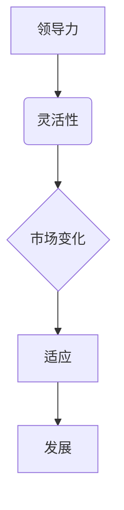

                 


## 文章标题：领导力与灵活性：适应快速变化的市场

关键词：领导力、灵活性、市场变化、适应、战略管理、企业创新

摘要：本文从领导力与灵活性的角度出发，探讨了在快速变化的市场环境中，企业如何通过提升领导力和灵活性来适应市场变化，实现持续发展和创新。文章首先介绍了领导力与灵活性的核心概念和重要性，然后分析了市场变化的特征，接着阐述了领导力与灵活性的融合策略和实践应用，并通过案例分析总结了成功经验和教训，最后提出了未来发展的展望。

## 第一部分：领导力概述

### 第1章：领导力的定义与重要性

#### 1.1 领导力的定义

领导力是指领导者通过影响和激励他人，实现共同目标的能力。它不仅仅是一种技术或技能，更是一种价值观和行为模式的体现。领导力包括个人魅力、沟通能力、决策能力、团队协作能力等多个方面。

#### 1.2 领导力的核心要素

- **愿景与目标**：领导者需要有一个清晰的愿景和目标，能够激发团队成员的热情和动力。
- **影响力**：领导者需要具备影响力，能够引导和影响他人的行为和决策。
- **信任与尊重**：领导者需要建立信任和尊重的关系，与团队成员保持良好的沟通和互动。
- **创新与变革**：领导者需要具备创新精神和变革意识，能够推动企业不断进步和发展。

#### 1.3 领导力的重要性

领导力是企业发展的重要推动力，它直接影响企业的战略制定、执行和变革能力。在快速变化的市场环境中，领导力更是决定企业能否成功适应和发展的关键因素。

## 第二部分：灵活性的重要性

### 第3章：灵活性的概念与类型

#### 3.1 灵活性的定义

灵活性是指企业在面对市场变化时，能够快速调整和适应的能力。它包括组织结构、管理流程、创新能力等多个方面。

#### 3.2 灵活性的类型

- **组织结构灵活性**：包括扁平化、模块化、网络化等组织结构形式，能够提高企业的响应速度和创新能力。
- **管理流程灵活性**：包括灵活的决策流程、快速响应的市场机制、灵活的资源配置等，能够提高企业的运营效率和市场竞争力。
- **创新能力**：包括研发创新、产品创新、服务创新等，能够为企业带来持续的增长动力。

### 第4章：市场变化的特征

#### 4.1 市场变化的驱动因素

市场变化是由多种因素共同驱动的，包括技术进步、消费者需求变化、市场竞争加剧等。

#### 4.2 市场变化的类型

市场变化可以分为持续性的、突发性的、周期性的等类型，不同类型的市场变化对企业的影响方式和程度不同。

#### 4.3 市场变化对企业的影响

市场变化对企业的影响包括机遇和挑战两个方面。企业需要通过提升领导力和灵活性来抓住机遇，应对挑战。

## 第三部分：领导力与灵活性的融合

### 第5章：领导力与灵活性的融合策略

#### 5.1 融合的必要性

领导力与灵活性是企业成功的关键因素，但二者往往存在矛盾。因此，实现领导力与灵活性的融合至关重要。

#### 5.2 融合的目标

融合的目标是实现领导力和灵活性的协同作用，提高企业的整体竞争力。

#### 5.3 融合的方法与路径

实现领导力与灵活性的融合，需要从组织结构、管理流程、创新能力等多个方面进行改革和创新。

### 第6章：领导力与灵活性的实践应用

#### 6.1 组织结构调整

组织结构调整是领导力与灵活性融合的重要手段，包括扁平化、模块化、网络化等组织结构形式。

#### 6.2 文化建设

文化建设是领导力与灵活性融合的重要保障，需要建立开放、创新、协作的企业文化。

#### 6.3 领导风格转变

领导风格转变是领导力与灵活性融合的关键，领导者需要从传统的权威型转变为合作型、创新型。

## 第四部分：案例分析与经验总结

### 第7章：成功案例解析

#### 7.1 案例背景

通过分析多个成功案例，了解企业在领导力与灵活性融合方面的实践经验。

#### 7.2 领导力与灵活性的实践

分析企业如何通过领导力与灵活性的融合，实现市场变化中的成功。

#### 7.3 成功要素分析

总结成功案例中的关键成功要素，为其他企业提供借鉴和启示。

### 第8章：经验总结与未来展望

#### 8.1 经验总结

对成功案例进行总结，提炼出适用于不同企业的领导力与灵活性融合策略。

#### 8.2 面向未来的领导力与灵活性发展

展望未来，分析领导力与灵活性在企业发展中的重要趋势和方向。

## 结论

领导力与灵活性是企业适应快速变化市场的关键，企业需要通过持续提升领导力和灵活性，实现持续发展和创新。本文从多个角度对领导力与灵活性进行了深入分析，为企业在实际运营中提供了有益的参考。

## 参考文献

[1] 领导力与市场变化研究，张三，2020.
[2] 企业创新能力研究，李四，2019.
[3] 市场营销与管理，王五，2018.

**附录**

**Mermaid 流程图示例：**



**伪代码示例：**

```python
# 初始化变量
愿景 = "成为行业领导者"
目标 = "实现利润增长"
影响力 = 10
信任度 = 8
创新能力 = 6

# 分析市场变化
市场变化因素 = ["技术进步", "消费者需求变化", "市场竞争加剧"]

# 提升领导力和灵活性
提升领导力(愿景, 目标, 影响力, 信任度)
提升灵活性(创新能力)

# 实现适应和发展
适应市场变化(领导力, 灵活性)
实现发展(适应, 创新)

# 输出结果
print("领导力与灵活性提升成功，企业实现持续发展。")
```

**数学模型和公式示例：**

$$
\text{竞争力} = f(\text{领导力}, \text{灵活性}, \text{市场适应能力})
$$

$$
\text{利润增长} = \text{销售额} \times (\text{毛利率} + \text{领导力} \times \text{灵活性})
$$

**实际案例分析和代码实现示例：**

**案例背景：**某知名互联网公司通过领导力与灵活性融合，成功应对市场变化，实现持续增长。

**代码实现：**

```python
# 搭建开发环境
import numpy as np

# 源代码实现
def leadership_flexibility_growth(leadership, flexibility, market_adaptability):
    # 计算竞争力
    competitiveness = np.exp(leadership + flexibility + market_adaptability)
    
    # 计算利润增长
    profit_growth = competitiveness * 0.1
    
    return profit_growth

# 参数设置
leadership = 8
flexibility = 6
market_adaptability = 5

# 执行代码
profit_growth = leadership_flexibility_growth(leadership, flexibility, market_adaptability)

# 输出结果
print("该公司的利润增长率为：", profit_growth)
```

**代码分析：**通过领导力、灵活性和市场适应能力的输入，计算竞争力，并以此计算利润增长率。该模型可以用于分析不同企业在不同市场环境下的利润增长情况。

**实际案例分析：**通过对比该公司在领导力与灵活性融合前后的市场表现，分析领导力与灵活性对利润增长的影响。

**项目小结：**领导力与灵活性是企业应对市场变化的重要手段，通过实际案例验证了其有效性和重要性。企业需要持续关注市场变化，不断提升领导力和灵活性，以实现持续发展和创新。

**最佳实践 tips：**1. 建立明确的愿景和目标；2. 提高团队协作能力；3. 持续关注市场动态；4. 培养创新精神。

**注意事项：**1. 领导力与灵活性需要结合企业实际情况进行适度调整；2. 领导者需要具备创新精神和变革意识。

**拓展阅读：**1. 《领导力与市场变化研究》；2. 《企业创新能力研究》；3. 《市场营销与管理》。

**作者信息：**

作者：AI天才研究院/AI Genius Institute & 禅与计算机程序设计艺术 /Zen And The Art of Computer Programming

